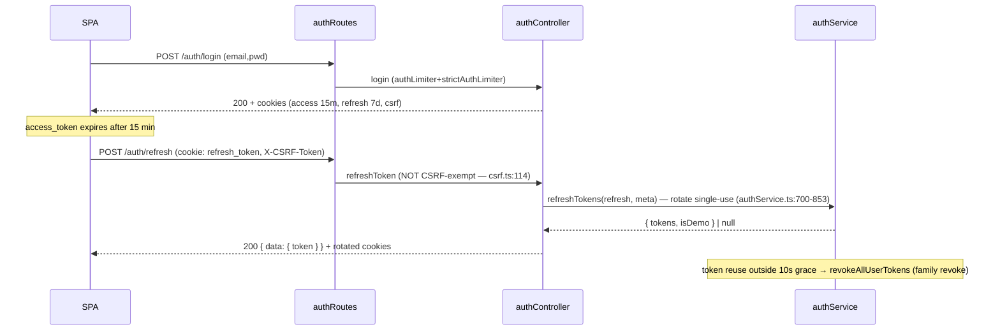
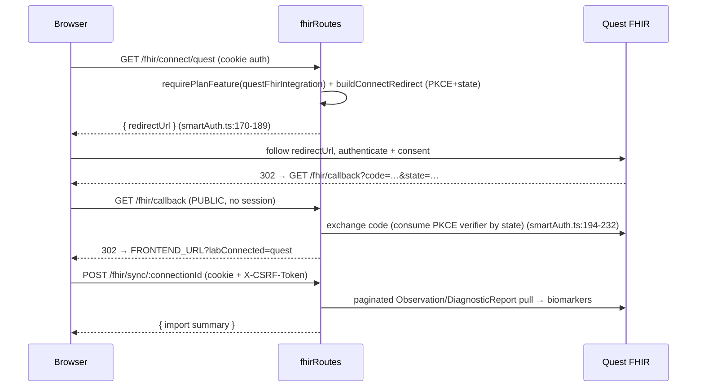

# API_REFERENCE.md

> **Contract-facing reference for every OwnMyHealth API endpoint.** A reader with only this doc can call any endpoint with a working `curl`, knows the request + response shapes, the errors it can return, and what PHI it exposes.
>
> The **middleware-chain lens** (security stack per route) lives in [`ROUTING_TABLE.md`](./ROUTING_TABLE.md); the two docs cross-link heavily. The **per-field PHI lens** lives in [`PHI_TAXONOMY.md`](./PHI_TAXONOMY.md).
>
> **Code state:** `master` @ `12b45ae` · **Refreshed:** 2026-08-01 (previous: `fb2cd32`, 2026-06-15)
> **Posture:** sandbox — no GCP (billing disabled ~2026-07-12; no deployment target, founder/test data only), declared 2026-07-14. See [`OPEN_FINDINGS.md` §Posture](./OPEN_FINDINGS.md).
>
> **Re-verified 2026-08-01 — the HTTP contract did not change.** Two notes:
> 1. `POST /api/v1/auth/register` now requires a validated `acceptedTerms` boolean at the API boundary
>    (OMH-L03, `0456c50`); the server stamps `users.terms_accepted_at` and `users.terms_version` on success.
> 2. `GET /api/v1/files/:id/download` is unchanged as a contract, but the bytes now come from whichever
>    storage backend is active (`gcs` or the local encrypted disk — OF-23). It remains a backend stream
>    proxy for both; there is still no signed-URL egress path. See
>    [`ARCHITECTURE.md`](./ARCHITECTURE.md) §13.0. Every non-trivial claim cites `file:line`.

---

## Required reading before generating

Before writing a single line, read:

1. [`_doc-quality.md`](../prompts/_doc-quality.md) — self-containedness, citation, TBD, cross-link, and format rules.
2. [`_verification-tools.md`](../prompts/_verification-tools.md) — Grep/Glob/Read cheat sheet.
3. [`_phi-inventory.md`](../prompts/_phi-inventory.md) — when PHI surface touches this doc.

This doc passes the five tests in `_doc-quality.md` (question-answering, path-and-line, snippet, diagram, reproducibility).

---

## 1. Base URL + auth model

### 1.1 Base URL per environment

| Env | Base URL | Source |
|---|---|---|
| Production | `https://api.ownmyhealth.io/api/v1` | `.github/workflows/deploy.yml:279` (health probe) + `:330` (`VITE_API_URL`) |
| Staging | `https://api-staging.ownmyhealth.io/api/v1` | `.github/workflows/deploy-staging.yml:94` |
| Local dev | `http://localhost:3001/api/v1` | `PORT` default `3001` (`config/index.ts:100`); frontend default `VITE_API_URL=http://localhost:3001` (`.env.example:15`) |

All routes are mounted under `/api/${config.apiVersion}` where `apiVersion` is `v1` — `app.ts:265` (`app.use(\`/api/${config.apiVersion}\`, routes)`). The internal/maintenance router is mounted separately at `/api/v1/internal` — `app.ts:269`.

### 1.2 Credentials: cookie vs Bearer

OwnMyHealth uses **HTTP-only cookies** for the browser SPA and supports a **Bearer access token** for the SSE AI-chat endpoint. Cookie names (set in `authController.ts:95-153`):

| Cookie | httpOnly | Set by | Lifetime | Purpose |
|---|---|---|---|---|
| `access_token` | yes | login/refresh | 15 min (`config/index.ts:121,149`) | Access JWT (HS256, `JWT_ACCESS_SECRET`) |
| `refresh_token` | yes | login/refresh | 7 days (30 days demo) (`config/index.ts:125,152`) | Refresh JWT; DB-backed `sessions` row keyed by its `jti` |
| `csrf_token` | **no** (JS-readable) | login/refresh/`/csrf-token` | tied to refresh lifetime (`csrf.ts:47-51`) | CSRF double-submit value |

`secure` and `sameSite` are resolved together: `sameSite` = explicit `COOKIE_SAME_SITE` → else `'none'` if `COOKIE_DOMAIN` set → else `'strict'` in production same-domain → else `'lax'` in dev (`config/index.ts:88-90, 140-147`); `secure` is forced `true` in production/staging/`sameSite==='none'`/any `COOKIE_DOMAIN` deploy (`config/index.ts:91-95, 138`). See [`ARCHITECTURE.md#auth-flow`](./ARCHITECTURE.md) and [`ENV_VARS.md`](./ENV_VARS.md).

### 1.3 How `X-CSRF-Token` flows (double-submit cookie)

CSRF is a **stateless double-submit cookie** — there is no server-side CSRF secret (`csrf.ts`). On a state-changing request (`POST/PUT/PATCH/DELETE`), the client must send the `X-CSRF-Token` header equal to the `csrf_token` cookie value; `validateCsrfToken` compares them constant-time (SHA-256 then `timingSafeEqual`) — `csrf.ts:172-183`. The SPA reads `csrf_token` via `document.cookie` (it is `httpOnly:false`, `csrf.ts:43`) and echoes it back in the header.

```
Browser                              Backend (app.ts global middleware)
  │  POST /api/v1/biomarkers
  │  Cookie: access_token=…; csrf_token=T   csrfProtection (app.ts:216)
  │  X-CSRF-Token: T                ───────▶  header === cookie?  (csrf.ts:172-183)
  │                                            ├─ no  → 403 FORBIDDEN ("CSRF token missing" / "Invalid CSRF token")
  │                                            └─ yes → authenticate → route handler
```

**CSRF-exempt routes** (strict `===` match on the normalized path, hardened in M-2 — `csrf.ts:100-156`): `/auth/login`, `/auth/register`, `/auth/demo`, `/auth/forgot-password`, `/auth/reset-password`, `/auth/verify-email`, `/auth/resend-verification`, marketplace search, `/ai/chat` (Bearer-only via `requireBearerAuth`), and `/internal/audit-cleanup` (shared secret). Note **`/auth/refresh` is NOT exempt** (RT-Low — `csrf.ts:114-123`) and **upload routes are NOT exempt** (`csrf.ts:147-152`). A fresh token is available at `GET /api/v1/csrf-token` (`app.ts:284`, returns `{ success, data: { csrfToken } }` — `csrf.ts:217-226`).

> The global `csrfProtection` runs before routes (`app.ts:216`). It can be skipped only in dev when `DISABLE_CSRF=true` (`app.ts:215`, `csrf.ts:159`). A few routers additionally apply `csrfProtection` inline as belt-and-suspenders (expenses, FHIR sync/delete) — that is redundant with the global gate, not a second mechanism.

---

## 2. Error envelope

Every error response uses one shape, built in `errorHandler` (`errorHandler.ts:199-210`):

```ts
// Source: backend/src/middleware/errorHandler.ts:L199-L210
const response: ApiResponse = {
  success: false,
  error: {
    code,
    message,
    ...(details ? { details } : {}),                       // ValidationError only
    ...(config.isDevelopment ? { stack: err.stack } : {}), // dev only
  },
};
res.status(statusCode).json(response);
```

In production the `message` for any non-`AppError` (unexpected 500) is replaced by the generic `'An unexpected error occurred. Please try again later.'` (`errorHandler.ts:105, 144`); `stack` is never included outside development.

### 2.1 All error `code` values

Derived from the `AppError` subclasses (`errorHandler.ts:29-102`), the Prisma/JWT/JSON/Multer maps (`errorHandler.ts:109-175`), the 8 rate-limiter `code` strings (`rateLimiter.ts`), the plan-gating gate (`planGating.ts`), and inline controller throws. **30 distinct codes** (see [`ERROR_RECOVERY.md`](./ERROR_RECOVERY.md) for recovery playbooks). Note CSRF failures reuse `FORBIDDEN`, so there is no dedicated CSRF code:

| `code` | HTTP | Origin (file:line) | When |
|---|---|---|---|
| `BAD_REQUEST` | 400 | `errorHandler.ts:31` (`BadRequestError`) | Malformed request, also Prisma `P2003`/`P2014` (`errorHandler.ts:112-113`) |
| `UNAUTHORIZED` | 401 | `errorHandler.ts:37` (`UnauthorizedError`) | Missing/invalid auth, default JWT failure (`errorHandler.ts:127`) |
| `AUTHENTICATION_FAILED` | 401 | `errorHandler.ts:43` (`AuthenticationError`) | Auth verification failed |
| `FORBIDDEN` | 403 | `errorHandler.ts:49` (`ForbiddenError`) | RBAC denial, demo block, consent failure |
| `NOT_FOUND` | 404 | `errorHandler.ts:55` (`NotFoundError`); Prisma `P2025` (`errorHandler.ts:111`) | Resource not found / unknown route (`errorHandler.ts:215`) |
| `CONFLICT` | 409 | `errorHandler.ts:61` (`ConflictError`); Prisma `P2002` (`errorHandler.ts:110`) | Unique-constraint clash |
| `VALIDATION_ERROR` | 422 | `errorHandler.ts:69` (`ValidationError`) | Zod schema fails (carries `details`) |
| `RATE_LIMIT_EXCEEDED` | 429 | `errorHandler.ts:76` (`RateLimitError`); `standardLimiter` (`rateLimiter.ts:73`) | Global limiter exceeded |
| `INTERNAL_ERROR` | 500 | `errorHandler.ts:82` (`InternalServerError`), default (`errorHandler.ts:143`) | Unhandled server error |
| `SERVICE_UNAVAILABLE` | 503 | `errorHandler.ts:88` (`ServiceUnavailableError`) | `aiSpendGuard` budget/store fail-closed (`aiSpendGuard.ts:60-67`); BAA gate (`biomarkerRoutes.ts:160`) |
| `DATABASE_ERROR` | 500 | `errorHandler.ts:94` (`DatabaseError`); Prisma default (`errorHandler.ts:116`) | DB op failed |
| `EXTERNAL_SERVICE_ERROR` | 502 | `errorHandler.ts:100` (`ExternalServiceError`) | Upstream (Claude/GCS/FHIR) failure |
| `INVALID_TOKEN` | 401 | `errorHandler.ts:123` (`JsonWebTokenError`) | Malformed JWT |
| `TOKEN_EXPIRED` | 401 | `errorHandler.ts:124` (`TokenExpiredError`) | Expired JWT |
| `INVALID_JSON` | 400 | `errorHandler.ts:164` (`SyntaxError` body) | Body is not valid JSON |
| `FILE_TOO_LARGE` | 413 | `errorHandler.ts:171` (Multer `LIMIT_FILE_SIZE`) | Upload > 10 MB |
| `UPLOAD_ERROR` | 400 | `errorHandler.ts:173` (other Multer error) | Wrong field / too many files |
| `PLAN_LIMIT_EXCEEDED` | 403 | `planGating.ts:104` | Plan limit/feature gate (carries `limit`, `current`, `feature`, `upgradeRequired`) |
| `AUTH_RATE_LIMIT_EXCEEDED` | 429 | `rateLimiter.ts:95` (`authLimiter`) | Auth-router limiter |
| `LOGIN_RATE_LIMIT_EXCEEDED` | 429 | `rateLimiter.ts:112` (`strictAuthLimiter`) | Login brute-force limiter |
| `UPLOAD_RATE_LIMIT_EXCEEDED` | 429 | `rateLimiter.ts:141` (`uploadLimiter`) | Upload limiter |
| `SENSITIVE_RATE_LIMIT_EXCEEDED` | 429 | `rateLimiter.ts:158` (`sensitiveLimiter`) | Export/delete/FHIR limiter |
| `AI_RATE_LIMIT_EXCEEDED` | 429 | `rateLimiter.ts:184` (`aiLimiter`) | AI endpoints limiter |
| `PROVIDER_REQUEST_RATE_LIMIT_EXCEEDED` | 429 | `rateLimiter.ts:218` (`providerAccessRequestLimiter`) | Provider access-request limiter |
| `BULK_RATE_LIMIT_EXCEEDED` | 429 | `rateLimiter.ts:247` (`bulkOperationLimiter`) | Batch creates/imports |
| `EMAIL_NOT_VERIFIED` | 403 | `authController.ts:297` | Login with unverified email |
| `ACCOUNT_LOCKED` | 423 | `authController.ts:318` | Login with correct creds while locked |
| `GATEWAY_TIMEOUT` | 504 | `biomarkerRoutes.ts:303` | AI guidance call timed out |
| `AI_GUIDANCE_FAILED` | 500 | `biomarkerRoutes.ts:312` | AI guidance call failed |
| `STORAGE_READ_FAILED` | 502 | `fileController.ts:295` | GCS stream error during file download |

> **CSRF failures use the generic `FORBIDDEN` (403) code**, not a custom code: a missing/mismatched `X-CSRF-Token` throws `ForbiddenError('CSRF token missing')` / `ForbiddenError('Invalid CSRF token')` (`csrf.ts:169,182`), which the error handler maps to `code: 'FORBIDDEN'`. The distinguishing signal is the `message`, not the `code`.

---

## 3. Global rate limits

All 8 limiters are backed by `rateLimitStore.ts` — a shared Redis store when `REDIS_URL` is set, otherwise per-instance `MemoryStore`, so on Cloud Run with N instances the effective ceiling is N×limit (`rateLimiter.ts:56-63`). `standardLimiter` is applied globally to every `/api` request (`app.ts:220`); the rest are per-route.

| Limiter | Window | Max | Key | File:line | Applied to |
|---|---|---|---|---|---|
| `standardLimiter` | `RATE_LIMIT_WINDOW_MS` (def 15 min) | `RATE_LIMIT_MAX_REQUESTS` (def 100) | IP (/64 for IPv6) | `rateLimiter.ts:66` | All `/api/*` globally (`app.ts:220`) |
| `authLimiter` | 15 min | 20 | IP | `rateLimiter.ts:88` | Whole `authRoutes` router (`authRoutes.ts:34`) |
| `strictAuthLimiter` | 15 min | 5 (failed-only, `skipSuccessfulRequests`) | `email:IP` | `rateLimiter.ts:105` | `/auth/login`, `/forgot-password`, `/reset-password`, `/resend-verification`, `/confirm-email-change`, `/change-email` |
| `uploadLimiter` | 1 hour | 20 | IP | `rateLimiter.ts:134` | All `uploadRoutes` (`uploadRoutes.ts:27`) + insurance SBC/reanalyze |
| `sensitiveLimiter` | 1 hour | 10 | user ID → IP | `rateLimiter.ts:151` | Settings export/delete, file download, FHIR connect/sync/delete, admin permanent-delete |
| `aiLimiter` | 1 hour | 10 | user ID → IP | `rateLimiter.ts:177` | `/ai/chat`, uploads, biomarker guidance, expense analyze, SBC upload/reanalyze, goal suggestions, health-needs analyze |
| `providerAccessRequestLimiter` | 1 hour | 10 | user ID → IP | `rateLimiter.ts:211` | `POST /provider/patients/request` |
| `bulkOperationLimiter` | 1 hour | 30 | IP | `rateLimiter.ts:240` | `POST /biomarkers/batch` |

```ts
// Source: backend/src/middleware/rateLimiter.ts:L105-L118 (strictAuthLimiter)
export const strictAuthLimiter = rateLimit({
  store: createRateLimitStore('strict-auth'),
  windowMs: 15 * 60 * 1000, // 15 minutes
  max: 5, // Only 5 login attempts per window
  message: { success: false, error: { code: 'LOGIN_RATE_LIMIT_EXCEEDED', message: 'Too many login attempts. Please try again in 15 minutes.' } } as ApiResponse,
  standardHeaders: true,
  legacyHeaders: false,
  skipSuccessfulRequests: true, // Only count failed attempts
```

---

## 4. At-a-glance mega-table

All 111 endpoints (one row each; the `GET /ai/chat` line is an annotation, not an endpoint). **RLS wrap** = handler wraps DB calls in `withRLSContext`/`withRLSTransaction` (patient context) or admin context `withRLSContext(null, …, { isAdmin: true })`. **Audit** = the typed wrapper called (`logCreate`→`CREATE`, `logRead`/`logAccess`→`READ`/`VIEW`/`PHI_ACCESS`, `logUpdate`→`UPDATE`, `logDelete`→`DELETE`, `logAuth`→`LOGIN`/`LOGOUT`/`CREATE`/`UPDATE`, `logExport`→`EXPORT`; the `AuditAction` enum is generic — `schema.prisma:652-671` — there are no domain actions like `BIOMARKER_CREATE`).

| Method | Path | Auth | CSRF | Rate limiter | RBAC | RLS wrap | Handler (`file:line`) | Audit | PHI ret? |
|---|---|---|---|---|---|---|---|---|---|
| POST | `/auth/register` | public | exempt | `authLimiter` | — | admin | `authController.register:175` | `REGISTER`→CREATE | none |
| POST | `/auth/login` | public | exempt | `authLimiter`+`strictAuthLimiter` | — | — | `authController.login:270` | `LOGIN` | none |
| POST | `/auth/refresh` | cookie | **yes** | `authLimiter` | — | tx | `authController.refreshToken:395` | `LOGIN_FAILED` on reuse | none |
| POST | `/auth/demo` | public | exempt | `authLimiter` | — | — | `authController.demoLogin:659` | — | none |
| GET | `/auth/verify-email` | public | exempt(GET) | `authLimiter` | — | — | `authController.verifyEmail:706` | `EMAIL_VERIFICATION`→UPDATE | none |
| POST | `/auth/resend-verification` | public | exempt | `authLimiter`+`strictAuthLimiter` | — | — | `authController.resendVerification:760` | — | none |
| POST | `/auth/forgot-password` | public | exempt | `authLimiter`+`strictAuthLimiter` | — | — | `authController.forgotPassword:800` | `PASSWORD_RESET_REQUEST`→UPDATE | none |
| POST | `/auth/reset-password` | public | exempt | `authLimiter`+`strictAuthLimiter` | — | — | `authController.resetPasswordHandler:839` | `PASSWORD_RESET_COMPLETE`→UPDATE | none |
| GET | `/auth/confirm-email-change` | public | exempt(GET) | `authLimiter`+`strictAuthLimiter` | — | — | `authController.confirmEmailChangeHandler:960` | `EMAIL_CHANGE_COMPLETE`→UPDATE | none |
| POST | `/auth/logout` | optional | yes | `authLimiter` | — | — | `authController.logout:439` | `LOGOUT` | none |
| POST | `/auth/logout-all` | yes | yes | `authLimiter` | — | — | `authController.logoutAll:508` | `LOGOUT` | none |
| GET | `/auth/me` | yes | no(GET) | `authLimiter` | — | — | `authController.getCurrentUser:542` | — | none |
| POST | `/auth/change-password` | yes | yes | `authLimiter` | — | — | `authController.changePassword:569` | `PASSWORD_CHANGE`→UPDATE | none |
| POST | `/auth/change-email` | yes | yes | `authLimiter`+`strictAuthLimiter` | — | — | `authController.changeEmailHandler:901` | `EMAIL_CHANGE_REQUEST`→UPDATE | none |
| GET | `/biomarkers` | yes | no(GET) | `standardLimiter` | — | tx | `biomarkerController.getBiomarkers:143` | `logAccess`→READ | **yes** |
| GET | `/biomarkers/summary` | yes | no(GET) | `standardLimiter` | — | tx | `biomarkerController.getSummary` | `logAccess`→READ | derived |
| GET | `/biomarkers/categories` | yes | no(GET) | `standardLimiter` | — | tx | `biomarkerController.getCategories` | — | none |
| GET | `/biomarkers/:id` | yes | no(GET) | `standardLimiter` | — | tx | `biomarkerController.getBiomarker` | `logAccess`→READ | **yes** |
| GET | `/biomarkers/:id/history` | yes | no(GET) | `standardLimiter` | — | tx | `biomarkerController.getHistory` | `logAccess`→READ | **yes** |
| POST | `/biomarkers` | yes | yes | `standardLimiter` | — | tx | `biomarkerController.createBiomarker:260` | `logCreate`→CREATE | **yes** |
| POST | `/biomarkers/batch` | yes | yes | `bulkOperationLimiter` | — | tx | `biomarkerController.bulkCreateBiomarkers:498` | `logCreate`→CREATE | **yes** |
| PATCH | `/biomarkers/:id` | yes | yes | `standardLimiter` | — | tx | `biomarkerController.updateBiomarker:323` | `logUpdate`→UPDATE | **yes** |
| DELETE | `/biomarkers/:id` | yes | yes | `standardLimiter` | — | tx | `biomarkerController.deleteBiomarker` | `logDelete`→DELETE | none |
| POST | `/biomarkers/:id/guidance` | yes | yes | `aiLimiter`+`aiSpendGuard` | — | tx | `biomarkerRoutes.ts:140` (inline) | `logAccess`→PHI_ACCESS | educational |
| GET | `/insurance/plans` | yes | no(GET) | `standardLimiter` | — | ctx | `insuranceController.getInsurancePlans` | `logAccess`→READ | **yes** |
| GET | `/insurance/plans/:id` | yes | no(GET) | `standardLimiter` | — | ctx | `insuranceController.getInsurancePlan` | `logAccess`→READ | **yes** |
| POST | `/insurance/plans` | yes | yes | `standardLimiter`+plan(`insurancePlans`) | — | ctx | `insuranceController.createInsurancePlan:507` | `logCreate`→CREATE | **yes** |
| PATCH | `/insurance/plans/:id` | yes | yes | `standardLimiter` | — | ctx | `insuranceController.updateInsurancePlan` | `logUpdate`→UPDATE | **yes** |
| DELETE | `/insurance/plans/:id` | yes | yes | `standardLimiter` | — | ctx | `insuranceController.deleteInsurancePlan` | `logDelete`→DELETE | none |
| POST | `/insurance/compare` | yes | yes | `standardLimiter` | — | ctx | `insuranceController.comparePlans` | `logAccess`→READ | **yes** |
| GET | `/insurance/benefits/search` | yes | no(GET) | `standardLimiter` | — | ctx | `insuranceController.searchBenefits` | `logAccess`→READ | **yes** |
| PUT | `/insurance/plans/:id/reanalyze` | yes | yes | `uploadLimiter`+`aiLimiter`+`aiSpendGuard`+plan | — | ctx | `upload/sbcUploadController.reanalyzePlan` | `logUpdate`→UPDATE | **yes** |
| POST | `/insurance/upload-sbc` | yes | yes | `uploadLimiter`+`aiLimiter`+`aiSpendGuard`+plan | — | ctx | `upload/sbcUploadController.uploadSBC` | `logCreate`→CREATE | **yes** |
| PUT | `/insurance/plans/:id/spending` | yes | yes | `standardLimiter` | — | ctx | `expenseController.updateCurrentSpending` | `logUpdate`→UPDATE | **yes** |
| GET | `/expenses/projections` | yes | no(GET) | `standardLimiter` | — | ctx | `expenseController.getProjections` | `logAccess`→READ | **yes** |
| POST | `/expenses/projections` | yes | yes (inline) | `standardLimiter` | — | ctx | `expenseController.createProjection` | `logCreate`→CREATE | **yes** |
| PUT | `/expenses/projections/:id` | yes | yes (inline) | `standardLimiter` | — | ctx | `expenseController.updateProjection` | `logUpdate`→UPDATE | **yes** |
| DELETE | `/expenses/projections/:id` | yes | yes (inline) | `standardLimiter` | — | ctx | `expenseController.deleteProjection` | `logDelete`→DELETE | none |
| GET | `/expenses/actuals` | yes | no(GET) | `standardLimiter` | — | ctx | `expenseController.getActuals` | `logAccess`→READ | **yes** |
| POST | `/expenses/actuals` | yes | yes (inline) | `standardLimiter` | — | ctx | `expenseController.createActual` | `logCreate`→CREATE | **yes** |
| PUT | `/expenses/actuals/:id` | yes | yes (inline) | `standardLimiter` | — | ctx | `expenseController.updateActual` | `logUpdate`→UPDATE | **yes** |
| DELETE | `/expenses/actuals/:id` | yes | yes (inline) | `standardLimiter` | — | ctx | `expenseController.deleteActual` | `logDelete`→DELETE | none |
| POST | `/expenses/analyze` | yes | yes (inline) | `aiLimiter`+`aiSpendGuard`+plan(`costAnalysisPerMonth`) | — | ctx | `expenseController.analyzeCosts` | `logCreate`→CREATE | **yes** |
| GET | `/expenses/analyses` | yes | no(GET) | `standardLimiter` | — | ctx | `expenseController.getAnalyses` | `logAccess`→READ | **yes** |
| GET | `/health-needs` | yes | no(GET) | `standardLimiter` | — | ctx | `healthNeedsController.getHealthNeeds` | `logAccess`→READ | **yes** |
| GET | `/health-needs/analyze` | yes | no(GET) | `aiLimiter` | — | ctx | `healthNeedsController.analyzeHealthNeeds` | `logAccess`→READ | **yes** |
| GET | `/health-needs/summary` | yes | no(GET) | `standardLimiter` | — | ctx | `healthNeedsController.getHealthNeedsSummary` | — | derived |
| GET | `/health-needs/:id` | yes | no(GET) | `standardLimiter` | — | ctx | `healthNeedsController.getHealthNeed` | `logAccess`→READ | **yes** |
| POST | `/health-needs` | yes | yes | `standardLimiter` | — | ctx | `healthNeedsController.createHealthNeed` | `logCreate`→CREATE | **yes** |
| PATCH | `/health-needs/:id` | yes | yes | `standardLimiter` | — | ctx | `healthNeedsController.updateHealthNeedStatus` | `logUpdate`→UPDATE | **yes** |
| DELETE | `/health-needs/:id` | yes | yes | `standardLimiter` | — | ctx | `healthNeedsController.deleteHealthNeed` | `logDelete`→DELETE | none |
| GET | `/health-goals/summary` | yes | no(GET) | `standardLimiter` | — | ctx | `healthGoalsController.getGoalsSummary` | — | derived |
| GET | `/health-goals/suggestions` | yes | no(GET) | `aiLimiter` | — | ctx | `healthGoalsController.suggestGoals` | `logAccess`→READ | educational |
| GET | `/health-goals` | yes | no(GET) | `standardLimiter` | — | ctx | `healthGoalsController.getHealthGoals` | `logAccess`→READ | **yes** |
| GET | `/health-goals/:id` | yes | no(GET) | `standardLimiter` | — | ctx | `healthGoalsController.getHealthGoal` | `logAccess`→READ | **yes** |
| POST | `/health-goals` | yes | yes | `standardLimiter` | — | ctx | `healthGoalsController.createHealthGoal` | `logCreate`→CREATE | **yes** |
| PUT | `/health-goals/:id` | yes | yes | `standardLimiter` | — | ctx | `healthGoalsController.updateHealthGoal` | `logUpdate`→UPDATE | **yes** |
| PATCH | `/health-goals/:id/progress` | yes | yes | `standardLimiter` | — | ctx | `healthGoalsController.updateGoalProgress` | `logUpdate`→UPDATE | **yes** |
| DELETE | `/health-goals/:id` | yes | yes | `standardLimiter` | — | ctx | `healthGoalsController.deleteHealthGoal` | `logDelete`→DELETE | none |
| POST | `/upload/lab-report` | yes | yes | `uploadLimiter`+`aiLimiter`+`aiSpendGuard`+plan×2 | — | ctx | `upload/labUploadController.uploadLabReport` | `logCreate`→CREATE | **yes** |
| POST | `/upload/insurance-sbc` | yes | yes | `uploadLimiter`+`aiLimiter`+`aiSpendGuard`+plan | — | ctx | `upload/sbcUploadController.uploadSBC` | `logCreate`→CREATE | **yes** |
| POST | `/upload/lab-results-ocr` | yes | yes | `uploadLimiter`+`aiLimiter`+`aiSpendGuard`+plan×2 | — | ctx | `upload/labUploadController.uploadLabResultOCR` | `logCreate`→CREATE | **yes** |
| GET | `/files` | yes | no(GET) | `standardLimiter` | — | tx | `fileController.getFiles:44` | `logAccess`→READ | **yes (filename)** |
| GET | `/files/:id` | yes | no(GET) | `standardLimiter` | — | tx | `fileController.getFile:138` | `logAccess`→READ | **yes (filename)** |
| GET | `/files/:id/download` | yes | no(GET) | `sensitiveLimiter` | — | tx | `fileController.getFileDownloadUrl:212` | `logExport`→EXPORT | **yes (file bytes)** |
| DELETE | `/files/:id` | yes | yes | `standardLimiter` | — | tx | `fileController.deleteFile:310` | `logDelete`→DELETE | none |
| GET | `/provider/patients` | yes | no(GET) | `standardLimiter` | **PROVIDER/ADMIN** | ctx | `providerRoutes.ts:53` (inline) | `logAccess`→READ | patient email |
| POST | `/provider/patients/request` | yes | yes | `providerAccessRequestLimiter` | **PROVIDER/ADMIN** | ctx | `providerRoutes.ts:171` (inline) | `logCreate`→CREATE | none (uniform) |
| GET | `/provider/patients/:patientId` | yes | no(GET) | `standardLimiter` | **PROVIDER/ADMIN** | ctx | `providerRoutes.ts:319` (inline) | `logAccess`→READ | patient email |
| GET | `/provider/patients/:patientId/biomarkers` | yes | no(GET) | `standardLimiter` | **PROVIDER/ADMIN** | ctx | `providerRoutes.ts:442` (inline) | `logAccess`→PHI_ACCESS | **yes** |
| GET | `/provider/patients/:patientId/health-needs` | yes | no(GET) | `standardLimiter` | **PROVIDER/ADMIN** | ctx | `providerRoutes.ts:526` (inline) | `logAccess`→PHI_ACCESS | **yes** |
| GET | `/provider/patients/:patientId/insurance` | yes | no(GET) | `standardLimiter` | **PROVIDER/ADMIN** | ctx | `providerRoutes.ts:602` (inline) | `logAccess`→PHI_ACCESS | **yes** |
| DELETE | `/provider/patients/:patientId` | yes | yes | `standardLimiter` | **PROVIDER/ADMIN** | ctx | `providerRoutes.ts:659` (inline) | `logDelete`→DELETE | none |
| GET | `/patient/providers` | yes | no(GET) | `standardLimiter` | **PATIENT** | ctx | `patientRoutes.ts:30` (inline) | `logAccess`→READ | provider email |
| GET | `/patient/providers/pending` | yes | no(GET) | `standardLimiter` | **PATIENT** | ctx | `patientRoutes.ts:109` (inline) | `logAccess`→READ | provider email |
| POST | `/patient/providers/:id/approve` | yes | yes | `standardLimiter` | **PATIENT** | ctx | `patientRoutes.ts:180` (inline) | `logUpdate`→UPDATE | none |
| POST | `/patient/providers/:id/deny` | yes | yes | `standardLimiter` | **PATIENT** | ctx | `patientRoutes.ts:273` (inline) | `logUpdate`→UPDATE | none |
| PATCH | `/patient/providers/:id` | yes | yes | `standardLimiter` | **PATIENT** | ctx | `patientRoutes.ts:330` (inline) | `logUpdate`→UPDATE | none |
| POST | `/patient/providers/:id/revoke` | yes | yes | `standardLimiter` | **PATIENT** | ctx | `patientRoutes.ts:422` (inline) | `logUpdate`→UPDATE | none |
| DELETE | `/patient/providers/:id` | yes | yes | `standardLimiter` | **PATIENT** | ctx | `patientRoutes.ts:486` (inline) | `logDelete`→DELETE | none |
| GET | `/admin/users` | yes | no(GET) | `standardLimiter` | **ADMIN** + demo-block | admin | `adminRoutes.ts:42` (inline) | `logAccess`→READ | user email |
| GET | `/admin/users/:id` | yes | no(GET) | `standardLimiter` | **ADMIN** + demo-block | admin | `adminRoutes.ts:136` (inline) | `logAccess`→READ | user email |
| POST | `/admin/users` | yes | yes | `standardLimiter` | **ADMIN** + demo-block | admin | `adminRoutes.ts:206` (inline) | `logCreate`→CREATE | user email |
| PATCH | `/admin/users/:id` | yes | yes | `standardLimiter` | **ADMIN** + demo-block | admin | `adminRoutes.ts:272` (inline) | `logUpdate`→UPDATE | user email |
| DELETE | `/admin/users/:id` | yes | yes | `standardLimiter` | **ADMIN** + demo-block | admin | `adminRoutes.ts:406` (inline) | `logUpdate`→UPDATE | none |
| DELETE | `/admin/users/:id/permanent` | yes | yes | `sensitiveLimiter` | **ADMIN** + demo-block | admin | `adminRoutes.ts:500` (inline) | `logDelete`→DELETE | none |
| PATCH | `/admin/users/:id/plan` | yes | yes | `standardLimiter` | **ADMIN** + demo-block | admin | `adminRoutes.ts:598` (inline) | `logUpdate`→UPDATE | user email |
| GET | `/admin/provider-relationships` | yes | no(GET) | `standardLimiter` | **ADMIN** + demo-block | admin | `adminRoutes.ts:687` (inline) | `logAccess`→READ | none |
| PATCH | `/admin/provider-relationships/:id` | yes | yes | `standardLimiter` | **ADMIN** + demo-block | admin | `adminRoutes.ts:727` (inline) | `logUpdate`→UPDATE | none |
| GET | `/admin/stats` | yes | no(GET) | `standardLimiter` | **ADMIN** + demo-block | admin | `adminRoutes.ts:860` (inline) | `logAccess`→VIEW | none |
| GET | `/admin/audit-logs` | yes | no(GET) | `standardLimiter` | **ADMIN** + demo-block | admin | `adminRoutes.ts:953` (inline) | `logAccess`→VIEW | metadata decrypted |
| GET | `/settings/profile` | yes | no(GET) | `sensitiveLimiter` | — | ctx | `settingsController.getProfile:1061` | `logAccess`→READ | **yes (name)** |
| PATCH | `/settings/profile` | yes | yes | `sensitiveLimiter` + demo-block | — | ctx | `settingsController.updateProfile` | `logUpdate`→UPDATE | **yes (name)** |
| GET | `/settings/notifications` | yes | no(GET) | `sensitiveLimiter` | — | ctx | `settingsController.getNotifications` | — | none |
| PATCH | `/settings/notifications` | yes | yes | `sensitiveLimiter` + demo-block | — | ctx | `settingsController.updateNotifications` | `logUpdate`→UPDATE | none |
| GET | `/settings/health-profile` | yes | no(GET) | `sensitiveLimiter` | — | ctx | `settingsController.getHealthProfile` | `logAccess`→READ | **yes** |
| PATCH | `/settings/health-profile` | yes | yes | `sensitiveLimiter` + demo-block + plan(`healthProfile`) | — | ctx | `settingsController.updateHealthProfile` | `logUpdate`→UPDATE | **yes** |
| GET | `/settings/export-data` | yes | no(GET) | `sensitiveLimiter` | — | ctx | `settingsController.exportUserData:334` | `logExport`→EXPORT | **yes (all PHI)** |
| DELETE | `/settings/delete-data` | yes | yes | `sensitiveLimiter` + demo-block | — | tx | `settingsController.deleteAllData:762` | `logDelete`→DELETE | none |
| DELETE | `/settings/delete-account` | yes | yes | `sensitiveLimiter` + demo-block | — | tx | `settingsController.deleteAccount:939` | `logDelete`→DELETE | none |
| GET | `/ai/chat` … | — | — | — | — | — | (no GET) | — | — |
| POST | `/ai/chat` | **Bearer** | exempt | `aiLimiter`+`aiSpendGuard`+plan(`aiChatsPerDay`) | — | ctx | `aiChatController.handleAIChat:135` | `logAccess`→PHI_ACCESS | educational (SSE) |
| GET | `/fhir/callback` | **public** | exempt | none | — | ctx | `fhirController.handleCallback:80` | — | none (302 redirect) |
| GET | `/fhir/connect/quest` | yes | no(GET) | `sensitiveLimiter`+plan(`questFhirIntegration`) | — | ctx | `fhirController.initiateQuestConnect:40` | — | none |
| GET | `/fhir/connections` | yes | no(GET) | `standardLimiter` | — | ctx | `fhirController.listConnections:139` | — | none |
| POST | `/fhir/sync/:connectionId` | yes | yes | `sensitiveLimiter`+plan(`questFhirIntegration`) | — | ctx | `fhirController.triggerSync:171` | `logCreate`→CREATE (imports) | **yes (labs)** |
| DELETE | `/fhir/connections/:id` | yes | yes | `sensitiveLimiter` | — | ctx | `fhirController.deleteConnection:209` | — | none (204) |
| GET | `/plan/available` | **public** | no(GET) | `standardLimiter` | — | — | `planRoutes.ts:32` (inline) | — | none |
| GET | `/plan` | yes | no(GET) | `standardLimiter` | — | ctx | `planRoutes.ts:52` (inline) | — | none |
| GET | `/onboarding/status` | yes | no(GET) | `standardLimiter` | — | (service) | `onboardingRoutes.ts:24` (inline) | — | none |
| POST | `/onboarding/complete` | yes | yes | `standardLimiter` | — | (service) | `onboardingRoutes.ts:34` (inline) | — | none |
| POST | `/internal/audit-cleanup` | **`X-Cleanup-Token`** | exempt | none | — | admin | `internalRoutes.ts:40` (inline) | — | none |

**Total: 111 user-facing + internal endpoints** (16 user-facing route modules = 110 endpoints + the 1 internal cleanup endpoint), verified via `Grep "router\.(get|post|put|patch|delete)\("` over `backend/src/routes/**` = 113 hits minus the 2 health/info handlers in `routes/index.ts` (counted in §22). Health checks (§22) are separate. RBAC: **7 endpoints require PROVIDER** (all under `/provider`, gated by `requireRole('PROVIDER','ADMIN')` at `providerRoutes.ts:28`).

---

## 5. Auth (`authRoutes.ts`)

Router-wide `authLimiter` (`authRoutes.ts:34`). All routes mount under `/api/v1/auth`.

### `POST /api/v1/auth/login`

Authenticate by email + password; sets `access_token`, `refresh_token`, `csrf_token` cookies and returns the user identity.

1. **Route**: `authRoutes.ts:48`
2. **Middleware** (in order): `authLimiter` (router), `strictAuthLimiter`, `validate(schemas.auth.login)`, `asyncHandler(login)`.
3. **Controller**: `authController.login` (`authController.ts:270`).
4. **RLS wrap**: none (auth lookups run via `attemptLogin` in `authService`).
5. **Request (Zod)** — `validation.ts:355-358`:
   ```ts
   login: z.object({ email: email, password: z.string().min(1, 'Password is required').max(128) })
   ```
6. **Response (200)** — `authController.ts:381-388`:
   ```json
   { "success": true, "data": { "user": { "id": "uuid", "email": "a@b.com", "role": "PATIENT" } } }
   ```
   plus `Set-Cookie: access_token`, `refresh_token`, `csrf_token`.
7. **Errors**:

   | HTTP | `code` | Origin | When |
   |---|---|---|---|
   | 422 | `VALIDATION_ERROR` | `errorHandler.ts:69` | email/password missing or malformed |
   | 401 | `UNAUTHORIZED` | `authController.ts:352,361` | wrong creds / unknown email (uniform, no oracle) |
   | 403 | `EMAIL_NOT_VERIFIED` | `authController.ts:297` | email not verified |
   | 423 | `ACCOUNT_LOCKED` | `authController.ts:318` | correct creds while locked (carries `lockedUntil`) |
   | 429 | `LOGIN_RATE_LIMIT_EXCEEDED` | `rateLimiter.ts:112` | >5 failed attempts/15 min for `email:IP` |

8. **Working curl**:
   ```bash
   curl -X POST https://api.ownmyhealth.io/api/v1/auth/login \
     -H "Content-Type: application/json" \
     -c cookies.txt \
     -d '{"email":"user@example.com","password":"CorrectHorse9!"}'
   ```
9. **Audit**: `auditService.logAuth('LOGIN', { req, userId }, { email })` — `authController.ts:377`; maps to `AuditAction.LOGIN` via `AUTH_ACTION_MAP` (`auditLog.ts:496-502`).
10. **PHI exposure**: none — only `{ id, email, role }`.

**Related**: [`ROUTING_TABLE.md`](./ROUTING_TABLE.md), [`ARCHITECTURE.md#auth-flow`](./ARCHITECTURE.md).

### Refresh-token flow (end-to-end)



`POST /auth/refresh` rotates the refresh token atomically (`SELECT … FOR UPDATE`, delete, insert — `authService.ts:730-744`) and returns `{ success:true, data:{ token } }` (`authController.ts:425-430`) plus fresh cookies. A reused refresh token outside the 10s grace window triggers `revokeAllUserTokens` (`authService.ts:795-806`) and a `LOGIN_FAILED` audit row.

### Other auth endpoints (request → response)

| Endpoint | Request (Zod, `validation.ts`) | Response (`authController.ts`) |
|---|---|---|
| `POST /auth/register` | `register` (`:360`): `email`, `password` (strong), `firstName?`, `lastName?` | 201 `{ data: { user:{ id,email,role } } }` (`:230/263`) |
| `POST /auth/refresh` | none (reads `refresh_token` cookie) | 200 `{ data: { token } }` (`:425`) |
| `POST /auth/logout` | none | 200 `{ success:true }` (`:497`), clears cookies |
| `POST /auth/logout-all` | none | 200 `{ success:true }` (`:531`) |
| `GET /auth/me` | none | 200 `{ data:{ id,email,role } }` (`:557`) |
| `POST /auth/change-password` | `changePassword` (`:367`): `currentPassword`, `newPassword` | 200 `{ success:true }` (`:649`) |
| `GET /auth/verify-email?token=` | `verifyEmailQuery` (`:385`) | 200 / 400 `EMAIL_VERIFICATION` (`:734/753`) |
| `POST /auth/resend-verification` | `resendVerification` (`:381`): `email` | 200 `{ success:true }` (`:793`) |
| `POST /auth/forgot-password` | `forgotPassword` (`:372`): `email` | 200 (uniform, no oracle) (`:832`) |
| `POST /auth/reset-password` | `resetPassword` (`:376`): `token`, `newPassword` | 200 / 400 (`:871/890`) |
| `POST /auth/change-email` | `changeEmail` (`:389`): `newEmail`, `currentPassword` | 200 (`:950`) |
| `GET /auth/confirm-email-change?token=` | `confirmEmailChangeQuery` (`:394`) | 200 / 400 (`:987/1004`) |
| `POST /auth/demo` | none | 200 + cookies (dev/staging only) (`:699`) |

---

## 6. Biomarkers (`biomarkerRoutes.ts`)

Router-wide `authenticate` (`biomarkerRoutes.ts:48`). PHI: `value` (from `valueEncrypted`), `notes` (from `notesEncrypted`) — `unit` is NOT encrypted (`PHI_FIELDS.Biomarker`, `encryption.ts:488-489`). See [`PHI_TAXONOMY.md#biomarker`](./PHI_TAXONOMY.md).

### `POST /api/v1/biomarkers`

Create a biomarker reading. Writes go through the **time-series merge** service — a reading APPENDS to a single per-name series rather than creating a disconnected one-shot row, so the response carries a `history` array and the status code reflects create vs. merge.

1. **Route**: `biomarkerRoutes.ts:85`
2. **Middleware**: `authenticate` (router), `requirePlanLimit('maxBiomarkers')`, `validate(schemas.biomarker.create)`, `asyncHandler(createBiomarker)`.
3. **Controller**: `biomarkerController.createBiomarker` (`biomarkerController.ts:260`).
4. **RLS wrap**: `withRLSTransaction(userId, async (tx) => upsertBiomarkerReading(tx, …))` — `biomarkerController.ts:283-300`.
5. **Request (Zod)** — `validation.ts:403-419` (note: field is `date`, and `normalRange` is an object — there is no `measuredAt`/`measurementDate` in the body):
   ```ts
   create: z.object({
     name: sanitizedString(1,100), value: finiteNumber.pipe(z.number().min(0)),
     unit: sanitizedString(1,20), category: sanitizedString(1,50), date: dateString,
     normalRange: z.object({ min: finiteNumber, max: finiteNumber, source: optionalSanitizedString(100) }),
     notes: optionalSanitizedString(1000), sourceType: z.enum([...]).optional(), ...
   })
   ```
6. **Response (201 created / 200 merged)** — `biomarkerController.ts:312-319`; body shape from `BiomarkerResponse` (`biomarkerController.ts:63-86`) with a `history: { date; value }[]`:
   ```json
   { "success": true, "data": { "id": "uuid", "name": "LDL", "value": 120, "unit": "mg/dL",
     "category": "Lipids", "date": "2026-04-24", "history": [{ "date": "2026-01-10", "value": 130 }] } }
   ```
   Status is **201 when a new series is created, 200 when the reading merged** (`biomarkerController.ts:319`).
7. **Errors**: 422 `VALIDATION_ERROR`; 401 `UNAUTHORIZED`; 403 `PLAN_LIMIT_EXCEEDED` (at `maxBiomarkers`); 403 `FORBIDDEN` (CSRF missing/invalid); 429 `RATE_LIMIT_EXCEEDED`.
8. **Working curl**:
   ```bash
   curl -X POST https://api.ownmyhealth.io/api/v1/biomarkers \
     -b cookies.txt -H "X-CSRF-Token: $(grep csrf_token cookies.txt | awk '{print $7}')" \
     -H "Content-Type: application/json" \
     -d '{"name":"LDL","value":120,"unit":"mg/dL","category":"Lipids","date":"2026-04-24","normalRange":{"min":0,"max":100}}'
   ```
9. **Audit**: `auditService.logCreate(RESOURCE_TYPE, biomarker.id, { name, category, value, seriesOutcome }, …)` — `biomarkerController.ts:305` → generic `CREATE`.
10. **PHI exposure**: writes encrypted `valueEncrypted`, `notesEncrypted`; response decrypts via `toResponse` (`biomarkerController.ts:91`).

**Related**: [`DATA_MODEL.md#biomarker`](./DATA_MODEL.md), [`PHI_TAXONOMY.md#biomarker`](./PHI_TAXONOMY.md), [`ROUTING_TABLE.md`](./ROUTING_TABLE.md).

### `GET /api/v1/biomarkers`

List the user's biomarkers (paginated), values decrypted in the response.

- **Route**: `biomarkerRoutes.ts:51`; **Controller**: `getBiomarkers` (`biomarkerController.ts:143`); **RLS**: `withRLSTransaction` count+findMany (history included oldest-first).
- **Request (Zod)**: `schemas.biomarker.listQuery` (`validation.ts:460-464`): `category?`, `page?`, `limit?`.
- **Response (200)**: `{ data: Array<{ id, value, unit, notes?, date, category, history[] }>, pagination }` — decrypted via `toResponse` (`biomarkerController.ts:91`).
- **Audit**: `logAccess`→`READ`. **PHI**: `value`, `notes` — see [`PHI_TAXONOMY.md#biomarker`](./PHI_TAXONOMY.md).

### `POST /api/v1/biomarkers/:id/guidance`

AI educational guidance for one biomarker (Claude Haiku). Inline handler in the route file.

- **Route**: `biomarkerRoutes.ts:133`; **Middleware**: `authenticate`, `aiLimiter`, `aiSpendGuard`, `blockDemoAI`, `requirePlanLimit('aiGuidancePerDay')`, `validate(uuidParam)`.
- **BAA gate**: refuses with 503 `SERVICE_UNAVAILABLE` unless `ANTHROPIC_API_KEY` set AND `ANTHROPIC_BAA_ACTIVE=true` (`biomarkerRoutes.ts:150-163`).
- **IDOR-safe**: biomarker loaded under RLS by `{ id, userId }`; null → 404 (`biomarkerRoutes.ts:173-191`).
- **Response (200)**: `{ success:true, data:{ guidance } }` (`biomarkerRoutes.ts:292`); server-appends the educational disclaimer (L33, `biomarkerRoutes.ts:260-261`).
- **Errors**: 503 `SERVICE_UNAVAILABLE` (BAA off / spend cap), 504 `GATEWAY_TIMEOUT` (`:303`), 500 `AI_GUIDANCE_FAILED` (`:312`), 429 `AI_RATE_LIMIT_EXCEEDED`, 403 `PLAN_LIMIT_EXCEEDED`/`FORBIDDEN` (demo).
- **Audit**: `logAccess(…, { operation:'PHI_ACCESS', externalApiCall:true, provider:'anthropic' })` (`biomarkerRoutes.ts:284`).
- The rate limiter guarding this endpoint is **`aiLimiter`** — window **1 hour**, max 10 (`rateLimiter.ts:177`).

### Other biomarker endpoints

| Endpoint | Request | Response |
|---|---|---|
| `GET /biomarkers/summary` | none | counts by category, in/out of range (`getSummary`) |
| `GET /biomarkers/categories` | none | `{ data: string[] }` (`getCategories`) |
| `GET /biomarkers/:id` | `uuidParam` | single `BiomarkerResponse` |
| `GET /biomarkers/:id/history` | `uuidParam` | `{ data: { date, value }[] }` |
| `POST /biomarkers/batch` | `schemas.biomarker.batchCreate` (`validation.ts:437-458`, 1–100 items) | created/merged series (gated `bulkOperationLimiter` 30/hr) |
| `PATCH /biomarkers/:id` | `uuidParam` + `schemas.biomarker.update` | updated `BiomarkerResponse` (old value rolled to history) |
| `DELETE /biomarkers/:id` | `uuidParam` | `{ success:true }` |

---

## 7. Insurance (`insuranceRoutes.ts`)

Router-wide `authenticate` (`insuranceRoutes.ts:64`). PHI: `memberId` (from `memberIdEncrypted`), `groupId` (from `groupIdEncrypted`) — `encryption.ts:503-504`. SBC uploads accept a single PDF, **max 10 MB** (`insuranceRoutes.ts:38-51`).

### `POST /api/v1/insurance/upload-sbc`

Upload + Claude-extract a Summary of Benefits & Coverage PDF into an insurance plan. Also reachable at `POST /api/v1/upload/insurance-sbc` (same `uploadSBC` handler, `uploadRoutes.ts:100-109`).

- **Route**: `insuranceRoutes.ts:133`; **Middleware**: `authenticate`, `blockDemoAI`, `uploadLimiter`, `aiLimiter`, `aiSpendGuard`, `requirePlanLimit('pdfUploadsPerMonth')`, `upload.single('file')`.
- **Request**: `multipart/form-data` with a single `file` field, `application/pdf` only (`insuranceRoutes.ts:44-49`), max **10 MB** (`insuranceRoutes.ts:41`).
- **Response (201)**: created `InsurancePlan` with extracted benefits (`upload/sbcUploadController.uploadSBC`).
- **Errors**: 400 `BAD_REQUEST` (non-PDF), 413 `FILE_TOO_LARGE` (>10 MB), 503 `SERVICE_UNAVAILABLE` (spend cap), 429 `UPLOAD_RATE_LIMIT_EXCEEDED`/`AI_RATE_LIMIT_EXCEEDED`, 403 `PLAN_LIMIT_EXCEEDED`.
- **Working curl**:
  ```bash
  curl -X POST https://api.ownmyhealth.io/api/v1/insurance/upload-sbc \
    -b cookies.txt -H "X-CSRF-Token: <csrf>" -F "file=@sbc.pdf"
  ```
- **Audit**: `logCreate`→`CREATE`. **PHI**: writes encrypted `memberId`/`groupId`; response decrypts.

### Other insurance endpoints

| Endpoint | Request | Response |
|---|---|---|
| `GET /insurance/plans` | none | `{ data: InsurancePlan[] }` decrypted (`insurancePlanToResponse`) |
| `GET /insurance/plans/:id` | `uuidParam` | single plan |
| `POST /insurance/plans` | `schemas.insurancePlan.create` (`validation.ts:487`) | 201 plan (`insuranceController.ts:603`); gated `requirePlanLimit('insurancePlans')` |
| `PATCH /insurance/plans/:id` | `uuidParam` + `insurancePlan.update` | updated plan |
| `DELETE /insurance/plans/:id` | `uuidParam` | `{ success:true }` |
| `POST /insurance/compare` | `{ planIds: uuid[2..5] }` (`insuranceRoutes.ts:54-56`) | side-by-side comparison |
| `GET /insurance/benefits/search` | `{ query, planId? }` (`insuranceRoutes.ts:58-61`) | matching benefits |
| `PUT /insurance/plans/:id/reanalyze` | `uuidParam` + PDF | re-extracted plan (AI-gated) |
| `PUT /insurance/plans/:id/spending` | `uuidParam` + `expense.updateSpending` | updated deductible/OOP (handler `expenseController.updateCurrentSpending`) |

---

## 8. Expenses (`expenseRoutes.ts`)

Router-wide `authenticate` (`expenseRoutes.ts:32`). Mutations apply `csrfProtection` inline (redundant with the global gate). PHI: encrypted `serviceType`, `estimatedCost`/`billedAmount`/`patientPaid`/`insurancePaid`/etc., `notes` (`encryption.ts:534-546`).

| Endpoint | Request (`validation.ts`) | Response | Notes |
|---|---|---|---|
| `GET /expenses/projections` | `expense.projectionsQuery` | `{ data: ExpenseProjection[] }` | |
| `POST /expenses/projections` | `expense.createProjection` (`:691`) | 201 created | `csrfProtection` inline (`:48`) |
| `PUT /expenses/projections/:id` | `uuidParam` + `expense.updateProjection` | updated | |
| `DELETE /expenses/projections/:id` | `uuidParam` | `{ success:true }` | |
| `GET /expenses/actuals` | `expense.actualsQuery` | `{ data: ExpenseActual[] }` | |
| `POST /expenses/actuals` | `expense.createActual` | 201 created | |
| `PUT /expenses/actuals/:id` | `uuidParam` + `expense.updateActual` | updated | |
| `DELETE /expenses/actuals/:id` | `uuidParam` | `{ success:true }` | |
| `POST /expenses/analyze` | `expense.analyzeCosts` | AI cost analysis | `aiLimiter`+`aiSpendGuard`+`requirePlanLimit('costAnalysisPerMonth')` (`:113-116`) |
| `GET /expenses/analyses` | `expense.analysesQuery` | `{ data: CostAnalysis[] }` | |

---

## 9. Health goals (`healthGoalsRoutes.ts`)

Router-wide `authenticate` (`healthGoalsRoutes.ts:42`). PHI: encrypted `description`, `targetValue`, `currentValue`, `startValue` + progress `value`/`note` (`encryption.ts:517-524`).

| Endpoint | Route | Request | Response |
|---|---|---|---|
| `GET /health-goals/summary` | `:45` | none | summary stats |
| `GET /health-goals/suggestions` | `:48` | none (`aiLimiter`) | AI-suggested goals |
| `GET /health-goals` | `:51` | `healthGoal.listQuery` (`:604`) | `{ data: HealthGoal[] }` |
| `GET /health-goals/:id` | `:58` | `uuidParam` | single goal + progress history |
| `POST /health-goals` | `:65` | `healthGoal.create` | 201 created |
| `PUT /health-goals/:id` | `:72` | `uuidParam` + `healthGoal.update` | updated |
| `PATCH /health-goals/:id/progress` | `:80` | `uuidParam` + `healthGoal.updateProgress` | progress appended |
| `DELETE /health-goals/:id` | `:88` | `uuidParam` | `{ success:true }` |

---

## 10. Health needs (`healthNeedsRoutes.ts`)

Router-wide `authenticate` (`healthNeedsRoutes.ts:39`). PHI: encrypted `description` (`encryption.ts:512`).

| Endpoint | Route | Request | Response |
|---|---|---|---|
| `GET /health-needs` | `:42` | `healthNeed.listQuery` (`:568`) | `{ data: HealthNeed[] }` |
| `GET /health-needs/analyze` | `:49` | none (`aiLimiter`) | AI-generated needs |
| `GET /health-needs/summary` | `:53` | none | counts by status/urgency/type |
| `GET /health-needs/:id` | `:56` | `uuidParam` | single need |
| `POST /health-needs` | `:63` | `healthNeed.create` | 201 created |
| `PATCH /health-needs/:id` | `:70` | `uuidParam` + `healthNeed.update` | updated status |
| `DELETE /health-needs/:id` | `:78` | `uuidParam` | `{ success:true }` |

---

## 11. Uploads (`uploadRoutes.ts`)

Router-wide `uploadLimiter` (`uploadRoutes.ts:27`). Handlers live in `controllers/upload/` (the monolithic `uploadController.ts` is gone). All three accept a single `file`, max **10 MB** (`uploadRoutes.ts:33`).

| Endpoint | Route | Accepts | Middleware (after `uploadLimiter`) | Handler |
|---|---|---|---|---|
| `POST /upload/lab-report` | `:78` | PDF only (`:38`) | `authenticate`, `aiLimiter`, `aiSpendGuard`, `blockDemoAI`, `requirePlanLimit('pdfUploadsPerMonth')`, `requirePlanLimit('maxBiomarkers')`, `upload.single('file')` | `uploadLabReport` |
| `POST /upload/insurance-sbc` | `:100` | PDF only | `authenticate`, `aiLimiter`, `aiSpendGuard`, `blockDemoAI`, `requirePlanLimit('pdfUploadsPerMonth')`, `upload.single('file')` | `uploadSBC` |
| `POST /upload/lab-results-ocr` | `:131` | PDF + PNG/JPEG/TIFF/GIF/WebP (`:55-62`) | `authenticate`, `aiLimiter`, `aiSpendGuard`, `blockDemoAI`, `requirePlanLimit('pdfUploadsPerMonth')`, `requirePlanLimit('maxBiomarkers')`, `uploadOCR.single('file')` | `uploadLabResultOCR` (Google Document AI OCR) |

- **Request**: `multipart/form-data` with `file`. **Response**: created biomarkers + extraction metadata.
- **Errors**: 400 `BAD_REQUEST` (wrong mimetype), 413 `FILE_TOO_LARGE`, 503 `SERVICE_UNAVAILABLE`, 429 upload/AI limiters, 403 `PLAN_LIMIT_EXCEEDED`.

---

## 12. Files (`fileRoutes.ts`) — PHI returned

Router-wide `authenticate` (`fileRoutes.ts:42`). **Marked PHI-returning**: the file's `originalFilename` is encrypted at rest (`UserFile.originalFilenameEncrypted`, L24) and decrypted on every response via `decryptOriginalFilename(file, encryption, userSalt)` (`fileController.ts:89,172,258`). A raw client filename can itself be PHI (e.g. "PSA_results_2026.pdf").

> **Drift correction vs. prompt:** the prompt's acceptance Q9 asks which endpoint returns a **signed GCS URL and for how long**. The signed-URL path was **removed** — `getFile` and `getFileDownloadUrl` no longer mint a 15-minute GCS signed URL (the unbound capture-replay vector). `GET /files/:id` now returns metadata only (`fileController.ts:128-137`), and `GET /files/:id/download` **proxies the raw bytes through the backend** with `Cache-Control: no-store` (`fileController.ts:198-302`), forcing every download through `authenticate` + RLS. **No endpoint returns a signed URL; there is no validity window to quote.** See the Prompt drift log.

### `GET /api/v1/files/:id/download`

Stream a file's bytes (audited PHI egress).

- **Route**: `fileRoutes.ts:59`; **Middleware**: `authenticate`, `sensitiveLimiter`, `validate(uuidParam)`; **Controller**: `getFileDownloadUrl` (`fileController.ts:212`).
- **RLS**: `withRLSTransaction(userId, tx => userFile.findFirst({ id, userId }))` (`fileController.ts:221-234`); null → 404.
- **Response (200)**: raw file body; headers set at `fileController.ts:269-275`:
  ```
  Content-Type: <fileType>
  Content-Disposition: attachment; filename="<decrypted-original>"; filename*=UTF-8''<encoded>
  Cache-Control: no-store, no-cache, private, must-revalidate
  X-Content-Type-Options: nosniff
  ```
- **Errors**: 404 `NOT_FOUND`, 502 `STORAGE_READ_FAILED` (GCS stream error, `fileController.ts:295`), 429 `SENSITIVE_RATE_LIMIT_EXCEEDED`.
- **Audit**: `auditService.logExport('UserFile', [id], 'FILE_DOWNLOAD', { req, userId }, { filename })` — logged BEFORE streaming (`fileController.ts:244-250`) → `EXPORT`.

```
GET /files/:id/download
   │ authenticate + sensitiveLimiter + uuidParam
   ▼
fileController.getFileDownloadUrl   (fileController.ts:212)
   │ withRLSTransaction → userFile.findFirst({ id, userId })   (RLS + WHERE = defense in depth, fileRoutes.ts:28-41)
   │ logExport(...)  BEFORE stream                              (fileController.ts:244)
   ▼
storageService.getFileStream(storageKey) ──pipe──▶ client (no-store)   (storageService.ts:108)
```

### Other files endpoints

| Endpoint | Route | Request | Response |
|---|---|---|---|
| `GET /files` | `:45` | `schemas.pagination` | `{ data: UserFileResponse[], pagination }`, `originalFilename` decrypted (`fileController.ts:82-102`) |
| `GET /files/:id` | `:52` | `uuidParam` | single `UserFileResponse` (metadata only — no download URL) |
| `DELETE /files/:id` | `:67` | `uuidParam` | `{ success:true }`; GCS object deleted first, then DB row (F-22, `fileController.ts:339-371`) |

**Related**: [`PHI_TAXONOMY.md#userfile`](./PHI_TAXONOMY.md), [`DATA_MODEL.md#userfile`](./DATA_MODEL.md).

---

## 13. Provider (`providerRoutes.ts`) — PROVIDER/ADMIN

Router-wide `authenticate` then `requireRole('PROVIDER','ADMIN')` (`providerRoutes.ts:27-28`). All 7 endpoints require the PROVIDER role. Every cross-patient read resolves consent through the single choke point `resolveProviderAccess(tx, providerId, patientId, flag)` (`providerRoutes.ts:30-47`).

| Endpoint | Route | Consent flag | Response | PHI |
|---|---|---|---|---|
| `GET /provider/patients` | `:53` | ACTIVE consent | relationships + patient email (active only) | patient email |
| `POST /provider/patients/request` | `:171` | — | 201 `{ relationshipId, status:'PENDING' }`; uniform body (`:204-209`) | none (anti-enumeration) |
| `GET /provider/patients/:patientId` | `:319` | ACTIVE consent | patient identity + permissions | patient email |
| `GET /provider/patients/:patientId/biomarkers` | `:442` | `canViewBiomarkers` | decrypted biomarkers (patient key) | **yes** |
| `GET /provider/patients/:patientId/health-needs` | `:526` | `canViewHealthNeeds` | decrypted health needs | **yes** |
| `GET /provider/patients/:patientId/insurance` | `:602` | `canViewInsurance` (M3) | decrypted plans + benefits | **yes** |
| `DELETE /provider/patients/:patientId` | `:659` | ACTIVE consent | `{ message }` (hard delete) | none |

`POST /provider/patients/request` is **how a provider requests access**: it upserts a `ProviderPatient` row to status **PENDING** (`providerRoutes.ts:267-302`); the patient later approves it (state transition `PENDING → ACTIVE`, section 14). Gated by `providerAccessRequestLimiter` (10/hr, user-keyed). `canEditData` is intentionally never consumed — providers are read-only (`providerRoutes.ts:38-43`).

---

## 14. Patient (`patientRoutes.ts`) — PATIENT

Router-wide `authenticate` then `requireRole('PATIENT')` (`patientRoutes.ts:22-24`). Patients manage their own provider consent.

| Endpoint | Route | Request | State transition / response |
|---|---|---|---|
| `GET /patient/providers` | `:30` | none | list relationships + provider email |
| `GET /patient/providers/pending` | `:109` | none | list PENDING requests |
| `POST /patient/providers/:id/approve` | `:180` | `providerPatient.approve` | **PENDING → ACTIVE** + permission flags (`:227-237`); `canEditData` ignored (L37) |
| `POST /patient/providers/:id/deny` | `:273` | `uuidParam` | PENDING row deleted (`:315`) |
| `PATCH /patient/providers/:id` | `:330` | `providerPatient.updatePermissions` | update view flags on ACTIVE relationship |
| `POST /patient/providers/:id/revoke` | `:422` | `uuidParam` | **ACTIVE → REVOKED** (`:468-471`) |
| `DELETE /patient/providers/:id` | `:486` | `uuidParam` | relationship hard-deleted |

```mermaid
stateDiagram-v2
  [*] --> PENDING: provider POST /provider/patients/request
  PENDING --> ACTIVE: patient POST /providers/:id/approve
  PENDING --> [*]: patient POST /providers/:id/deny (deleted)
  ACTIVE --> REVOKED: patient POST /providers/:id/revoke
  ACTIVE --> ACTIVE: patient PATCH /providers/:id (perms)
  REVOKED --> [*]: terminal — admin cannot reactivate; patient must initiate a new share
```



Each consent change writes a `logUpdate`→`UPDATE` audit row with `operation: CONSENT_GRANTED/DENIED/REVOKED/PERMISSIONS_UPDATED` (e.g. `patientRoutes.ts:240-253`).

---

## 15. Settings (`settingsRoutes.ts`)

Router-wide `authenticate` (`settingsRoutes.ts:31`); every route uses `sensitiveLimiter`; mutations add `blockDemoProfileUpdate`. PHI: `firstName`/`lastName` (encrypted), `healthProfileEncrypted`.

### `GET /api/v1/settings/export-data`

Export the full decrypted health record as JSON (HIPAA data-portability).

- **Route**: `settingsRoutes.ts:86`; **Controller**: `exportUserData` (`settingsController.ts:334`).
- **Response (200)**: `{ success:true, data: <full export> }` with `Cache-Control: no-store, no-cache, private, must-revalidate` (`settingsController.ts:746-752`). Includes decrypted file `originalFilename` (`settingsController.ts:651`).
- **Audit**: `logExport`→`EXPORT`. **PHI**: all of the user's PHI.

### `DELETE /api/v1/settings/delete-account`

Permanently delete the account and all data (re-auth via password).

- **Route**: `settingsRoutes.ts:107`; **Controller**: `deleteAccount` (`settingsController.ts:939`).
- **Request (Zod)**: `schemas.settings.deleteAccount` (`validation.ts:828-830`): `{ password }`.
- **Response (200)**: `{ success: true }` (`settingsController.ts:1050-1054`) — cascade-deletes the `User` row inside `withRLSTransaction` (`settingsController.ts:1045`).
- **Errors**: 422 `VALIDATION_ERROR` (no password), 401/403 (wrong password / demo block), 429 `SENSITIVE_RATE_LIMIT_EXCEEDED`.
- **Audit**: `logDelete`→`DELETE` (`settingsController.ts:~1039`).

### Other settings endpoints

| Endpoint | Route | Request | Response |
|---|---|---|---|
| `GET /settings/profile` | `:34` | none | decrypted `{ firstName, lastName, … }` |
| `PATCH /settings/profile` | `:41` | `settings.updateProfile` (`:792`) | updated profile (demo-blocked) |
| `GET /settings/notifications` | `:50` | none | notification prefs |
| `PATCH /settings/notifications` | `:57` | `settings.updateNotifications` (`:800`) | updated prefs |
| `GET /settings/health-profile` | `:66` | none | decrypted health profile |
| `PATCH /settings/health-profile` | `:76` | `settings.updateHealthProfile` (`:832`) | updated (gated `requirePlanFeature('healthProfile')`) |
| `DELETE /settings/delete-data` | `:98` | `settings.deleteData` (`:822`): `{ password }` | `{ success:true }`; wipes health data, keeps account |

---

## 16. Admin (`adminRoutes.ts`) — ADMIN

Router-wide `authenticate` → `blockDemoAdminAccess` → `requireRole('ADMIN')` (`adminRoutes.ts:30-32`). The demo block runs **before** the role check so a demo account is rejected even if its role were ever elevated (F-5).

| Endpoint | Route | Request | Response |
|---|---|---|---|
| `GET /admin/users` | `:42` | `admin.listUsersQuery` (`:880`) | paginated users (`+plan`, `+_count`) |
| `GET /admin/users/:id` | `:136` | `uuidParam` | user detail + `_count` |
| `POST /admin/users` | `:206` | `admin.createUser` (`:865`) | 201 created user |
| `PATCH /admin/users/:id` | `:272` | `uuidParam` + `admin.updateUser` (`:873`) | updated user; role/pwd/deactivate also wipes sessions + stamps `tokensValidAfter` (`:308-343`) |
| `DELETE /admin/users/:id` | `:406` | `uuidParam` | soft delete (`isActive:false` + `tokensValidAfter`) (`:470-483`) |
| `DELETE /admin/users/:id/permanent` | `:500` | `uuidParam` + `admin.permanentDelete` (`confirmEmail`) | cascade hard delete (`sensitiveLimiter`) |
| `PATCH /admin/users/:id/plan` | `:598` | `uuidParam` + `admin.updateUserPlan` | `{ plan, expiresAt }` |
| `GET /admin/provider-relationships` | `:687` | `?status=` | relationships (cap 100) |
| `PATCH /admin/provider-relationships/:id` | `:727` | `uuidParam` + `admin.updateProviderRelationship` | update status / view perms; REVOKED is terminal — admin cannot reactivate (always 403); `canEditData` no longer accepted |
| `GET /admin/stats` | `:860` | none | system stats (7 counts, one tx) |
| `GET /admin/audit-logs` | `:953` | `admin.auditLogQuery` | paginated logs; `metadata` decrypted, encrypted PHI columns never returned (`:1000-1032`); lookback capped at 1 yr (`:971`) |

---

## 17. Onboarding (`onboardingRoutes.ts`)

Router-wide `authenticate` (`onboardingRoutes.ts:22`). Delegates to `onboardingService`.

| Endpoint | Route | Request | Response |
|---|---|---|---|
| `GET /onboarding/status` | `:24` | none | `{ data: <step completion + suggested next step> }` (pure read; `getOnboardingStatus`) |
| `POST /onboarding/complete` | `:34` | none | `{ data: { completed:true, completedAt } }` (`:39-42`); persists the durable stamp |

`GET /status` reports `completed:true` for users with existing data without writing — the durable `onboardingCompletedAt` stamp is persisted only by the CSRF-protected POST (`onboardingRoutes.ts:6-12`).

---

## 18. FHIR (`fhirRoutes.ts`) — SMART-on-FHIR / Quest

`GET /callback` is mounted BEFORE `router.use(authenticate)` (`fhirRoutes.ts:24,27`) — it is the one public route (OAuth providers redirect the browser here as a plain GET). All other routes require auth + `requirePlanFeature('questFhirIntegration')` + `sensitiveLimiter`.

| Endpoint | Route | Auth | Request | Response |
|---|---|---|---|---|
| `GET /fhir/callback` | `:24` | **public** | `?code&state` (or `?error`) | **302 redirect** to `${FRONTEND_URL}?labConnected=quest` on success, or `?error=…` (`fhirController.ts:87,107,131`) |
| `GET /fhir/connect/quest` | `:30` | yes | none | `{ data: { redirectUrl } }` (`fhirController.ts:58-62`); 503 if Quest not configured (`:46`) |
| `GET /fhir/connections` | `:39` | yes | none | `{ data: LabConnection[] }` (`fhirController.ts:164`) |
| `POST /fhir/sync/:connectionId` | `:54` | yes | `connectionIdParam` | `{ data: <import summary> }` (`fhirController.ts:194`); 404 if no connection (`:184`) |
| `DELETE /fhir/connections/:id` | `:65` | yes | `uuidParam` | **204 No Content** (`fhirController.ts:218`) |



**Gating env vars** (`config/index.ts:266-280`): `QUEST_FHIR_CLIENT_ID` (feature off unless set), `QUEST_FHIR_CLIENT_SECRET`, `QUEST_FHIR_BASE_URL`, `QUEST_FHIR_REDIRECT_URI` (default `https://api.ownmyhealth.io/api/v1/fhir/callback`), `QUEST_FHIR_SUCCESS_REDIRECT`, `QUEST_FHIR_AUTH_HOSTS` (SSRF allowlist). The callback is public-but-safe because PKCE + a 24-byte random `state` with a 10-minute single-use TTL bind it to the initiating user (`fhirRoutes.ts:17-23`, `smartAuth.ts:361-414`). See [`ENV_VARS.md`](./ENV_VARS.md).

---

## 19. AI chat (`aiRoutes.ts`)

Router-wide `requireBearerAuth` — **not** `authenticate` — because the route is CSRF-exempt for SSE and must not also accept cookie auth (`aiRoutes.ts:17-21`).

### `POST /api/v1/ai/chat`

Streaming conversational Health Guide (Server-Sent Events).

- **Route**: `aiRoutes.ts:29`; **Middleware**: `requireBearerAuth` (router), `aiLimiter`, `aiSpendGuard`, `blockDemoAI`, `requirePlanLimit('aiChatsPerDay')`, `validate(schemas.ai.chat)`.
- **Auth**: `Authorization: Bearer <access_token>` only (`auth.ts:197-243`). CSRF-exempt via the path allowlist (`csrf.ts:124-145`).
- **Request (Zod)** — `validation.ts:773-786`: `{ message: string(1..2000), conversationHistory?: { role, content }[] (≤20) }`.
- **Response (200)**: `Content-Type: text/event-stream` (`aiChatController.ts:221-225`), token frames `data: {…}\n\n` (`aiChatController.ts:131-132`), then `res.end()` (`:306`).
- **Errors before the stream**: 429 `AI_RATE_LIMIT_EXCEEDED` (`aiLimiter`); **503 `SERVICE_UNAVAILABLE`** from `aiSpendGuard` (budget cap or Redis store error, fail-closed — `aiSpendGuard.ts:60-67`, surfaced `aiChatController.ts:156`); 403 `PLAN_LIMIT_EXCEEDED` (`requirePlanLimit('aiChatsPerDay')`); 403 `FORBIDDEN` (demo); 500 (`aiChatController.ts:175`).
- **Working curl**:
  ```bash
  curl -N -X POST https://api.ownmyhealth.io/api/v1/ai/chat \
    -H "Authorization: Bearer $ACCESS_TOKEN" \
    -H "Content-Type: application/json" \
    -H "Accept: text/event-stream" \
    -d '{"message":"What does an elevated LDL mean?"}'
  ```
- **Audit**: `logAccess`→`PHI_ACCESS`. **AI spend**: `aiSpendGuard` reserves `$0.05` then settles on `finish`/`close`; real token cost added by `trackAIUsage` (`aiCostTracker.ts:302-323`).

```
POST /ai/chat
   │ requireBearerAuth (Bearer only — CSRF-safe)        auth.ts:197
   │ aiLimiter (10/hr)  → 429 AI_RATE_LIMIT_EXCEEDED    rateLimiter.ts:177
   │ aiSpendGuard.admitAISpend (reserve $0.05)          aiSpendGuard.ts → 503 if over budget
   │ blockDemoAI                                         → 403
   │ requirePlanLimit('aiChatsPerDay')                   → 403 PLAN_LIMIT_EXCEEDED
   ▼
aiChatController.handleAIChat (SSE)  aiChatController.ts:135  →  text/event-stream
```

---

## 20. Plan (`planRoutes.ts`)

| Endpoint | Route | Auth | Request | Response |
|---|---|---|---|---|
| `GET /plan/available` | `:32` | **public** | none | `{ data: { plans: [FREE, PRO, TEAM] } }` from `PLANS` (`planRoutes.ts:38-45`) |
| `GET /plan` | `:52` | yes | none | `{ data: { currentPlan, planName, expiresAt, updatedAt, usage, limits, upgradeAvailable } }` (`planRoutes.ts:85-93`) |

`GET /plan` reports the **effective** tier — a lapsed `planExpiresAt` downgrades to FREE at request time so the UI matches what `requirePlanLimit` enforces (`planRoutes.ts:78-82`). `usage` comes from `getUserUsage` (`usageTracker.ts`). See [`ENV_VARS.md`](./ENV_VARS.md) for `AI_*_BUDGET_USD`.

---

## 21. Internal (`internalRoutes.ts`)

Mounted in `app.ts` (NOT `routes/index.ts`) at `/api/v1/internal` — `app.ts:269`. Authenticated by the `X-Cleanup-Token` shared secret, NOT the session JWT / CSRF.

### `POST /api/v1/internal/audit-cleanup`

Runs HIPAA audit-log retention cleanup (called by Cloud Scheduler).

- **Route**: `internalRoutes.ts:40`; no `authenticate`/`csrfProtection`.
- **Auth**: `X-Cleanup-Token` header compared constant-time to `config.scheduler.auditCleanupToken` (`AUDIT_CLEANUP_TOKEN`) — `internalRoutes.ts:27-33,54-55`.
- **Response (200)**: `{ success:true, data:{ deletedCount } }` (`internalRoutes.ts:70`).
- **Errors**: **404 `NOT_FOUND`** when `AUDIT_CLEANUP_TOKEN` is unset (don't reveal the endpoint exists, `internalRoutes.ts:45-52`); 401 `UNAUTHORIZED` on a bad/missing token (`internalRoutes.ts:57-61`).
- **Working curl**:
  ```bash
  curl -X POST https://api.ownmyhealth.io/api/v1/internal/audit-cleanup \
    -H "X-Cleanup-Token: $AUDIT_CLEANUP_TOKEN"
  ```

It is CSRF-exempt because a scheduler can't carry the double-submit cookie; the shared secret + constant-time compare is the auth (`internalRoutes.ts:5-9`).

---

## 22. Health checks

| Endpoint | Source | Auth | Response |
|---|---|---|---|
| `GET /api/v1/health` | `routes/index.ts:42` | none | `{ success:true, data:{ status:'healthy', timestamp } }` |
| `GET /api/v1/` | `routes/index.ts:54` | none | `{ success:true, data:{ version:'v1', endpoints:[…] } }` |
| `GET /health` | `app.ts:301` | none | `{ status, timestamp, checks:{ database } }` — 200/503 by DB connectivity (Docker/Cloud Run probe) |
| `GET /api/health/db` | `app.ts:318` | none (`standardLimiter`) | `{ success, data: <db health> }` (legacy) |
| `GET /` | `app.ts:287` | none | `{ success:true, data:{ name:'OwnMyHealth API', version, environment, documentation } }` |
| `GET /api/v1/csrf-token` | `app.ts:284` | none | `{ success:true, data:{ csrfToken } }` (`csrf.ts:217-226`) |

The Cloud Run deploy probes `GET /api/v1/health` (`deploy.yml:279`); `GET /health` (top-level) is the container/liveness probe.

---

## 23. Webhooks / external callbacks

- **FHIR OAuth callback** — `GET /api/v1/fhir/callback` (`fhirRoutes.ts:24`, controller `fhirController.handleCallback:80`). Public GET; OAuth provider redirects the browser here. Responds with a **302 redirect** to the frontend (`?labConnected=quest` on success, `?error=…` on failure). PKCE + 24-byte `state` (10-min single-use TTL) bind it to the initiating user — no session auth.
- **No SendGrid/Stripe inbound webhooks exist.** SendGrid is used outbound only (`emailService.ts`); billing is manual (`PATCH /admin/users/:id/plan`) — plan assignment "will be driven by Stripe webhooks later" but no inbound webhook endpoint is implemented today (`planRoutes.ts:8-11`). Verified: `Grep "router\.(get|post)\(.*webhook"` over `backend/src/routes/**` returns no hits.

---

## Acceptance questions (self-answered from this doc)

1. **Base URL prod vs staging?** Prod `https://api.ownmyhealth.io/api/v1`; staging `https://api-staging.ownmyhealth.io/api/v1` (§1.1).
2. **How does a browser attach credentials?** `access_token` + `refresh_token` + `csrf_token` cookies, plus `X-CSRF-Token` header == `csrf_token` cookie on state-changing requests (§1.2–1.3).
3. **Exact response of `POST /auth/login`?** `{ success:true, data:{ user:{ id, email, role } } }` + 3 Set-Cookie headers (§5, `authController.ts:381-388`).
4. **Which endpoints require PROVIDER?** 7 — all under `/provider` (§13); gated by `requireRole('PROVIDER','ADMIN')`.
5. **Which endpoints are demo-blocked?** AI/upload routes (`blockDemoAI`), settings mutations + delete-data/account (`blockDemoProfileUpdate`), all admin routes (`blockDemoAdminAccess`) — see mega-table CSRF/RBAC columns and §11/§15/§16/§18/§19.
6. **Limiter on `POST /biomarkers/:id/guidance` + window?** `aiLimiter`, **1 hour** window, max 10 (§6, `rateLimiter.ts:177`).
7. **Error shape on Zod failure?** `{ success:false, error:{ code:'VALIDATION_ERROR', message, details } }`, HTTP 422 (§2).
8. **Error omitting CSRF header on a state-changing request?** 403 `FORBIDDEN` with message "CSRF token missing" (or "Invalid CSRF token" if mismatched) — `csrf.ts:169,182` (§1.3, §2).
9. **Which endpoint returns a signed GCS URL and for how long?** **None** — the signed-URL path was removed; `GET /files/:id/download` proxies bytes through the backend with `no-store` (§12, drift log).
10. **PHI returned by `GET /biomarkers` + decryption path?** `value` (from `valueEncrypted`), `notes` (from `notesEncrypted`); decrypted via `toResponse` (`biomarkerController.ts:91`) using the per-user salt (§6).
11. **Refresh-token flow end-to-end?** login → cookies → on 15-min expiry POST `/auth/refresh` (with CSRF) → single-use rotation → `{ token }` + rotated cookies; reuse → family revoke (§5 sequence diagram).
12. **Which endpoint produces a biomarker CREATE audit + what action?** `POST /biomarkers` via `auditService.logCreate` → generic `CREATE` (no `BIOMARKER_CREATE`) (§6, `biomarkerController.ts:305`).
13. **Body + max size of `POST /insurance/upload-sbc`?** `multipart/form-data`, single `file` PDF, max **10 MB** (§7); also at `POST /upload/insurance-sbc`.
14. **`DELETE /settings/delete-account` success response?** `{ success: true }` (§15, `settingsController.ts:1050`).
15. **Provider requests access — endpoint + state transition?** `POST /provider/patients/request` → creates/upserts `ProviderPatient` to **PENDING** (§13–14).
16. **AI rate-limit exceeded behavior + extra blockers on `/ai/chat`?** 429 `{ code:'AI_RATE_LIMIT_EXCEEDED' }`; additionally `aiSpendGuard` (503 fail-closed) and `requirePlanLimit('aiChatsPerDay')` (403) gate it first (§19).
17. **Quest SMART-on-FHIR flow + gating?** `connect/quest` → provider consent → public `/fhir/callback` (PKCE+state) → `/fhir/sync/:connectionId`; gated by `QUEST_FHIR_*` env + `requirePlanFeature('questFhirIntegration')` (§18).
18. **`/internal/audit-cleanup` auth + CSRF + unset-token status?** `X-Cleanup-Token` shared secret (constant-time), CSRF-exempt (scheduler can't carry the cookie); **404** when `AUDIT_CLEANUP_TOKEN` unset (§21).
19. **`/plan/available` vs `/plan`?** `available` = public plan catalog (FREE/PRO/TEAM); `/plan` adds the authed user's effective tier + `usage` + `limits` (§20).
20. **How many distinct error `code` values?** 30 (§2.1) — CSRF failures reuse `FORBIDDEN`, no dedicated CSRF code.
21. **Total endpoint count?** 111 (110 across the 16 user-facing route modules + the internal cleanup endpoint), excluding the 2 health/info handlers in `routes/index.ts` (§4, §22).

---

## Related Documents

- [ROUTING_TABLE.md](./ROUTING_TABLE.md) — same routes, middleware-chain / security-stack lens.
- [ARCHITECTURE.md](./ARCHITECTURE.md) — request lifecycle, middleware order, auth flow.
- [DATA_MODEL.md](./DATA_MODEL.md) — backing tables, RLS policies, cascade behavior for each endpoint.
- [PHI_TAXONOMY.md](./PHI_TAXONOMY.md) — every PHI field × encryption × write/read sites returned by these endpoints.
- [ERROR_RECOVERY.md](./ERROR_RECOVERY.md) — recovery playbooks per error `code`.
- [ENV_VARS.md](./ENV_VARS.md) — CORS, base-URL, CSRF, AI-budget, Quest-FHIR, and cleanup-token env vars.

---

## Prompt drift log


> **These entries are a historical record of the 2026-06-16 generation run (HEAD `fb2cd32`), not a description of the current repo.** They were written to log where the *generating prompt* disagreed with the code at that time. Several cite counts that have since moved — as of the 2026-08-01 refresh the live figures are **34 migrations**, **66 backend / 33 frontend / 6 e2e tests**, **75 `.tsx` across 15 dirs**, **19 API modules**, **5 workflows**. Where an entry below conflicts with the body of this document, **the body is current and this log is not**. The prompt-side corrections were applied in `prompts/_drift-audit-2026-08-01.md`.

- **`./17-api-reference-doc.md` (and `_doc-quality.md` worked example) assume a 15-minute GCS signed URL on the Files endpoints** (acceptance Q9; the example "Which endpoint returns a signed GCS URL, and how long is it valid for?"). The signed-URL path was **removed**: `getFile` returns metadata only (`fileController.ts:128-137`) and `getFileDownloadUrl` now **proxies bytes through the backend** with `Cache-Control: no-store` (`fileController.ts:198-302`); `storageService.getSignedUrl(..., 'read')` is explicitly deprecated in favor of `getFileStream` (`storageService.ts:94-112`). No endpoint returns a signed URL — Q9 is answered as "none." Prompt author should update Q9.
- **The prompt's per-endpoint biomarker example uses `"measuredAt":"…"` in the request body.** The real `schemas.biomarker.create` field is `date` (a `dateString`) with a nested `normalRange` object (`validation.ts:403-419`); there is no `measuredAt`. The curl in §6 uses the real shape.
- **The prompt lists `internalRoutes.ts` as one of "18 non-test route files" but says the per-endpoint sections are "16 user-facing route-group files + 1 internal."** Confirmed: 18 route files = 16 user-facing modules + `internalRoutes.ts` + `index.ts` (aggregator/health, covered in §22). Counts match the digest.
- **Endpoint count is 111, not the "~60" implied by CLAUDE.md** ("API route definitions (13 files, 60+ endpoints)"). Direct enumeration (`Grep "router\.(get|post|put|patch|delete)\("` over `backend/src/routes/**`) = 113 hits across 18 files; subtracting the 2 health/info handlers in `routes/index.ts` leaves 111 contract endpoints. The prompt's mega-table caption ("every endpoint, one row") is satisfied with 111 rows.
- **CLAUDE.md is stale** on several auth points (still implies `/auth/refresh` and upload routes are CSRF-exempt, and lists 13 route files / `uploadController.ts`). The live code un-exempts both (`csrf.ts:114-152`); upload handlers live in `controllers/upload/`. Documented here from code, not CLAUDE.md.
