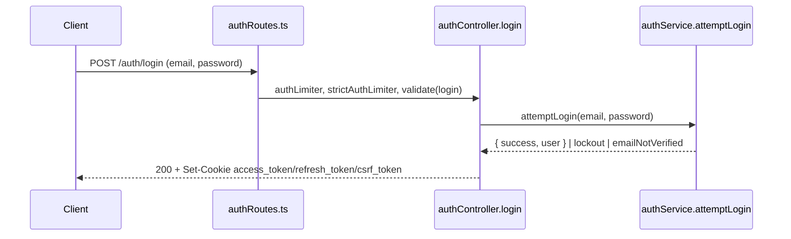
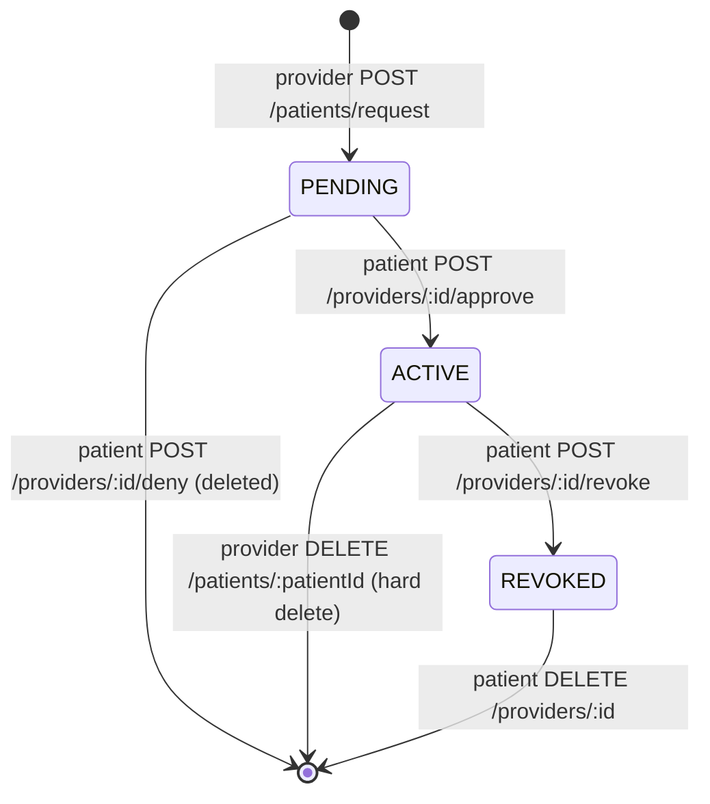
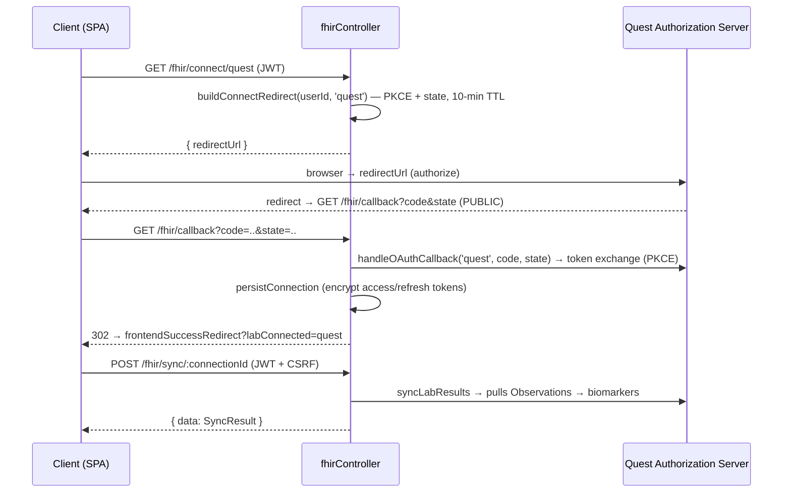

# API_REFERENCE.md

> Contract-facing reference for every OwnMyHealth backend endpoint. A reader with only this doc can call any endpoint with a working `curl`, know the request/response shapes, the errors it can return, and what PHI it exposes. The middleware-chain lens (per-route security stack) lives in [`ROUTING_TABLE.md`](./ROUTING_TABLE.md).

**Generated:** 2026-06-01 · **Repo root:** `C:/Users/breil/Projects/OwnMyHealth/` · **API version:** `v1` (`backend/src/config/index.ts:227`)

---

## 1. Base URL + auth model

### Base URLs per environment

| Env | Base URL | Source |
|---|---|---|
| Production | `https://api.ownmyhealth.io/api/v1` | health probe + `VITE_API_URL` in `.github/workflows/deploy.yml:176,222` |
| Staging | `https://api-staging.ownmyhealth.io/api/v1` | health probe in `.github/workflows/deploy-staging.yml:73` |
| Local dev | `http://localhost:3001/api/v1` | `PORT` default 3001 (`backend/src/config/index.ts:41`); mount prefix `/api/${config.apiVersion}` (`backend/src/app.ts:265`) |

Cloud Run service: `ownmyhealth-backend` in project `ownmyhealth-prod`, region `us-central1` (`.github/workflows/deploy.yml:21,23` + `REGION` env). The exact `*.run.app` URL is fronted by the custom domain above — `TBD (external: raw Cloud Run service URL, resolve via gcloud run services describe ownmyhealth-backend --region us-central1)`.

All API routes are mounted under `/api/v1`:

```ts
// Source: backend/src/app.ts:L264-L269
// API routes
app.use(`/api/${config.apiVersion}`, routes);
// Internal/maintenance routes (Cloud Scheduler — audit #38). Shared-secret
// auth, CSRF-exempt; each endpoint 404s unless its secret is configured.
app.use(`/api/${config.apiVersion}/internal`, internalRoutes);
```

> Note: `internalRoutes` is mounted directly in `app.ts:269`, **not** via `routes/index.ts`. Its base path is therefore `/api/v1/internal`.

### Auth model — cookies vs Bearer

Authentication is JWT-based. `authenticate` reads the **cookie first**, then falls back to the `Authorization: Bearer` header:

```ts
// Source: backend/src/middleware/auth.ts:L34-L47
function extractToken(req: AuthenticatedRequest): string | null {
  // 1. Check HTTP-only cookie first (more secure)
  if (req.cookies?.access_token) {
    return req.cookies.access_token;
  }
  // 2. Fall back to Authorization header (for API clients)
  const authHeader = req.headers.authorization;
  if (authHeader?.startsWith('Bearer ')) {
    return authHeader.substring(7);
  }
  return null;
}
```

| Token | Cookie name | Lifetime | Set by |
|---|---|---|---|
| Access JWT | `access_token` (HttpOnly) | 15 min (`config.cookie.maxAge.accessToken`, `config/index.ts:90`) | `setAccessTokenCookie` (`authController.ts:94`) |
| Refresh JWT | `refresh_token` (HttpOnly) | 7 days (`config.cookie.maxAge.refreshToken`, `config/index.ts:91`) | `setRefreshTokenCookie` (`authController.ts:113`) |
| CSRF | `csrf_token` (readable by JS, `httpOnly:false`) | 24 h | `setCsrfCookie` (`csrf.ts:32-58`) |

`requireBearerAuth` (`auth.ts:180`) is a **Bearer-only** variant used by `POST /ai/chat`: it ignores the cookie so an SSE route can be CSRF-exempt without reopening a CSRF hole (`auth.ts:L59-L65`).

### How `X-CSRF-Token` flows (double-submit cookie)

There is **no server-side CSRF secret**. The pattern is double-submit: the server sets a random `csrf_token` cookie; the browser reads it and echoes it in the `X-CSRF-Token` header on every state-changing request.

```
GET /api/v1/csrf-token ──▶ Set-Cookie: csrf_token=<hex>   (csrf.ts:204 csrfTokenHandler)
        │
        ▼
Browser reads csrf_token cookie (httpOnly:false)
        │
        ▼
POST/PUT/PATCH/DELETE  ── header X-CSRF-Token: <hex> ──▶ validateCsrfToken
        │                                                  (csrf.ts:86)
        ▼
SHA-256(cookie) timingSafeEqual SHA-256(header)  → 403 FORBIDDEN if mismatch/missing
```

```ts
// Source: backend/src/middleware/csrf.ts:L164-L170
const cookieDigest = crypto.createHash('sha256').update(cookieToken).digest();
const headerDigest = crypto.createHash('sha256').update(headerToken).digest();
const tokensMatch = crypto.timingSafeEqual(cookieDigest, headerDigest);
if (!tokensMatch) {
  throw new ForbiddenError('Invalid CSRF token');
}
```

`csrfProtection` is applied globally in `app.ts:215-217` (skippable only when `config.isDevelopment && DISABLE_CSRF=true`). It is a no-op on `GET/HEAD/OPTIONS` (`csrf.ts:92,191`). **CSRF-exempt routes** (`csrf.ts:98-139`):
- Public auth routes: `/auth/login`, `/auth/register`, `/auth/demo`, `/auth/refresh`, `/auth/forgot-password`, `/auth/reset-password`, `/auth/verify-email`, `/auth/resend-verification` (path-suffix match).
- Bearer-only streaming: `/ai/chat` (`csrf.ts:116-118`).
- Scheduler: `/internal/audit-cleanup` (`csrf.ts:139`).

> Several routers ALSO declare `csrfProtection` per-route (e.g. `expenseRoutes.ts:9`, `fhirRoutes.ts:7`) for defense-in-depth, but the global middleware already covers all mutations.

---

## 2. Error envelope

Every error response is shaped by the centralized handler:

```ts
// Source: backend/src/middleware/errorHandler.ts:L199-L210
const response: ApiResponse = {
  success: false,
  error: {
    code,
    message,
    ...(details ? { details } : {}),                       // ValidationError only
    ...(config.isDevelopment ? { stack: err.stack } : {}), // dev only
  },
};
res.status(statusCode).json(response);
```

> Some controllers ship error bodies that **omit** the top-level `code`/wrap differently — e.g. the FHIR controller returns `{ error: { code, message } }` **without** `success: false` (`fhirController.ts:44-51,158,170-176,197-203`), and the AI/biomarker BAA-gate paths return `{ error: { code, message } }` (`aiChatController.ts:133-141`, `biomarkerRoutes.ts:144-150`). These are hand-rolled, not run through `errorHandler`. The canonical envelope above applies to every error thrown via `AppError`/`asyncHandler`.

### Distinct error `code` values

There are **36 distinct `code` values** across the API (grep of `code: '...'` in `backend/src` minus test files yields 32 literal codes, plus 4 `AppError` subclass defaults that never appear as object literals — `AUTHENTICATION_FAILED`, `FORBIDDEN`, `INTERNAL_ERROR`, `EXTERNAL_SERVICE_ERROR`; see `rateLimiter.ts` and `errorHandler.ts`). The four tables below enumerate all 36 (some codes — e.g. `NOT_FOUND`, `BAD_REQUEST`, `CONFLICT`, `RATE_LIMIT_EXCEEDED` — appear both as a subclass default and as a literal/mapped code; counted once).

**Core `AppError` subclasses** (`errorHandler.ts:29-102`):

| `code` | HTTP | Class | Source |
|---|---|---|---|
| `BAD_REQUEST` | 400 | `BadRequestError` | `errorHandler.ts:29` |
| `UNAUTHORIZED` | 401 | `UnauthorizedError` | `errorHandler.ts:35` |
| `AUTHENTICATION_FAILED` | 401 | `AuthenticationError` | `errorHandler.ts:41` |
| `FORBIDDEN` | 403 | `ForbiddenError` | `errorHandler.ts:47` |
| `NOT_FOUND` | 404 | `NotFoundError` | `errorHandler.ts:53` |
| `CONFLICT` | 409 | `ConflictError` | `errorHandler.ts:59` |
| `VALIDATION_ERROR` | 422 | `ValidationError` (carries `details`) | `errorHandler.ts:65` |
| `RATE_LIMIT_EXCEEDED` | 429 | `RateLimitError` | `errorHandler.ts:74` |
| `INTERNAL_ERROR` | 500 | `InternalServerError` | `errorHandler.ts:80` |
| `SERVICE_UNAVAILABLE` | 503 | `ServiceUnavailableError` | `errorHandler.ts:86` |
| `DATABASE_ERROR` | 500 | `DatabaseError` | `errorHandler.ts:92` |
| `EXTERNAL_SERVICE_ERROR` | 502 | `ExternalServiceError` | `errorHandler.ts:98` |

**Mapped from non-AppError errors** (`errorHandler.ts:109-175`):

| `code` | HTTP | Trigger | Source |
|---|---|---|---|
| `CONFLICT` | 409 | Prisma `P2002` (unique) | `errorHandler.ts:110` |
| `NOT_FOUND` | 404 | Prisma `P2025` | `errorHandler.ts:111` |
| `BAD_REQUEST` | 400 | Prisma `P2003`/`P2014` | `errorHandler.ts:112-113` |
| `INVALID_TOKEN` | 401 | `JsonWebTokenError` | `errorHandler.ts:123` |
| `TOKEN_EXPIRED` | 401 | `TokenExpiredError` | `errorHandler.ts:124` |
| `INVALID_JSON` | 400 | body-parser `SyntaxError` | `errorHandler.ts:164` |
| `FILE_TOO_LARGE` | 413 | Multer `LIMIT_FILE_SIZE` | `errorHandler.ts:171` |
| `UPLOAD_ERROR` | 400 | other Multer errors | `errorHandler.ts:173` |

**Rate-limiter codes** (`rateLimiter.ts`, all HTTP 429):

| `code` | Limiter | Source |
|---|---|---|
| `RATE_LIMIT_EXCEEDED` | `standardLimiter` | `rateLimiter.ts:24` |
| `AUTH_RATE_LIMIT_EXCEEDED` | `authLimiter` | `rateLimiter.ts:44` |
| `LOGIN_RATE_LIMIT_EXCEEDED` | `strictAuthLimiter` | `rateLimiter.ts:60` |
| `UPLOAD_RATE_LIMIT_EXCEEDED` | `uploadLimiter` | `rateLimiter.ts:83` |
| `SENSITIVE_RATE_LIMIT_EXCEEDED` | `sensitiveLimiter` | `rateLimiter.ts:99` |
| `AI_RATE_LIMIT_EXCEEDED` | `aiLimiter` | `rateLimiter.ts:115` |
| `PROVIDER_REQUEST_RATE_LIMIT_EXCEEDED` | `providerAccessRequestLimiter` | `rateLimiter.ts:140` |
| `BULK_RATE_LIMIT_EXCEEDED` | `bulkOperationLimiter` | `rateLimiter.ts:164` |

**Domain/controller-specific codes:**

| `code` | HTTP | Where | Source |
|---|---|---|---|
| `PLAN_LIMIT_EXCEEDED` | 403 | plan gate (`upgradeRequired:true`) | `planGating.ts:93` |
| `EMAIL_NOT_VERIFIED` | 403 | login, unverified | `authController.ts:284` |
| `ACCOUNT_LOCKED` | 423 | login, lockout (`details.lockedUntil`) | `authController.ts:303` |
| `VERIFICATION_FAILED` | 400 | verify-email failure | `authController.ts:658` |
| `RESEND_FAILED` | 400 | resend-verification failure | `authController.ts:704` |
| `RESET_FAILED` | 400 | reset-password failure | `authController.ts:799` |
| `EMAIL_CHANGE_FAILED` | 400 | confirm-email-change failure | `authController.ts:915` |
| `STORAGE_READ_FAILED` | 502 | GCS stream error on download | `fileController.ts:274` |
| `CONNECT_FAILED` | 500 | FHIR connect redirect build | `fhirController.ts:65` |
| `SYNC_FAILED` | 500 | FHIR sync failure | `fhirController.ts:172` |
| `DISCONNECT_FAILED` | 500 | FHIR disconnect failure | `fhirController.ts:199` |
| `CONTEXT_ASSEMBLY_FAILED` | 500 | AI chat health-context build | `aiChatController.ts:152` |

See [`ERROR_RECOVERY.md`](./ERROR_RECOVERY.md) for the recovery playbook per code.

---

## 3. Global rate limits (8 limiters)

All limiters are backed by `createRateLimitStore(...)` — a shared Redis store when `REDIS_URL` is set, otherwise a per-instance `MemoryStore`. On Cloud Run with N instances and no Redis, the effective ceiling is **N × limit** (`rateLimiter.ts:7-14`).

| Limiter | Window | Max | Key | File:line | Applied to |
|---|---|---|---|---|---|
| `standardLimiter` | `RATE_LIMIT_WINDOW_MS` (15 min) | `RATE_LIMIT_MAX_REQUESTS` (100) | IP | `rateLimiter.ts:17` | global, all `/api` (`app.ts:220`) |
| `authLimiter` | 15 min | 20 | IP | `rateLimiter.ts:37` | all `/auth/*` (`authRoutes.ts:34`) |
| `strictAuthLimiter` | 15 min | 5 (failed-only, `skipSuccessfulRequests`) | `email:IP` | `rateLimiter.ts:53` | `/auth/login`, `/forgot-password`, `/reset-password`, `/resend-verification`, `/confirm-email-change`, `/change-email` |
| `uploadLimiter` | 1 hour | 20 | IP | `rateLimiter.ts:76` | all `uploadRoutes` (`uploadRoutes.ts:26`), insurance upload/reanalyze |
| `sensitiveLimiter` | 1 hour | 10 | IP | `rateLimiter.ts:92` | settings, file download, FHIR connect/sync/delete, admin permanent-delete |
| `aiLimiter` | 1 hour | 10 | user ID → IP | `rateLimiter.ts:108` | Claude-calling routes (`/ai/chat`, guidance, uploads, analyze, suggestions, analyze health needs) |
| `providerAccessRequestLimiter` | 1 hour | 10 | user ID → IP | `rateLimiter.ts:133` | `POST /provider/patients/request` |
| `bulkOperationLimiter` | 1 hour | 30 | IP | `rateLimiter.ts:157` | `POST /biomarkers/batch` |

Every limiter returns HTTP **429** with the envelope `{ success:false, error:{ code, message } }`. Rate-limit headers use `standardHeaders: true` (RateLimit-* headers), `legacyHeaders: false`.

---

## 4. At-a-glance mega-table (all endpoints)

**Total: 112 mega-table rows** — 110 across 16 user-facing route modules + 1 internal cleanup endpoint, plus the 2 `routes/index.ts` health/version endpoints (`GET /health`, `GET /`). 4 further utility endpoints in `app.ts` (`GET /`, `GET /health`, `GET /api/health/db`, `GET /api/v1/csrf-token`) are listed beneath the table, not as rows. Auth column: `public` = no JWT; `JWT` = `authenticate`; `Bearer` = `requireBearerAuth`; `secret` = `X-Cleanup-Token`. CSRF column reflects whether a mutation requires `X-CSRF-Token` (GETs never do).

| Method | Path (`/api/v1` prefix) | Auth | CSRF | Rate limiter | RBAC | Controller (`file:fn`) | Audit | PHI? |
|---|---|---|---|---|---|---|---|---|
| GET | `/health` | public | — | standard | — | inline `routes/index.ts:42` | — | no |
| GET | `/` | public | — | standard | — | inline `routes/index.ts:54` | — | no |
| POST | `/auth/register` | public | no (exempt) | auth | — | `authController.register` | `REGISTER` | no |
| POST | `/auth/login` | public | no (exempt) | auth+strictAuth | — | `authController.login` | `LOGIN`/`LOGIN_FAILED` | no |
| POST | `/auth/refresh` | public | no (exempt) | auth | — | `authController.refreshToken` | — | no |
| POST | `/auth/demo` | public | no (exempt) | auth | — | `authController.demoLogin` | — | no |
| GET | `/auth/verify-email` | public | — | auth | — | `authController.verifyEmail` | `EMAIL_VERIFICATION`† | no |
| POST | `/auth/resend-verification` | public | no (exempt) | auth+strictAuth | — | `authController.resendVerification` | — | no |
| POST | `/auth/forgot-password` | public | no (exempt) | auth+strictAuth | — | `authController.forgotPassword` | `PASSWORD_RESET_REQUEST`† | no |
| POST | `/auth/reset-password` | public | no (exempt) | auth+strictAuth | — | `authController.resetPasswordHandler` | `PASSWORD_RESET_COMPLETE`† | no |
| GET | `/auth/confirm-email-change` | public | — | auth+strictAuth | — | `authController.confirmEmailChangeHandler` | `EMAIL_CHANGE_COMPLETE`† | no |
| POST | `/auth/logout` | JWT | yes | auth | — | `authController.logout` | `LOGOUT`† | no |
| POST | `/auth/logout-all` | JWT | yes | auth | — | `authController.logoutAll` | `LOGOUT`† | no |
| GET | `/auth/me` | JWT | — | auth | — | `authController.getCurrentUser` | — | no |
| POST | `/auth/change-password` | JWT | yes | auth | — | `authController.changePassword` | `PASSWORD_CHANGE`† | no |
| POST | `/auth/change-email` | JWT | yes | auth+strictAuth | — | `authController.changeEmailHandler` | `EMAIL_CHANGE_REQUEST`† | no |
| GET | `/biomarkers` | JWT | — | standard | — | `biomarkerController.getBiomarkers` | `READ` | **yes** |
| GET | `/biomarkers/summary` | JWT | — | standard | — | `biomarkerController.getSummary` | `READ` | yes (aggregate) |
| GET | `/biomarkers/categories` | JWT | — | standard | — | `biomarkerController.getCategories` | — | no |
| GET | `/biomarkers/:id` | JWT | — | standard | — | `biomarkerController.getBiomarker` | `READ` | **yes** |
| GET | `/biomarkers/:id/history` | JWT | — | standard | — | `biomarkerController.getHistory` | `READ` | **yes** |
| POST | `/biomarkers` | JWT | yes | standard | — | `biomarkerController.createBiomarker` | `CREATE` | **yes** |
| POST | `/biomarkers/batch` | JWT | yes | bulkOperation | — | `biomarkerController.bulkCreateBiomarkers` | `CREATE` | **yes** |
| PATCH | `/biomarkers/:id` | JWT | yes | standard | — | `biomarkerController.updateBiomarker` | `UPDATE` | **yes** |
| DELETE | `/biomarkers/:id` | JWT | yes | standard | — | `biomarkerController.deleteBiomarker` | `DELETE` | **yes** |
| POST | `/biomarkers/:id/guidance` | JWT | yes | ai | — | inline `biomarkerRoutes.ts:120` | `PHI_ACCESS` (external) | **yes** |
| GET | `/insurance/plans` | JWT | — | standard | — | `insuranceController.getInsurancePlans` | `READ` | **yes** |
| GET | `/insurance/plans/:id` | JWT | — | standard | — | `insuranceController.getInsurancePlan` | `READ` | **yes** |
| POST | `/insurance/plans` | JWT | yes | standard | — | `insuranceController.createInsurancePlan` | `CREATE` | **yes** |
| PATCH | `/insurance/plans/:id` | JWT | yes | standard | — | `insuranceController.updateInsurancePlan` | `UPDATE` | **yes** |
| DELETE | `/insurance/plans/:id` | JWT | yes | standard | — | `insuranceController.deleteInsurancePlan` | `DELETE` | **yes** |
| POST | `/insurance/compare` | JWT | yes | standard | — | `insuranceController.comparePlans` | `READ` | **yes** |
| GET | `/insurance/benefits/search` | JWT | — | standard | — | `insuranceController.searchBenefits` | `READ` | **yes** |
| PUT | `/insurance/plans/:id/reanalyze` | JWT | yes | upload+ai | — | `upload.reanalyzePlan` | `UPDATE` (external) | **yes** |
| POST | `/insurance/upload-sbc` | JWT | yes | upload+ai | — | `upload.uploadSBC` | `CREATE` (external) | **yes** |
| PUT | `/insurance/plans/:id/spending` | JWT | yes | standard | — | `expenseController.updateCurrentSpending` | `UPDATE` | **yes** |
| GET | `/expenses/projections` | JWT | — | standard | — | `expenseController.getProjections` | `READ` | **yes** |
| POST | `/expenses/projections` | JWT | yes | standard | — | `expenseController.createProjection` | `CREATE` | **yes** |
| PUT | `/expenses/projections/:id` | JWT | yes | standard | — | `expenseController.updateProjection` | `UPDATE` | **yes** |
| DELETE | `/expenses/projections/:id` | JWT | yes | standard | — | `expenseController.deleteProjection` | `DELETE` | **yes** |
| GET | `/expenses/actuals` | JWT | — | standard | — | `expenseController.getActuals` | `READ` | **yes** |
| POST | `/expenses/actuals` | JWT | yes | standard | — | `expenseController.createActual` | `CREATE` | **yes** |
| PUT | `/expenses/actuals/:id` | JWT | yes | standard | — | `expenseController.updateActual` | `UPDATE` | **yes** |
| DELETE | `/expenses/actuals/:id` | JWT | yes | standard | — | `expenseController.deleteActual` | `DELETE` | **yes** |
| POST | `/expenses/analyze` | JWT | yes | ai | — | `expenseController.analyzeCosts` | `CREATE` (external) | **yes** |
| GET | `/expenses/analyses` | JWT | — | standard | — | `expenseController.getAnalyses` | `READ` | **yes** |
| GET | `/health-needs` | JWT | — | standard | — | `healthNeedsController.getHealthNeeds` | `READ` | **yes** |
| GET | `/health-needs/analyze` | JWT | — | ai | — | `healthNeedsController.analyzeHealthNeeds` | `PHI_ACCESS` | **yes** |
| GET | `/health-needs/summary` | JWT | — | standard | — | `healthNeedsController.getHealthNeedsSummary` | `READ` | yes (aggregate) |
| GET | `/health-needs/:id` | JWT | — | standard | — | `healthNeedsController.getHealthNeed` | `READ` | **yes** |
| POST | `/health-needs` | JWT | yes | standard | — | `healthNeedsController.createHealthNeed` | `CREATE` | **yes** |
| PATCH | `/health-needs/:id` | JWT | yes | standard | — | `healthNeedsController.updateHealthNeedStatus` | `UPDATE` | **yes** |
| DELETE | `/health-needs/:id` | JWT | yes | standard | — | `healthNeedsController.deleteHealthNeed` | `DELETE` | **yes** |
| GET | `/health-goals/summary` | JWT | — | standard | — | `healthGoalsController.getGoalsSummary` | `READ` | yes (aggregate) |
| GET | `/health-goals/suggestions` | JWT | — | ai | — | `healthGoalsController.suggestGoals` | `PHI_ACCESS` | **yes** |
| GET | `/health-goals` | JWT | — | standard | — | `healthGoalsController.getHealthGoals` | `READ` | **yes** |
| GET | `/health-goals/:id` | JWT | — | standard | — | `healthGoalsController.getHealthGoal` | `READ` | **yes** |
| POST | `/health-goals` | JWT | yes | standard | — | `healthGoalsController.createHealthGoal` | `CREATE` | **yes** |
| PUT | `/health-goals/:id` | JWT | yes | standard | — | `healthGoalsController.updateHealthGoal` | `UPDATE` | **yes** |
| PATCH | `/health-goals/:id/progress` | JWT | yes | standard | — | `healthGoalsController.updateGoalProgress` | `UPDATE` | **yes** |
| DELETE | `/health-goals/:id` | JWT | yes | standard | — | `healthGoalsController.deleteHealthGoal` | `DELETE` | **yes** |
| POST | `/upload/lab-report` | JWT | yes | upload+ai | — | `upload.uploadLabReport` | `CREATE` (external) | **yes** |
| POST | `/upload/insurance-sbc` | JWT | yes | upload+ai | — | `upload.uploadSBC` | `CREATE` (external) | **yes** |
| POST | `/upload/lab-results-ocr` | JWT | yes | upload+ai | — | `upload.uploadLabResultOCR` | `CREATE` (external) | **yes** |
| GET | `/files` | JWT | — | standard | — | `fileController.getFiles` | `READ` | metadata |
| GET | `/files/:id` | JWT | — | standard | — | `fileController.getFile` | `READ` | metadata |
| GET | `/files/:id/download` | JWT | — | sensitive | — | `fileController.getFileDownloadUrl` | `EXPORT` | **yes (file bytes)** |
| DELETE | `/files/:id` | JWT | yes | standard | — | `fileController.deleteFile` | `DELETE` | metadata |
| GET | `/provider/patients` | JWT | — | standard | **PROVIDER/ADMIN** | inline `providerRoutes.ts:32` | `READ` | patient email |
| POST | `/provider/patients/request` | JWT | yes | providerAccessRequest | **PROVIDER/ADMIN** | inline `providerRoutes.ts:150` | `CREATE` | no (uniform) |
| GET | `/provider/patients/:patientId` | JWT | — | standard | **PROVIDER/ADMIN** | inline `providerRoutes.ts:292` | `PHI_ACCESS` | **yes (patient)** |
| GET | `/provider/patients/:patientId/biomarkers` | JWT | — | standard | **PROVIDER/ADMIN** | inline `providerRoutes.ts:415` | `PHI_ACCESS` | **yes (patient)** |
| GET | `/provider/patients/:patientId/health-needs` | JWT | — | standard | **PROVIDER/ADMIN** | inline `providerRoutes.ts:559` | `PHI_ACCESS` | **yes (patient)** |
| DELETE | `/provider/patients/:patientId` | JWT | yes | standard | **PROVIDER/ADMIN** | inline `providerRoutes.ts:690` | `DELETE` | no |
| GET | `/patient/providers` | JWT | — | standard | **PATIENT** | inline `patientRoutes.ts:30` | `READ` | provider email |
| GET | `/patient/providers/pending` | JWT | — | standard | **PATIENT** | inline `patientRoutes.ts:109` | `READ` | provider email |
| POST | `/patient/providers/:id/approve` | JWT | yes | standard | **PATIENT** | inline `patientRoutes.ts:180` | `PERMISSION_CHANGE` | no |
| POST | `/patient/providers/:id/deny` | JWT | yes | standard | **PATIENT** | inline `patientRoutes.ts:271` | `PERMISSION_CHANGE` | no |
| PATCH | `/patient/providers/:id` | JWT | yes | standard | **PATIENT** | inline `patientRoutes.ts:328` | `PERMISSION_CHANGE` | no |
| POST | `/patient/providers/:id/revoke` | JWT | yes | standard | **PATIENT** | inline `patientRoutes.ts:418` | `PERMISSION_CHANGE` | no |
| DELETE | `/patient/providers/:id` | JWT | yes | standard | **PATIENT** | inline `patientRoutes.ts:482` | `DELETE` | no |
| GET | `/settings/profile` | JWT | — | sensitive | — | `settingsController.getProfile` | `READ` | **yes** |
| PATCH | `/settings/profile` | JWT | yes | sensitive | — | `settingsController.updateProfile` | `UPDATE` | **yes** |
| GET | `/settings/notifications` | JWT | — | sensitive | — | `settingsController.getNotifications` | `READ` | no |
| PATCH | `/settings/notifications` | JWT | yes | sensitive | — | `settingsController.updateNotifications` | `UPDATE` | no |
| GET | `/settings/health-profile` | JWT | — | sensitive | — | `settingsController.getHealthProfile` | `READ` | **yes** |
| PATCH | `/settings/health-profile` | JWT | yes | sensitive | — | `settingsController.updateHealthProfile` | `UPDATE` | **yes** |
| GET | `/settings/export-data` | JWT | — | sensitive | — | `settingsController.exportUserData` | `PHI_EXPORT` | **yes (all)** |
| DELETE | `/settings/delete-data` | JWT | yes | sensitive | — | `settingsController.deleteAllData` | `DELETE` | **yes** |
| DELETE | `/settings/delete-account` | JWT | yes | sensitive | — | `settingsController.deleteAccount` | `DELETE` | **yes** |
| GET | `/admin/users` | JWT | — | standard | **ADMIN** | inline `adminRoutes.ts:41` | `READ` | email/role |
| GET | `/admin/users/:id` | JWT | — | standard | **ADMIN** | inline `adminRoutes.ts:130` | `READ` | email/role |
| POST | `/admin/users` | JWT | yes | standard | **ADMIN** | inline `adminRoutes.ts:200` | `CREATE` | email/role |
| PATCH | `/admin/users/:id` | JWT | yes | standard | **ADMIN** | inline `adminRoutes.ts:266` | `UPDATE`/`PERMISSION_CHANGE` | email/role |
| DELETE | `/admin/users/:id` | JWT | yes | standard | **ADMIN** | inline `adminRoutes.ts:383` | `UPDATE` (soft) | email/role |
| DELETE | `/admin/users/:id/permanent` | JWT | yes | sensitive | **ADMIN** | inline `adminRoutes.ts:466` | `DELETE` | email/role |
| PATCH | `/admin/users/:id/plan` | JWT | yes | standard | **ADMIN** | inline `adminRoutes.ts:564` | `UPDATE` | no |
| GET | `/admin/provider-relationships` | JWT | — | standard | **ADMIN** | inline `adminRoutes.ts:653` | `READ` | no |
| PATCH | `/admin/provider-relationships/:id` | JWT | yes | standard | **ADMIN** | inline `adminRoutes.ts:693` | `UPDATE` | no |
| GET | `/admin/stats` | JWT | — | standard | **ADMIN** | inline `adminRoutes.ts:775` | `READ` | no |
| GET | `/admin/audit-logs` | JWT | — | standard | **ADMIN** | inline `adminRoutes.ts:868` | `READ` | no (meta) |
| GET | `/onboarding/status` | JWT | — | standard | — | inline `onboardingRoutes.ts:22` | — | no |
| POST | `/onboarding/complete` | JWT | yes | standard | — | inline `onboardingRoutes.ts:32` | — | no |
| GET | `/fhir/callback` | public | no (no session) | standard | — | `fhirController.handleCallback` | — | no (token exch.) |
| GET | `/fhir/connect/quest` | JWT | — | sensitive | — | `fhirController.initiateQuestConnect` | — | no |
| GET | `/fhir/connections` | JWT | — | standard | — | `fhirController.listConnections` | — | no |
| POST | `/fhir/sync/:connectionId` | JWT | yes | sensitive | — | `fhirController.triggerSync` | (in syncLabResults) | **yes (lab import)** |
| DELETE | `/fhir/connections/:id` | JWT | yes | sensitive | — | `fhirController.deleteConnection` | (in disconnect) | no |
| POST | `/ai/chat` | **Bearer** | no (exempt) | ai | — | `aiChatController.handleAIChat` | `PHI_ACCESS` (external) | **yes (SSE)** |
| GET | `/plan/available` | public | — | standard | — | inline `planRoutes.ts:32` | — | no |
| GET | `/plan` | JWT | — | standard | — | inline `planRoutes.ts:52` | — | no |
| POST | `/internal/audit-cleanup` | **secret** | no (exempt) | standard | — | inline `internalRoutes.ts:40` | — | no |

† Auth-event audits are written via `auditService.logAuth(...)` which maps to the `AuditAction` enum (default `UPDATE`) — see `auditLog.ts:419-425`.

Plus utility endpoints outside `/api/v1` routing: `GET /` (`app.ts:287`), `GET /health` (Docker liveness, `app.ts:301`), `GET /api/health/db` (legacy DB check, `app.ts:318`), `GET /api/v1/csrf-token` (`app.ts:284`).

---

## 5. Per-endpoint-group sections

### 5.1 Auth (`authRoutes.ts`)

Router-wide `authLimiter` (`authRoutes.ts:34`). 14 endpoints. Public auth routes are CSRF-exempt (`csrf.ts:98-108`).

#### `POST /api/v1/auth/login`

Authenticate a user; on success sets `access_token`, `refresh_token`, and a fresh `csrf_token` cookie.

1. **Route**: `backend/src/routes/authRoutes.ts:L48-L53`
2. **Middleware** (in order): `authLimiter` (router-wide), `strictAuthLimiter`, `validate(schemas.auth.login)`, `asyncHandler(login)`.
3. **Controller**: `authController.login` (`backend/src/controllers/authController.ts:257`).
4. **RLS wrap**: none at controller; login flow is in `authService.attemptLogin`.
5. **Request (Zod)**:

   ```ts
   // Source: backend/src/middleware/validation.ts:L254-L257
   login: z.object({
     email: email,
     password: z.string().min(1, 'Password is required').max(128),
   }),
   ```

6. **Response (200)**:

   ```json
   { "success": true, "data": { "user": { "id": "uuid", "email": "a@b.com", "role": "PATIENT" } } }
   ```

   Body shape from `authController.ts:L355-L360`; `Set-Cookie` for `access_token`, `refresh_token`, `csrf_token`.

7. **Errors**:

   | HTTP | `code` | When | Source |
   |---|---|---|---|
   | 422 | `VALIDATION_ERROR` | malformed email / empty password | `errorHandler.ts:65` |
   | 401 | `UNAUTHORIZED` | invalid credentials (uniform, no `remainingAttempts` leak) | `authController.ts:326,335` |
   | 403 | `EMAIL_NOT_VERIFIED` | account not verified | `authController.ts:284` |
   | 423 | `ACCOUNT_LOCKED` | lockout (`details.lockedUntil`) | `authController.ts:303` |
   | 429 | `LOGIN_RATE_LIMIT_EXCEEDED` | >5 failed attempts/15 min | `rateLimiter.ts:60` |

8. **Working curl**:

   ```bash
   curl -X POST https://api.ownmyhealth.io/api/v1/auth/login \
     -H "Content-Type: application/json" \
     -c cookies.txt \
     -d '{"email":"user@example.com","password":"Sup3rSecret!Pass"}'
   ```

9. **Audit**: `auditService.logAuth('LOGIN', ...)` on success (`authController.ts:351`); `'LOGIN_FAILED'` / `'ACCOUNT_LOCKOUT'` on failure (`authController.ts:276,295,321,330`).
10. **PHI exposure**: none in body — only `{ id, email, role }` (`formatUserResponse`, `authController.ts:146`).



#### `POST /api/v1/auth/refresh`

Rotates the refresh token and re-issues all cookies. Public + CSRF-exempt (no session yet).

- **Route**: `authRoutes.ts:56`. **Controller**: `authController.refreshToken` (`authController.ts:369`).
- **Request**: none in body — reads `refresh_token` cookie (`authController.ts:374`).
- **Response (200)**: `{ "success": true, "data": { "token": "<new access JWT>" } }` (`authController.ts:399-404`) + new `access_token`/`refresh_token`/`csrf_token` cookies.
- **Errors**: 401 `UNAUTHORIZED` ("Refresh token not provided" / "Invalid or expired refresh token", clears cookies) — `authController.ts:377,387`.

**Refresh-token flow end-to-end:**

```
1. Browser holds refresh_token cookie (7-day, HttpOnly).
2. access_token expires (15 min) → API returns 401 UNAUTHORIZED ("Token has expired") (auth.ts:113).
3. Client POSTs /auth/refresh (cookie auto-sent; CSRF-exempt).
4. refreshTokens() verifies + ROTATES the refresh token (new refresh issued, old revoked).
5. Server sets new access_token + refresh_token + csrf_token; returns { data:{ token } }.
6. Client retries the original request with the new access cookie/Bearer.
```

#### Other auth endpoints (summary)

| Endpoint | Auth | Body / Query | Success body | Source |
|---|---|---|---|---|
| `POST /auth/register` | public | `{ email, password, firstName?, lastName? }` (`validation.ts:259`) | `{ success:true, data:{ message } }` (generic, 201) | `authController.ts:243-250` |
| `POST /auth/demo` | public | none | `{ data:{ user } }` (or 400 if `DEMO_ACCOUNT_ENABLED` false) | `authController.ts:592,620` |
| `GET /auth/verify-email?token=` | public | `{ token }` query | `{ data:{ message } }` | `authController.ts:674-680` |
| `POST /auth/resend-verification` | public | `{ email }` | generic success message | `authController.ts:718-724` |
| `POST /auth/forgot-password` | public | `{ email }` | generic success message | `authController.ts:757-763` |
| `POST /auth/reset-password` | public | `{ token, newPassword }` (`validation.ts:275`) | `{ data:{ message } }` | `authController.ts:815-821` |
| `GET /auth/confirm-email-change?token=` | public | `{ token }` query | `{ data:{ message } }` | `authController.ts:929-936` |
| `POST /auth/logout` | JWT | none | `{ success:true }` | `authController.ts:446` |
| `POST /auth/logout-all` | JWT | none | `{ success:true }` | `authController.ts:480` |
| `GET /auth/me` | JWT | none | `{ data:{ id, email, role } }` | `authController.ts:506` |
| `POST /auth/change-password` | JWT | `{ currentPassword, newPassword }` (`validation.ts:266`) | `{ success:true }` + new cookies (revokes all sessions) | `authController.ts:573` |
| `POST /auth/change-email` | JWT | `{ newEmail, currentPassword }` (`validation.ts:288`) | `{ data:{ message } }` | `authController.ts:875-882` |

`strongPassword` rule (register/reset/change): ≥12 chars, upper, lower, digit, special (`validation.ts:117-123`).

**Related**: [`ROUTING_TABLE.md#authroutes`](./ROUTING_TABLE.md), [`ARCHITECTURE.md#auth-flow`](./ARCHITECTURE.md).

---

### 5.2 Biomarkers (`biomarkerRoutes.ts`)

Router-wide `authenticate` (`biomarkerRoutes.ts:47`). 10 endpoints. All data RLS-scoped via `withRLSTransaction(userId, ...)`.

#### `POST /api/v1/biomarkers`

Create a biomarker reading. `value` and `notes` are encrypted before write.

1. **Route**: `biomarkerRoutes.ts:L83-L87`
2. **Middleware**: `authenticate` (router-wide), `validate(schemas.biomarker.create)`. (No `blockDemoAI` — demo can create manual biomarkers; AI guidance is what's gated.)
3. **Controller**: `biomarkerController.createBiomarker` (`biomarkerController.ts:226`).
4. **RLS wrap**: `withRLSTransaction(userId, async (tx) => tx.biomarker.create(...))` — `biomarkerController.ts:L247-L269`.
5. **Request (Zod)**:

   ```ts
   // Source: backend/src/middleware/validation.ts:L302-L318
   create: z.object({
     name: sanitizedString(1, 100),
     value: finiteNumber.pipe(z.number().min(0, 'Value must be non-negative')),
     unit: sanitizedString(1, 20),
     category: sanitizedString(1, 50),
     date: dateString,
     normalRange: z.object({ min: finiteNumber, max: finiteNumber, source: optionalSanitizedString(100) }),
     notes: optionalSanitizedString(1000),
     sourceType: z.enum(['MANUAL','LAB_UPLOAD','EHR_IMPORT','DEVICE_SYNC','API_IMPORT']).optional(),
     ...
   }),
   ```

6. **Response (201)**:

   ```json
   {
     "success": true,
     "data": {
       "id": "uuid", "userId": "uuid", "category": "Lipids", "name": "LDL",
       "unit": "mg/dL", "value": 120, "notes": null,
       "normalRange": { "min": 0, "max": 100, "source": null },
       "date": "2026-04-24", "sourceType": "MANUAL", "isOutOfRange": true,
       "isAcknowledged": false, "history": [], "createdAt": "...", "updatedAt": "..."
     }
   }
   ```

   Shape from `BiomarkerResponse` (`biomarkerController.ts:32-55`), decrypted via `toResponse` (`biomarkerController.ts:60`).

7. **Errors**: 422 `VALIDATION_ERROR`, 401 `UNAUTHORIZED`, 403 `FORBIDDEN` (missing CSRF), 429 `RATE_LIMIT_EXCEEDED`.
8. **Working curl**:

   ```bash
   curl -X POST https://api.ownmyhealth.io/api/v1/biomarkers \
     -b cookies.txt \
     -H "X-CSRF-Token: $(grep csrf_token cookies.txt | awk '{print $7}')" \
     -H "Content-Type: application/json" \
     -d '{"name":"LDL","value":120,"unit":"mg/dL","category":"Lipids","date":"2026-04-24","normalRange":{"min":0,"max":100}}'
   ```

9. **Audit**: `auditService.logCreate('Biomarker', biomarker.id, { name, category, value }, { req, userId })` — `biomarkerController.ts:L273-L277` → `AuditAction.CREATE`.
10. **PHI exposure**: writes encrypted `valueEncrypted`, `notesEncrypted` (`biomarkerController.ts:238-241`); `unit`, `category`, `name` are **not** encrypted (`PHI_FIELDS.Biomarker = ['valueEncrypted','notesEncrypted']`, `encryption.ts:421-424`). See [`PHI_TAXONOMY.md#biomarker`](./PHI_TAXONOMY.md).

#### `GET /api/v1/biomarkers`

List, most-recent-first, paginated. **Route**: `biomarkerRoutes.ts:50`. **Controller**: `getBiomarkers` (`biomarkerController.ts:111`).

```ts
// Source: backend/src/controllers/biomarkerController.ts:L137-L147
const { total, biomarkers } = await withRLSTransaction(userId, async (tx) => {
  const total = await tx.biomarker.count({ where });
  const biomarkers = await tx.biomarker.findMany({
    where, include: { history: true },
    skip: pagination.skip, take: pagination.take,
    orderBy: { measurementDate: 'desc' },
  });
  return { total, biomarkers };
});
```

- **Query**: `?category=&page=&limit=` (`schemas.biomarker.listQuery`, `validation.ts:354`); default limit 50 (`biomarkerController.ts:126`), max 100.
- **Response (200)**: `{ success:true, data: BiomarkerResponse[], pagination:{ page, limit, total, totalPages } }` (`biomarkerController.ts:182-186`).
- **PHI returned**: `value` (from `valueEncrypted`), `notes` (from `notesEncrypted`), and history values — decrypted in `toResponse` via the per-user salt (`getUserEncryptionSalt`, `biomarkerController.ts:122`).
- **Audit**: `logAccess('Biomarker', undefined, ..., { operation:'LIST' })` → `AuditAction.READ` (`biomarkerController.ts:160`).

#### `POST /api/v1/biomarkers/:id/guidance`

AI educational guidance for one biomarker (Claude Haiku). This is the limiter for the spec's Q6.

- **Route + middleware**: `biomarkerRoutes.ts:L120-L127` — `aiLimiter`, `aiSpendGuard`, `blockDemoAI`, `requirePlanLimit('aiGuidancePerDay')`, `validate(uuidParam)`.
- **Rate limiter**: `aiLimiter` — **1-hour window, max 10** per user (`rateLimiter.ts:108-111`).
- **BAA gate (503)**: blocked unless `ANTHROPIC_API_KEY` set AND `ANTHROPIC_BAA_ACTIVE=true` — returns `503 SERVICE_UNAVAILABLE` (`biomarkerRoutes.ts:L137-L151`).
- **Response (200)**: `{ success:true, data:{ guidance: "..." } }` (`biomarkerRoutes.ts:274-277`); guidance is PHI-scrubbed via `stripPHIFromText` (`biomarkerRoutes.ts:244`).
- **Audit**: `logAccess('biomarker_ai_guidance', id, ..., { operation:'PHI_ACCESS', externalApiCall:true, provider:'anthropic' })` (`biomarkerRoutes.ts:266-272`).
- **PHI exposure**: biomarker `name/value/unit/normalRange/status/history` disclosed to Anthropic (`phiDisclosedFields`, `biomarkerRoutes.ts:271`). Biomarker is loaded under RLS, never from `req.body` (IDOR fix F-3, `biomarkerRoutes.ts:160-171`).

Other biomarker endpoints: `GET /summary`, `GET /categories`, `GET /:id`, `GET /:id/history`, `POST /batch` (`bulkOperationLimiter`, 30/hr, max 100 items via `schemas.biomarker.batchCreate`), `PATCH /:id`, `DELETE /:id`.

**Related**: [`DATA_MODEL.md#biomarker`](./DATA_MODEL.md), [`PHI_TAXONOMY.md#biomarker`](./PHI_TAXONOMY.md), [`ROUTING_TABLE.md`](./ROUTING_TABLE.md).

---

### 5.3 Insurance (`insuranceRoutes.ts`)

Router-wide `authenticate` (`insuranceRoutes.ts:64`). 10 endpoints. Multer caps uploads at 10 MB, single PDF file (`insuranceRoutes.ts:38-51`).

| Endpoint | Body | Notes | Source |
|---|---|---|---|
| `GET /insurance/plans` | — | list plans | `insuranceRoutes.ts:67` |
| `GET /insurance/plans/:id` | `uuidParam` | single plan | `insuranceRoutes.ts:73` |
| `POST /insurance/plans` | `schemas.insurancePlan.create` (`validation.ts:382`) | manual create | `insuranceRoutes.ts:80` |
| `PATCH /insurance/plans/:id` | `schemas.insurancePlan.update` | edit | `insuranceRoutes.ts:87` |
| `DELETE /insurance/plans/:id` | `uuidParam` | delete | `insuranceRoutes.ts:95` |
| `POST /insurance/compare` | `{ planIds: uuid[2..5] }` (`insuranceRoutes.ts:54`) | side-by-side | `insuranceRoutes.ts:102` |
| `GET /insurance/benefits/search` | `{ query:string, planId?:uuid }` (`insuranceRoutes.ts:58`) | benefit search | `insuranceRoutes.ts:109` |
| `PUT /insurance/plans/:id/reanalyze` | `file` (multipart) | re-extract from new PDF | `insuranceRoutes.ts:117` |
| `POST /insurance/upload-sbc` | `file` (multipart) | SBC upload | `insuranceRoutes.ts:131` |
| `PUT /insurance/plans/:id/spending` | `{ deductibleMet, oopMet }` (`validation.ts:647`) | update spending | `insuranceRoutes.ts:143` |

#### `POST /api/v1/insurance/upload-sbc` (also `POST /api/v1/upload/insurance-sbc`)

Upload + parse an SBC PDF; Claude extracts plan fields. Answers spec Q13.

- **Middleware** (`insuranceRoutes.ts:L131-L140`): `blockDemoAI`, `uploadLimiter`, `aiLimiter`, `aiSpendGuard`, `requirePlanLimit('pdfUploadsPerMonth')`, `upload.single('file')`.
- **Body**: `multipart/form-data` with a single `file` field; **PDF only**, **max 10 MB** (`insuranceRoutes.ts:38-50`). Oversize → 413 `FILE_TOO_LARGE`; non-PDF → 400 `BAD_REQUEST` ("Only PDF files are accepted").
- **Controller**: `upload.uploadSBC` (`controllers/upload/sbcUploadController.ts:33`).
- **Response (201)**: `{ success:true, data:{ id, planName, insurerName, planType, deductibleIndividual, oopMaxIndividual, ..., usedClaudeExtraction, file } }` (`sbcUploadController.ts:L182-L215`).
- **Audit**: `logCreate` with `externalApiCall` metadata (`sbcUploadController.ts:175-180`).
- **PHI**: encrypted `memberIdEncrypted`, `groupIdEncrypted` (`PHI_FIELDS.InsurancePlan`, `encryption.ts:430-433`); PDF bytes sent to Claude. See [`PHI_TAXONOMY.md`](./PHI_TAXONOMY.md).

```bash
curl -X POST https://api.ownmyhealth.io/api/v1/insurance/upload-sbc \
  -b cookies.txt -H "X-CSRF-Token: <csrf_token>" \
  -F "file=@my-sbc.pdf;type=application/pdf"
```

**Related**: [`DATA_MODEL.md#insuranceplan`](./DATA_MODEL.md), [`ROUTING_TABLE.md`](./ROUTING_TABLE.md).

---

### 5.4 Expenses (`expenseRoutes.ts`)

Router-wide `authenticate` (`expenseRoutes.ts:32`). Each mutation also declares `csrfProtection` per-route. 10 endpoints (projections CRUD, actuals CRUD, analyze, analyses).

| Endpoint | Body schema | Source |
|---|---|---|
| `GET /expenses/projections` | `expense.projectionsQuery` | `expenseRoutes.ts:39` |
| `POST /expenses/projections` | `expense.createProjection` (`validation.ts:575`) | `expenseRoutes.ts:46` |
| `PUT /expenses/projections/:id` | `expense.updateProjection` | `expenseRoutes.ts:54` |
| `DELETE /expenses/projections/:id` | `uuidParam` | `expenseRoutes.ts:63` |
| `GET /expenses/actuals` | `expense.actualsQuery` | `expenseRoutes.ts:75` |
| `POST /expenses/actuals` | `expense.createActual` (`validation.ts:607`) | `expenseRoutes.ts:82` |
| `PUT /expenses/actuals/:id` | `expense.updateActual` | `expenseRoutes.ts:90` |
| `DELETE /expenses/actuals/:id` | `uuidParam` | `expenseRoutes.ts:99` |
| `POST /expenses/analyze` | `{ planId:uuid }` (`validation.ts:592`) | `expenseRoutes.ts:111` |
| `GET /expenses/analyses` | `expense.analysesQuery` | `expenseRoutes.ts:123` |

`POST /expenses/analyze` is the AI cost-analysis call: `aiLimiter`, `aiSpendGuard`, `blockDemoAI`, `requirePlanLimit('costAnalysisPerMonth')`, `csrfProtection` (`expenseRoutes.ts:111-120`). Result stored in `CostAnalysis.claudeResponseEncrypted` (encrypted). All monetary expense fields are encrypted strings (`PHI_FIELDS.ExpenseActual/ExpenseProjection`, see [`PHI_TAXONOMY.md`](./PHI_TAXONOMY.md)).

---

### 5.5 Health goals (`healthGoalsRoutes.ts`)

Router-wide `authenticate` (`healthGoalsRoutes.ts:42`). 8 endpoints. `GET /summary` and `GET /suggestions` declared **before** `/:id` to avoid param capture (`healthGoalsRoutes.ts:45-48`).

| Endpoint | Limiter | Body | Source |
|---|---|---|---|
| `GET /health-goals/summary` | standard | — | `healthGoalsRoutes.ts:45` |
| `GET /health-goals/suggestions` | `aiLimiter` | — | `healthGoalsRoutes.ts:48` |
| `GET /health-goals` | standard | `healthGoal.listQuery` | `healthGoalsRoutes.ts:51` |
| `GET /health-goals/:id` | standard | `uuidParam` | `healthGoalsRoutes.ts:58` |
| `POST /health-goals` | standard | `healthGoal.create` (`validation.ts:497`) | `healthGoalsRoutes.ts:65` |
| `PUT /health-goals/:id` | standard | `healthGoal.update` | `healthGoalsRoutes.ts:72` |
| `PATCH /health-goals/:id/progress` | standard | `{ value, note? }` (`validation.ts:531`) | `healthGoalsRoutes.ts:80` |
| `DELETE /health-goals/:id` | standard | `uuidParam` | `healthGoalsRoutes.ts:88` |

PHI: `descriptionEncrypted`, `targetValueEncrypted`, and `GoalProgressHistory.noteEncrypted` (`encryption.ts:444-450`).

---

### 5.6 Health needs (`healthNeedsRoutes.ts`)

Router-wide `authenticate` (`healthNeedsRoutes.ts:39`). 7 endpoints. `GET /analyze` (`aiLimiter`) and `GET /summary` declared before `/:id` (`healthNeedsRoutes.ts:49,53`).

| Endpoint | Limiter | Body | Source |
|---|---|---|---|
| `GET /health-needs` | standard | `healthNeed.listQuery` | `healthNeedsRoutes.ts:42` |
| `GET /health-needs/analyze` | `aiLimiter` | — (AI-generated needs) | `healthNeedsRoutes.ts:49` |
| `GET /health-needs/summary` | standard | — | `healthNeedsRoutes.ts:53` |
| `GET /health-needs/:id` | standard | `uuidParam` | `healthNeedsRoutes.ts:56` |
| `POST /health-needs` | standard | `healthNeed.create` (`validation.ts:463`) | `healthNeedsRoutes.ts:63` |
| `PATCH /health-needs/:id` | standard | `healthNeed.update` | `healthNeedsRoutes.ts:70` |
| `DELETE /health-needs/:id` | standard | `uuidParam` | `healthNeedsRoutes.ts:78` |

PHI: `descriptionEncrypted` (`encryption.ts:439-441`).

---

### 5.7 Uploads (`uploadRoutes.ts`)

Router-wide `uploadLimiter` (`uploadRoutes.ts:26`). 3 endpoints; all `authenticate`, `aiLimiter`, `blockDemoAI`, `requirePlanLimit('pdfUploadsPerMonth')`, `upload.single('file')`. Handlers in `controllers/upload/` (the old monolithic `uploadController.ts` is gone).

| Endpoint | Accepts | Handler | Source |
|---|---|---|---|
| `POST /upload/lab-report` | PDF, ≤10 MB | `uploadLabReport` (Claude extraction) | `uploadRoutes.ts:77` / `labUploadController.ts:36` |
| `POST /upload/insurance-sbc` | PDF, ≤10 MB | `uploadSBC` | `uploadRoutes.ts:94` / `sbcUploadController.ts:33` |
| `POST /upload/lab-results-ocr` | PDF + PNG/JPEG/TIFF/GIF/WebP, ≤10 MB | `uploadLabResultOCR` (Document AI OCR) | `uploadRoutes.ts:124` / `labUploadController.ts` |

OCR allowed MIME types: `application/pdf, image/png, image/jpeg, image/tiff, image/gif, image/webp` (`uploadRoutes.ts:54-61`). Image OCR is gated by the Google BAA flag at runtime (`GOOGLE_BAA_ACTIVE`, `config/index.ts:176`).

---

### 5.8 Files (`fileRoutes.ts`)

Router-wide `authenticate` (`fileRoutes.ts:42`). 4 endpoints. Ownership enforced by controller `where:{ id, userId }` + `withRLSTransaction` + `user_files` RLS policy (`fileRoutes.ts:28-41`).

| Endpoint | Limiter | Returns | Source |
|---|---|---|---|
| `GET /files` | standard | paginated metadata list | `fileController.getFiles:41` |
| `GET /files/:id` | standard | single file **metadata only** | `fileController.getFile:131` |
| `GET /files/:id/download` | `sensitiveLimiter` | **raw file bytes** (streamed proxy) | `fileController.getFileDownloadUrl:201` |
| `DELETE /files/:id` | standard | `{ success:true }` | `fileController.deleteFile:289` |

> **Spec Q9 drift — there is no signed-URL endpoint anymore.** The download path used to mint a 15-minute GCS signed URL; it was replaced by an authenticated proxy stream because the signed URL was an unbound capture-replay PHI-egress vector. `getFileDownloadUrl` now pipes bytes through the backend with `Cache-Control: no-store`:

```ts
// Source: backend/src/controllers/fileController.ts:L248-L259
res.set({
  'Content-Type': file.fileType || 'application/octet-stream',
  'Content-Disposition': `attachment; filename="${safeFilename}"`,
  'Cache-Control': 'no-store, no-cache, private, must-revalidate',
  Pragma: 'no-cache',
  'X-Content-Type-Options': 'nosniff',
});
...
const stream = getFileStream(file.storageKey);
```

Download is audited as an EXPORT **before** streaming, so a mid-stream abort still records disclosure (`fileController.ts:L232-L238`). On GCS read failure: 502 `STORAGE_READ_FAILED` (`fileController.ts:272-275`).

---

### 5.9 Provider (`providerRoutes.ts`)

Router-wide `authenticate` + `requireRole('PROVIDER', 'ADMIN')` (`providerRoutes.ts:25-26`). 6 endpoints — handlers inline. Cross-patient PHI access is gated by consent (`status==='ACTIVE'`, unexpired, capability flag) AND backed by RLS provider policies.

| Endpoint | Limiter | Returns | Source |
|---|---|---|---|
| `GET /provider/patients` | standard | relationships (email only for ACTIVE/unexpired) | `providerRoutes.ts:32` |
| `POST /provider/patients/request` | `providerAccessRequestLimiter` (10/hr) | uniform success body (201 if created) | `providerRoutes.ts:150` |
| `GET /provider/patients/:patientId` | standard | patient detail (consented) | `providerRoutes.ts:292` |
| `GET /provider/patients/:patientId/biomarkers` | standard | decrypted patient biomarkers | `providerRoutes.ts:415` |
| `GET /provider/patients/:patientId/health-needs` | standard | decrypted patient health needs | `providerRoutes.ts:559` |
| `DELETE /provider/patients/:patientId` | standard | `{ message }` (hard delete) | `providerRoutes.ts:690` |

#### `POST /api/v1/provider/patients/request` (spec Q15)

A provider requests access to a patient by email. **State transition: creates/updates a `ProviderPatient` row to `status: PENDING`.**

```ts
// Source: backend/src/routes/providerRoutes.ts:L246-L266
return tx.providerPatient.upsert({
  where: { providerId_patientId: { providerId, patientId: patient.id } },
  create: { providerId, patientId: patient.id,
    relationshipType: relationshipType || 'PRIMARY_CARE',
    status: 'PENDING', notesEncrypted: encryptedNotes },
  update: { status: 'PENDING',
    relationshipType: relationshipType || 'PRIMARY_CARE',
    notesEncrypted: encryptedNotes },
});
```

- **Request**: `{ patientEmail, relationshipType?, message? }` (`schemas.providerPatient.request`, `validation.ts:549`).
- **Response**: 201 `{ success:true, data:{ relationshipId, status:'PENDING' } }` (`providerRoutes.ts:277-284`). For a non-existent / non-PATIENT email the API returns a **uniform** 200 generic message to prevent enumeration (`providerRoutes.ts:183-209`); the audit log retains the real reason.
- **Errors**: 403 `FORBIDDEN` if already ACTIVE or already PENDING (`providerRoutes.ts:238-243`); 429 `PROVIDER_REQUEST_RATE_LIMIT_EXCEEDED`.

The patient then approves/denies via `/patient/providers/:id/approve|deny` (§5.10) — the consent lifecycle is `PENDING → ACTIVE → REVOKED` (or hard-deleted).



**Related**: [`DATA_MODEL.md#providerpatient`](./DATA_MODEL.md), [`ROUTING_TABLE.md`](./ROUTING_TABLE.md).

---

### 5.10 Patient (`patientRoutes.ts`)

Router-wide `authenticate` + `requireRole('PATIENT')` (`patientRoutes.ts:22-24`). 7 endpoints — handlers inline. Patient manages provider consent.

| Endpoint | Body | State change | Source |
|---|---|---|---|
| `GET /patient/providers` | — | — (list) | `patientRoutes.ts:30` |
| `GET /patient/providers/pending` | — | — (list PENDING) | `patientRoutes.ts:109` |
| `POST /patient/providers/:id/approve` | `providerPatient.approve` (`validation.ts:555`) | `PENDING → ACTIVE` (+ permissions, `consentExpiresAt`) | `patientRoutes.ts:180` |
| `POST /patient/providers/:id/deny` | `uuidParam` | `PENDING → deleted` | `patientRoutes.ts:271` |
| `PATCH /patient/providers/:id` | `providerPatient.updatePermissions` (`validation.ts:563`) | edit permissions on ACTIVE | `patientRoutes.ts:328` |
| `POST /patient/providers/:id/revoke` | `uuidParam` | `ACTIVE → REVOKED` | `patientRoutes.ts:418` |
| `DELETE /patient/providers/:id` | `uuidParam` | permanent delete | `patientRoutes.ts:482` |

Approve body defaults: `canViewBiomarkers:true`, `canViewInsurance:false`, `canViewHealthNeeds:true`, `canEditData:false`, optional `consentDurationDays` 1–365 (`validation.ts:555-561`). Consent events audit as `PERMISSION_CHANGE` with `operation:'CONSENT_GRANTED'/'CONSENT_REVOKED'/'PERMISSIONS_UPDATED'` (`patientRoutes.ts:237-251,449-462`).

---

### 5.11 Settings (`settingsRoutes.ts`)

Router-wide `authenticate` (`settingsRoutes.ts:31`). 9 endpoints, all `sensitiveLimiter` (10/hr). Mutations carry `blockDemoProfileUpdate` (`settingsRoutes.ts:23`). `PATCH /health-profile` additionally gated by `requirePlanFeature('healthProfile')` (`settingsRoutes.ts:80`).

| Endpoint | Body | Returns | Source |
|---|---|---|---|
| `GET /settings/profile` | — | decrypted profile + prefs | `settingsRoutes.ts:34` |
| `PATCH /settings/profile` | `settings.updateProfile` (`validation.ts:675`) | updated profile | `settingsRoutes.ts:41` |
| `GET /settings/notifications` | — | prefs | `settingsRoutes.ts:50` |
| `PATCH /settings/notifications` | `settings.updateNotifications` (`validation.ts:683`) | updated prefs | `settingsRoutes.ts:57` |
| `GET /settings/health-profile` | — | health profile | `settingsRoutes.ts:66` |
| `PATCH /settings/health-profile` | `settings.updateHealthProfile` (`validation.ts:715`) | updated | `settingsRoutes.ts:76` |
| `GET /settings/export-data` | — | full JSON export | `settingsRoutes.ts:86` |
| `DELETE /settings/delete-data` | `{ password }` (`validation.ts:705`) | `{ success:true }` | `settingsRoutes.ts:98` |
| `DELETE /settings/delete-account` | `{ password }` (`validation.ts:711`) | `{ success:true }` | `settingsRoutes.ts:107` |

#### `DELETE /api/v1/settings/delete-account` (spec Q14)

Deletes the account and all data. Requires password re-auth (`schemas.settings.deleteAccount`, `validation.ts:711`). **Success body: `{ "success": true }`** (the standard `ApiResponse` with no `data` — `settingsController.deleteAccount`). Errors: 401 `UNAUTHORIZED` (wrong password), 403 `FORBIDDEN` (demo account, via `blockDemoProfileUpdate`), 429 `SENSITIVE_RATE_LIMIT_EXCEEDED`. `GET /settings/export-data` (HIPAA right-to-export) audits as `PHI_EXPORT` and is available on every plan (`plans.ts:56`).

---

### 5.12 Admin (`adminRoutes.ts`)

Router-wide `authenticate` → `blockDemoAdminAccess` → `requireRole('ADMIN')` (`adminRoutes.ts:29-31`). 11 endpoints — handlers inline, all wrapped in admin RLS context (`withRLSContext(null, ..., { isAdmin: true })`).

| Endpoint | Body / Query | Source |
|---|---|---|
| `GET /admin/users` | `admin.listUsersQuery` (`validation.ts:763`) | `adminRoutes.ts:41` |
| `GET /admin/users/:id` | `uuidParam` | `adminRoutes.ts:130` |
| `POST /admin/users` | `admin.createUser` (`validation.ts:748`) | `adminRoutes.ts:200` |
| `PATCH /admin/users/:id` | `admin.updateUser` (`validation.ts:756`) | `adminRoutes.ts:266` |
| `DELETE /admin/users/:id` | `uuidParam` (soft delete) | `adminRoutes.ts:383` |
| `DELETE /admin/users/:id/permanent` | `{ confirmEmail }` (`validation.ts:790`) + `sensitiveLimiter` | `adminRoutes.ts:466` |
| `PATCH /admin/users/:id/plan` | `admin.updateUserPlan` (`validation.ts:782`) | `adminRoutes.ts:564` |
| `GET /admin/provider-relationships` | `?status=` | `adminRoutes.ts:653` |
| `PATCH /admin/provider-relationships/:id` | `uuidParam` + body | `adminRoutes.ts:693` |
| `GET /admin/stats` | — | `adminRoutes.ts:775` |
| `GET /admin/audit-logs` | `admin.auditLogQuery` (`validation.ts:771`) | `adminRoutes.ts:868` |

Self-protection: admin cannot change own role (`adminRoutes.ts:277`), cannot delete self (`adminRoutes.ts:394,480`). Password reset via `PATCH /users/:id` wipes the target's sessions (`adminRoutes.ts:322-326`). Role hierarchy: `PATIENT=1 < PROVIDER=2 < ADMIN=3` (`rbac.ts:16-20`).

---

### 5.13 Onboarding (`onboardingRoutes.ts`)

Router-wide `authenticate` (`onboardingRoutes.ts:20`). 2 endpoints; handlers inline, delegating to `onboardingService`.

| Endpoint | Returns | Source |
|---|---|---|
| `GET /onboarding/status` | `{ success:true, data: <step state> }` from `getOnboardingStatus` | `onboardingRoutes.ts:22` |
| `POST /onboarding/complete` | `{ success:true, data:{ completed:true, completedAt } }` | `onboardingRoutes.ts:32-42` |

Status auto-heals: accounts with existing data auto-complete without a client POST (`onboardingRoutes.ts:6-9`).

---

### 5.14 FHIR (`fhirRoutes.ts`) — Quest SMART-on-FHIR lab sync

5 endpoints. `GET /callback` is declared **before** `authenticate` (public). The rest require auth; connect/sync/delete are gated by `sensitiveLimiter` + `blockDemoAI`, and connect/sync by `requirePlanFeature('questFhirIntegration')`.

| Endpoint | Auth | Gates | Returns | Source |
|---|---|---|---|---|
| `GET /fhir/callback` | **public** | — | 302 redirect to frontend | `fhirRoutes.ts:24` / `fhirController.handleCallback:76` |
| `GET /fhir/connect/quest` | JWT | `sensitiveLimiter`, `blockDemoAI`, `requirePlanFeature('questFhirIntegration')` | `{ data:{ redirectUrl } }` | `fhirRoutes.ts:30` / `:38` |
| `GET /fhir/connections` | JWT | — | `{ data: ConnectionSummary[] }` | `fhirRoutes.ts:39` / `:113` |
| `POST /fhir/sync/:connectionId` | JWT | `sensitiveLimiter`, `blockDemoAI`, `requirePlanFeature(...)`, `csrfProtection` | `{ data: SyncResult }` | `fhirRoutes.ts:42` / `:145` |
| `DELETE /fhir/connections/:id` | JWT | `sensitiveLimiter`, `blockDemoAI`, `csrfProtection` | 204 No Content | `fhirRoutes.ts:53` / `:183` |

#### Quest flow end-to-end (spec Q17)



- **Gating env vars** (`config/index.ts:205-224`): `QUEST_FHIR_CLIENT_ID` (feature off if empty — `fhirController.ts:30-32`), `QUEST_FHIR_CLIENT_SECRET`, `QUEST_FHIR_BASE_URL`, `QUEST_FHIR_REDIRECT_URI` (default `https://api.ownmyhealth.io/api/v1/fhir/callback`), `QUEST_FHIR_SUCCESS_REDIRECT`, `QUEST_FHIR_AUTH_HOSTS` (SSRF allowlist). Plan feature: `questFhirIntegration` (FREE=false, PRO/TEAM=true — `plans.ts:57,76,95`).
- **Callback safety**: public but bound to a user via the 24-byte random `state` (10-min TTL) + PKCE (`fhirRoutes.ts:17-23`). Not CSRF-protected because OAuth providers redirect a plain browser GET.
- **PHI**: `LabConnection.accessTokenEncrypted` / `refreshTokenEncrypted` are encrypted OAuth tokens (a stolen token reaches live PHI at Quest). Imported lab results land as encrypted biomarkers. See [`PHI_TAXONOMY.md`](./PHI_TAXONOMY.md).
- **Errors**: 503 `SERVICE_UNAVAILABLE` (not configured), 500 `CONNECT_FAILED`/`SYNC_FAILED`/`DISCONNECT_FAILED`, 404 `NOT_FOUND` (connection not owned).

---

### 5.15 AI chat (`aiRoutes.ts`) — Health Guide (SSE)

1 endpoint. **Bearer-only** (`requireBearerAuth`, `aiRoutes.ts:21`), CSRF-exempt for SSE.

#### `POST /api/v1/ai/chat` (spec Q16)

- **Middleware** (`aiRoutes.ts:L29-L37`): `requireBearerAuth` (router-wide) → `aiLimiter` → `aiSpendGuard` → `blockDemoAI` → `requirePlanLimit('aiChatsPerDay')` → `validate(schemas.ai.chat)`.
- **Request**: `{ message: string (1..2000), conversationHistory?: {role,content}[] (≤20) }` (`schemas.ai.chat`, `validation.ts:657`).
- **Response**: `text/event-stream` (SSE). Chunks emitted as `data: {json}\n\n` (`aiChatController.ts:114-115,180-184`). PHI is scrubbed across chunk boundaries via a trailing buffer (`aiChatController.ts:201-208`).
- **Auth header**: must use `Authorization: Bearer <access JWT>` — the cookie path is rejected by design (`auth.ts:180-220`).

**Gate ordering for spec Q16** — what blocks before the rate limiter, in order:
1. `aiLimiter` — 1-hr window, max 10/user. Exceeded → **429** `{ error:{ code:'AI_RATE_LIMIT_EXCEEDED', message:'Too many AI requests. Please try again later.' } }` (`rateLimiter.ts:108-120`). No explicit `Retry-After`; `RateLimit-*` standard headers convey the reset window.
2. `aiSpendGuard` — 503 `SERVICE_UNAVAILABLE` once the rolling daily USD budget (global `AI_DAILY_BUDGET_USD` default 50, per-user `AI_USER_DAILY_BUDGET_USD` default 5) is exhausted (`aiSpendGuard.ts:23-48`, `config/index.ts:195-198`).
3. `blockDemoAI` — 403 `FORBIDDEN` for the demo account (`demoProtection.ts:164-175`).
4. `requirePlanLimit('aiChatsPerDay')` — 403 `PLAN_LIMIT_EXCEEDED` with `upgradeRequired:true` when the per-day cap is hit (FREE=3, PRO=50, TEAM=unlimited — `plans.ts:48,67,86`).

Plus a runtime BAA gate inside the controller: 503 `SERVICE_UNAVAILABLE` if `ANTHROPIC_BAA_ACTIVE` is not `true` (`aiChatController.ts:129-141`).

```bash
curl -N -X POST https://api.ownmyhealth.io/api/v1/ai/chat \
  -H "Authorization: Bearer <access JWT>" \
  -H "Content-Type: application/json" \
  -d '{"message":"What does my LDL trend mean?"}'
```

---

### 5.16 Plan (`planRoutes.ts`)

2 endpoints. `GET /available` is **public**; `GET /` requires auth (per-route `authenticate`, `planRoutes.ts:54`).

#### `GET /api/v1/plan/available` (public) — spec Q19

```ts
// Source: backend/src/routes/planRoutes.ts:L38-L46
const order: PlanTier[] = ['FREE', 'PRO', 'TEAM'];
const plans = order.map((tier) => PLANS[tier]);
const response: ApiResponse<{ plans: typeof plans }> = {
  success: true, data: { plans },
};
res.json(response);
```

Returns the full plan catalog `{ data:{ plans: [FREE, PRO, TEAM] } }` — each entry is the `PlanConfig` (tier, name, description, price/annualPrice in cents, full `limits` object — `plans.ts:40-98`). No auth, no usage.

#### `GET /api/v1/plan` (authenticated)

Adds the user's current tier + **live usage + limits** (read from DB, not the JWT — `planRoutes.ts:59-70`):

```json
{
  "success": true,
  "data": {
    "currentPlan": "FREE", "planName": "Free",
    "expiresAt": null, "updatedAt": null,
    "usage": { "...": "from getUserUsage()" },
    "limits": { "aiChatsPerDay": 3, "pdfUploadsPerMonth": 2, "...": "..." },
    "upgradeAvailable": true
  }
}
```

Shape from `planRoutes.ts:L76-L84`; `usage` via `getUserUsage(userId)`, `limits` via `getPlanConfig(tier).limits`.

---

### 5.17 Internal (`internalRoutes.ts`) — Cloud Scheduler

Mounted at `/api/v1/internal` directly in `app.ts:269`. 1 endpoint.

#### `POST /api/v1/internal/audit-cleanup` (spec Q18)

Runs the HIPAA audit-log retention cleanup. **Authenticated by the `X-Cleanup-Token` shared secret (NOT JWT, NOT CSRF).** CSRF-exempt because Cloud Scheduler can't carry the double-submit cookie (`csrf.ts:139`).

```ts
// Source: backend/src/routes/internalRoutes.ts:L43-L62
const expected = config.scheduler.auditCleanupToken;
if (!expected) {           // feature disabled — hide the endpoint
  res.status(404).json({ success:false, error:{ code:'NOT_FOUND', message:'Not found' } });
  return;
}
const provided = req.get('X-Cleanup-Token') || '';
if (!tokenMatches(provided, expected)) {   // constant-time compare
  res.status(401).json({ success:false, error:{ code:'UNAUTHORIZED', message:'Unauthorized' } });
  return;
}
```

- **404** when `AUDIT_CLEANUP_TOKEN` is unset (`config.scheduler.auditCleanupToken`, `config/index.ts:135-137`) — so the endpoint reveals nothing until enabled.
- **401** `UNAUTHORIZED` on bad/missing token (constant-time `timingSafeEqual`, `internalRoutes.ts:27-33`).
- **200** `{ success:true, data:{ deletedCount } }` on success (`internalRoutes.ts:70`).

```bash
curl -X POST https://api.ownmyhealth.io/api/v1/internal/audit-cleanup \
  -H "X-Cleanup-Token: <AUDIT_CLEANUP_TOKEN>"
```

---

## 6. Health checks

| Endpoint | Auth | Returns | Source |
|---|---|---|---|
| `GET /api/v1/health` | public | `{ success:true, data:{ status:'healthy', timestamp } }` | `routes/index.ts:42` |
| `GET /api/v1/` | public | `{ success:true, data:{ version:'v1', endpoints:[...] } }` | `routes/index.ts:54` |
| `GET /health` (Docker liveness) | public | `{ status, timestamp, checks:{ database } }`; 503 if DB down | `app.ts:301` |
| `GET /api/health/db` (legacy) | public | `{ success, data }` (DB health); 503 if down | `app.ts:318` |
| `GET /` (root) | public | `{ success:true, data:{ name, version, environment } }` | `app.ts:287` |
| `GET /api/v1/csrf-token` | public | `{ success:true, data:{ csrfToken } }` + sets `csrf_token` cookie | `app.ts:284` / `csrf.ts:204` |

The production deploy gates on `GET https://api.ownmyhealth.io/api/v1/health` returning 200 (`.github/workflows/deploy.yml:176`).

---

## 7. Webhooks / external callbacks

| Callback | Auth model | Purpose | Source |
|---|---|---|---|
| `GET /api/v1/fhir/callback` | none (PKCE + `state` token binding) | Quest OAuth redirect target; exchanges `code` for tokens, persists connection, 302s to frontend | `fhirController.handleCallback:76` |
| `POST /api/v1/internal/audit-cleanup` | `X-Cleanup-Token` shared secret | Cloud Scheduler maintenance trigger | `internalRoutes.ts:40` |

No SendGrid/Stripe inbound webhooks exist in the repo. SendGrid is **outbound only** (verification, password reset — `emailService`). Plan assignment is manual today via `PATCH /admin/users/:id/plan`; the Stripe webhook path is planned but not implemented (`planRoutes.ts:8-11`, `plans.ts:5-6`).

---

## Acceptance questions (self-check)

1. **Base URL prod vs staging?** Prod `https://api.ownmyhealth.io/api/v1`; staging `https://api-staging.ownmyhealth.io/api/v1` — §1.
2. **How does a browser attach credentials?** `access_token`/`refresh_token` HttpOnly cookies (auto-sent) + `X-CSRF-Token` header echoing the `csrf_token` cookie on mutations — §1.
3. **`POST /auth/login` response shape?** `{ success:true, data:{ user:{ id, email, role } } }` + Set-Cookie — §5.1.
4. **Which endpoints require PROVIDER role?** The 6 `/provider/*` endpoints (`requireRole('PROVIDER','ADMIN')`) — §5.9 + mega-table.
5. **Which endpoints are blocked for demo accounts?** All `blockDemoAI` routes (biomarker guidance, uploads ×3, insurance upload/reanalyze, expense analyze, FHIR connect/sync/delete, `/ai/chat`), `blockDemoAdminAccess` (all `/admin/*`), and `blockDemoProfileUpdate` (all settings mutations incl. delete-data/delete-account) — §3, §5.11, §5.12, `demoProtection.ts`.
6. **Limiter on `/biomarkers/:id/guidance` + window?** `aiLimiter` — 1-hour window, max 10/user — §5.2.
7. **Zod-failure error shape + code?** `{ success:false, error:{ code:'VALIDATION_ERROR', message:'Validation failed', details:[{field,message,code}] } }`, HTTP 422 — §2.
8. **Omitting the CSRF header?** 403 `FORBIDDEN` ("CSRF token missing"/"Invalid CSRF token") — §1, §2.
9. **Signed-URL endpoint + TTL?** None — replaced by the authenticated proxy stream `GET /files/:id/download` (no signed URL, `no-store`); flagged as prompt drift — §5.8 + Prompt drift log.
10. **PHI returned by `GET /biomarkers` + decryption path?** `value` (←`valueEncrypted`), `notes` (←`notesEncrypted`), history values; decrypted in `toResponse` via `getUserEncryptionSalt(userId)` → `encryptionService.decrypt` — §5.2.
11. **Refresh flow end-to-end?** 401 on expiry → `POST /auth/refresh` (cookie, CSRF-exempt) → rotate refresh, reissue cookies, return `{ data:{ token } }` → retry — §5.1.
12. **Which produces `BIOMARKER_CREATE`?** `POST /biomarkers` → `logCreate('Biomarker', ...)` → `AuditAction.CREATE` (there is no literal `BIOMARKER_CREATE` enum value; the enum is `CREATE`) — §5.2 + Prompt drift log.
13. **`POST /insurance/upload-sbc` body + max size?** `multipart/form-data` single `file` field, PDF only, 10 MB max; also at `/upload/insurance-sbc` — §5.3, §5.7.
14. **`DELETE /settings/delete-account` success body?** `{ "success": true }` — §5.11.
15. **Provider→patient access request + transition?** `POST /provider/patients/request` upserts a `ProviderPatient` to `status: PENDING` — §5.9.
16. **AI rate-limit exceeded + what else blocks `/ai/chat`?** 429 `AI_RATE_LIMIT_EXCEEDED`; before it: `aiSpendGuard` (503), `blockDemoAI` (403), `requirePlanLimit('aiChatsPerDay')` (403 `PLAN_LIMIT_EXCEEDED`), plus runtime BAA gate (503) — §5.15.
17. **Quest SMART-on-FHIR flow?** connect/quest → redirect → public callback (PKCE+state) → sync; gated by `QUEST_FHIR_*` env vars + `questFhirIntegration` plan feature — §5.14.
18. **`/internal/audit-cleanup` auth + CSRF + unset token?** `X-Cleanup-Token` shared secret, CSRF-exempt (scheduler can't carry the cookie), **404** when `AUDIT_CLEANUP_TOKEN` unset — §5.17.
19. **`/plan/available` vs `/plan`?** `/available` (public) returns the FREE/PRO/TEAM catalog; `/plan` (auth) adds `currentPlan`, live `usage`, `limits`, `upgradeAvailable` — §5.16.
20. **How many distinct error `code` values?** 36 (32 literal `code:` strings + 4 `AppError` subclass defaults: `AUTHENTICATION_FAILED`, `FORBIDDEN`, `INTERNAL_ERROR`, `EXTERNAL_SERVICE_ERROR`) — §2.
21. **Total endpoint count?** 112 mega-table rows — 110 across the 16 user-facing modules + 1 internal, plus 2 `routes/index.ts` health/version endpoints; 4 further `app.ts` utility endpoints are listed beneath the table — §4.

---

## Related Documents

- [ROUTING_TABLE.md](./ROUTING_TABLE.md) — same routes, full middleware-chain lens per route.
- [ARCHITECTURE.md](./ARCHITECTURE.md) — request lifecycle, middleware stack, auth/RLS data flow.
- [DATA_MODEL.md](./DATA_MODEL.md) — backing tables, RLS policies, cascade behavior for each endpoint.
- [PHI_TAXONOMY.md](./PHI_TAXONOMY.md) — every PHI field returned, encryption + audit coverage.
- [ERROR_RECOVERY.md](./ERROR_RECOVERY.md) — recovery playbook per error code.
- [ENV_VARS.md](./ENV_VARS.md) — CORS, base-URL, Quest, AI-budget, and scheduler env vars.
- [SECURITY_STATUS.md](./SECURITY_STATUS.md) — the C-7 BAA gates and F-series fixes referenced inline.

---

## Prompt drift log

- **Signed-URL endpoint is gone.** `./17-api-reference-doc.md` acceptance Q9 ("Which endpoint returns a signed GCS URL, and how long is it valid for?") assumes a signed-URL download. The code no longer returns one: `getFileDownloadUrl` (`backend/src/controllers/fileController.ts:201-281`) proxies the file bytes through the backend with `Cache-Control: no-store`; the prior 15-minute signed URL was removed as a capture-replay PHI-egress vector (`fileController.ts:121-130,187-200`). Q9 should be re-scoped to "the authenticated download proxy."
- **No `BIOMARKER_CREATE` audit value.** The spec's mega-table example and Q12 reference a `BIOMARKER_CREATE` audit event. The actual `AuditAction` enum (`backend/prisma/schema.prisma:589-608`) has no resource-specific values — biomarker creation logs `AuditAction.CREATE` with `resourceType:'Biomarker'` via `auditService.logCreate` (`biomarkerController.ts:273`). The audit "event" is `(action=CREATE, resourceType=Biomarker)`, not a `BIOMARKER_CREATE` literal.
- **Cookie names are `access_token` / `refresh_token`, not `access` / `refresh`.** The spec mega-table example shows `Cookie: access=<jwt>; csrfToken=<token>` and header `X-CSRF-Token`. Actual cookie names: `access_token`, `refresh_token` (`authController.ts:94,113`), and the CSRF cookie is `csrf_token` (`csrf.ts:17`). Header name lowercases to `x-csrf-token` (`csrf.ts:18`).
- **Biomarker batch path is `/batch`, not `/bulk`.** The spec example row uses `/biomarkers/:id/guidance` with `standardLimiter`; the bulk-create route is `POST /api/v1/biomarkers/batch` (`biomarkerRoutes.ts:91`) guarded by `bulkOperationLimiter`. Guidance uses `aiLimiter` + `requirePlanLimit('aiGuidancePerDay')`, not `standardLimiter`.
- **`requirePlanLimit` key for guidance is `aiGuidancePerDay`** (`biomarkerRoutes.ts:125`), distinct from `aiChatsPerDay` used by `/ai/chat`. Both exist in `PlanLimits` (`plans.ts:19-23`).
- **Endpoint count.** The spec frames "16 user-facing route modules + the internal cleanup endpoint." Counting actual `router.(get|post|put|patch|delete)` declarations across `backend/src/routes/*.ts` yields **112** addressable endpoints (mega-table, §4): 110 across the 16 user-facing modules + the internal cleanup route, plus the 2 health/version endpoints in `routes/index.ts`. Per-module counts: auth 14, biomarker 10, insurance 10, expense 10, settings 9, healthGoals 8, healthNeeds 7, patient 7, provider 6, fhir 5, file 4, upload 3, onboarding 2, plan 2, ai 1, admin 11; internal 1; index 2. The prompt's "60+ endpoints" (CLAUDE.md) is a floor, now exceeded.
