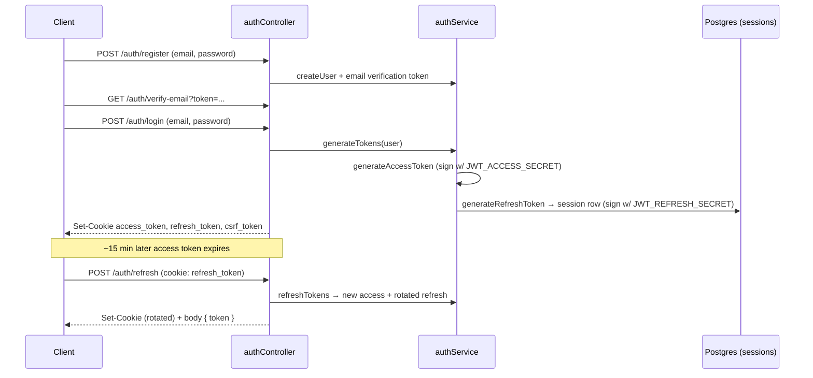
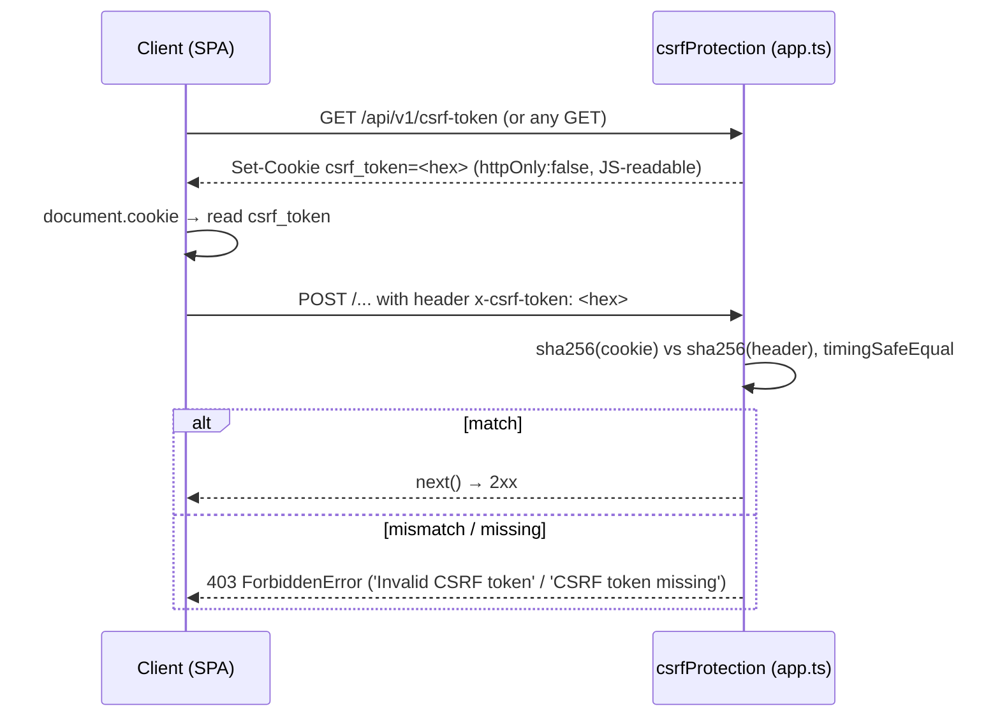
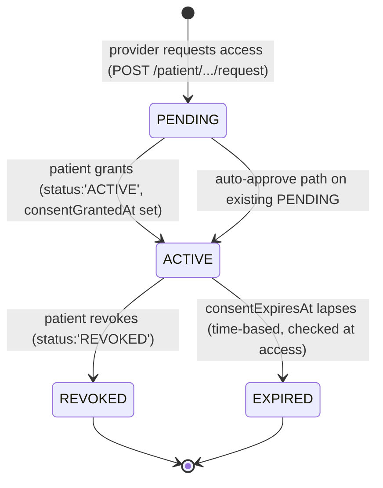
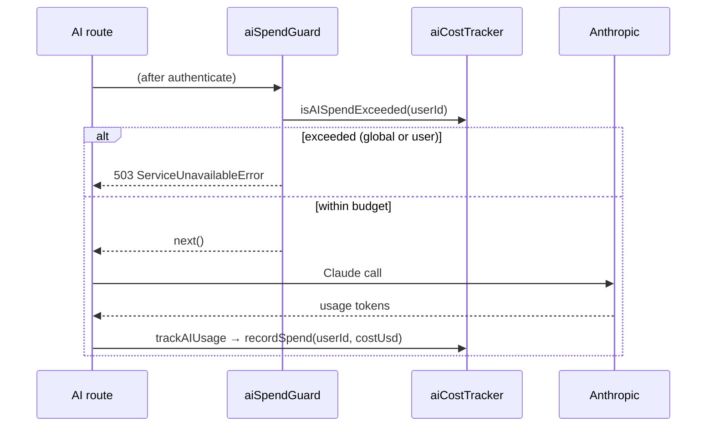
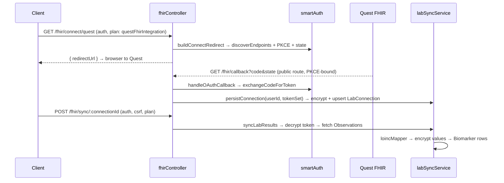
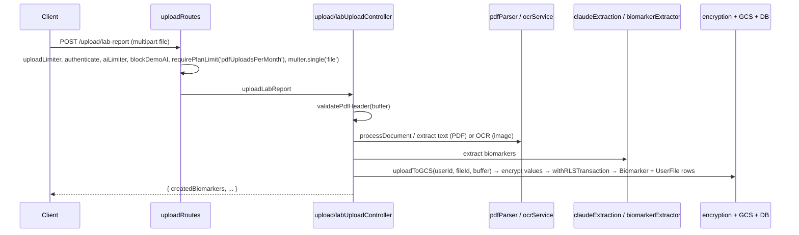
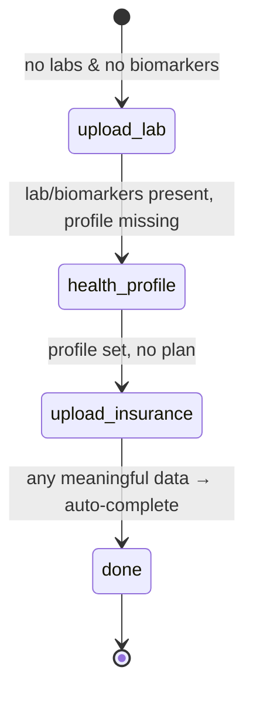
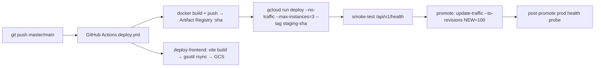

# ARCHITECTURE.md — OwnMyHealth System Overview

> **Status**: Generated 2026-06-01 against the live codebase at repo root `C:/Users/breil/Projects/OwnMyHealth/`.
> **Scope**: The system-overview reference. This doc is the root of the `New Project Documents/` cross-link graph; every other doc points back here for the big picture. Per-endpoint contracts live in [API_REFERENCE.md](./API_REFERENCE.md); full schema in [DATA_MODEL.md](./DATA_MODEL.md).
> This doc was written to be read **without repo access** — every non-trivial claim cites `file:path:line`.

---

## 1. System overview

OwnMyHealth is a privacy-first, HIPAA-oriented health-tracking platform: patients track biomarkers, manage insurance plans (with AI Summary-of-Benefits extraction), project/track medical expenses, set health goals, sync lab results from Quest via SMART-on-FHIR, and chat with an AI Health Guide. All Protected Health Information (PHI) is encrypted at the application layer (AES-256-GCM, per-user keys) and protected at the database layer by PostgreSQL Row-Level Security (RLS). Provider–patient data sharing is consent-gated; an admin tier manages users and audit logs.

The backend is an Express + TypeScript API (`backend/src/app.ts`) on Cloud Run; the frontend is a React + Vite SPA served from a GCS bucket; data lives in Cloud SQL PostgreSQL.

### Deployment topology (ASCII)

```
  ┌─────────────┐      ┌──────────────────────┐      ┌─────────────────────┐
  │  Browser    │─GET─▶│  GCS bucket          │      │  Cloud SQL (PG)     │
  │  (React SPA)│      │  ownmyhealth-frontend│      │  (DATABASE_URL)     │
  └──────┬──────┘      └──────────────────────┘      └──────────┬──────────┘
         │  JSON + HttpOnly cookies                              ▲
         │  (access_token, refresh_token, csrf_token)            │ pg Pool (SSL)
         ▼                                                       │
  ┌────────────────────────────┐                                │
  │  Cloud Run                 │────────────────────────────────┘
  │  ownmyhealth-backend       │   project: ownmyhealth-prod, region: us-central1
  │  (Node 20 Alpine, app.js)  │
  └───┬─────────┬─────────┬────┘
      │         │         │
      ▼         ▼         ▼
  Anthropic  SendGrid   Google {Document AI (OCR), Cloud Storage (uploads)}
  Claude API  email      + Quest SMART-on-FHIR (external lab)
```

Topology constants are from the deploy workflow: `PROJECT_ID: ownmyhealth-prod`, `REGION: us-central1`, `SERVICE: ownmyhealth-backend`, `FRONTEND_BUCKET: ownmyhealth-frontend` (`.github/workflows/deploy.yml:21-25`). The hardcoded prod frontend origins are `https://app.ownmyhealth.io` and `https://ownmyhealth.io` (`backend/src/app.ts:65-68`); the prod API is `https://api.ownmyhealth.io` (`.github/workflows/deploy.yml:176`).

---

## 2. Technology stack

Versions are the declared semver ranges from `package.json` (root) and `backend/package.json`.

### Frontend

| Component | Technology | Version | Source |
|---|---|---|---|
| UI framework | React + React DOM | ^18.3.1 | `package.json:28-29` |
| Build tool | Vite | ^7.3.0 | `package.json:58` |
| Language | TypeScript | ^5.5.3 | `package.json:56` |
| Styling | TailwindCSS | ^3.4.1 | `package.json:54` |
| Charts | Recharts | ^3.5.0 | `package.json:30` |
| Icons | lucide-react | ^0.344.0 | `package.json:26` |
| Client-side PDF | pdfjs-dist / jspdf | ^4.0.379 / ^4.2.1 | `package.json:27,24` |
| Client-side OCR | tesseract.js | ^5.0.4 | `package.json:32` |
| Tests | Vitest + Testing Library | ^4.1.0 | `package.json:59,39` |
| E2E | Playwright | ^1.59.1 | `package.json:36` |

### Backend

| Component | Technology | Version | Source |
|---|---|---|---|
| Runtime | Node.js | >=18.0.0 (Cloud Run runs Node 20 Alpine) | `backend/package.json:74`, `backend/Dockerfile:4,24` |
| HTTP framework | Express | ^4.18.2 | `backend/package.json:31` |
| Language | TypeScript | ^5.3.2 | `backend/package.json:69` |
| Security headers | helmet | ^7.1.0 | `backend/package.json:33` |
| Rate limiting | express-rate-limit + rate-limit-redis + ioredis | ^8.3.2 / ^4.3.1 / ^5.11.0 | `backend/package.json:32,41,34` |
| Auth | jsonwebtoken / bcryptjs | ^9.0.2 / ^2.4.3 | `backend/package.json:35,26` |
| Validation | zod | ^3.22.4 | `backend/package.json:43` |
| Compression | compression | ^1.8.1 | `backend/package.json:27` |
| File upload | multer | ^2.0.2 | `backend/package.json:37` |
| PDF parsing | pdf-parse / pdf-lib | 1.1.1 / ^1.17.1 | `backend/package.json:39,38` |

### Database

| Component | Technology | Version | Source |
|---|---|---|---|
| Database | PostgreSQL (Cloud SQL) | — | `backend/src/services/database.ts:50,108` |
| ORM | Prisma client | ^7.7.0 | `backend/package.json:24` |
| PG adapter | @prisma/adapter-pg | ^7.8.0 | `backend/package.json:23` |
| Driver | pg | ^8.16.3 | `backend/package.json:40` |
| Models | 18 Prisma models | — | `backend/prisma/schema.prisma`; count per `prompts/00-index.md:122` |

### External services

| Service | Library | Version | Used by | Source |
|---|---|---|---|---|
| Anthropic Claude | @anthropic-ai/sdk | ^0.91.1 | AI chat, biomarker guidance, SBC/lab extraction | `backend/package.json:20`, `backend/src/services/anthropicClient.ts:21` |
| Google Document AI | @google-cloud/documentai | ^9.5.0 | image/PDF OCR | `backend/package.json:21` |
| Google Cloud Storage | @google-cloud/storage | ^7.19.0 | lab/SBC file storage | `backend/package.json:22` |
| SendGrid | @sendgrid/mail | ^8.1.4 | verification, reset, engagement email | `backend/package.json:25` |
| Quest SMART-on-FHIR | (native `fetch`) | — | lab-result sync | `backend/src/services/fhir/smartAuth.ts:186` |

---

## 3. Request lifecycle

A request passes the global middleware stack (mounted in `app.ts`), is routed to a per-domain router (which applies route-level middleware), reaches a controller, which calls a service wrapped in `withRLSContext`/`withRLSTransaction`, which sets the RLS session variable before Prisma issues SQL.

```mermaid
sequenceDiagram
  participant C as Client (browser)
  participant M as Global middleware (app.ts)
  participant R as Route router (routes/*)
  participant Ctl as Controller
  participant Svc as Service / RLS wrapper
  participant DB as Prisma + Postgres

  C->>M: request (cookies: access_token, refresh_token, csrf_token)
  M->>M: helmet → cors → cookieParser → compression → csrfProtection → standardLimiter → morgan → json/urlencoded → requireJsonContentType → /api no-store
  M->>R: app.use('/api/v1', routes)
  R->>R: authenticate → (validate) → (rbac / plan / aiSpendGuard / demo) → route-specific limiter
  R->>Ctl: handler
  Ctl->>Svc: withRLSContext(userId, tx => tx.X.find...)
  Svc->>DB: SELECT set_config('app.current_user_id', :userId, true); then query via tx
  DB-->>Svc: rows (PHI ciphertext)
  Svc-->>Ctl: decrypt(value, userSalt)
  Ctl-->>C: JSON { success, data } (auditService.log in parallel)
```

### Worked example — `POST /api/v1/biomarkers`

| Step | What runs | Source |
|---|---|---|
| 1 | Global stack (helmet…no-store) | `backend/src/app.ts:125-262` |
| 2 | `router.use(authenticate)` (router-wide) | `backend/src/routes/biomarkerRoutes.ts:47` |
| 3 | `validate(schemas.biomarker.create)` | `backend/src/routes/biomarkerRoutes.ts:85`; schema `backend/src/middleware/validation.ts:302-318` |
| 4 | `asyncHandler(biomarkerController.createBiomarker)` | `backend/src/routes/biomarkerRoutes.ts:86` |
| 5 | controller encrypts PHI + writes via `withRLSTransaction` | see [§8 Encryption](#8-encryption-layer) and [§6 RLS](#6-row-level-security-rls) |

CSRF is enforced for the `POST` by the global `csrfProtection` (`app.ts:215-217`) because `/biomarkers` is not on any CSRF exemption list (`backend/src/middleware/csrf.ts:98-139`).

---

## 4. Middleware stack (global, in mount order)

The `app.use(...)` sequence in `app.ts` **is** the order. CLAUDE.md's listed order is stale; trust this list (drift logged in [§21](#21-prompt-drift-log)).

| # | Middleware | What it does | `app.ts` line | Module |
|---|---|---|---|---|
| 1 | `app.set('trust proxy', 1)` | trust first proxy hop (Cloud Run LB) for `req.ip` | `app.ts:120` | — |
| 2 | `helmet({...})` | CSP (`default-src 'self'`, `style-src 'unsafe-inline'`), CORP/COEP | `app.ts:125-141` | helmet |
| 3 | `cors(corsOptions)` | origin allowlist + credentials | `app.ts:191` | cors |
| 4 | `app.options('*', cors(corsOptions))` | explicit preflight handler | `app.ts:194` | cors |
| 5 | `cookieParser()` | parse cookies (must precede CSRF/routes) | `app.ts:197` | cookie-parser |
| 6 | `compression({ threshold: 1024, level: 6, filter })` | gzip JSON; **filter opts OUT of `text/event-stream`** (SSE) | `app.ts:204-211` | compression |
| 7 | `csrfProtection` | double-submit cookie validate (dev-skippable via `DISABLE_CSRF`) | `app.ts:215-217` | `middleware/csrf.ts:180` |
| 8 | `standardLimiter` | global rate limit (100 / 15 min default) | `app.ts:220` | `middleware/rateLimiter.ts:17` |
| 9 | `morgan(...)` | request logging; **prod uses query-stripped `PROD_LOG_FORMAT`** | `app.ts:231-245` | morgan |
| 10 | `express.json({ limit: '10mb' })` | JSON body parse | `app.ts:248` | express |
| 11 | `express.urlencoded({ extended: true, limit: '10mb' })` | urlencoded body parse | `app.ts:249` | express |
| 12 | `requireJsonContentType` | reject non-JSON bodies on POST/PUT/PATCH (skips multipart) | `app.ts:252` | `middleware/validation.ts:190` |
| 13 | `/api` `Cache-Control: no-store, no-cache, private` | block intermediate caching of PHI | `app.ts:259-262` | inline |
| 14 | `app.use('/api/v1', routes)` | API router mount | `app.ts:265` | `routes/index.ts` |
| 15 | `app.use('/api/v1/internal', internalRoutes)` | **Cloud Scheduler, shared-secret, CSRF-exempt** | `app.ts:269` | `routes/internalRoutes.ts` |
| 16 | dev-only mock FHIR server | mounted only when `config.isDevelopment` | `app.ts:275-281` | `services/fhir/mockFhirServer.ts` |
| 17 | `notFoundHandler` | 404 → `NotFoundError` | `app.ts:327` | `middleware/errorHandler.ts:214` |
| 18 | `errorHandler` | centralized error shaping (must be last) | `app.ts:330` | `middleware/errorHandler.ts:135` |

**What runs before CSRF validation** (Acceptance Q1): trust-proxy → helmet → cors → OPTIONS handler → cookieParser → compression. CSRF (#7) is next, then the rate limiter and body parsers.

### Route-level middleware (applied inside routers, after global stack)

Routers add their own chain. Examples:

```ts
// Source: backend/src/routes/aiRoutes.ts:21,29-37
router.use(requireBearerAuth);              // Bearer-only (CSRF-exempt SSE route)
router.post('/chat',
  aiLimiter,                                // 10/hr per user
  aiSpendGuard,                             // daily $ budget gate
  blockDemoAI,                              // demo accounts blocked from AI
  requirePlanLimit('aiChatsPerDay'),        // billing-tier gate
  validate(schemas.ai.chat),
  asyncHandler(handleAIChat));
```

Rate limiters available (8 total, `backend/src/middleware/rateLimiter.ts`): `standardLimiter` (`:17`), `authLimiter` (`:37`, 20/15min), `strictAuthLimiter` (`:53`, 5/15min, email+IP keyed, skips successes), `uploadLimiter` (`:76`, 20/hr), `sensitiveLimiter` (`:92`, 10/hr), `aiLimiter` (`:108`, 10/hr per-user-keyed), `providerAccessRequestLimiter` (`:133`, 10/hr per-provider), `bulkOperationLimiter` (`:157`, 30/hr). All swap to a shared Redis store when `REDIS_URL` is set (`rateLimiter.ts:8-14`); otherwise per-instance MemoryStore.

---

## 5. Authentication architecture

JWT access tokens (15 min) + DB-backed refresh tokens (7 days; 30 days for demo). Tokens are delivered as HttpOnly cookies AND the access token is echoed in the refresh response body for `Authorization: Bearer` use after a page reload.



Token signing:

```ts
// Source: backend/src/services/authService.ts:237-250
export function generateAccessToken(user: User): string {
  const payload: TokenPayload = {
    id: user.id, email: user.email, role: user.role,
    plan: user.plan || 'FREE', type: 'access',
  };
  return jwt.sign(payload, config.jwt.accessSecret, {
    ...JWT_SIGN_OPTIONS,
    expiresIn: config.jwt.accessExpiresIn,   // 900s default
  });
}
```

- **Access secret**: `config.jwt.accessSecret` ← `JWT_ACCESS_SECRET` via `requireEnv` (no fallback in any env) — `backend/src/config/index.ts:61`. Expiry default 900s (`config/index.ts:62`).
- **Refresh secret**: `config.jwt.refreshSecret` ← `JWT_REFRESH_SECRET` — `config/index.ts:65`. Expiry 604800s (`config/index.ts:66`). The refresh token also creates a `Session` row keyed by its `jti` (`authService.ts:307-319`).
- **Cookie set**: `access_token` HttpOnly+Secure+SameSite, maxAge 15 min (`authController.ts:94-101`); `refresh_token` (`:113-120`).
- **Verification** on every protected request: `authenticate` reads cookie-first then `Bearer` (`middleware/auth.ts:34-47,71-120`), rejects revoked tokens via `isTokenRevoked` (`auth.ts:87`).
- **Revocation**: in-memory `revokedTokens` map; `revokeAccessToken`/`isTokenRevoked`/`sweepRevokedTokens` (`authService.ts:142-185`). Note: per-instance only — a revoked token still works on other Cloud Run instances until natural expiry.

### Frontend refresh (Acceptance Q12)

The Axios-style client refreshes on a 401 and on app boot:

```ts
// Source: src/services/api/client.ts:145-157
const response = await fetch(`${API_BASE_URL}/auth/refresh`, {
  method: 'POST', credentials: 'include',
  headers: { 'Content-Type': 'application/json' },
});
if (response.ok) {
  const data = await response.json();
  if (data.data?.token) { setAuthToken(data.data.token); }  // store in memory only
  return true;
}
```

- A 401 on a non-auth-management endpoint triggers a single `attemptTokenRefresh()` then one retry (`client.ts:284-311`); concurrent calls share one in-flight `refreshPromise` (`client.ts:137-143`).
- On boot, `AuthContext` calls `authApi.refreshToken()` **first** (using the 7-day refresh cookie) before any data fetch (`src/contexts/AuthContext.tsx:96-109`).
- The access token is stored **in memory only** (`client.ts:64-72`) — never `localStorage` — and a failed refresh logs the user out via `onAuthFailureCallback` (`client.ts:289-291`, `AuthContext.tsx:240`).

---

## 6. CSRF architecture

Stateless double-submit cookie. There is **no server-side CSRF secret**; the server compares the `csrf_token` cookie against the `x-csrf-token` header using a constant-time hash compare.



```ts
// Source: backend/src/middleware/csrf.ts:164-170
const cookieDigest = crypto.createHash('sha256').update(cookieToken).digest();
const headerDigest = crypto.createHash('sha256').update(headerToken).digest();
const tokensMatch = crypto.timingSafeEqual(cookieDigest, headerDigest);
if (!tokensMatch) {
  throw new ForbiddenError('Invalid CSRF token');
}
```

- The compare function is `crypto.timingSafeEqual` over SHA-256 digests (normalizes length so timing doesn't leak token length) — `csrf.ts:159-170`.
- Cookie set on GET / when absent (`csrf.ts:66-76`); `httpOnly: false` so JS can read it (`csrf.ts:43`).
- **Exemptions** (`csrf.ts:98-141`): public auth routes (login/register/demo/refresh/forgot/reset/verify/resend, `/marketplace/plans/search`); bearer-only SSE `/ai/chat`; the scheduler `/internal/audit-cleanup`. The frontend reads the cookie (`src/services/api/client.ts:120-135`) and attaches `x-csrf-token` on every mutating method (`client.ts:229-238`).
- Refresh **rotates** the CSRF cookie to bound its lifetime (`authController.ts:395`).

---

## 7. Row-Level Security (RLS)

PHI tables enable Postgres RLS. The app sets `app.current_user_id` (and `app.is_admin`) on a transaction with `SET LOCAL` (via `set_config(..., true)`); policies compare it to each row's `user_id`.

### Enforcement path (ASCII)

```
request → authenticate → req.user.id
                          │
                          ▼
   controller: withRLSContext(userId, async (tx) => ...)        services/database.ts:447
                          │
                          ▼
   applyRLSContext: SELECT set_config('app.current_user_id', :userId, true)   database.ts:368-377
                          │
                          ▼
   Prisma queries run THROUGH tx on the SAME pooled connection
                          │
                          ▼
   Postgres policy USING (user_id = current_user_id()
                          OR has_provider_access(user_id,'view_biomarkers')
                          OR is_admin_session())                 migration 20260107:151-157
                          │
                          ▼
                     allowed rows only
```

Policy helpers and a representative table policy:

```sql
-- Source: backend/prisma/migrations/20260107_add_rls_policies/migration.sql:17-36
CREATE OR REPLACE FUNCTION current_user_id() RETURNS uuid AS $$
BEGIN
  RETURN NULLIF(current_setting('app.current_user_id', true), '')::uuid;
EXCEPTION WHEN OTHERS THEN RETURN NULL; END;
$$ LANGUAGE plpgsql STABLE SECURITY DEFINER;

CREATE OR REPLACE FUNCTION is_admin_session() RETURNS boolean AS $$
BEGIN RETURN COALESCE(current_setting('app.is_admin', true), 'false')::boolean;
EXCEPTION WHEN OTHERS THEN RETURN false; END;
$$ LANGUAGE plpgsql STABLE SECURITY DEFINER;
```

```sql
-- Source: backend/prisma/migrations/20260107_add_rls_policies/migration.sql:151-157
CREATE POLICY biomarkers_select ON biomarkers FOR SELECT USING (
  user_id = current_user_id()
  OR has_provider_access(user_id, 'view_biomarkers')
  OR is_admin_session()
);
```

Provider access and the consented-identity read are layered in later migrations: `has_provider_access` checks `status='ACTIVE'` + unexpired consent + the relevant capability flag (`20260107…:39-62`); `has_active_consent` + `users_select_provider` let a provider read a consented patient's identity row (`20260530_add_users_select_provider/migration.sql:33-57`). Full policy catalog: [DATA_MODEL.md#rls-policies](./DATA_MODEL.md).

### The two wrappers (Acceptance Q3)

```ts
// Source: backend/src/services/database.ts:447-456
export async function withRLSContext<T>(userId, fn, options = {}) {
  return runWithRLS(userId, fn, options, {
    maxWait: options.maxWait ?? 20_000,
    timeout: options.timeout ?? 30_000,   // explicit tx timeouts
  });
}
// Source: backend/src/services/database.ts:468-474
export async function withRLSTransaction<T>(userId, fn, options = {}) {
  return runWithRLS(userId, fn, options, undefined);  // Prisma default tx options
}
```

Both wrap the callback in a Prisma `$transaction` and issue `SET LOCAL` via `applyRLSContext`. The practical difference: `withRLSContext` passes explicit `maxWait`/`timeout` (20s/30s) suited to single-statement reads/writes; `withRLSTransaction` uses Prisma's default transaction options and is the idiom for **atomic multi-statement** writes (e.g. create biomarker + history + audit row together). Use `withRLSTransaction` whenever two or more statements must commit/roll back as one unit.

### The footgun (Acceptance Q4)

```
// Source: backend/src/services/database.ts:14-31 (header banner, condensed)
Inside a withRLSContext(userId, async (tx) => ...) callback, EVERY Prisma call
MUST go through `tx`. If you call the module-level `prisma` client, the query
runs on a DIFFERENT pooled connection — one that never received SET LOCAL
app.current_user_id. RLS policies then evaluate current_user_id() as NULL and
the query silently returns/affects nothing for the user (or all rows under a
BYPASSRLS role). No error, no warning — a bypass.
```

`current_user_id()` returns `NULL` when the setting is unset (`migration 20260107…:20`), so under the non-bypass `omh_app` role the policy denies every row. A grep-based CI guard (`scripts/check-rls-wrappers.sh`, wired in `.github/workflows/ci.yml`) fails the build on `prisma.` calls inside controllers/services (`database.ts:26-30`). At boot, `assertNoBypassRLS()` hard-exits production if the DB role has `BYPASSRLS` (`database.ts:218-261`).

---

## 8. Encryption layer

AES-256-GCM authenticated encryption, format `iv:authTag:ciphertext` (all base64), with **per-user keys** derived from a master key.

- **Algorithm / format**: `aes-256-gcm`, 16-byte IV, 16-byte auth tag (`backend/src/services/encryption.ts:57-66,225-227`).
- **Per-user key**: `PBKDF2-SHA512(masterKey, userSalt, 600_000, 32)` — `encryption.ts:85,192-200`. Decryption falls back to the legacy 100k iteration count if the auth tag fails (pre-hardening data) — `encryption.ts:300-315`.
- **Master key**: `PHI_ENCRYPTION_KEY` (≥64 hex chars / 256 bits; placeholder keys rejected in every env) — `encryption.ts:102-142`, `config/index.ts:354-383`.
- **Per-user salt**: stored in `user_encryption_keys` encrypted with the master key; fetched/created via `getUserEncryptionSalt(userId)` under admin RLS context (`backend/src/services/userEncryption.ts:29-72`).
- **Audit-log PHI** uses the **system salt** (`AUDIT_LOG_SALT`), not a per-user salt — because audit logs survive account deletion (per-user salts are destroyed on deletion) — `backend/src/services/auditLog.ts:148,220`.

```ts
// Source: backend/src/services/encryption.ts:262-278
encrypt(plaintext: string, userSalt: string): string {
  if (!plaintext) return '';
  const salt = Buffer.from(userSalt, 'hex');
  const key = this.deriveUserKey(salt);
  const iv = crypto.randomBytes(IV_LENGTH);
  const cipher = crypto.createCipheriv(ALGORITHM, key, iv);
  let encrypted = cipher.update(plaintext, 'utf8', 'base64');
  encrypted += cipher.final('base64');
  const authTag = cipher.getAuthTag();
  return `${iv.toString('base64')}:${authTag.toString('base64')}:${encrypted}`;
}
```

**Where encryption runs / where decryption runs** (Acceptance Q5): the single `EncryptionService` (`encryption.ts`) does both. Controllers/services **encrypt before DB write** (e.g. lab upload: `controllers/upload/labUploadController.ts:47,86-125`; FHIR tokens: `services/fhir/labSyncService.ts:140-162`) and **decrypt on read** (e.g. biomarker guidance: `routes/biomarkerRoutes.ts:180,188`; FHIR token use: `labSyncService.ts:211-214`). The canonical per-model field map is `PHI_FIELDS` (`encryption.ts:410-486`); the canonical list lives in [PHI_TAXONOMY.md](./PHI_TAXONOMY.md).

---

## 9. Provider-patient consent

The real status enum is `ProviderPatientStatus { PENDING, ACTIVE, SUSPENDED, REVOKED, EXPIRED }` (`backend/prisma/schema.prisma:515-521`). Capability flags on `ProviderPatient`: `canViewBiomarkers` (default true), `canViewInsurance` (default false), `canViewHealthNeeds` (default true), `canEditData` (default false), plus `consentGrantedAt` / `consentExpiresAt` (`schema.prisma:98-105`).



Observed transitions in `backend/src/routes/patientRoutes.ts`: relationship created `PENDING` (`:209`); grant sets `status:'ACTIVE'` + `consentGrantedAt` + `consentExpiresAt` (`:226-232`); revoke sets `status:'REVOKED'` (`:457,466`); permission updates require `status==='ACTIVE'` and a non-expired `consentExpiresAt` (`:346,362-370`). `SUSPENDED` exists in the enum but no transition writing it was found in `patientRoutes.ts` — treat suspend as schema-supported but currently UI/route-unwired (see drift log [§21](#21-prompt-drift-log)). Expiry is enforced lazily at read time both in the RLS function (`has_provider_access` `consent_expires_at > NOW()`, `migration 20260107…:49`) and in middleware (`rbac.ts:233`).

Authorization combines two checks: the DB RLS policy (`has_provider_access`) and the app-layer `checkProviderPatientAccess` (`backend/src/middleware/rbac.ts:202-250`), which re-validates `status==='ACTIVE'`, expiry, and the specific capability flag.

---

## 10. AI extraction architecture

Five Claude-backed subflows share `getAnthropicClient()` (`backend/src/services/anthropicClient.ts:46-60`, 30s timeout / 2 retries) and are fronted by `aiLimiter` + `aiSpendGuard` + `blockDemoAI` + a `requirePlanLimit`. Every flow checks the BAA gate (`config.anthropic.baaActive`) and refuses (503) if false.

### 10a. Health Guide chat (SSE)

```mermaid
sequenceDiagram
  participant C as Client (EventSource)
  participant R as aiRoutes
  participant Ctl as aiChatController.handleAIChat
  participant K as knowledgeRetrieval
  participant A as Anthropic SDK
  C->>R: POST /ai/chat (Bearer; message, history)
  R->>R: requireBearerAuth, aiLimiter, aiSpendGuard, blockDemoAI, requirePlanLimit('aiChatsPerDay')
  R->>Ctl: handleAIChat
  Ctl->>Ctl: if !baaActive → 503 (audit CHAT_BLOCKED_NO_BAA)
  Ctl->>Ctl: assembleHealthContext(userId) [RLS-scoped decrypt]
  Ctl->>K: retrieveKnowledge(message, context, budget)
  Ctl->>Ctl: sanitizeForPrompt(message + history)
  Ctl->>A: messages stream → SSE data: lines
  A-->>C: text/event-stream chunks
  Ctl->>Ctl: trackAIUsage(...)
```

Entry: `aiChatController.handleAIChat` (`backend/src/controllers/aiChatController.ts:118`); BAA gate `:128-141`; SSE headers `:180-184`; sanitization `:169-175`.

### 10b. Biomarker guidance

`POST /api/v1/biomarkers/:id/guidance` → BAA gate (`routes/biomarkerRoutes.ts:137-151`) → load biomarker under RLS (`:160-171`) → decrypt (`:180-188`) → `claude-haiku-4-5-20251001` (`:233`) → `stripPHIFromText` (`:244`) → `trackAIUsage` (`:248`) → audit `PHI_ACCESS` (`:266-272`). The dedicated `extractBiomarkersWithClaude` service (lab text) uses the same model (`services/claudeExtraction.ts:93,146`, BAA gate `:106`).

### 10c. Insurance SBC extraction

`extractInsuranceFromSBC` (`backend/src/services/sbcExtraction.ts:756`) — BAA gate `:767`, model `claude-sonnet-4-5-20250929` (`:804`), `trackAIUsage` (`:844`). Driven by the SBC upload flow (§13).

### 10d. Lab-report biomarker extraction

`extractBiomarkersWithClaude` (`claudeExtraction.ts:93`) over parsed PDF text; results encrypted and written as `Biomarker` rows (see §13).

### 10e. Cost analysis

Expense cost analysis calls Claude from `expenseController` and persists the response to `CostAnalysis.claudeResponseEncrypted` (encrypted before write) — see [PHI_TAXONOMY.md](./PHI_TAXONOMY.md) item #3 and [DATA_MODEL.md#costanalysis](./DATA_MODEL.md).

---

## 11. AI cost-control architecture

Two layers cap spend: per-user/IP **rate** (`aiLimiter`, 10/hr) and per-day **dollar budget** (`aiSpendGuard`).



```ts
// Source: backend/src/services/aiCostTracker.ts:69-78
export function isAISpendExceeded(userId): { exceeded: boolean; scope: 'global'|'user'|null } {
  rollIfNewDay();
  if (config.ai.dailyBudgetUsd > 0 && globalSpentUsd >= config.ai.dailyBudgetUsd)
    return { exceeded: true, scope: 'global' };
  if (config.ai.userDailyBudgetUsd > 0 && (userSpentUsd.get(userId) ?? 0) >= config.ai.userDailyBudgetUsd)
    return { exceeded: true, scope: 'user' };
  return { exceeded: false, scope: null };
}
```

- Guard middleware: `aiSpendGuard` reads the accumulator and fails closed with 503 (`backend/src/middleware/aiSpendGuard.ts:23-48`). Must run **after** `authenticate` (`:11-14`).
- Budgets: `AI_DAILY_BUDGET_USD` (default 50) and `AI_USER_DAILY_BUDGET_USD` (default 5) — `config/index.ts:195-198`. `0` disables that scope.
- Accumulator is **in-memory per-instance, per-UTC-day** — under autoscale the effective ceiling is N×budget (`aiCostTracker.ts:30-54`). Pricing table feeds the estimate (`aiCostTracker.ts:16-19`).
- **BAA runtime gate**: `ANTHROPIC_BAA_ACTIVE` — production refuses to boot if `ANTHROPIC_API_KEY` is set but the flag is unset (`config/index.ts:300-313`); every AI call site re-checks `config.anthropic.baaActive` (e.g. `aiChatController.ts:129`). Mirrored for OCR via `GOOGLE_BAA_ACTIVE` (`config/index.ts:320-333`). See [ENV_VARS.md](./ENV_VARS.md).

---

## 12. Quest SMART-on-FHIR lab sync

OAuth (PKCE) connect → encrypted tokens on `LabConnection` → `labSyncService` pull → `loincMapper` → encrypted `Biomarker` rows.



- Routes: `GET /fhir/connect/quest`, public `GET /fhir/callback`, `GET /fhir/connections`, `POST /fhir/sync/:connectionId`, `DELETE /fhir/connections/:id` (`backend/src/routes/fhirRoutes.ts:24-60`). The callback is the one route without session auth — bound by the PKCE `state` (`fhirRoutes.ts:17-24`, `fhirController.ts:72-96`).
- **Token storage**: `persistConnection` encrypts both tokens with the user's per-user key and writes `accessTokenEncrypted` / `refreshTokenEncrypted` on `LabConnection` (`services/fhir/labSyncService.ts:140-162`; model `schema.prisma:692-716`).
- **SSRF guard**: `assertAllowedFhirUrl` confines every server-supplied FHIR/SMART URL to the trusted base host + `QUEST_FHIR_AUTH_HOSTS` allowlist, blocks private/loopback/metadata hosts, and refuses cleartext http to public hosts (`backend/src/services/fhir/urlSafety.ts:56-91`, `isPrivateOrLoopbackHost:20-35`). Called from `smartAuth.discoverEndpoints` (`smartAuth.ts:119-125`).
- **Env vars**: `QUEST_FHIR_CLIENT_ID`/`CLIENT_SECRET`/`BASE_URL`/`REDIRECT_URI`/`SUCCESS_REDIRECT`/`AUTH_HOSTS` (`config/index.ts:205-224`). Feature disabled unless `clientId` is set; dev can point `QUEST_FHIR_BASE_URL` at the mock server (`config/index.ts:200-209`).

---

## 13. File upload + OCR pipeline



- Routes: `POST /upload/lab-report`, `/upload/insurance-sbc`, `/upload/lab-results-ocr` (`backend/src/routes/uploadRoutes.ts:77-132`). Multer: memory storage, **10MB limit, single file**; lab/SBC accept PDF only, OCR accepts PDF + PNG/JPEG/TIFF/GIF/WEBP (`uploadRoutes.ts:29-68`).
- Lab handler: `uploadLabReport` (`backend/src/controllers/upload/labUploadController.ts:36`) — GCS upload (`:73`), then encrypt + write biomarkers and the `UserFile` atomically under `withRLSTransaction` (`:86-125`).
- SBC handler: `uploadSBC` (`backend/src/controllers/upload/sbcUploadController.ts:33`) → `extractSBCData` (Claude Sonnet + regex fallback) → map to `InsurancePlan` + `InsuranceBenefit` rows, persist source PDF to GCS as `UserFile` (`:40-60`). PHI-to-records path: PDF bytes → `extractSBCData` → `mapExtractedDataToPlanFields`/`mapExtractedBenefits` → encrypted DB write (Acceptance Q15).
- Upload handlers live in `controllers/upload/` (`labUploadController.ts`, `sbcUploadController.ts`, `shared.ts`); the old top-level `uploadController.ts` no longer exists.
- Download is proxied through the backend (auth + RLS) rather than signed URLs, to avoid shareable PHI links (`backend/src/services/storageService.ts:94-110`, `getFileStream`).

---

## 14. Onboarding flow

First-session wizard tracked server-side via `users.onboardingCompletedAt`; auto-heals so existing users aren't ambushed.



- Routes: `GET /onboarding/status`, `POST /onboarding/complete` (auth required) — `backend/src/routes/onboardingRoutes.ts:22-43`.
- Status computes step booleans (`hasLabReport`, `hasInsurancePlan`, `hasBiomarkers`, `hasHealthProfile`) and `suggestedNextStep` (`backend/src/services/onboardingService.ts:14-114`). Priority: lab → profile → insurance (`pickSuggestedStep:49-52`).
- Auto-complete: if any meaningful data exists and no completion stamp, it stamps `onboardingCompletedAt` automatically (`onboardingService.ts:100-107`).
- Frontend components live in `src/components/onboarding/` (`prompts/00-index.md:121`).

---

## 15. Audit logging flow

Every PHI access/mutation writes an encrypted snapshot to `audit_logs`; a scheduler purges rows older than ~7 years.

```
controller/service
   │  auditService.log({ userId, action, resourceType, resourceId,
   │                     previousValue?, newValue?, tx?, failClosed? })
   ▼
auditLog.log()  (backend/src/services/auditLog.ts:237)
   │  encrypt previousValue/newValue with SYSTEM salt (auditLog.ts:220)
   │  if entry.tx → write on SAME tx (atomic with the operation)   :257-264
   │  else → withRLSContext(null, ..., { isAdmin: true })          :266-275
   ▼
audit_logs row (previous_value_encrypted, new_value_encrypted, metadata JSON)
   │
   ▼  daily (or Cloud Scheduler)
cleanupOldLogs(): delete where createdAt < now - 2555 days         :531-555
```

- `RETENTION_DAYS = 2555` (~7 years) — `auditLog.ts:10`.
- **Fail-closed**: for PHI mutations (`failClosed`), a failed audit write re-throws and aborts the operation (`auditLog.ts:291-298`); read/auth audits are best-effort.
- PHI snapshots use the system salt (not per-user) so they remain decryptable after account deletion (`auditLog.ts:148,220`).
- Cleanup runs as an in-process daily `setInterval` **unless** `AUDIT_CLEANUP_TOKEN` is set, in which case it's delegated to Cloud Scheduler POSTing `/internal/audit-cleanup` (`auditLog.ts:582-613`, `routes/internalRoutes.ts:40-72`).

---

## 16. Deployment topology

| Tier | Local (dev) | Staging | Production |
|---|---|---|---|
| `NODE_ENV` | `development` (default/unset) | `staging` | `production` | 
| Backend | `tsx watch src/app.ts` on :3001 | Cloud Run revision | Cloud Run `ownmyhealth-backend` (Node 20 Alpine) |
| Frontend | Vite dev :5173 | — | GCS bucket `ownmyhealth-frontend` |
| DB | local/Prisma Postgres | Cloud SQL | Cloud SQL |
| Claude | runtime-gated (BAA warn) | **BAA inactive — blocked** | gated by `ANTHROPIC_BAA_ACTIVE` |
| SendGrid | optional | **sandbox (no delivery)** | live (sandbox forbidden) |
| Demo account | allowed | allowed | **forbidden** |

Env tiering: `isProductionEnv`/`isStagingEnv`/`isDevelopmentEnv` (`backend/src/config/index.ts:34-36`); staging carveouts (Claude locked, SendGrid sandbox, demo allowed) `config/index.ts:30-33,341-427`. CMD: `sh -c "npx prisma migrate deploy && node dist/app.js"` (`backend/Dockerfile:51`; mirrored `railway.toml:9`). Node version: **Node 20 Alpine** (`Dockerfile:4,24`). Health checks: container `/health` (`Dockerfile:48-49`); Railway `/api/v1/health` (`railway.toml:10`).



Deploy stages: build-and-stage at 0% traffic (`deploy.yml:30-108`), smoke-test (`:114-139`), promote to 100% via explicit `--to-revisions` (`:149-171`), frontend `gsutil rsync` + no-cache `index.html` (`:224-235`). `--max-instances=3` bounds in-memory rate-limiter/spend dilution (`deploy.yml:78-89`). The GitHub workflow that builds + deploys the backend is **`.github/workflows/deploy.yml`** (Acceptance Q18).

### Service-to-service map (production)

```
Cloud Run ──pg Pool (SSL)──▶ Cloud SQL (DATABASE_URL)
          ──HTTPS──▶ api.anthropic.com (Claude, 30s timeout)
          ──HTTPS──▶ Google Document AI (OCR, BAA-gated)
          ──HTTPS──▶ Google Cloud Storage (uploads bucket GCS_BUCKET_NAME)
          ──HTTPS──▶ SendGrid (email)
          ──HTTPS──▶ Quest FHIR (SSRF-allowlisted)
Secrets   ──▶ Secret Manager (JWT_*, PHI_ENCRYPTION_KEY, AUDIT_LOG_SALT, API keys)
```

---

## 17. Scheduled jobs

All run as in-process `setInterval` started in `startServer()` (`backend/src/app.ts:342-349`) and stopped on `SIGTERM`/`SIGINT` (`app.ts:382-395`).

| Job | File:line | Cadence | Effect |
|---|---|---|---|
| Session cleanup | `backend/src/services/authService.ts:1408` (`startSessionCleanup`) | every 10 min | `sweepRevokedTokens()` + delete expired `sessions` rows (`authService.ts:1417-1424,1378-1399`) |
| Audit log cleanup | `backend/src/services/auditLog.ts:582` (`startAuditCleanup`) | daily (24h); **disabled if `AUDIT_CLEANUP_TOKEN` set** → Cloud Scheduler | delete `audit_logs` rows older than 2555 days (`auditLog.ts:531-555`) |
| Engagement email | `backend/src/schedulers/emailScheduler.ts:311` (`startEmailScheduler`) | hourly tick; weekly summary Mon 08:00-08:59 UTC; goal reminders + plan-expiring sweep once per UTC day | SendGrid digests via `notificationService` (`emailScheduler.ts:1-18,280-309`) |

Which scheduler removes expired sessions and at what cadence (Acceptance Q9): `startSessionCleanup` in `authService.ts:1408`, every **10 minutes**.

---

## 18. Role-based access control (RBAC)

Two orthogonal authorization axes: **role** (RBAC) and **billing plan** (plan gating).

### Role hierarchy

```ts
// Source: backend/src/middleware/rbac.ts:16-20
export const ROLE_HIERARCHY = { ADMIN: 3, PROVIDER: 2, PATIENT: 1 } as const;
```

| Role | Level | Capabilities | Source |
|---|---|---|---|
| PATIENT | 1 | own data CRUD; manage provider consent; AI guidance | `rbac.ts:32-38` |
| PROVIDER | 2 | + read/write consented patients' biomarkers/health-needs, read insurance (scoped by capability flags + consent) | `rbac.ts:39-45`, `checkProviderPatientAccess:202-250` |
| ADMIN | 3 | + full access; user management, audit viewer, system health | `rbac.ts:46-52,137-139` |

Helpers: `requireRole(...)` (`rbac.ts:58`), `requireMinRole` (`:77`), `requirePermission` (`:98`), `requireResourceAccess` (`:121`), `adminOnly()` (`:358`), `providerOrAdmin()` (`:365`). Demo accounts are additionally constrained by `demoProtection` middleware (`backend/src/middleware/demoProtection.ts`) — see Q16 below.

### Plan gating (separate axis)

`requirePlanLimit(limitKey)` reads the **current DB plan** (not the possibly-stale JWT), enforces `planExpiresAt`, and 403s with `code:'PLAN_LIMIT_EXCEEDED'` + `upgradeRequired:true` (`backend/src/middleware/planGating.ts:37-113`). The plan catalogue is `backend/src/config/plans.ts` — tiers `FREE`/`PRO`/`TEAM` with per-feature limits (`-1` = unlimited; `plans.ts:40-98`). Which middleware gates by billing plan (Acceptance Q24): `planGating.ts:37` + `config/plans.ts:40`.

### Demo protection (Acceptance Q16)

`blockDemoAI` blocks demo accounts from every AI/upload endpoint (`demoProtection.ts:164-175`), applied in `aiRoutes.ts:33`, `biomarkerRoutes.ts:124`, `uploadRoutes.ts:81,98,128`, `fhirRoutes.ts:33,46,57`. `blockDemoProfileUpdate`/`blockDemoAdminAccess`/`blockDemoUserModification` cover profile/admin/user-mutation routes (`demoProtection.ts:67-156`). Demo identity resolves against `DEMO_EMAIL`; an unset value matches no one (`demoProtection.ts:33-36`). Demo mode is forbidden in production (`config/index.ts:408-414`).

---

## 19. File structure (verified counts, 2026-06-01)

Counts from `prompts/00-index.md:113-125` (verify with `Glob`).

| Directory | Purpose | Count |
|---|---|---|
| `backend/src/routes/` | API route modules (mounted in `routes/index.ts`) | 18 incl. `index.ts` |
| `backend/src/controllers/` | route handlers (+ `controllers/upload/` subdir) | 10 top-level + `index.ts` |
| `backend/src/middleware/` | security/validation middleware | 10 + `index.ts` |
| `backend/src/services/` | business logic (+ `fhir/`, `knowledge/`, `data/`) | ~23 top-level |
| `backend/src/schedulers/` | `emailScheduler.ts` | 1 |
| `backend/src/config/` | `index.ts`, `jwtOptions.ts`, `plans.ts` | 3 |
| `backend/prisma/migrations/` | SQL migrations | 22 dirs |
| `src/components/` | React `.tsx` across 14 dirs | 73 |
| `src/services/api/` | frontend API client modules | 17 + `index.ts` |
| `.github/workflows/` | `ci.yml`, `deploy.yml`, `deploy-staging.yml` | 3 |

Glob to re-verify routes: `Glob pattern: "backend/src/routes/*.ts"`. Models: 18 (`backend/prisma/schema.prisma`), with `InsuranceBenefit`, `SystemConfig`, `LabConnection` added and `DNAVariant`/`GeneticTrait` dropped in `20260423_drop_dna_genetics` (`prompts/00-index.md:122`).

---

## 20. Cross-cutting reference answers

- **Error shape (Acceptance Q19)**: every API error is `{ success: false, error: { code, message, details?, stack? (dev only) } }` (`backend/src/middleware/errorHandler.ts:199-210`). Stack traces and raw messages are suppressed in production (`errorHandler.ts:144,206`).
- **Third-party timeouts (Acceptance Q20)**: Anthropic SDK 30s timeout / 2 retries (`anthropicClient.ts:24-25,56-57`); frontend fetch 30s `AbortController` (`src/services/api/client.ts:12,114-117`); pg pool `connectionTimeoutMillis: 30000`, `statement_timeout: 30000` (`database.ts:112-113`); RLS tx timeouts 30s (`database.ts:454`). FHIR/Quest calls use native `fetch` (no explicit per-call timeout found — relies on platform default).
- **User deletion (Acceptance Q14)**: deletes cascade from `User` — e.g. `ProviderPatient` (`schema.prisma:109-110`) and `LabConnection` (`schema.prisma:711`) declare `onDelete: Cascade`. Audit logs deliberately survive deletion (system-salt encryption). Full cascade matrix: [DATA_MODEL.md#cascades](./DATA_MODEL.md).
- **BAA env vars (Acceptance Q13)**: `ANTHROPIC_BAA_ACTIVE` (Claude) and `GOOGLE_BAA_ACTIVE` (Document AI OCR) — `config/index.ts:185,176,300-333`. See [ENV_VARS.md](./ENV_VARS.md).
- **Cost model**: per-user dollar cost is not derivable from code. `TBD (external: per-user cost estimate lives in the billing console — see FINANCIAL_TRACKER.md)`.

---

## Acceptance questions — self-check

1. **Middleware before CSRF, in order?** §4: trust-proxy → helmet → cors → OPTIONS → cookieParser → compression, then CSRF. ✓
2. **How is the RLS user identified?** §3/§7: `authenticate` sets `req.user.id`; controllers pass it to `withRLSContext(userId, tx => ...)` which sets `app.current_user_id`. ✓
3. **`withRLSContext` vs `withRLSTransaction`?** §7: both wrap a tx + SET LOCAL; the latter uses Prisma default tx options and is for atomic multi-statement writes. ✓
4. **Why is `prisma.X` inside the callback wrong?** §7: it runs on a different connection without SET LOCAL → policy sees `current_user_id()` NULL → bypass/empty. ✓
5. **Which service encrypts/decrypts PHI?** §8: `EncryptionService` (`encryption.ts`); encrypt before write, decrypt on read. ✓
6. **How does CSRF double-submit work / compare fn?** §6: `crypto.timingSafeEqual` over SHA-256 digests of cookie vs header. ✓
7. **Consent state machine?** §9: PENDING → ACTIVE → {REVOKED, EXPIRED}; SUSPENDED in enum but route-unwired. ✓
8. **Which limiter guards Claude endpoints?** §4/§10/§11: `aiLimiter` (10/hr, user-keyed). ✓
9. **Session-cleanup scheduler + cadence?** §17: `startSessionCleanup` (`authService.ts:1408`), every 10 min. ✓
10. **Cloud Run vs Cloud SQL vs GCS in prod?** §1/§16: backend in Cloud Run, DB in Cloud SQL, frontend + uploads in GCS. ✓
11. **`POST /api/v1/biomarkers` path?** §3 worked example. ✓
12. **Frontend refresh of expired token?** §5: `attemptTokenRefresh` POSTs `/auth/refresh` with the refresh cookie. ✓
13. **BAA env vars?** §11/§20: `ANTHROPIC_BAA_ACTIVE`, `GOOGLE_BAA_ACTIVE`. ✓
14. **What changes on user delete?** §20: cascades (ProviderPatient, LabConnection…); audit logs survive. ✓
15. **SBC upload PDF→records?** §13: PDF → `extractSBCData` → map → encrypted `InsurancePlan`/`InsuranceBenefit`. ✓
16. **Which middleware blocks demo PHI/AI + where?** §18: `blockDemoAI`/`demoProtection` family, applied on AI/upload/profile routes. ✓
17. **Node version in Cloud Run?** §16: Node 20 Alpine; CMD `sh -c "npx prisma migrate deploy && node dist/app.js"`. ✓
18. **Which workflow deploys backend?** §16: `.github/workflows/deploy.yml`. ✓
19. **API error shape?** §20: `{ success:false, error:{ code, message, details?, stack?} }`. ✓
20. **Third-party APIs + timeouts?** §20. ✓
21. **AI spend cap?** §11: `aiSpendGuard` + `aiCostTracker`, `AI_DAILY_BUDGET_USD`/`AI_USER_DAILY_BUDGET_USD`. ✓
22. **Quest connect + token storage?** §12: OAuth via `smartAuth`, encrypted `LabConnection.accessTokenEncrypted`/`refreshTokenEncrypted`. ✓
23. **FHIR SSRF protection?** §12: `services/fhir/urlSafety.ts` host allowlist + private-host block. ✓
24. **Plan-gating middleware + catalogue?** §18: `planGating.ts` + `config/plans.ts`. ✓
25. **Real `ProviderPatientStatus` states?** §9: PENDING, ACTIVE, SUSPENDED, REVOKED, EXPIRED (`schema.prisma:515-521`). ✓

---

## 21. Prompt drift log

- **CLAUDE.md middleware order is stale.** CLAUDE.md "Middleware Stack" lists Helmet → CORS → Cookie Parser → CSRF → Rate Limiting → Body Parser. The actual order inserts `compression` between cookieParser and CSRF, and places `standardLimiter` **after** CSRF, not before (`backend/src/app.ts:197-220`). Plus `morgan`, `requireJsonContentType`, and the `/api` no-store layer that CLAUDE.md omits. This doc follows the code.
- **CLAUDE.md controller/middleware/service counts are stale.** CLAUDE.md says "controllers (10 files)" including `uploadController.ts`, "middleware (8 files)", "services (18 files)". Actual: the single `uploadController.ts` is gone (split into `controllers/upload/`), middleware is 10 modules + `index.ts`, services ~23 top-level. Counts here follow `prompts/00-index.md:113-125`.
- **`ProviderPatientStatus.SUSPENDED` has no writer.** The enum includes `SUSPENDED` (`schema.prisma:519`) and the spec's example state machine includes `ACTIVE↔SUSPENDED` transitions, but no route in `backend/src/routes/patientRoutes.ts` writes `status:'SUSPENDED'` (grep found only PENDING/ACTIVE/REVOKED writes). The §9 diagram reflects the wired transitions and notes SUSPENDED as schema-only.
- **RLS migration `20260107` still references dropped tables/columns.** The original RLS migration enables RLS on `dna_data`/`dna_variants`/`genetic_traits` and `has_provider_access` references `can_view_dna` (`migration.sql:75-77,53`). Those models/columns were dropped in `20260423_drop_dna_genetics`; the migration text is historical and superseded — current schema has no DNA tables (`prompts/00-index.md:122`).
- **`config/index.ts` exposes more env vars than CLAUDE.md's list.** Notably `AUDIT_LOG_SALT`, `REDIS_URL`, `AUDIT_CLEANUP_TOKEN`, `AI_DAILY_BUDGET_USD`, `AI_USER_DAILY_BUDGET_USD`, `ANTHROPIC_BAA_ACTIVE`, `GOOGLE_BAA_ACTIVE`, the full `QUEST_FHIR_*` set, `COOKIE_DOMAIN`/`COOKIE_SAME_SITE`, `DATABASE_POOL_SIZE`, `SENDGRID_SANDBOX_MODE`. Catalogued in [ENV_VARS.md](./ENV_VARS.md).

---

## Related Documents

- [API_REFERENCE.md](./API_REFERENCE.md) — per-endpoint contracts (request/response, auth, rate limits, audit).
- [ROUTING_TABLE.md](./ROUTING_TABLE.md) — full per-route middleware chains.
- [DATA_MODEL.md](./DATA_MODEL.md) — complete ER, per-model tables, RLS policy catalog, cascade matrix.
- [PHI_TAXONOMY.md](./PHI_TAXONOMY.md) — every PHI field × encryption × write/read sites × audit coverage.
- [ENV_VARS.md](./ENV_VARS.md) — required + optional env vars, consumers, secret classification, BAA gates.
- [RUNBOOK.md](./RUNBOOK.md) — operating this stack (deploy, rollback, scheduler ops).
- [LOCAL_DEV.md](./LOCAL_DEV.md) — running backend + frontend + DB locally (mock FHIR, `DISABLE_CSRF`).
- [SECURITY_STATUS.md](./SECURITY_STATUS.md) — open findings against these flows (BAA gates, RLS, SSRF).
- [HIPAA_CHECKLIST.md](./HIPAA_CHECKLIST.md) — which §164.312 safeguard each layer satisfies.
- [FINANCIAL_TRACKER.md](./FINANCIAL_TRACKER.md) — cost model and per-user AI spend.
