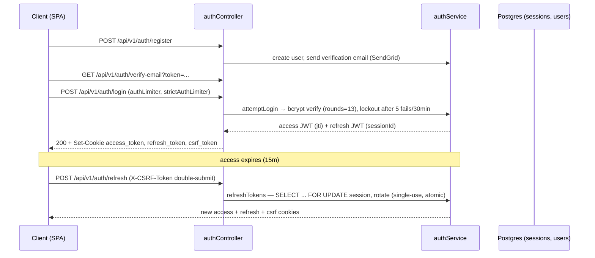
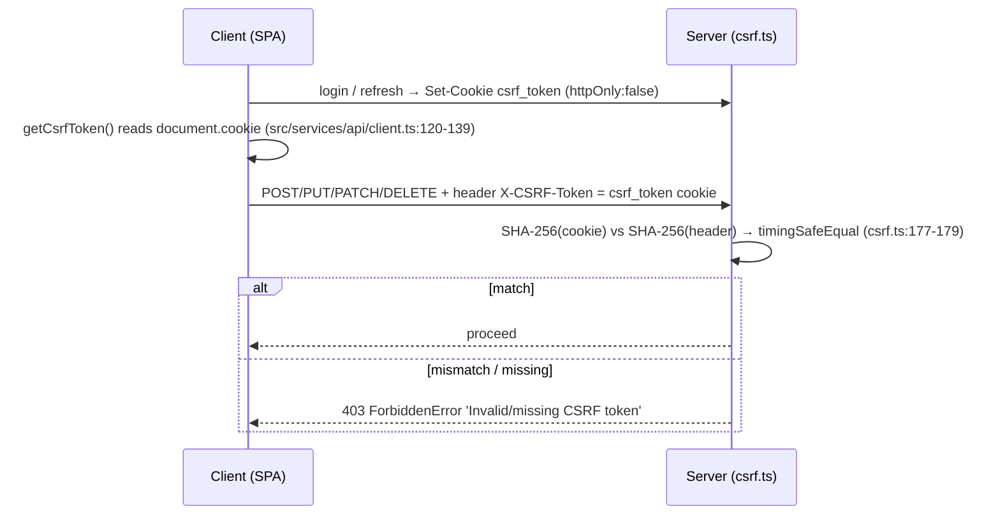
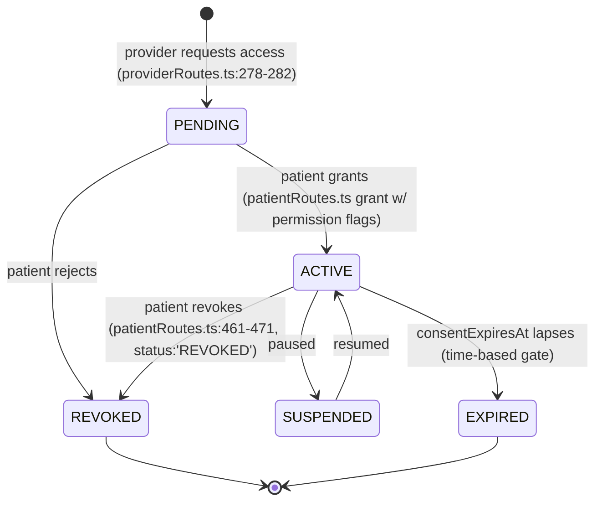
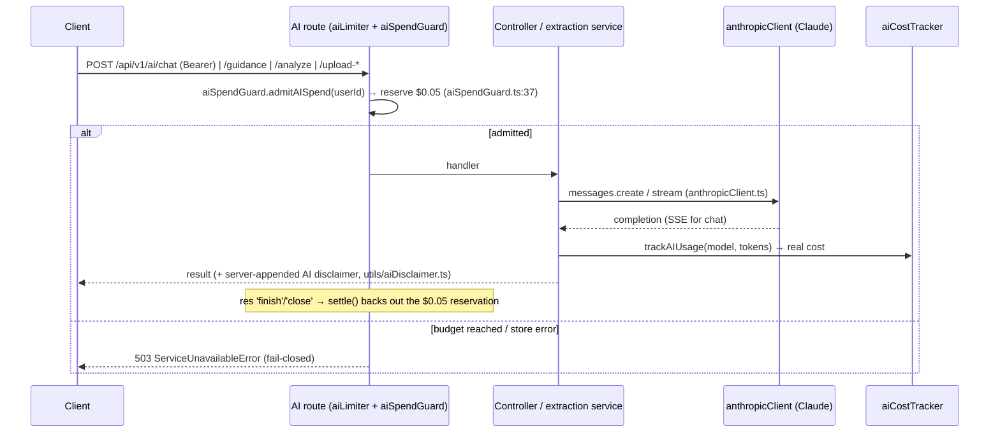
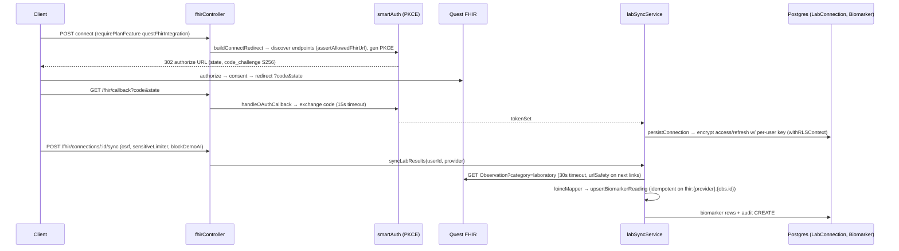
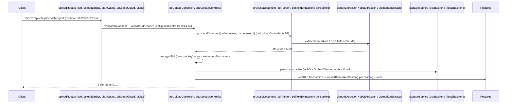
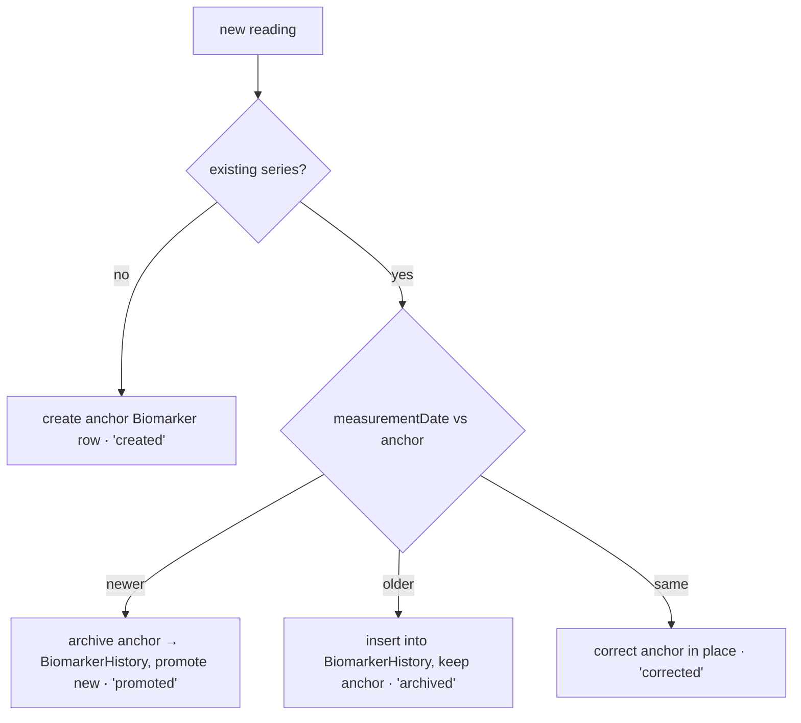
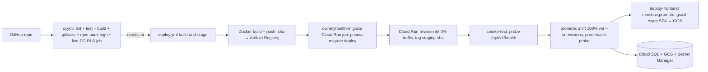
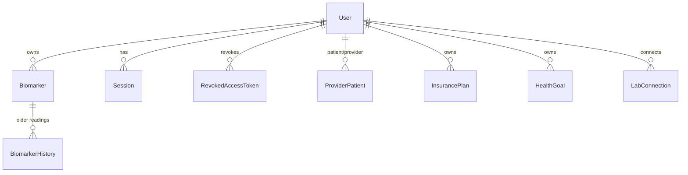

# ARCHITECTURE.md — OwnMyHealth System Overview

> **Code state**: `master` @ `12b45ae` · **Refreshed**: 2026-08-01 (previous: `fb2cd32`, 2026-06-16) · **Posture**: sandbox — no GCP, see [OPEN_FINDINGS.md §Posture](./OPEN_FINDINGS.md) · **Scope**: backend (`backend/src/`) + frontend (`src/`) + infra (`.github/workflows/`, `backend/Dockerfile`).
>
> **Read §1 and §16 with this in mind.** GCP billing was disabled ~2026-07-12 and the project has no deployment target. The Cloud Run / Cloud SQL / GCS topology described below is the **launch architecture**, not a running system. What actually runs today is the same application code against a local Postgres and the **local encrypted-disk storage backend** (§13.0, new — OF-23).
>
> This is the **root** of the `New Project Documents/` cross-link graph. It orients a reader to OwnMyHealth's moving parts: tech stack, request lifecycle, middleware stack, security data flows (auth, CSRF, RLS, encryption, consent), AI extraction + cost control, Quest SMART-on-FHIR lab sync, file/OCR pipeline, onboarding, audit logging, deployment topology, and schedulers. Per-endpoint, per-model, and per-field detail is deferred to the sibling docs linked at the bottom.

## Required reading before generating

This doc was generated against [`_doc-quality.md`](../prompts/_doc-quality.md), [`_verification-tools.md`](../prompts/_verification-tools.md), and [`_phi-inventory.md`](../prompts/_phi-inventory.md). It is held to the five tests in `_doc-quality.md` (question-answering, path-and-line, snippet, diagram, reproducibility).

---

## 1. System overview

OwnMyHealth is a **privacy-first, HIPAA-grade health-tracking platform**: patients track biomarkers (with longitudinal trends and AI educational guidance), upload lab reports and insurance documents (parsed by Claude + Google Document AI OCR), connect Quest lab accounts over SMART-on-FHIR, track health goals/needs and medical expenses, and share data with providers under consent-based, granular access control. All PHI is AES-256-GCM encrypted with per-user keys, every PHI access is audit-logged with DB-enforced 7-year retention, and PostgreSQL **FORCE ROW LEVEL SECURITY** isolates each user's rows.

The system is a **React SPA served from a GCS bucket** talking to a **stateless Express API on Cloud Run** backed by **Cloud SQL Postgres**, with Anthropic, Google Document AI, SendGrid, and Quest FHIR as external services.

> **As of 2026-07-14 that topology is the target, not the state.** GCP billing is disabled; nothing is
> deployed. The same Express API and SPA run locally against local Postgres, with uploaded files held
> by the **local AES-256-GCM disk backend** instead of GCS (§13.0). Every security property in the
> paragraph above — per-user encryption, audit retention, FORCE RLS — is application-level and holds
> identically in both configurations; only the hosting substrate is suspended.

```
  ┌─────────────┐     ┌──────────────────┐     ┌───────────────────┐
  │  Browser    │────▶│  GCS bucket      │     │  Cloud SQL (PG 16)│
  │  (React SPA)│     │  frontend static │     │  ownmyhealth db   │ ← via Cloud SQL connector
  └──────┬──────┘     └──────────────────┘     └─────────┬─────────┘
         │                                                ▲
         │ JSON + httpOnly cookies (access, refresh,      │ FORCE RLS,
         │ csrf_token) — credentials: 'include'           │ SET LOCAL app.current_user_id
         ▼                                                │
  ┌────────────────────────────┐                         │
  │  Cloud Run                 │─────────────────────────┘
  │  ownmyhealth-backend       │   (+ deploy-time job: ownmyhealth-migrate,
  │  Node 22 alpine, app.ts    │    + manual job: ownmyhealth-maintenance)
  └─┬────────┬────────┬────────┬───────────┐
    │        │        │        │           │
    ▼        ▼        ▼        ▼           ▼
 Anthropic SendGrid  Google   GCS        Quest FHIR
 (Claude)  (email)   Doc AI   (uploads)  (SMART-on-FHIR)
                     (OCR)               + Secret Manager (secrets)
```

Server entry point is **`backend/src/app.ts`** (NOT `index.ts`); the production container runs `CMD ["node", "dist/app.js"]` (`backend/Dockerfile:93`).

---

## 2. Technology stack

Versions are pinned in `package.json` (frontend, repo root) and `backend/package.json`.

### Frontend

| Component | Technology | Version | Source |
|---|---|---|---|
| UI library | React + React DOM | `^18.3.1` | `package.json:28-29` |
| Build tool | Vite | `^8.0.16` | `package.json:58` |
| Language | TypeScript | `^5.5.3` | `package.json:56` |
| Styling | Tailwind CSS | `^3.4.1` | `package.json:54` |
| Charts | Recharts | `^3.5.0` | `package.json:30` |
| Icons | lucide-react | `^0.344.0` | `package.json:26` |
| Client-side PDF | pdfjs-dist | `^4.0.379` | `package.json:27` |
| Client-side OCR | tesseract.js | `^5.0.4` | `package.json:32` |
| PDF export | jspdf + jspdf-autotable | `^4.2.1` / `^5.0.2` | `package.json:24-25` |
| Test runner | Vitest | `^4.1.0` | `package.json:59` |
| E2E | @playwright/test | `^1.59.1` | `package.json:36` |

### Backend

| Component | Technology | Version | Source |
|---|---|---|---|
| Runtime | Node.js | `^20.19 \|\| ^22.12 \|\| >=24` (Cloud Run = 22) | `backend/package.json:77`, `backend/Dockerfile:15` |
| Web framework | Express | `^4.18.2` | `backend/package.json:34` |
| Language | TypeScript | `^5.3.2` | `backend/package.json:72` |
| Security headers | helmet | `^7.1.0` | `backend/package.json:36` |
| CORS | cors | `^2.8.5` | `backend/package.json:32` |
| Cookies | cookie-parser | `^1.4.7` | `backend/package.json:31` |
| Compression | compression | `^1.8.1` | `backend/package.json:30` |
| Rate limiting | express-rate-limit + rate-limit-redis | `^8.3.2` / `^4.3.1` | `backend/package.json:35,44` |
| Shared store | ioredis | `^5.11.0` | `backend/package.json:37` |
| JWT | jsonwebtoken | `^9.0.2` | `backend/package.json:38` |
| Password hash | bcryptjs | `^2.4.3` | `backend/package.json:29` |
| File upload | multer | `^2.0.2` | `backend/package.json:40` |
| Validation | zod | `^3.22.4` | `backend/package.json:46` |
| Logging | morgan | `^1.10.0` | `backend/package.json:39` |

### Database / ORM

| Component | Technology | Version | Source |
|---|---|---|---|
| Database | PostgreSQL (Cloud SQL, PG 16 in CI RLS job) | — | `ci.yml` RLS regression job (see [§16](#16-deployment-topology)) |
| ORM | Prisma Client + CLI | `^7.7.0` / `^7.8.0` | `backend/package.json:27,69` |
| Driver/adapter | pg + @prisma/adapter-pg | `^8.16.3` / `^7.8.0` | `backend/package.json:43,26` |
| Schema | 19 models, 13 enums, 34 migrations | — | `backend/prisma/schema.prisma`, [`DATA_MODEL.md`](./DATA_MODEL.md) |

> **Model count note**: `schema.prisma` defines **19 models** (User, Session, RevokedAccessToken, UserEncryptionKey, ProviderPatient, UserFile, Biomarker, BiomarkerHistory, InsurancePlan, InsuranceBenefit, HealthNeed, HealthGoal, GoalProgressHistory, AuditLog, SystemConfig, ExpenseProjection, ExpenseActual, CostAnalysis, LabConnection). `RevokedAccessToken` (`schema.prisma:96`) and `LabConnection` (`schema.prisma:755`) are post-06-01 additions. Full ER + cascades in [`DATA_MODEL.md`](./DATA_MODEL.md).

### External services

| Service | Purpose | SDK / Version | Source |
|---|---|---|---|
| Anthropic Claude | Biomarker guidance, SBC/lab extraction, cost analysis, Health Guide chat | `@anthropic-ai/sdk` `^0.91.1` | `backend/package.json:23` |
| Google Document AI | OCR of scanned lab reports | `@google-cloud/documentai` `^9.5.0` | `backend/package.json:24` |
| Google Cloud Storage | Lab report + SBC file storage, signed URLs | `@google-cloud/storage` `^7.19.0` | `backend/package.json:25` |
| SendGrid | Transactional + engagement email | `@sendgrid/mail` `^8.1.4` | `backend/package.json:28` |
| Quest Diagnostics | SMART-on-FHIR lab result sync | (custom FHIR client, `fetch`) | `backend/src/services/fhir/` |

BAA posture for Anthropic/Google is gated by env vars — see [§11 AI cost control](#11-ai-cost-control-architecture) and [`ENV_VARS.md`](./ENV_VARS.md).

---

## 3. Request lifecycle

A request flows: global middleware (`app.ts`) → versioned router (`/api/v1`) → route-file middleware → controller → service (wrapped in `withRLSContext`/`withRLSTransaction`) → Prisma → Postgres (RLS-policied) → decrypt PHI → JSON response, with an audit log written along the way.

```mermaid
sequenceDiagram
  participant C as Client (SPA)
  participant M as Global middleware (app.ts)
  participant R as Route (routes/*.ts)
  participant Ctl as Controller
  participant Svc as Service
  participant DB as Prisma + Postgres (FORCE RLS)

  C->>M: request (cookies: access_token, refresh_token, csrf_token)
  M->>M: helmet → cors → cookieParser → compression → csrf → standardLimiter → morgan → json/urlencoded → requireJsonContentType → /api no-store
  M->>R: app.use('/api/v1', routes)  (app.ts:265)
  R->>R: authenticate → (csrf for mutations) → validate → rbac/planGating → route limiter → aiSpendGuard → demoProtection
  R->>Ctl: handler
  Ctl->>Svc: withRLSContext(userId, tx => tx.X.find...)
  Svc->>DB: SET LOCAL app.current_user_id = :userId; SQL via tx
  DB-->>Svc: rows (PHI still ciphertext)
  Svc-->>Ctl: decrypt PHI (encryption.ts)
  Ctl-->>C: { success, data } JSON  (auditService.log* in parallel)
```

The version prefix is `config.apiVersion` (mounted at `app.ts:265`); all examples below use `/api/v1`. The error envelope on failure is always `{ success: false, error: { code, message, ... } }` (`errorHandler.ts:L199-L210`, see [§19](#19-error-handling)).

---

## 4. Middleware stack (mount order)

The global stack is the literal `app.use(...)` sequence in `backend/src/app.ts`. There are **11 non-test middleware modules** (`Glob backend/src/middleware/*.ts`, excluding `*.test.ts`): `auth`, `csrf`, `rbac`, `rateLimiter`, `rateLimitStore`, `demoProtection`, `validation`, `errorHandler`, `planGating`, `aiSpendGuard`, and the `index.ts` barrel.

| # | Middleware | `app.ts` line | Module | Effect |
|---|---|---|---|---|
| 0 | `app.set('trust proxy', 1)` | `app.ts:120` | — | Trust Cloud Run's first proxy hop → real `req.ip` for rate limit + audit. |
| 1 | `helmet({ contentSecurityPolicy, crossOriginResourcePolicy })` | `app.ts:125` | helmet | CSP (`defaultSrc 'self'`, `styleSrc` allows `'unsafe-inline'`), security headers. CSP relaxes for cross-domain cookie deploys. |
| 2 | `cors(corsOptions)` + `app.options('*', cors(...))` | `app.ts:191`, `:194` | cors | Origin allowlist (env `CORS_ORIGIN` ∪ hardcoded prod hosts), `credentials: true`, explicit preflight handler. |
| 3 | `cookieParser()` | `app.ts:197` | cookie-parser | Parse `access_token`/`refresh_token`/`csrf_token` cookies. |
| 4 | `compression({ threshold: 1024, level: 6, filter })` | `app.ts:204` | compression | gzip responses; **filter opts OUT of `text/event-stream`** so the SSE Health Guide chat is not buffered (`app.ts:207-208`). |
| 5 | `csrfProtection` (skippable in dev via `DISABLE_CSRF=true`) | `app.ts:215-217` | `middleware/csrf.ts` | Double-submit cookie check on mutations (see [§6](#6-csrf-architecture)). |
| 6 | `standardLimiter` | `app.ts:220` | `middleware/rateLimiter.ts:66` | Global rate limit (`RATE_LIMIT_MAX_REQUESTS`/`RATE_LIMIT_WINDOW_MS`, default 100/15min). |
| 7 | `morgan(dev \| PROD_LOG_FORMAT)` | `app.ts:242`, `:244` | morgan | HTTP logging. **Prod format strips query strings** (`:urlpath` token, `app.ts:231-237`) so `?token=...` reset/verify secrets never reach Cloud Logging. |
| 8 | `express.json({ limit: '10mb' })` + `express.urlencoded(...)` | `app.ts:248-249` | express | Body parsing, 10MB cap. |
| 9 | `requireJsonContentType` | `app.ts:252` | `middleware/validation.ts` | Reject non-JSON bodies on JSON routes. |
| 10 | `app.use('/api', ... Cache-Control: no-store)` | `app.ts:259-262` | inline | Blanket `no-store, no-cache, private` on all `/api` responses (PHI safety). |
| 11 | `app.use('/api/v1', routes)` | `app.ts:265` | `routes/index.ts` | Versioned API router (18 route files — see [§19 File structure](#20-file-structure)). |
| 12 | `app.use('/api/v1/internal', internalRoutes)` | `app.ts:269` | `routes/internalRoutes.ts` | Cloud Scheduler maintenance (shared-secret, **CSRF-exempt**; 404s unless secret configured). |
| 13 | dev-only mock FHIR server | `app.ts:275-281` | `fhir/mockFhirServer.ts` | Mounted only when `config.isDevelopment`; never in prod. |
| 14 | `notFoundHandler` | `app.ts:327` | `middleware/errorHandler.ts:214` | 404 for unknown routes. |
| 15 | `errorHandler` | `app.ts:330` | `middleware/errorHandler.ts` | Centralized error envelope (must be last). |

**Per-route middleware** (applied inside each `routes/*.ts`, after the global stack) runs roughly: `authenticate` → `csrfProtection` (mutations) → `validate(schema)` → `rbac`/`requirePlanLimit` → route-specific limiter → `aiSpendGuard` (AI routes) → `blockDemoAI`/`demoProtection`. Per-route chains are catalogued in [`ROUTING_TABLE.md`](./ROUTING_TABLE.md).

> The `CLAUDE.md` "Middleware Stack" list omits `compression`, the SSE-exempt filter, `requireJsonContentType`, and the `/api` no-store layer — this table is authoritative against `app.ts`.

---

## 5. Authentication architecture

JWT access tokens (15 min) + DB-backed refresh tokens (7 days) delivered as httpOnly cookies, with a **cross-instance revocation layer** rewritten post-06-01.

### Token issuance

```ts
// Source: backend/src/services/authService.ts:L446-L463
export function generateAccessToken(user: User): string {
  const payload: TokenPayload & { jti: string } = {
    id: user.id, email: user.email, role: user.role, plan: user.plan || 'FREE',
    type: 'access',
    // M1: per-token id so a single access token can be revoked cross-instance
    jti: uuidv4(),
  };
  return jwt.sign(payload, config.jwt.accessSecret, {
    ...JWT_SIGN_OPTIONS, expiresIn: config.jwt.accessExpiresIn,
  });
}
```

- **Access JWT**: HS256, signed with `JWT_ACCESS_SECRET` (`config/index.ts:120`), default 900s (`JWT_ACCESS_EXPIRES_SECONDS`, `config/index.ts:121`). Payload `{id,email,role,plan,type:'access',jti}`.
- **Refresh JWT**: signed with `JWT_REFRESH_SECRET` (`config/index.ts:124`), default 604800s (`config/index.ts:125`), `jti = sessionId`; every refresh has a `sessions` row keyed by its jti (`authService.ts:521-532`).
- **Cookies**: `httpOnly`, `secure` (forced for prod/staging/SameSite=None/COOKIE_DOMAIN), `sameSite` resolved from `COOKIE_SAME_SITE`/`COOKIE_DOMAIN`/env tier (`config/index.ts:88-95,138-147`). `csrf_token` is `httpOnly:false` (JS-readable).



### Cross-instance revocation (post-06-01)

Three mechanisms, all checked in `authenticate`/`optionalAuth`/`requireBearerAuth` (`middleware/auth.ts`):

1. **In-memory blacklist** — `revokeAccessToken(token)` adds the raw token with clamped expiry; per-instance only (`authService.ts:156,181`).
2. **`users.tokens_valid_after`** (migration `20260606000002_add_tokens_valid_after`, `schema.prisma:36`) — per-user DB cutoff stamped by `revokeAllUserTokens` on logout-all / password change / reset / email-change / admin-deactivate. `authenticate` rejects any access JWT whose `iat` predates it on **every replica** (`auth.ts:106-108`). Fails OPEN on DB error (`authService.ts:314-320`).
3. **`revoked_access_tokens` table** (migration `20260613_revoked_access_tokens`, model `RevokedAccessToken` `schema.prisma:96`) — single-device logout records the access token's `jti` cross-instance via `revokeAccessTokenCrossInstance` (`authService.ts:358-394`) WITHOUT logging out other devices.

`tokens_valid_after` + revoked-jti set are read in one cached lookup (`fetchUserRevocationState`, 15s TTL, `authService.ts:259-278`). **Refresh-token reuse** outside a 10s grace window (`REFRESH_REUSE_GRACE_MS`, `authService.ts:668-688`) triggers `revokeAllUserTokens` — the **entire token family is revoked** and a `LOGIN_FAILED` audit row written (`authService.ts:795-836`).

---

## 6. CSRF architecture

Stateless **double-submit cookie**, no server-side CSRF secret. The `csrf_token` cookie (`httpOnly:false`) is read by the SPA and echoed in the `X-CSRF-Token` header; `csrf.ts` constant-time compares them.



```ts
// Source: backend/src/middleware/csrf.ts:L177-L183
const cookieDigest = crypto.createHash('sha256').update(cookieToken).digest();
const headerDigest = crypto.createHash('sha256').update(headerToken).digest();
const tokensMatch = crypto.timingSafeEqual(cookieDigest, headerDigest);
if (!tokensMatch) {
  throw new ForbiddenError('Invalid CSRF token');
}
```

- **Exempt paths** use **strict `===`** against a fully-qualified allowlist on the normalized path (`csrf.ts:124-156`) — login, register, demo, forgot/reset-password, verify-email, resend-verification, marketplace search, `/api/v1/ai/chat` (Bearer-only via `requireBearerAuth`), `/api/v1/internal/audit-cleanup` (shared-secret). The old suffix `endsWith` match (bypassable via `/api/v1/evil/auth/login`) was removed (M-2, `csrf.ts:100-107`).
- **`/api/v1/auth/refresh` is NOT exempt** — it rotates the session, so the SPA double-submits on refresh (`csrf.ts:114-123`; client at `src/services/api/client.ts:149-159`). **Upload routes are no longer exempt** (`csrf.ts:147-152`).

---

## 7. Row-Level Security (RLS)

PostgreSQL RLS isolates every user's rows. The application sets `app.current_user_id` per transaction; policies compare it to `user_id`. Admin/system operations run with `app.is_admin = true`.

```
request → authenticate → req.user.id
                         │
                         ▼
   controller: withRLSContext(userId, async (tx) => ...)   (database.ts:498)
                         │
                         ▼
   database.ts: applyRLSContext(tx) → SET LOCAL app.current_user_id = :userId  (database.ts:490-491)
                         │
                         ▼
   Prisma-generated SQL (via tx) carries the SET LOCAL on the SAME connection
                         │
                         ▼
   Postgres policy: USING (user_id = current_user_id() OR is_admin_session())
                         │
                         ▼
                     allowed rows
```

### Wrapper functions (`database.ts`)

```ts
// Source: backend/src/services/database.ts:L498-L507
export async function withRLSContext<T>(
  userId: string | null,
  fn: (tx: Prisma.TransactionClient) => Promise<T>,
  options: RLSOptions = {}
): Promise<T> {
  return runWithRLS(userId, fn, options, {
    maxWait: options.maxWait ?? 20_000,
    timeout: options.timeout ?? 30_000,
  });
}
```

- **`withRLSContext`** (`database.ts:498`) and **`withRLSTransaction`** (`database.ts:519`) both run `fn` inside a Prisma `$transaction` that first calls `applyRLSContext(tx)` (`database.ts:490-491`). Difference: `withRLSTransaction` lets a caller opt into a longer transaction window (`maxWait`/`timeout`) for many sequential statements — e.g. the bulk biomarker series merge of up to ~100 readings (`database.ts:524-533`). **Use `withRLSTransaction` when you need atomicity across multiple writes** (e.g. create biomarker + audit row in one commit); `withRLSContext` for a self-contained read/write.
- `userId = null` → admin context (`is_admin_session() = true`), e.g. `tx.user.findMany()` system queries (`database.ts:491`, `CLAUDE.md` RLS section).

### Why `prisma.X` inside the callback is WRONG

```typescript
// ❌ WRONG — prisma.* inside the callback runs on a DIFFERENT connection that
// does NOT carry the SET LOCAL, so RLS evaluates against NULL.   (CLAUDE.md)
const biomarkers = await withRLSContext(userId, async () => {
  return prisma.biomarker.findMany();   // sees current_user_id() = NULL → no rows / wrong rows
});
// ✅ CORRECT — go through `tx`, which carries the SET LOCAL.
const biomarkers = await withRLSContext(userId, async (tx) => tx.biomarker.findMany());
```

The policy's `current_user_id()` (`migration 20260107_add_rls_policies/migration.sql:17-25`) reads `current_setting('app.current_user_id')`, which is only set on the transaction's connection. CI enforces this with `scripts/check-rls-wrappers.sh` (fails the build on module-level `prisma.X` in controllers/services — `ci.yml:148-149`).

### Policy mechanism (SQL)

```sql
-- Source: backend/prisma/migrations/20260107_add_rls_policies/migration.sql:L17-L36
CREATE OR REPLACE FUNCTION current_user_id() RETURNS uuid AS $$
BEGIN RETURN NULLIF(current_setting('app.current_user_id', true), '')::uuid;
EXCEPTION WHEN OTHERS THEN RETURN NULL; END;
$$ LANGUAGE plpgsql STABLE SECURITY DEFINER;

CREATE OR REPLACE FUNCTION is_admin_session() RETURNS boolean AS $$
BEGIN RETURN COALESCE(current_setting('app.is_admin', true), 'false')::boolean;
EXCEPTION WHEN OTHERS THEN RETURN false; END;
$$ LANGUAGE plpgsql STABLE SECURITY DEFINER;
```

A representative per-table policy:

```sql
-- Source: backend/prisma/migrations/20260107_add_rls_policies/migration.sql:L118-L120
CREATE POLICY sessions_select_own ON sessions
  FOR SELECT
  USING (user_id = current_user_id() OR is_admin_session());
```

### Post-06-01 hardening — FORCE RLS + boot guard

Migration `20260613_force_rls_and_audit_retention` applied **FORCE ROW LEVEL SECURITY on all 19 RLS tables** (closing the table-owner bypass) and rewrote the audit DELETE policy to DB-enforce 7-year retention (`USING (is_admin_session() AND created_at < now() - interval '7 years')`). `database.ts` now runs **two boot assertions** (`database.ts:192-193`):

```ts
// Source: backend/src/services/database.ts:L294-L300 (assertRLSForced)
if (unforced.length === 0) {
  logger.startup('✓ RLS FORCE assertion passed: all RLS-enabled tables are FORCE-protected');
  return;
}
if (config.isProduction) {
  // ... process.exit(1)  — 'Refusing to start — add FORCE ROW LEVEL SECURITY (see migration 20260613)'
```

- `assertNoBypassRLS()` (`database.ts:217-260`) — prod hard-exits if the DB role has `BYPASSRLS`.
- `assertRLSForced()` (`database.ts:270`, called `:193`) — prod hard-exits if any RLS-enabled table lacks FORCE. Non-prod warns.

Full policy catalog + cascades in [`DATA_MODEL.md`](./DATA_MODEL.md).

---

## 8. Encryption layer

**AES-256-GCM with per-user keys** derived via PBKDF2-SHA512. The master `PHI_ENCRYPTION_KEY` (64 hex, `encryption.ts:182`) plus a per-user salt (`userEncryption.ts`) derive each user's key, so a single-key compromise does not decrypt all users uniformly.

- **Encrypt on write / decrypt on read** both run in `backend/src/services/encryption.ts` (`EncryptionService`). Controllers call the encryption service before passing `*Encrypted` columns to Prisma, and decrypt after reading. Per-user salt resolution: `getUserEncryptionSalt(userId)` (`userEncryption.ts`, used e.g. `labUploadController.ts:49`, `labSyncService.ts:144-187`).
- **`PHI_FIELDS`** (`encryption.ts:476-562`) is the canonical map of `Model → [*Encrypted columns]`, audited against the schema (every `*Encrypted` column appears, and a coverage test `phiFieldsCoverage.test.ts` enforces it). **14 models / 39 encrypted fields.**

```ts
// Source: backend/src/services/encryption.ts:L498-L521
UserFile: [ 'originalFilenameEncrypted' ],            // L24 — raw client filename
InsurancePlan: [ 'memberIdEncrypted', 'groupIdEncrypted' ],
ProviderPatient: [ 'notesEncrypted' ],
HealthNeed: [ 'descriptionEncrypted' ],
HealthGoal: [ 'descriptionEncrypted', 'targetValueEncrypted',
             'currentValueEncrypted', 'startValueEncrypted' ],   // M4 — numeric goal values
```

### Post-06-01 PHI_FIELDS expansion

| Field | Migration | Note |
|---|---|---|
| `UserFile.originalFilenameEncrypted` | `20260615_encrypt_userfile_original_filename` (L24) | Raw filename can embed identifiers ("Jane Doe MRI.pdf"). `decryptOriginalFilename` helper (`utils/userFileNames.ts`) decrypts-with-fallback; `backfill-userfile-filenames` maintenance job re-encrypts legacy plaintext. Server-generated `filename` stays plaintext (`encryption.ts:495-500`). |
| `HealthGoal.current/start/targetValueEncrypted`, `GoalProgressHistory.valueEncrypted` | `20260613_encrypt_goal_values` (M4) | Numeric goal/progress PHI now encrypted; plaintext Decimal twins kept for back-compat, read path prefers encrypted. |
| `AuditLog.metadataEncrypted` | `20260606000001` (add) → `20260615_drop_legacy_audit_metadata` (M6) | Plaintext `audit_logs.metadata` column **IRREVERSIBLY DROPPED**. |

> **Deliberate plaintext** (NOT in PHI_FIELDS): `Biomarker.sourceFile` (`schema.prisma:195`) is the FHIR idempotency/dedupe key (`fhir:{provider}:{obs.id}`) — encrypting it would break re-sync dedupe.

Per-field × encryption × audit detail in [`PHI_TAXONOMY.md`](./PHI_TAXONOMY.md).

---

## 9. Provider-patient consent

Consent is modeled by the `ProviderPatient` row's `status` (`ProviderPatientStatus` enum, `schema.prisma:578-584`) plus four boolean permission flags. The **real** states are `PENDING`, `ACTIVE`, `SUSPENDED`, `REVOKED`, `EXPIRED`.



```ts
// Source: backend/src/routes/patientRoutes.ts:L468-L471 (patient revokes a provider)
await tx.providerPatient.update({
  where: { id },
  data: { status: 'REVOKED' },
});
```

### Permission flags + enforcement

| Flag | Effect | Enforced in RLS |
|---|---|---|
| `canViewBiomarkers` | Provider may read patient biomarkers | `has_provider_access(patient, 'view_biomarkers')` (`migration 20260107...:50-57`) |
| `canViewInsurance` | Read insurance plans | `has_provider_access(..., 'view_insurance')` |
| `canViewHealthNeeds` | Read health needs | `has_provider_access(..., 'view_health_needs')` |
| `canEditData` | Write patient data | `has_provider_access(..., 'edit')` |

#### The row-lock trap (OF-22) — required reading before adding a policy

RLS in this system is default-deny per *command*: a table with RLS enabled and **no policy for a
given command** denies that command outright, and `is_admin_session()` cannot rescue it because the
admin branch lives inside policies that do not exist.

That produced a production-only outage. `sessions` had SELECT/INSERT/DELETE policies but no UPDATE
policy — rows are rotated by delete-and-reinsert, so none looked necessary. But **PostgreSQL applies
UPDATE-policy checks to `SELECT ... FOR UPDATE` row locks**, and refresh rotation locks the session
row exactly that way (`authService.ts:730-736`). Under FORCE RLS with the NOBYPASSRLS `omh_app` role
the lock matched zero rows: every refresh 401'd, and the missing row was misread as token **reuse**,
firing `revokeAllUserTokens()` and logging users out across all devices. Dev and staging connect as a
BYPASSRLS role, so it was invisible there until the `e2e` CI job ran under a real role. Fixed by
`20260712_add_sessions_update_policy` (`3159731`), pinned by `rls.test.ts:541`.

**Rule:** every table that is row-locked needs an UPDATE policy, even if it is never `UPDATE`d — and
review under the same DB role production uses. Full analysis, including three tables that still have
no UPDATE policy, is in [`DATA_MODEL.md`](./DATA_MODEL.md#session--userencryptionkey-rls).

`has_provider_access` additionally requires `status = 'ACTIVE'` AND `(consent_expires_at IS NULL OR consent_expires_at > NOW())` (`migration 20260107_add_rls_policies/migration.sql:44-58`) — so an EXPIRED window denies access even if `status` is still ACTIVE. Permission edits are blocked on expired consent (`patientRoutes.ts:364-369`). Post-06-01, migration `20260615_provider_consent_immutable_audit_insert_check` adds a BEFORE-UPDATE trigger that **restores the four consent columns to OLD values unless the writer is the patient or admin** (L23). The provider-side choke point is `services/providerAccess.ts` `resolveProviderAccess(...)`. See [`DATA_MODEL.md`](./DATA_MODEL.md) and [`API_REFERENCE.md`](./API_REFERENCE.md) for endpoints.

---

## 10. AI extraction architecture

Five AI subflows, all on Claude via `anthropicClient.ts` (`@anthropic-ai/sdk`), each fronted by the `aiLimiter` rate limiter and the `aiSpendGuard` middleware ([§11](#11-ai-cost-control-architecture)).

| Subflow | Entry point | Claude call site | Cost-tracked |
|---|---|---|---|
| Health Guide chat (SSE) | `aiChatController.handleAIChat:135` (route `aiRoutes.ts:32`, `requireBearerAuth`) | `aiChatController.ts:232` | `trackAIUsage` `:308` |
| Biomarker guidance | `biomarkerRoutes.ts:136` (`POST /:id/guidance`) | `biomarkerRoutes.ts:245` | `trackAIUsage` `:267` |
| Expense cost analysis | `expenseRoutes.ts:114` (`POST /analyze`) | `expenseController.ts:752` | `trackAIUsage` `:779` |
| Insurance SBC extraction | `insuranceRoutes.ts:125,138` + `uploadRoutes.ts:104` | `sbcExtraction.ts:808` | `trackAIUsage` `:847` |
| Lab-report extraction | `uploadRoutes.ts:82,135` | `claudeExtraction.ts:150` | `trackAIUsage` `:170` |



The Health Guide chat streams over Server-Sent Events — it is **CSRF-exempt but Bearer-only** (`requireBearerAuth`, `csrf.ts:133-139`) and exempted from gzip compression (`app.ts:207-208`). All AI responses get a server-enforced educational disclaimer appended (`utils/aiDisclaimer.ts`, L33).

> **Google Document AI OCR** (`ocrService.ts:300`) is a separate paid call in the upload/OCR path; it is **not** dollar-tracked (no `trackAIUsage`) — bounded only by the `pdfUploadsPerMonth` plan quota and `aiLimiter`. See [§11](#11-ai-cost-control-architecture).

---

## 11. AI cost-control architecture

Two independent governance layers cap AI usage.

**Layer 1 — dollar circuit breaker** (`aiSpendGuard` + `aiCostTracker`):

```ts
// Source: backend/src/middleware/aiSpendGuard.ts:L54-L67
if (!admission.admitted) {
  next(new ServiceUnavailableError(
    admission.scope === 'global'
      ? 'AI features are temporarily unavailable (daily budget reached). Please try again later.'
      : "You've reached today's AI usage limit. Please try again tomorrow."
  ));
  return;
}
```

- `aiSpendGuard` (`middleware/aiSpendGuard.ts:28`) calls `admitAISpend(userId)` (`aiCostTracker.ts`) which reserves a fixed `RESERVATION_USD = $0.05` (`aiCostTracker.ts:67`) and admits/refuses against per-day **global** (`AI_DAILY_BUDGET_USD`, default 50, `config/index.ts:256`) and **per-user** (`AI_USER_DAILY_BUDGET_USD`, default 5, `config/index.ts:257`) caps. The reservation is backed out on response `finish`/`close` via idempotent `settle()` (`aiSpendGuard.ts:74-75`); the real cost is added post-call by `trackAIUsage()`. The old `isAISpendExceeded` was **deleted**.
- **Pluggable store**: `InMemorySpendStore` (default) or `RedisSpendStore` (atomic, shared) when `REDIS_URL` is set (`config/index.ts:186`). In-memory means the effective ceiling under autoscale is N×budget (per instance).
- **Fails CLOSED with 503** on both budget-reached and Redis-store error (`aiSpendGuard.ts:42-51,60-67`). Falls through (`next()`) if there is no authenticated user — must run AFTER `authenticate` (`aiSpendGuard.ts:29-33`).
- **8 mount points across 5 route files**: `aiRoutes.ts:32`, `biomarkerRoutes.ts:136`, `expenseRoutes.ts:114`, `insuranceRoutes.ts:125,138`, `uploadRoutes.ts:82,104,135`.

**Layer 2 — plan-tier usage quotas** (counts, not dollars): `usageTracker.checkPlanLimit` + `requirePlanLimit` middleware ([§18 RBAC](#18-role-based-access-control)).

**BAA posture**: `ANTHROPIC_BAA_ACTIVE` (prod hard-fails if `ANTHROPIC_API_KEY` set + flag unset, `config/index.ts:381-394`) and `GOOGLE_BAA_ACTIVE` (`config/index.ts:401-414`). Per-user cost estimate is TBD (external: billing console — see [`FINANCIAL_TRACKER.md`](./FINANCIAL_TRACKER.md)). All vars in [`ENV_VARS.md`](./ENV_VARS.md).

---

## 12. Quest SMART-on-FHIR lab sync

OAuth 2.0 authorization-code + PKCE (S256). Encrypted tokens are stored on `LabConnection`; sync pulls Observations, maps LOINC codes, and writes biomarkers through the time-series merge.



- **Token storage**: `LabConnection.accessTokenEncrypted` (required) / `refreshTokenEncrypted` (nullable), encrypted with the per-user key in `persistConnection` (`labSyncService.ts:144-187`, `schema.prisma:755-779`).
- **SSRF guard**: `services/fhir/urlSafety.ts` `assertAllowedFhirUrl` (`urlSafety.ts:64-99`) — must be http(s), **host must equal the FHIR base host or be in `extraAllowedHosts`**, public hosts must use https, and `isPrivateOrLoopbackHost` blocks private/loopback/link-local incl. cloud metadata `169.254.169.254` (`urlSafety.ts:28-43`). Enforced on discovery, pagination `next` links (`fhirClient.ts:31-42`), token exchange/refresh, and revoke.
- **Env**: `QUEST_FHIR_CLIENT_ID/SECRET/BASE_URL/REDIRECT_URI/SUCCESS_REDIRECT/AUTH_HOSTS` (`config/index.ts:266-280`); `QUEST_FHIR_AUTH_HOSTS` is the SSRF allowlist. Feature disabled unless `QUEST_FHIR_CLIENT_ID` is set.
- **Idempotency (post-06-01)**: imports dedupe on the stable `sourceFile = fhir:{provider}:{obs.id}` so re-sync never clobbers user edits; biomarker writes flow through `upsertBiomarkerReading` ([§13](#13-file-upload--ocr-pipeline--biomarker-time-series-merge)).

---

## 13. File upload + OCR pipeline + biomarker time-series merge

Upload handlers live in `backend/src/controllers/upload/` (`labUploadController.ts`, `sbcUploadController.ts`, `shared.ts`, `index.ts`) — the old top-level `uploadController.ts` no longer exists.

### 13.0 Storage is pluggable (OF-23, 2026-07-14)

`storageService.ts` is no longer a GCS client — it is a **façade** that resolves one of two
interchangeable backends and delegates. Controllers, upload handlers, and bulk-deletion paths import
from it only and stay backend-agnostic.

```
      controllers / upload handlers / deletion paths
                        │  (import storageService only)
                        ▼
        backend/src/services/storageService.ts          ← façade, lazy selection
                        │
        config.storage.backend ──┬── 'gcs'   ──▶ storage/gcsBackend.ts    (deployed; SUSPENDED)
                                 └── 'local' ──▶ storage/localBackend.ts  (dev default; LIVE today)
                                                        │
                                                        ▼
                              backend/.local-storage/{userId}/{fileId}.{ext}
                              [ 'OMHL' | 0x01 | iv(16) | authTag(16) | ciphertext ]
```

```ts
// Source: backend/src/services/storageService.ts:33-44
let selectionLogged = false;
function activeBackend(): StorageBackend {
  const useLocal = config.storage?.backend === 'local';
  if (!selectionLogged) {
    selectionLogged = true;
    logger.info('Storage backend selected', { data: useLocal
        ? { backend: 'local', dir: config.storage.localDir }
        : { backend: 'gcs', bucket: config.gcp.bucketName } });
  }
  return useLocal ? localBackend : gcsBackend;
}
```

Four properties worth knowing:

1. **Selection is lazy, not at module load.** Test files that partially mock `config` (without
   `storage`) import controllers whose chain loads this module; the optional chain makes an absent
   mock value select GCS — the pre-OF-23 behavior those mocks were written against
   (`storageService.ts:28-32`).
2. **Both backends satisfy one contract** (`storage/types.ts`), including the error semantics
   consumers rely on: delete is idempotent (missing object resolves, does not throw) and
   `getFileStream` surfaces every failure as a **stream error**, not a throw.
3. **`local` encrypts before touching disk**, sealed with the **master** `PHI_ENCRYPTION_KEY`
   (not a per-user derived key — `getFileStream(storageKey)` has no user context;
   `localBackend.ts:15-19`), written tmp-then-rename at mode `0600`, with `path.resolve` containment
   so a corrupted DB key cannot escape the root (`localBackend.ts:65-74,97-103`). See
   [`PHI_TAXONOMY.md#80`](./PHI_TAXONOMY.md) for how this differs from column PHI.
4. **`local` is refused in production and staging** — Cloud Run disks are ephemeral and must never
   hold PHI files (`config/index.ts:349-355`).

Note the `storageKey` (`{userId}/{fileId}.{ext}`) carries **no backend discriminator**, so a row
written under one backend resolves to nothing under the other. That is fine while the choice is
per-environment and immutable; it becomes a migration question if the project returns to GCS.




The raw `user_files.original_filename` is **AES-256-GCM encrypted** (`UserFile.originalFilenameEncrypted`, L24). Upload routes carry CSRF (the frontend `uploadUtils.ts` attaches `X-CSRF-Token`). SBC uploads route extracted insurance fields → `sanitizeExtractedSbc()` validation → `InsurancePlan` rows; lab uploads route extracted biomarkers → the series merge.

### Biomarker time-series merge — the headline post-06-01 change

ALL biomarker writes (manual create, bulk, upload-extraction, FHIR) now go through `biomarkerSeries.ts` `upsertBiomarkerReading`, which APPENDS to a single per-biomarker series instead of creating disconnected rows.

```ts
// Source: backend/src/services/biomarkerSeries.ts:L75-L85
 * Merge rules (by measurement date relative to the series' current point):
 *  - no existing series  -> create the anchor row                  ('created')
 *  - newer than current  -> archive current to history, promote it ('promoted')
 *  - older than current  -> insert as a history point, keep current('archived')
 *  - same date as current-> correct the current point in place     ('corrected')
export async function upsertBiomarkerReading(
  tx: Prisma.TransactionClient, userId: string, reading: BiomarkerReadingInput
): Promise<UpsertResult> {
```



The anchor row is the newest reading (`Biomarker`); older readings live in `BiomarkerHistory`. Series are matched case-insensitively on `name`+`unit` (`biomarkerSeries.ts:89-96`); legacy duplicates merge into the most recent series. A one-time `consolidateBiomarkerSeries.ts` maintenance job collapses pre-existing duplicate rows.

---

## 14. Onboarding flow

First-session wizard backed by `onboardingService.ts`, `routes/onboardingRoutes.ts`, frontend `src/components/onboarding/` and `src/services/api/onboarding.ts`. The wizard captures health-profile basics and seeds the dashboard; completion is tracked per-user so the wizard does not re-trigger.

```
Login (first session) ──▶ onboarding wizard (frontend onboarding/)
        │
        ▼
GET/POST /api/v1/onboarding  ──▶ onboardingService (withRLSContext)
        │                          • persist health-profile (healthProfileEncrypted)
        │                          • mark onboarding complete on the user
        ▼
Dashboard (zero-data first-run CTA shown until first biomarker, ONB-7)
```

Onboarding state-change endpoints are behind `authenticate` + `csrfProtection`; the health-profile write encrypts `User.healthProfileEncrypted` (PHI). Endpoint contracts in [`API_REFERENCE.md`](./API_REFERENCE.md).

---

## 15. Audit logging flow

Every PHI access/mutation writes an encrypted snapshot to `audit_logs`; retention is DB-enforced and swept by a scheduler.

```
controller ──▶ auditService.logAccess / logCreate / logUpdate({ userId, action, resourceType,
                 resourceId, previousValues?, newValues?, metadata? }, { req, userId, tx })
                         │  (auditLog.ts)
                         ▼
   encrypted snapshot row in audit_logs
   (previousValueEncrypted, newValueEncrypted, metadataEncrypted — encryption.ts:527-531)
                         │
                         ▼
   DELETE policy: USING (is_admin_session() AND created_at < now() - interval '7 years')
                  (migration 20260613_force_rls_and_audit_retention — DB-enforced retention)
                         │
                         ▼
   retention sweep: startAuditCleanup (auditLog.ts:669, daily) OR Cloud Scheduler
   POST /api/v1/internal/audit-cleanup when AUDIT_CLEANUP_TOKEN is set (auditLog.ts:674-678)
```

The legacy plaintext `audit_logs.metadata` column was **irreversibly dropped** (M6, `20260615_drop_legacy_audit_metadata`); only `metadataEncrypted` remains. The `audit_logs_insert` policy was tightened from `WITH CHECK (true)` to `user_id = current_user_id() OR is_admin_session() OR current_user_id() IS NULL` (L40) so rows can't be forged to an arbitrary user.

---

## 16. Deployment topology

The frontend is static files in a GCS bucket; the backend is a Cloud Run service; migrations run as a **separate Cloud Run job**, not at container boot.



- **Migrations run as a job, NOT at boot** — Dockerfile `CMD ["node", "dist/app.js"]` (`backend/Dockerfile:93`); migrate runs as job `ownmyhealth-migrate` (`deploy.yml`, env `MIGRATE_JOB`) AFTER image push, BEFORE the revision is staged, so a failed migration fails the deploy, never the running service. (Old `migrate && node` boot CMD caused a 10-day outage — teardown #18, `Dockerfile:86-92`.)
- **Deploy gated on CI** — `deploy.yml` invokes `ci.yml` via `workflow_call` and `build-and-stage` has `needs: ci`. CI includes frontend lint/test/build, backend lint/`test:ci`/build, a **Security Audit** job (gitleaks + `npm audit --audit-level=high` both sides + `check-rls-wrappers.sh`), and an **RLS Regression job** that runs the tenant-isolation suite against a real Postgres 16 as a NOBYPASSRLS role.
- **Staged deploy**: 0%-traffic revision → smoke-test → named-revision promote (deterministic rollback) → frontend `gsutil rsync` (needs `[ci, promote]`).
- **`maintenance.yml`** — manual `workflow_dispatch` running one-time backfills (dry-run default) as job `ownmyhealth-maintenance`.
- **CI gained an `e2e` job on 2026-07-11** (`919398a`, `ci.yml:221`) — `ci.yml` now has **five** jobs: `frontend`, `backend`, `security`, `rls`, `e2e`. The e2e job boots a real backend against Postgres, seeds a standing user (`npm run test:e2e:setup`), and runs the full Playwright suite. Its first real run is what surfaced **OF-22** (the missing `sessions` UPDATE policy), a bug invisible in dev/staging because those connect as a BYPASSRLS role. A stale commented-out `e2e-tests` block still sits at `ci.yml:313+` and should be deleted.
- **`secret-history-scan.yml`** (new, 2026-07-11, `8ec3989`) — a nightly (`cron: '17 7 * * *'`) + on-demand **full-history** gitleaks scan. Distinct from the working-tree scan in `ci.yml`, which cannot see removed commits. Deliberately not on push, so it never blocks a merge. **Expect it red by design** until OF-01's committed GCP key is purged from history — it is that finding's regression guard, not a broken workflow.

> **Deployment status (2026-08-01): none of the above is currently running.** GCP billing was disabled
> ~2026-07-12; deploys fail at image push. `deploy.yml`, `deploy-staging.yml`, and `maintenance.yml`
> have no reachable target. `ci.yml` and `secret-history-scan.yml` are unaffected and still gate every
> merge. Read this section as the launch pipeline to restore, not as live operations. Restoring it has
> a hard precondition: **OF-01** — the `ocr-service@` private key recoverable from git history must be
> deleted in IAM *before* billing is re-enabled, because re-enabling silently re-arms it.

### Environment breakdown

| Env | Frontend | Backend | DB | Notes |
|---|---|---|---|---|
| **Local (the only live environment today)** | Vite dev (`:5173`) | `tsx watch src/app.ts` (`:3001`) | local Postgres | `STORAGE_BACKEND=local` is the **default** (§13.0) — uploads work with zero GCP credentials, needing only `PHI_ENCRYPTION_KEY`. `DISABLE_CSRF=true` optional; mock FHIR mounted (`app.ts:275`); migrations applied manually. |
| Staging *(suspended)* | GCS | Cloud Run | Cloud SQL | `deploy-staging.yml`; SendGrid sandbox forced; BAA gates warn. `STORAGE_BACKEND=local` is **refused at boot** here (`config/index.ts:349`). |
| Prod *(suspended)* | GCS bucket (SPA) | Cloud Run `ownmyhealth-backend` (Node 22) | Cloud SQL | `NODE_ENV=production` + `OMH_DEPLOY_ENFORCE_PROD=true` baked into image (`Dockerfile:53-54`); BAA gates hard-fail; FORCE-RLS boot assertion active. |

Cost model and per-user economics: [`FINANCIAL_TRACKER.md`](./FINANCIAL_TRACKER.md). Operations: [`RUNBOOK.md`](./RUNBOOK.md). Local setup: [`LOCAL_DEV.md`](./LOCAL_DEV.md).

---

## 17. Scheduled jobs

| Job | File:line | Cadence | Effect |
|---|---|---|---|
| Audit log cleanup | `backend/src/services/auditLog.ts:669` (`startAuditCleanup`) | daily (24h `setInterval`); **disabled in favor of Cloud Scheduler if `AUDIT_CLEANUP_TOKEN` set** (`auditLog.ts:674-678`) | Delete audit rows older than the 7-year window |
| Session cleanup + token sweep | `backend/src/services/authService.ts:1792` (`startSessionCleanup`) | every 10 minutes (`authService.ts:1801-1808`) | `sweepRevokedTokens()` (evict expired in-memory blacklist) + `cleanupExpiredSessions()` (prune expired `sessions` + `revoked_access_tokens`) |
| Engagement email scheduler | `backend/src/schedulers/emailScheduler.ts:462` (`startEmailScheduler`) | hourly tick (`emailScheduler.ts:464-466`); weekly summary + goal reminders gated to Mon 8am UTC, daily plan-expiring sweep | Send SendGrid digests; multi-instance dedupe via `users.last_weekly_summary_sent` / `last_plan_expiring_sent` claim markers |

All three start in `startServer()` (`app.ts:342-349`) and stop on graceful shutdown (`app.ts:384-386`).

---

## 18. Role-based access control

Two layered authorization axes: **RBAC** (role) and **plan gating** (billing tier).

### RBAC (`middleware/rbac.ts`)

| Role | Level | Capabilities |
|---|---|---|
| PATIENT | 1 | Own data CRUD, manage provider consent, AI guidance |
| PROVIDER | 2 | + read authorized patient data, scoped by consent permission flags ([§9](#9-provider-patient-consent)) |
| ADMIN | 3 | + user management, audit-log viewer, system health/config |

### Plan gating (`middleware/planGating.ts`, `config/plans.ts`) — separate axis

`requirePlanLimit(limitKey)` (`planGating.ts:37-124`; `requirePlanFeature` is an alias) reads the **effective plan fresh from the DB under RLS** (not the JWT), applies a `planExpiresAt → FREE` downgrade, and calls `usageTracker.checkPlanLimit`. **Fails CLOSED to FREE on DB error** (`planGating.ts:76-88`) — degrades PRO/TEAM rather than trusting the more-permissive JWT.

- Plans `FREE`/`PRO`/`TEAM` in `config/plans.ts:40-102`; `-1` = unlimited, `0` = disabled, `N` = cap.
- **Enforced numeric limits**: `maxBiomarkers`, `insurancePlans`, `aiChatsPerDay`, `aiGuidancePerDay`, `pdfUploadsPerMonth`, `costAnalysisPerMonth`. **Enforced booleans**: `healthProfile`, `questFhirIntegration`. **Deliberately ungated** (true on all tiers): `providerSharing` (patient right) and `dataExport` (HIPAA requirement) (`plans.ts:54-61`).
- Known documented TOCTOU race on count-then-allow (`usageTracker.ts:179-198`), backstopped by the dollar spend-cap. Detail in [`SECURITY_STATUS.md`](./SECURITY_STATUS.md).

### Rate limiters (`middleware/rateLimiter.ts`) — 8 named

`standardLimiter` (global, `:66`), `authLimiter` (`:88`), `strictAuthLimiter` (`:105`), `uploadLimiter` (`:134`), `sensitiveLimiter` (`:151`), `aiLimiter` (`:177` — guards Claude endpoints), `providerAccessRequestLimiter` (`:211`), `bulkOperationLimiter` (`:240`). Shared Redis store via `rateLimitStore.ts` when `REDIS_URL` set.

### Demo protection (`middleware/demoProtection.ts`)

`demoProtection` / `blockDemoAI` block the demo account from creating real PHI or hitting AI endpoints; applied per-route on mutation and AI routes (e.g. FHIR `blockDemoAI`, `fhirRoutes.ts:30-72`). The demo account is blocked entirely in production (`config/index.ts:489`).

---

## 19. Error handling

The API **always** returns a uniform envelope; on error:

```ts
// Source: backend/src/middleware/errorHandler.ts:L199-L210
const response: ApiResponse = {
  success: false,
  error: {
    code,
    message,
    ...(details ? { details } : {}),
    ...(config.isDevelopment ? { stack: err.stack } : {}),   // stack ONLY in dev
  },
};
res.status(statusCode).json(response);
```

Error classes (`errorHandler.ts:7-...`) map to status + code: `BadRequestError` 400/`BAD_REQUEST`, `UnauthorizedError` 401/`UNAUTHORIZED`, `ForbiddenError` 403/`FORBIDDEN`, `NotFoundError` 404/`NOT_FOUND`, `ServiceUnavailableError` 503 (AI budget). Stack traces are never sent in production. Success responses are `{ success: true, data, pagination? }` (mirror in frontend `src/services/api/client.ts:25-35`).

---

## 20. File structure

Counts are non-test files at HEAD `fb2cd32` (verified via Glob; `*.test.ts` excluded).

### Backend (`backend/src/`)

| Directory | Count | Purpose |
|---|---|---|
| `routes/` | 18 | API route definitions incl. `index.ts`, `internalRoutes.ts` |
| `controllers/` (top-level) | 12 | Request handlers (incl. `index.ts`, `testHelpers.ts`) |
| `controllers/upload/` | 4 | `labUploadController`, `sbcUploadController`, `shared`, `index` |
| `middleware/` | 11 | auth, csrf, rbac, rateLimiter, rateLimitStore, demoProtection, validation, errorHandler, planGating, aiSpendGuard, index |
| `services/` (top-level) | 27 | Business logic incl. `database`, `encryption`, `userEncryption`, `authService`, `auditLog`, `biomarkerSeries`, `biomarkerConsolidation`, `goalValueBackfill`, `providerAccess` |
| `services/fhir/` | 7 | `fhirClient`, `smartAuth`, `labSyncService`, `loincMapper`, `urlSafety`, `mockFhirServer`, `types` |
| `services/knowledge/` | 4 | Health/insurance knowledge retrieval |
| `services/data/` | 1 | `biomarkerDefinitions` (canonical biomarker reference) |
| `schedulers/` | 1 | `emailScheduler` |
| `config/` | — | `index.ts` (env catalogue), `jwtOptions.ts`, `plans.ts` |
| `maintenance/` | — | one-off backfill jobs (`backfillGoalValues`, `backfillUserFileNames`, `consolidateBiomarkerSeries`) |

### Frontend (`src/`)

| Directory | Count | Purpose |
|---|---|---|
| `components/` | **75** `.tsx` across **15** dirs | `admin, analytics, auth, biomarkers, common, dashboard, files, health, insurance, legal, onboarding, provider, settings, trends, upload` |
| `services/api/` | 18 `.ts` | `admin, ai, auth, biomarkers, client, expenses, fhir, files, healthGoals, healthNeeds, index, insurance, onboarding, patient, plan, provider, settings, upload` (`ai`, `fhir`, `onboarding`, `plan` are post-06-01) |
| `contexts/` | — | `AuthContext` (token refresh + multi-tab session), `ThemeContext` |
| `utils/`, `hooks/`, `data/`, `types/` | — | helpers, `useBiomarkerData` (bounded-parallel pagination), `biomarkerDirections`, types |

### Infra

| Path | Purpose |
|---|---|
| `.github/workflows/` | **5** workflows: `ci.yml`, `deploy.yml`, `deploy-staging.yml`, `maintenance.yml`, `secret-history-scan.yml` |
| `backend/Dockerfile` | Node 22-alpine multi-stage, digest-pinned, source-maps stripped, `CMD ["node","dist/app.js"]` |
| `backend/railway.toml` | Runtime env config |
| `vite.config.ts` | Build chunk splits (PDF, OCR, charts) |

### ER overview (top 8 of 19 models)



Full ER, all 19 models, RLS policies, and cascade behavior in [`DATA_MODEL.md`](./DATA_MODEL.md). (`DNAVariant`/`GeneticTrait` were dropped in `20260423_drop_dna_genetics` — not present.)

---

## Acceptance questions — self-answered

1. **Middleware before CSRF, in order?** trust-proxy → helmet → cors (+OPTIONS) → cookieParser → compression → **then** csrfProtection ([§4](#4-middleware-stack-mount-order), `app.ts:120-217`).
2. **How is the user identified for RLS?** `authenticate` sets `req.user.id`; controllers pass it to `withRLSContext(userId, tx => ...)` which `SET LOCAL app.current_user_id` ([§7](#7-row-level-security-rls), `database.ts:498,490-491`).
3. **`withRLSContext` vs `withRLSTransaction`?** Both wrap `applyRLSContext` in a transaction; use `withRLSTransaction` for atomic multi-write ops / longer windows ([§7](#7-row-level-security-rls), `database.ts:519-533`).
4. **Why is `prisma.X` inside the callback wrong?** It runs on a different connection without the `SET LOCAL`, so `current_user_id()` is NULL → wrong/no rows ([§7](#7-row-level-security-rls)).
5. **Which service encrypts/decrypts PHI?** `encryption.ts` (`EncryptionService`), per-user key via `userEncryption.ts`, on both write and read ([§8](#8-encryption-layer)).
6. **CSRF double-submit + compare fn?** SHA-256 then `crypto.timingSafeEqual` (`csrf.ts:177-179`) ([§6](#6-csrf-architecture)).
7. **Consent state machine?** PENDING → ACTIVE/REVOKED; ACTIVE → SUSPENDED/REVOKED/EXPIRED ([§9](#9-provider-patient-consent), `schema.prisma:578-584`).
8. **Rate limiter for Claude?** `aiLimiter` (`rateLimiter.ts:177`), plus `aiSpendGuard` dollar cap ([§10](#10-ai-extraction-architecture), [§11](#11-ai-cost-control-architecture)).
9. **Session cleanup cadence?** `startSessionCleanup`, every 10 min (`authService.ts:1792,1801`) ([§17](#17-scheduled-jobs)).
10. **Cloud Run vs Cloud SQL vs GCS?** Cloud Run = Express API; Cloud SQL = Postgres; GCS = SPA static + uploaded files ([§16](#16-deployment-topology)).
11. **`POST /api/v1/biomarkers` path?** global stack → `authenticate` → csrf → validate → `requirePlanLimit(maxBiomarkers)` → controller → `withRLSTransaction` → `upsertBiomarkerReading` → audit → JSON ([§3](#3-request-lifecycle), [§13](#13-file-upload--ocr-pipeline--biomarker-time-series-merge)).
12. **Frontend refresh of expired access token?** `apiFetch` catches 401 → `attemptTokenRefresh()` POSTs `/auth/refresh` with `x-csrf-token`, one-shot retry (`src/services/api/client.ts:141-192,308-334`) ([§5](#5-authentication-architecture)).
13. **Env vars gating Anthropic BAA?** `ANTHROPIC_BAA_ACTIVE` (+ `ANTHROPIC_API_KEY` trigger), `config/index.ts:381-394` → [`ENV_VARS.md`](./ENV_VARS.md) ([§11](#11-ai-cost-control-architecture)).
14. **User deletion cascades?** FK `onDelete: Cascade` removes sessions, revoked tokens, lab connections, biomarkers, etc. — full list in [`DATA_MODEL.md`](./DATA_MODEL.md).
15. **SBC upload PDF→records?** Multer → `processDocument` (pdf/OCR) → `sbcExtraction` (Claude) → `sanitizeExtractedSbc` → `InsurancePlan` rows ([§13](#13-file-upload--ocr-pipeline--biomarker-time-series-merge)).
16. **Demo-block middleware + where?** `demoProtection`/`blockDemoAI` on mutation + AI routes ([§18](#18-role-based-access-control)).
17. **Node version + where migrations run?** Node 22-alpine (`Dockerfile:15`), `CMD ["node","dist/app.js"]`; migrations as job `ownmyhealth-migrate` in `deploy.yml`, not at boot ([§16](#16-deployment-topology)).
18. **Which workflow builds+deploys backend?** `.github/workflows/deploy.yml` (gated `needs: ci`) ([§16](#16-deployment-topology)).
19. **Error shape?** `{ success: false, error: { code, message, details?, stack?(dev) } }` (`errorHandler.ts:199-210`) ([§19](#19-error-handling)).
20. **Third-party callers + timeouts?** Anthropic (`anthropicClient`), Document AI (`ocrService`), GCS (`storageService`), SendGrid (`emailService`), Quest FHIR (`smartAuth` 15s, `fhirClient` 30s via AbortController); frontend client 30s ([§12](#12-quest-smart-on-fhir-lab-sync), `src/services/api/client.ts:12`).
21. **AI spend cap?** `aiSpendGuard.admitAISpend` reserve/settle against `AI_DAILY_BUDGET_USD`/`AI_USER_DAILY_BUDGET_USD`, 503 fail-closed ([§11](#11-ai-cost-control-architecture)).
22. **Quest connect + token storage?** `smartAuth` PKCE flow → `LabConnection.accessTokenEncrypted`/`refreshTokenEncrypted` (per-user encrypted) ([§12](#12-quest-smart-on-fhir-lab-sync)).
23. **FHIR SSRF protection?** `services/fhir/urlSafety.ts` `assertAllowedFhirUrl` host allowlist + private-IP block ([§12](#12-quest-smart-on-fhir-lab-sync)).
24. **Plan-gating middleware + catalogue?** `planGating.requirePlanLimit`, plans in `config/plans.ts` ([§18](#18-role-based-access-control)).
25. **Real `ProviderPatientStatus` states?** PENDING, ACTIVE, SUSPENDED, REVOKED, EXPIRED (`schema.prisma:578-584`) ([§9](#9-provider-patient-consent)).

---

## Related Documents

- [API_REFERENCE.md](./API_REFERENCE.md) — per-endpoint contracts (request/response, auth, rate limits).
- [ROUTING_TABLE.md](./ROUTING_TABLE.md) — per-route middleware chain detail.
- [DATA_MODEL.md](./DATA_MODEL.md) — full ER, 19 models, RLS policy catalog, cascade behavior.
- [PHI_TAXONOMY.md](./PHI_TAXONOMY.md) — every PHI field × encryption × write/read sites × audit coverage.
- [ENV_VARS.md](./ENV_VARS.md) — every env var wired into these flows (BAA gates, budgets, Quest FHIR).
- [RUNBOOK.md](./RUNBOOK.md) — how to operate, deploy, and run maintenance jobs against this stack.
- [LOCAL_DEV.md](./LOCAL_DEV.md) — how to run the stack locally.
- [SECURITY_STATUS.md](./SECURITY_STATUS.md) — open findings against these flows (TOCTOU, multi-instance gaps).
- [HIPAA_CHECKLIST.md](./HIPAA_CHECKLIST.md) — which safeguard each layer satisfies.
- [FINANCIAL_TRACKER.md](./FINANCIAL_TRACKER.md) — cost model / per-user economics.

---

## Prompt drift log


> **These entries are a historical record of the 2026-06-16 generation run (HEAD `fb2cd32`), not a description of the current repo.** They were written to log where the *generating prompt* disagreed with the code at that time. Several cite counts that have since moved — as of the 2026-08-01 refresh the live figures are **34 migrations**, **66 backend / 33 frontend / 6 e2e tests**, **75 `.tsx` across 15 dirs**, **19 API modules**, **5 workflows**. Where an entry below conflicts with the body of this document, **the body is current and this log is not**. The prompt-side corrections were applied in `prompts/_drift-audit-2026-08-01.md`.

- `prompts/16-architecture-doc.md` and the verification table cite **"19 models"** and **"PHI_FIELDS 14 models / 39 fields"** (canonical numbers). The earlier in-task fact-digest draft transiently said "17/18 models" and "37 fields" before self-correcting; the **authoritative live values are 19 models and 14 models / 39 encrypted fields** (`encryption.ts:476-562`, `schema.prisma` model list). `00-index.md` "Verified codebase counts" should reflect 19 models / 39 PHI fields.
- `CLAUDE.md` "Project Structure" / "Middleware Stack" / "Roles & Access Control" / "PHI Encryption" sections are **stale**: they list 10 controllers (incl. a non-existent `uploadController.ts`), 8 middleware, 13 route files, 18 services, and omit `compression`, `requireJsonContentType`, the `/api` no-store layer, `aiSpendGuard`, `planGating`, the time-series merge, FHIR, cross-instance token revocation, FORCE RLS, and the migrate-as-job change. This doc is generated against the live code per `_doc-quality.md` rule 6 ("trust the code over the prompt").
- `prompts/16-architecture-doc.md` references migration `20260613_force_rls_and_audit_retention` "all 19 RLS tables" — confirmed against `database.ts:assertRLSForced` and the migration; no drift.
- The prompt's "Files to review" cite line numbers (`startAuditCleanup:669`, `startSessionCleanup:1792`, `startEmailScheduler:462`, `withRLSContext:498`, `withRLSTransaction:519`, `aiSpendGuard:28`, `RevokedAccessToken schema.prisma:96`, `ProviderPatientStatus schema.prisma:578`) — all verified accurate at HEAD `fb2cd32`.
