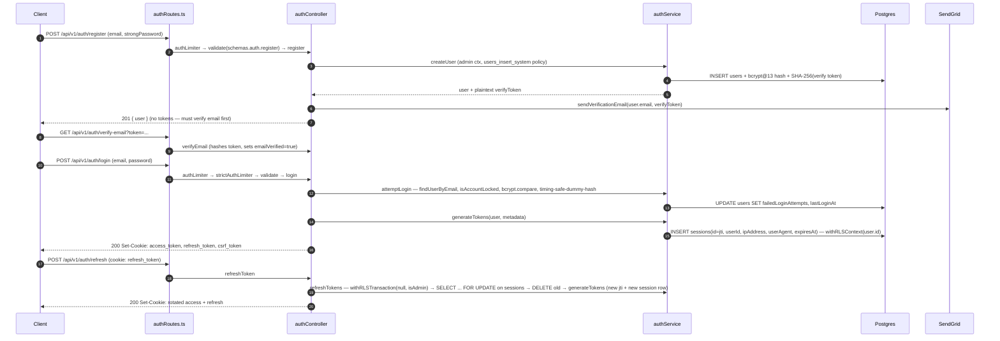
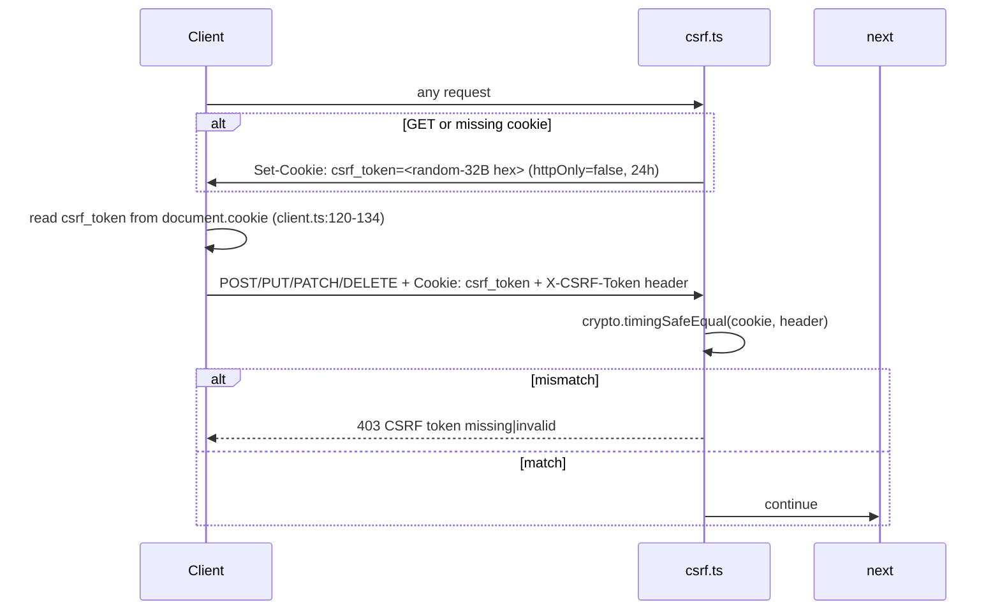
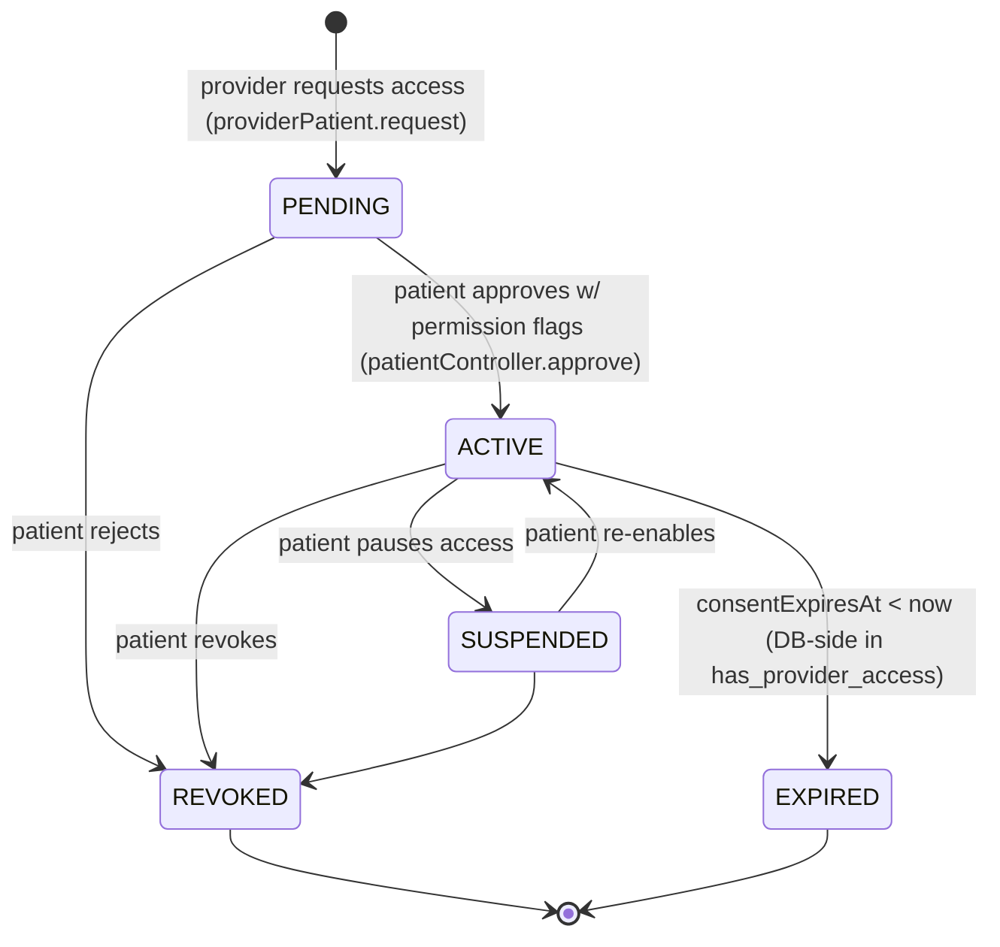
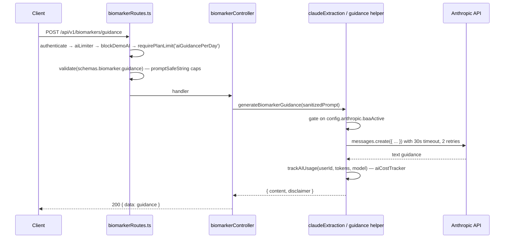
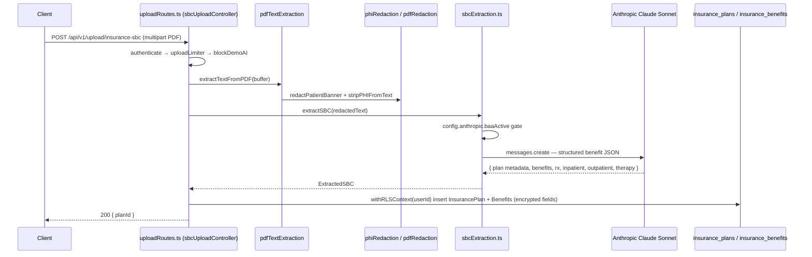
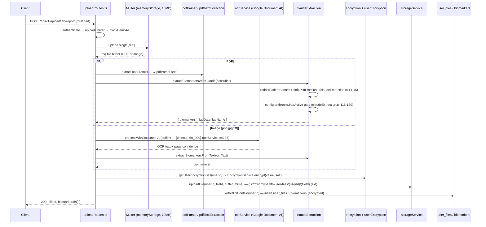
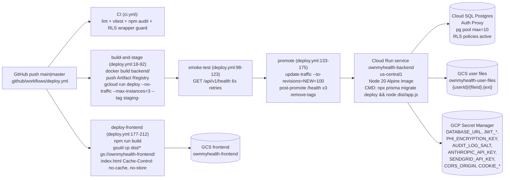

# ARCHITECTURE.md

> **Reference, not a walkthrough.** Every non-trivial claim below cites `file:line`. Diagrams are real (Mermaid / ASCII). Versions come from `package.json` as pinned on 2026-04-24.

---

## 1. System overview

OwnMyHealth is a privacy-first, HIPAA-conscious health biomarker, insurance, and expense-tracking platform with provider-patient consent flows, file upload → OCR → AI extraction, and AI-generated biomarker guidance. The stack is a **Vite + React 18** SPA served from a **GCS bucket**, a **Node.js 20 / Express 4.18** API on **Cloud Run**, and **PostgreSQL** on **Cloud SQL** (accessed via `pg` + `@prisma/adapter-pg`). PHI is encrypted at the app layer (AES-256-GCM + per-user PBKDF2 keys) **and** defended by PostgreSQL Row-Level Security policies keyed on `current_setting('app.current_user_id')`. See [SECURITY_STATUS.md](./SECURITY_STATUS.md) for the open structural caveat around the DB role's `BYPASSRLS` attribute.

### Deployment topology (ASCII)

```
             ┌─────────────────────────────┐
             │  Browser (React 18 SPA)     │
             │  app.ownmyhealth.io         │
             └───────┬─────────────┬───────┘
                     │             │   (httpOnly cookies: access_token,
   VITE static       │             │    refresh_token, csrf_token +
   assets (cached)   │             │    X-CSRF-Token header for mutations)
                     ▼             ▼
        ┌──────────────────┐  ┌──────────────────────────────┐
        │  GCS bucket      │  │  Cloud Run service           │
        │  ownmyhealth-    │  │  ownmyhealth-backend         │
        │  frontend        │  │  (Node 20 Alpine, Express)   │
        │  index.html      │  │  --max-instances=3           │
        │  (no-store)      │  │  /api/v1/*                   │
        └──────────────────┘  └───────┬──────────┬──────┬────┘
                                      │          │      │
                          ┌───────────┘          │      └─────────────┐
                          ▼                      ▼                    ▼
               ┌─────────────────────┐  ┌────────────────┐   ┌─────────────────┐
               │ Cloud SQL (PG)      │  │ GCS user files │   │ 3rd parties:    │
               │ via Cloud SQL proxy │  │ ownmyhealth-   │   │ Anthropic       │
               │ pg pool, max=10     │  │ user-files     │   │ Google Doc AI   │
               │ ssl: require        │  │ {userId}/{id}  │   │ SendGrid        │
               │ RLS policies        │  └────────────────┘   │ Quest SMART-FHIR│
               └─────────────────────┘                       └─────────────────┘
```

Build/deploy edge: `.github/workflows/deploy.yml:1-212` → Artifact Registry → Cloud Run revision at 0% traffic → smoke test → shift to 100%. Frontend is `gsutil cp dist/* gs://ownmyhealth-frontend/` (`deploy.yml:208-212`).

---

## 2. Technology stack (versions pinned)

### Frontend (`package.json:22-64`)

| Component | Version | Pin |
|---|---|---|
| React / React DOM | `^18.3.1` | `package.json:28-29` |
| Vite | `^7.3.0` | `package.json:58` |
| TypeScript | `^5.5.3` | `package.json:56` |
| Vitest | `^4.0.14` | `package.json:59` |
| Playwright | `^1.59.1` | `package.json:36` |
| Tailwind CSS | `^3.4.1` | `package.json:54` |
| Recharts | `^3.5.0` | `package.json:30` |
| `pdfjs-dist` | `^4.0.379` | `package.json:27` |
| Tesseract.js (frontend OCR fallback) | `^5.0.4` | `package.json:32` |
| jspdf / jspdf-autotable | `^4.2.1` / `^5.0.2` | `package.json:24-25` |
| `html2canvas-pro` | `^1.5.8` | `package.json:23` |
| `lucide-react` | `^0.344.0` | `package.json:26` |
| Build target chunks | `pdf`, `ocr`, `charts` | `vite.config.ts:17-38` |

### Backend (`backend/package.json:17-40`)

| Component | Version | Pin |
|---|---|---|
| Node.js runtime | `>=18.0.0` (Cloud Run runs `node:20-alpine`) | `backend/package.json:68-70`, `backend/Dockerfile:4,24` |
| Express | `^4.18.2` | `backend/package.json:29` |
| `@prisma/client` / `prisma` | `^7.7.0` / `^7.0.1` | `backend/package.json:22,61` |
| `@prisma/adapter-pg` | `^7.0.1` | `backend/package.json:21` |
| `pg` | `^8.16.3` | `backend/package.json:37` |
| `@anthropic-ai/sdk` | `^0.71.2` | `backend/package.json:18` |
| `@google-cloud/documentai` | `^9.5.0` | `backend/package.json:19` |
| `@google-cloud/storage` | `^7.19.0` | `backend/package.json:20` |
| `@sendgrid/mail` | `^8.1.4` | `backend/package.json:23` |
| `helmet` | `^7.1.0` | `backend/package.json:31` |
| `express-rate-limit` | `^7.1.5` | `backend/package.json:30` |
| `jsonwebtoken` | `^9.0.2` | `backend/package.json:32` |
| `bcryptjs` | `^2.4.3` (13 rounds) | `backend/package.json:24`, `config/index.ts:93` |
| `cookie-parser` | `^1.4.7` | `backend/package.json:26` |
| `cors` | `^2.8.5` | `backend/package.json:27` |
| `compression` | `^1.8.1` | `backend/package.json:25` |
| `morgan` | `^1.10.0` | `backend/package.json:33` |
| `multer` | `^2.0.2` | `backend/package.json:34` |
| `pdf-lib` / `pdf-parse` | `^1.17.1` / `^1.1.1` | `backend/package.json:35-36` |
| `uuid` | `^9.0.1` | `backend/package.json:38` |
| `zod` | `^3.22.4` | `backend/package.json:39` |
| Vitest | `^4.0.14` | `backend/package.json:66` |

### Database

| Element | Details | Source |
|---|---|---|
| Engine | PostgreSQL (Cloud SQL, Auth Proxy) | `backend/src/services/database.ts:100-114` |
| Pool | `max=10` (env `DATABASE_POOL_SIZE`), `idleTimeoutMillis=30_000`, `connectionTimeoutMillis=30_000`, `statement_timeout=30_000` | `database.ts:108-114` |
| Client | Prisma via `PrismaPg` adapter | `database.ts:117-125` |
| RLS | `ENABLE ROW LEVEL SECURITY` on 16 tables | `backend/prisma/migrations/20260107_add_rls_policies/migration.sql:68-83` |
| Role assertion | Warn (or exit on `RLS_ENFORCEMENT=strict`) if current role has `BYPASSRLS` | `database.ts:220-270` |

### External services

| Service | Purpose | Timeout / Retries | Source |
|---|---|---|---|
| Anthropic Claude | biomarker guidance, SBC extraction, cost analysis, AI chat | `timeout: 30_000`, `maxRetries: 2`; BAA gated | `services/claudeExtraction.ts:57`, `services/sbcExtraction.ts:325`, `config/index.ts:144-151` |
| Google Document AI | OCR of scanned/image lab reports | `{ timeout: 60_000 }` | `services/ocrService.ts:283` |
| Google Cloud Storage | user-uploaded lab/SBC files, signed URLs, streamed downloads | Signed URL expiry 15 min (`SIGNED_URL_EXPIRATION_MS`) | `services/storageService.ts:20-21,104-154` |
| SendGrid | verification, password reset, engagement emails | `setTimeout(10_000)`; `sandboxMode` on staging | `services/emailService.ts:39-53`, `config/index.ts:131-134` |
| Quest SMART-on-FHIR | OAuth lab imports (optional, disabled until `QUEST_FHIR_CLIENT_ID` set) | `AbortController` in `fhirClient.ts:32` | `config/index.ts:158-169` |

---

## 3. Request lifecycle

The Express entry point in this codebase is `backend/src/app.ts` (not `index.ts`). `startServer` at `app.ts:307-374` boots DB, demo user, session/audit/email schedulers, then listens.

```mermaid
sequenceDiagram
  participant C as Client (React SPA)
  participant Mw as Global middleware (app.ts)
  participant R as Route module (routes/*)
  participant Ctl as Controller
  participant Svc as Service + withRLSContext
  participant DB as Postgres (RLS)
  participant Au as AuditLogService

  C->>Mw: HTTP + cookies (access_token, refresh_token, csrf_token)
  Note over Mw: trust proxy(1) → helmet → cors → cookieParser → compression → csrfProtection → standardLimiter → morgan → json/urlencoded(10mb) → requireJsonContentType → no-store on /api
  Mw->>R: next()
  R->>R: authenticate → (strict|authLimiter) → validate(zod) → (rbac / planGating / demoProtection)
  R->>Ctl: handler(req, res)
  Ctl->>Svc: withRLSContext(req.user.id, async (tx) => ...)
  Svc->>DB: SELECT set_config('app.current_user_id', $1, true); SELECT set_config('app.is_admin', 'false', true); then Prisma ops
  DB-->>Svc: rows filtered by RLS policy
  Svc-->>Ctl: decrypted PHI (per user salt)
  Ctl->>Au: auditService.log{Access|Create|Update|Delete}(...)
  Ctl-->>C: { success: true, data }
```

---

## 4. Middleware stack (in mount order)

All lines are from `backend/src/app.ts`.

| # | Step | File:Line | Source file |
|---|---|---|---|
| 1 | `app.set('trust proxy', 1)` — honors X-Forwarded-For from Cloud Run LB | `app.ts:119` | n/a |
| 2 | `helmet({ contentSecurityPolicy, crossOriginResourcePolicy })` | `app.ts:124-140` | `helmet@^7.1.0` |
| 3 | `cors(corsOptions)` — union of env + hardcoded `app.ownmyhealth.io`, `ownmyhealth.io` | `app.ts:147-187` | `app.ts:64-106` |
| 4 | `app.options('*', cors(corsOptions))` preflight | `app.ts:190` | — |
| 5 | `cookieParser()` | `app.ts:193` | `cookie-parser@^1.4.7` |
| 6 | `compression({ threshold: 1024, level: 6, filter: skip SSE })` | `app.ts:200-207` | `compression@^1.8.1` |
| 7 | `csrfProtection` (double-submit cookie, gated off by `DISABLE_CSRF=true` in dev only) | `app.ts:211-213` | `middleware/csrf.ts:186-202` |
| 8 | `standardLimiter` (global rate limiter, 100 req / 15 min) | `app.ts:216` | `middleware/rateLimiter.ts:16-32` |
| 9 | `morgan('dev' \| 'combined')` | `app.ts:219-223` | `morgan@^1.10.0` |
| 10 | `express.json({ limit: '10mb' })` + `express.urlencoded(...)` | `app.ts:226-227` | — |
| 11 | `requireJsonContentType` | `app.ts:230` | `middleware/validation.ts:190-217` |
| 12 | `app.use('/api', no-store Cache-Control)` | `app.ts:237-240` | — |
| 13 | `app.use('/api/v1', routes)` | `app.ts:243` | `routes/index.ts:81-113` |
| 14 | Per-route layer: `authenticate` or `requireBearerAuth`, `{strict|auth|ai|upload|bulk|sensitive}Limiter`, `validate(schema)`, `requireRole / requirePermission / requireResourceAccess / requireOwnership`, `requirePlanLimit`, `blockDemo*` | various `routes/*.ts` | `middleware/auth.ts`, `rbac.ts`, `rateLimiter.ts`, `planGating.ts`, `demoProtection.ts` |
| 15 | `notFoundHandler` | `app.ts:301` | `middleware/errorHandler.ts:204-206` |
| 16 | `errorHandler` (centralized) | `app.ts:304` | `middleware/errorHandler.ts:135-201` |

CSRF is mounted globally (step 7). The validator **skips** `GET/HEAD/OPTIONS`, the public-auth path list (`csrf.ts:98-108`), the four upload routes (`csrf.ts:117-122`), and the bearer-only streaming route `/ai/chat` (`csrf.ts:130-132`). This is enforced by the route switching to `requireBearerAuth` (see `aiRoutes.ts:6,20`) so the cookie-auth + CSRF-skip combination cannot be reached.

Rate limiters (all in `middleware/rateLimiter.ts`):

| Name | Window | Max | Key | Lines |
|---|---|---|---|---|
| `standardLimiter` | `config.rateLimit.windowMs` (default 15 min) | `config.rateLimit.maxRequests` (default 100) | IP | `rateLimiter.ts:16-32` |
| `authLimiter` | 15 min | 20 | IP | `rateLimiter.ts:35-47` |
| `strictAuthLimiter` | 15 min | 5 (failed-only) | `${email}:${ip}` | `rateLimiter.ts:50-69` |
| `uploadLimiter` | 1 h | 20 | IP | `rateLimiter.ts:72-84` |
| `sensitiveLimiter` | 1 h | 10 | IP | `rateLimiter.ts:87-99` |
| `aiLimiter` | 1 h | 10 | `req.user.id || ip` | `rateLimiter.ts:102-118` |
| `bulkOperationLimiter` | 1 h | 30 | IP | `rateLimiter.ts:121-133` |

> In-memory store, not Redis — bounded by `--max-instances=3` in `deploy.yml:72`. See comment at `rateLimiter.ts:6-13`.

---

## 5. Authentication architecture

Cookies: `access_token` (15 min, httpOnly, secure in prod, SameSite from `COOKIE_SAME_SITE` env — defaults to `none` if `COOKIE_DOMAIN` set, else `lax`), `refresh_token` (7 d / 30 d for demo, httpOnly), `csrf_token` (24 h, **not** httpOnly — JS must read it; `csrf.ts:43-47`).



**Signer / verifier files (with `config.jwt.accessSecret` / `config.jwt.refreshSecret` loaded via `requireEnv` at `config/index.ts:60-67`):**

| Concern | File:Line |
|---|---|
| Access token issue (`type='access'`, default `expiresIn=900s`) | `authService.ts:200-213` |
| Refresh token issue + session row (`jti`, `type='refresh'`, 7 d / 30 d demo) | `authService.ts:246-285` |
| Access verification on every protected request | `middleware/auth.ts:70-111` |
| Bearer-only verification for `/ai/chat` SSE | `middleware/auth.ts:166-201` |
| Refresh rotation (atomic `SELECT ... FOR UPDATE` + DELETE + INSERT in one tx) | `authService.ts:407-476` |
| Access-token in-memory revocation (logout, per-instance) | `authService.ts:139-148`, used at logout in `authController.ts` |

```ts
// Source: backend/src/services/authService.ts:L432-L458
const locked = await tx.$queryRaw<Array<{ id: string; userId: string; expiresAt: Date }>>`
  SELECT id, user_id AS "userId", expires_at AS "expiresAt"
  FROM sessions
  WHERE id = ${payload!.jti}::uuid
  FOR UPDATE
`;
const session = locked[0];
if (!session || session.expiresAt < new Date()) {
  if (session) await tx.session.delete({ where: { id: payload!.jti } });
  return null;
}
// ... user lookup, delete old, issue new pair (new jti + new session row)
```

### Frontend refresh flow

`src/contexts/AuthContext.tsx:93-120` — on mount, call `authApi.refreshToken()` **before** `authApi.getCurrentUser()` so the 15-min access cookie can be refreshed from the 7-day refresh cookie without a 401 loop. `src/services/api/client.ts:136-170` singleton-coalesces in-flight refreshes (`refreshPromise`) and `client.ts:204-250` retries exactly once on a 401 via `attemptTokenRefresh`. `/auth/refresh` and `/auth/logout` are excluded from the retry path to prevent recursion (`client.ts:197-204`).

---

## 6. CSRF architecture (double-submit cookie)



Compare function (`middleware/csrf.ts:164-175`):

```ts
// Source: backend/src/middleware/csrf.ts:L164-L175
if (cookieToken.length !== headerToken.length) {
  throw new ForbiddenError('Invalid CSRF token');
}
const tokensMatch = crypto.timingSafeEqual(
  Buffer.from(cookieToken),
  Buffer.from(headerToken)
);
if (!tokensMatch) {
  throw new ForbiddenError('Invalid CSRF token');
}
```

Exemptions live at `csrf.ts:98-148`:

| Category | Paths |
|---|---|
| Public auth | `/auth/login`, `/auth/register`, `/auth/demo`, `/auth/refresh`, `/auth/forgot-password`, `/auth/reset-password`, `/auth/verify-email`, `/auth/resend-verification`, `/marketplace/plans/search` |
| Upload (XHR multipart) | `/upload/lab-report`, `/upload/insurance-sbc`, `/upload/lab-results-ocr`, `/insurance/upload-sbc` |
| Bearer-only SSE | `/ai/chat` — paired with `requireBearerAuth` (`aiRoutes.ts:20`) |

Dev override: `DISABLE_CSRF=true` in dev only (`csrf.ts:151-153`, `app.ts:211-213`).

---

## 7. Row-Level Security (RLS)

### Enforcement path (ASCII)

```
HTTP request
   │
   ▼
authenticate (middleware/auth.ts:70)
   │ sets req.user = { id, email, role, plan }
   ▼
controller handler
   │ reads req.user.id
   ▼
withRLSContext(userId, async (tx) => tx.biomarker.findMany(...))    ← services/database.ts:456
   │ opens prisma.$transaction(...)
   │ SELECT set_config('app.current_user_id', $userId, true)        ← services/database.ts:384
   │ SELECT set_config('app.is_admin',        'false',  true)       ← services/database.ts:385
   │ (or 'true' for admin/system context when userId=null)
   ▼
Prisma query runs on THIS transaction (not the module-level client)
   │
   ▼
Postgres evaluates policy
   USING (user_id = current_user_id() OR has_provider_access(user_id, 'view_biomarkers') OR is_admin_session())
                                                                    ← migration.sql:151-157
   │
   ▼
Only allowed rows returned
```

### RLS footgun — quoted verbatim from `CLAUDE.md` and `database.ts`

From [CLAUDE.md](../CLAUDE.md):

> ```typescript
> // ❌ WRONG — prisma.* inside the callback runs on a different connection
> // that does NOT carry the SET LOCAL, so RLS evaluates against NULL.
> const biomarkers = await withRLSContext(userId, async () => {
>   return prisma.biomarker.findMany();
> });
> ```

From `backend/src/services/database.ts:L15-L31`:

> ```
> ║ RLS FOOTGUN — READ BEFORE TOUCHING ANY CONTROLLER OR SERVICE QUERY.       ║
> ║                                                                           ║
> ║ Inside a `withRLSContext(userId, async (tx) => ...)` callback, EVERY      ║
> ║ Prisma call MUST go through `tx`. If you accidentally call the           ║
> ║ module-level `prisma` client (`prisma.biomarker.findMany(...)` or        ║
> ║ `getPrismaClient().biomarker.findMany(...)`), the query runs on a       ║
> ║ DIFFERENT connection from the pool — one that never received the         ║
> ║ `SET LOCAL app.current_user_id` that this wrapper issues. The RLS        ║
> ║ policies then evaluate against NULL and the query silently returns       ║
> ║ all rows across all users. No error, no warning — just a bypass.         ║
> ```

CI guard: `.github/workflows/ci.yml:115-117` runs `bash scripts/check-rls-wrappers.sh` on every push to fail the build on `prisma.*` calls inside RLS callbacks.

### `withRLSContext` vs `withRLSTransaction`

Both share `runWithRLS` (`database.ts:433-454`), which opens a Prisma `$transaction` and runs `set_config(...)` inside it.

| Wrapper | Transaction options | Use when |
|---|---|---|
| `withRLSContext(userId, fn, { isAdmin?, timeout?, maxWait? })` | `maxWait: 20_000, timeout: 30_000` defaults | Single or multi-statement read/write that fits in one Prisma transaction; the default for controllers. `database.ts:456-465` |
| `withRLSTransaction(userId, fn, { isAdmin? })` | Prisma defaults (no timeout override) | Long-running atomic workflows (e.g., bulk biomarker create; `biomarkerController.ts:539,666,859`) where 30s is too tight or caller wants the default interactive-tx deadlines. `database.ts:477-483` |

Admin context (system ops, pre-auth flows, refresh rotation, provider-patient relationship lookups): pass `userId = null` or `{ isAdmin: true }` — policy check becomes `is_admin_session()` (`migration.sql:28-36`).

### Example RLS policy

```sql
-- Source: backend/prisma/migrations/20260107_add_rls_policies/migration.sql:L151-L157
CREATE POLICY biomarkers_select ON biomarkers
  FOR SELECT
  USING (
    user_id = current_user_id()
    OR has_provider_access(user_id, 'view_biomarkers')
    OR is_admin_session()
  );
```

Helper functions: `current_user_id()` at `migration.sql:17-25`, `is_admin_session()` at `28-36`, `has_provider_access(patient_user_id, permission_type)` at `39-62`. Sixteen tables enable RLS at `migration.sql:68-83`.

### Run-time role assertion

Production boot checks the DB login's `pg_roles.rolbypassrls`; warns or (with `RLS_ENFORCEMENT=strict`) exits (`database.ts:220-270`). See [SECURITY_STATUS.md](./SECURITY_STATUS.md) for the outstanding cutover.

---

## 8. Encryption layer

AES-256-GCM at the app layer, per-user derived keys.

| Step | File:Line | Notes |
|---|---|---|
| Master key validation (length, hex, reject placeholders) | `services/encryption.ts:103-143` | Rejects 3 known-insecure constants in every env |
| `EncryptionService` constructor fails if key invalid | `encryption.ts:156-186` | Boot aborts with a banner |
| Per-user salt (PBKDF2-SHA512) | `encryption.ts:193-207` | `PBKDF2_ITERATIONS=600_000` current; `100_000` legacy fallback on auth-tag failure (`encryption.ts:304-315`) |
| Ciphertext format `iv:authTag:ciphertext` (all base64) | `encryption.ts:216-228`, `263-279` | IV 16B, auth tag 16B |
| Write: `EncryptionService.encrypt(value, salt)` | `encryption.ts:263-279` | Salt comes from `getUserEncryptionSalt(userId)` |
| Read: `EncryptionService.decrypt(value, salt)` | `encryption.ts:288-316` | Returns `null` on failure (never raw ciphertext) — `decryptFields:370-385` |
| Per-user salt storage (encrypted with master key, versioned, rotatable) | `services/userEncryption.ts:29-137` | `user_encryption_keys` table; admin RLS context |
| `PHI_FIELDS` map (authoritative field list per model) | `encryption.ts:411-492` | Cross-link: [PHI_TAXONOMY.md](./PHI_TAXONOMY.md) |

Write sites: controllers write `*Encrypted` columns directly using the service via `getEncryption()`. Read sites: `decryptFields` on controller response shape. The audit log's `previousValueEncrypted` / `newValueEncrypted` are also encrypted through this service (`encryption.ts:461-464`).

---

## 9. Provider-patient consent

Enum values are the source of truth — `backend/prisma/schema.prisma:568-574`:

```prisma
enum ProviderPatientStatus {
  PENDING
  ACTIVE
  SUSPENDED
  REVOKED
  EXPIRED
}
```



Permission flags on `provider_patients` (seen in policy and middleware):

| Flag | Column | Resource gates |
|---|---|---|
| `canViewBiomarkers` | `can_view_biomarkers` | `biomarker` read via `has_provider_access(..., 'view_biomarkers')` (migration.sql:51) |
| `canViewInsurance` | `can_view_insurance` | `insurance` read |
| `canViewDna` | `can_view_dna` | `dna` read |
| `canViewHealthNeeds` | `can_view_health_needs` | `healthNeed` read |
| `canEditData` | `can_edit_data` | any write by a provider — `rbac.ts:242-244` |

Enforcement:

- App layer: `rbac.ts:205-258` (`checkProviderPatientAccess`) + `rbac.ts:264-322` (`requireOwnership`) — looks up the `provider_patients` row under admin RLS context and checks `status === 'ACTIVE'`, `consentExpiresAt > now`, and the relevant permission flag.
- DB layer: every biomarker/etc. policy `OR`s `has_provider_access(user_id, 'view_biomarkers')` (`migration.sql:39-62`).
- Request validation: `schemas.providerPatient.{request|approve|updatePermissions}` (`validation.ts:534-557`). `consentDurationDays` clamped to 1–365.

---

## 10. AI extraction architecture (3 subflows)

All three flows honor the BAA runtime gate (`config.anthropic.baaActive`, `config/index.ts:144-151`) and use a shared lazy Anthropic client `{ timeout: 30_000, maxRetries: 2 }`.

### 10a. Biomarker guidance



Route wiring: `routes/biomarkerRoutes.ts:120-122` (`aiLimiter, blockDemoAI, requirePlanLimit('aiGuidancePerDay')`).

### 10b. Insurance SBC extraction



Key files: `services/sbcExtraction.ts:1-120,325`, `controllers/upload/sbcUploadController.ts`, routes `uploadRoutes.ts` entries in `csrf.ts:117-122` exemption list.

### 10c. Cost analysis

```mermaid
sequenceDiagram
  participant C as Client
  participant R as expenseRoutes.ts
  participant Ctl as expenseController
  participant Svc as claudeExtraction / cost-analysis helper
  participant AI as Anthropic API
  participant DB as cost_analyses

  C->>R: POST /api/v1/expenses/analyze { planId }
  R->>R: authenticate → aiLimiter → blockDemoAI → requirePlanLimit (on PRO+)
  R->>R: validate(schemas.expense.analyzeCosts)
  R->>Ctl: analyzeCosts
  Ctl->>DB: withRLSContext(userId) — load plan + projections (decrypt)
  Ctl->>Svc: Claude call with plan + projected expenses
  Svc->>AI: 30s timeout, 2 retries; BAA gate
  AI-->>Svc: recommendations + projected OOP
  Ctl->>DB: withRLSContext — INSERT cost_analyses (claudeResponse, totalProjectedOopEncrypted, projectedExpensesSnapshotEncrypted)
  Ctl-->>C: 200 { analysisId, summary }
```

Cited PHI fields on `CostAnalysis`: `claudeResponse`, `totalProjectedOopEncrypted`, `projectedExpensesSnapshotEncrypted` (`encryption.ts:481-485`). Cross-link: [PHI_TAXONOMY.md](./PHI_TAXONOMY.md#cost-analysis).

---

## 11. File upload + OCR pipeline



Supported mime types and 10 MB cap: `ocrService.ts:38-48`. Signed URLs expire in 15 min (`storageService.ts:21`); PHI downloads prefer `getFileStream` + `Cache-Control: no-store` proxy over direct signed URLs (see comment at `storageService.ts:90-103`).

---

## 12. Audit logging flow

```
Controller handler
   │
   ▼
auditService.log{Access|Create|Update|Delete|Auth|System}(...)      ← auditLog.ts (AuditLogService)
   │  encrypts previousValueEncrypted / newValueEncrypted via
   │  EncryptionService with systemSalt (config.auditSalt)
   ▼
withRLSContext(userId | null-admin, tx.auditLog.create(...))
   │
   ▼
audit_logs row (immutable) — createdAt, userId, actorType,
                              action (AuditAction enum), resourceType,
                              resourceId, ipAddress, userAgent, metadata
   │
   ▼
Daily cleanup scheduler (startAuditCleanup, auditLog.ts:526-546)
   │  setInterval(24h); deletes createdAt < now - 2555 days (~7 years)
   │  RETENTION_DAYS=2555 (auditLog.ts:9)
   ▼
logSystem('DELETE','AuditLog', { action:'retention_cleanup', deletedCount, cutoffDate })
```

Canonical action enum: `backend/prisma/schema.prisma:657` (`enum AuditAction`). Login events use `auditService.logAuth('LOGIN' | 'LOGIN_FAILED' | 'ACCOUNT_LOCKOUT', ...)` — see `authController.ts:229,248,270,291,311`. Biomarker events use `logAccess / logCreate / logUpdate / logDelete` — `biomarkerController.ts:160,273,363,409,442,593,715,819`.

---

## 13. Deployment topology

### 13a. GitHub Actions → Cloud Run + GCS + Cloud SQL



### 13b. Environment breakdown

| Environment | `NODE_ENV` | Demo account | BAA gate | SendGrid sandbox | CSRF |
|---|---|---|---|---|---|
| Local dev | unset / `development` | allowed (`config.demo.enabled`) | warn-only; Claude blocked by runtime gate | disabled unless `SENDGRID_SANDBOX_MODE=true` | bypass via `DISABLE_CSRF=true` in dev only |
| Staging | `staging` | allowed | warn-only | forced on (`config/index.ts:131-134`) | enforced |
| Production | `production` | **blocked** (`config/index.ts:319-325`) | required — `ANTHROPIC_BAA_ACTIVE=true` else hard-fail boot | disabled (real send) | enforced |

### 13c. Service-to-service

| From | To | Protocol |
|---|---|---|
| Cloud Run ownmyhealth-backend | Cloud SQL Postgres | pg + Cloud SQL Auth Proxy (`DATABASE_URL`, ssl) |
| Cloud Run | GCS (user files bucket) | `@google-cloud/storage` signed URLs (15 min) + streamed reads |
| Cloud Run | Anthropic API | HTTPS, 30s timeout, 2 retries, BAA gate |
| Cloud Run | Google Document AI | gRPC, 60s processing timeout |
| Cloud Run | SendGrid | HTTPS, 10s timeout |
| Browser | Cloud Run | HTTPS, httpOnly cookies + X-CSRF-Token header |
| Browser | GCS frontend bucket | HTTPS static assets; `index.html` forced `no-store` |

See [ENV_VARS.md](./ENV_VARS.md) for the full env catalogue and [RUNBOOK.md](./RUNBOOK.md) for rollback (`gcloud run services update-traffic --to-revisions=OLD=100`).

---

## 14. Scheduled jobs

All three are in-process `setInterval` timers started by `startServer` in `app.ts:315-323` and stopped on SIGTERM/SIGINT by `gracefulShutdown` (`app.ts:356-369`).

| Job | File:Line | Cadence | Effect |
|---|---|---|---|
| Session cleanup | `services/authService.ts:1221-1237` (`startSessionCleanup`) | every 10 min | `DELETE FROM sessions WHERE expires_at < NOW()` (`authService.ts:1197-1218`) |
| Audit log retention | `services/auditLog.ts:520-546` (`startAuditCleanup`) | every 24 h | `DELETE FROM audit_logs WHERE created_at < NOW() - 2555 days`, then log `SYSTEM / DELETE / retention_cleanup` (`auditLog.ts:475-503`) |
| Engagement email | `schedulers/emailScheduler.ts:242` (`startEmailScheduler`) | every 60 min (`ONE_HOUR_MS`, `emailScheduler.ts:25,242`) | Mondays 08:00–08:59 UTC → weekly summaries + goal reminders (dedup via `lastWeeklyRunKey`, `emailScheduler.ts:36-40`); every tick → plan-expiring in ~7 days → `notifyPlanExpiring` |

No `cron` / `node-schedule` libraries are used — confirmed by `Grep pattern: "setInterval\\(|cron|schedule"` over `backend/src` returning only these three call sites plus tests.

---

## 15. Role-based access control

Hierarchy (`middleware/rbac.ts:16-20`):

```ts
export const ROLE_HIERARCHY = { ADMIN: 3, PROVIDER: 2, PATIENT: 1 } as const;
```

Resource × role × permission matrix (`rbac.ts:31-56`):

| Role | Biomarker | Insurance | DNA | HealthNeed | User | ProviderPatient |
|---|---|---|---|---|---|---|
| PATIENT | r/w/d (own) | r/w/d (own) | r/w/d (own) | r/w/d (own) | r/w (own profile) | r/w (own relationships) |
| PROVIDER | r/w (consented patients) | r (consented) | r (consented) | r/w (consented) | r/w (own + limited patient info) | r/w/d (own patient relationships) |
| ADMIN | r/w/d + admin | r/w/d + admin | r/w/d + admin | r/w/d + admin | r/w/d + admin | r/w/d + admin |

Capability summary (matches [CLAUDE.md](../CLAUDE.md) table):

| Role | Level | Capabilities |
|---|---|---|
| PATIENT | 1 | Own biomarker/insurance/health-goal/health-need/expense CRUD; manage provider consent (approve/revoke, set permission flags); request AI guidance + chat; upload lab reports / SBC |
| PROVIDER | 2 | + Read consented patient data per permission flags (`canViewBiomarkers`, `canViewInsurance`, `canViewDna`, `canViewHealthNeeds`); write patient data if `canEditData` flag set; manage own provider-patient relationships |
| ADMIN | 3 | + User management (`adminRoutes.ts`), audit log viewer, system health, plan assignment, permanent user delete; bypasses ownership / resource checks (`rbac.ts:140-142, 271-275`); blocked for demo accounts (`demoProtection.ts:67-78`) |

Key helpers:

| Helper | File:Line |
|---|---|
| `requireRole(...allowedRoles)` | `rbac.ts:61-75` |
| `requireMinRole(minRole)` — hierarchy-based | `rbac.ts:80-96` |
| `requirePermission(resource, permission)` | `rbac.ts:101-116` |
| `requireResourceAccess(resource, permission)` — ownership + provider consent | `rbac.ts:124-171` |
| `requireOwnership(resourceGetter)` | `rbac.ts:264-322` |
| `adminOnly()` / `providerOrAdmin()` | `rbac.ts:366-375` |

---

## 16. File structure

### Backend (`backend/src/`, 114 `.ts` files total)

| Directory | Count | Purpose |
|---|---|---|
| `controllers/` | 10 handlers + 7 tests + upload/ subdir | Route handlers. Every PHI access goes through `auditService.log*`. |
| `middleware/` | 8 (`auth`, `csrf`, `rbac`, `rateLimiter`, `demoProtection`, `validation`, `errorHandler`, `planGating`) | Security + validation layer. `index.ts` re-exports. |
| `routes/` | 16 route files (public + role-specific + FHIR + plan + onboarding) | Wiring `authenticate → limiter → validate → rbac → planGating → handler`. `routes/index.ts:81-113` mounts 15 modules under `/api/v1`. |
| `services/` | 18 production services + tests (`auditLog`, `authService`, `database`, `encryption`, `userEncryption`, `claudeExtraction`, `sbcExtraction`, `ocrService`, `pdfParser`, `pdfTextExtraction`, `storageService`, `emailService`, `emailTemplates`, `notificationService`, `usageTracker`, `aiCostTracker`, `biomarkerExtractor`, `biomarkerPatterns`, `healthContextService`, `healthProfileService`, `onboardingService`, plus `fhir/` and `knowledge/` subdirs) | Business logic; every DB call goes through `withRLSContext` / `withRLSTransaction`. |
| `config/` | `index.ts`, `jwtOptions.ts`, `plans.ts` | Env catalogue, JWT options, plan limits. |
| `schedulers/` | `emailScheduler.ts` | In-process scheduler; audit + session schedulers live in their own services. |
| `utils/` | `logger`, `phiRedaction`, `pdfRedaction` | PHI-redaction pre-processors for Claude calls. |
| `prisma/migrations/` | 16 migrations incl. `20260107_add_rls_policies` | RLS policies; latest is `20260420_encrypt_health_goal_target`. |

### Frontend (`src/`, 139 `.ts`/`.tsx` files total)

| Directory | Purpose |
|---|---|
| `components/` | UI: `analytics`, `auth`, `biomarkers`, `common`, `dashboard`, `files`, `insurance`, `settings`, `trends`, `upload` |
| `contexts/` | `AuthContext.tsx` (auth state + 15-min idle-logoff per HIPAA §164.312(a)(2)(iii), see comment at `AuthContext.tsx:37-42`), `Theme` |
| `services/api/` | 13 files — axios-ish `fetch` wrapper (`client.ts`) + per-domain clients |
| `types/` | TypeScript interfaces |
| `data/` | Sample data, nav config |

---

## 17. Related Documents

- [API_REFERENCE.md](./API_REFERENCE.md) — per-endpoint contracts (request, response, middleware chain, PHI fields, audit action).
- [ROUTING_TABLE.md](./ROUTING_TABLE.md) — every route with its exact middleware chain.
- [DATA_MODEL.md](./DATA_MODEL.md) — full schema, ER, RLS policies, cascades (`User.delete → all child rows`).
- [PHI_TAXONOMY.md](./PHI_TAXONOMY.md) — per-field encryption / write / read / audit coverage (authoritative map vs `PHI_FIELDS`).
- [ENV_VARS.md](./ENV_VARS.md) — every env var, consumer, secret classification (`ANTHROPIC_BAA_ACTIVE`, `RLS_ENFORCEMENT`, `COOKIE_DOMAIN`, …).
- [RUNBOOK.md](./RUNBOOK.md) — deploy / rollback / incident playbook (Cloud Run env-update pinning caveat).
- [LOCAL_DEV.md](./LOCAL_DEV.md) — running the stack locally (ports 3001 API, 5173 SPA, Prisma Postgres or local PG).
- [SECURITY_STATUS.md](./SECURITY_STATUS.md) — open findings (BYPASSRLS cutover, Redis rate-limit store, CSP nonce migration).
- [HIPAA_CHECKLIST.md](./HIPAA_CHECKLIST.md) — which architectural layer satisfies each safeguard.
- [FINANCIAL_TRACKER.md](./FINANCIAL_TRACKER.md) — per-user cost model (Anthropic tokens via `aiCostTracker`, GCP billing).

---

## Acceptance questions (self-answered from this doc + siblings)

**Q1. What middleware runs before CSRF validation, and in what order?**
A. `trust proxy(1)` → `helmet` → `cors` + OPTIONS preflight → `cookieParser` → `compression`. See §4 table rows 1–6 (`app.ts:119-207`).

**Q2. How does the backend identify the authenticated user for RLS?**
A. `authenticate` (`middleware/auth.ts:70-111`) decodes the JWT from `cookies.access_token` (fallback `Authorization: Bearer`) and sets `req.user = { id, email, role, plan }`. Controllers then call `withRLSContext(req.user.id, async (tx) => ...)` which issues `SELECT set_config('app.current_user_id', $userId, true)` before running the Prisma query (§7, `database.ts:377-386,448-454`).

**Q3. `withRLSContext` vs `withRLSTransaction` — when do you need the latter?**
A. `withRLSContext` sets a 30s timeout / 20s maxWait (`database.ts:461-464`); `withRLSTransaction` uses Prisma defaults with no caller-side override (`database.ts:477-483`). Use `withRLSTransaction` for long/bulk writes (e.g., bulk biomarker create at `biomarkerController.ts:539`) where 30s is too tight, or when you want the default interactive-transaction semantics.

**Q4. Why is `prisma.X` inside a `withRLSContext` callback incorrect?**
A. The module-level `prisma` client runs on a different pool connection that never received the `SET LOCAL app.current_user_id`. The policy evaluates `current_user_id()` as NULL, so `user_id = current_user_id()` is false and `is_admin_session()` is false — the policy silently returns **no rows** (or in admin context returns **all rows**). Quoted verbatim from `database.ts:15-31` and CLAUDE.md in §7.

**Q5. Which service encrypts PHI before DB write? Which decrypts on read?**
A. `EncryptionService.encrypt(plaintext, userSalt)` at `services/encryption.ts:263-279` writes. `EncryptionService.decrypt` at `288-316` reads (with 600k→100k PBKDF2 fallback). Per-user salt via `getUserEncryptionSalt(userId)` in `services/userEncryption.ts:29-72`. See §8.

**Q6. How does CSRF double-submit work? Which compare?**
A. Server sets `csrf_token` cookie (non-httpOnly, 24h, `csrf.ts:32-58`); client reads via `document.cookie` (`src/services/api/client.ts:120-134`) and sends `X-CSRF-Token` header on mutations (`client.ts:188-195`). Server verifies with `crypto.timingSafeEqual` after a length pre-check (`csrf.ts:164-175`). See §6.

**Q7. Provider-patient consent state machine?**
A. `PENDING → ACTIVE | REVOKED`; `ACTIVE ↔ SUSPENDED`; `ACTIVE → REVOKED | EXPIRED`. Enum at `prisma/schema.prisma:568-574`; `EXPIRED` is evaluated DB-side by `has_provider_access` when `consent_expires_at <= NOW()` (`migration.sql:49`). See §9.

**Q8. Which limiter guards Claude endpoints?**
A. `aiLimiter` — 10 requests/hour keyed by `req.user.id` with IP fallback (`rateLimiter.ts:102-118`). Applied on `biomarkerRoutes.ts:120`, `aiRoutes.ts:30`, `uploadRoutes.ts` OCR+Claude paths, and cost-analysis routes. Also gated by `blockDemoAI` and `requirePlanLimit('aiGuidancePerDay' | 'aiChatsPerDay')`.

**Q9. Which scheduler removes expired sessions, at what cadence?**
A. `startSessionCleanup` in `authService.ts:1227-1237` — `setInterval` every 60 min running `cleanupExpiredSessions` (`authService.ts:1197-1218`) which does `DELETE FROM sessions WHERE expires_at < NOW()` under admin RLS. Started by `app.ts:316`. See §14.

**Q10. What runs in Cloud Run vs Cloud SQL vs GCS?**
A. **Cloud Run** — the Express backend (image `us-central1-docker.pkg.dev/ownmyhealth-prod/ownmyhealth/ownmyhealth-backend`), `--max-instances=3` (`deploy.yml:72`), `CMD: npx prisma migrate deploy && node dist/app.js` (`Dockerfile:51`). **Cloud SQL** — Postgres, accessed through Cloud SQL Auth Proxy via `pg` pool (`database.ts:108-114`); holds all user data with RLS. **GCS** — two buckets: `ownmyhealth-frontend` (built SPA, `index.html` Cache-Control no-store, `deploy.yml:208-212`) and `ownmyhealth-user-files` (lab/SBC uploads at `{userId}/{fileId}.{ext}`, `storageService.ts:20,54`). See §13.

**Q11. Request→response path for `POST /api/v1/biomarkers`?**
A. global: `helmet → cors → cookieParser → compression → csrfProtection → standardLimiter → morgan → json → requireJsonContentType → /api no-store` (§4). Route-local in `biomarkerRoutes.ts`: `authenticate → validate(schemas.biomarker.create) → handler`. Handler: `withRLSTransaction(userId, async tx => tx.biomarker.create({...}))` — encrypting PHI via `EncryptionService.encryptFields` first — then `auditService.logCreate('Biomarker', id, ...)`, then `res.json({ success: true, data })`.

**Q12. How does the frontend refresh an expired access token?**
A. `AuthContext.tsx:93-120` calls `authApi.refreshToken()` on mount **before** `authApi.getCurrentUser()`. For subsequent requests, `client.ts:204-250` catches 401s (except `/auth/refresh` and `/auth/logout`) and calls `attemptTokenRefresh()` once (`client.ts:136-170`), which POSTs `/api/v1/auth/refresh` with `credentials: 'include'`. A successful refresh returns new access+refresh cookies (rotated atomically, §5 code snippet) and the original request retries.

**Q13. Which env vars gate the Anthropic BAA posture?**
A. `ANTHROPIC_API_KEY` (optional; absence disables AI) + `ANTHROPIC_BAA_ACTIVE=true` (required at runtime by `services/claudeExtraction.ts:118-120` and `sbcExtraction.ts`). Production boot hard-fails if API key is set but BAA flag isn't (`config/index.ts:245-258`); dev/staging log a warning but the service-level runtime gate still blocks the call. See [ENV_VARS.md](./ENV_VARS.md).

**Q14. What changes structurally when a user is deleted?**
A. `settingsController.deleteAccount` (via `deleteFiles` bulk GCS op, `storageService.ts:204-223`) removes user-files in GCS then cascades DB rows. Prisma cascade rules from `schema.prisma` — all `userId`-keyed children (`biomarkers`, `insurance_plans`, `health_goals`, `health_needs`, `expenses`, `sessions`, `user_encryption_keys`, `provider_patients` on either side, `audit_logs` retained per HIPAA) go with the `users` row. See [DATA_MODEL.md](./DATA_MODEL.md#cascades).

**Q15. SBC upload flow from PDF → biomarker records?**
A. SBC flow does **not** produce biomarker records — it produces **InsurancePlan + InsuranceBenefits** rows. §11 shows the biomarker pipeline (labs → Claude → biomarker encrypted + GCS-stored). §10b shows the SBC pipeline: `POST /api/v1/upload/insurance-sbc` → Multer → `extractTextFromPDF` → `redactPatientBanner` + `stripPHIFromText` → `sbcExtraction.extractSBC` (Claude Sonnet) → `withRLSContext` insert into `insurance_plans` + `insurance_benefits` with `memberIdEncrypted`, `groupIdEncrypted` (PHI) per `encryption.ts:431-434`.

**Q16. Which middleware blocks demo accounts from creating real PHI, and where applied?**
A. `blockDemoAI` (`middleware/demoProtection.ts:164-175`) on all AI + upload routes — see `biomarkerRoutes.ts:121`, `aiRoutes.ts:31`, `uploadRoutes.ts:81,98,128`. `blockDemoProfileUpdate` on profile-mutating settings routes (`demoProtection.ts:145-156`). `blockDemoAdminAccess` on admin routes (`demoProtection.ts:67-78`). `demoProtection` umbrella (`112-137`) blocks role changes and cross-user modifications. Config hard-fails if `DEMO_ACCOUNT_ENABLED=true` in production (`config/index.ts:319-325`).

**Q17. What Node version runs in Cloud Run?**
A. `node:20-alpine` for both builder and production stages of the Docker image (`backend/Dockerfile:4` and `:24`). `package.json` engines field is `>=18.0.0` (`backend/package.json:68-70`), but the deployed image is pinned to 20.

**Q18. Which workflow builds + deploys the backend?**
A. `.github/workflows/deploy.yml`. The `build-and-stage` job builds `backend/Dockerfile`, pushes to Artifact Registry, and deploys to Cloud Run with `--no-traffic --tag staging-<sha> --max-instances=3`; `smoke-test` probes `/api/v1/health`; `promote` shifts 100% traffic via `update-traffic --to-revisions=NEW=100` (explicit pin, not `--to-latest` — see comment at `deploy.yml:126-132`). `ci.yml` is the required-checks pre-merge workflow (lint/test/audit + RLS wrapper guard at `ci.yml:115-117`).

**Q19. What error shape does the API always return?**
A. `errorHandler.ts:135-201` emits `{ success: false, error: { code, message, details?, stack? (dev only) } }` with status code derived from `AppError.statusCode` or a Prisma/JWT mapping (`errorHandler.ts:109-131`). Stack traces are stripped in production (`errorHandler.ts:196-197`). Generic 5xx message `An unexpected error occurred. Please try again later.` (`errorHandler.ts:105`).

**Q20. Which services call third parties, and what's the timeout policy?**
A. `claudeExtraction.ts:57` and `sbcExtraction.ts:325` — Anthropic, `timeout: 30_000, maxRetries: 2`. `ocrService.ts:283` — Google Document AI, `{ timeout: 60_000 }`. `emailService.ts:45` — SendGrid, `setTimeout(10_000)`. `storageService.ts` — GCS (SDK defaults; signed URLs expire at 15 min). `fhir/fhirClient.ts:32` — `AbortController` for Quest/Labcorp SMART-on-FHIR. See §2 "External services" table.

---

## Prompt drift log

- Prompt §"Files to review" lists `backend/src/index.ts` as the primary entry point. **Actual**: the Express entry is `backend/src/app.ts` (`Dockerfile:51` runs `node dist/app.js`; `backend/package.json:5,7` set `main` and `dev` to `dist/app.js` / `src/app.ts`). There is no `backend/src/index.ts`. Prompt author should update `prompts/16-architecture-doc.md` and `prompts/00-index.md` if it mirrors the path.
- Prompt middleware-stack outline: "Body Parser → Routes → Error Handler → 404 Handler". **Actual order** (`app.ts:301,304`): `notFoundHandler` is mounted **before** `errorHandler` (404 is forwarded into the error handler via `next(NotFoundError)`). `CLAUDE.md`'s middleware stack list (`CLAUDE.md:276-285`) also shows this order (Routes → Error Handler → 404 Handler) but the actual mount order is the reverse. No functional drift — both end up routed through the same error handler — but the comment block at `app.ts:7-17` is slightly out of sync with the actual `app.use` sequence (missing `compression`, `requireJsonContentType`, and `/api no-store`).
- `railway.toml` exists at `backend/railway.toml:1-13` but the live deploy target is GCP Cloud Run (`.github/workflows/deploy.yml`). Railway config references `/api/v1/health` health check path; Cloud Run Dockerfile uses `/health`. If Railway is intentionally dead infra, the `railway.toml` should be deleted or annotated.
- The `CLAUDE.md` feature list says "Frontend OCR" via Tesseract.js in the project structure, but the authoritative OCR path runs **server-side** through Google Document AI (`ocrService.ts`). Tesseract.js is in `package.json:32` but chunked into `ocr` split in `vite.config.ts:26-30`, only loaded on demand in the browser — likely legacy/offline fallback. Worth confirming whether it's still wired in UI.
