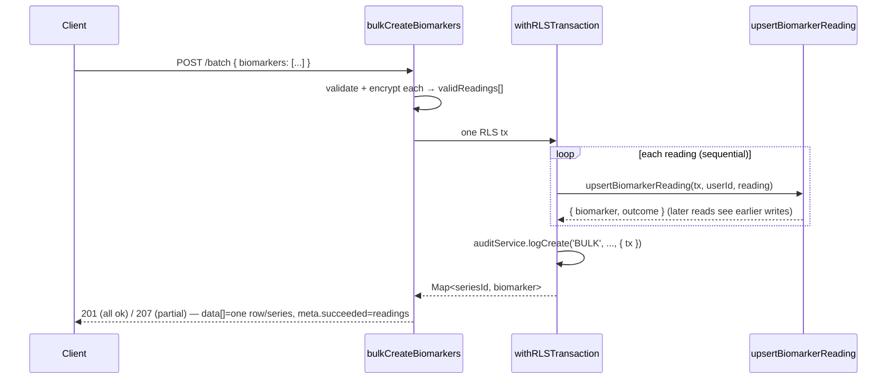

# BIOMARKER_SERIES.md

> Deep reference for the **biomarker time-series subsystem** — the data-model shape that turns a metric into a series, the single merge primitive every write path is meant to funnel through, the create/bulk API contract, FHIR sync idempotency + dedupe, the one-time legacy consolidation job, and the reference-range definition table.
>
> **Scope.** This doc owns the *series-merge semantics*. [`DATA_MODEL.md`](./DATA_MODEL.md) owns the raw `Biomarker` / `BiomarkerHistory` schema (indexes, cascades, RLS); [`API_REFERENCE.md`](./API_REFERENCE.md) owns the per-endpoint contracts; the FHIR OAuth/SSRF/token security lives in its own integration layer. This doc cross-links those and goes one layer deeper on the merge decision.

Verified against code at HEAD `fb2cd32` (2026-06-15).

---

## 1. Overview

A **biomarker is a time series** of one metric (e.g. Glucose in mg/dL) for one user. The data model represents the series as a **single `Biomarker` anchor row** whose own `valueEncrypted` / `measurementDate` is the **newest** point, plus a `BiomarkerHistory[]` of strictly **older** points (`backend/src/services/biomarkerSeries.ts:1-19`, invariant stated at `:17-18`).

**The invariant, in one sentence:** the `Biomarker` row always holds the newest point; `BiomarkerHistory` holds strictly older points (`backend/src/services/biomarkerSeries.ts:17-18`).

### Backstory: the core trend was structurally broken

Before the series fix, the create / bulk-create / FHIR-sync paths each inserted a **brand-new** `Biomarker` row for *every* reading. Logging Glucose twice produced two disconnected single-point rows, so the trend/sparkline UI never had more than one point to draw — the product's core "track it over time" promise silently did nothing (`backend/src/services/biomarkerSeries.ts:11-16`):

```ts
// Source: backend/src/services/biomarkerSeries.ts:L10-L16
 * Historically the create / bulk-create / FHIR-sync paths each inserted a brand
 * new `Biomarker` row for every reading, so logging Glucose twice produced two
 * disconnected single-point rows and the trend/sparkline UI never had more than
 * one point to draw — the product's core "track it over time" promise silently
 * did nothing. `upsertBiomarkerReading` fixes that at the source: every write
 * path routes new readings through here so they append to the matching series.
```

`upsertBiomarkerReading` (`backend/src/services/biomarkerSeries.ts:81`) fixes this at the source: new readings append to the matching series instead of minting disconnected rows.

### The three write paths (plus the one gap)

| Write path | Funnels through `upsertBiomarkerReading`? |
|---|---|
| Manual create (`POST /api/v1/biomarkers`) | **Yes** |
| Bulk / batch create (`POST /api/v1/biomarkers/batch`) | **Yes** |
| FHIR lab sync | **Yes** |
| Lab-upload / OCR ingestion | **No — GAP** (raw `tx.biomarker.create`; see [§5](#5-write-path-funnel-matrix-load-bearing)) |

The full matrix with citations is in [§5](#5-write-path-funnel-matrix-load-bearing) — that section is the load-bearing accuracy check for this doc.

---

## 2. The series-merge invariant

- **Anchor row** = the newest point. Its `valueEncrypted` / `measurementDate` are the current reading (`backend/src/services/biomarkerSeries.ts:17`).
- **`BiomarkerHistory[]`** = strictly older points (`backend/src/services/biomarkerSeries.ts:18`). `BiomarkerHistory` has **no notes column** — only the value is stored per history point (`backend/prisma/schema.prisma:220-231`; the only encrypted column is `valueEncrypted` at `:223`).
- `name` / `unit` / `category` are **plaintext** columns; only `valueEncrypted` and `notesEncrypted` are PHI (`backend/prisma/schema.prisma:185-189`).

### Why history is loaded oldest-first

`HISTORY_INCLUDE` always orders history ascending by `measurementDate` so the trend math — which treats `history[0]` as the **oldest** point — is correct regardless of insert order (`backend/src/services/biomarkerSeries.ts:62-66`):

```ts
// Source: backend/src/services/biomarkerSeries.ts:L62-L66
// Always return history oldest-first so the trend math (which treats
// history[0] as the oldest point) is correct regardless of insert order.
const HISTORY_INCLUDE = {
  history: { orderBy: { measurementDate: 'asc' as const } },
};
```

The list endpoint applies the same oldest-first ordering when eager-loading history (`backend/src/controllers/biomarkerController.ts:173-174`), so consumers of either path see a consistently ordered series.

### Diagram

```
                     upsertBiomarkerReading(tx, userId, reading)
                                     │
          findFirst (name,unit) case-insensitive, newest-first   (biomarkerSeries.ts:89-96)
                                     │
        ┌───────────────┬───────────┴───────────┬────────────────────┐
     no match       new > current            new < current        new == current
        │               │                        │                    │
   create anchor   archive current→history   insert history pt    correct anchor
   'created'         + promote new            keep current         in place
   (:98-120)         'promoted' (:126-156)    'archived' (:158-173) 'corrected' (:175-189)

  Anchor Biomarker row  ── always the NEWEST point ──┐
                                                      │ history[] (oldest-first, :62-66)
  BiomarkerHistory[]    ── strictly OLDER points ─────┘
```

---

## 3. `upsertBiomarkerReading` decision table

`upsertBiomarkerReading(tx, userId, reading)` (`backend/src/services/biomarkerSeries.ts:81`) is the single merge primitive. It returns one of four `SeriesMergeOutcome` values (`backend/src/services/biomarkerSeries.ts:28`):

```ts
// Source: backend/src/services/biomarkerSeries.ts:L28
export type SeriesMergeOutcome = 'created' | 'promoted' | 'archived' | 'corrected';
```

It compares the incoming reading's `measurementDate.getTime()` (`newTime`, `:123`) to the matched series' current point (`curTime`, `:124`):

| Condition (vs series' current point) | DB writes | Outcome | Source |
|---|---|---|---|
| No existing series | `biomarker.create` (anchor) | `created` | `backend/src/services/biomarkerSeries.ts:98-120` |
| `newTime > curTime` | archive current → `biomarkerHistory.create`, then `biomarker.update` (promote new value/date/notes/range/source/lab) | `promoted` | `backend/src/services/biomarkerSeries.ts:126-156` |
| `newTime < curTime` | `biomarkerHistory.create` (back-dated point); anchor unchanged; re-fetch via `findUnique` | `archived` | `backend/src/services/biomarkerSeries.ts:158-173` |
| `newTime === curTime` | `biomarker.update` in place (no duplicate-date history row) | `corrected` | `backend/src/services/biomarkerSeries.ts:175-189` |

These four outcomes are each asserted directly by the unit tests: `created` (`backend/src/services/biomarkerSeries.test.ts:98`), `promoted` (`:118`), `archived` (`:146`), `corrected` (`:170`).

### The `promoted` branch (writes history AND updates the anchor)

This is the only branch that does both — it archives the prior current point into history, then advances the anchor to the new value/date:

```ts
// Source: backend/src/services/biomarkerSeries.ts:L126-L155 (excerpt)
if (newTime > curTime) {
  // Newer reading becomes the current point; the prior current is archived.
  await tx.biomarkerHistory.create({
    data: {
      biomarkerId: existing.id,
      valueEncrypted: existing.valueEncrypted,
      measurementDate: existing.measurementDate,
    },
  });
  const updated = await tx.biomarker.update({
    where: { id: existing.id },
    data: {
      valueEncrypted: reading.valueEncrypted,
      notesEncrypted: reading.notesEncrypted ?? null,
      measurementDate: reading.measurementDate,
      /* ...normalRange / source / lab / isOutOfRange... */
    },
    include: HISTORY_INCLUDE,
  });
  return { biomarker: updated as BiomarkerWithHistory, outcome: 'promoted' };
}
```

The `archived` branch instead writes the *incoming* (older) value to history and leaves the anchor untouched, then re-fetches it with `findUnique` to return the full series (`backend/src/services/biomarkerSeries.ts:158-173`). The `corrected` branch updates the anchor in place and deliberately creates **no** duplicate-date history row (`backend/src/services/biomarkerSeries.ts:175-189`).

---

## 4. Series identity / matching

An incoming reading finds its series via a **case-insensitive `(name, unit)`** match, ordered **most-recent-first** so that if legacy duplicate rows exist (pre-consolidation), new readings still land on a single growing series:

```ts
// Source: backend/src/services/biomarkerSeries.ts:L89-L96
const existing = await tx.biomarker.findFirst({
  where: {
    userId,
    name: { equals: reading.name, mode: 'insensitive' },
    unit: { equals: reading.unit, mode: 'insensitive' },
  },
  orderBy: { measurementDate: 'desc' },
});
```

The unit test pins both the case-insensitive match and the newest-first ordering (`backend/src/services/biomarkerSeries.test.ts:83-89`).

**Contrast with consolidation's `seriesKey`.** The legacy-dedupe planner does its grouping **in memory** with a NUL-joined key rather than a DB query, because Postgres text columns cannot contain a NUL byte — so `("A B","C")` can never collide with `("A","B C")` (`backend/src/services/biomarkerConsolidation.ts:57-64`):

```ts
// Source: backend/src/services/biomarkerConsolidation.ts:L62-L64
export function seriesKey(name: string, unit: string): string {
  return [name.trim().toLowerCase(), unit.trim().toLowerCase()].join(String.fromCharCode(0));
}
```

| Concern | Live merge (`upsertBiomarkerReading`) | Consolidation planner |
|---|---|---|
| Where it runs | DB query (`findFirst`) | In memory (`Map` group) |
| Normalization | `mode: 'insensitive'` on name+unit | `.trim().toLowerCase()` on name+unit |
| Collision guard | DB collation | NUL-byte join |
| Source | `biomarkerSeries.ts:89-96` | `biomarkerConsolidation.ts:62-64` |

---

## 5. Write-path funnel matrix (load-bearing)

Every place a reading is persisted, and whether it goes through `upsertBiomarkerReading`. Confirmed by Grep over `backend/src` for both `upsertBiomarkerReading(` (the funnel sites) and `tx.biomarker.create(` (the raw-insert paths):

| Write path | Entry (`file:line`) | Persist call | Funnels through `upsertBiomarkerReading`? |
|---|---|---|---|
| Manual create | `biomarkerController.createBiomarker` (`backend/src/controllers/biomarkerController.ts:260`) | `upsertBiomarkerReading` (`:283-300`) | **Yes** |
| Bulk / batch create | `biomarkerController.bulkCreateBiomarkers` (`backend/src/controllers/biomarkerController.ts:493`) | loop of `upsertBiomarkerReading` in one tx (`:588-609`) | **Yes** |
| FHIR lab sync | `labSyncService.syncLabResults` (`backend/src/services/fhir/labSyncService.ts:193`) | `upsertBiomarkerReading` (`:340-354`) | **Yes** |
| Manual update | `biomarkerController.updateBiomarker` (`backend/src/controllers/biomarkerController.ts:323`) | direct `tx.biomarker.update` + manual history insert (`:349-355`, `:387-391`) | **No** (in-place edit of an existing anchor, not a new reading) |
| Lab-upload / OCR ingestion | `createBiomarkersFromOCRResult` (`backend/src/controllers/upload/shared.ts:198`); insert at `:244` | direct `tx.biomarker.create` (loop, `:235-259`) | **No — GAP** |

### The OCR/upload GAP

`createBiomarkersFromOCRResult` (`backend/src/controllers/upload/shared.ts:198`) — the path that persists biomarkers extracted from an uploaded PDF/OCR lab report — inserts raw rows in a loop and does **not** call `upsertBiomarkerReading`:

```ts
// Source: backend/src/controllers/upload/shared.ts:L244-L259 (excerpt)
const created = await tx.biomarker.create({
  data: {
    userId,
    category: biomarker.category,
    name: biomarker.name,
    unit: biomarker.unit,
    valueEncrypted,
    notesEncrypted,
    normalRangeMin: biomarker.normalRange.min,
    normalRangeMax: biomarker.normalRange.max,
    normalRangeSource: biomarker.normalRange.source || normalRangeSource,
    measurementDate: reportDate,
    isOutOfRange,
    userFileId: userFileId ?? null,
  },
});
```

**Implication:** an uploaded reading does **not** merge into an existing series — it creates a fresh disconnected anchor row, exactly the failure mode the series fix was built to eliminate. A user who logs Glucose manually and *also* uploads a lab PDF containing Glucose ends up with two separate single-point series. This is flagged again in [§11 Known gaps / drift](#11-known-gaps--drift) and the [Prompt drift log](#prompt-drift-log). (`createBiomarkersFromOCRResult` does enforce the `maxBiomarkers` plan cap at the insert site — `backend/src/controllers/upload/shared.ts:206-231` — but cap enforcement is orthogonal to the series merge.)

The Manual-update path is intentionally **not** a funnel: it edits an existing anchor by id rather than ingesting a new reading, and it archives the prior value to history itself only when the value actually changes (`backend/src/controllers/biomarkerController.ts:346-356`).

---

## 6. Create / bulk API contract

Endpoint wiring (all under `router.use(authenticate)` at `backend/src/routes/biomarkerRoutes.ts:48`):

| Endpoint | Route | Controller |
|---|---|---|
| `POST /api/v1/biomarkers` | `backend/src/routes/biomarkerRoutes.ts:85` (`requirePlanLimit('maxBiomarkers')` + `validate(schemas.biomarker.create)`) | `createBiomarker` (`backend/src/controllers/biomarkerController.ts:260`) |
| `POST /api/v1/biomarkers/batch` | `backend/src/routes/biomarkerRoutes.ts:102` (`bulkOperationLimiter` + `requirePlanLimit('maxBiomarkers')` + `validate(schemas.biomarker.batchCreate)`) | `bulkCreateBiomarkers` (`backend/src/controllers/biomarkerController.ts:493`) |
| `GET /api/v1/biomarkers/:id/history` | `backend/src/routes/biomarkerRoutes.ts:77` | `getHistory` (`backend/src/controllers/biomarkerController.ts:804`) |

> Full request/response shapes are owned by [`API_REFERENCE.md`](./API_REFERENCE.md). This section documents only the **series-relevant** contract: the `history[]` in the response and the status-code semantics that flow from the merge outcome.

### The `history[]` in the response

`toResponse` (`backend/src/controllers/biomarkerController.ts:91`) decrypts the anchor value/notes and emits the `history[]` array of `{ date, value }` points (`backend/src/controllers/biomarkerController.ts:105-112`):

```ts
// Source: backend/src/controllers/biomarkerController.ts:L105-L112
const history = biomarker.history
  ? await Promise.all(
      biomarker.history.map(async (h) => ({
        date: h.measurementDate.toISOString().split('T')[0],
        value: parseFloat(tryDecrypt(encryptionService, h.valueEncrypted, userSalt, 'history.valueEncrypted') ?? ''),
      }))
    )
  : [];
```

### Status-code semantics

**Create** returns `201` only when a **new series was minted** (`outcome === 'created'`), otherwise `200` — a reading that merged into an existing series does not mint a new resource URI (`backend/src/controllers/biomarkerController.ts:317-319`):

```ts
// Source: backend/src/controllers/biomarkerController.ts:L317-L319
// 201 when a new series was created; 200 when the reading merged into an
// existing series (no new resource URI minted).
res.status(outcome === 'created' ? 201 : 200).json(response);
```

**Bulk** returns `201` when all readings succeeded, or `207` (Multi-Status) on partial success (`backend/src/controllers/biomarkerController.ts:655`).

### The bulk per-series collapse (`data[]` < `succeeded`)

All valid readings are merged inside a **single** RLS transaction. Because a later `upsertBiomarkerReading` call sees the rows written by an earlier one in the same tx, multiple points of the same metric in one batch collapse into **one** growing series (`backend/src/controllers/biomarkerController.ts:588-609`):

```ts
// Source: backend/src/controllers/biomarkerController.ts:L590-L596
const byId = new Map<string, BiomarkerWithHistory>();
for (const reading of validReadings) {
  const { biomarker } = await upsertBiomarkerReading(tx, userId, reading);
  // The last upsert touching a given series returns its final state.
  byId.set(biomarker.id, biomarker);
}
```

The response therefore returns **one `data[]` row per affected series**, while `meta.succeeded` counts every reading persisted — so `data[].length` can be **smaller** than `meta.succeeded` (`backend/src/controllers/biomarkerController.ts:659-669`):

```ts
// Source: backend/src/controllers/biomarkerController.ts:L657-L668 (excerpt)
const response: ApiResponse<BiomarkerResponse[]> = {
  success: failedItems.length === 0,
  // `succeeded` counts readings persisted; `data` may have fewer rows because
  // readings of the same metric merge into a single series.
  data: createdBiomarkers,
  meta: {
    total: inputs.length,
    succeeded: validReadings.length,
    seriesAffected: affected.size,
    failed: failedItems.length,
    ...
  },
};
```

The bulk CREATE audit log is written **inside** the same transaction (with `tx` threaded) so an audit failure rolls the whole batch back rather than leaving persisted PHI rows with no audit trail (`backend/src/controllers/biomarkerController.ts:597-608`).



---

## 7. FHIR sync idempotency + dedupe

> The FHIR OAuth handshake, SSRF allowlist, and token encryption are owned by the FHIR lab-integration layer (`backend/src/services/fhir/smartAuth.ts`, `backend/src/services/fhir/urlSafety.ts`; tokens in [`PHI_TAXONOMY.md`](./PHI_TAXONOMY.md#labconnection)). This section owns only the **merge after sync** — how `syncLabResults` decides a given observation has already been imported.

`syncLabResults(userId, provider)` (`backend/src/services/fhir/labSyncService.ts:193`) pre-fetches existing biomarkers once and builds **two** dedupe sets.

### Primary idempotency: the stable external observation id

The primary key is the **stable** external `obs.id`, stored in the plaintext `sourceFile` column as `fhir:{provider}:{obs.id}`. A re-sync of an already-imported observation is a true no-op, so it cannot clobber a user's later edit via the same-date `corrected` branch (`backend/src/services/fhir/labSyncService.ts:316-321`):

```ts
// Source: backend/src/services/fhir/labSyncService.ts:L316-L321
const obsIdentity = `fhir:${provider}:${obs.id}`;
const isAmendment = obs.status === 'amended' || obs.status === 'corrected';
if (existingSourceFiles.has(obsIdentity) && !isAmendment) {
  skipped++;
  continue;
}
```

`sourceFile` is deliberately **NOT encrypted** — it is an idempotency/dedupe key, and encrypting it (different ciphertext each time) would break this set lookup. The set is seeded without any decryption (`backend/src/services/fhir/labSyncService.ts:280-288`); the column is plaintext `VarChar(255)` in the schema (`backend/prisma/schema.prisma:195`). This is an intentional plaintext exception — see [`PHI_TAXONOMY.md`](./PHI_TAXONOMY.md#biomarkersourcefile-plaintext-exception).

### Secondary value-based dedupe

A second guard catches the same reading arriving with a different external id (e.g. manual + FHIR on the same day). `dedupeKey` is `name|YYYY-MM-DD|value`, with **day granularity** so a FHIR datetime and a manually-entered date on the same day match (`backend/src/services/fhir/labSyncService.ts:568-573`):

```ts
// Source: backend/src/services/fhir/labSyncService.ts:L568-L573
function dedupeKey(name: string, date: Date, value: string): string {
  // Dates normalize to YYYY-MM-DD so a FHIR datetime and a manually
  // entered date on the same day match.
  const day = new Date(date).toISOString().split('T')[0];
  return `${name.toLowerCase()}|${day}|${value}`;
}
```

`existingKeys` is seeded by decrypting each existing biomarker's value (`backend/src/services/fhir/labSyncService.ts:289-295`) and checked before the upsert (`:326-330`).

### The amendment exception

An amended/corrected observation reuses the same `obs.id` with a **new** value, so it must be allowed through the primary idempotency skip. `isAmendment` (`obs.status === 'amended' || 'corrected'`) bypasses the `existingSourceFiles` check (`backend/src/services/fhir/labSyncService.ts:317-318`). The value-based `dedupeKey` then no-ops an amendment whose value **didn't actually change** (`backend/src/services/fhir/labSyncService.ts:326-330`). A genuinely-changed amendment proceeds to `upsertBiomarkerReading` (`:340-354`), where a same-date amendment lands in the `corrected` branch.

```
FHIR observation
      │
      ▼
mapObservation()  (labSyncService.ts:511) ── no value? ──▶ skip
      │ row
      ▼
obsIdentity = fhir:{provider}:{obs.id}
      │
  already in existingSourceFiles AND not amendment? ──Yes──▶ skip   (:318-321)
      │ No (new OR amendment)
      ▼
dedupeKey(name, date, value) already seen? ──Yes──▶ skip            (:327-330)
      │ No
      ▼
upsertBiomarkerReading(tx, userId, { sourceType:'API_IMPORT',
   sourceFile: fhir:{provider}:{obs.id}, ... })                     (:340-354)
```

FHIR imports are PHI writes and are audited as a batched CREATE (one row per sync, mirroring bulk) when `imported > 0` (`backend/src/services/fhir/labSyncService.ts:369-379`).

---

## 8. Legacy consolidation

`backend/src/services/biomarkerConsolidation.ts` is the **one-time** dedupe of rows created *before* the series fix, where each reading became its own disconnected single-point row. It folds older duplicate rows into the latest-dated one (the "anchor") and produces exactly the shape `upsertBiomarkerReading` maintains going forward (`backend/src/services/biomarkerConsolidation.ts:1-21`).

### Pure planner / transactional applier split

- **`planUserConsolidation(rows)`** — pure, no I/O (`backend/src/services/biomarkerConsolidation.ts:71-122`). Groups by NUL-joined `seriesKey`; for each group of size > 1, the row with the latest `measurementDate` is the anchor, with deterministic tie-breaks on newer `createdAt`, then lexically-greater `id`, so a re-run (or test) is stable (`backend/src/services/biomarkerConsolidation.ts:88-94`).
- **`applyUserConsolidation(tx, plan)`** — executes the plan inside an RLS transaction (`backend/src/services/biomarkerConsolidation.ts:137-168`).

### Re-parent-before-delete ordering (load-bearing)

The execution order matters because `BiomarkerHistory` cascades on delete of its parent `Biomarker` (`backend/prisma/schema.prisma:226`, `onDelete: Cascade`). If a duplicate were deleted first, its existing history rows would be cascade-dropped before they could be re-parented:

```ts
// Source: backend/src/services/biomarkerConsolidation.ts:L130-L136 (doc comment)
// Execute a user's plan inside an RLS transaction. Order is load-bearing:
//   1. re-parent each duplicate's existing history rows onto the anchor
//      (BEFORE deleting the duplicate, whose FK cascade would otherwise drop them),
//   2. add each duplicate's own current point to the anchor's history,
//   3. delete the (now history-free) duplicate rows.
```

The applier implements exactly that order: `biomarkerHistory.updateMany` re-parents (`backend/src/services/biomarkerConsolidation.ts:144-150`), then `biomarkerHistory.create` adds each duplicate's own current point (`:152-161`), then `biomarker.deleteMany` removes the now-empty duplicates (`:163-164`).

### Idempotency

After a run each series is a single row, so a second run finds **no group of size > 1** and is a no-op (`backend/src/services/biomarkerConsolidation.ts:17-18`). The planner short-circuits any group with `length < 2` (`backend/src/services/biomarkerConsolidation.ts:84`); the test confirms `seriesAffected === 0` on already-consolidated input (`backend/src/services/biomarkerConsolidation.test.ts:87`). No PHI is decrypted — ciphertext is moved as-is, since all rows for one user share that user's salt (`backend/src/services/biomarkerConsolidation.ts:18-20`).

### The maintenance job (DRY RUN → `--apply`)

The runner is `backend/src/maintenance/consolidateBiomarkerSeries.ts`. It is compiled into `dist/maintenance/consolidateBiomarkerSeries.js` so it can run in the production image with plain `node` (`backend/src/maintenance/consolidateBiomarkerSeries.ts:9-13`).

| Behavior | Detail | Source |
|---|---|---|
| Default mode | **DRY RUN** — logs counts only; writes nothing | `backend/src/maintenance/consolidateBiomarkerSeries.ts:38` (`const APPLY = process.argv.includes('--apply')`), gated at `:102` |
| Apply mode | `--apply` flag runs `applyUserConsolidation` in an RLS tx (60s timeout) | `backend/src/maintenance/consolidateBiomarkerSeries.ts:102-107` |
| User scoping | `--user <uuid>` limits to one user; else enumerates all via admin (null) context | `backend/src/maintenance/consolidateBiomarkerSeries.ts:40-53` |
| Per-user RLS | each user's rows loaded + applied under `withRLSContext`/`withRLSTransaction(userId, …)` | `backend/src/maintenance/consolidateBiomarkerSeries.ts:55-71`, `:102-107` |

**Production invocation** is a Cloud Run job via `.github/workflows/maintenance.yml` (manually triggered, `workflow_dispatch`). The `consolidate-biomarkers` choice maps to the `dist/maintenance/consolidateBiomarkerSeries.js` entrypoint (`.github/workflows/maintenance.yml:27`, `:81`); `apply` defaults to **false** = dry run (`.github/workflows/maintenance.yml:30-34`); the runner clones the live service's image + env + Secret Manager mounts and runs the job with `--max-retries 0` (`.github/workflows/maintenance.yml:137-149`). The job is named `ownmyhealth-maintenance` (`.github/workflows/maintenance.yml:54`). The node args are assembled as `ENTRY[,--apply][,--user,<uuid>]` (`.github/workflows/maintenance.yml:116-119`).

```
workflow_dispatch (task=consolidate-biomarkers, apply=false default)
        │
        ▼ .github/workflows/maintenance.yml:80-119
  ENTRY=dist/maintenance/consolidateBiomarkerSeries.js  [+ --apply] [+ --user <uuid>]
        │
        ▼ gcloud run jobs deploy/execute "ownmyhealth-maintenance" (clones live image+env)
        │
        ▼ node dist/maintenance/consolidateBiomarkerSeries.js [...]
  main(): per user → planUserConsolidation → (if --apply) applyUserConsolidation in RLS tx
```

---

## 9. Reference-range definitions

`BIOMARKER_DEFINITIONS` (`backend/src/services/data/biomarkerDefinitions.ts:19`) is an array of `BiomarkerDefinition` (`backend/src/services/data/biomarkerDefinitions.ts:8-17`):

```ts
// Source: backend/src/services/data/biomarkerDefinitions.ts:L8-L17
export interface BiomarkerDefinition {
  names: string[]; // Alternative names/aliases
  displayName: string;
  category: string;
  defaultUnit: string;
  alternativeUnits?: string[];
  normalRange: { min: number; max: number };
  // Some biomarkers need unit-specific ranges
  unitRanges?: Record<string, { min: number; max: number }>;
}
```

### Sample rows

| `displayName` | `category` | `defaultUnit` | `normalRange` | `unitRanges` | Source |
|---|---|---|---|---|---|
| Total Cholesterol | Lipids | mg/dL | `{0, 200}` | `mmol/L: {0, 5.2}` | `backend/src/services/data/biomarkerDefinitions.ts:21` |
| Glucose | Metabolic | mg/dL | `{70, 100}` | `mmol/L: {3.9, 5.6}` | `backend/src/services/data/biomarkerDefinitions.ts:29` |
| HbA1c | Metabolic | % | `{4.0, 5.7}` | — (none) | `backend/src/services/data/biomarkerDefinitions.ts:30` |

### Alias matching and the consumer chain

`findBiomarkerDefinition(name)` (`backend/src/services/pdfParser.ts:851`) matches case-insensitively against `displayName` (exact) then every alias in `names` (`backend/src/services/pdfParser.ts:851-867`).

Range derivation during PDF extraction:

1. Start from `definition.normalRange` (`backend/src/services/pdfParser.ts:948`).
2. **`unitRanges` override**: if the extracted unit has a unit-specific range, use it (`backend/src/services/pdfParser.ts:949-951`):

   ```ts
   // Source: backend/src/services/pdfParser.ts:L948-L951
   let normalRange = definition.normalRange;
   if (definition.unitRanges && definition.unitRanges[unit]) {
     normalRange = definition.unitRanges[unit];
   }
   ```
3. **A lab-supplied reference range wins** over the standard one when present (`backend/src/services/pdfParser.ts:954`, `:970` — `const finalRange = labRange || { ...normalRange, source: 'Standard Reference Range' }`).
4. **Unknown-biomarker fallback**: rows the definitions don't recognize get `{ min: 0, max: 1000 }` (`backend/src/services/pdfParser.ts:1046`), and a lab-supplied range still overrides that fallback (`:1049-1052`).

```
extracted (name, value, unit)
   │
   ▼ findBiomarkerDefinition(name)  (pdfParser.ts:851)
   ├─ known ──▶ normalRange = def.normalRange         (pdfParser.ts:948)
   │            └─ def.unitRanges[unit]?  ──▶ override (pdfParser.ts:949-951)
   └─ unknown ─▶ defaultRange = { min:0, max:1000 }    (pdfParser.ts:1046)
   │
   ▼ extractReferenceRange(context)
   labRange present? ──Yes──▶ finalRange = labRange (source: 'Lab Reference Range')  (pdfParser.ts:954,970,1050)
                    └─No───▶ finalRange = { ...normalRange/defaultRange, source: 'Standard Reference Range' }
```

> **Range source by write path.** A **manually-typed** biomarker carries the range the client sent in `input.normalRange` (`backend/src/controllers/biomarkerController.ts:290-292`) — there is no server-side definition lookup on the manual create path. An **OCR/PDF-extracted** biomarker gets its range from the `BIOMARKER_DEFINITIONS` chain above. FHIR-synced readings use the range from the mapped observation, defaulting `null` bounds to `0` and stamping `normalRangeSource` as `"{PROVIDER} FHIR"` (`backend/src/services/fhir/labSyncService.ts:346-348`).

---

## 10. PHI / safety notes

- **The merge layer never decrypts.** `upsertBiomarkerReading` takes already-encrypted `valueEncrypted` / `notesEncrypted` and a precomputed `isOutOfRange`; the caller owns encryption (per-user salt) and out-of-range computation (`backend/src/services/biomarkerSeries.ts:30-50`). Ciphertext is moved as-is across the `promoted`/`archived` branches.
- **The consolidation layer never decrypts.** Ciphertext is moved as-is because all rows for one user share that user's salt — no PHI value is read or logged (`backend/src/services/biomarkerConsolidation.ts:18-20`). The maintenance runner logs metric **names/units and counts only**, never values (`backend/src/maintenance/consolidateBiomarkerSeries.ts:16-19`, `:95-100`).
- **Encryption is owned by the controllers/services that call the merge.** Manual create encrypts at `backend/src/controllers/biomarkerController.ts:272-275`; bulk at `:538-539`; FHIR sync at `backend/src/services/fhir/labSyncService.ts:332`. Decryption happens only on read, in `toResponse` (`backend/src/controllers/biomarkerController.ts:99-112`).
- **Per-user RLS scoping.** Every series operation runs inside `withRLSTransaction(userId, …)` / `withRLSContext(userId, …)`, and `upsertBiomarkerReading` **must** run inside an RLS transaction so repeated calls in one tx see each other's writes (`backend/src/services/biomarkerSeries.ts:68-73`). The consolidation job operates per-user so it can only ever touch one user's rows at a time (`backend/src/maintenance/consolidateBiomarkerSeries.ts:16-18`).
- **PHI columns.** Only `Biomarker.valueEncrypted` / `notesEncrypted` and `BiomarkerHistory.valueEncrypted` are PHI; `name` / `unit` / `category` / `sourceFile` are plaintext (`backend/prisma/schema.prisma:185-189`, `:195`, `:223`). See [`PHI_TAXONOMY.md`](./PHI_TAXONOMY.md#biomarker).

---

## 11. Known gaps / drift

| Gap | Detail | Source |
|---|---|---|
| **Upload/OCR path bypasses the merge** | `createBiomarkersFromOCRResult` inserts raw rows via `tx.biomarker.create` and does NOT call `upsertBiomarkerReading`, so an uploaded reading creates a disconnected anchor instead of merging into an existing series. This is the same failure the series fix was built to remove, still live on the upload path. | `backend/src/controllers/upload/shared.ts:235-259` |
| **`@db.Date` day precision on the `corrected` branch** | Both `Biomarker.measurementDate` and `BiomarkerHistory.measurementDate` are `@db.Date` (day precision, no time-of-day). The merge compares `measurementDate.getTime()`. Two readings of the same metric on the **same calendar day** therefore always hit `newTime === curTime` and land in the `corrected` branch — the second silently **overwrites** the first in place rather than being preserved as a distinct point. There is no sub-day history. | `backend/prisma/schema.prisma:193`, `:224`; `backend/src/services/biomarkerSeries.ts:123-124`, `:175-189` |
| **Bulk `data[]` count ≠ `succeeded`** | By design (per-series collapse), but a client treating `data.length` as the count of persisted readings will under-count. The authoritative count is `meta.succeeded`; `meta.seriesAffected` is the row count in `data[]`. | `backend/src/controllers/biomarkerController.ts:659-669` |
| **Batch plan-limit is per-request, not per-row** | `requirePlanLimit('maxBiomarkers')` only checks the user is below the cap at request time; a single batch can push the stored total past the cap by up to `batchSize - 1` rows. The upload path closes its own overshoot at the insert site, but the `/batch` endpoint does not. | `backend/src/routes/biomarkerRoutes.ts:95-101`; cf. `backend/src/controllers/upload/shared.ts:206-231` |

---

## Related Documents

- [DATA_MODEL.md](./DATA_MODEL.md) — raw `Biomarker` / `BiomarkerHistory` schema, indexes, FK cascades, RLS policies.
- [API_REFERENCE.md](./API_REFERENCE.md) — full request/response contracts for create / batch / history / summary endpoints.
- [PHI_TAXONOMY.md](./PHI_TAXONOMY.md) — `valueEncrypted` PHI classification and the deliberate `Biomarker.sourceFile` plaintext exception.

---

## Prompt drift log

The generating prompt (`prompts/46-biomarker-series.md`) is accurate in substance; a handful of cited line numbers drifted slightly from the code at HEAD `fb2cd32`. Trusting the code, the corrected anchors are:

- **`seriesKey`** is at `biomarkerConsolidation.ts:62-64` (prompt says `:62` for the function — correct), but the `corrected` branch in `biomarkerSeries.ts` is at **`:175-189`** (prompt's decision-table row says `:177-189`; the branch comment/`update` actually begins at `:175`).
- **`applyUserConsolidation`** is at `biomarkerConsolidation.ts:137` (prompt `:137` — correct); the load-bearing comment block is at **`:130-136`** (prompt `:130-136` — correct).
- **`mapObservation`** is at `labSyncService.ts:511` and **`dedupeKey` at `:568-573`** (prompt — correct).
- **Manual update history insert** is at `biomarkerController.ts:349-355` (prompt's funnel matrix cites `:387-391` for the in-place update, which is the `tx.biomarker.update`; the history archive is the earlier `:349-355`). Both citations are valid for different statements; this doc cites both.
- **Upload GAP entry** — the prompt cites the persist call at `controllers/upload/shared.ts:244` (correct); the enclosing function is `createBiomarkersFromOCRResult` (`:198`), not a `createBiomarkersFromExtraction`-named function as the prompt's prose loosely suggests. The raw-insert is in a loop at `:235-259`.
- **FHIR `corrected`-branch cross-reference** — the prompt cites `labSyncService.ts:280-285` for "re-sync can't clobber a later edit"; the live comment explaining this is at **`:280-285`** (correct), and the idempotency skip it protects is at `:316-321`.

None of these alter the documented behavior; they are anchor-line refreshes for the next quarterly prompt update.
