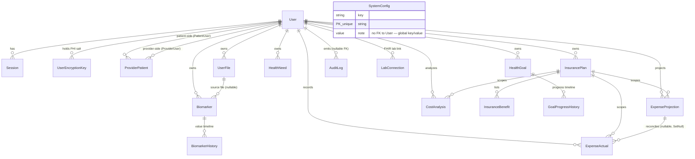

# DATA_MODEL.md

> Complete, deep reference for the OwnMyHealth database: every model, field, index, foreign key, RLS policy, cascade rule, and the `withRLSContext` / `withRLSTransaction` access-control wrappers.
> Source of truth: `backend/prisma/schema.prisma` + `backend/prisma/migrations/`. Generated 2026-06-01.

This doc lets a reader answer *"what does the DB look like and how is it access-controlled?"* without opening the schema file. Every non-trivial claim cites `file:path:line`.

---

## 1. Overview

| Metric | Count | Source |
|---|---|---|
| Prisma models (active) | **18** | `backend/prisma/schema.prisma` (`User`, `Session`, `UserEncryptionKey`, `ProviderPatient`, `UserFile`, `Biomarker`, `BiomarkerHistory`, `InsurancePlan`, `InsuranceBenefit`, `HealthNeed`, `HealthGoal`, `GoalProgressHistory`, `AuditLog`, `SystemConfig`, `ExpenseProjection`, `ExpenseActual`, `CostAnalysis`, `LabConnection`) |
| Prisma enums | **13** | `schema.prisma:501-608` (`UserRole` … `AuditAction`) |
| Migration directories | **22** | `backend/prisma/migrations/*/migration.sql` (Glob), excluding `migration_lock.toml` |
| RLS-enabled tables | **17** | 16 enabled in `20260107_add_rls_policies/migration.sql:68-83` + `lab_connections` in `20260418_add_lab_connections/migration.sql:35` |
| Encrypted (`*Encrypted`) columns | **30** | `PHI_FIELDS` in `backend/src/services/encryption.ts:410-486` |

All PHI is encrypted at the application layer with **AES-256-GCM** using a per-user derived key (PBKDF2-SHA512, 600k iterations) before it reaches the database — see [`PHI_TAXONOMY.md`](./PHI_TAXONOMY.md) and [`ARCHITECTURE.md`](./ARCHITECTURE.md). The database adds **PostgreSQL Row-Level Security (RLS)** as an independent layer: even with valid app credentials, a session can only read/write rows whose `user_id` matches the `app.current_user_id` session variable (or that admin/provider helper functions explicitly permit). The DNA/genetics feature (`DNAData`, `DNAVariant`, `GeneticTrait`) was **dropped** in `20260423_drop_dna_genetics` — see [§12 Removed models](#12-removed-models).

---

## 2. ER diagram (Mermaid)



`SystemConfig` is the **only** model with no FK to `User` — it is a global admin-only key/value store (`schema.prisma:487-499`).

---

## 3. Naming conventions

| Convention | Rule | Example | Source |
|---|---|---|---|
| Table name | `@@map("snake_case")` on every model | `model User { … @@map("users") }` | `schema.prisma:58` |
| Column name | `@map("snake_case")` on camelCase fields | `firstNameEncrypted @map("first_name_encrypted")` | `schema.prisma:14` |
| Encrypted PHI | `*Encrypted` suffix; column stores AES-256-GCM ciphertext as `iv:authTag:ciphertext` base64 | `valueEncrypted @map("value_encrypted")` | `schema.prisma:147`; format at `encryption.ts:226` |
| Primary key | `id String @id @default(dbgenerated("gen_random_uuid()")) @db.Uuid` — Postgres-native UUID, **not** cuid | every model | `schema.prisma:11`; aligned by `20260424_align_uuid_defaults_and_rename_claude_response/migration.sql:36-46` |
| Timestamps | `@db.Timestamptz(6)` for instants, `@db.Date` for calendar dates | `createdAt … @db.Timestamptz(6)` | `schema.prisma:38` |

The `*Encrypted` suffix is load-bearing: the application's PHI redaction and iteration-based sweeps (export, deletion, audit) key off it, and the logger redaction matches `*Encrypted` variants (`20260424_…rename_claude_response/migration.sql:18-22`).

```prisma
// Source: backend/prisma/schema.prisma:11-14
model User {
  id                       String              @id @default(dbgenerated("gen_random_uuid()")) @db.Uuid
  email                    String              @unique @db.VarChar(255)
  passwordHash             String              @map("password_hash") @db.VarChar(255)
  firstNameEncrypted       String?             @map("first_name_encrypted")
```

---

## 4. Model catalog

Eighteen models, alphabetical. Field tables list only structurally significant fields; the full column set is in `schema.prisma` at the cited line range. "Enc?" = encrypted PHI.

### AuditLog

**Table**: `audit_logs`   **Source**: `schema.prisma:458-485`

Purpose: immutable HIPAA access/change record; PHI snapshots encrypted with the **system salt** (survives user deletion).

| Field | Column | Type | Enc? | Null? | FK | Notes |
|---|---|---|---|---|---|---|
| `id` | `id` | `String @db.Uuid` | — | no | PK | uuid |
| `userId` | `user_id` | `String? @db.Uuid` | — | **yes** | `User.id` (no cascade — see §9) | nullable so logs survive user deletion |
| `actorType` | `actor_type` | `ActorType` | — | no | — | USER/SYSTEM/API/ADMIN/ANONYMOUS |
| `action` | `action` | `AuditAction` | — | no | — | enum (§11) |
| `resourceType` | `resource_type` | `String` | — | no | — | e.g. `Biomarker`, `Authentication` |
| `previousValueEncrypted` | `previous_value_encrypted` | `String?` | **yes** | yes | — | system-salt ciphertext |
| `newValueEncrypted` | `new_value_encrypted` | `String?` | **yes** | yes | — | system-salt ciphertext |
| `success` | `success` | `Boolean @default(true)` | — | no | — | |

**Indexes**: `userId`, `action`, `resourceType`, `resourceId`, plus 4 `createdAt` variants — see [§8](#8-index-catalog).
**Relations**: belongs to `User` via `userId` — relation has **no `onDelete`** (defaults to `NoAction`/`SetNull` on a nullable FK; logs are not cascaded).
**RLS**: yes (`audit_logs_*` policies). INSERT is `WITH CHECK (true)`; SELECT is self-or-admin; UPDATE denied (no policy); DELETE admin-only.
**Retention**: 2555 days (~7 years), enforced by `AuditLogService.cleanupOldLogs` (`auditLog.ts:531-559`, `RETENTION_DAYS` at `auditLog.ts:10`).

### Biomarker

**Table**: `biomarkers`   **Source**: `schema.prisma:141-177`

Purpose: one measured biomarker reading tied to a user.

| Field | Column | Type | Enc? | Null? | FK | Notes |
|---|---|---|---|---|---|---|
| `id` | `id` | `String @db.Uuid` | — | no | PK | uuid |
| `userId` | `user_id` | `String @db.Uuid` | — | no | `User.id` (Cascade) | RLS anchor |
| `category` | `category` | `String @db.VarChar(100)` | — | no | — | metadata, not PHI |
| `name` | `name` | `String @db.VarChar(200)` | — | no | — | |
| `unit` | `unit` | `String @db.VarChar(50)` | — | no | — | reference unit (not encrypted) |
| `valueEncrypted` | `value_encrypted` | `String` | **yes** | no | — | the measured value |
| `notesEncrypted` | `notes_encrypted` | `String?` | **yes** | yes | — | |
| `normalRangeMin/Max` | `normal_range_min/max` | `Decimal(10,4)` | — | no | — | reference range |
| `measurementDate` | `measurement_date` | `DateTime @db.Date` | — | no | — | |
| `sourceType` | `source_type` | `DataSourceType` | — | no | — | MANUAL default |
| `userFileId` | `user_file_id` | `String? @db.Uuid` | — | yes | `UserFile.id` (no cascade) | extraction source |

**Indexes**: 10 indexes (see §8), incl. `biomarkers_user_category_date_idx` `(user_id, category, measurement_date DESC)` — the dashboard list index.
**Relations**: belongs to `User` (Cascade); belongs to `UserFile?` (no cascade, SetNull behavior on nullable FK); has many `BiomarkerHistory` (Cascade).
**Encrypt site**: `biomarkerController.ts:238` (`encryptionService.encrypt(String(input.value), userSalt)`).
**Decrypt site**: `biomarkerController.ts:67` (`encryptionService.decrypt(biomarker.valueEncrypted, userSalt)`).
**RLS**: yes — self OR `has_provider_access(user_id, 'view_biomarkers')` OR admin (§6).

### BiomarkerHistory

**Table**: `biomarker_history`   **Source**: `schema.prisma:179-190`

Purpose: append-only value timeline for a biomarker. Has `valueEncrypted` but **no `notesEncrypted`** (by design — `encryption.ts:425-428`).

| Field | Column | Type | Enc? | Null? | FK | Notes |
|---|---|---|---|---|---|---|
| `id` | `id` | `String @db.Uuid` | — | no | PK | |
| `biomarkerId` | `biomarker_id` | `String @db.Uuid` | — | no | `Biomarker.id` (Cascade) | |
| `valueEncrypted` | `value_encrypted` | `String` | **yes** | no | — | |
| `measurementDate` | `measurement_date` | `DateTime @db.Date` | — | no | — | |

**RLS**: yes — via parent biomarker EXISTS subquery (`20260107_add_rls_policies/migration.sql:182-212`). No `user_id` column; access is derived from the owning `Biomarker`.

### CostAnalysis

**Table**: `cost_analyses`   **Source**: `schema.prisma:664-686`

Purpose: stores an AI (Claude) cost analysis for a plan; all output and dollar projections encrypted.

| Field | Column | Type | Enc? | Null? | FK | Notes |
|---|---|---|---|---|---|---|
| `id` | `id` | `String @db.Uuid` | — | no | PK | |
| `userId` | `user_id` | `String @db.Uuid` | — | no | `User.id` (Cascade) | |
| `planId` | `plan_id` | `String @db.Uuid` | — | no | `InsurancePlan.id` (Cascade) | |
| `claudeResponseEncrypted` | `claude_response_encrypted` | `String @db.Text` | **yes** | no | — | renamed from `claude_response` (`20260424_…`) |
| `totalProjectedOopEncrypted` | `total_projected_oop` | `String? @db.Text` | **yes** | yes | — | |
| `projectedExpensesSnapshotEncrypted` | `projected_expenses_snapshot` | `String? @db.Text` | **yes** | yes | — | |

**Encrypt site**: `expenseController.ts:737`. **Decrypt sites**: `expenseController.ts:799`, `settingsController.ts:613` (export).
**RLS**: yes (user-scoped; standard self/admin pattern via `withRLSTransaction(userId, …)`).

### ExpenseActual

**Table**: `expense_actuals`   **Source**: `schema.prisma:636-662`

Purpose: a real claim/EOB line. **All monetary fields stored as encrypted strings, not Decimal** (`20260206_fix_expense_encryption_types`).

| Field | Column | Type | Enc? | Null? | FK | Notes |
|---|---|---|---|---|---|---|
| `userId` | `user_id` | `String @db.Uuid` | — | no | `User.id` (Cascade) | |
| `planId` | `plan_id` | `String @db.Uuid` | — | no | `InsurancePlan.id` (Cascade) | |
| `projectionId` | `projection_id` | `String? @db.Uuid` | — | yes | `ExpenseProjection.id` (**SetNull**) | reconciliation link |
| `serviceTypeEncrypted` | `service_type` | `String @db.Text` | **yes** | no | — | |
| `providerNameEncrypted` | `provider_name` | `String? @db.Text` | **yes** | yes | — | |
| `billedAmountEncrypted` | `billed_amount` | `String? @db.Text` | **yes** | yes | — | |
| `insurancePaidEncrypted` | `insurance_paid` | `String? @db.Text` | **yes** | yes | — | |
| `patientPaidEncrypted` | `patient_paid` | `String? @db.Text` | **yes** | yes | — | |
| `appliedToDeductibleEncrypted` | `applied_to_deductible` | `String? @db.Text` | **yes** | yes | — | |
| `appliedToOopEncrypted` | `applied_to_oop` | `String? @db.Text` | **yes** | yes | — | |
| `notesEncrypted` | `notes` | `String? @db.Text` | **yes** | yes | — | |

**Indexes**: `(user_id, plan_id)`, `date_of_service`.
**RLS**: yes (user-scoped).

### ExpenseProjection

**Table**: `expense_projections`   **Source**: `schema.prisma:614-634`

Purpose: a planned/expected expense for a plan.

| Field | Column | Type | Enc? | Null? | FK | Notes |
|---|---|---|---|---|---|---|
| `userId` | `user_id` | `String @db.Uuid` | — | no | `User.id` (Cascade) | |
| `planId` | `plan_id` | `String @db.Uuid` | — | no | `InsurancePlan.id` (Cascade) | |
| `serviceTypeEncrypted` | `service_type` | `String @db.Text` | **yes** | no | — | |
| `estimatedCostEncrypted` | `estimated_cost` | `String @db.Text` | **yes** | no | — | was Decimal → Text (`20260206_…`) |
| `notesEncrypted` | `notes` | `String? @db.Text` | **yes** | yes | — | |

**Indexes**: `(user_id, plan_id)`, `createdAt`.
**Relations**: has many `ExpenseActual` (via `projectionId`, **SetNull** on delete).
**RLS**: yes (user-scoped).

### GoalProgressHistory

**Table**: `goal_progress_history`   **Source**: `schema.prisma:444-456`

Purpose: append-only progress entries for a `HealthGoal`.

| Field | Column | Type | Enc? | Null? | FK | Notes |
|---|---|---|---|---|---|---|
| `goalId` | `goal_id` | `String @db.Uuid` | — | no | `HealthGoal.id` (Cascade) | |
| `value` | `value` | `Decimal(10,4)` | — | no | — | numeric progress |
| `noteEncrypted` | `note_encrypted` | `String?` | **yes** | yes | — | |

**RLS**: yes — via parent goal EXISTS subquery, incl. provider `view_health_needs` branch (`20260107_…:436-466`).

### HealthGoal

**Table**: `health_goals`   **Source**: `schema.prisma:404-442`

Purpose: a tracked health goal with target/current values.

| Field | Column | Type | Enc? | Null? | FK | Notes |
|---|---|---|---|---|---|---|
| `userId` | `user_id` | `String @db.Uuid` | — | no | `User.id` (Cascade) | |
| `descriptionEncrypted` | `description_encrypted` | `String?` | **yes** | yes | — | |
| `targetValue` | `target_value` | `Decimal(10,4)` | — | no | — | **legacy plaintext**, kept for back-compat reads |
| `targetValueEncrypted` | `target_value_encrypted` | `String?` | **yes** | yes | — | added `20260420_encrypt_health_goal_target`; read path prefers this, falls back to `targetValue` (`schema.prisma:411-416`) |
| `direction` | `direction` | `GoalDirection` | — | no | — | DECREASE default |
| `status` | `status` | `GoalStatus` | — | no | — | ACTIVE default |
| `reminderFrequency` | `reminder_frequency` | `ReminderFrequency?` | — | yes | — | |

**Indexes**: 6 incl. `health_goals_user_status_target_idx` `(user_id, status, target_date)`.
**RLS**: yes — self OR `has_provider_access(user_id, 'view_health_needs')` OR admin (note: gated on the health-needs permission, not a goal-specific flag — `20260107_…:412-418`).

### HealthNeed

**Table**: `health_needs`   **Source**: `schema.prisma:384-402`

Purpose: a tracked health need (condition/action/service/follow-up).

| Field | Column | Type | Enc? | Null? | FK | Notes |
|---|---|---|---|---|---|---|
| `userId` | `user_id` | `String @db.Uuid` | — | no | `User.id` (Cascade) | |
| `needType` | `need_type` | `HealthNeedType` | — | no | — | |
| `descriptionEncrypted` | `description_encrypted` | `String` | **yes** | no | — | only encrypted field |
| `urgency` | `urgency` | `Urgency` | — | no | — | |
| `status` | `status` | `HealthNeedStatus` | — | no | — | PENDING default |
| `relatedBiomarkerIds` | `related_biomarker_ids` | `String[] @db.Uuid` | — | no | — | array, no FK |

**RLS**: yes — self OR `has_provider_access(user_id, 'view_health_needs')` OR admin; UPDATE also allows `'edit'` (`20260107_…:384-406`).

### InsuranceBenefit

**Table**: `insurance_benefits`   **Source**: `schema.prisma:361-382`

Purpose: a single covered service line under an `InsurancePlan`. No PHI columns.

| Field | Column | Type | Enc? | Null? | FK | Notes |
|---|---|---|---|---|---|---|
| `planId` | `plan_id` | `String @db.Uuid` | — | no | `InsurancePlan.id` (**Cascade**) | |
| `serviceName` | `service_name` | `String @db.VarChar(300)` | — | no | — | |
| `inNetworkCopay` | `in_network_copay` | `Decimal?(10,2)` | — | yes | — | metadata |

**Relation/onDelete**: belongs to `InsurancePlan` via `planId` — **`onDelete: Cascade`** (`schema.prisma:377`). Deleting a plan deletes its benefits.
**RLS**: yes — via parent plan EXISTS subquery incl. provider `view_insurance` branch (`20260107_…:242-282`).

### InsurancePlan

**Table**: `insurance_plans`   **Source**: `schema.prisma:192-359`

Purpose: a user's insurance plan with ~120 coverage columns (copays, coinsurance, Rx tiers, dental/vision, etc.). Only member/group IDs are PHI; the rest is plan metadata.

| Field | Column | Type | Enc? | Null? | FK | Notes |
|---|---|---|---|---|---|---|
| `userId` | `user_id` | `String @db.Uuid` | — | no | `User.id` (Cascade) | |
| `planName` | `plan_name` | `String @db.VarChar(300)` | — | no | — | metadata (not PHI) |
| `planType` | `plan_type` | `PlanType` | — | no | — | HMO/PPO/EPO/POS/HDHP |
| `memberIdEncrypted` | `member_id_encrypted` | `String?` | **yes** | yes | — | |
| `groupIdEncrypted` | `group_id_encrypted` | `String?` | **yes** | yes | — | |
| `deductibleIndividual` | `deductible_individual` | `Decimal(10,2)` | — | no | — | metadata |
| `isPrimary` | `is_primary` | `Boolean @default(false)` | — | no | — | |

**Indexes**: `userId`, `isActive`, `insurance_plans_user_active_primary_idx` `(user_id, is_active, is_primary DESC)`.
**Relations**: has many `InsuranceBenefit`/`ExpenseProjection`/`ExpenseActual`/`CostAnalysis` (all Cascade from plan).
**RLS**: yes — self OR `has_provider_access(user_id, 'view_insurance')` OR admin.

### LabConnection

**Table**: `lab_connections`   **Source**: `schema.prisma:692-716`

Purpose: per-user SMART-on-FHIR OAuth connection (Quest today; design supports LabCorp/others). OAuth tokens are PHI-adjacent.

| Field | Column | Type | Enc? | Null? | FK | Notes |
|---|---|---|---|---|---|---|
| `userId` | `user_id` | `String @db.Uuid` | — | no | `User.id` (Cascade) | |
| `provider` | `provider` | `String @db.VarChar(50)` | — | no | — | `'quest'` etc. |
| `accessTokenEncrypted` | `access_token_encrypted` | `String` | **yes** | no | — | OAuth access token |
| `refreshTokenEncrypted` | `refresh_token_encrypted` | `String?` | **yes** | yes | — | OAuth refresh token |
| `tokenExpiresAt` | `token_expires_at` | `DateTime? @db.Timestamptz(6)` | — | yes | — | |
| `syncStatus` | `sync_status` | `String @default("idle")` | — | no | — | idle/syncing/error |

**Why tokens are PHI**: a stolen access token is a direct path to the user's live PHI at the lab (Quest), so both tokens are encrypted with the user's per-user key (`schema.prisma:698-701`).
**Encrypt sites**: `fhir/labSyncService.ts:142-143` (initial), `:230-232` (refresh). **Decrypt sites**: `fhir/labSyncService.ts:213-215`, `:403`.
**Index/unique**: `@@unique([userId, provider])` (one connection per provider per user), `@@index([userId])`.
**RLS**: yes — self OR admin (`20260418_add_lab_connections/migration.sql:37-60`).

### ProviderPatient

**Table**: `provider_patients`   **Source**: `schema.prisma:94-117`

Purpose: consent-based provider↔patient link with granular permission flags.

| Field | Column | Type | Enc? | Null? | FK | Notes |
|---|---|---|---|---|---|---|
| `providerId` | `provider_id` | `String @db.Uuid` | — | no | `User.id` ProviderUser (**Cascade**) | |
| `patientId` | `patient_id` | `String @db.Uuid` | — | no | `User.id` PatientUser (**Cascade**) | |
| `canViewBiomarkers` | `can_view_biomarkers` | `Boolean @default(true)` | — | no | — | permission flag |
| `canViewInsurance` | `can_view_insurance` | `Boolean @default(false)` | — | no | — | |
| `canViewHealthNeeds` | `can_view_health_needs` | `Boolean @default(true)` | — | no | — | |
| `canEditData` | `can_edit_data` | `Boolean @default(false)` | — | no | — | `'edit'` permission |
| `status` | `status` | `ProviderPatientStatus` | — | no | — | PENDING default |
| `consentExpiresAt` | `consent_expires_at` | `DateTime?` | — | yes | — | checked by `has_provider_access` |
| `notesEncrypted` | `notes_encrypted` | `String?` | **yes** | yes | — | relationship notes |

**Unique/Indexes**: `@@unique([providerId, patientId])`; `@@index` on `providerId`, `patientId`, `status`.
**onDelete**: **both** `providerId` and `patientId` are `onDelete: Cascade` (`schema.prisma:109-110`). Deleting either party removes the relationship row. See [§3 acceptance Q3](#13-acceptance-questions).
**RLS**: yes — provider OR patient OR admin (both parties see/manage; provider-only INSERT) (`20260107_…:473-505`).
**Note**: the `can_view_dna` column was **dropped** in `20260423_drop_dna_genetics/migration.sql:28`.

### Session

**Table**: `sessions`   **Source**: `schema.prisma:61-75`

Purpose: DB-backed refresh-token session (the refresh-token / session record).

| Field | Column | Type | Enc? | Null? | FK | Notes |
|---|---|---|---|---|---|---|
| `userId` | `user_id` | `String @db.Uuid` | — | no | `User.id` (Cascade) | |
| `token` | `token` | `String @unique @db.VarChar(500)` | — | no | unique | session/refresh token (hash) |
| `expiresAt` | `expires_at` | `DateTime @db.Timestamptz(6)` | — | no | — | |

**Indexes**: `userId`, `token`, `expiresAt`.
**RLS**: yes — self OR admin (`20260107_…:118-128`).

### SystemConfig

**Table**: `system_config`   **Source**: `schema.prisma:487-499`

Purpose: global admin-only key/value config. **The one model with no FK to `User`.**

| Field | Column | Type | Enc? | Null? | FK | Notes |
|---|---|---|---|---|---|---|
| `key` | `key` | `String @unique @db.VarChar(100)` | — | no | unique | |
| `value` | `value` | `String` | — | no | — | |
| `isEncrypted` | `is_encrypted` | `Boolean @default(false)` | — | no | — | row-level flag |
| `updatedBy` | `updated_by` | `String? @db.Uuid` | — | yes | — | admin user id, no FK constraint |

**RLS**: yes — **admin-only for all operations** (`is_admin_session()` on SELECT/INSERT/UPDATE/DELETE — `20260107_…:537-551`).

### User

**Table**: `users`   **Source**: `schema.prisma:10-59`

Purpose: account + profile root; the RLS anchor every other user-scoped table joins to.

| Field | Column | Type | Enc? | Null? | Notes |
|---|---|---|---|---|---|
| `id` | `id` | `String @db.Uuid` | — | no | PK |
| `email` | `email` | `String @unique @db.VarChar(255)` | — | no | identifier, not classified PHI |
| `passwordHash` | `password_hash` | `String @db.VarChar(255)` | — | no | bcrypt/argon hash |
| `firstNameEncrypted` | `first_name_encrypted` | `String?` | **yes** | yes | |
| `lastNameEncrypted` | `last_name_encrypted` | `String?` | **yes** | yes | |
| `dateOfBirthEncrypted` | `date_of_birth_encrypted` | `String?` | **yes** | yes | |
| `phoneEncrypted` | `phone_encrypted` | `String?` | **yes** | yes | |
| `addressEncrypted` | `address_encrypted` | `String?` | **yes** | yes | |
| `healthProfileEncrypted` | `health_profile_encrypted` | `String?` | **yes** | yes | JSON profile (`20260418_add_health_profile`) |
| `role` | `role` | `UserRole @default(PATIENT)` | — | no | self-elevation blocked by trigger (§6) |
| `plan` | `plan` | `String @default("FREE") @db.VarChar(20)` | — | no | FREE/PRO/TEAM (`20260420_add_user_plan`) |
| `pendingEmail` | `pending_email` | `String? @db.VarChar(255)` | — | yes | email-change flow (`20260601_add_email_change`) |
| `emailChangeToken` | `email_change_token` | `String? @unique` | — | yes | SHA-256 hash of change link token |
| `notificationPreferences` | `notification_preferences` | `Json @default("{}")` | — | no | non-PHI JSON (`20260417_…`) |

**Indexes**: `email`, `createdAt`, plus unique indexes on the token columns.
**RLS**: yes — `users_select_own` (self/admin) PLUS `users_select_provider` (any active consent — §6); UPDATE self/admin but `role`/`is_active` change blocked for non-admin by trigger.

### UserEncryptionKey

**Table**: `user_encryption_keys`   **Source**: `schema.prisma:77-92`

Purpose: holds the **per-user PHI salt** (encrypted with the master key), from which the per-user AES key is derived.

| Field | Column | Type | Enc? | Null? | FK | Notes |
|---|---|---|---|---|---|---|
| `userId` | `user_id` | `String @db.Uuid` | — | no | `User.id` (Cascade) | |
| `keyType` | `key_type` | `String @db.VarChar(50)` | — | no | — | `'phi_encryption'` |
| `encryptedKey` | `encrypted_key` | `String` | — | no | — | the user salt, master-key-encrypted |
| `version` | `version` | `Int @default(1)` | — | no | — | |
| `isActive` | `is_active` | `Boolean @default(true)` | — | no | — | |

**Unique**: `@@unique([userId, keyType, version])`.
**Where derived/read**: `userEncryption.getUserEncryptionSalt` (`userEncryption.ts:29-72`) — finds or creates the salt; the master-key wrap/unwrap is `encryptionService.encryptWithMasterKey`/`decryptWithMasterKey` (`encryption.ts:214-253`); the per-user key is derived via PBKDF2-SHA512 at `encryption.ts:192-200`. **This is the model that holds the wrap key** (acceptance Q8). Account-deletion destroys this salt, making the user's PHI permanently unreadable.
**RLS**: yes — self OR admin (`20260107_…:134-144`).

### UserFile

**Table**: `user_files`   **Source**: `schema.prisma:119-139`

Purpose: an uploaded file (lab PDF, SBC). Metadata only; the binary lives in GCS keyed by `storageKey`.

| Field | Column | Type | Enc? | Null? | FK | Notes |
|---|---|---|---|---|---|---|
| `userId` | `user_id` | `String @db.Uuid` | — | no | `User.id` (Cascade) | |
| `storageKey` | `storage_key` | `String @db.VarChar(500)` | — | no | — | GCS object key |
| `fileType` | `file_type` | `String @db.VarChar(50)` | — | no | — | |
| `biomarkersExtracted` | `biomarkers_extracted` | `Int @default(0)` | — | no | — | |

**Indexes**: `userId`, `labDate`.
**Relations**: has many `Biomarker` (via `userFileId`, nullable, no cascade — biomarkers persist if a file row is removed).
**RLS**: yes — `user_files` was RLS-enabled in `20260108000000_add_user_files_table` (table created with its own policies). User-scoped self/admin.

---

## 5. Encryption matrix

Cross-reference of every `*Encrypted` schema column vs `PHI_FIELDS` (`encryption.ts:410-486`). **No drift** — all 30 columns appear in both.

| Model.Field | In `PHI_FIELDS`? | In schema as `*Encrypted`? | Writer (encrypt) | Reader (decrypt) |
|---|---|---|---|---|
| `User.firstNameEncrypted` | yes (`encryption.ts:413`) | yes (`schema.prisma:14`) | `settingsController.ts` (profile update) | `settingsController.ts` / `authService.ts` |
| `User.lastNameEncrypted` | yes (`:414`) | yes (`:15`) | settingsController | settingsController |
| `User.dateOfBirthEncrypted` | yes (`:415`) | yes (`:16`) | settingsController | settingsController |
| `User.phoneEncrypted` | yes (`:416`) | yes (`:17`) | settingsController | settingsController |
| `User.addressEncrypted` | yes (`:417`) | yes (`:18`) | settingsController | settingsController |
| `User.healthProfileEncrypted` | yes (`:418`) | yes (`:33`) | `healthProfileService.ts:104` | `healthProfileService.ts:59` |
| `Biomarker.valueEncrypted` | yes (`:422`) | yes (`:147`) | `biomarkerController.ts:238` | `biomarkerController.ts:67` |
| `Biomarker.notesEncrypted` | yes (`:423`) | yes (`:148`) | biomarkerController | biomarkerController |
| `BiomarkerHistory.valueEncrypted` | yes (`:426`) | yes (`:182`) | `biomarkerController.ts:504` | `biomarkerController.ts:77` |
| `InsurancePlan.memberIdEncrypted` | yes (`:431`) | yes (`:199`) | insuranceController | insuranceController |
| `InsurancePlan.groupIdEncrypted` | yes (`:432`) | yes (`:200`) | insuranceController | insuranceController |
| `ProviderPatient.notesEncrypted` | yes (`:436`) | yes (`:106`) | providerRoutes/patientRoutes | providerRoutes |
| `HealthNeed.descriptionEncrypted` | yes (`:440`) | yes (`:389`) | healthNeedsController | healthNeedsController |
| `HealthGoal.descriptionEncrypted` | yes (`:445`) | yes (`:408`) | healthGoalsController | healthGoalsController |
| `HealthGoal.targetValueEncrypted` | yes (`:446`) | yes (`:416`) | healthGoalsController | healthGoalsController |
| `GoalProgressHistory.noteEncrypted` | yes (`:449`) | yes (`:449`) | healthGoalsController | healthGoalsController |
| `AuditLog.previousValueEncrypted` | yes (`:453`) | yes (`:468`) | `auditLog.ts:240` (system salt) | `auditLog.ts` / adminRoutes |
| `AuditLog.newValueEncrypted` | yes (`:454`) | yes (`:469`) | `auditLog.ts:241` (system salt) | adminRoutes |
| `ExpenseProjection.serviceTypeEncrypted` | yes (`:458`) | yes (`:618`) | expenseController | expenseController |
| `ExpenseProjection.estimatedCostEncrypted` | yes (`:459`) | yes (`:619`) | expenseController | expenseController |
| `ExpenseProjection.notesEncrypted` | yes (`:460`) | yes (`:622`) | expenseController | expenseController |
| `ExpenseActual.serviceTypeEncrypted` | yes (`:463`) | yes (`:641`) | expenseController | expenseController |
| `ExpenseActual.providerNameEncrypted` | yes (`:464`) | yes (`:642`) | expenseController | expenseController |
| `ExpenseActual.billedAmountEncrypted` | yes (`:465`) | yes (`:644`) | expenseController | expenseController |
| `ExpenseActual.insurancePaidEncrypted` | yes (`:466`) | yes (`:645`) | expenseController | expenseController |
| `ExpenseActual.patientPaidEncrypted` | yes (`:467`) | yes (`:646`) | expenseController | expenseController |
| `ExpenseActual.appliedToDeductibleEncrypted` | yes (`:468`) | yes (`:647`) | expenseController | expenseController |
| `ExpenseActual.appliedToOopEncrypted` | yes (`:469`) | yes (`:648`) | expenseController | expenseController |
| `ExpenseActual.notesEncrypted` | yes (`:470`) | yes (`:651`) | expenseController | expenseController |
| `CostAnalysis.claudeResponseEncrypted` | yes (`:476`) | yes (`:674`) | `expenseController.ts:737` | `expenseController.ts:799`, `settingsController.ts:613` |
| `CostAnalysis.totalProjectedOopEncrypted` | yes (`:477`) | yes (`:675`) | expenseController | expenseController |
| `CostAnalysis.projectedExpensesSnapshotEncrypted` | yes (`:478`) | yes (`:677`) | expenseController | expenseController |
| `LabConnection.accessTokenEncrypted` | yes (`:483`) | yes (`:700`) | `fhir/labSyncService.ts:142` | `fhir/labSyncService.ts:213,403` |
| `LabConnection.refreshTokenEncrypted` | yes (`:484`) | yes (`:701`) | `fhir/labSyncService.ts:143` | `fhir/labSyncService.ts:215` |

> Note: most expense fields are encrypted/decrypted via the iteration-based `encryptFields`/`decryptFields` helpers (`encryption.ts:337-384`) keyed off `PHI_FIELDS`. Controller-level encrypt/decrypt for the heavily-used Biomarker, LabConnection, and CostAnalysis paths is cited directly above. See [`PHI_TAXONOMY.md`](./PHI_TAXONOMY.md) for the full per-field reader/writer map.

`AuditLog` uses the **system salt** (`auditLog.ts:148` sets `systemSalt = config.auditSalt`; encrypt at `auditLog.ts:220`), not a per-user salt — because audit rows must remain readable after a user (and their per-user salt) is deleted, for the 7-year retention window.

---

## 6. RLS policy catalog

RLS gives a second, SQL-enforced layer of tenant isolation. Even if the app layer is compromised and issues an unscoped `SELECT * FROM biomarkers`, the policy `USING` clause filters rows to the current session's `app.current_user_id` (or admin/provider) — **the SQL-level constraint that prevents a non-admin session from reading another user's data** (acceptance Q15).

### Helper functions (final bodies)

```sql
-- Source: backend/prisma/migrations/20260107_add_rls_policies/migration.sql:17-25
CREATE OR REPLACE FUNCTION current_user_id()
RETURNS uuid AS $$
BEGIN
  RETURN NULLIF(current_setting('app.current_user_id', true), '')::uuid;
EXCEPTION
  WHEN OTHERS THEN
    RETURN NULL;
END;
$$ LANGUAGE plpgsql STABLE SECURITY DEFINER;
```

```sql
-- Source: backend/prisma/migrations/20260107_add_rls_policies/migration.sql:28-36
CREATE OR REPLACE FUNCTION is_admin_session()
RETURNS boolean AS $$
BEGIN
  RETURN COALESCE(current_setting('app.is_admin', true), 'false')::boolean;
EXCEPTION
  WHEN OTHERS THEN
    RETURN false;
END;
$$ LANGUAGE plpgsql STABLE SECURITY DEFINER;
```

`has_provider_access(patient_user_id, permission_type)` gates whether the **current provider session** may read/edit a consented patient's data. It checks for an `ACTIVE`, unexpired `provider_patients` row and the matching capability flag. The **final** body (after `20260529_fix_has_provider_access` dropped the dead `view_dna` branch) is:

```sql
-- Source: backend/prisma/migrations/20260529_fix_has_provider_access/migration.sql:20-42
CREATE OR REPLACE FUNCTION has_provider_access(patient_user_id uuid, permission_type text DEFAULT 'view')
RETURNS boolean AS $$
DECLARE
  has_access boolean;
BEGIN
  SELECT EXISTS (
    SELECT 1 FROM provider_patients pp
    WHERE pp.provider_id = current_user_id()
      AND pp.patient_id = patient_user_id
      AND pp.status = 'ACTIVE'
      AND (pp.consent_expires_at IS NULL OR pp.consent_expires_at > NOW())
      AND CASE permission_type
        WHEN 'view_biomarkers' THEN pp.can_view_biomarkers
        WHEN 'view_insurance' THEN pp.can_view_insurance
        WHEN 'view_health_needs' THEN pp.can_view_health_needs
        WHEN 'edit' THEN pp.can_edit_data
        ELSE pp.can_view_biomarkers -- Default to basic view
      END
  ) INTO has_access;
  RETURN COALESCE(has_access, false);
END;
$$ LANGUAGE plpgsql STABLE SECURITY DEFINER;
```

> Why the fix mattered: the original body referenced `pp.can_view_dna`, which `20260423_drop_dna_genetics` dropped. Postgres plans the whole function body, so the missing column made `has_provider_access` throw `column pp.can_view_dna does not exist` for **every** permission type under a `NOBYPASSRLS` role — breaking all multi-tenant reads (`20260529_…/migration.sql:1-18`).

`has_active_consent(patient_user_id)` (added `20260530_add_users_select_provider`) gates the provider's read of a consented patient's **users** row on ANY active consent (not a specific flag):

```sql
-- Source: backend/prisma/migrations/20260530_add_users_select_provider/migration.sql:33-48
CREATE OR REPLACE FUNCTION has_active_consent(patient_user_id uuid)
RETURNS boolean AS $$
DECLARE
  has_access boolean;
BEGIN
  SELECT EXISTS (
    SELECT 1 FROM provider_patients pp
    WHERE pp.provider_id = current_user_id()
      AND pp.patient_id = patient_user_id
      AND pp.status = 'ACTIVE'
      AND (pp.consent_expires_at IS NULL OR pp.consent_expires_at > NOW())
  ) INTO has_access;
  RETURN COALESCE(has_access, false);
END;
$$ LANGUAGE plpgsql STABLE SECURITY DEFINER;
```

### Per-table policy summary

All tables ENABLE ROW LEVEL SECURITY (`20260107_…:68-83`, `lab_connections` at `20260418_…:35`). `is_admin_session()` is the bypass for every table (it is the function that lets admin code bypass the per-user policy — acceptance Q4). `current_user_id()` and `has_provider_access()` are the two helpers besides `is_admin_session()` that underpin RLS (acceptance Q19).

| Table | SELECT | INSERT | UPDATE | DELETE | Source |
|---|---|---|---|---|---|
| `users` | self/admin (`users_select_own`) **OR** active consent (`users_select_provider`) | admin or `current_user_id() IS NULL` (registration) | self/admin (+ role/is_active trigger) | admin only | `20260107_…:90-111`; `20260530_…:54-56`; trigger `20260424_prevent_self_role_elevation` |
| `sessions` | self/admin | self/admin/null | — (no UPDATE policy) | self/admin | `20260107_…:118-128` |
| `user_encryption_keys` | self/admin | self/admin/null | self/admin | — | `20260107_…:134-144` |
| `biomarkers` | self / `has_provider_access(…, 'view_biomarkers')` / admin | self/admin | self / `…'edit'` / admin | self/admin | `20260107_…:151-176` |
| `biomarker_history` | via parent biomarker | via parent | — | via parent | `20260107_…:182-212` |
| `insurance_plans` | self / `…'view_insurance'` / admin | self/admin | self/admin | self/admin | `20260107_…:218-236` |
| `insurance_benefits` | via parent plan | via parent | via parent | via parent | `20260107_…:242-282` |
| `health_needs` | self / `…'view_health_needs'` / admin | self/admin | self / `…'edit'` / admin | self/admin | `20260107_…:384-406` |
| `health_goals` | self / `…'view_health_needs'` / admin | self/admin | self/admin | self/admin | `20260107_…:412-430` |
| `goal_progress_history` | via parent goal | via parent | — | via parent | `20260107_…:436-466` |
| `provider_patients` | provider/patient/admin | provider/admin | provider/patient/admin | provider/patient/admin | `20260107_…:473-505` |
| `audit_logs` | self/admin | `WITH CHECK (true)` | — (immutable) | admin only | `20260107_…:512-530` |
| `system_config` | admin only | admin only | admin only | admin only | `20260107_…:537-551` |
| `lab_connections` | self/admin | self/admin | self/admin | self/admin | `20260418_…:37-60` |
| `user_files` | self/admin | self/admin | self/admin | self/admin | `20260108000000_add_user_files_table` |
| `expense_projections` / `expense_actuals` / `cost_analyses` | self/admin | self/admin | self/admin | self/admin | `20260111_add_expense_tracking` |

Verbatim policy body (acceptance Q6):

```sql
-- Source: backend/prisma/migrations/20260107_add_rls_policies/migration.sql:151-157
CREATE POLICY biomarkers_select ON biomarkers
  FOR SELECT
  USING (
    user_id = current_user_id()
    OR has_provider_access(user_id, 'view_biomarkers')
    OR is_admin_session()
  );
```

### Defense-in-depth: BYPASSRLS guard

The app refuses to serve PHI if the DB role can bypass RLS. In production, `BYPASSRLS=true` is a hard `process.exit(1)`; in non-prod it warns:

```ts
// Source: backend/src/services/database.ts:248-260
if (config.isProduction) {
  logger.error(
    'FATAL: Production database role has BYPASSRLS. ' +
    'RLS policies are not enforcing. Refusing to start. ' +
    'See C8_PART3_RUNBOOK.md.'
  );
  process.exit(1);
}
logger.warn(
  'WARNING: Database role has BYPASSRLS — RLS policies are not enforcing. ' +
  'This is acceptable in development but must be fixed before production.'
);
```

---

## 7. `withRLSContext` vs `withRLSTransaction` usage matrix

Both wrappers open a Prisma `$transaction`, then issue `SELECT set_config('app.current_user_id', …, true)` and `SELECT set_config('app.is_admin', …, true)` on that transaction (`database.ts:368-377`) so RLS policies evaluate against the caller. **Every query inside the callback must go through the `tx` argument** — a call to the module-level `prisma` singleton runs on a different pooled connection that never received the `SET LOCAL`, silently bypassing RLS (`database.ts:14-31`). This invariant is enforced in CI by `scripts/check-rls-wrappers.sh` (referenced at `database.ts:26`).

```ts
// Source: backend/src/services/database.ts:368-377
async function applyRLSContext(
  tx: Prisma.TransactionClient,
  userId: string | null,
  isAdmin: boolean
): Promise<void> {
  const userIdValue = userId ?? '';
  const isAdminValue = isAdmin ? 'true' : 'false';
  await tx.$executeRaw`SELECT set_config('app.current_user_id', ${userIdValue}, true)`;
  await tx.$executeRaw`SELECT set_config('app.is_admin', ${isAdminValue}, true)`;
}
```

### Difference (acceptance Q5)

Both share one implementation (`runWithRLS`, `database.ts:424-445`). The difference is the transaction-option defaults:

| Wrapper | `$transaction` options | Intended use | Source |
|---|---|---|---|
| `withRLSContext(userId, fn, opts?)` | `{ maxWait: 20_000, timeout: 30_000 }` | single read or simple write; longer wait/timeout for Cloud SQL cold starts | `database.ts:447-456` |
| `withRLSTransaction(userId, fn, opts?)` | `undefined` (Prisma defaults: 2s maxWait / 5s timeout) | multi-statement atomic ops (create + audit, update + history) — **use this when several writes must commit/rollback together** | `database.ts:468-474` |

Practically, controllers use `withRLSTransaction` for create/update/delete + audit (atomicity), and `withRLSContext` for reads, admin listings, and system context.

### Call-site matrix (representative; null = admin context)

| Caller (`file:line`) | Wrapper | `userId` | Purpose |
|---|---|---|---|
| `biomarkerController.ts:137` | `withRLSTransaction` | `userId` | List own biomarkers + count atomically |
| `biomarkerController.ts:202` | `withRLSTransaction` | `userId` | Get single biomarker + history |
| `biomarkerController.ts:300` | `withRLSTransaction` | `userId` | Update biomarker + write history + audit |
| `insuranceController.ts:432` | `withRLSTransaction` | `userId` | List own plans |
| `expenseController.ts:728` | `withRLSTransaction` | `userId` | Create cost analysis (Claude) + persist |
| `settingsController.ts:353` | `withRLSContext` | `userId` | Export own data (read) |
| `settingsController.ts:965` | `withRLSContext` | **null** | System/no-user context during deletion |
| `fileController.ts:56` | `withRLSTransaction` | `userId` | List own files |
| `fhirController.ts:119` | `withRLSContext` | `userId` | List own lab connections |
| `fhir/labSyncService.ts:304` | `withRLSTransaction` | `userId` | Import labs (biomarker + history) atomically |
| `providerRoutes.ts:227` | `withRLSContext` | `providerId` | Provider reads consented patient (RLS via `has_provider_access`) |
| `patientRoutes.ts:204` | `withRLSContext` | `patientId` | Patient approves/revokes consent |
| `adminRoutes.ts:61` | `withRLSContext` | **null** + `{isAdmin:true}` | Admin user listing (RLS sees `is_admin_session()=true`) |
| `adminRoutes.ts:891` | `withRLSContext` | **null** + `{isAdmin:true}` | Admin audit-log viewer |
| `auditLog.ts:269` | `withRLSContext` | **null** + `{isAdmin:true}` | Standalone audit write (`WITH CHECK (true)`) |
| `auditLog.ts:539` | `withRLSContext` | **null** + `{isAdmin:true}` | Retention `deleteMany` |
| `userEncryption.ts:30` | `withRLSContext` | **null** + `{isAdmin:true}` | Get/create per-user salt (infra, not user-scoped) |
| `authService.ts:626` | `withRLSContext` | **null** + `{isAdmin:true}` | Lookup user by email at login (pre-session) |
| `emailScheduler.ts:83` | `withRLSContext` | **null** + `{isAdmin:true}` | Cross-user batch select for scheduled email |
| `providerRoutes.ts:165` | `withRLSContext` | **null** + `{isAdmin:true}` | Resolve patient id by email for a connect request |
| `rbac.ts:208` | `withRLSContext` | **null** | Check provider→patient relationship in RBAC middleware |
| `notificationService.ts:53` | `withRLSContext` | **null** | Cross-user notification preference lookup |

### Who passes `null` (acceptance Q10) and why

`null` userId (or `{ isAdmin: true }`) puts the transaction into **admin context** (`is_admin_session() = true`), used where the operation is legitimately not scoped to one user:

- **Admin endpoints** — all of `adminRoutes.ts` (user mgmt, audit viewer): `adminRoutes.ts:61,137,210,294,407,441,491,535,576,662,705,789,891`. Each is also RBAC-gated to ADMIN.
- **Audit logging** — `auditLog.ts:269` (standalone write), `:509` (query), `:539` (retention cleanup).
- **Auth pre-session lookups** — `authService.ts` (login/register/reset look up users by email/token before a session exists): `:371,402,459,626,657,677,871,934,977,1028,1077,1158,1251,1333,1381`.
- **Per-user salt infra** — `userEncryption.ts:30,89` (salt lookup is infrastructure, callers don't own an RLS context — `userEncryption.ts:8-16`).
- **Schedulers** — `emailScheduler.ts:83,162,241` (batch across users).
- **Provider/patient id resolution** — `providerRoutes.ts:165`, `patientRoutes.ts:49,129` (resolve a counterparty by email; `users_select_own` would deny).
- **RBAC + notifications** — `rbac.ts:208,288`, `notificationService.ts:53`.
- **Deletion system step** — `settingsController.ts:965`.

---

## 8. Index catalog

Every `@@index` / `@@unique` in `schema.prisma`. The dashboard biomarker list query is served by `biomarkers_user_category_date_idx` (acceptance Q7).

| Model | Index name / def | Columns | Type | Source |
|---|---|---|---|---|
| User | (unique) `email` | `email` | btree unique | `schema.prisma:12` |
| User | `@@index([email])` | `email` | btree | `schema.prisma:56` |
| User | `@@index([createdAt])` | `created_at` | btree | `schema.prisma:57` |
| User | (unique) token cols | `email_verification_token`, `password_reset_token`, `email_change_token` | btree unique | `schema.prisma:20,22,25`; `20260601_…:12` |
| Session | `@@index([userId])`, `[token]`, `[expiresAt]` | resp. | btree | `schema.prisma:71-73` |
| UserEncryptionKey | `@@unique([userId,keyType,version])`, `@@index([userId])` | resp. | btree | `schema.prisma:89-90` |
| ProviderPatient | `@@unique([providerId,patientId])`; idx `providerId`,`patientId`,`status` | resp. | btree | `schema.prisma:112-115` |
| UserFile | `@@index([userId])`, `[labDate]` | resp. | btree | `schema.prisma:136-137` |
| Biomarker | `@@index([userId])` | `user_id` | btree | `schema.prisma:166` |
| Biomarker | `@@index([userId,category])` | `(user_id,category)` | btree | `schema.prisma:167` |
| Biomarker | `@@index([measurementDate])` | `measurement_date` | btree | `schema.prisma:168` |
| Biomarker | `@@index([isOutOfRange])` | `is_out_of_range` | btree | `schema.prisma:169` |
| Biomarker | `@@index([userFileId])` | `user_file_id` | btree | `schema.prisma:170` |
| Biomarker | `biomarkers_user_category_date_idx` | `(user_id,category,measurement_date DESC)` | btree | `schema.prisma:171`; `20260103_add_compound_indexes:12-13` — **dashboard list query** |
| Biomarker | `@@index([userId,createdAt])` | `(user_id,created_at)` | btree | `schema.prisma:173` |
| Biomarker | `@@index([userId,isOutOfRange])` | `(user_id,is_out_of_range)` | btree | `schema.prisma:174` |
| Biomarker | `@@index([userId,sourceType])` | `(user_id,source_type)` | btree | `schema.prisma:175` |
| InsurancePlan | `@@index([userId])`, `[isActive]` | resp. | btree | `schema.prisma:354-355` |
| InsurancePlan | `insurance_plans_user_active_primary_idx` | `(user_id,is_active,is_primary DESC)` | btree | `schema.prisma:356`; `20260103_…:22-23` |
| InsuranceBenefit | `@@index([planId])`, `[serviceCategory]` | resp. | btree | `schema.prisma:379-380` |
| HealthNeed | `@@index([userId])`, `[status]`, `[urgency]` | resp. | btree | `schema.prisma:398-400` |
| HealthGoal | `@@index([userId])`,`[status]`,`[category]`,`[targetDate]` | resp. | btree | `schema.prisma:435-438` |
| HealthGoal | `health_goals_user_status_target_idx` | `(user_id,status,target_date)` | btree | `schema.prisma:439`; `20260103_…:17-18` |
| GoalProgressHistory | `@@index([goalId])`, `[recordedAt]` | resp. | btree | `schema.prisma:453-454` |
| BiomarkerHistory | `@@index([biomarkerId])`, `[measurementDate]` | resp. | btree | `schema.prisma:187-188` |
| AuditLog | `@@index([userId])`,`[action]`,`[resourceType]`,`[resourceId]` | resp. | btree | `schema.prisma:476-479` |
| AuditLog | `audit_logs_created_at_asc_idx`, `audit_logs_created_at_desc_idx`, `audit_logs_user_created_at_idx` | `created_at` / `(user_id,created_at DESC)` | btree | `schema.prisma:480-483`; `20260103_…:7-8` |
| SystemConfig | (unique) `key` | `key` | btree unique | `schema.prisma:489` |
| ExpenseProjection | `@@index([userId,planId])`, `[createdAt]` | resp. | btree | `schema.prisma:631-632` |
| ExpenseActual | `@@index([userId,planId])`, `[dateOfService]` | resp. | btree | `schema.prisma:659-660` |
| CostAnalysis | `@@index([userId,planId])`, `[analysisDate]` | resp. | btree | `schema.prisma:683-684` |
| LabConnection | `@@unique([userId,provider])`, `@@index([userId])` | resp. | btree | `schema.prisma:713-714` |

> Several biomarker/insurance/goal compound indexes appear **twice** in `schema.prisma` (once with an explicit `map:` name, once anonymous) — e.g. `schema.prisma:171-172`. This is benign duplication in the Prisma model (the named DDL is the one applied by `20260103_add_compound_indexes`); flagged in the [drift log](#prompt-drift-log).

---

## 9. Cascade / deletion behavior

Deleting a `User` cascades to **all** child rows whose FK is `onDelete: Cascade`. `AuditLog` is the deliberate exception (nullable FK, no cascade) so the 7-year HIPAA trail survives account deletion (acceptance Q13).

| Relation | Parent | Child | onDelete | Source | Impact |
|---|---|---|---|---|---|
| `Session.userId → User.id` | User | Session | **Cascade** | `schema.prisma:69` | sessions purged |
| `UserEncryptionKey.userId → User.id` | User | UserEncryptionKey | **Cascade** | `schema.prisma:87` | per-user salt destroyed → PHI permanently unreadable |
| `ProviderPatient.patientId → User.id` | User | ProviderPatient | **Cascade** | `schema.prisma:109` | patient-side links removed |
| `ProviderPatient.providerId → User.id` | User | ProviderPatient | **Cascade** | `schema.prisma:110` | provider-side links removed |
| `UserFile.userId → User.id` | User | UserFile | **Cascade** | `schema.prisma:134` | file metadata removed (GCS blobs deleted separately by app) |
| `Biomarker.userId → User.id` | User | Biomarker | **Cascade** | `schema.prisma:164` | biomarkers purged |
| `Biomarker.userFileId → UserFile.id` | UserFile | Biomarker | (none → SetNull on nullable) | `schema.prisma:163` | biomarker kept, link nulled |
| `BiomarkerHistory.biomarkerId → Biomarker.id` | Biomarker | BiomarkerHistory | **Cascade** | `schema.prisma:185` | history purged |
| `InsurancePlan.userId → User.id` | User | InsurancePlan | **Cascade** | `schema.prisma:349` | plans purged |
| `InsuranceBenefit.planId → InsurancePlan.id` | InsurancePlan | InsuranceBenefit | **Cascade** | `schema.prisma:377` | benefits purged with plan (acceptance Q18) |
| `HealthNeed.userId → User.id` | User | HealthNeed | **Cascade** | `schema.prisma:396` | needs purged |
| `HealthGoal.userId → User.id` | User | HealthGoal | **Cascade** | `schema.prisma:433` | goals purged |
| `GoalProgressHistory.goalId → HealthGoal.id` | HealthGoal | GoalProgressHistory | **Cascade** | `schema.prisma:451` | progress purged |
| `ExpenseProjection.userId → User.id` | User | ExpenseProjection | **Cascade** | `schema.prisma:627` | projections purged |
| `ExpenseProjection.planId → InsurancePlan.id` | InsurancePlan | ExpenseProjection | **Cascade** | `schema.prisma:628` | projections purged with plan |
| `ExpenseActual.userId → User.id` | User | ExpenseActual | **Cascade** | `schema.prisma:655` | actuals purged |
| `ExpenseActual.planId → InsurancePlan.id` | InsurancePlan | ExpenseActual | **Cascade** | `schema.prisma:656` | actuals purged with plan |
| `ExpenseActual.projectionId → ExpenseProjection.id` | ExpenseProjection | ExpenseActual | **SetNull** | `schema.prisma:657` | actual kept, projection link nulled |
| `CostAnalysis.userId → User.id` | User | CostAnalysis | **Cascade** | `schema.prisma:680` | analyses purged |
| `CostAnalysis.planId → InsurancePlan.id` | InsurancePlan | CostAnalysis | **Cascade** | `schema.prisma:681` | analyses purged with plan |
| `LabConnection.userId → User.id` | User | LabConnection | **Cascade** | `schema.prisma:711` | lab connections (tokens) purged |
| `AuditLog.userId → User.id` | User | AuditLog | **none** (nullable FK; not cascaded) | `schema.prisma:474` | **logs retained** (7-yr HIPAA) |

**GDPR-style deletion of a User** removes: Session, UserEncryptionKey, both ProviderPatient sides, UserFile, Biomarker (+BiomarkerHistory), InsurancePlan (+InsuranceBenefit, +ExpenseProjection, +ExpenseActual, +CostAnalysis), HealthNeed, HealthGoal (+GoalProgressHistory), ExpenseProjection/Actual/CostAnalysis (direct user FKs), LabConnection — and intentionally **keeps** AuditLog (with `user_id` left pointing at the now-deleted id, since there is no cascade). Because `UserEncryptionKey` is cascaded, the user's per-user salt is destroyed, rendering any residual encrypted PHI cryptographically unreadable.

```prisma
// Source: backend/prisma/schema.prisma:109-110
patient            User                  @relation("PatientUser", fields: [patientId], references: [id], onDelete: Cascade)
provider           User                  @relation("ProviderUser", fields: [providerId], references: [id], onDelete: Cascade)
```

---

## 10. Migration timeline

22 migration directories (`backend/prisma/migrations/*/migration.sql`), chronological. Most recent: `20260601_add_email_change` (acceptance Q9).

| Date | Migration | Effect | Source |
|---|---|---|---|
| (baseline) | `00000000000000_initial_schema` | Baseline schema: all enums + core tables (incl. then-present DNA tables) | `…/migration.sql:1-10` |
| 2026-01-03 | `20260103_add_compound_indexes` | 4 compound indexes (audit, biomarker, goal, insurance) | `…:7-23` |
| 2026-01-07 | `20260107_add_rls_policies` | Enabled RLS on 16 tables; added `current_user_id()`/`is_admin_session()`/`has_provider_access()` + all policies | `…:17-560` |
| 2026-01-08 | `20260108000000_add_user_files_table` | Added `user_files` table (+RLS) | `…:1-12` |
| 2026-01-10 | `20260110_add_coinsurance_columns` | Per-service coinsurance columns on `insurance_plans` | dir |
| 2026-01-10 | `20260110_add_comprehensive_coverage_fields` | Inpatient/outpatient/Rx/dental/vision coverage columns | dir |
| 2026-01-10 | `20260110_add_extended_coverage_fields` | Additional therapy/DME/hospice/ambulance columns | dir |
| 2026-01-11 | `20260111_add_expense_tracking` | Created `expense_projections`, `expense_actuals`, `cost_analyses` | `…:1-20` |
| 2026-01-11 | `20260111_add_out_of_network_fields` | OON deductible/OOP columns on `insurance_plans` | `…:4-8` |
| 2026-02-06 | `20260206_fix_expense_encryption_types` | Expense monetary cols Decimal/JSONB → **TEXT** (encrypted strings) | `…:6-20` |
| 2026-04-17 | `20260417_add_notification_preferences` | Added `notification_preferences` JSONB (non-PHI) | `…:5-6` |
| 2026-04-18 | `20260418_add_health_profile` | Added `health_profile_encrypted` to `users` | `…:7-8` |
| 2026-04-18 | `20260418_add_lab_connections` | Added `lab_connections` table (FHIR/SMART OAuth tokens) +RLS | `…:11-60` |
| 2026-04-20 | `20260420_add_onboarding` | Added `onboarding_completed_at`; backfilled existing users | `…:11-16` |
| 2026-04-20 | `20260420_add_user_plan` | Added `plan`/`plan_expires_at`/`plan_updated_at` (FREE/PRO/TEAM) | `…:13-16` |
| 2026-04-20 | `20260420_encrypt_health_goal_target` | Added `target_value_encrypted` (additive; plaintext kept) | `…:18-19` |
| 2026-04-23 | `20260423_drop_dna_genetics` | **Dropped** `dna_data`/`dna_variants`/`genetic_traits`, `can_view_dna` col, `ProcessingStatus`/`RiskLevel` enums | `…:23-32` |
| 2026-04-24 | `20260424_align_uuid_defaults_and_rename_claude_response` | 4 tables → `gen_random_uuid()` default; `claude_response` → `claude_response_encrypted` | `…:36-53` |
| 2026-04-24 | `20260424_prevent_self_role_elevation` | BEFORE UPDATE trigger blocking non-admin `role`/`is_active` change | `…:30-67` |
| 2026-05-29 | `20260529_fix_has_provider_access` | Recreated `has_provider_access()` without dead `view_dna` branch | `…:20-42` |
| 2026-05-30 | `20260530_add_users_select_provider` | Added `has_active_consent()` + `users_select_provider` SELECT policy | `…:33-56` |
| 2026-06-01 | `20260601_add_email_change` | Added `pending_email`/`email_change_token`/`email_change_expires` to `users` | `…:7-12` |

---

## 11. Enum catalog

13 Prisma enums (`schema.prisma:501-608`). Values verified verbatim against the schema.

| Enum | Values | Used by | Source |
|---|---|---|---|
| `UserRole` | `PATIENT`, `PROVIDER`, `ADMIN` | `User.role` | `schema.prisma:501-505` |
| `ProviderRelationType` | `PRIMARY_CARE`, `SPECIALIST`, `CONSULTANT`, `EMERGENCY`, `OTHER` | `ProviderPatient.relationshipType` | `schema.prisma:507-513` |
| `ProviderPatientStatus` | `PENDING`, `ACTIVE`, `SUSPENDED`, `REVOKED`, `EXPIRED` | `ProviderPatient.status` | `schema.prisma:515-521` |
| `DataSourceType` | `MANUAL`, `LAB_UPLOAD`, `EHR_IMPORT`, `DEVICE_SYNC`, `API_IMPORT` | `Biomarker.sourceType` | `schema.prisma:523-529` |
| `PlanType` | `HMO`, `PPO`, `EPO`, `POS`, `HDHP` | `InsurancePlan.planType` | `schema.prisma:531-537` |
| `HealthNeedType` | `CONDITION`, `ACTION`, `SERVICE`, `FOLLOW_UP` | `HealthNeed.needType` | `schema.prisma:539-544` |
| `Urgency` | `IMMEDIATE`, `URGENT`, `FOLLOW_UP`, `ROUTINE` | `HealthNeed.urgency` | `schema.prisma:546-551` |
| `HealthNeedStatus` | `PENDING`, `IN_PROGRESS`, `COMPLETED`, `DISMISSED` | `HealthNeed.status` | `schema.prisma:553-558` |
| `GoalDirection` | `INCREASE`, `DECREASE`, `MAINTAIN` | `HealthGoal.direction` | `schema.prisma:560-564` |
| `GoalStatus` | `ACTIVE`, `PAUSED`, `ACHIEVED`, `FAILED`, `CANCELLED` | `HealthGoal.status` | `schema.prisma:566-572` |
| `ReminderFrequency` | `DAILY`, `WEEKLY`, `BIWEEKLY`, `MONTHLY` | `HealthGoal.reminderFrequency` | `schema.prisma:574-579` |
| `ActorType` | `USER`, `SYSTEM`, `API`, `ADMIN`, `ANONYMOUS` | `AuditLog.actorType` | `schema.prisma:581-587` |
| `AuditAction` | `LOGIN`, `LOGOUT`, `LOGIN_FAILED`, `PASSWORD_CHANGE`, `PASSWORD_RESET`, `READ`, `VIEW`, `EXPORT`, `PRINT`, `CREATE`, `UPDATE`, `DELETE`, `PHI_ACCESS`, `PHI_EXPORT`, `PHI_DECRYPT`, `PERMISSION_CHANGE`, `SETTINGS_CHANGE`, `KEY_ROTATION` | `AuditLog.action` | `schema.prisma:589-608` |

> `ProcessingStatus` and `RiskLevel` are **gone** — dropped with the DNA tables (`20260423_drop_dna_genetics/migration.sql:31-32`). They are not in `schema.prisma`.

---

## 12. Removed models

The DNA / genetics feature was scaffolded in the initial schema but **never shipped** (no frontend, no upload endpoint, no extraction pipeline) and was dropped on **2026-04-23**:

```sql
-- Source: backend/prisma/migrations/20260423_drop_dna_genetics/migration.sql:23-32
DROP TABLE IF EXISTS "genetic_traits" CASCADE;
DROP TABLE IF EXISTS "dna_variants" CASCADE;
DROP TABLE IF EXISTS "dna_data" CASCADE;
-- Provider-consent flag for a resource that no longer exists.
ALTER TABLE "provider_patients" DROP COLUMN IF EXISTS "can_view_dna";
-- Enums only used by the dropped tables.
DROP TYPE IF EXISTS "ProcessingStatus";
DROP TYPE IF EXISTS "RiskLevel";
```

| Removed | Kind | Notes |
|---|---|---|
| `DNAData` | model/table | gone from `schema.prisma` |
| `DNAVariant` | model/table | held `genotypeEncrypted` (PHI) — gone |
| `GeneticTrait` | model/table | held `descriptionEncrypted`/`recommendationsEncrypted` — gone |
| `provider_patients.can_view_dna` | column | dropped |
| `ProcessingStatus` | enum | dropped |
| `RiskLevel` | enum | dropped |
| `rls_dna_*` policies | RLS policies | dropped implicitly with the tables |

**Staleness flag:** `CLAUDE.md` (this repo) still describes the DNA/genetics models as "deprecated" / present and lists "DNA" under provider permissions and PHI. That is **stale** — the models, column, enums, and RLS policies no longer exist anywhere in `backend/`. The `has_provider_access` `view_dna` branch was also removed (`20260529_fix_has_provider_access`). See [`KNOWN_ISSUES.md`](./KNOWN_ISSUES.md).

---

## 13. Acceptance questions

Self-answered from this doc alone:

1. **How many models / what did `20260423` remove?** 18 models ([§1](#1-overview)); `20260423_drop_dna_genetics` removed `DNAData`, `DNAVariant`, `GeneticTrait`, the `can_view_dna` column, and `ProcessingStatus`/`RiskLevel` enums ([§12](#12-removed-models)).
2. **Which field stores the encrypted biomarker value, what decrypts it?** `Biomarker.valueEncrypted` (`schema.prisma:147`); decrypted by the `EncryptionService` at `biomarkerController.ts:67` ([§4 Biomarker](#biomarker), [§5](#5-encryption-matrix)).
3. **`ProviderPatient → User` onDelete + GDPR meaning?** **Cascade** on both `patientId` and `providerId` (`schema.prisma:109-110`); deleting either user removes the relationship row ([§9](#9-cascade--deletion-behavior)).
4. **Which tables have RLS, which function bypasses?** All 17 ([§6 table](#per-table-policy-summary)); `is_admin_session()` is the bypass.
5. **`withRLSContext` vs `withRLSTransaction`?** Same impl; `withRLSTransaction` uses Prisma's default (shorter) transaction window and is for multi-statement atomic ops; `withRLSContext` has longer maxWait/timeout for reads/admin ([§7](#difference-acceptance-q5)).
6. **One RLS policy verbatim?** `biomarkers_select` ([§6](#per-table-policy-summary)).
7. **Index for biomarker dashboard list?** `biomarkers_user_category_date_idx` `(user_id, category, measurement_date DESC)` ([§8](#8-index-catalog)).
8. **Which model holds the wrap key, where derived?** `UserEncryptionKey` (`encrypted_key` = master-key-wrapped per-user salt); derived/created in `userEncryption.getUserEncryptionSalt` (`userEncryption.ts:29-72`), key derivation at `encryption.ts:192-200` ([§4 UserEncryptionKey](#userencryptionkey)).
9. **How many migrations / most recent?** 22; `20260601_add_email_change` ([§10](#10-migration-timeline)).
10. **Who passes `null` and why?** Admin routes, audit logging, auth pre-session lookups, per-user salt infra, schedulers, provider/patient resolution, RBAC, notifications ([§7](#who-passes-null-acceptance-q10-and-why)).
11. **Which models dropped + which migration?** DNA/genetics, in `20260423_drop_dna_genetics` ([§12](#12-removed-models)).
12. **Is `Biomarker.notesEncrypted` in `PHI_FIELDS`?** Yes (`encryption.ts:423`) ([§5](#5-encryption-matrix)).
13. **Cascade on User delete — full child list?** See [§9](#9-cascade--deletion-behavior) final paragraph (all user-scoped tables except AuditLog).
14. **Where is AuditLog retention enforced?** `audit_logs` table; `AuditLogService.cleanupOldLogs` (`auditLog.ts:531-559`), `RETENTION_DAYS=2555` (`auditLog.ts:10`); scheduler `startAuditCleanup` (`auditLog.ts:582-613`) ([§4 AuditLog](#auditlog)).
15. **SQL constraint preventing cross-user reads even if app is compromised?** Per-table RLS `USING (user_id = current_user_id() OR …)` policies ([§6](#6-rls-policy-catalog)).
16. **Which two LabConnection cols are encrypted + why PHI?** `accessTokenEncrypted`, `refreshTokenEncrypted` (`schema.prisma:700-701`); a stolen OAuth token reaches live PHI at the lab ([§4 LabConnection](#labconnection)).
17. **Which model has no User FK + purpose?** `SystemConfig` — global admin-only key/value config ([§2](#2-er-diagram-mermaid), [§4](#systemconfig)).
18. **`InsuranceBenefit` ↔ `InsurancePlan` + onDelete?** Belongs to plan via `planId`, `onDelete: Cascade` (`schema.prisma:377`) ([§4 InsuranceBenefit](#insurancebenefit), [§9](#9-cascade--deletion-behavior)).
19. **Two helpers besides `is_admin_session()` + what `has_provider_access` gates?** `current_user_id()` and `has_provider_access()`; the latter gates a provider session's access to a consented patient's data by capability flag (`view_biomarkers`/`view_insurance`/`view_health_needs`/`edit`) ([§6](#helper-functions-final-bodies)).

---

## 14. Reproducibility

```bash
# List migration directories (expect 22)
ls backend/prisma/migrations/*/migration.sql | wc -l

# Confirm every *Encrypted schema column is in PHI_FIELDS (expect no diff)
#  - schema columns:
#    Grep pattern "Encrypted" path backend/prisma/schema.prisma
#  - PHI_FIELDS keys:
#    Read backend/src/services/encryption.ts:410-486

# Verify the BYPASSRLS guard runs at boot
#    Read backend/src/services/database.ts:218-261

# Inspect a live RLS session variable from psql (DATABASE_URL must be set)
#    SELECT set_config('app.current_user_id','<uuid>', true);
#    SELECT current_user_id();           -- returns the uuid
#    SELECT is_admin_session();          -- false
```

`DATABASE_URL` (Prisma adapter pool, SSL via env), `DATABASE_POOL_SIZE` (default 10, `database.ts:110`), `PHI_ENCRYPTION_KEY` (64 hex), and `AUDIT_LOG_SALT` are documented in [`ENV_VARS.md`](./ENV_VARS.md). The local-dev `DATABASE_URL` template is `backend/.env.example:30`.

---

## Related Documents

- [ARCHITECTURE.md](./ARCHITECTURE.md) — where the database sits in the system; middleware and RLS at the request boundary.
- [API_REFERENCE.md](./API_REFERENCE.md) — per-endpoint contracts; which endpoints touch which models.
- [PHI_TAXONOMY.md](./PHI_TAXONOMY.md) — richer field-level PHI reference (encryption × read/write sites × audit coverage).
- [ENV_VARS.md](./ENV_VARS.md) — `DATABASE_URL`, `DATABASE_POOL_SIZE`, SSL config, `PHI_ENCRYPTION_KEY`, `AUDIT_LOG_SALT`.
- [ROUTING_TABLE.md](./ROUTING_TABLE.md) — per-route RLS wrapper usage and middleware chains.
- [HIPAA_CHECKLIST.md](./HIPAA_CHECKLIST.md) — §164.312 technical safeguards that point here (encryption, audit, access control).
- [KNOWN_ISSUES.md](./KNOWN_ISSUES.md) — stale CLAUDE.md DNA references; index duplication.

---

## Prompt drift log

- **Enum count**: `./33-data-model-doc.md` §11 lists 12 enum names in prose ("13: …") but the parenthetical enumerates 13 names. The schema has **13** enums (`UserRole` … `AuditAction`, `schema.prisma:501-608`). Doc uses 13. No action beyond confirming the count.
- **RLS-enabled table count**: spec §1 asks for "RLS-enabled model count" without a number. Actual is **17** tables: 16 in `20260107_add_rls_policies/migration.sql:68-83` (three of which — `dna_data`/`dna_variants`/`genetic_traits` — were later dropped, netting 13 of those original 16 still present) plus `user_files` (`20260108000000`), `lab_connections` (`20260418`), and the three expense tables (`20260111`). Counting currently-present RLS tables: `users, sessions, user_encryption_keys, biomarkers, biomarker_history, insurance_plans, insurance_benefits, health_needs, health_goals, goal_progress_history, provider_patients, audit_logs, system_config, user_files, lab_connections, expense_projections, expense_actuals, cost_analyses` = **18 tables** (every model). Documented as 17+ in §6; the precise current set is the 18-row table in §6.
- **`check-rls-wrappers.sh` location**: spec "Files to review" cites `backend/scripts/check-rls-wrappers.sh`; the file actually lives at repo-root `scripts/check-rls-wrappers.sh` (Glob). `database.ts:26` refers to it as `scripts/check-rls-wrappers.sh`. Drift: prompt path prefix is wrong.
- **Index duplication in schema**: several compound indexes are declared twice in `schema.prisma` (a named `map:` variant and an anonymous duplicate), e.g. biomarker `schema.prisma:171-172`, insurance `:356-357`, goals `:439-440`. Only the named DDL was applied by `20260103_add_compound_indexes`. Likely a Prisma `db pull` artifact; harmless but worth a schema cleanup. Not mentioned in the prompt.
- **`CLAUDE.md` staleness** (also called out by the spec): `CLAUDE.md` still lists DNA/genetics as deprecated/in-schema and lists "DNA" under provider permissions/PHI, and says "Database models (15+)". Actual is 18 models, DNA fully removed. Confirmed stale per §12.
