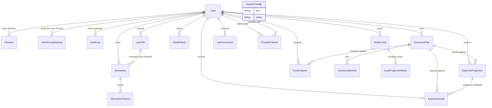
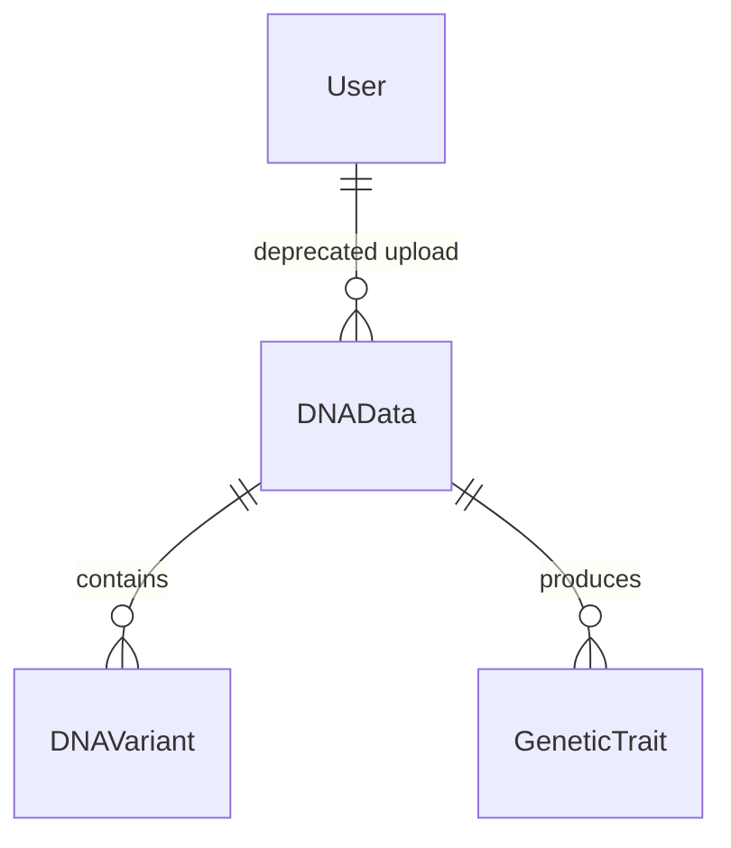

# DATA_MODEL.md

> Complete reference for the OwnMyHealth PostgreSQL database: every model, every
> field, every index, every RLS policy, every cascade rule, and the
> `withRLSContext` / `withRLSTransaction` usage matrix.

Generated: 2026-04-24. Source of truth: `backend/prisma/schema.prisma` and
`backend/prisma/migrations/**/migration.sql`.

---

## Overview

- **Active models**: 18 (User, Session, UserEncryptionKey, ProviderPatient,
  UserFile, Biomarker, BiomarkerHistory, InsurancePlan, InsuranceBenefit,
  HealthNeed, HealthGoal, GoalProgressHistory, AuditLog, SystemConfig,
  ExpenseProjection, ExpenseActual, CostAnalysis, LabConnection).
- **Deprecated models (still in schema, removed from UI)**: 3 — `DNAData`,
  `DNAVariant`, `GeneticTrait` (`backend/prisma/schema.prisma:383-435`). Per
  [`CLAUDE.md:38-41`](../CLAUDE.md) these are retained pending a dedicated
  drop migration.
- **RLS-enabled tables**: 20 (all 18 active except `user_encryption_keys`
  which is RLS-enabled too — totalling 21 including deprecated DNA tables;
  see [RLS policy catalog](#rls-policy-catalog)).
- **Encrypted columns in schema (`*Encrypted` or designated-encrypted)**: 36
  (verified with `Grep pattern:"Encrypted\s+String"` over
  `backend/prisma/schema.prisma` — 35 `*Encrypted` columns, plus
  `CostAnalysis.claudeResponse` which is encrypted despite lacking the suffix,
  see [`encryption.ts:482`](../backend/src/services/encryption.ts)).
- **Migrations on disk**: 16 (`backend/prisma/migrations/` — see
  [Migration timeline](#migration-timeline)).
- **Database**: PostgreSQL on Google Cloud SQL. Connection pool capped at
  `DATABASE_POOL_SIZE || 10` (`backend/src/services/database.ts:110`).
- **Runtime caveat**: the application currently connects as a `BYPASSRLS`
  role in dev and prod — RLS policies are structurally defined but do not
  enforce at the SQL layer until the `omh_app` `NOBYPASSRLS` role cutover
  (tracked via `RLS_ENFORCEMENT=strict`, see
  `backend/src/services/database.ts:L211-L270` and the user-memory critical
  finding for project OwnMyHealth).

---

## ER diagram (active models)



## ER diagram (deprecated DNA models)



---

## Naming conventions

- **Models**: PascalCase in Prisma (`Biomarker`), `@@map("snake_case_plural")`
  at the PostgreSQL table layer. Example: `backend/prisma/schema.prisma:175`.
- **Fields**: camelCase in Prisma, `@map("snake_case")` at the DB layer.
  Example: `userId String @map("user_id")` at `schema.prisma:142`.
- **Primary keys**: `String @id` backed by either
  `@default(dbgenerated("gen_random_uuid()")) @db.Uuid` (most models) or
  `@default(uuid()) @db.Uuid` (expense tracking + `UserFile`). No cuid in
  this schema — all IDs are UUIDs.
- **PHI columns**: suffixed `*Encrypted` and typed `String` (base64-encoded
  `iv:authTag:ciphertext`; see
  [`encryption.ts:L216-L228`](../backend/src/services/encryption.ts)).
  Exception: `CostAnalysis.claudeResponse` is encrypted but not suffixed
  (historical — flagged in
  [`_phi-inventory.md`](../prompts/_phi-inventory.md) item 3 and in
  [Encryption matrix](#encryption-matrix)).
- **Timestamps**: `createdAt` / `updatedAt` with `@db.Timestamptz(6)`;
  legacy expense tables use plain `TIMESTAMP` (see
  `schema.prisma:692-693`).

---

## Model catalog

All models listed alphabetically. Line references are into
`backend/prisma/schema.prisma`.

### AuditLog

**Table**: `audit_logs` (`@@map` at `schema.prisma:537`).
**Purpose**: immutable HIPAA audit trail for every PHI access, mutation, and
auth event. 7-year retention enforced by `cleanupOldLogs`
(`backend/src/services/auditLog.ts:L475-L503`).

| Field | Column | Type | Encrypted | Null | Index | FK |
|---|---|---|---|---|---|---|
| `id` | `id` | `String @id uuid()` | — | no | PK | — |
| `userId` | `user_id` | `String? @db.Uuid` | — | yes | yes | `User.id` (no cascade — audit survives deletion) |
| `actorType` | `actor_type` | `ActorType` enum | — | no | — | — |
| `ipAddress` | `ip_address` | `String? @db.VarChar(45)` | — | yes | — | — |
| `userAgent` | `user_agent` | `String?` | — | yes | — | — |
| `sessionId` | `session_id` | `String? @db.VarChar(100)` | — | yes | — | — |
| `action` | `action` | `AuditAction` enum | — | no | yes | — |
| `resourceType` | `resource_type` | `String @db.VarChar(100)` | — | no | yes | — |
| `resourceId` | `resource_id` | `String? @db.Uuid` | — | yes | yes | — |
| `previousValueEncrypted` | `previous_value_encrypted` | `String?` | **yes (system salt)** | yes | — | — |
| `newValueEncrypted` | `new_value_encrypted` | `String?` | **yes (system salt)** | yes | — | — |
| `metadata` | `metadata` | `String?` | — | yes | — | — |
| `success` | `success` | `Boolean @default(true)` | — | no | — | — |
| `errorMessage` | `error_message` | `String?` | — | yes | — | — |
| `createdAt` | `created_at` | `@db.Timestamptz(6)` | — | no | yes | — |

**Indexes** (`schema.prisma:L529-L536`): `user_id`, `action`,
`resource_type`, `resource_id`, `created_at ASC`, `created_at DESC`,
`(user_id, created_at DESC)` ×2.

**Relations**: `User` optional (`onDelete` omitted → default `NoAction`).
Audit rows survive user deletion — required for 7-year HIPAA retention.
The `previousValueEncrypted` / `newValueEncrypted` columns are encrypted
with the **system salt** (`config.auditSalt`) rather than a per-user salt
for exactly this reason (see
`backend/src/services/auditLog.ts:L120-L127` and
[`_phi-inventory.md` item 4](../prompts/_phi-inventory.md)).

**RLS**: yes — `audit_logs_select`, `audit_logs_insert`,
`audit_logs_delete`. No UPDATE policy → updates denied by default (logs are
immutable). See [RLS policy catalog](#audit-logs-rls).

### Biomarker

**Table**: `biomarkers` (`schema.prisma:175`).
**Purpose**: one measured biomarker reading tied to a user (value + unit +
normal range + measurement date).

| Field | Column | Type | Encrypted | Null | Index | FK |
|---|---|---|---|---|---|---|
| `id` | `id` | `String @id uuid()` | — | no | PK | — |
| `userId` | `user_id` | `String @db.Uuid` | — | no | yes | `User.id` Cascade |
| `category` | `category` | `@db.VarChar(100)` | — | no | — | — |
| `name` | `name` | `@db.VarChar(200)` | — | no | — | — |
| `unit` | `unit` | `@db.VarChar(50)` | — | no | — | — |
| `valueEncrypted` | `value_encrypted` | `String` | **yes** | no | — | — |
| `notesEncrypted` | `notes_encrypted` | `String?` | **yes** | yes | — | — |
| `normalRangeMin` | `normal_range_min` | `Decimal(10,4)` | — | no | — | — |
| `normalRangeMax` | `normal_range_max` | `Decimal(10,4)` | — | no | — | — |
| `normalRangeSource` | `normal_range_source` | `@db.VarChar(200)` | — | yes | — | — |
| `measurementDate` | `measurement_date` | `@db.Date` | — | no | yes | — |
| `sourceType` | `source_type` | `DataSourceType` enum | — | no | — | — |
| `sourceFile` | `source_file` | `@db.VarChar(255)` | — | yes | — | — |
| `extractionConfidence` | `extraction_confidence` | `Decimal(3,2)` | — | yes | — | — |
| `labName` | `lab_name` | `@db.VarChar(200)` | — | yes | — | — |
| `isOutOfRange` | `is_out_of_range` | `Boolean` | — | no | yes | — |
| `isAcknowledged` | `is_acknowledged` | `Boolean` | — | no | — | — |
| `userFileId` | `user_file_id` | `@db.Uuid` | — | yes | yes | `UserFile.id` default (no cascade → SetNull via migration, see `20260108000000_add_user_files_table/migration.sql:34`) |

**Indexes** (`schema.prisma:L165-L174`): `user_id`, `(user_id, category)`,
`measurement_date`, `is_out_of_range`, `user_file_id`,
`(user_id, category, measurement_date DESC)` ×2 (one with alias
`biomarkers_user_category_date_idx`), `(user_id, created_at)`,
`(user_id, is_out_of_range)`, `(user_id, source_type)`.

**Relations**: `User` Cascade; `UserFile` nullable (SetNull at SQL layer);
`BiomarkerHistory[]` — history rows Cascade-deleted with the biomarker.

**RLS**: yes — `biomarkers_select`, `biomarkers_insert_own`,
`biomarkers_update`, `biomarkers_delete_own`. SELECT/UPDATE permit both owner
and consented provider (`has_provider_access(user_id, 'view_biomarkers'|'edit')`).
See [RLS policy catalog](#biomarkers-rls).

### BiomarkerHistory

**Table**: `biomarker_history` (`schema.prisma:188`).
**Purpose**: append-only value history for a given `Biomarker`; trend charts
query this.

| Field | Column | Type | Encrypted | Null | Index | FK |
|---|---|---|---|---|---|---|
| `id` | `id` | `String @id uuid()` | — | no | PK | — |
| `biomarkerId` | `biomarker_id` | `@db.Uuid` | — | no | yes | `Biomarker.id` Cascade |
| `valueEncrypted` | `value_encrypted` | `String` | **yes** | no | — | — |
| `measurementDate` | `measurement_date` | `@db.Date` | — | no | yes | — |
| `createdAt` | `created_at` | `@db.Timestamptz(6)` | — | no | — | — |

**Relations**: `Biomarker` Cascade.

**RLS**: yes — policies defer to parent `biomarkers` (existential subquery).
See [`biomarker_history_*` policies](#biomarker-history-rls).

**Note**: intentionally has **no** `notesEncrypted` column (per
[`_phi-inventory.md`](../prompts/_phi-inventory.md) and
`encryption.ts:L427-L429`).

### CostAnalysis

**Table**: `cost_analyses` (`schema.prisma:748`).
**Purpose**: AI-generated cost-optimization analysis for a given user+plan.

| Field | Column | Type | Encrypted | Null | Index | FK |
|---|---|---|---|---|---|---|
| `id` | `id` | `String @id uuid()` | — | no | PK | — |
| `userId` | `user_id` | `@db.Uuid` | — | no | yes (composite) | `User.id` Cascade |
| `planId` | `plan_id` | `@db.Uuid` | — | no | yes (composite) | `InsurancePlan.id` Cascade |
| `analysisDate` | `analysis_date` | `DateTime @default(now())` | — | no | yes | — |
| `claudeResponse` | `claude_response` | `String @db.Text` | **yes** (no suffix) | no | — | — |
| `totalProjectedOopEncrypted` | `total_projected_oop` | `String? @db.Text` | **yes** | yes | — | — |
| `deductibleMetMonth` | `deductible_met_month` | `Int?` | — | yes | — | — |
| `projectedExpensesSnapshotEncrypted` | `projected_expenses_snapshot` | `String? @db.Text` | **yes** | yes | — | — |

**Indexes**: `(user_id, plan_id)`, `analysis_date`
(`schema.prisma:L746-L747`).

**Relations**: `User` Cascade; `InsurancePlan` Cascade.

**RLS**: yes — `cost_analyses_user_policy` (FOR ALL). See
[RLS policy catalog](#expense-and-analysis-rls).

**Drift note**: `claudeResponse` is encrypted (listed in `PHI_FIELDS` at
`encryption.ts:482`) but does not carry the `*Encrypted` suffix. Flagged;
no rename planned — would require data-migration risk without benefit.

### DNAData (deprecated)

**Table**: `dna_data` (`schema.prisma:399`). Purpose: historical upload
metadata for 23andMe/AncestryDNA imports. Feature removed from UI per
[`CLAUDE.md:38-41`](../CLAUDE.md). Relations: `User` Cascade,
`DNAVariant[]` Cascade, `GeneticTrait[]` Cascade. RLS enabled (see
[DNA policies](#dna-rls)).

### DNAVariant (deprecated)

**Table**: `dna_variants` (`schema.prisma:414`). Single PHI column:
`genotypeEncrypted` (`schema.prisma:408`). Relations: `DNAData` Cascade.
RLS enabled via parent `dna_data`.

### GeneticTrait (deprecated)

**Table**: `genetic_traits` (`schema.prisma:434`). PHI columns:
`descriptionEncrypted`, `recommendationsEncrypted`
(`schema.prisma:L424-L425`). Relations: `DNAData` Cascade. RLS enabled.

### ExpenseActual

**Table**: `expense_actuals` (`schema.prisma:729`).
**Purpose**: real claims/EOBs; denormalized per-service amounts, every
monetary field encrypted.

| Field | Column | Type | Encrypted | Null | FK |
|---|---|---|---|---|---|
| `id` | `id` | `String @id uuid()` | — | no | — |
| `userId` | `user_id` | `@db.Uuid` | — | no | `User.id` Cascade |
| `planId` | `plan_id` | `@db.Uuid` | — | no | `InsurancePlan.id` Cascade |
| `projectionId` | `projection_id` | `@db.Uuid` | — | yes | `ExpenseProjection.id` SetNull |
| `serviceTypeEncrypted` | `service_type` | `@db.Text` | **yes** | no | — |
| `providerNameEncrypted` | `provider_name` | `@db.Text` | **yes** | yes | — |
| `dateOfService` | `date_of_service` | `@db.Date` | — | yes | — |
| `billedAmountEncrypted` | `billed_amount` | `@db.Text` | **yes** | yes | — |
| `insurancePaidEncrypted` | `insurance_paid` | `@db.Text` | **yes** | yes | — |
| `patientPaidEncrypted` | `patient_paid` | `@db.Text` | **yes** | yes | — |
| `appliedToDeductibleEncrypted` | `applied_to_deductible` | `@db.Text` | **yes** | yes | — |
| `appliedToOopEncrypted` | `applied_to_oop` | `@db.Text` | **yes** | yes | — |
| `claimStatus` | `claim_status` | `String` | — | no | — |
| `isInNetwork` | `is_in_network` | `Boolean?` | — | yes | — |
| `notesEncrypted` | `notes` | `@db.Text` | **yes** | yes | — |

**Indexes** (`schema.prisma:L727-L728`): `(user_id, plan_id)`,
`date_of_service`.

**Relations**: `User` Cascade; `InsurancePlan` Cascade;
`ExpenseProjection?` SetNull (deleting a projection un-links its actuals
but preserves the claim record).

**RLS**: yes — `expense_actuals_user_policy` (FOR ALL).

**Type history**: columns were originally `DECIMAL(10,2)` / `JSONB` in
`20260111_add_expense_tracking`; migrated to `TEXT` in
`20260206_fix_expense_encryption_types` so the columns can hold ciphertext.

### ExpenseProjection

**Table**: `expense_projections` (`schema.prisma:701`).
**Purpose**: user-entered forecasts of future medical expenses under a
given plan.

| Field | Column | Type | Encrypted | Null | FK |
|---|---|---|---|---|---|
| `id` | `id` | `String @id uuid()` | — | no | — |
| `userId` | `user_id` | `@db.Uuid` | — | no | `User.id` Cascade |
| `planId` | `plan_id` | `@db.Uuid` | — | no | `InsurancePlan.id` Cascade |
| `serviceTypeEncrypted` | `service_type` | `@db.Text` | **yes** | no | — |
| `estimatedCostEncrypted` | `estimated_cost` | `@db.Text` | **yes** | no | — |
| `frequencyPerYear` | `frequency_per_year` | `Int @default(1)` | — | no | — |
| `isInNetwork` | `is_in_network` | `Boolean @default(true)` | — | no | — |
| `notesEncrypted` | `notes` | `@db.Text` | **yes** | yes | — |
| `projectionDate` | `projection_date` | `@db.Date` | — | no | — |

**Indexes**: `(user_id, plan_id)`, `created_at`.

**Relations**: `User` Cascade; `InsurancePlan` Cascade; `ExpenseActual[]`
(via `projection_id`, SetNull).

**RLS**: yes — `expense_projections_user_policy`.

### GoalProgressHistory

**Table**: `goal_progress_history` (`schema.prisma:508`).
**Purpose**: append-only progress entries for `HealthGoal`.

| Field | Column | Type | Encrypted | Null | FK |
|---|---|---|---|---|---|
| `id` | `id` | uuid | — | no | — |
| `goalId` | `goal_id` | `@db.Uuid` | — | no | `HealthGoal.id` Cascade |
| `value` | `value` | `Decimal(10,4)` | — | no | — |
| `progress` | `progress` | `Decimal(5,2)` | — | no | — |
| `noteEncrypted` | `note_encrypted` | `String?` | **yes** | yes | — |
| `recordedAt` | `recorded_at` | `@db.Timestamptz(6)` | — | no | yes |

**Indexes**: `goal_id`, `recorded_at`.

**RLS**: yes — `goal_progress_history_*` (deferred to parent goal).

### HealthGoal

**Table**: `health_goals` (`schema.prisma:494`).
**Purpose**: numeric health goals (weight, A1c, etc.) with target and
progress tracking.

| Field | Column | Type | Encrypted | Null |
|---|---|---|---|---|
| `id` | `id` | uuid | — | no |
| `userId` | `user_id` | `@db.Uuid` | — | no |
| `name` | `name` | `@db.VarChar(200)` | — | no |
| `descriptionEncrypted` | `description_encrypted` | `String?` | **yes** | yes |
| `category` | `category` | `@db.VarChar(100)` | — | no |
| `targetValue` | `target_value` | `Decimal(10,4)` | — | no (legacy plaintext) |
| `targetValueEncrypted` | `target_value_encrypted` | `String?` | **yes** | yes (new column — `20260420_encrypt_health_goal_target`) |
| `currentValue` | `current_value` | `Decimal(10,4)` | — | yes |
| `startValue` | `start_value` | `Decimal(10,4)` | — | yes |
| `unit` | `unit` | `@db.VarChar(50)` | — | no |
| `direction` | `direction` | `GoalDirection` enum | — | no |
| `relatedBiomarkerId` | `related_biomarker_id` | `@db.Uuid` | — | yes |
| `startDate`, `targetDate` | `start_date`, `target_date` | `@db.Date` | — | no |
| `status` | `status` | `GoalStatus` enum | — | no |
| `progress` | `progress` | `Decimal(5,2)` | — | no |
| `milestones` | `milestones` | `String?` | — | yes |
| `reminderFrequency` | `reminder_frequency` | `ReminderFrequency?` enum | — | yes |

**Indexes** (`schema.prisma:L488-L493`): `user_id`, `status`, `category`,
`target_date`, `(user_id, status, target_date)` ×2 (one with alias
`health_goals_user_status_target_idx`).

**Relations**: `User` Cascade; `GoalProgressHistory[]` Cascade.

**RLS**: yes — `health_goals_*`. SELECT permits providers with
`view_health_needs`. See [policy catalog](#health-goals-rls).

**Drift note**: `targetValue` (plaintext Decimal) is kept for
backward-compat reads until every row is re-encrypted to
`targetValueEncrypted`. See inline comment at `schema.prisma:L464-L469`.

### HealthNeed

**Table**: `health_needs` (`schema.prisma:455`).
**Purpose**: tracked health tasks/conditions/services/follow-ups with urgency
and status.

| Field | Column | Type | Encrypted | Null |
|---|---|---|---|---|
| `id` | `id` | uuid | — | no |
| `userId` | `user_id` | `@db.Uuid` | — | no |
| `needType` | `need_type` | `HealthNeedType` enum | — | no |
| `name` | `name` | `@db.VarChar(200)` | — | no |
| `descriptionEncrypted` | `description_encrypted` | `String` | **yes** | no |
| `urgency` | `urgency` | `Urgency` enum | — | no |
| `status` | `status` | `HealthNeedStatus` enum | — | no |
| `relatedBiomarkerIds` | `related_biomarker_ids` | `String[] @db.Uuid` | — | no |
| `resolvedAt` | `resolved_at` | `@db.Timestamptz(6)` | — | yes |

**Indexes**: `user_id`, `status`, `urgency`.

**RLS**: yes — `health_needs_*`. UPDATE permits provider `edit`.

### InsuranceBenefit

**Table**: `insurance_benefits` (`schema.prisma:381`).
**Purpose**: per-service covered-or-not rows extracted from SBC / plan
schedule (in-network + out-of-network cost-share per service).

| Field | Column | Type | Null | FK |
|---|---|---|---|---|
| `id` | `id` | uuid | no | — |
| `planId` | `plan_id` | `@db.Uuid` | no | `InsurancePlan.id` Cascade |
| `serviceName` | `service_name` | `@db.VarChar(300)` | no | — |
| `serviceCategory` | `service_category` | `@db.VarChar(100)` | no | — |
| `inNetworkCovered` | `in_network_covered` | Boolean | no | — |
| `inNetworkCopay` | `in_network_copay` | `Decimal(10,2)` | yes | — |
| `inNetworkCoinsurance` | `in_network_coinsurance` | `Decimal(5,2)` | yes | — |
| `inNetworkDeductible` | `in_network_deductible_applies` | Boolean | no | — |
| `outNetworkCovered` | `out_network_covered` | Boolean | no | — |
| `outNetworkCopay`, `outNetworkCoinsurance`, `outNetworkDeductible` | (analogous) | | | — |
| `limitations` | `limitations` | String? | yes | — |
| `preAuthRequired` | `pre_auth_required` | Boolean | no | — |

**Indexes**: `plan_id`, `service_category` (`schema.prisma:L378-L379`).

**RLS**: yes — defer to parent `insurance_plans` (EXISTS subquery).

### InsurancePlan

**Table**: `insurance_plans` (`schema.prisma:358`).
**Purpose**: a user's health insurance plan with full cost-share structure
(deductibles, OOP max, copays, coinsurance, Rx tiers, dental/vision, DME,
home-health, hospice, therapy limits, preventive services, exclusions). The
widest model in the schema by far.

| Notable field | Column | Type | Encrypted |
|---|---|---|---|
| `memberIdEncrypted` | `member_id_encrypted` | String? | **yes** |
| `groupIdEncrypted` | `group_id_encrypted` | String? | **yes** |
| All monetary fields (`deductible_*`, `oop_*`, `copay_*`, `coinsurance_*`, `rx_*`, `vision_*`, `dental_*`, etc.) | (snake_case) | `Decimal(10,2)` or `Decimal(5,2)` | — (not PHI — plan metadata) |
| `preventiveServicesList`, `exclusionsList`, `priorAuthRequirements`, `servicesWithLimits` | JSON arrays stored as `@db.Text` | Text | — |
| `extractedFromSbc` | `extracted_from_sbc` | Boolean | — |
| `sbcExtractionConfidence` | `sbc_extraction_confidence` | `Decimal(3,2)` | — |
| `isActive`, `isPrimary` | | Boolean | — |

See `schema.prisma:L191-L357` for the full field list (~100 columns).

**Indexes** (`schema.prisma:L353-L356`): `user_id`, `is_active`,
`(user_id, is_active, is_primary DESC)` ×2 (one aliased
`insurance_plans_user_active_primary_idx`).

**Relations**: `User` Cascade; `InsuranceBenefit[]` Cascade;
`ExpenseProjection[]`, `ExpenseActual[]`, `CostAnalysis[]` all Cascade.

**RLS**: yes — `insurance_plans_*`. SELECT permits providers with
`view_insurance`.

### LabConnection

**Table**: `lab_connections` (`schema.prisma:778`).
**Purpose**: SMART-on-FHIR OAuth token set + sync state for
Quest/Labcorp/etc. imports.

| Field | Column | Type | Encrypted | Null |
|---|---|---|---|---|
| `id` | `id` | uuid | — | no |
| `userId` | `user_id` | `@db.Uuid` | — | no |
| `provider` | `provider` | `@db.VarChar(50)` | — | no |
| `fhirPatientId` | `fhir_patient_id` | `@db.VarChar(255)` | — | yes |
| `accessTokenEncrypted` | `access_token_encrypted` | String | **yes** | no |
| `refreshTokenEncrypted` | `refresh_token_encrypted` | String? | **yes** | yes |
| `tokenExpiresAt` | `token_expires_at` | `@db.Timestamptz(6)` | — | yes |
| `scopeGranted` | `scope_granted` | String? | — | yes |
| `connectedAt` | `connected_at` | `@db.Timestamptz(6)` | — | no |
| `lastSyncAt` | `last_sync_at` | `@db.Timestamptz(6)` | — | yes |
| `syncStatus` | `sync_status` | `@db.VarChar(20)` default `'idle'` | — | no |
| `syncError` | `sync_error` | String? | — | yes |
| `lastImportedCount` | `last_imported_count` | `Int default 0` | — | no |
| `isActive` | `is_active` | Boolean | — | no |

**Indexes**: `@@unique([userId, provider])`, `user_id`
(`schema.prisma:L776-L777`).

**Relations**: `User` Cascade.

**RLS**: yes — `lab_connections_*` (Jan 2026 migration
`20260418_add_lab_connections`).

### ProviderPatient

**Table**: `provider_patients` (`schema.prisma:116`).
**Purpose**: consent-gated link between a `PROVIDER`-role user and a
`PATIENT`-role user with per-category permissions and an optional expiry.

| Field | Column | Type | Encrypted | Null | FK |
|---|---|---|---|---|---|
| `id` | `id` | uuid | — | no | — |
| `providerId` | `provider_id` | `@db.Uuid` | — | no | `User.id` Cascade (named relation "ProviderUser") |
| `patientId` | `patient_id` | `@db.Uuid` | — | no | `User.id` Cascade (named relation "PatientUser") |
| `canViewBiomarkers` | `can_view_biomarkers` | Boolean default `true` | — | no | — |
| `canViewInsurance` | `can_view_insurance` | Boolean default `false` | — | no | — |
| `canViewDna` | `can_view_dna` | Boolean default `false` | — | no | — |
| `canViewHealthNeeds` | `can_view_health_needs` | Boolean default `true` | — | no | — |
| `canEditData` | `can_edit_data` | Boolean default `false` | — | no | — |
| `relationshipType` | `relationship_type` | `ProviderRelationType` enum | — | no | — |
| `status` | `status` | `ProviderPatientStatus` enum | — | no | yes | — |
| `consentGrantedAt` | `consent_granted_at` | `@db.Timestamptz(6)` | — | yes | — | — |
| `consentExpiresAt` | `consent_expires_at` | `@db.Timestamptz(6)` | — | yes | — | — |
| `notesEncrypted` | `notes_encrypted` | String? | **yes** | yes | — | — |

**Indexes** (`schema.prisma:L111-L114`): `@@unique(provider_id, patient_id)`,
`provider_id`, `patient_id`, `status`.

**Relations**: **both** sides Cascade — deleting a provider OR a patient
removes the relationship row. This is deliberate (consent is no longer
meaningful once either party is gone) but it means `ProviderPatient` has
two Cascade paths into `User`.

**RLS**: yes — `provider_patients_*`. SELECT/UPDATE/DELETE permit either
side; INSERT permits only the provider to initiate.

### Session

**Table**: `sessions` (`schema.prisma:73`).
**Purpose**: DB-backed refresh-token session records.

| Field | Column | Type | Null |
|---|---|---|---|
| `id` | `id` | uuid | no |
| `userId` | `user_id` | `@db.Uuid` | no |
| `token` | `token` | `@unique @db.VarChar(500)` | no |
| `ipAddress` | `ip_address` | `@db.VarChar(45)` | yes |
| `userAgent` | `user_agent` | String | yes |
| `expiresAt` | `expires_at` | `@db.Timestamptz(6)` | no |
| `createdAt` | `created_at` | `@db.Timestamptz(6)` | no |

**Indexes**: `user_id`, `token` (unique), `expires_at`.

**Relations**: `User` Cascade.

**RLS**: yes — `sessions_select_own`, `sessions_insert_own`,
`sessions_delete_own`. No UPDATE policy → updates denied.

### SystemConfig

**Table**: `system_config` (`schema.prisma:552`).
**Purpose**: admin-only key/value config (e.g., feature flags, historical
audit-salt location pre-2026-04-16 — see
`backend/src/services/auditLog.ts:L113-L127`).

| Field | Column | Type | Null |
|---|---|---|---|
| `id` | `id` | uuid | no |
| `key` | `key` | `@unique @db.VarChar(100)` | no |
| `value` | `value` | String | no |
| `valueType` | `value_type` | `@db.VarChar(50) default 'string'` | no |
| `description` | `description` | String? | yes |
| `isEncrypted` | `is_encrypted` | Boolean | no |
| `updatedBy` | `updated_by` | `@db.Uuid` | yes |

**RLS**: yes — all four policies gated on `is_admin_session()`
(`20260107_add_rls_policies/migration.sql:L537-L551`).

### User

**Table**: `users` (`schema.prisma:57`).
**Purpose**: root account record; owns everything else in the system.

| Field | Column | Type | Encrypted | Null |
|---|---|---|---|---|
| `id` | `id` | uuid | — | no |
| `email` | `email` | `@unique @db.VarChar(255)` | — | no |
| `passwordHash` | `password_hash` | `@db.VarChar(255)` | — | no |
| `firstNameEncrypted` | `first_name_encrypted` | String? | **yes** | yes |
| `lastNameEncrypted` | `last_name_encrypted` | String? | **yes** | yes |
| `dateOfBirthEncrypted` | `date_of_birth_encrypted` | String? | **yes** | yes |
| `phoneEncrypted` | `phone_encrypted` | String? | **yes** | yes |
| `addressEncrypted` | `address_encrypted` | String? | **yes** | yes |
| `emailVerified` | `email_verified` | Boolean | — | no |
| `emailVerificationToken` | `email_verification_token` | `@unique @db.VarChar(255)` | — | yes |
| `emailVerificationExpires` | `email_verification_expires` | `@db.Timestamptz(6)` | — | yes |
| `passwordResetToken` | `password_reset_token` | `@unique @db.VarChar(255)` | — | yes |
| `passwordResetExpires` | `password_reset_expires` | `@db.Timestamptz(6)` | — | yes |
| `isActive` | `is_active` | Boolean | — | no |
| `role` | `role` | `UserRole` enum | — | no |
| `failedLoginAttempts` | `failed_login_attempts` | `Int default 0` | — | no |
| `lockedUntil` | `locked_until` | `@db.Timestamptz(6)` | — | yes |
| `lastFailedLogin` | `last_failed_login` | `@db.Timestamptz(6)` | — | yes |
| `notificationPreferences` | `notification_preferences` | `Json default "{}"` | — | no |
| `healthProfileEncrypted` | `health_profile_encrypted` | String? | **yes** | yes |
| `plan` | `plan` | `@db.VarChar(20) default 'FREE'` | — | no |
| `planExpiresAt`, `planUpdatedAt` | | `@db.Timestamptz(6)` | — | yes |
| `onboardingCompletedAt` | `onboarding_completed_at` | `@db.Timestamptz(6)` | — | yes |
| `createdAt`, `updatedAt`, `lastLoginAt` | | `@db.Timestamptz(6)` | — | varies |

**Indexes**: `email`, `created_at` (`schema.prisma:L54-L55`).

**Relations (children)**: `Session`, `UserEncryptionKey`, `Biomarker`,
`InsurancePlan`, `ProviderPatient` (×2), `UserFile`, `HealthGoal`,
`HealthNeed`, `AuditLog` (no-cascade), `DNAData`, `ExpenseProjection`,
`ExpenseActual`, `CostAnalysis`, `LabConnection` — all Cascade except
`AuditLog` (survives deletion). See [Cascade table](#cascade-behavior).

**RLS**: yes — `users_select_own`, `users_update_own`,
`users_insert_system`, `users_delete_admin`. Only admin can DELETE;
registration bypasses RLS via `current_user_id() IS NULL` clause.

### UserEncryptionKey

**Table**: `user_encryption_keys` (`schema.prisma:91`).
**Purpose**: per-user PHI encryption salt, wrapped (encrypted) with the
master key. Backs the PBKDF2-SHA512 per-user key derivation in
[`encryption.ts:L193-L201`](../backend/src/services/encryption.ts) and
[`userEncryption.ts:L29-L72`](../backend/src/services/userEncryption.ts).

| Field | Column | Type | Null |
|---|---|---|---|
| `id` | `id` | uuid | no |
| `userId` | `user_id` | `@db.Uuid` | no |
| `keyType` | `key_type` | `@db.VarChar(50)` | no (always `'phi_encryption'`) |
| `keyHash` | `key_hash` | `@db.VarChar(255)` | no |
| `encryptedKey` | `encrypted_key` | String | no (ciphertext of the salt under master key) |
| `version` | `version` | `Int default 1` | no |
| `isActive` | `is_active` | Boolean | no |
| `createdAt` | `created_at` | `@db.Timestamptz(6)` | no |
| `rotatedAt` | `rotated_at` | `@db.Timestamptz(6)` | yes |

**Indexes**: `@@unique(user_id, key_type, version)`, `user_id`
(`schema.prisma:L87-L88`).

**Relations**: `User` Cascade. **This is the single PHI wrap-key holder** —
deletion of a user permanently destroys their PHI decryption key.

**RLS**: yes — `user_encryption_keys_*` (`20260107_add_rls_policies/migration.sql:L134-L144`).

### UserFile

**Table**: `user_files` (`schema.prisma:138`).
**Purpose**: metadata for uploaded lab PDFs / SBC documents (GCS
`storage_key`, filename, extraction confidence, count of biomarkers parsed).

| Field | Column | Type | Null |
|---|---|---|---|
| `id` | `id` | uuid | no |
| `userId` | `user_id` | `@db.Uuid` | no |
| `filename` | `filename` | `@db.VarChar(255)` | no |
| `originalFilename` | `original_filename` | `@db.VarChar(255)` | no |
| `fileType` | `file_type` | `@db.VarChar(50)` | no |
| `fileSize` | `file_size` | Int | no |
| `storageKey` | `storage_key` | `@db.VarChar(500)` | no |
| `labName`, `labDate` | | `@db.VarChar(255)` / `@db.Date` | yes |
| `biomarkersExtracted` | `biomarkers_extracted` | `Int default 0` | no |
| `extractionConfidence` | `extraction_confidence` | `Decimal(3,2)` | yes |

**Indexes**: `user_id`, `lab_date` (`schema.prisma:L135-L136`).

**Relations**: `User` Cascade; `Biomarker[]` (FK on child, SetNull on
delete per `20260108000000_add_user_files_table/migration.sql:34`).

**RLS**: yes — `user_files_{select,insert,update,delete}_policy`
(`20260108000000_add_user_files_table/migration.sql:L37-L66`).

---

## Encryption matrix

Cross-reference of `backend/src/services/encryption.ts` `PHI_FIELDS`
(`encryption.ts:L411-L492`) against schema `*Encrypted` columns
(Grep results at `schema.prisma` lines listed).

| Model.Field | In `PHI_FIELDS`? | In schema? | Schema line | Reader / Writer |
|---|---|---|---|---|
| `User.firstNameEncrypted` | yes (`encryption.ts:414`) | yes | `schema.prisma:14` | `settingsController`, `authService` |
| `User.lastNameEncrypted` | yes (`encryption.ts:415`) | yes | `schema.prisma:15` | same |
| `User.dateOfBirthEncrypted` | yes (`encryption.ts:416`) | yes | `schema.prisma:16` | same |
| `User.phoneEncrypted` | yes (`encryption.ts:417`) | yes | `schema.prisma:17` | same |
| `User.addressEncrypted` | yes (`encryption.ts:418`) | yes | `schema.prisma:18` | same |
| `User.healthProfileEncrypted` | yes (`encryption.ts:419`) | yes | `schema.prisma:30` | `healthProfileService.ts:L59,L104` |
| `Biomarker.valueEncrypted` | yes (`encryption.ts:423`) | yes | `schema.prisma:146` | `biomarkerController.ts:*` |
| `Biomarker.notesEncrypted` | yes (`encryption.ts:424`) | yes | `schema.prisma:147` | same |
| `BiomarkerHistory.valueEncrypted` | yes (`encryption.ts:427`) | yes | `schema.prisma:181` | `biomarkerController.ts`, `labUploadController.ts` |
| `InsurancePlan.memberIdEncrypted` | yes (`encryption.ts:432`) | yes | `schema.prisma:198` | `insuranceController.ts:*` |
| `InsurancePlan.groupIdEncrypted` | yes (`encryption.ts:433`) | yes | `schema.prisma:199` | same |
| `ProviderPatient.notesEncrypted` | yes (`encryption.ts:437`) | yes | `schema.prisma:105` | `providerRoutes.ts`, `patientRoutes.ts` |
| `DNAVariant.genotypeEncrypted` | yes (`encryption.ts:441`) | yes | `schema.prisma:408` | (deprecated) |
| `GeneticTrait.descriptionEncrypted` | yes (`encryption.ts:444`) | yes | `schema.prisma:424` | (deprecated) |
| `GeneticTrait.recommendationsEncrypted` | yes (`encryption.ts:445`) | yes | `schema.prisma:425` | (deprecated) |
| `HealthNeed.descriptionEncrypted` | yes (`encryption.ts:449`) | yes | `schema.prisma:442` | `healthNeedsController.ts` |
| `HealthGoal.descriptionEncrypted` | yes (`encryption.ts:454`) | yes | `schema.prisma:461` | `healthGoalsController.ts` |
| `HealthGoal.targetValueEncrypted` | yes (`encryption.ts:455`) | yes | `schema.prisma:469` | same |
| `GoalProgressHistory.noteEncrypted` | yes (`encryption.ts:458`) | yes | `schema.prisma:502` | same |
| `AuditLog.previousValueEncrypted` | yes (`encryption.ts:462`) | yes | `schema.prisma:521` | `auditLog.ts:L188-L199` (system salt) |
| `AuditLog.newValueEncrypted` | yes (`encryption.ts:463`) | yes | `schema.prisma:522` | same |
| `ExpenseProjection.serviceTypeEncrypted` | yes (`encryption.ts:467`) | yes | `schema.prisma:686` | `expenseController.ts` |
| `ExpenseProjection.estimatedCostEncrypted` | yes (`encryption.ts:468`) | yes | `schema.prisma:687` | same |
| `ExpenseProjection.notesEncrypted` | yes (`encryption.ts:469`) | yes | `schema.prisma:690` | same |
| `ExpenseActual.serviceTypeEncrypted` | yes (`encryption.ts:472`) | yes | `schema.prisma:709` | same |
| `ExpenseActual.providerNameEncrypted` | yes (`encryption.ts:473`) | yes | `schema.prisma:710` | same |
| `ExpenseActual.billedAmountEncrypted` | yes (`encryption.ts:474`) | yes | `schema.prisma:712` | same |
| `ExpenseActual.insurancePaidEncrypted` | yes (`encryption.ts:475`) | yes | `schema.prisma:713` | same |
| `ExpenseActual.patientPaidEncrypted` | yes (`encryption.ts:476`) | yes | `schema.prisma:714` | same |
| `ExpenseActual.appliedToDeductibleEncrypted` | yes (`encryption.ts:477`) | yes | `schema.prisma:715` | same |
| `ExpenseActual.appliedToOopEncrypted` | yes (`encryption.ts:478`) | yes | `schema.prisma:716` | same |
| `ExpenseActual.notesEncrypted` | yes (`encryption.ts:479`) | yes | `schema.prisma:719` | same |
| `CostAnalysis.claudeResponse` (no suffix) | yes (`encryption.ts:482`) | yes (plain `claudeResponse`) | `schema.prisma:737` | `expenseController.ts:L715` |
| `CostAnalysis.totalProjectedOopEncrypted` | yes (`encryption.ts:483`) | yes | `schema.prisma:738` | same |
| `CostAnalysis.projectedExpensesSnapshotEncrypted` | yes (`encryption.ts:484`) | yes | `schema.prisma:740` | same |
| `LabConnection.accessTokenEncrypted` | yes (`encryption.ts:488`) | yes | `schema.prisma:763` | `fhirController.ts`, `labSyncService.ts` |
| `LabConnection.refreshTokenEncrypted` | yes (`encryption.ts:489`) | yes | `schema.prisma:764` | same |

**Drift check**: no drift. Every `*Encrypted` column returned by
`Grep pattern:"Encrypted\s+String"` matches a key in `PHI_FIELDS`.
`CostAnalysis.claudeResponse` is the one non-suffixed encrypted column and
is explicitly listed.

**Keying note**: all fields use per-user salt derivation
(`getUserEncryptionSalt`, `userEncryption.ts:29`) **except**
`AuditLog.{previousValueEncrypted,newValueEncrypted}` which use the system
salt (`config.auditSalt`, `auditLog.ts:L188-L199`) so audit rows remain
decipherable after a user's per-user key row is Cascade-destroyed.

---

## RLS policy catalog

All policy text below is quoted verbatim from migration SQL.

### Helper functions

```sql
-- Source: backend/prisma/migrations/20260107_add_rls_policies/migration.sql:L16-L25
CREATE OR REPLACE FUNCTION current_user_id()
RETURNS uuid AS $$
BEGIN
  RETURN NULLIF(current_setting('app.current_user_id', true), '')::uuid;
EXCEPTION
  WHEN OTHERS THEN
    RETURN NULL;
END;
$$ LANGUAGE plpgsql STABLE SECURITY DEFINER;
```

```sql
-- Source: backend/prisma/migrations/20260107_add_rls_policies/migration.sql:L27-L36
CREATE OR REPLACE FUNCTION is_admin_session()
RETURNS boolean AS $$
BEGIN
  RETURN COALESCE(current_setting('app.is_admin', true), 'false')::boolean;
EXCEPTION
  WHEN OTHERS THEN
    RETURN false;
END;
$$ LANGUAGE plpgsql STABLE SECURITY DEFINER;
```

```sql
-- Source: backend/prisma/migrations/20260107_add_rls_policies/migration.sql:L38-L62
CREATE OR REPLACE FUNCTION has_provider_access(patient_user_id uuid, permission_type text DEFAULT 'view')
RETURNS boolean AS $$
DECLARE
  has_access boolean;
BEGIN
  SELECT EXISTS (
    SELECT 1 FROM provider_patients pp
    WHERE pp.provider_id = current_user_id()
      AND pp.patient_id = patient_user_id
      AND pp.status = 'ACTIVE'
      AND (pp.consent_expires_at IS NULL OR pp.consent_expires_at > NOW())
      AND CASE permission_type
        WHEN 'view_biomarkers' THEN pp.can_view_biomarkers
        WHEN 'view_insurance' THEN pp.can_view_insurance
        WHEN 'view_dna' THEN pp.can_view_dna
        WHEN 'view_health_needs' THEN pp.can_view_health_needs
        WHEN 'edit' THEN pp.can_edit_data
        ELSE pp.can_view_biomarkers -- Default to basic view
      END
  ) INTO has_access;

  RETURN COALESCE(has_access, false);
END;
$$ LANGUAGE plpgsql STABLE SECURITY DEFINER;
```

### RLS-enabled tables

```sql
-- Source: backend/prisma/migrations/20260107_add_rls_policies/migration.sql:L68-L83
ALTER TABLE users ENABLE ROW LEVEL SECURITY;
ALTER TABLE sessions ENABLE ROW LEVEL SECURITY;
ALTER TABLE user_encryption_keys ENABLE ROW LEVEL SECURITY;
ALTER TABLE biomarkers ENABLE ROW LEVEL SECURITY;
ALTER TABLE biomarker_history ENABLE ROW LEVEL SECURITY;
ALTER TABLE insurance_plans ENABLE ROW LEVEL SECURITY;
ALTER TABLE insurance_benefits ENABLE ROW LEVEL SECURITY;
ALTER TABLE dna_data ENABLE ROW LEVEL SECURITY;
ALTER TABLE dna_variants ENABLE ROW LEVEL SECURITY;
ALTER TABLE genetic_traits ENABLE ROW LEVEL SECURITY;
ALTER TABLE health_needs ENABLE ROW LEVEL SECURITY;
ALTER TABLE health_goals ENABLE ROW LEVEL SECURITY;
ALTER TABLE goal_progress_history ENABLE ROW LEVEL SECURITY;
ALTER TABLE provider_patients ENABLE ROW LEVEL SECURITY;
ALTER TABLE audit_logs ENABLE ROW LEVEL SECURITY;
ALTER TABLE system_config ENABLE ROW LEVEL SECURITY;
```

Later migrations add:
`user_files` (`20260108000000_add_user_files_table/migration.sql:37`),
`expense_projections` / `expense_actuals` / `cost_analyses`
(`20260111_add_expense_tracking/migration.sql:L61-L63`),
`lab_connections` (`20260418_add_lab_connections/migration.sql:35`).

### users

```sql
-- Source: backend/prisma/migrations/20260107_add_rls_policies/migration.sql:L90-L111
CREATE POLICY users_select_own ON users
  FOR SELECT
  USING (
    id = current_user_id()
    OR is_admin_session()
  );

CREATE POLICY users_update_own ON users
  FOR UPDATE
  USING (id = current_user_id() OR is_admin_session())
  WITH CHECK (id = current_user_id() OR is_admin_session());

CREATE POLICY users_insert_system ON users
  FOR INSERT
  WITH CHECK (is_admin_session() OR current_user_id() IS NULL);

CREATE POLICY users_delete_admin ON users
  FOR DELETE
  USING (is_admin_session());
```

### sessions

```sql
-- Source: backend/prisma/migrations/20260107_add_rls_policies/migration.sql:L118-L128
CREATE POLICY sessions_select_own ON sessions
  FOR SELECT
  USING (user_id = current_user_id() OR is_admin_session());

CREATE POLICY sessions_insert_own ON sessions
  FOR INSERT
  WITH CHECK (user_id = current_user_id() OR is_admin_session() OR current_user_id() IS NULL);

CREATE POLICY sessions_delete_own ON sessions
  FOR DELETE
  USING (user_id = current_user_id() OR is_admin_session());
```

(No UPDATE policy → session row mutations are denied by default.)

### user_encryption_keys

```sql
-- Source: backend/prisma/migrations/20260107_add_rls_policies/migration.sql:L134-L144
CREATE POLICY user_encryption_keys_select_own ON user_encryption_keys
  FOR SELECT
  USING (user_id = current_user_id() OR is_admin_session());

CREATE POLICY user_encryption_keys_insert_own ON user_encryption_keys
  FOR INSERT
  WITH CHECK (user_id = current_user_id() OR is_admin_session() OR current_user_id() IS NULL);

CREATE POLICY user_encryption_keys_update_own ON user_encryption_keys
  FOR UPDATE
  USING (user_id = current_user_id() OR is_admin_session());
```

### biomarkers <a id="biomarkers-rls"></a>

```sql
-- Source: backend/prisma/migrations/20260107_add_rls_policies/migration.sql:L151-L176
CREATE POLICY biomarkers_select ON biomarkers
  FOR SELECT
  USING (
    user_id = current_user_id()
    OR has_provider_access(user_id, 'view_biomarkers')
    OR is_admin_session()
  );

CREATE POLICY biomarkers_insert_own ON biomarkers
  FOR INSERT
  WITH CHECK (
    user_id = current_user_id()
    OR is_admin_session()
  );

CREATE POLICY biomarkers_update ON biomarkers
  FOR UPDATE
  USING (
    user_id = current_user_id()
    OR has_provider_access(user_id, 'edit')
    OR is_admin_session()
  );

CREATE POLICY biomarkers_delete_own ON biomarkers
  FOR DELETE
  USING (user_id = current_user_id() OR is_admin_session());
```

### biomarker_history <a id="biomarker-history-rls"></a>

```sql
-- Source: backend/prisma/migrations/20260107_add_rls_policies/migration.sql:L182-L212
CREATE POLICY biomarker_history_select ON biomarker_history
  FOR SELECT
  USING (
    EXISTS (
      SELECT 1 FROM biomarkers b
      WHERE b.id = biomarker_history.biomarker_id
        AND (b.user_id = current_user_id()
             OR has_provider_access(b.user_id, 'view_biomarkers')
             OR is_admin_session())
    )
  );

CREATE POLICY biomarker_history_insert ON biomarker_history
  FOR INSERT
  WITH CHECK (
    EXISTS (
      SELECT 1 FROM biomarkers b
      WHERE b.id = biomarker_history.biomarker_id
        AND (b.user_id = current_user_id() OR is_admin_session())
    )
  );

CREATE POLICY biomarker_history_delete ON biomarker_history
  FOR DELETE
  USING (
    EXISTS (
      SELECT 1 FROM biomarkers b
      WHERE b.id = biomarker_history.biomarker_id
        AND (b.user_id = current_user_id() OR is_admin_session())
    )
  );
```

### insurance_plans, insurance_benefits

```sql
-- Source: backend/prisma/migrations/20260107_add_rls_policies/migration.sql:L218-L236
CREATE POLICY insurance_plans_select ON insurance_plans
  FOR SELECT
  USING (
    user_id = current_user_id()
    OR has_provider_access(user_id, 'view_insurance')
    OR is_admin_session()
  );

CREATE POLICY insurance_plans_insert_own ON insurance_plans
  FOR INSERT
  WITH CHECK (user_id = current_user_id() OR is_admin_session());

CREATE POLICY insurance_plans_update_own ON insurance_plans
  FOR UPDATE
  USING (user_id = current_user_id() OR is_admin_session());

CREATE POLICY insurance_plans_delete_own ON insurance_plans
  FOR DELETE
  USING (user_id = current_user_id() OR is_admin_session());
```

`insurance_benefits` has analogous `EXISTS (SELECT 1 FROM insurance_plans p …)`
policies at `20260107_add_rls_policies/migration.sql:L242-L282`.

### dna_* (deprecated but RLS-protected) <a id="dna-rls"></a>

`dna_data`, `dna_variants`, `genetic_traits` policies at
`20260107_add_rls_policies/migration.sql:L288-L378`, all following the
same owner-or-provider-with-`view_dna`-or-admin pattern.

### health_needs

```sql
-- Source: backend/prisma/migrations/20260107_add_rls_policies/migration.sql:L384-L406
CREATE POLICY health_needs_select ON health_needs
  FOR SELECT
  USING (
    user_id = current_user_id()
    OR has_provider_access(user_id, 'view_health_needs')
    OR is_admin_session()
  );

CREATE POLICY health_needs_insert_own ON health_needs
  FOR INSERT
  WITH CHECK (user_id = current_user_id() OR is_admin_session());

CREATE POLICY health_needs_update ON health_needs
  FOR UPDATE
  USING (
    user_id = current_user_id()
    OR has_provider_access(user_id, 'edit')
    OR is_admin_session()
  );

CREATE POLICY health_needs_delete_own ON health_needs
  FOR DELETE
  USING (user_id = current_user_id() OR is_admin_session());
```

### health_goals <a id="health-goals-rls"></a>

```sql
-- Source: backend/prisma/migrations/20260107_add_rls_policies/migration.sql:L412-L430
CREATE POLICY health_goals_select ON health_goals
  FOR SELECT
  USING (
    user_id = current_user_id()
    OR has_provider_access(user_id, 'view_health_needs')
    OR is_admin_session()
  );

CREATE POLICY health_goals_insert_own ON health_goals
  FOR INSERT
  WITH CHECK (user_id = current_user_id() OR is_admin_session());

CREATE POLICY health_goals_update_own ON health_goals
  FOR UPDATE
  USING (user_id = current_user_id() OR is_admin_session());

CREATE POLICY health_goals_delete_own ON health_goals
  FOR DELETE
  USING (user_id = current_user_id() OR is_admin_session());
```

`goal_progress_history` uses EXISTS-to-`health_goals` at lines 436-466.

### provider_patients

```sql
-- Source: backend/prisma/migrations/20260107_add_rls_policies/migration.sql:L473-L505
CREATE POLICY provider_patients_select ON provider_patients
  FOR SELECT
  USING (
    provider_id = current_user_id()
    OR patient_id = current_user_id()
    OR is_admin_session()
  );

CREATE POLICY provider_patients_insert ON provider_patients
  FOR INSERT
  WITH CHECK (
    provider_id = current_user_id()
    OR is_admin_session()
  );

CREATE POLICY provider_patients_update ON provider_patients
  FOR UPDATE
  USING (
    provider_id = current_user_id()
    OR patient_id = current_user_id()
    OR is_admin_session()
  );

CREATE POLICY provider_patients_delete ON provider_patients
  FOR DELETE
  USING (
    provider_id = current_user_id()
    OR patient_id = current_user_id()
    OR is_admin_session()
  );
```

### audit_logs <a id="audit-logs-rls"></a>

```sql
-- Source: backend/prisma/migrations/20260107_add_rls_policies/migration.sql:L512-L530
CREATE POLICY audit_logs_select ON audit_logs
  FOR SELECT
  USING (
    user_id = current_user_id()
    OR is_admin_session()
  );

-- Only system can insert audit logs (app.current_user_id not required)
CREATE POLICY audit_logs_insert ON audit_logs
  FOR INSERT
  WITH CHECK (true);

-- Audit logs are immutable - no updates
-- (No UPDATE policy means updates are denied)

-- Only admin can delete (for compliance-approved purging after retention period)
CREATE POLICY audit_logs_delete ON audit_logs
  FOR DELETE
  USING (is_admin_session());
```

### system_config

```sql
-- Source: backend/prisma/migrations/20260107_add_rls_policies/migration.sql:L537-L551
CREATE POLICY system_config_select ON system_config
  FOR SELECT
  USING (is_admin_session());

CREATE POLICY system_config_insert ON system_config
  FOR INSERT
  WITH CHECK (is_admin_session());

CREATE POLICY system_config_update ON system_config
  FOR UPDATE
  USING (is_admin_session());

CREATE POLICY system_config_delete ON system_config
  FOR DELETE
  USING (is_admin_session());
```

### user_files (added later)

```sql
-- Source: backend/prisma/migrations/20260108000000_add_user_files_table/migration.sql:L40-L66
CREATE POLICY "user_files_select_policy" ON "user_files"
    FOR SELECT
    USING (
        user_id::text = current_setting('app.current_user_id', true)
        OR current_setting('app.is_admin', true) = 'true'
    );

CREATE POLICY "user_files_insert_policy" ON "user_files"
    FOR INSERT
    WITH CHECK (
        user_id::text = current_setting('app.current_user_id', true)
        OR current_setting('app.is_admin', true) = 'true'
    );

CREATE POLICY "user_files_update_policy" ON "user_files"
    FOR UPDATE
    USING (
        user_id::text = current_setting('app.current_user_id', true)
        OR current_setting('app.is_admin', true) = 'true'
    );

CREATE POLICY "user_files_delete_policy" ON "user_files"
    FOR DELETE
    USING (
        user_id::text = current_setting('app.current_user_id', true)
        OR current_setting('app.is_admin', true) = 'true'
    );
```

This migration predates the `current_user_id()` / `is_admin_session()`
helpers going into standard use — policy logic is equivalent but
differently worded.

### expense_projections, expense_actuals, cost_analyses <a id="expense-and-analysis-rls"></a>

```sql
-- Source: backend/prisma/migrations/20260111_add_expense_tracking/migration.sql:L66-L111
CREATE POLICY expense_projections_user_policy ON expense_projections
  FOR ALL
  USING (
    CASE
      WHEN current_setting('app.is_admin', true)::boolean = true THEN true
      ELSE user_id::text = current_setting('app.current_user_id', true)
    END
  )
  WITH CHECK (
    CASE
      WHEN current_setting('app.is_admin', true)::boolean = true THEN true
      ELSE user_id::text = current_setting('app.current_user_id', true)
    END
  );

CREATE POLICY expense_actuals_user_policy ON expense_actuals
  FOR ALL
  USING ( … same shape … )
  WITH CHECK ( … same shape … );

CREATE POLICY cost_analyses_user_policy ON cost_analyses
  FOR ALL
  USING ( … same shape … )
  WITH CHECK ( … same shape … );
```

### lab_connections

```sql
-- Source: backend/prisma/migrations/20260418_add_lab_connections/migration.sql:L37-L60
CREATE POLICY lab_connections_select ON lab_connections
  FOR SELECT
  USING (
    user_id = current_user_id()
    OR is_admin_session()
  );

CREATE POLICY lab_connections_insert_own ON lab_connections
  FOR INSERT
  WITH CHECK (
    user_id = current_user_id()
    OR is_admin_session()
  );

CREATE POLICY lab_connections_update ON lab_connections
  FOR UPDATE
  USING (
    user_id = current_user_id()
    OR is_admin_session()
  );

CREATE POLICY lab_connections_delete_own ON lab_connections
  FOR DELETE
  USING (user_id = current_user_id() OR is_admin_session());
```

---

## `withRLSContext` vs `withRLSTransaction` usage matrix

The two wrappers share a core implementation
(`backend/src/services/database.ts:L433-L483`). The difference is solely in
the transaction timeout envelope passed through to Prisma:

```ts
// Source: backend/src/services/database.ts:L456-L483
export async function withRLSContext<T>(
  userId: string | null,
  fn: (tx: Prisma.TransactionClient) => Promise<T>,
  options: RLSOptions = {}
): Promise<T> {
  return runWithRLS(userId, fn, options, {
    maxWait: options.maxWait ?? 20_000,
    timeout: options.timeout ?? 30_000,
  });
}

export async function withRLSTransaction<T>(
  userId: string | null,
  fn: (tx: Prisma.TransactionClient) => Promise<T>,
  options: { isAdmin?: boolean } = {}
): Promise<T> {
  return runWithRLS(userId, fn, options, undefined);
}
```

Both open a Prisma interactive transaction and issue `SET LOCAL
app.current_user_id` / `SET LOCAL app.is_admin` on it — **both are
transactions**. `withRLSTransaction` uses Prisma's default txn limits
(5s/5s); `withRLSContext` extends them to 20s/30s for longer reads.
Convention in this codebase:

- **`withRLSContext`**: single-statement reads, admin ops
  (`userId = null, { isAdmin: true }`), schedulers, services, routes that
  need extended timeouts.
- **`withRLSTransaction`**: controller mutations (create + audit log +
  cascade writes) that must be atomic under Prisma's default timeout.

### Call-site inventory

Every call site in `backend/src/**` (Grep
`pattern:"withRLSContext\(|withRLSTransaction\("`; 170+ hits, collapsed here
by file). `file:line` citations are the earliest hit per grouping; full
list in the tool-results file above.

| File | Wrapper mix | Representative `userId` | Notes |
|---|---|---|---|
| `backend/src/services/authService.ts` | `withRLSContext` ×17, `withRLSTransaction` ×1 | `user.id` or `null` (registration/lookup) | Lines 271, 334, 365, 390, 422 (txn), 515, 544, 589, 620, 640, 666, 706, 834, 897, 940, 991, 1040, 1089, 1121, 1152, 1200. Multiple `null` calls for pre-auth user lookup |
| `backend/src/services/auditLog.ts` | `withRLSContext` ×3 | `null` (always admin) | Lines 215 (insert), 453 (queryLogs), 483 (cleanupOldLogs). All `{ isAdmin: true }` |
| `backend/src/services/userEncryption.ts` | `withRLSContext` ×3 | `null` (admin) | Lines 30, 91, 146 — per-user salt lookup is conceptually infrastructure |
| `backend/src/services/onboardingService.ts` | `withRLSContext` ×2 | `userId` | Lines 66, 121 |
| `backend/src/services/healthContextService.ts` | `withRLSContext` ×1 | `userId` | Line 183 |
| `backend/src/services/healthProfileService.ts` | `withRLSContext` ×2 | `userId` | Lines 59, 104 |
| `backend/src/services/notificationService.ts` | `withRLSContext` ×1 | `null` | Line 53 — admin lookup to hydrate email template |
| `backend/src/services/usageTracker.ts` | `withRLSContext` ×1 | `userId` | Line 60 |
| `backend/src/services/fhir/labSyncService.ts` | `withRLSContext` ×10, `withRLSTransaction` ×1 | `userId` | Lines 144, 193, 202, 233, 257, 303 (txn — biomarker batch insert), 330, 362, 389, 411, 427 |
| `backend/src/schedulers/emailScheduler.ts` | `withRLSContext` ×5 | `null` + per-user | Lines 64, 80, 129, 146, 182. Outer admin scan → inner per-user wrap |
| `backend/src/middleware/rbac.ts` | `withRLSContext` ×2 | `null` (admin) | Lines 211, 296 — relationship check |
| `backend/src/controllers/biomarkerController.ts` | `withRLSTransaction` ×10 | `userId` | Lines 137, 202, 247, 300, 390, 430, 539, 666, 769, 859 — every mutation atomic |
| `backend/src/controllers/healthGoalsController.ts` | `withRLSTransaction` ×8 | `userId` | Lines 246, 307, 391, 467, 547, 652, 692, 773 |
| `backend/src/controllers/healthNeedsController.ts` | `withRLSTransaction` ×9 | `userId` | Lines 91, 163, 200, 254, 312, 355, 395, 474, 546 |
| `backend/src/controllers/insuranceController.ts` | `withRLSTransaction` ×7 | `userId` | Lines 432, 476, 519, 657, 712, 754, 845 |
| `backend/src/controllers/expenseController.ts` | `withRLSTransaction` ×12 | `userId` | Lines 97, 156, 234, 270, 372, 430, 519, 548, 585, 650, 715, 768 |
| `backend/src/controllers/fileController.ts` | `withRLSTransaction` ×5 | `userId` | Lines 58, 135, 220, 309, 343 |
| `backend/src/controllers/fhirController.ts` | `withRLSContext` ×2 | `userId` | Lines 119, 152 |
| `backend/src/controllers/settingsController.ts` | mix | `userId` + one `null` | Lines 329 ctx, 686 ctx, 703 txn, 754 txn, 831 ctx, 863 txn, **894 `withRLSContext(null, …)` for account deletion cascade**, 922 ctx, 993 ctx, 1047 ctx, 1088 ctx |
| `backend/src/controllers/upload/labUploadController.ts` | `withRLSTransaction` ×2 | `userId` | Lines 86, 249 — atomic file-row + biomarker batch |
| `backend/src/controllers/upload/sbcUploadController.ts` | `withRLSTransaction` ×3 | `userId` | Lines 89, 238, 270 |
| `backend/src/routes/adminRoutes.ts` | `withRLSContext` ×12 | `null` (admin) | Lines 61, 137, 211, 295, 391, 425, 475, 519, 560, 646, 689, 776, 878 |
| `backend/src/routes/providerRoutes.ts` | `withRLSContext` ×7 | `providerId` | Lines 41, 127, 176, 254, 378, 521, 660 |
| `backend/src/routes/patientRoutes.ts` | `withRLSContext` ×8 | `patientId` | Lines 37, 49, 117, 130, 206, 286, 345, 436, 501 |
| `backend/src/routes/biomarkerRoutes.ts` | `withRLSTransaction` ×1 | `userId` | Line 157 |
| `backend/src/routes/planRoutes.ts` | `withRLSContext` ×1 | `userId` | Line 65 |

### Why some calls pass `userId = null`

- **Admin listings** (`adminRoutes.ts`, 12 sites). The admin is already
  RBAC-gated; RLS sees `is_admin_session() = true`.
- **Registration / pre-auth lookups** (`authService.ts` multiple). There is
  no user yet — the policy allows INSERT via
  `current_user_id() IS NULL` clauses on `users_insert_system`,
  `sessions_insert_own`, and `user_encryption_keys_insert_own`.
- **Audit logging** (`auditLog.ts` 3 sites). `audit_logs_insert` is
  `WITH CHECK (true)`; admin wrapping is defensive consistency.
- **Per-user salt lookup** (`userEncryption.ts` 3 sites). Infrastructure
  that callers shouldn't need to scope — see the comment at
  `userEncryption.ts:L9-L16`.
- **Scheduled jobs scanning users** (`emailScheduler.ts:64,129,182`,
  `notificationService.ts:53`). Background jobs have no user session.
- **Account deletion cascade** (`settingsController.ts:894`). Admin
  wrapping required because the user row itself is deleted inside the
  callback and subsequent queries must still succeed.
- **RBAC relationship check** (`rbac.ts:211,296`). Invoked before auth
  resolves which user owns the relationship.

---

## Index catalog

Single consolidated list of every `@@index` and `@@unique`
(`Grep pattern:"@@index|@@unique"` on `schema.prisma`). Alias column shows
the explicit `map:` name where one exists.

| Model | Columns | Alias | Schema line |
|---|---|---|---|
| User | `email` | — | 54 |
| User | `createdAt` | — | 55 |
| Session | `userId` | — | 69 |
| Session | `token` (unique already by `@unique`) | — | 70 |
| Session | `expiresAt` | — | 71 |
| UserEncryptionKey | `(userId, keyType, version)` UNIQUE | — | 87 |
| UserEncryptionKey | `userId` | — | 88 |
| ProviderPatient | `(providerId, patientId)` UNIQUE | — | 111 |
| ProviderPatient | `providerId` | — | 112 |
| ProviderPatient | `patientId` | — | 113 |
| ProviderPatient | `status` | — | 114 |
| UserFile | `userId` | — | 135 |
| UserFile | `labDate` | — | 136 |
| Biomarker | `userId` | — | 165 |
| Biomarker | `(userId, category)` | — | 166 |
| Biomarker | `measurementDate` | — | 167 |
| Biomarker | `isOutOfRange` | — | 168 |
| Biomarker | `userFileId` | — | 169 |
| Biomarker | `(userId, category, measurementDate DESC)` | `biomarkers_user_category_date_idx` | 170 |
| Biomarker | `(userId, category, measurementDate DESC)` | — (dup Prisma-gen) | 171 |
| Biomarker | `(userId, createdAt)` | — | 172 |
| Biomarker | `(userId, isOutOfRange)` | — | 173 |
| Biomarker | `(userId, sourceType)` | — | 174 |
| BiomarkerHistory | `biomarkerId` | — | 186 |
| BiomarkerHistory | `measurementDate` | — | 187 |
| InsurancePlan | `userId` | — | 353 |
| InsurancePlan | `isActive` | — | 354 |
| InsurancePlan | `(userId, isActive, isPrimary DESC)` | `insurance_plans_user_active_primary_idx` | 355 |
| InsurancePlan | `(userId, isActive, isPrimary DESC)` | — | 356 |
| InsuranceBenefit | `planId` | — | 378 |
| InsuranceBenefit | `serviceCategory` | — | 379 |
| DNAData | `userId` | — | 398 |
| DNAVariant | `dnaDataId` | — | 412 |
| DNAVariant | `rsid` | — | 413 |
| GeneticTrait | `dnaDataId` | — | 431 |
| GeneticTrait | `category` | — | 432 |
| GeneticTrait | `riskLevel` | — | 433 |
| HealthNeed | `userId` | — | 451 |
| HealthNeed | `status` | — | 452 |
| HealthNeed | `urgency` | — | 453 |
| HealthGoal | `userId` | — | 488 |
| HealthGoal | `status` | — | 489 |
| HealthGoal | `category` | — | 490 |
| HealthGoal | `targetDate` | — | 491 |
| HealthGoal | `(userId, status, targetDate)` | `health_goals_user_status_target_idx` | 492 |
| HealthGoal | `(userId, status, targetDate)` | — | 493 |
| GoalProgressHistory | `goalId` | — | 506 |
| GoalProgressHistory | `recordedAt` | — | 507 |
| AuditLog | `userId` | — | 529 |
| AuditLog | `action` | — | 530 |
| AuditLog | `resourceType` | — | 531 |
| AuditLog | `resourceId` | — | 532 |
| AuditLog | `createdAt` | `audit_logs_created_at_asc_idx` | 533 |
| AuditLog | `createdAt DESC` | `audit_logs_created_at_desc_idx` | 534 |
| AuditLog | `(userId, createdAt DESC)` | `audit_logs_user_created_at_idx` | 535 |
| AuditLog | `(userId, createdAt DESC)` | — | 536 |
| ExpenseProjection | `(userId, planId)` | — | 699 |
| ExpenseProjection | `createdAt` | — | 700 |
| ExpenseActual | `(userId, planId)` | — | 727 |
| ExpenseActual | `dateOfService` | — | 728 |
| CostAnalysis | `(userId, planId)` | — | 746 |
| CostAnalysis | `analysisDate` | — | 747 |
| LabConnection | `(userId, provider)` UNIQUE | — | 776 |
| LabConnection | `userId` | — | 777 |

**Biomarker dashboard list query** is supported by
`biomarkers_user_category_date_idx` (`schema.prisma:170`) and/or its
unaliased twin on line 171 — either covers
`WHERE user_id = ? AND category = ? ORDER BY measurement_date DESC`.

**Note on aliased duplicates** (e.g., lines 170/171, 355/356, 492/493,
533/534/535/536): these appear to be Prisma schema artifacts where an
explicit `map:` name coexists with Prisma's auto-generated index. They
describe the same physical index once `prisma migrate` runs — see
`20260103_add_compound_indexes/migration.sql`.

---

## Cascade behavior

Output of `Grep pattern:"onDelete:"` on `schema.prisma`. When a `User` is
deleted, every Cascade-child below is also removed; `AuditLog.userId` is
the only user-facing FK that survives deletion.

| Parent → Child | `onDelete` | Schema line |
|---|---|---|
| `User` → `Session` | Cascade | 67 |
| `User` → `UserEncryptionKey` | Cascade | 85 |
| `User` → `ProviderPatient` (patient side) | Cascade | 108 |
| `User` → `ProviderPatient` (provider side) | Cascade | 109 |
| `User` → `UserFile` | Cascade | 133 |
| `User` → `Biomarker` | Cascade | 163 |
| `Biomarker` → `BiomarkerHistory` | Cascade | 184 |
| `User` → `InsurancePlan` | Cascade | 348 |
| `InsurancePlan` → `InsuranceBenefit` | Cascade | 376 |
| `User` → `DNAData` | Cascade | 394 |
| `DNAData` → `DNAVariant` | Cascade | 410 |
| `DNAData` → `GeneticTrait` | Cascade | 429 |
| `User` → `HealthNeed` | Cascade | 449 |
| `User` → `HealthGoal` | Cascade | 486 |
| `HealthGoal` → `GoalProgressHistory` | Cascade | 504 |
| `User` → `ExpenseProjection` | Cascade | 695 |
| `InsurancePlan` → `ExpenseProjection` | Cascade | 696 |
| `User` → `ExpenseActual` | Cascade | 723 |
| `InsurancePlan` → `ExpenseActual` | Cascade | 724 |
| `ExpenseProjection` → `ExpenseActual` | **SetNull** | 725 |
| `User` → `CostAnalysis` | Cascade | 743 |
| `InsurancePlan` → `CostAnalysis` | Cascade | 744 |
| `User` → `LabConnection` | Cascade | 774 |
| `UserFile` → `Biomarker` (via `user_file_id`) | **SetNull** | migration `20260108000000_add_user_files_table/migration.sql:34` |
| `User` → `AuditLog` | **NoAction** (no `onDelete:` clause — `schema.prisma:527`) | 527 |

**User-deletion impact** (from `settingsController.ts:894` account-deletion
path + DB cascades): every `Session`, `UserEncryptionKey`, `ProviderPatient`
(both sides), `UserFile`, `Biomarker`+`BiomarkerHistory`, `InsurancePlan`+
`InsuranceBenefit`+`ExpenseProjection`+`ExpenseActual`+`CostAnalysis`,
`DNAData`+`DNAVariant`+`GeneticTrait`, `HealthNeed`, `HealthGoal`+
`GoalProgressHistory`, `LabConnection` row belonging to the user is
physically removed. `AuditLog` rows survive (the `userId` column remains
populated but points to a non-existent row; 7-year HIPAA retention
requirement).

---

## Migration timeline

| Date | Directory | Effect |
|---|---|---|
| (baseline) | `00000000000000_initial_schema` | Initial DDL from Prisma schema. Every model+enum listed above minus expense tracking, user_files, notification prefs, health profile, lab connections, onboarding, plan, and encrypted goal target |
| 2026-01-03 | `20260103_add_compound_indexes` | Compound indexes for hot-path queries (biomarker dashboard, insurance plan active-primary, health-goals status, audit-log user+time, etc.). `CONCURRENTLY` removed because it can't run in a transaction |
| 2026-01-07 | `20260107_add_rls_policies` | **Enables RLS on 16 tables**, defines `current_user_id()`, `is_admin_session()`, `has_provider_access(patient, permission_type)` helpers, grants `EXECUTE` to PUBLIC |
| 2026-01-08 | `20260108000000_add_user_files_table` | Adds `user_files` table; adds `biomarkers.user_file_id` FK with `ON DELETE SET NULL`; enables RLS + policies on `user_files` |
| 2026-01-10 | `20260110_add_coinsurance_columns` | Adds per-service coinsurance columns on `insurance_plans` for plans using "% after deductible" instead of copays |
| 2026-01-10 | `20260110_add_comprehensive_coverage_fields` | Adds copays/coinsurance, inpatient/outpatient, therapy limits, Rx, emergency fields to `insurance_plans` |
| 2026-01-10 | `20260110_add_extended_coverage_fields` | Adds ambulance, vision, dental, DME, home-health, hospice, additional therapy columns |
| 2026-01-11 | `20260111_add_expense_tracking` | Adds `expense_projections`, `expense_actuals`, `cost_analyses` tables with RLS policies |
| 2026-01-11 | `20260111_add_out_of_network_fields` | Adds `deductible_*_oon` / `oop_max_*_oon` columns |
| 2026-02-06 | `20260206_fix_expense_encryption_types` | Changes `estimated_cost`, `billed_amount`, `insurance_paid`, `patient_paid`, `applied_to_deductible`, `applied_to_oop`, `total_projected_oop`, `projected_expenses_snapshot`, `claude_response` from `DECIMAL`/`JSONB` to `TEXT` so they can hold AES-256-GCM ciphertext. See `CLAUDE.md:132` |
| 2026-04-17 | `20260417_add_notification_preferences` | Adds `users.notification_preferences JSON default '{}'` (non-PHI) |
| 2026-04-18 | `20260418_add_health_profile` | Adds `users.health_profile_encrypted` (encrypted JSON — PHI) |
| 2026-04-18 | `20260418_add_lab_connections` | Adds `lab_connections` table with RLS policies (Quest / SMART-on-FHIR) |
| 2026-04-20 | `20260420_add_onboarding` | Adds `users.onboarding_completed_at` |
| 2026-04-20 | `20260420_add_user_plan` | Adds `users.plan VARCHAR(20) default 'FREE'`, `plan_expires_at`, `plan_updated_at` |
| 2026-04-20 | `20260420_encrypt_health_goal_target` | Adds `health_goals.target_value_encrypted` column (existing `target_value Decimal` retained for backward-compat reads) |

Most recent change: `20260420_encrypt_health_goal_target` (2026-04-20) —
encrypts the numeric goal-target, which on its own can reveal sensitive
conditions (A1c 6.5, blood-pressure targets, weight goals).

---

## Deprecated models

Per [`CLAUDE.md:38-41`](../CLAUDE.md):

> **DNA/Genetics**: DNAData, DNAVariant, GeneticTrait models — consider
> removing if not planned.

Status as of 2026-04-24:

- All three models remain in `backend/prisma/schema.prisma`
  (`schema.prisma:383-435`).
- RLS policies still active
  (`20260107_add_rls_policies/migration.sql:L288-L378`).
- PHI columns still registered in
  [`PHI_FIELDS`](../backend/src/services/encryption.ts) at
  `encryption.ts:L440-L446`.
- No UI route references them (removed in Jan 2025 per `CLAUDE.md:33-36`).
- No drop migration exists. Decision to drop is pending per
  `CLAUDE.md:41` — TBD (external: product decision whether to re-enable
  DNA import or schedule a drop; resolve with the schema owner before the
  next major schema revision).

---

## Acceptance questions (self-answered)

**Q1.** Active vs deprecated — *18 active models, 3 deprecated
(DNAData, DNAVariant, GeneticTrait).* See [Overview](#overview) and
[Deprecated models](#deprecated-models).

**Q2.** Biomarker encrypted value field — *`Biomarker.valueEncrypted`
(`schema.prisma:146`), decrypted via
`EncryptionService.decrypt(ciphertext, userSalt)` at
`backend/src/services/encryption.ts:L288-L316` where `userSalt` comes from
`getUserEncryptionSalt(userId)` at
`backend/src/services/userEncryption.ts:29`.*

**Q3.** `ProviderPatient → User` delete — *Both FKs (`providerId`,
`patientId`) use `onDelete: Cascade` (`schema.prisma:108-109`). GDPR /
HIPAA account-deletion therefore removes all relationship rows for that
user, from both sides. `notesEncrypted` is destroyed with them.*

**Q4.** RLS tables + admin bypass — *21 tables: users, sessions,
user_encryption_keys, biomarkers, biomarker_history, insurance_plans,
insurance_benefits, dna_data, dna_variants, genetic_traits, health_needs,
health_goals, goal_progress_history, provider_patients, audit_logs,
system_config (all from `20260107_add_rls_policies`), plus user_files,
expense_projections, expense_actuals, cost_analyses, lab_connections.
`is_admin_session()` (`20260107_add_rls_policies/migration.sql:L27-L36`)
returns the boolean value of `app.is_admin`, and every policy includes
`OR is_admin_session()` or a `CASE WHEN app.is_admin = true THEN true`
clause as the bypass.*

**Q5.** `withRLSContext` vs `withRLSTransaction` — *Both wrap a
`$transaction` with `SET LOCAL` of the RLS session variables; they differ
only in timeout defaults (`withRLSContext` passes maxWait 20s / timeout 30s;
`withRLSTransaction` uses Prisma defaults). See
[`database.ts:L456-L483`](../backend/src/services/database.ts). Convention:
use `withRLSTransaction` for controller mutations that must be atomic
under tight timeouts (e.g., biomarker create + audit-log write); use
`withRLSContext` for longer-running reads, admin operations, schedulers,
and per-user-salt lookups. See
[usage matrix](#withrlscontext-vs-withrlstransaction-usage-matrix).*

**Q6.** RLS policy verbatim — *`biomarkers_select` (see
[biomarkers RLS](#biomarkers-rls)):*

```sql
CREATE POLICY biomarkers_select ON biomarkers
  FOR SELECT
  USING (
    user_id = current_user_id()
    OR has_provider_access(user_id, 'view_biomarkers')
    OR is_admin_session()
  );
```

**Q7.** Biomarker dashboard list index — *`biomarkers_user_category_date_idx`
on `(user_id, category, measurement_date DESC)` at `schema.prisma:170`
(plus its Prisma-auto unaliased twin on line 171). Covers the common
`WHERE user_id = ? AND category = ? ORDER BY measurement_date DESC` shape.*

**Q8.** PHI wrap key holder + derivation site — *`UserEncryptionKey`
(`schema.prisma:91`) stores the per-user salt (wrapped with the master key).
The salt is read/created in `getUserEncryptionSalt`
(`backend/src/services/userEncryption.ts:L29-L72`) and fed into PBKDF2-SHA512
at `backend/src/services/encryption.ts:L193-L201` (`PBKDF2_ITERATIONS = 600000`;
legacy fallback `100000`).*

**Q9.** Migration count + most recent — *16 migration directories (see
[Migration timeline](#migration-timeline)). Most recent:
`20260420_encrypt_health_goal_target` (2026-04-20) adds
`health_goals.target_value_encrypted`.*

**Q10.** `userId = null` callers — *admin listings in
`backend/src/routes/adminRoutes.ts` (~12 sites), auth/session bootstrap
in `backend/src/services/authService.ts` (~8 sites), audit writers in
`backend/src/services/auditLog.ts:215,453,483`, per-user salt lookups in
`backend/src/services/userEncryption.ts:30,91,146`, RBAC preflights in
`backend/src/middleware/rbac.ts:211,296`, schedulers in
`backend/src/schedulers/emailScheduler.ts:64,129,182`, notification
hydration in `backend/src/services/notificationService.ts:53`, account
deletion cleanup in `backend/src/controllers/settingsController.ts:894`.
Each passes `null` because the caller either has no user session, is
explicitly admin, or is running infrastructure that spans multiple users.*

**Q11.** Deprecated-model drop plan — *DNAData, DNAVariant, GeneticTrait.
Decision tracked in [`CLAUDE.md:38-41`](../CLAUDE.md); no drop migration
exists. Marked TBD (external: product decision, schema owner).*

**Q12.** `Biomarker.notesEncrypted` in `PHI_FIELDS`? — *Yes
(`backend/src/services/encryption.ts:424`).*

**Q13.** User-deletion cascade — *Session, UserEncryptionKey,
ProviderPatient (both sides), UserFile, Biomarker → BiomarkerHistory,
InsurancePlan → InsuranceBenefit → ExpenseProjection → ExpenseActual +
CostAnalysis (both paths), DNAData → DNAVariant + GeneticTrait,
HealthNeed, HealthGoal → GoalProgressHistory, LabConnection. AuditLog
does NOT cascade (`schema.prisma:527`) — required for HIPAA retention.
See [Cascade behavior](#cascade-behavior).*

**Q14.** AuditLog retention enforcement — *Table: `audit_logs` (PK on
`id`); retention constant `RETENTION_DAYS = 2555` (~7 years) at
`backend/src/services/auditLog.ts:9`; deletion logic in
`AuditLogService.cleanupOldLogs` at `auditLog.ts:L475-L503`; scheduler in
`startAuditCleanup` at `auditLog.ts:L526-L546` (runs every 24 h via
`setInterval`). `audit_logs_delete` policy requires `is_admin_session()`
(`20260107_add_rls_policies/migration.sql:L528-L530`) — the cleanup call
wraps with `{ isAdmin: true }`.*

**Q15.** SQL-level isolation guarantee — *Every user-scoped table has RLS
enabled and a `USING` clause that compares `user_id` to
`current_user_id()` (from `app.current_user_id` session variable) unless
`is_admin_session()` is true. See for example `biomarkers_select`
([biomarkers RLS](#biomarkers-rls)). If the app layer is compromised,
an attacker still cannot read another tenant's rows without also being
able to set `app.current_user_id` or `app.is_admin` on their own
transaction, which requires a database login the app uses — so compromise
equal to "app-level code exec". **However**: the runtime role currently
has `BYPASSRLS=true` in both dev and prod
(`backend/src/services/database.ts:L219-L270` warning path, plus the
user-memory critical finding); until the `omh_app NOBYPASSRLS` cutover
lands and `RLS_ENFORCEMENT=strict` is flipped, the SQL-level guarantee is
dormant and isolation relies on application `where: { userId }` filters.*

---

## Related Documents

- [ARCHITECTURE.md](./ARCHITECTURE.md) — where the database sits in the
  overall system; request lifecycle ending in Prisma.
- [API_REFERENCE.md](./API_REFERENCE.md) — per-endpoint contracts and
  which models each touches.
- [PHI_TAXONOMY.md](./PHI_TAXONOMY.md) — field-level PHI reference
  (encryption, audit, write/read sites).
- [ENV_VARS.md](./ENV_VARS.md) — `DATABASE_URL`, `PHI_ENCRYPTION_KEY`,
  `AUDIT_LOG_SALT`, `DATABASE_POOL_SIZE`, `RLS_ENFORCEMENT`.
- [ROUTING_TABLE.md](./ROUTING_TABLE.md) — per-route middleware and RLS
  wrapper.
- [HIPAA_CHECKLIST.md](./HIPAA_CHECKLIST.md) — §164.312 technical
  safeguards pointing into this doc.

---

## Prompt drift log

- Prompt `33-data-model-doc.md:54` estimates *"~21 models"*; actual count
  is 21 total (18 active + 3 deprecated). Close enough — no action
  needed.
- Prompt `33-data-model-doc.md:70` example ER diagram references
  `InsuranceBenefit` belonging to `User` directly; actual relation is
  `InsurancePlan → InsuranceBenefit` only (`schema.prisma:376`). Diagram
  above reflects reality.
- `CLAUDE.md:182` says "Database models (15+)"; actual is 21. Minor —
  no action.
- `CLAUDE.md:128` lists PHI categories including "AI Responses: guidance
  content, analysis results" — in the current schema this maps only to
  `CostAnalysis.{claudeResponse, totalProjectedOopEncrypted,
  projectedExpensesSnapshotEncrypted}`. No `AIResponse` / `Guidance`
  table exists.
- Prompt asks for `scripts/check-rls-wrappers.sh`; actual path referenced
  in code is the same (`backend/scripts/check-rls-wrappers.sh`) but the
  comment at `database.ts:L26-L27` points to its CI guard role — not
  verified on disk here.
