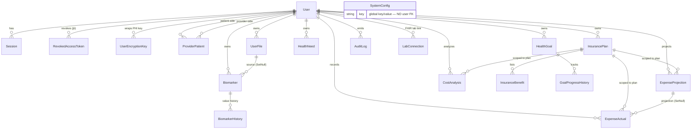

# DATA_MODEL.md

> Complete reference for the OwnMyHealth database: every model, field, index, FK, RLS policy, cascade rule, encryption column, and the `withRLSContext` / `withRLSTransaction` usage matrix. Built by reading `backend/prisma/schema.prisma`, every file under `backend/prisma/migrations/`, and `backend/src/services/{database,encryption,userEncryption,auditLog}.ts`.
>
> **Code state:** `master` @ `12b45ae` · **Refreshed:** 2026-08-01 (previous: `fb2cd32`, 2026-06-15) · **Posture:** sandbox — no GCP, see [OPEN_FINDINGS.md §Posture](./OPEN_FINDINGS.md)
>
> **Changed since the last generation:** 2 new migrations (34 dirs, was 32) — `20260620_add_registration_consent` and `20260712_add_sessions_update_policy`. The second closed **OF-22**, a production-only refresh-rotation break, and is the most instructive RLS lesson in this schema: see [§6.x Sessions RLS](#session--userencryptionkey-rls). Models (19), enums (13), and the encryption matrix (14 models / 39 fields) are **unchanged**.

A reader with only this doc (no repo access) should be able to answer *"what does the DB look like and how is it access-controlled?"* without opening the schema.

---

## 1. Overview

| Metric | Value | Source |
|---|---|---|
| Prisma models | **19** | `backend/prisma/schema.prisma` (see [§4 Model catalog](#4-model-catalog)) |
| RLS-enabled tables | **19** (every table has RLS ENABLE + FORCE) | [§6 RLS policy catalog](#6-rls-policy-catalog) |
| Encrypted fields | **39** `*Encrypted` columns across **14 models** (per `PHI_FIELDS`) | `backend/src/services/encryption.ts:476-562` |
| Prisma migrations | **34** directories | `Glob backend/prisma/migrations/*/migration.sql` |
| Prisma enums | **13** | `backend/prisma/schema.prisma:564-671` (see [§11](#11-enum-catalog)) |
| Latest migration | `20260712_add_sessions_update_policy` (OF-22) | [§10 Migration timeline](#13-migration-timeline) |

The database is PostgreSQL (Cloud SQL) accessed through Prisma with the `@prisma/adapter-pg` `Pool` adapter (`backend/src/services/database.ts:48-115`). All PHI is AES-256-GCM encrypted at the application layer **before** the DB write (per-user key, [§5](#5-encryption-matrix)). Tenant isolation is **PostgreSQL Row-Level Security**: every query that touches user data runs inside `withRLSContext` / `withRLSTransaction`, which issue `SET LOCAL app.current_user_id` so default-deny RLS policies fail **closed** (`database.ts:419-428`). All 19 RLS tables additionally have `FORCE ROW LEVEL SECURITY` so even the table owner is policy-checked, and the server **hard-exits at boot** if any RLS table lacks FORCE or the DB role has `BYPASSRLS` in production (`database.ts:192-193`, `:217-312`).

---

## 2. ER diagram (Mermaid)

All 19 models. `User` is the tenancy root; every table except `SystemConfig` ultimately scopes to a user (directly via `user_id`, or transitively through a parent FK such as `InsuranceBenefit → InsurancePlan`).



> `SystemConfig` is the only model with no FK to `User` (global key/value config, admin-only RLS — `schema.prisma:550-562`). There are **no deprecated models** to diagram: the DNA/genetics models were dropped in `20260423_drop_dna_genetics` ([§12](#12-removed-models)).

---

## 3. Naming conventions

| Convention | Rule | Example | Source |
|---|---|---|---|
| Table name | `@@map("snake_case")` | `model Biomarker` → `biomarkers` | `schema.prisma:217` |
| Column name | `@map("snake_case")` on each camelCase field | `valueEncrypted` → `value_encrypted` | `schema.prisma:188` |
| Encrypted column | `*Encrypted` suffix → AES-256-GCM ciphertext | `notesEncrypted`, `accessTokenEncrypted` | `schema.prisma:189,763` |
| PK type | `id String @id @default(dbgenerated("gen_random_uuid()")) @db.Uuid` | every model **except** `RevokedAccessToken` | `schema.prisma:11` |
| Timestamps | `@db.Timestamptz(6)`, `@default(now())`, `@updatedAt` | `createdAt`, `updatedAt` | `schema.prisma:49-50` |

```prisma
// Source: backend/prisma/schema.prisma:183-188 — the canonical id PK + @map pattern
model Biomarker {
  id             String @id @default(dbgenerated("gen_random_uuid()")) @db.Uuid
  userId         String @map("user_id") @db.Uuid
  ...
  valueEncrypted String @map("value_encrypted")
```

**Exception — `RevokedAccessToken` has no `id`.** Its PK is `jti`, the revoked access token's JWT id, with **no** `gen_random_uuid()` default (the value comes from the token being revoked, not generated):

```prisma
// Source: backend/prisma/schema.prisma:96-106
model RevokedAccessToken {
  jti       String   @id @db.Uuid
  userId    String   @map("user_id") @db.Uuid
  ...
}
```

UUID-default alignment: four tables (`user_files`, `expense_projections`, `expense_actuals`, `cost_analyses`) originally used Prisma's app-side `@default(uuid())`; `20260424_align_uuid_defaults_and_rename_claude_response` shifted them to Postgres-native `gen_random_uuid()` so all models share one id source (`backend/prisma/migrations/20260424_align_uuid_defaults_and_rename_claude_response/migration.sql:36-46`).

---

## 4. Model catalog

19 models, alphabetical. Each entry: purpose, field table, indexes, relations, RLS note. PHI columns flagged in the Encrypted column. Plaintext "twins" (legacy columns coexisting with an encrypted replacement) are noted; they are **not** in `PHI_FIELDS` by design — see [§5](#5-encryption-matrix).

### AuditLog

**Table**: `audit_logs` (`@@map`)   **Source**: `backend/prisma/schema.prisma:515-548`

Purpose: HIPAA access/change log; immutable by RLS (no UPDATE policy), 7-year retention.

| Field | Column | Type | Encrypted? | Nullable | FK |
|---|---|---|---|---|---|
| `id` | `id` | `Uuid` PK | — | no | — |
| `userId` | `user_id` | `Uuid` | — | yes | `User.id` (NoAction — `User?` optional, no `onDelete`) |
| `actorType` | `actor_type` | `ActorType` | — | no | — |
| `ipAddress` | `ip_address` | `VarChar(45)` | — | yes | — |
| `userAgent` | `user_agent` | `String` | — | yes | — |
| `sessionId` | `session_id` | `VarChar(100)` | — | yes | — |
| `action` | `action` | `AuditAction` | — | no | — |
| `resourceType` | `resource_type` | `VarChar(100)` | — | no | — |
| `resourceId` | `resource_id` | `Uuid` | — | yes | — |
| `previousValueEncrypted` | `previous_value_encrypted` | `String` | **yes** | yes | — |
| `newValueEncrypted` | `new_value_encrypted` | `String` | **yes** | yes | — |
| `metadataEncrypted` | `metadata_encrypted` | `String` | **yes** | yes | — |
| `success` | `success` | `Boolean` (def true) | — | no | — |
| `errorMessage` | `error_message` | `String` | — | yes | — |
| `createdAt` | `created_at` | `Timestamptz(6)` | — | no | — |

**Indexes**: `userId`, `action`, `resourceType`, `resourceId`, `created_at` asc (`audit_logs_created_at_asc_idx`) + desc (`audit_logs_created_at_desc_idx`), `(userId, createdAt DESC)` (`audit_logs_user_created_at_idx` + unnamed twin) — `schema.prisma:539-546`.
**Relations**: belongs to `User?` (nullable; the FK has **no** `onDelete`, so it defaults to Prisma `NoAction`/`Restrict` — audit rows survive user deletion for retention). The legacy plaintext `metadata` column was **irreversibly dropped** in `20260615_drop_legacy_audit_metadata` (`migration.sql:18`).
**RLS**: yes — `audit_logs_select` (own/admin), `audit_logs_insert` (tightened WITH CHECK), **no UPDATE policy (immutable)**, `audit_logs_delete` (admin AND `created_at < now() - interval '7 years'`). See [§6](#auditlog-rls).

### Biomarker

**Table**: `biomarkers`   **Source**: `backend/prisma/schema.prisma:182-218`

Purpose: one measured biomarker reading tied to a user (optionally linked to the uploaded file it was extracted from).

| Field | Column | Type | Encrypted? | Nullable | FK |
|---|---|---|---|---|---|
| `id` | `id` | `Uuid` PK | — | no | — |
| `userId` | `user_id` | `Uuid` | — | no | `User.id` (Cascade) — RLS anchor |
| `category` | `category` | `VarChar(100)` | — | no | — |
| `name` | `name` | `VarChar(200)` | — | no | — |
| `unit` | `unit` | `VarChar(50)` | — | no | — |
| `valueEncrypted` | `value_encrypted` | `String` | **yes** | no | — |
| `notesEncrypted` | `notes_encrypted` | `String` | **yes** | yes | — |
| `normalRangeMin` / `Max` | `normal_range_min` / `_max` | `Decimal(10,4)` | — | no | — |
| `measurementDate` | `measurement_date` | `Date` | — | no | — |
| `sourceType` | `source_type` | `DataSourceType` (def MANUAL) | — | no | — |
| `sourceFile` | `source_file` | `VarChar(255)` | — (plaintext **by design** — FHIR idempotency/dedupe key) | yes | — |
| `userFileId` | `user_file_id` | `Uuid` | — | yes | `UserFile.id` (SetNull) |

(plus `normalRangeSource`, `extractionConfidence`, `labName`, `isOutOfRange`, `isAcknowledged`, `createdAt`, `updatedAt` — `schema.prisma:192-201`)

**Indexes**: `userId`; `(userId, category)`; `measurementDate`; `isOutOfRange`; `userFileId`; `(userId, category, measurementDate DESC)` (`biomarkers_user_category_date_idx` + unnamed twin); `(userId, createdAt)`; `(userId, isOutOfRange)`; `(userId, sourceType)` — `schema.prisma:207-216`.
**Relations**: belongs to `User` (Cascade); belongs to `UserFile?` (SetNull); has many `BiomarkerHistory` (Cascade).
**RLS**: yes — SELECT also allows `has_provider_access(user_id,'view_biomarkers')`; UPDATE also allows `has_provider_access(...,'edit')`. See [§6](#biomarker-rls).

### BiomarkerHistory

**Table**: `biomarker_history`   **Source**: `backend/prisma/schema.prisma:220-231`

Purpose: prior values of a biomarker (trend series). No notes column by design.

| Field | Column | Type | Encrypted? | Nullable | FK |
|---|---|---|---|---|---|
| `id` | `id` | `Uuid` PK | — | no | — |
| `biomarkerId` | `biomarker_id` | `Uuid` | — | no | `Biomarker.id` (Cascade) |
| `valueEncrypted` | `value_encrypted` | `String` | **yes** | no | — |
| `measurementDate` | `measurement_date` | `Date` | — | no | — |
| `createdAt` | `created_at` | `Timestamptz(6)` | — | no | — |

**Indexes**: `biomarkerId`, `measurementDate`.
**RLS**: yes — visibility derived from the parent biomarker via `EXISTS(... biomarkers b WHERE b.id = biomarker_id AND ...)`. See [§6](#biomarkerhistory-rls).

### CostAnalysis

**Table**: `cost_analyses`   **Source**: `backend/prisma/schema.prisma:727-749`

Purpose: AI-generated cost-optimization analysis (Claude response stored as ciphertext).

| Field | Column | Type | Encrypted? | Nullable | FK |
|---|---|---|---|---|---|
| `id` | `id` | `Uuid` PK | — | no | — |
| `userId` | `user_id` | `Uuid` | — | no | `User.id` (Cascade) |
| `planId` | `plan_id` | `Uuid` | — | no | `InsurancePlan.id` (Cascade) |
| `claudeResponseEncrypted` | `claude_response_encrypted` | `Text` | **yes** | no | — |
| `totalProjectedOopEncrypted` | `total_projected_oop` | `Text` | **yes** | yes | — |
| `projectedExpensesSnapshotEncrypted` | `projected_expenses_snapshot` | `Text` | **yes** | yes | — |
| `analysisDate` / `deductibleMetMonth` / `createdAt` | … | — | — | — | — |

**Indexes**: `(userId, planId)`, `analysisDate`.
**RLS**: yes — single `cost_analyses_user_policy` `FOR ALL` (own/admin). Column renamed `claude_response → claude_response_encrypted` in `20260424_align_uuid_defaults_and_rename_claude_response` (`migration.sql:52-53`).

### ExpenseActual

**Table**: `expense_actuals`   **Source**: `backend/prisma/schema.prisma:699-725`

Purpose: actual medical expense (from EOB/claim). All monetary fields are **encrypted strings, not Decimal** (migration `20260206_fix_expense_encryption_types`).

| Field | Column | Type | Encrypted? | Nullable | FK |
|---|---|---|---|---|---|
| `id` / `userId` / `planId` | `id` / `user_id` / `plan_id` | `Uuid` | — | no | `User`(Cascade), `InsurancePlan`(Cascade) |
| `projectionId` | `projection_id` | `Uuid` | — | yes | `ExpenseProjection.id` (**SetNull**) |
| `serviceTypeEncrypted` | `service_type` | `Text` | **yes** | no | — |
| `providerNameEncrypted` | `provider_name` | `Text` | **yes** | yes | — |
| `billedAmountEncrypted` | `billed_amount` | `Text` | **yes** | yes | — |
| `insurancePaidEncrypted` | `insurance_paid` | `Text` | **yes** | yes | — |
| `patientPaidEncrypted` | `patient_paid` | `Text` | **yes** | yes | — |
| `appliedToDeductibleEncrypted` | `applied_to_deductible` | `Text` | **yes** | yes | — |
| `appliedToOopEncrypted` | `applied_to_oop` | `Text` | **yes** | yes | — |
| `notesEncrypted` | `notes` | `Text` | **yes** | yes | — |
| `dateOfService` / `claimStatus` / `isInNetwork` / `createdAt` / `updatedAt` | … | — | — | — | — |

**Indexes**: `(userId, planId)`, `dateOfService`.
**RLS**: yes — `expense_actuals_user_policy` `FOR ALL` (own/admin).

### ExpenseProjection

**Table**: `expense_projections`   **Source**: `backend/prisma/schema.prisma:677-697`

Purpose: projected medical expense for cost planning. Monetary fields encrypted strings.

| Field | Column | Type | Encrypted? | Nullable | FK |
|---|---|---|---|---|---|
| `id` / `userId` / `planId` | `id` / `user_id` / `plan_id` | `Uuid` | — | no | `User`(Cascade), `InsurancePlan`(Cascade) |
| `serviceTypeEncrypted` | `service_type` | `Text` | **yes** | no | — |
| `estimatedCostEncrypted` | `estimated_cost` | `Text` | **yes** | no | — |
| `notesEncrypted` | `notes` | `Text` | **yes** | yes | — |
| `frequencyPerYear` / `isInNetwork` / `projectionDate` / `createdAt` / `updatedAt` | … | — | — | — | — |

**Indexes**: `(userId, planId)`, `createdAt`.
**Relations**: has many `ExpenseActual` (child FK `projectionId` is SetNull).
**RLS**: yes — `expense_projections_user_policy` `FOR ALL` (own/admin).

### GoalProgressHistory

**Table**: `goal_progress_history`   **Source**: `backend/prisma/schema.prisma:496-513`

Purpose: a timestamped progress entry on a health goal.

| Field | Column | Type | Encrypted? | Nullable | FK |
|---|---|---|---|---|---|
| `id` | `id` | `Uuid` PK | — | no | — |
| `goalId` | `goal_id` | `Uuid` | — | no | `HealthGoal.id` (Cascade) |
| `value` | `value` | `Decimal(10,4)` | — (plaintext **twin**, not in PHI_FIELDS) | yes | — |
| `valueEncrypted` | `value_encrypted` | `String` | **yes** | yes | — |
| `progress` | `progress` | `Decimal(5,2)` | — | no | — |
| `noteEncrypted` | `note_encrypted` | `String` | **yes** | yes | — |
| `recordedAt` | `recorded_at` | `Timestamptz(6)` | — | no | — |

**Indexes**: `goalId`, `recordedAt`.
**RLS**: yes — derived from parent goal via `EXISTS(... health_goals g WHERE g.id = goal_id AND ...)`, SELECT also gated by `has_provider_access(g.user_id,'view_health_needs')`.

### HealthGoal

**Table**: `health_goals`   **Source**: `backend/prisma/schema.prisma:445-494`

Purpose: a user health goal with numeric target/current/start values (all encrypted as of M4).

| Field | Column | Type | Encrypted? | Nullable | FK |
|---|---|---|---|---|---|
| `id` / `userId` | `id` / `user_id` | `Uuid` | — | no | `User.id` (Cascade) |
| `name` | `name` | `VarChar(200)` | — | no | — |
| `descriptionEncrypted` | `description_encrypted` | `String` | **yes** | yes | — |
| `targetValue` | `target_value` | `Decimal(10,4)` | — (plaintext **twin**) | yes | — |
| `targetValueEncrypted` | `target_value_encrypted` | `String` | **yes** | yes | — |
| `currentValue` | `current_value` | `Decimal(10,4)` | — (plaintext **twin**) | yes | — |
| `currentValueEncrypted` | `current_value_encrypted` | `String` | **yes** | yes | — |
| `startValue` | `start_value` | `Decimal(10,4)` | — (plaintext **twin**) | yes | — |
| `startValueEncrypted` | `start_value_encrypted` | `String` | **yes** | yes | — |
| `category` / `unit` / `direction` / `relatedBiomarkerId` / `startDate` / `targetDate` / `status` / `progress` / `reminderFrequency` / `lastReminderSent` / `completedAt` | … | — | — | — | — |

**Indexes**: `userId`, `status`, `category`, `targetDate`, `(userId, status, targetDate)` (`health_goals_user_status_target_idx` + unnamed twin) — `schema.prisma:487-492`.
**RLS**: yes — SELECT also allows `has_provider_access(user_id,'view_health_needs')`.

### HealthNeed

**Table**: `health_needs`   **Source**: `backend/prisma/schema.prisma:425-443`

Purpose: a tracked health need (condition / action / service / follow-up).

| Field | Column | Type | Encrypted? | Nullable | FK |
|---|---|---|---|---|---|
| `id` / `userId` | `id` / `user_id` | `Uuid` | — | no | `User.id` (Cascade) |
| `needType` | `need_type` | `HealthNeedType` | — | no | — |
| `name` | `name` | `VarChar(200)` | — | no | — |
| `descriptionEncrypted` | `description_encrypted` | `String` | **yes** | no | — |
| `urgency` | `urgency` | `Urgency` | — | no | — |
| `status` | `status` | `HealthNeedStatus` (def PENDING) | — | no | — |
| `relatedBiomarkerIds` | `related_biomarker_ids` | `Uuid[]` | — | no (array) | — |

**Indexes**: `userId`, `status`, `urgency`.
**RLS**: yes — SELECT also allows `has_provider_access(user_id,'view_health_needs')`; UPDATE also allows `has_provider_access(...,'edit')`.

### InsuranceBenefit

**Table**: `insurance_benefits`   **Source**: `backend/prisma/schema.prisma:402-423`

Purpose: one covered service line on an insurance plan (in/out-of-network copay/coinsurance). No PHI columns.

| Field | Column | Type | Encrypted? | Nullable | FK |
|---|---|---|---|---|---|
| `id` | `id` | `Uuid` PK | — | no | — |
| `planId` | `plan_id` | `Uuid` | — | no | `InsurancePlan.id` (**Cascade**) |
| `serviceName` / `serviceCategory` | `service_name` / `service_category` | `VarChar` | — | no | — |
| `inNetworkCovered` / `inNetworkCopay` / `inNetworkCoinsurance` / `inNetworkDeductible` | … | `Boolean`/`Decimal` | — | mixed | — |
| `outNetworkCovered` / `outNetworkCopay` / `outNetworkCoinsurance` / `outNetworkDeductible` | … | `Boolean`/`Decimal` | — | mixed | — |
| `limitations` / `preAuthRequired` / `createdAt` | … | — | — | — | — |

**Indexes**: `planId`, `serviceCategory`.
**Relations**: belongs to `InsurancePlan` (**onDelete Cascade** — deleting the plan deletes its benefits).
**RLS**: yes — derived from parent plan via `EXISTS(... insurance_plans p ...)`, SELECT also gated by `has_provider_access(p.user_id,'view_insurance')`.

### InsurancePlan

**Table**: `insurance_plans`   **Source**: `backend/prisma/schema.prisma:233-400`

Purpose: a user's insurance plan with deductibles/OOP/copays/coinsurance and SBC-extracted coverage detail (the widest model — ~120 columns). Only member/group IDs are PHI.

| Field | Column | Type | Encrypted? | Nullable | FK |
|---|---|---|---|---|---|
| `id` / `userId` | `id` / `user_id` | `Uuid` | — | no | `User.id` (Cascade) |
| `planName` / `insurerName` | `plan_name` / `insurer_name` | `VarChar` | — (metadata, **not** PHI) | no | — |
| `planType` | `plan_type` | `PlanType` | — | no | — |
| `memberIdEncrypted` | `member_id_encrypted` | `String` | **yes** | yes | — |
| `groupIdEncrypted` | `group_id_encrypted` | `String` | **yes** | yes | — |
| deductibles / OOP / copays / coinsurance / Rx / vision / dental / DME / etc. | (~110 `Decimal?`/`Int?` columns) | `Decimal`/`Int`/`Text` | — | mostly yes | — |

**Indexes**: `userId`, `isActive`, `(userId, isActive, isPrimary DESC)` (`insurance_plans_user_active_primary_idx` + unnamed twin) — `schema.prisma:395-398`.
**Relations**: has many `InsuranceBenefit`, `ExpenseProjection`, `ExpenseActual`, `CostAnalysis` (all Cascade from parent plan); belongs to `User` (Cascade).
**RLS**: yes — SELECT also allows `has_provider_access(user_id,'view_insurance')`.

### LabConnection

**Table**: `lab_connections`   **Source**: `backend/prisma/schema.prisma:755-779`

Purpose: SMART-on-FHIR (Quest etc.) lab connection holding the OAuth token set (PHI-adjacent — a stolen access token reaches live PHI at the lab).

| Field | Column | Type | Encrypted? | Nullable | FK |
|---|---|---|---|---|---|
| `id` / `userId` | `id` / `user_id` | `Uuid` | — | no | `User.id` (Cascade) |
| `provider` | `provider` | `VarChar(50)` | — | no | — |
| `fhirPatientId` | `fhir_patient_id` | `VarChar(255)` | — | yes | — |
| `accessTokenEncrypted` | `access_token_encrypted` | `String` | **yes** | no | — |
| `refreshTokenEncrypted` | `refresh_token_encrypted` | `String` | **yes** | yes | — |
| `tokenExpiresAt` / `scopeGranted` / `connectedAt` / `lastSyncAt` / `syncStatus` / `syncError` / `lastImportedCount` / `isActive` | … | — | — | — | — |

**Indexes**: `userId`; **unique** `(userId, provider)` — one connection per provider per user.
**RLS**: yes — `lab_connections_select/insert_own/update/delete_own` (own/admin). Tokens encrypt/decrypt in `backend/src/services/fhir/labSyncService.ts:151-152, 222-248`.

### ProviderPatient

**Table**: `provider_patients`   **Source**: `backend/prisma/schema.prisma:125-148`

Purpose: consent-based provider↔patient link with granular permission booleans. Two FKs to `User` (provider and patient).

| Field | Column | Type | Encrypted? | Nullable | FK |
|---|---|---|---|---|---|
| `id` | `id` | `Uuid` PK | — | no | — |
| `providerId` | `provider_id` | `Uuid` | — | no | `User.id` ("ProviderUser", **Cascade**) |
| `patientId` | `patient_id` | `Uuid` | — | no | `User.id` ("PatientUser", **Cascade**) |
| `canViewBiomarkers` | `can_view_biomarkers` | `Boolean` (def true) | — | no | consent column (trigger-protected) |
| `canViewInsurance` | `can_view_insurance` | `Boolean` (def false) | — | no | consent column |
| `canViewHealthNeeds` | `can_view_health_needs` | `Boolean` (def true) | — | no | consent column |
| `canEditData` | `can_edit_data` | `Boolean` (def false) | — | no | consent column |
| `relationshipType` | `relationship_type` | `ProviderRelationType` | — | no | — |
| `status` | `status` | `ProviderPatientStatus` (def PENDING) | — | no | — |
| `consentGrantedAt` / `consentExpiresAt` | … | `Timestamptz(6)` | — | yes | — |
| `notesEncrypted` | `notes_encrypted` | `String` | **yes** | yes | — |

**Indexes**: `providerId`, `patientId`, `status`; **unique** `(providerId, patientId)` — `schema.prisma:143-146`.
**Relations**: two FKs to `User`, both **onDelete Cascade** (deleting either party removes the relationship).
**RLS**: yes — visible to either party or admin; the 4 consent booleans are **immutable to a provider session** via the `provider_patients_guard_consent()` BEFORE-UPDATE trigger (`20260615_..._migration.sql:19-36`). See [§6](#providerpatient-rls). Note: `can_view_dna` was dropped in `20260423_drop_dna_genetics`.

### RevokedAccessToken

**Table**: `revoked_access_tokens` (M1, added 2026-06-13)   **Source**: `backend/prisma/schema.prisma:96-106`

Purpose: cross-instance **single-device** access-token revocation — single-device logout records the access JWT's `jti` so `authenticate()` rejects it on every Cloud Run replica (the per-user `tokensValidAfter` cutoff can't be used because it would log out the user's *other* devices).

| Field | Column | Type | Encrypted? | Nullable | FK |
|---|---|---|---|---|---|
| `jti` | `jti` | `Uuid` **PK** (no default — the revoked token's JWT id) | — | no | — |
| `userId` | `user_id` | `Uuid` | — | no | `User.id` (**Cascade**) |
| `expiresAt` | `expires_at` | `Timestamptz(6)` | — | no | — |
| `createdAt` | `created_at` | `Timestamptz(6)` | — | no | — |

**Indexes**: `userId`, `expiresAt` (rows swept once past `expiresAt`).
**RLS**: yes (ENABLE + FORCE) — `revoked_access_tokens_select_own` / `_insert_own` / `_delete_own`; INSERT also allowed when `current_user_id() IS NULL` so the expired-token logout path can still record a revocation. See [§6](#revokedaccesstoken-rls).

### Session

**Table**: `sessions`   **Source**: `backend/prisma/schema.prisma:73-87`

Purpose: DB-backed refresh-token session.

| Field | Column | Type | Encrypted? | Nullable | FK |
|---|---|---|---|---|---|
| `id` | `id` | `Uuid` PK | — | no | — |
| `userId` | `user_id` | `Uuid` | — | no | `User.id` (**Cascade**) |
| `token` | `token` | `VarChar(500)` **unique** | — | no | — |
| `ipAddress` / `userAgent` / `expiresAt` / `createdAt` | … | — | — | mixed | — |

**Indexes**: `userId`, `token`, `expiresAt`.
**RLS**: yes — own/admin; INSERT also allowed when `current_user_id() IS NULL` (login creates a session before an RLS user context exists).

### SystemConfig

**Table**: `system_config`   **Source**: `backend/prisma/schema.prisma:550-562`

Purpose: global key/value config. **The only model with no FK to `User`.**

| Field | Column | Type | Encrypted? | Nullable | FK |
|---|---|---|---|---|---|
| `id` | `id` | `Uuid` PK | — | no | — |
| `key` | `key` | `VarChar(100)` **unique** | — | no | — |
| `value` | `value` | `String` | — (app-level `isEncrypted` flag, not a `*Encrypted` column) | no | — |
| `valueType` / `description` / `isEncrypted` / `createdAt` / `updatedAt` / `updatedBy` | … | — | — | mixed | — |

**Indexes**: unique `key` only.
**RLS**: yes — **all four policies require `is_admin_session()`** (admin-only table).

### User

**Table**: `users`   **Source**: `backend/prisma/schema.prisma:10-71`

Purpose: account + profile (encrypted identity PHI) + auth state + plan + email-change + cross-instance token-cutoff + scheduler markers. Tenancy root.

| Field | Column | Type | Encrypted? | Nullable | FK |
|---|---|---|---|---|---|
| `id` | `id` | `Uuid` PK | — | no | — |
| `email` | `email` | `VarChar(255)` **unique** | — (identifier, not PHI) | no | — |
| `passwordHash` | `password_hash` | `VarChar(255)` | — | no | — |
| `firstNameEncrypted` | `first_name_encrypted` | `String` | **yes** | yes | — |
| `lastNameEncrypted` | `last_name_encrypted` | `String` | **yes** | yes | — |
| `dateOfBirthEncrypted` | `date_of_birth_encrypted` | `String` | **yes** | yes | — |
| `phoneEncrypted` | `phone_encrypted` | `String` | **yes** | yes | — |
| `addressEncrypted` | `address_encrypted` | `String` | **yes** | yes | — |
| `healthProfileEncrypted` | `health_profile_encrypted` | `String` | **yes** | yes | — |
| `role` | `role` | `UserRole` (def PATIENT) | — | no | — |
| `tokensValidAfter` | `tokens_valid_after` | `Timestamptz(6)` | — (cross-instance access-token cutoff) | yes | — |
| `pendingEmail` / `emailChangeToken` / `emailChangeExpires` | … | email-change flow | — | yes | — |
| `plan` / `planExpiresAt` / `planUpdatedAt` / `onboardingCompletedAt` | … | — | — | mixed | — |
| `termsAcceptedAt` | `terms_accepted_at` | `Timestamptz(6)` | — (registration consent, OMH-L04) | yes | `20260620_add_registration_consent` |
| `termsVersion` | `terms_version` | `VarChar(20)` | — (which policy version was accepted) | yes | `20260620_add_registration_consent` |
| `lastWeeklySummarySent` / `lastPlanExpiringSent` | … | scheduler at-most-once markers (non-PHI) | — | yes | — |
| (+ `emailVerified`, verification/reset tokens, lockout fields, `notificationPreferences` Json, timestamps) | … | — | — | mixed | — |

**Indexes**: `email`, `createdAt` (+ several unique token indexes via `@unique`).
**Relations**: parent of `AuditLog`, `Biomarker`, `HealthGoal`, `HealthNeed`, `InsurancePlan`, `ProviderPatient` (×2 named relations), `Session`, `RevokedAccessToken`, `UserEncryptionKey`, `UserFile`, `ExpenseProjection`, `ExpenseActual`, `CostAnalysis`, `LabConnection` — `schema.prisma:52-66`.
**RLS**: yes — `users_select_own` (self/admin), `users_select_provider` (consented provider, additive policy via `has_active_consent(id)`), `users_update_own`, `users_insert_system`, `users_delete_admin`. See [§6](#user-rls).

### UserEncryptionKey

**Table**: `user_encryption_keys`   **Source**: `backend/prisma/schema.prisma:108-123`

Purpose: holds the user's **per-user encryption salt** (the salt itself is stored encrypted under the master key). This is where the per-user PHI key material is anchored.

| Field | Column | Type | Encrypted? | Nullable | FK |
|---|---|---|---|---|---|
| `id` / `userId` | `id` / `user_id` | `Uuid` | — | no | `User.id` (**Cascade**) |
| `keyType` | `key_type` | `VarChar(50)` (`'phi_encryption'`) | — | no | — |
| `keyHash` | `key_hash` | `VarChar(255)` | — | no | — |
| `encryptedKey` | `encrypted_key` | `String` | (salt encrypted under master key, not a `*Encrypted`-suffixed PHI column) | no | — |
| `version` / `isActive` / `createdAt` / `rotatedAt` | … | — | — | mixed | — |

**Indexes**: `userId`; **unique** `(userId, keyType, version)`.
**RLS**: yes — `user_encryption_keys_select/insert/update_own` (own/admin); INSERT also allowed when `current_user_id() IS NULL`. Salt read/created via admin-context in `userEncryption.ts:29-72`. See [§8](#8-per-user-encryption-key).

### UserFile

**Table**: `user_files`   **Source**: `backend/prisma/schema.prisma:150-180`

Purpose: an uploaded lab/SBC document (GCS storage key + extraction metadata).

| Field | Column | Type | Encrypted? | Nullable | FK |
|---|---|---|---|---|---|
| `id` / `userId` | `id` / `user_id` | `Uuid` | — | no | `User.id` (**Cascade**) |
| `filename` | `filename` | `VarChar(255)` | — (server-generated display label, **plaintext by design**) | no | — |
| `originalFilename` | `original_filename` | `VarChar(255)` | — (legacy plaintext **twin**, being phased out) | yes | — |
| `originalFilenameEncrypted` | `original_filename_encrypted` | `String` | **yes** (L24) | yes | — |
| `fileType` / `fileSize` / `storageKey` / `labName` / `labDate` / `biomarkersExtracted` / `extractionConfidence` | … | — | — | mixed | — |

**Indexes**: `userId`, `labDate`.
**Relations**: belongs to `User` (Cascade); has many `Biomarker` (child FK `userFileId` is **SetNull**).
**RLS**: yes — `user_files_select/insert/update/delete_policy` (own/admin), written with `current_setting(...)` literals (not the `current_user_id()` helper). The raw filename was encrypted at rest in `20260615_encrypt_userfile_original_filename` (`migration.sql:12-13`).

---

## 5. Encryption matrix

`PHI_FIELDS` (`backend/src/services/encryption.ts:476-562`) covers **14 models / 39 `*Encrypted` columns**, in perfect lockstep with the schema (no orphans either direction). All ciphertext is AES-256-GCM under the user's per-user key, except `AuditLog.*` which uses the **system-salt** key so audit history survives per-user salt destruction on account deletion ([§8](#8-per-user-encryption-key)). Reader = decrypt site, Writer = encrypt site.

| Model.Field | In `PHI_FIELDS`? | In schema as `*Encrypted`? | Reader (decrypt) | Writer (encrypt) |
|---|---|---|---|---|
| `User.firstNameEncrypted` … `addressEncrypted` (5) + `healthProfileEncrypted` | yes (enc.ts:479-484) | yes (schema:14-18,38) | `settingsController` / `healthProfileService` | same |
| `Biomarker.valueEncrypted` | yes (enc.ts:488) | yes (schema:188) | `biomarkerController.ts:99,347,381,853` | `biomarkerController.ts:272,363,538` |
| `Biomarker.notesEncrypted` | yes (enc.ts:489) | yes (schema:189) | `biomarkerController.ts:100-101` | `biomarkerController.ts:273-274,366-367,539` |
| `BiomarkerHistory.valueEncrypted` | yes (enc.ts:492) | yes (schema:223) | `biomarkerController.ts:109,859` | `biomarkerController.ts:352` |
| `UserFile.originalFilenameEncrypted` | yes (enc.ts:499) | yes (schema:164) | `fileController` (decrypt twin, fallback to plaintext) | upload controllers / `backfillUserFileNames.ts` |
| `InsurancePlan.memberIdEncrypted`, `groupIdEncrypted` | yes (enc.ts:503-504) | yes (schema:240-241) | `insuranceController` | `insuranceController` |
| `ProviderPatient.notesEncrypted` | yes (enc.ts:508) | yes (schema:137) | `providerRoutes`/`patientRoutes` | same |
| `HealthNeed.descriptionEncrypted` | yes (enc.ts:512) | yes (schema:430) | `healthNeedsController` | same |
| `HealthGoal.descriptionEncrypted`, `targetValueEncrypted`, `currentValueEncrypted`, `startValueEncrypted` | yes (enc.ts:517-520) | yes (schema:449,461,467,470) | `healthGoalsController` / `backfillGoalValues.ts` | same |
| `GoalProgressHistory.noteEncrypted`, `valueEncrypted` | yes (enc.ts:523-524) | yes (schema:506,504) | `healthGoalsController` | same |
| `AuditLog.previousValueEncrypted`, `newValueEncrypted`, `metadataEncrypted` | yes (enc.ts:528-530) | yes (schema:525-526,533) | `auditLog.ts` (admin viewer) | `auditLog.ts` (system salt) |
| `ExpenseProjection.serviceTypeEncrypted`, `estimatedCostEncrypted`, `notesEncrypted` | yes (enc.ts:534-536) | yes (schema:681-685) | `expenseController` | same |
| `ExpenseActual.*Encrypted` (8) | yes (enc.ts:539-546) | yes (schema:704-714) | `expenseController` | same |
| `CostAnalysis.claudeResponseEncrypted`, `totalProjectedOopEncrypted`, `projectedExpensesSnapshotEncrypted` | yes (enc.ts:552-554) | yes (schema:737-740) | `expenseController.ts:~866`, `settingsController.ts:~640` (export) | `expenseController.ts:~801` |
| `LabConnection.accessTokenEncrypted`, `refreshTokenEncrypted` | yes (enc.ts:559-560) | yes (schema:763-764) | `labSyncService.ts:222-224` | `labSyncService.ts:151-152,239-248` |

**Deliberate plaintext (NOT in `PHI_FIELDS`, by design — read path prefers the encrypted twin; backfill/drop pending):**

| Column | Source | Why plaintext |
|---|---|---|
| `UserFile.originalFilename` | `schema.prisma:163` | legacy twin of `originalFilenameEncrypted`; nulled on new writes, backfilled by `backfill-userfile-filenames` job |
| `UserFile.filename` | `schema.prisma:156` | server-generated non-PHI display label |
| `HealthGoal.targetValue` / `currentValue` / `startValue` | `schema.prisma:455,462,468` | legacy twins of the `*ValueEncrypted` columns |
| `GoalProgressHistory.value` | `schema.prisma:503` | legacy twin of `valueEncrypted` |
| `Biomarker.sourceFile` | `schema.prisma:195` | FHIR idempotency/dedupe key — encrypting would break dedupe |

```ts
// Source: backend/src/services/encryption.ts:516-525 — HealthGoal/GoalProgressHistory numeric PHI added by M4
  HealthGoal: [
    'descriptionEncrypted',
    'targetValueEncrypted',
    'currentValueEncrypted',
    'startValueEncrypted',
  ],
  GoalProgressHistory: [
    'noteEncrypted',
    'valueEncrypted',
  ],
```

No drift: every `*Encrypted` schema column is in `PHI_FIELDS` (`encryption.ts:476-562`) and every `PHI_FIELDS` entry resolves to a schema column (verified by `Grep "Encrypted" backend/prisma/schema.prisma` diffed against the constant). The old `CLAUDE.md` PHI section (which lists `InsurancePlan.planName/insurerName/benefits` and `Biomarker.unit` as encrypted) is **stale** — none of those are `*Encrypted` columns; flagged in [§15](#15-prompt-drift-log).

---

## 6. RLS policy catalog

All 19 tables have `ENABLE ROW LEVEL SECURITY` + (since `20260613_force_rls_and_audit_retention`) `FORCE ROW LEVEL SECURITY`. Policies are **default-deny**: a row is visible/writable only if a policy's `USING`/`WITH CHECK` returns true, and `current_user_id()` returns `NULL` when unset, so a contextless query returns zero rows (fails **closed**).

### Helper functions

```sql
-- Source: backend/prisma/migrations/20260107_add_rls_policies/migration.sql:17-36
CREATE OR REPLACE FUNCTION current_user_id()
RETURNS uuid AS $$
BEGIN
  RETURN NULLIF(current_setting('app.current_user_id', true), '')::uuid;
EXCEPTION WHEN OTHERS THEN RETURN NULL;
END;
$$ LANGUAGE plpgsql STABLE SECURITY DEFINER;

CREATE OR REPLACE FUNCTION is_admin_session()
RETURNS boolean AS $$
BEGIN
  RETURN COALESCE(current_setting('app.is_admin', true), 'false')::boolean;
EXCEPTION WHEN OTHERS THEN RETURN false;
END;
$$ LANGUAGE plpgsql STABLE SECURITY DEFINER;
```

`is_admin_session()` is the **only** function that lets code bypass the per-user filter (set via `withRLSContext(null, fn, { isAdmin: true })` → `app.is_admin = 'true'`).

```sql
-- Source: backend/prisma/migrations/20260529_fix_has_provider_access/migration.sql:20-42
-- FINAL body — the 20260107 version's `WHEN 'view_dna'` branch was removed after
-- 20260423_drop_dna_genetics dropped provider_patients.can_view_dna (which had been
-- making the function throw "column does not exist" for EVERY permission_type under
-- a real NOBYPASSRLS role).
CREATE OR REPLACE FUNCTION has_provider_access(patient_user_id uuid, permission_type text DEFAULT 'view')
RETURNS boolean AS $$
DECLARE has_access boolean;
BEGIN
  SELECT EXISTS (
    SELECT 1 FROM provider_patients pp
    WHERE pp.provider_id = current_user_id()
      AND pp.patient_id = patient_user_id
      AND pp.status = 'ACTIVE'
      AND (pp.consent_expires_at IS NULL OR pp.consent_expires_at > NOW())
      AND CASE permission_type
        WHEN 'view_biomarkers'   THEN pp.can_view_biomarkers
        WHEN 'view_insurance'    THEN pp.can_view_insurance
        WHEN 'view_health_needs' THEN pp.can_view_health_needs
        WHEN 'edit'              THEN pp.can_edit_data
        ELSE pp.can_view_biomarkers
      END
  ) INTO has_access;
  RETURN COALESCE(has_access, false);
END;
$$ LANGUAGE plpgsql STABLE SECURITY DEFINER;
```

`has_provider_access(patient_user_id, permission_type)` gates a **provider's** read/edit of a *consented* patient's data: it returns true only for an `ACTIVE`, unexpired `provider_patients` row where the matching capability flag is set. `has_active_consent(patient_user_id)` (`20260530_add_users_select_provider/migration.sql:33-48`) is the identity-only variant gating the provider's read of the patient's `users` row on *any* active consent.

### User RLS

```sql
-- Source: 20260107_add_rls_policies/migration.sql:90-111
CREATE POLICY users_select_own ON users
  FOR SELECT USING (id = current_user_id() OR is_admin_session());
CREATE POLICY users_update_own ON users
  FOR UPDATE USING (id = current_user_id() OR is_admin_session())
             WITH CHECK (id = current_user_id() OR is_admin_session());
CREATE POLICY users_insert_system ON users
  FOR INSERT WITH CHECK (is_admin_session() OR current_user_id() IS NULL);
CREATE POLICY users_delete_admin ON users
  FOR DELETE USING (is_admin_session());
-- Source: 20260530_add_users_select_provider/migration.sql:54-56 (additive — Postgres ORs SELECT policies)
CREATE POLICY users_select_provider ON users
  FOR SELECT USING (has_active_consent(id));
```

### Biomarker RLS

```sql
-- Source: 20260107_add_rls_policies/migration.sql:151-176
CREATE POLICY biomarkers_select ON biomarkers FOR SELECT
  USING (user_id = current_user_id()
         OR has_provider_access(user_id, 'view_biomarkers')
         OR is_admin_session());
CREATE POLICY biomarkers_insert_own ON biomarkers FOR INSERT
  WITH CHECK (user_id = current_user_id() OR is_admin_session());
CREATE POLICY biomarkers_update ON biomarkers FOR UPDATE
  USING (user_id = current_user_id()
         OR has_provider_access(user_id, 'edit')
         OR is_admin_session());
CREATE POLICY biomarkers_delete_own ON biomarkers FOR DELETE
  USING (user_id = current_user_id() OR is_admin_session());
```

### BiomarkerHistory RLS

Derived from parent biomarker (`migration.sql:182-212`): SELECT/INSERT/DELETE each wrap `EXISTS (SELECT 1 FROM biomarkers b WHERE b.id = biomarker_history.biomarker_id AND (b.user_id = current_user_id() OR ... OR is_admin_session()))`. SELECT also allows `has_provider_access(b.user_id,'view_biomarkers')`. No UPDATE policy.

### InsurancePlan / InsuranceBenefit RLS

`insurance_plans_*` mirror biomarkers but gate on `'view_insurance'` (`migration.sql:218-236`). `insurance_benefits_*` are derived from the parent plan via `EXISTS(... insurance_plans p WHERE p.id = insurance_benefits.plan_id AND ...)` with `has_provider_access(p.user_id,'view_insurance')` on SELECT (`migration.sql:242-282`).

### HealthNeed / HealthGoal / GoalProgressHistory RLS

`health_needs_*`: own/admin, SELECT + (edit on UPDATE) via `has_provider_access(...,'view_health_needs'|'edit')` (`migration.sql:384-406`). `health_goals_*`: own/admin, SELECT via `has_provider_access(user_id,'view_health_needs')` (`migration.sql:412-430`). `goal_progress_history_*`: derived from parent goal (`migration.sql:436-466`).

### ProviderPatient RLS

```sql
-- Source: 20260615_provider_consent_immutable_audit_insert_check/migration.sql:42-54 (FINAL update policy)
CREATE POLICY provider_patients_update ON provider_patients FOR UPDATE
  USING (provider_id = current_user_id() OR patient_id = current_user_id() OR is_admin_session())
  WITH CHECK (provider_id = current_user_id() OR patient_id = current_user_id() OR is_admin_session());
```

SELECT/INSERT/DELETE from the base migration (`migration.sql:473-505`): provider or patient (or admin) for SELECT/DELETE; provider-or-admin for INSERT. RLS can't express "these columns unchanged", so the **4 consent booleans are protected by a BEFORE-UPDATE trigger** that restores them unless the writer is the patient or admin:

```sql
-- Source: 20260615_provider_consent_immutable_audit_insert_check/migration.sql:19-36
CREATE OR REPLACE FUNCTION provider_patients_guard_consent()
RETURNS trigger AS $$
BEGIN
  IF NOT (NEW.patient_id = current_user_id() OR is_admin_session()) THEN
    NEW.can_view_biomarkers   := OLD.can_view_biomarkers;
    NEW.can_view_insurance    := OLD.can_view_insurance;
    NEW.can_view_health_needs := OLD.can_view_health_needs;
    NEW.can_edit_data         := OLD.can_edit_data;
  END IF;
  RETURN NEW;
END;
$$ LANGUAGE plpgsql;
CREATE TRIGGER provider_patients_guard_consent
  BEFORE UPDATE ON provider_patients FOR EACH ROW
  EXECUTE FUNCTION provider_patients_guard_consent();
```

### AuditLog RLS

```sql
-- Source: 20260107_add_rls_policies/migration.sql:512-517 (SELECT)
CREATE POLICY audit_logs_select ON audit_logs FOR SELECT
  USING (user_id = current_user_id() OR is_admin_session());
-- Source: 20260615_provider_consent_immutable_audit_insert_check/migration.sql:70-76 (FINAL INSERT — was WITH CHECK (true))
CREATE POLICY audit_logs_insert ON audit_logs FOR INSERT
  WITH CHECK (user_id = current_user_id() OR is_admin_session() OR current_user_id() IS NULL);
-- No UPDATE policy → updates denied (immutable).
-- Source: 20260613_force_rls_and_audit_retention/migration.sql:42-44 (FINAL DELETE — DB-enforced 7yr retention)
CREATE POLICY audit_logs_delete ON audit_logs FOR DELETE
  USING (is_admin_session() AND created_at < (now() - interval '7 years'));
```

The DELETE policy makes the 7-year window a **database guarantee** — even admin-context code cannot purge audit rows younger than 7 years.

### RevokedAccessToken RLS

```sql
-- Source: 20260613_revoked_access_tokens/migration.sql:26-39
ALTER TABLE revoked_access_tokens ENABLE ROW LEVEL SECURITY;
ALTER TABLE revoked_access_tokens FORCE ROW LEVEL SECURITY;
CREATE POLICY revoked_access_tokens_select_own ON revoked_access_tokens FOR SELECT
  USING (user_id = current_user_id() OR is_admin_session());
CREATE POLICY revoked_access_tokens_insert_own ON revoked_access_tokens FOR INSERT
  WITH CHECK (user_id = current_user_id() OR is_admin_session() OR current_user_id() IS NULL);
CREATE POLICY revoked_access_tokens_delete_own ON revoked_access_tokens FOR DELETE
  USING (user_id = current_user_id() OR is_admin_session());
```

### Session / UserEncryptionKey RLS

`sessions_*` and `user_encryption_keys_*`: own/admin, with INSERT also allowing `current_user_id() IS NULL` (login/registration paths) — `20260107_add_rls_policies/migration.sql:118-144`.

**`sessions` gained an UPDATE policy on 2026-07-12 (OF-22).** This is the single most transferable
RLS lesson in the schema, so it is worth stating in full:

```sql
-- Source: backend/prisma/migrations/20260712_add_sessions_update_policy/migration.sql:19-22
CREATE POLICY sessions_update_own ON sessions
  FOR UPDATE
  USING (user_id = current_user_id() OR is_admin_session())
  WITH CHECK (user_id = current_user_id() OR is_admin_session());
```

**Why it was missing, and why that broke production.** `sessions` rows are rotated by
delete-and-reinsert, never `UPDATE`d, so an UPDATE policy looked unnecessary — the base migration
shipped SELECT/INSERT/DELETE only. But **PostgreSQL applies UPDATE-policy checks to
`SELECT ... FOR UPDATE` row locks**, and the refresh rotation in `authService.refreshTokens()` locks
the session row exactly that way:

```ts
// Source: backend/src/services/authService.ts:730-736
const locked = await tx.$queryRaw<...>`
  SELECT id, user_id AS "userId", expires_at AS "expiresAt"
  FROM sessions
  WHERE id = ${payload!.jti}::uuid
  FOR UPDATE
`;
```

With RLS enabled and no UPDATE policy, the lock matched **zero rows**. Two consequences, both
production-only:

1. Every token refresh returned 401 (`Invalid or expired refresh token`), logging users out the
   moment their 15-minute access token expired.
2. Worse — the not-found row was classified as refresh-token **reuse**, firing the M-1 compromise
   detector: `revokeAllUserTokens()` wiped all the user's sessions and stamped `tokens_valid_after`,
   killing in-flight access tokens across every device.

**Why it was invisible until production.** Dev and staging connect as a `BYPASSRLS` role; production
(and now CI) connect as the NOBYPASSRLS `omh_app` role. The bug could only manifest under the latter.
It was found by the `e2e` CI job's first real run (`919398a`) and fixed in `3159731`.

**Generalized rule for this schema:** *every table that is row-locked needs an UPDATE policy, even if
it is never `UPDATE`d.* A regression test pins it at `backend/src/services/rls.test.ts:541`
(`describe('sessions row lock (refresh rotation regression)')`), running under a real NOBYPASSRLS
role.

**Tables that still have no UPDATE policy** — audited 2026-08-01 across all 34 migrations:

| Table | UPDATE policy? | Is it UPDATEd by code? |
|---|---|---|
| `audit_logs` | none | **No — intentional.** Audit rows are immutable by design |
| `biomarker_history` | none | **Yes** — `tx.biomarkerHistory.updateMany` (`biomarkerConsolidation.ts:145`, history re-parenting) |
| `goal_progress_history` | none | **Yes** — `tx.goalProgressHistory.update` (`goalValueBackfill.ts:127`, PHI re-encryption) |
| `revoked_access_tokens` | none | **Yes** — written by `upsert`, whose conflict branch is an UPDATE (`authService.ts:379-383`) |

The last three are the same latent shape OF-22 had. All three run under a **user** RLS context, not
admin (`withRLSTransaction(userId, …)` at `consolidateBiomarkerSeries.ts:103`,
`backfillGoalValues.ts:113`; `withRLSContext(verifiedUserId, …)` at `authService.ts:378`), so
`is_admin_session()` does not rescue them — and with no UPDATE policy at all, nothing can. These are
recorded as findings in [44-token-revocation-review](./security-reviews/44-token-revocation-review.md)
and are **not yet confirmed to fail at runtime**; confirming them requires executing against the
NOBYPASSRLS role, which the `rls` CI job now provisions.

### UserFile RLS

`user_files_select/insert/update/delete_policy` (own/admin) written with raw `current_setting('app.current_user_id', true)` / `current_setting('app.is_admin', true) = 'true'` literals rather than the `current_user_id()` helper — `20260108000000_add_user_files_table/migration.sql:40-66`.

### Expense / CostAnalysis RLS

Each is a single `FOR ALL` policy combining USING + WITH CHECK with a `CASE WHEN current_setting('app.is_admin',true)::boolean = true THEN true ELSE user_id::text = current_setting('app.current_user_id',true) END` — `20260111_add_expense_tracking/migration.sql:66-111`.

### LabConnection RLS

`lab_connections_select/insert_own/update/delete_own` (own/admin) using `current_user_id()` — `20260418_add_lab_connections/migration.sql:35-60`.

### SystemConfig RLS

All four policies require `is_admin_session()` — admin-only (`migration.sql:537-551`).

---

## 7. `withRLSContext` vs `withRLSTransaction` usage matrix

Both wrappers run the callback inside a Prisma `$transaction` and issue `SELECT set_config('app.current_user_id', …, true)` + `set_config('app.is_admin', …, true)` on that transaction client (`database.ts:419-428`). **Every Prisma call inside the callback MUST go through the passed `tx`** — calling the module-level `prisma` runs on a different pooled connection without the `SET LOCAL` and fails closed (`database.ts:14-29`).

**Difference:** `withRLSContext` always supplies `{ maxWait: 20s, timeout: 30s }` (`database.ts:498-507`); `withRLSTransaction` passes **no** txOptions by default, so Prisma's 5s interactive-transaction default applies, and only sets a longer window when the caller explicitly passes `timeout`/`maxWait` (`database.ts:519-533`). Both share `runWithRLS` (`database.ts:475-496`). Use `withRLSTransaction` (with an explicit timeout) for **multi-statement atomicity** over many sequential writes (e.g. bulk biomarker-series merge, up to ~100 readings — `database.ts:526-528`); `withRLSContext` for single reads/writes and admin listings.

220 call sites across 41 files (`Grep "withRLS(Context|Transaction)\(" backend/src` → 220). Representative rows:

| Caller (`file:line`) | Wrapper | `userId` | Purpose |
|---|---|---|---|
| `backend/src/controllers/biomarkerController.ts:169` | `withRLSTransaction` | `req.user.id` | List own biomarkers (count + findMany) |
| `backend/src/controllers/biomarkerController.ts:283` | `withRLSTransaction` | `req.user.id` | Create biomarker + history + audit atomically |
| `backend/src/controllers/biomarkerController.ts:588` | `withRLSTransaction` | `req.user.id` | Bulk write (explicit longer timeout) |
| `backend/src/routes/adminRoutes.ts:97` | `withRLSContext(null, fn, { isAdmin: true })` | `null` | Admin user listing — `is_admin_session() = true` |
| `backend/src/routes/adminRoutes.ts:169,243,345,…,1035` (13 sites) | `withRLSContext(..., { isAdmin: true })` | `null` | Admin views (audit log, stats, user mgmt) |
| `backend/src/routes/patientRoutes.ts:62,142` | `withRLSContext(..., { isAdmin: true })` | `null` | Patient↔provider system reads |
| `backend/src/routes/providerRoutes.ts:194` | `withRLSContext(..., { isAdmin: true })` | `null` | Provider listing of consented patients |
| `backend/src/services/userEncryption.ts:30,89` | `withRLSContext(null, …, { isAdmin: true })` | `null` | Per-user salt lookup/create (infra, not user-scoped) |
| `backend/src/services/auditLog.ts:338,610,626` | `withRLSContext(null, …, { isAdmin: true })` | `null` | System audit insert + retention cleanup |
| `backend/src/services/authService.ts:600,624,981,…` (27 sites) | mixed, mostly `{ isAdmin: true }` | `null` | Login/session/token lifecycle (no user RLS context yet) |
| `backend/src/schedulers/emailScheduler.ts:193,246,293,378,402` | `withRLSContext(null, …, { isAdmin: true })` | `null` | At-most-once email claiming across instances |
| `backend/src/maintenance/backfillGoalValues.ts:59` | `withRLSContext(null, …)` | `null` | Backfill job: list users (admin) then per-user re-encrypt |
| `backend/src/maintenance/consolidateBiomarkerSeries.ts:49` | `withRLSContext(null, …)` | `null` | Series consolidation maintenance job |

```ts
// Source: backend/src/services/database.ts:419-428 — the SET LOCAL both wrappers issue
async function applyRLSContext(tx, userId, isAdmin): Promise<void> {
  const userIdValue = userId ?? '';
  const isAdminValue = isAdmin ? 'true' : 'false';
  await tx.$executeRaw`SELECT set_config('app.current_user_id', ${userIdValue}, true)`;
  await tx.$executeRaw`SELECT set_config('app.is_admin', ${isAdminValue}, true)`;
}
```

```ts
// Source: backend/src/services/auditLog.ts:626-637 — retention cleanup in admin context
const deletedCount = await withRLSContext(
  null,
  async (tx) => {
    const result = await tx.auditLog.deleteMany({ where: { createdAt: { lt: cutoffDate } } });
    return result.count;
  },
  { isAdmin: true }
);
```

**Why `userId = null` is passed:** admin/system operations (admin panel listings, the per-user salt service, audit inserts + 7-year retention cleanup, the email scheduler's at-most-once claiming, auth/session lifecycle that runs before a user RLS context exists, and the maintenance/backfill jobs). `null` (or `{ isAdmin: true }`) makes RLS evaluate `is_admin_session() = true` so policies see admin context (`database.ts:485-491`).

---

## 8. Per-user encryption key

PHI is encrypted with a **per-user key derived via PBKDF2-SHA512** from a per-user **salt**. The salt lives in `UserEncryptionKey.encryptedKey`, itself stored encrypted under the master key (`PHI_ENCRYPTION_KEY` env var).

```
PHI_ENCRYPTION_KEY (env, 64 hex)            UserEncryptionKey.encryptedKey (per-user salt, master-key-encrypted)
        │                                              │
        ▼ decryptWithMasterKey                         ▼ getUserEncryptionSalt() (admin RLS ctx)
  master key ──────────────────────────────────► per-user salt (hex)
                                                       │
                                                       ▼ deriveUserKey(salt, 600_000 iters)  (encryption.ts:236-247)
                                                  per-user AES-256-GCM key  ── encrypt/decrypt PHI
```

- Salt anchor: `UserEncryptionKey` model (`schema.prisma:108-123`), table `user_encryption_keys`.
- Derivation: `EncryptionService.deriveUserKey` — `crypto.pbkdf2Sync(..., 600000, ..., 'sha512')` (`encryption.ts:236-247`, constant `PBKDF2_ITERATIONS = 600000` at `:85`; legacy `100000` kept for decrypt fallback at `:86,375`).
- Salt fetch/create: `getUserEncryptionSalt(userId)` runs in **admin RLS context** (`userEncryption.ts:29-72`).
- **AuditLog uses the system salt, not the per-user salt** — audit rows must remain readable after account deletion destroys the per-user salt (7-year HIPAA retention). See [`PHI_TAXONOMY.md`](./PHI_TAXONOMY.md).

```ts
// Source: backend/src/services/encryption.ts:236-247
private deriveUserKey(userSalt: Buffer, iterations: number = PBKDF2_ITERATIONS): Buffer {
  ...
  const derived = crypto.pbkdf2Sync(
    ...
  );
```

---

## 9. Index catalog

`@@index` / `@@unique` across the schema (named index where the migration set a `map:`). Note: Prisma currently declares several composite indexes **twice** (once with an explicit `map:` name, once unnamed) — both are listed for fidelity.

| Model | Index / Unique | Columns | Source |
|---|---|---|---|
| User | index | `email` | schema.prisma:68 |
| User | index | `createdAt` | schema.prisma:69 |
| Session | index | `userId`; `token`; `expiresAt` | schema.prisma:83-85 |
| RevokedAccessToken | index | `userId`; `expiresAt` | schema.prisma:103-104 |
| UserEncryptionKey | **unique** | `(userId, keyType, version)` | schema.prisma:120 |
| UserEncryptionKey | index | `userId` | schema.prisma:121 |
| ProviderPatient | **unique** | `(providerId, patientId)` | schema.prisma:143 |
| ProviderPatient | index | `providerId`; `patientId`; `status` | schema.prisma:144-146 |
| UserFile | index | `userId`; `labDate` | schema.prisma:177-178 |
| Biomarker | index | `userId`; `(userId, category)`; `measurementDate`; `isOutOfRange`; `userFileId`; `(userId, createdAt)`; `(userId, isOutOfRange)`; `(userId, sourceType)` | schema.prisma:207-216 |
| Biomarker | index (named) | `(userId, category, measurementDate DESC)` → `biomarkers_user_category_date_idx` (+ unnamed twin) | schema.prisma:212-213 |
| BiomarkerHistory | index | `biomarkerId`; `measurementDate` | schema.prisma:228-229 |
| InsurancePlan | index | `userId`; `isActive` | schema.prisma:395-396 |
| InsurancePlan | index (named) | `(userId, isActive, isPrimary DESC)` → `insurance_plans_user_active_primary_idx` (+ twin) | schema.prisma:397-398 |
| InsuranceBenefit | index | `planId`; `serviceCategory` | schema.prisma:420-421 |
| HealthNeed | index | `userId`; `status`; `urgency` | schema.prisma:439-441 |
| HealthGoal | index | `userId`; `status`; `category`; `targetDate` | schema.prisma:487-490 |
| HealthGoal | index (named) | `(userId, status, targetDate)` → `health_goals_user_status_target_idx` (+ twin) | schema.prisma:491-492 |
| GoalProgressHistory | index | `goalId`; `recordedAt` | schema.prisma:510-511 |
| AuditLog | index | `userId`; `action`; `resourceType`; `resourceId` | schema.prisma:539-542 |
| AuditLog | index (named) | `createdAt` asc → `audit_logs_created_at_asc_idx`; `createdAt DESC` → `audit_logs_created_at_desc_idx`; `(userId, createdAt DESC)` → `audit_logs_user_created_at_idx` (+ twin) | schema.prisma:543-546 |
| SystemConfig | **unique** | `key` | schema.prisma:552 |
| ExpenseProjection | index | `(userId, planId)`; `createdAt` | schema.prisma:694-695 |
| ExpenseActual | index | `(userId, planId)`; `dateOfService` | schema.prisma:722-723 |
| CostAnalysis | index | `(userId, planId)`; `analysisDate` | schema.prisma:746-747 |
| LabConnection | **unique** | `(userId, provider)` | schema.prisma:776 |
| LabConnection | index | `userId` | schema.prisma:777 |

**Biomarker dashboard list query** is supported by `(userId, category, measurementDate DESC)` (`biomarkers_user_category_date_idx`, schema.prisma:212) — covers per-user, per-category, newest-first listing.

---

## 10. Cascade / deletion behavior

`onDelete` per FK (`Grep "onDelete:" schema.prisma`). Default when omitted is Prisma `NoAction`/`Restrict`.

| Relation | Parent → Child | onDelete | User-deletion impact |
|---|---|---|---|
| `Session.userId → User.id` | User → Session | **Cascade** | sessions purged |
| `RevokedAccessToken.userId → User.id` | User → RevokedAccessToken | **Cascade** | revocations purged (schema:101) |
| `UserEncryptionKey.userId → User.id` | User → UserEncryptionKey | **Cascade** | per-user salt destroyed (renders per-user PHI permanently unrecoverable — by design) |
| `ProviderPatient.patientId → User.id` ("PatientUser") | User → ProviderPatient | **Cascade** | relationship rows removed |
| `ProviderPatient.providerId → User.id` ("ProviderUser") | User → ProviderPatient | **Cascade** | relationship rows removed |
| `UserFile.userId → User.id` | User → UserFile | **Cascade** | file rows removed (GCS object cleanup is app-side) |
| `Biomarker.userId → User.id` | User → Biomarker | **Cascade** | all biomarkers purged |
| `Biomarker.userFileId → UserFile.id` | UserFile → Biomarker | **SetNull** | deleting a file orphans its biomarkers (keeps the readings) |
| `BiomarkerHistory.biomarkerId → Biomarker.id` | Biomarker → BiomarkerHistory | **Cascade** | history purged with the biomarker |
| `InsurancePlan.userId → User.id` | User → InsurancePlan | **Cascade** | plans purged |
| `InsuranceBenefit.planId → InsurancePlan.id` | InsurancePlan → InsuranceBenefit | **Cascade** | benefits purged with the plan |
| `HealthNeed.userId → User.id` | User → HealthNeed | **Cascade** | needs purged |
| `HealthGoal.userId → User.id` | User → HealthGoal | **Cascade** | goals purged |
| `GoalProgressHistory.goalId → HealthGoal.id` | HealthGoal → GoalProgressHistory | **Cascade** | progress purged with the goal |
| `ExpenseProjection.userId → User.id` / `.planId → InsurancePlan.id` | User/Plan → ExpenseProjection | **Cascade** | projections purged |
| `ExpenseActual.userId → User.id` / `.planId → InsurancePlan.id` | User/Plan → ExpenseActual | **Cascade** | actuals purged |
| `ExpenseActual.projectionId → ExpenseProjection.id` | ExpenseProjection → ExpenseActual | **SetNull** | deleting a projection orphans its actuals |
| `CostAnalysis.userId → User.id` / `.planId → InsurancePlan.id` | User/Plan → CostAnalysis | **Cascade** | analyses purged |
| `LabConnection.userId → User.id` | User → LabConnection | **Cascade** | lab connections purged |
| `AuditLog.userId → User.id` | User → AuditLog | **NoAction** (FK has no `onDelete`; `User?` optional) | **audit rows survive user deletion** (7-year retention) |

**Full list of child records removed when a `User` is deleted** (all Cascade): `Session`, `RevokedAccessToken`, `UserEncryptionKey`, `ProviderPatient` (both provider- and patient-side), `UserFile`, `Biomarker` (+ its `BiomarkerHistory`), `InsurancePlan` (+ `InsuranceBenefit`, `ExpenseProjection`, `ExpenseActual`, `CostAnalysis`), `HealthNeed`, `HealthGoal` (+ `GoalProgressHistory`), `ExpenseProjection`, `ExpenseActual`, `CostAnalysis`, `LabConnection`. **Not** removed: `AuditLog` (NoAction — retained).

---

## 11. Enum catalog

13 enums (`schema.prisma:564-671`). Values quoted verbatim.

| Enum | Values | Used by (model.field) |
|---|---|---|
| `UserRole` | `PATIENT`, `PROVIDER`, `ADMIN` | `User.role` |
| `ProviderRelationType` | `PRIMARY_CARE`, `SPECIALIST`, `CONSULTANT`, `EMERGENCY`, `OTHER` | `ProviderPatient.relationshipType` |
| `ProviderPatientStatus` | `PENDING`, `ACTIVE`, `SUSPENDED`, `REVOKED`, `EXPIRED` | `ProviderPatient.status` |
| `DataSourceType` | `MANUAL`, `LAB_UPLOAD`, `EHR_IMPORT`, `DEVICE_SYNC`, `API_IMPORT` | `Biomarker.sourceType` |
| `PlanType` | `HMO`, `PPO`, `EPO`, `POS`, `HDHP` | `InsurancePlan.planType` |
| `HealthNeedType` | `CONDITION`, `ACTION`, `SERVICE`, `FOLLOW_UP` | `HealthNeed.needType` |
| `Urgency` | `IMMEDIATE`, `URGENT`, `FOLLOW_UP`, `ROUTINE` | `HealthNeed.urgency` |
| `HealthNeedStatus` | `PENDING`, `IN_PROGRESS`, `COMPLETED`, `DISMISSED` | `HealthNeed.status` |
| `GoalDirection` | `INCREASE`, `DECREASE`, `MAINTAIN` | `HealthGoal.direction` |
| `GoalStatus` | `ACTIVE`, `PAUSED`, `ACHIEVED`, `FAILED`, `CANCELLED` | `HealthGoal.status` |
| `ReminderFrequency` | `DAILY`, `WEEKLY`, `BIWEEKLY`, `MONTHLY` | `HealthGoal.reminderFrequency` |
| `ActorType` | `USER`, `SYSTEM`, `API`, `ADMIN`, `ANONYMOUS` | `AuditLog.actorType` |
| `AuditAction` | `LOGIN`, `LOGOUT`, `LOGIN_FAILED`, `PASSWORD_CHANGE`, `PASSWORD_RESET`, `READ`, `VIEW`, `EXPORT`, `PRINT`, `CREATE`, `UPDATE`, `DELETE`, `PHI_ACCESS`, `PHI_EXPORT`, `PHI_DECRYPT`, `PERMISSION_CHANGE`, `SETTINGS_CHANGE`, `KEY_ROTATION` | `AuditLog.action` |

---

## 12. Removed models

`DNAData`, `DNAVariant`, `GeneticTrait` were **dropped** in `20260423_drop_dna_genetics`, along with the `ProcessingStatus` and `RiskLevel` enums and the `provider_patients.can_view_dna` column:

```sql
-- Source: backend/prisma/migrations/20260423_drop_dna_genetics/migration.sql:23-32
DROP TABLE IF EXISTS "genetic_traits" CASCADE;
DROP TABLE IF EXISTS "dna_variants" CASCADE;
DROP TABLE IF EXISTS "dna_data" CASCADE;
ALTER TABLE "provider_patients" DROP COLUMN IF EXISTS "can_view_dna";
DROP TYPE IF EXISTS "ProcessingStatus";
DROP TYPE IF EXISTS "RiskLevel";
```

These no longer appear in `schema.prisma` or `PHI_FIELDS`. **Stale doc**: `CLAUDE.md` still describes 15+ models and lists DNA/genetics PHI — that is out of date (the live count is 19 models, no DNA). Flagged in [§15](#15-prompt-drift-log). The follow-up `20260529_fix_has_provider_access` exists *because* the DNA drop left a dead `can_view_dna` reference in `has_provider_access()` that broke all multi-tenant reads under a NOBYPASSRLS role.

---

## 13. Migration timeline

34 migration directories (chronological by dir name). One-line effect each.

| Date | Migration | Effect |
|---|---|---|
| 0000-00-00 | `00000000000000_initial_schema` | Base schema (incl. the later-dropped DNA tables) |
| 2026-01-03 | `20260103_add_compound_indexes` | Compound indexes for dashboard queries |
| 2026-01-07 | `20260107_add_rls_policies` | RLS on user-scoped tables + `current_user_id()` / `is_admin_session()` / `has_provider_access()` helpers |
| 2026-01-08 | `20260108000000_add_user_files_table` | `user_files` table + RLS + `biomarkers.user_file_id` FK (SetNull) |
| 2026-01-10 | `20260110_add_coinsurance_columns` | Per-service coinsurance columns on `insurance_plans` |
| 2026-01-10 | `20260110_add_comprehensive_coverage_fields` | Extended coverage columns (dental/vision/Rx/etc.) |
| 2026-01-10 | `20260110_add_extended_coverage_fields` | More coverage columns |
| 2026-01-11 | `20260111_add_expense_tracking` | `expense_projections` / `expense_actuals` / `cost_analyses` + RLS |
| 2026-01-11 | `20260111_add_out_of_network_fields` | OON deductible/OOP columns on `insurance_plans` |
| 2026-02-06 | `20260206_fix_expense_encryption_types` | Expense monetary fields `Decimal` → encrypted `String` |
| 2026-04-17 | `20260417_add_notification_preferences` | `users.notification_preferences` Json |
| 2026-04-18 | `20260418_add_health_profile` | `users.health_profile_encrypted` |
| 2026-04-18 | `20260418_add_lab_connections` | `lab_connections` table + RLS (FHIR OAuth token storage) |
| 2026-04-20 | `20260420_add_onboarding` | `users.onboarding_completed_at` |
| 2026-04-20 | `20260420_add_user_plan` | `users.plan` / `plan_expires_at` / `plan_updated_at` |
| 2026-04-20 | `20260420_encrypt_health_goal_target` | `health_goals.target_value_encrypted` |
| 2026-04-23 | `20260423_drop_dna_genetics` | **Dropped** DNA/genetics tables, `can_view_dna`, `ProcessingStatus`/`RiskLevel` enums ([§12](#12-removed-models)) |
| 2026-04-24 | `20260424_align_uuid_defaults_and_rename_claude_response` | 4 tables → `gen_random_uuid()` defaults; `claude_response` → `claude_response_encrypted` |
| 2026-04-24 | `20260424_prevent_self_role_elevation` | Trigger/policy preventing users elevating their own `role` |
| 2026-05-29 | `20260529_fix_has_provider_access` | Removed dead `view_dna` branch from `has_provider_access()` (it was throwing for every read under NOBYPASSRLS) |
| 2026-05-30 | `20260530_add_users_select_provider` | `users_select_provider` policy + `has_active_consent()` helper |
| 2026-06-01 | `20260601_add_email_change` | `users.pending_email` / `email_change_token` / `email_change_expires` |
| 2026-06-01 | `20260601_null_plaintext_health_goal_target` | Dropped NOT NULL on `health_goals.target_value` + NULLed plaintext where encrypted twin exists |
| 2026-06-06 | `20260606000001_encrypt_audit_metadata` (M6) | Added `audit_logs.metadata_encrypted`; new rows write AES-256-GCM metadata |
| 2026-06-06 | `20260606000002_add_tokens_valid_after` | `users.tokens_valid_after` — cross-instance access-token cutoff |
| 2026-06-13 | `20260613_encrypt_goal_values` (M4) | `health_goals.current_value_encrypted` + `start_value_encrypted`; `goal_progress_history.value_encrypted` + dropped NOT NULL on `value` |
| 2026-06-13 | `20260613_force_rls_and_audit_retention` (M2+M19) | **FORCE ROW LEVEL SECURITY on all 19 RLS tables** + `audit_logs_delete` rewritten to DB-enforce 7-year retention |
| 2026-06-13 | `20260613_revoked_access_tokens` (M1) | `revoked_access_tokens` table (jti PK) + ENABLE/FORCE RLS select/insert/delete-own policies |
| 2026-06-14 | `20260614_add_email_sent_markers` | `users.last_weekly_summary_sent` + `last_plan_expiring_sent` (at-most-once scheduler claiming; non-PHI) |
| 2026-06-15 | `20260615_drop_legacy_audit_metadata` (M6) | **Irreversibly drops the plaintext `audit_logs.metadata` column** (DDL) |
| 2026-06-15 | `20260615_encrypt_userfile_original_filename` (L24) | `user_files.original_filename_encrypted` + dropped NOT NULL on `original_filename` |
| 2026-06-15 | `20260615_provider_consent_immutable_audit_insert_check` (L23+L40) | `provider_patients_guard_consent()` BEFORE-UPDATE trigger + tightened `audit_logs_insert` WITH CHECK |
| 2026-06-20 | `20260620_add_registration_consent` (OMH-L04) | `users.terms_accepted_at` `TIMESTAMPTZ(6)` + `users.terms_version` `VARCHAR(20)`, both nullable. Captures **when** a user accepted and **which** policy version, stamped on successful registration in `createUser`. Deliberately **not PHI** — a timestamp and a short version string, not encrypted, **not** added to `PHI_FIELDS`. No new RLS policy needed: they live on `users`, which already carries owner/admin policies under FORCE RLS, and `createUser` writes them in the admin/system RLS context. Pre-existing users carry NULL |
| 2026-07-12 | `20260712_add_sessions_update_policy` (**OF-22**) | `sessions_update_own` — the missing UPDATE policy that broke refresh rotation under FORCE RLS + NOBYPASSRLS. See [Sessions RLS](#session--userencryptionkey-rls) for the full mechanism — **most recent migration** |

Migrations run as the dedicated Cloud Run job `ownmyhealth-migrate`, **not** at container boot (Dockerfile `CMD ["node","dist/app.js"]`); deploy is gated on CI (`needs: ci`). See [`ARCHITECTURE.md`](./ARCHITECTURE.md).

---

## 14. Acceptance questions (self-answered from this doc)

1. **How many models, and what did `20260423_drop_dna_genetics` remove?** 19 models incl. `RevokedAccessToken` ([§1](#1-overview)/[§4](#4-model-catalog)). Removed: `DNAData`/`DNAVariant`/`GeneticTrait` tables, `ProcessingStatus`/`RiskLevel` enums, `provider_patients.can_view_dna` ([§12](#12-removed-models)).
2. **Which field stores the encrypted biomarker value, and what decrypts it?** `Biomarker.valueEncrypted` (`value_encrypted`); decrypted by `EncryptionService.decrypt` with the per-user key at `biomarkerController.ts:99,347` ([§4 Biomarker](#biomarker), [§5](#5-encryption-matrix), [§8](#8-per-user-encryption-key)).
3. **`ProviderPatient → User` onDelete, and GDPR meaning?** Both FKs (provider + patient) are **Cascade**; deleting either user removes the relationship row ([§10](#10-cascade--deletion-behavior)).
4. **Which tables have RLS, and what bypasses it?** All 19 (ENABLE + FORCE, [§1](#1-overview)/[§6](#6-rls-policy-catalog)). `is_admin_session()` (via `withRLSContext(null, …, { isAdmin:true })`) lets admin/system code bypass the per-user filter.
5. **`withRLSContext` vs `withRLSTransaction`, when use the latter?** Both SET LOCAL the RLS context; `withRLSContext` uses 20s/30s timeouts, `withRLSTransaction` defaults to Prisma's 5s and is used (with explicit timeout) for multi-statement atomic batches ([§7](#7-withrlscontext-vs-withrlstransaction-usage-matrix)).
6. **One RLS policy body verbatim?** `CREATE POLICY biomarkers_delete_own ON biomarkers FOR DELETE USING (user_id = current_user_id() OR is_admin_session());` ([§6 Biomarker](#biomarker-rls)).
7. **Index for biomarker dashboard list?** `biomarkers_user_category_date_idx` = `(user_id, category, measurement_date DESC)` ([§9](#9-index-catalog)).
8. **Models holding the per-user wrap key, and where derived?** `UserEncryptionKey` holds the per-user salt; key derived by `deriveUserKey` (PBKDF2-SHA512, 600k iters) at `encryption.ts:236-247` ([§8](#8-per-user-encryption-key)).
9. **How many migrations, most recent?** **34**; `20260712_add_sessions_update_policy` ([§13](#13-migration-timeline)).
10. **Who passes `null` userId, and why?** Admin routes, userEncryption, auditLog, authService, emailScheduler, maintenance jobs — system/admin ops with no user RLS context ([§7](#7-withrlscontext-vs-withrlstransaction-usage-matrix)).
11. **Dropped models + migration?** DNA/genetics in `20260423_drop_dna_genetics` ([§12](#12-removed-models)).
12. **Is `Biomarker.notesEncrypted` in `PHI_FIELDS`?** Yes (`encryption.ts:489`) ([§5](#5-encryption-matrix)).
13. **Cascade on User delete — full child list?** Session, RevokedAccessToken, UserEncryptionKey, ProviderPatient(×2), UserFile, Biomarker(+History), InsurancePlan(+Benefit/Projection/Actual/Analysis), HealthNeed, HealthGoal(+ProgressHistory), ExpenseProjection, ExpenseActual, CostAnalysis, LabConnection. AuditLog is retained ([§10](#10-cascade--deletion-behavior)).
14. **Where is AuditLog retention enforced?** DB: `audit_logs_delete USING (is_admin_session() AND created_at < now() - interval '7 years')` ([§6 AuditLog](#auditlog-rls)); app scheduler: `cleanupOldLogs` at `auditLog.ts:618` (RETENTION_DAYS=2555, `auditLog.ts:10`), started by `startAuditCleanup` (`auditLog.ts:669`).
15. **SQL-level constraint stopping cross-tenant reads if the app is compromised?** Default-deny RLS `USING (user_id = current_user_id() OR …)` + FORCE ROW LEVEL SECURITY on all 19 tables ([§6](#6-rls-policy-catalog)); contextless queries return zero rows.
16. **Which two `LabConnection` columns are encrypted, and why PHI-adjacent?** `accessTokenEncrypted`, `refreshTokenEncrypted` — a stolen SMART-on-FHIR token reaches live PHI at the lab ([§4 LabConnection](#labconnection), [§5](#5-encryption-matrix)).
17. **Model with no User FK + purpose?** `SystemConfig` — global key/value config (admin-only RLS) ([§4 SystemConfig](#systemconfig)).
18. **`InsuranceBenefit` ↔ `InsurancePlan` + onDelete?** Belongs to `InsurancePlan` via `planId`, **onDelete Cascade** ([§4 InsuranceBenefit](#insurancebenefit), [§10](#10-cascade--deletion-behavior)).
19. **Two helper functions besides `is_admin_session()` + what `has_provider_access()` gates?** `current_user_id()` and `has_provider_access(patient_user_id, permission_type)`; the latter gates a provider's read/edit of a *consented* patient's data on an ACTIVE, unexpired consent with the matching capability flag ([§6](#6-rls-policy-catalog)).

---

## 15. Prompt drift log

- `CLAUDE.md` "Key Files" table says `schema.prisma` has "Database models (15+)" and the PHI section lists DNA/Genetics, `InsurancePlan.planName/insurerName/benefits`, and `Biomarker.unit` as encrypted. **Actual**: 19 models (no DNA — dropped in `20260423_drop_dna_genetics`); `PHI_FIELDS` has 14 models / 39 fields and does **not** include `planName`/`insurerName`/`benefits`/`unit` (none are `*Encrypted` columns). `CLAUDE.md` should be refreshed.
- `CLAUDE.md` lists `backend/src/controllers` as "10 files" incl. `uploadController.ts`; the single-file `uploadController.ts` no longer exists — upload handlers live under `backend/src/controllers/upload/` (`labUploadController.ts`, `sbcUploadController.ts`, `index.ts`, `shared.ts`). Out of scope for DATA_MODEL but noted (also surfaced in `_doc-quality.md`).
- The prompt's `00000000000000_initial_schema` is the base. As of the 2026-08-01 refresh the live counts are **34 migration dirs**, 19 models, 13 enums, latest = `20260712_add_sessions_update_policy`. Prompt `33-data-model-doc.md` and `00-index.md` cited 32 dirs / `20260615_...` — corrected in `_drift-audit-2026-08-01.md`. Models, enums and the encryption matrix did **not** drift.
- Prompt §1/§5/§12 say `PHI_FIELDS` = "14 models / 39 fields" — confirmed verbatim against `encryption.ts:476-562`. The fact-digest's interim "37 fields" tally undercounts (it omits `User.healthProfileEncrypted` from the per-model sum and double-handles two goal columns); the authoritative count by direct read of `encryption.ts` is **39** across **14** models, matching the prompt's canonical number.

---

## Related Documents

- [ARCHITECTURE.md](./ARCHITECTURE.md) — where the database, Prisma adapter pool, and migrate-as-job sit in the system.
- [API_REFERENCE.md](./API_REFERENCE.md) — per-endpoint contracts; which endpoints read/write which models.
- [PHI_TAXONOMY.md](./PHI_TAXONOMY.md) — richer field-level PHI reference (encryption × write/read sites × audit coverage).
- [ENV_VARS.md](./ENV_VARS.md) — `DATABASE_URL`, SSL/pool config, `PHI_ENCRYPTION_KEY`, `AUDIT_LOG_SALT`.
- [ROUTING_TABLE.md](./ROUTING_TABLE.md) — per-route RLS wrapper usage and middleware chains.
- [HIPAA_CHECKLIST.md](./HIPAA_CHECKLIST.md) — §164.312 technical safeguards pointing back to this data model.
