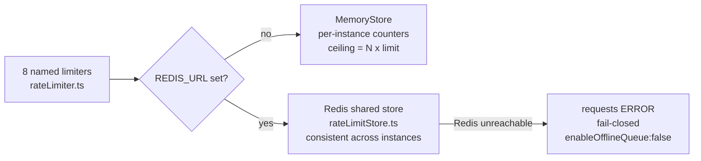
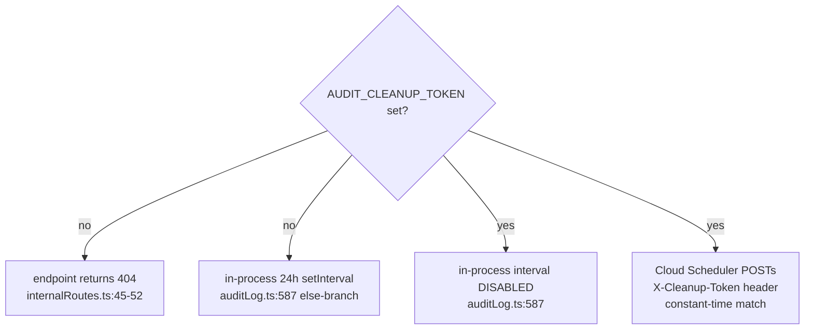

# ENV_VARS.md — Environment Variable Reference

> **Generated:** 2026-06-01
> **Scope:** Every environment variable consumed by OwnMyHealth — backend runtime, frontend build (`VITE_*`), CI, and Cloud Run deploy.
> **Primary source of truth:** `backend/src/config/index.ts` (the typed `config` object **and** all boot-time validation live in this one module — there is no `backend/src/index.ts`; the entry point is `backend/src/app.ts`).

## How to read this doc

This is a **reference**, not a tutorial. Start at the [Master table](#master-table) for the one-line summary of every variable, then jump to the [By category](#by-category) sections for defaults, consumers, and gotchas. If you only want to **boot the backend**, you need the three universal secrets (`JWT_ACCESS_SECRET`, `JWT_REFRESH_SECRET`, `AUDIT_LOG_SALT`) plus — in `production`/`staging` — `DATABASE_URL` and `PHI_ENCRYPTION_KEY`; see [Startup validation](#startup-validation). Everything else is defaulted or optional. Defaults shown are the literal right-hand side of the `??`/`||` in `config/index.ts`. Two facts that trip people up:

1. **Several vars are read straight from `process.env`, not through the `config` object** — `DATABASE_URL`, `DATABASE_POOL_SIZE`, `PHI_ENCRYPTION_KEY`, `DISABLE_CSRF`, `GCP_PROCESSOR_ID`, `GCP_LOCATION`, `GOOGLE_APPLICATION_CREDENTIALS`. A grep for `config.X` alone misses them.
2. **Two secrets are NOT freely rotatable** — `PHI_ENCRYPTION_KEY` and `AUDIT_LOG_SALT`. Rotating either makes existing encrypted PHI / audit logs undecryptable. See [Secret rotation policy](#secret-rotation-policy).

---

## Master table

Columns: **Name** · **Required?** (with the deciding line) · **Default** · **Format** · **Consumer(s)** · **Secret?** · **Where stored (prod)** · **Notes**.

| Name | Required? | Default | Format | Consumer(s) `file:line` | Secret? | Where stored (prod) | Notes |
|---|---|---|---|---|---|---|---|
| `NODE_ENV` | optional (`index.ts:40`) | `development` | enum `development`/`staging`/`production`/`test` | `config/index.ts:34-36,75`; `database.ts:122`; `fhir/mockFhirServer.ts:195` | no | Cloud Run env (`production`) | Drives prod/staging gates, cookie `secure`, sandbox defaults. |
| `PORT` | optional (`index.ts:41`) | `3001` | int | `config/index.ts:41`; `Dockerfile:49` | no | Cloud Run env (auto-set) | Cloud Run injects `PORT`; `app.ts` listens on `config.port`. |
| `DATABASE_URL` | **required in prod/staging** (`index.ts:344-352`); also throws when DB initializes (`database.ts:62-64`) | none | url (`postgres://`, `postgresql://`, or `prisma+postgres://`) | `database.ts:60`; `config/index.ts:344-352` | **yes** (contains DB password) | GCP Secret Manager → Cloud Run env | Cloud SQL connection string. `prisma+postgres://` form is decoded for local Prisma dev (`database.ts:68-82`). |
| `DATABASE_POOL_SIZE` | optional (`database.ts:110`) | `10` | int | `database.ts:110` | no | Cloud Run env (optional) | pg `Pool.max`. Read directly from `process.env`, NOT in `config`. |
| `JWT_ACCESS_SECRET` | **required everywhere** — `requireEnv` throws at module load (`index.ts:61`, `18-28`) | none | secret, ≥32 chars (`index.ts:264`) | `config/index.ts:61` → `config.jwt.accessSecret` (`authService.ts`) | **yes** | GCP Secret Manager → Cloud Run env | Rejected if a known-weak placeholder (`index.ts:250-255`). |
| `JWT_REFRESH_SECRET` | **required everywhere** — `requireEnv` throws (`index.ts:65`) | none | secret, ≥32 chars (`index.ts:271`) | `config/index.ts:65` → `config.jwt.refreshSecret` | **yes** | GCP Secret Manager → Cloud Run env | Placeholder/length checks at `index.ts:256-261,271-277`. |
| `JWT_ACCESS_EXPIRES_SECONDS` | optional (`index.ts:62`) | `900` (15 min) | int (**seconds**, not `15m`) | `config/index.ts:62` | no | Cloud Run env (optional) | Integer seconds; `jsonwebtoken` `expiresIn`-as-number. |
| `JWT_REFRESH_EXPIRES_SECONDS` | optional (`index.ts:66`) | `604800` (7 days) | int (seconds) | `config/index.ts:66` | no | Cloud Run env (optional) | — |
| `PHI_ENCRYPTION_KEY` | **required in prod/staging** (`index.ts:344-352`); EncryptionService throws hard everywhere if invalid (`encryption.ts:159-181`) | none | `hex:64` (256-bit) | `encryption.ts:159`; `config/index.ts:355` | **yes** | GCP Secret Manager → Cloud Run env | **NOT rotatable** — re-encrypts all PHI. 64-hex + placeholder checks at `index.ts:355-383`. |
| `AUDIT_LOG_SALT` | **required everywhere** — module-load gate (`index.ts:284-293`) | `''` (fails gate) | hex, ≥16 chars (`index.ts:283`) | `config/index.ts:54` → `config.auditSalt`; `auditLog.ts:148` | **yes** | GCP Secret Manager → Cloud Run env | **NOT rotatable** — breaks audit-log PHI decryption (HIPAA 7-yr). |
| `BCRYPT_ROUNDS` | optional (`index.ts:100`) | `13` | int | `config/index.ts:100`; `authService.ts:195` | no | Cloud Run env (optional) | `.env.example` says 12; code default is 13. |
| `MAX_LOGIN_ATTEMPTS` | optional (`index.ts:97`) | `5` | int | `config/index.ts:97`; `authService.ts:545-548` | no | Cloud Run env (optional) | Account lockout threshold. |
| `LOCKOUT_DURATION_MINUTES` | optional (`index.ts:98`) | `30` | int (minutes) | `config/index.ts:98`; `authService.ts:549` | no | Cloud Run env (optional) | Stored as ms internally. |
| `COOKIE_SAME_SITE` | optional (`index.ts:86`) | derived (`none` if `COOKIE_DOMAIN`, else `strict` in prod / `lax` in dev) | enum `strict`/`lax`/`none` | `config/index.ts:86`; `authController.ts:97,116,130,137` | no | Cloud Run env (cross-domain only) | Staging sets `none` (cross-domain). |
| `COOKIE_DOMAIN` | optional (`index.ts:88`) | `undefined` | string (e.g. `.ownmyhealth.io`) | `config/index.ts:87-88`; `authController.ts:100,119` | no | Cloud Run env (cross-domain only) | Leading dot for cross-subdomain. |
| `CORS_ORIGIN` | **required in prod** (`app.ts:82-85`); optional elsewhere (`index.ts:105`) | localhost list (`index.ts:105-111`) | comma-separated urls | `config/index.ts:105`; `app.ts:80` | no | Cloud Run env | Prod rejects `localhost`/`127.0.0.1` (`app.ts:87-88`). |
| `FRONTEND_URL` | optional (`index.ts:153`) | `http://localhost:5173` | url | `config/index.ts:153` → `config.email.frontendUrl`; `emailService.ts:350,372,395`; `emailTemplates.ts:47` | no | Cloud Run env | Builds verify / reset / confirm links in emails. |
| `RATE_LIMIT_WINDOW_MS` | optional (`index.ts:117`) | `900000` (15 min) | int (ms) | `config/index.ts:117` → `config.rateLimit.windowMs` | no | Cloud Run env (optional) | — |
| `RATE_LIMIT_MAX_REQUESTS` | optional (`index.ts:118`) | `100` | int | `config/index.ts:118` → `config.rateLimit.maxRequests` | no | Cloud Run env (optional) | Name is `_MAX_REQUESTS`, not `_MAX`. |
| `REDIS_URL` | optional (`index.ts:126`) | `''` (→ MemoryStore) | url (`redis://`) | `config/index.ts:126`; `rateLimitStore.ts:33,41` | no | Cloud Run env (optional) | Shared limiter store across instances. Fails closed if set + unreachable. |
| `AUDIT_CLEANUP_TOKEN` | optional (`index.ts:136`) | `''` (→ 404 + in-process interval) | secret string | `config/index.ts:136`; `internalRoutes.ts:43`; `auditLog.ts:587` | **yes** | GCP Secret Manager → Cloud Run env | Enables `POST /api/v1/internal/audit-cleanup`. |
| `ANTHROPIC_API_KEY` | optional (`index.ts:181`); warns in prod/staging if unset (`index.ts:431-433`) | `''` | secret (`sk-ant-…`) | `config/index.ts:181`; `anthropicClient.ts:49,68`; `claudeExtraction.ts:276`; `sbcExtraction.ts:1031` | **yes** | GCP Secret Manager → Cloud Run env | Unset → AI features unavailable (degrade, no crash). |
| `ANTHROPIC_BAA_ACTIVE` | conditionally required: **prod throws** if API key set + flag false (`index.ts:300-306`) | `false` | bool (`"true"`) | `config/index.ts:185` → `config.anthropic.baaActive`; `claudeExtraction.ts:106`; `sbcExtraction.ts:767` | no | Cloud Run env | Gates all PHI→Claude paths. |
| `AI_DAILY_BUDGET_USD` | optional (`index.ts:196`) | `50` | number (USD; `0`=off) | `config/index.ts:196` → `config.ai.dailyBudgetUsd` (`aiCostTracker`/`aiSpendGuard`) | no | Cloud Run env (optional) | Global circuit breaker. In-memory per instance. |
| `AI_USER_DAILY_BUDGET_USD` | optional (`index.ts:197`) | `5` | number (USD; `0`=off) | `config/index.ts:197` → `config.ai.userDailyBudgetUsd` | no | Cloud Run env (optional) | Per-user circuit breaker. In-memory per instance. |
| `GCP_PROJECT_ID` | optional (`index.ts:169`); warns in prod/staging if unset (`index.ts:437-439`) | `''` | string | `config/index.ts:169`; `ocrService.ts:83,115`; `storageService.ts:17` | no | Cloud Run env | Needed for GCS + Document AI. |
| `GCS_BUCKET_NAME` | **required in prod** (`index.ts:399-405`); optional elsewhere (`index.ts:168`) | `ownmyhealth-user-files` | string | `config/index.ts:168` → `config.gcp.bucketName`; `storageService.ts:25` | no | Cloud Run env | Default reserved for dev/staging — prod must set explicitly. |
| `GCP_PROCESSOR_ID` | optional (`index.ts:320`); if set + BAA false, **prod throws** (`index.ts:320-326`) | `undefined` | string | `ocrService.ts:86,117`; `config/index.ts:320` | no | Cloud Run env | Document AI processor; read directly from `process.env`. |
| `GCP_LOCATION` | optional (`ocrService.ts:116`) | `us` | string | `ocrService.ts:116` | no | Cloud Run env (optional) | Document AI region. Read directly from `process.env`. |
| `GOOGLE_APPLICATION_CREDENTIALS` | optional (`ocrService.ts:90`) | none | path or inline JSON | `ocrService.ts:90,471`; `config/index.ts:171` | **yes** (if inline JSON) | Cloud Run uses the service identity (usually unset) | Inline JSON (`{…}`) parsed at `ocrService.ts:92-96`. |
| `GOOGLE_BAA_ACTIVE` | conditionally required: **prod throws** if `GCP_PROCESSOR_ID` set + flag false (`index.ts:320-326`) | `false` | bool (`"true"`) | `config/index.ts:176` → `config.gcp.documentAiBaaActive`; `ocrService.ts:274` | no | Cloud Run env | Gates image OCR (`processImageWithDocumentAI`). |
| `QUEST_FHIR_CLIENT_ID` | optional (`index.ts:206`) | `''` | string | `config/index.ts:206`; `fhir/labSyncService.ts:56,60` | no | Cloud Run env (optional) | Empty ⇒ Quest sync disabled (throws at `fhir/labSyncService.ts:57`). |
| `QUEST_FHIR_CLIENT_SECRET` | optional (`index.ts:207`) | `''` | secret | `config/index.ts:207`; `fhir/labSyncService.ts:61`; `fhir/smartAuth.ts:182,222,284` | **yes** | GCP Secret Manager → Cloud Run env | OAuth client secret; only sent to `authHosts`. |
| `QUEST_FHIR_BASE_URL` | optional (`index.ts:208`) | `https://api.questdiagnostics.com/fhir/r4` | url | `config/index.ts:208`; `fhir/labSyncService.ts:63` | no | Cloud Run env | Set to mock server for local dev. |
| `QUEST_FHIR_REDIRECT_URI` | optional (`index.ts:210`) | `https://api.ownmyhealth.io/api/v1/fhir/callback` | url | `config/index.ts:210`; `fhir/labSyncService.ts:62` | no | Cloud Run env | Must match Quest app registration. |
| `QUEST_FHIR_SUCCESS_REDIRECT` | optional (`index.ts:213`) | `http://localhost:5173/settings?labConnected=quest` | url | `config/index.ts:213` | no | Cloud Run env | Where the OAuth callback sends the browser on success. |
| `QUEST_FHIR_AUTH_HOSTS` | optional (`index.ts:220`) | `''` (→ FHIR base host only) | comma-separated hostnames | `config/index.ts:220` → `config.quest.authHosts`; `fhir/labSyncService.ts:64` | no | Cloud Run env | SSRF/token-exfil allowlist for authorize/token/revoke. |
| `SENDGRID_API_KEY` | optional (`index.ts:150`); warns in prod/staging if unset (`index.ts:434-436`) | `''` | secret (`SG.…`) | `config/index.ts:150` → `config.email.sendgridApiKey`; `emailService.ts:43` | **yes** | GCP Secret Manager → Cloud Run env | Unset ⇒ `config.email.enabled=false` (`index.ts:149`). |
| `EMAIL_FROM` | optional (`index.ts:151`) | `noreply@ownmyhealth.com` | email | `config/index.ts:151` → `config.email.fromEmail`; `emailService.ts:313` | no | Cloud Run env | Must be a SendGrid verified sender in prod. |
| `EMAIL_FROM_NAME` | optional (`index.ts:152`) | `OwnMyHealth` | string | `config/index.ts:152`; `emailService.ts:314` | no | Cloud Run env | Display name. |
| `SENDGRID_SANDBOX_MODE` | optional (`index.ts:158`); **prod throws** if `"true"` (`index.ts:421-427`) | `false` (auto-`true` in staging) | bool (`"true"`) | `config/index.ts:158` → `config.email.sandboxMode`; `emailService.ts:323,329` | no | Cloud Run env (must be unset/false in prod) | Validates but never delivers. |
| `DEMO_ACCOUNT_ENABLED` | optional (`index.ts:142`); **prod throws** if `true` (`index.ts:408-414`) | `false` | bool (`"true"`) | `config/index.ts:142` → `config.demo.enabled` | no | Cloud Run env (must be false in prod) | Allowed in staging for smoke tests. |
| `DEMO_EMAIL` | optional (`index.ts:143`) | `''` | email | `config/index.ts:143` → `config.demo.email` | no | Cloud Run env (staging only) | — |
| `DEMO_PASSWORD` | optional (`index.ts:144`) | `''` | secret | `config/index.ts:144` → `config.demo.password` | **yes** | GCP Secret Manager (staging only) | `.env.staging.example:88` notes inject from Secret Manager. |
| `DISABLE_CSRF` | optional (`csrf.ts:146`) | unset (CSRF on) | bool (`"true"`) | `csrf.ts:146`; `app.ts:215` | no | n/a — refused in prod | Only honored when `config.isDevelopment` (`csrf.ts:146`). |
| `VITE_API_URL` | **build-time** (`client.ts:10`) | `http://localhost:3001/api/v1` | url | `src/services/api/client.ts:10`; `src/services/uploadUtils.ts:8` | no | baked into JS bundle at build (`deploy.yml:222`) | Set by CI/deploy, not at runtime. |
| `VITE_DEMO_MODE` | **build-time** (`App.tsx:281`) | unset | bool (`"true"`) | `src/App.tsx:281`; `src/hooks/useBiomarkerData.ts:18` | no | not set in prod builds | Demo login button; gated by `import.meta.env.DEV`. |
| `VITE_DEBUG` | **build-time** (`logger.ts:17`) | unset | bool (`"true"`) | `src/utils/logger.ts:17` | no | not set in prod builds | Verbose client console logging. |

> Vite built-ins `import.meta.env.DEV` / `import.meta.env.PROD` (`logger.ts:14`, `client.ts:125,233`, `LoginPage.tsx:79,90`) are set automatically by Vite from the build mode — they are not user-supplied env vars and need no entry.

---

## By category

### Critical secrets

These five never appear in logs and never get committed. Three throw at **module load in every environment**; two more throw only in prod/staging.

| Var | Throws when | Line |
|---|---|---|
| `JWT_ACCESS_SECRET` | missing/empty (any env); weak placeholder; <32 chars | `index.ts:61,250,264` |
| `JWT_REFRESH_SECRET` | missing/empty (any env); weak placeholder; <32 chars | `index.ts:65,256,271` |
| `AUDIT_LOG_SALT` | missing or <16 chars (any env) | `index.ts:284-293` |
| `PHI_ENCRYPTION_KEY` | missing (prod/staging); not 64-hex; placeholder; also EncryptionService throws everywhere on invalid | `index.ts:355-383`; `encryption.ts:159-181` |
| `DATABASE_URL` | missing (prod/staging); missing at DB init (any env) | `index.ts:344-352`; `database.ts:62-64` |

Third-party API-key secrets (`ANTHROPIC_API_KEY`, `SENDGRID_API_KEY`, `QUEST_FHIR_CLIENT_SECRET`, `DEMO_PASSWORD`, `AUDIT_CLEANUP_TOKEN`, inline `GOOGLE_APPLICATION_CREDENTIALS`) are optional secrets — features degrade if unset, but they are still secrets that belong in Secret Manager.

```ts
// Source: backend/src/config/index.ts:18-28 (requireEnv — module-load throw for JWT secrets)
function requireEnv(key: string): string {
  const value = process.env[key];
  if (!value || value.trim() === '') {
    throw new Error(
      `Missing required environment variable: ${key}. ` +
      `This secret must be set in every environment (dev, staging, prod). ` +
      `Generate with: openssl rand -base64 32`
    );
  }
  return value;
}
```

### Database & persistence

- `DATABASE_URL` — Cloud SQL Postgres connection string. Read at `database.ts:60`; throws `DATABASE_URL environment variable is not set` if absent (`database.ts:62-64`). Accepts `postgres://`, `postgresql://`, and `prisma+postgres://` (the last is base64-decoded for local Prisma dev, `database.ts:68-82`).
- `DATABASE_POOL_SIZE` — pg `Pool.max`, default `10` (`database.ts:110`). Read directly from `process.env`, **not** through `config`.

```ts
// Source: backend/src/services/database.ts:108-114
pool = new Pool({
  connectionString,
  max: parseInt(process.env.DATABASE_POOL_SIZE || '10', 10),
  idleTimeoutMillis: 30000,
  connectionTimeoutMillis: 30000, // 30s for Cloud SQL Auth Proxy
  statement_timeout: 30000, // 30s statement timeout
});
```

### Auth & sessions

| Var | Default | Effect | Source |
|---|---|---|---|
| `JWT_ACCESS_EXPIRES_SECONDS` | `900` | Access-token lifetime (seconds) | `index.ts:62` |
| `JWT_REFRESH_EXPIRES_SECONDS` | `604800` | Refresh-token lifetime (seconds) | `index.ts:66` |
| `BCRYPT_ROUNDS` | `13` | Password hash cost (`authService.ts:195`) | `index.ts:100` |
| `MAX_LOGIN_ATTEMPTS` | `5` | Lockout threshold (`authService.ts:545-548`) | `index.ts:97` |
| `LOCKOUT_DURATION_MINUTES` | `30` | Lockout window (`authService.ts:549`) | `index.ts:98` |
| `COOKIE_SAME_SITE` | derived | Cookie `SameSite` (`authController.ts:97`) | `index.ts:86` |
| `COOKIE_DOMAIN` | `undefined` | Cross-subdomain cookie scope (`authController.ts:100`) | `index.ts:88` |

`COOKIE_SAME_SITE` resolution is a precedence chain — explicit env wins, else `none` if `COOKIE_DOMAIN` is set, else `strict` in prod / `lax` in dev:

```ts
// Source: backend/src/config/index.ts:86-88
sameSite: (process.env.COOKIE_SAME_SITE as 'strict' | 'lax' | 'none') ||
  (process.env.COOKIE_DOMAIN ? 'none' : (process.env.NODE_ENV === 'production' ? 'strict' : 'lax')),
domain: process.env.COOKIE_DOMAIN || undefined,
```

There is **no `CSRF_SECRET`**. CSRF is a stateless double-submit cookie (`csrf.ts`) with no server-side secret — the only knob is `DISABLE_CSRF` (dev only). See [Feature flags / toggles](#feature-flags--baa-gates--toggles).

### Rate limiting



- `RATE_LIMIT_WINDOW_MS` (`900000`) and `RATE_LIMIT_MAX_REQUESTS` (`100`) feed `config.rateLimit` (`index.ts:117-118`).
- `REDIS_URL` (default `''`) backs all limiters with a shared store when set (`rateLimitStore.ts:33`). Unset → in-process `MemoryStore`, so the effective ceiling is N×limit across N Cloud Run instances (bounded today by `--max-instances=3`, `deploy.yml:88`). **Failure mode:** if `REDIS_URL` is set but unreachable, rate-limited requests **error** rather than silently skip the limit — the client is built with `maxRetriesPerRequest: 2, enableOfflineQueue: false` (`rateLimitStore.ts:44-45`).

### AI — Anthropic + spend circuit breaker + Google Document AI

| Var | Default | Gates / drives | Source |
|---|---|---|---|
| `ANTHROPIC_API_KEY` | `''` | All Claude calls; unset = AI off | `index.ts:181`; `anthropicClient.ts:49` |
| `ANTHROPIC_BAA_ACTIVE` | `false` | PHI→Claude runtime gate | `index.ts:185`; `claudeExtraction.ts:106`; `sbcExtraction.ts:767` |
| `AI_DAILY_BUDGET_USD` | `50` | Global daily spend cap | `index.ts:196` |
| `AI_USER_DAILY_BUDGET_USD` | `5` | Per-user daily spend cap | `index.ts:197` |
| `GCP_PROCESSOR_ID` | `undefined` | Document AI processor name | `ocrService.ts:117` |
| `GCP_LOCATION` | `us` | Document AI region | `ocrService.ts:116` |
| `GOOGLE_BAA_ACTIVE` | `false` | Image-OCR runtime gate | `index.ts:176`; `ocrService.ts:274` |

The model is **pinned in code, not configurable** — there is no `ANTHROPIC_MODEL` var. Models in use: `claude-haiku-4-5-20251001` (biomarker guidance / extraction — `biomarkerRoutes.ts:233`, `claudeExtraction.ts:146`, `aiChatController.ts:39`) and `claude-sonnet-4-5-20250929` (SBC extraction / cost analysis — `sbcExtraction.ts:804`, `expenseController.ts:689`).

BAA runtime gate (the load-bearing check in dev/staging, where boot only warns):

```ts
// Source: backend/src/services/claudeExtraction.ts:106-110
if (!config.anthropic.baaActive) {
  throw new InternalServerError(
    'Claude API calls with PHI require an active BAA. ' +
    'Set ANTHROPIC_BAA_ACTIVE=true after confirming BAA coverage. See SECURITY_STATUS.md C-7.'
  );
}
```

```ts
// Source: backend/src/services/ocrService.ts:274-279 (Document AI image gate)
if (!config.gcp.documentAiBaaActive) {
  throw new InternalServerError(
    'Document AI image OCR requires an active BAA. Image bytes contain patient ' +
    'demographics that redaction cannot scrub. Set GOOGLE_BAA_ACTIVE=true after ' +
    'confirming Google Cloud BAA coverage for Document AI. See SECURITY_STATUS.md.'
  );
}
```

**Spend circuit breaker caveat:** the accumulator is in-memory per Cloud Run instance (`config/index.ts:188-194` comment; `aiSpendGuard.ts:30` reads `isAISpendExceeded`). Under autoscale the effective ceiling is N×budget. `aiSpendGuard` is wired onto AI routes after `aiLimiter` (`expenseRoutes.ts:113-114`, `aiRoutes.ts:31-32`, `biomarkerRoutes.ts:30`) and fails closed with 503 when exceeded (`aiSpendGuard.ts:41-47`).

### Quest Diagnostics SMART-on-FHIR lab sync

| Var | Default | Source |
|---|---|---|
| `QUEST_FHIR_CLIENT_ID` | `''` | `index.ts:206` |
| `QUEST_FHIR_CLIENT_SECRET` | `''` | `index.ts:207` |
| `QUEST_FHIR_BASE_URL` | `https://api.questdiagnostics.com/fhir/r4` | `index.ts:208` |
| `QUEST_FHIR_REDIRECT_URI` | `https://api.ownmyhealth.io/api/v1/fhir/callback` | `index.ts:210` |
| `QUEST_FHIR_SUCCESS_REDIRECT` | `http://localhost:5173/settings?labConnected=quest` | `index.ts:213` |
| `QUEST_FHIR_AUTH_HOSTS` | `''` | `index.ts:220` |

The feature is **disabled unless `QUEST_FHIR_CLIENT_ID` is set** — `fhir/labSyncService.ts:56-57` throws `Quest FHIR integration is not configured: QUEST_FHIR_CLIENT_ID missing`. To run against the **mock FHIR server locally**, set `QUEST_FHIR_BASE_URL=http://localhost:3001/api/v1/mock-fhir/r4` (`.env.example:224`, `config/index.ts:202-204` comment); the mock server refuses to load when `NODE_ENV=production` (`fhir/mockFhirServer.ts:195`).

`QUEST_FHIR_AUTH_HOSTS` is an **SSRF / token-exfil allowlist** (`config/index.ts:216-223`). The patient Bearer token and OAuth `client_secret` are only ever sent to the FHIR base host plus these extra hosts; empty means the authorize/token/revoke endpoints must live on the FHIR base host. Wired into the SMART config at `fhir/labSyncService.ts:64` (`allowedAuthHosts: config.quest.authHosts`).

```ts
// Source: backend/src/config/index.ts:220-223
authHosts: (process.env.QUEST_FHIR_AUTH_HOSTS || '')
  .split(',')
  .map((h) => h.trim().toLowerCase())
  .filter(Boolean),
```

> `LabConnection.accessTokenEncrypted` / `refreshTokenEncrypted` hold the resulting OAuth tokens — treated as PHI (a stolen token reaches live lab PHI). See [PHI_TAXONOMY.md](./PHI_TAXONOMY.md).

### Email (SendGrid)

- `SENDGRID_API_KEY` (`''`) — presence flips `config.email.enabled` (`index.ts:149`); unset = email disabled (`emailService.ts:294`).
- `EMAIL_FROM` (`noreply@ownmyhealth.com`) / `EMAIL_FROM_NAME` (`OwnMyHealth`) — sender identity (`emailService.ts:313-314`). The var is `EMAIL_FROM`, not `SENDGRID_FROM_EMAIL`.
- `SENDGRID_SANDBOX_MODE` (`false`, auto-`true` in staging) — validates but never delivers (`emailService.ts:323,329`). **Prod refuses to boot if `"true"`** (`index.ts:421-427`).

### File storage (GCS)

- `GCS_BUCKET_NAME` — default `ownmyhealth-user-files` (`index.ts:168`), consumed at `storageService.ts:25`. **Prod must set it explicitly** (`index.ts:399-405`) — the default is dev/staging-only to avoid PHI landing in the wrong namespace.
- `GCP_PROJECT_ID` — `storageService.ts:17`, `ocrService.ts:83,115`.
- `GOOGLE_APPLICATION_CREDENTIALS` — file path **or** inline JSON (`ocrService.ts:90-96`); on Cloud Run usually unset (the service identity is used).

### Scheduled maintenance / ops

`AUDIT_CLEANUP_TOKEN` (`''`) enables `POST /api/v1/internal/audit-cleanup`:



When set, the in-process interval is skipped (`auditLog.ts:584-587`) and the endpoint authenticates a `X-Cleanup-Token` header via constant-time compare (`internalRoutes.ts:43-62`); 404 when unset, 401 on bad token (`internalRoutes.ts:38`). The interval rarely fires on scale-to-zero Cloud Run, which is why the token-driven path exists (`config/index.ts:129-134`).

### CORS & frontend URLs

- `CORS_ORIGIN` — read in both `config/index.ts:105` and `app.ts:80` (`getSafeCorsOrigins`). Prod requires it and rejects localhost (`app.ts:82-92`); the actual allow-list unions env origins with hardcoded production hosts (`app.ts:65,90`). Staging: `https://staging.ownmyhealth.io` (`.env.staging.example:53`); prod: `https://ownmyhealth.io` (`.env.production.example:58`).
- `FRONTEND_URL` — used to build email links (`emailService.ts:350,372,395`).

### Demo mode

`DEMO_ACCOUNT_ENABLED` / `DEMO_EMAIL` / `DEMO_PASSWORD` (`index.ts:142-144`). **Prod refuses to boot with demo enabled** (`index.ts:408-414`); staging enables it for smoke tests (`.env.staging.example:86-88`).

### Feature flags / BAA gates / toggles

| Var | Role | Prod behavior |
|---|---|---|
| `ANTHROPIC_BAA_ACTIVE` | Gate PHI→Claude | Throws if API key set + flag false (`index.ts:300-306`) |
| `GOOGLE_BAA_ACTIVE` | Gate image OCR | Throws if `GCP_PROCESSOR_ID` set + flag false (`index.ts:320-326`) |
| `DISABLE_CSRF` | Bypass CSRF | Honored only in dev (`csrf.ts:146`); ignored in prod |
| `SENDGRID_SANDBOX_MODE` | Suppress email delivery | Throws if `"true"` (`index.ts:421-427`) |

### CI/CD-only (GitHub Secrets — deploy time, never read at runtime)

| Secret | Used at | Source |
|---|---|---|
| `secrets.GCP_SA_KEY` | `google-github-actions/auth@v2` in all deploy jobs | `deploy.yml:43,156,202`; `deploy-staging.yml:31,93` |

CI also injects build-time env inline (not GitHub Secrets): `VITE_API_URL` (`ci.yml:40`, `deploy.yml:222`), and CI test fixtures set `DATABASE_URL` / `PHI_ENCRYPTION_KEY` / `SUPERUSER_DATABASE_URL` for the RLS job (`ci.yml:163-169`).

### Frontend build-time (`VITE_*`)

Embedded into the JS bundle at `npm run build`; changing them requires a rebuild, not a redeploy of env. `VITE_API_URL` (`client.ts:10`, `uploadUtils.ts:8`), `VITE_DEMO_MODE` (`App.tsx:281`, `useBiomarkerData.ts:18`), `VITE_DEBUG` (`logger.ts:17`). Prod build sets only `VITE_API_URL=https://api.ownmyhealth.io/api/v1` (`deploy.yml:222`).

---

## Startup validation

All boot-time throws live in `backend/src/config/index.ts`, executed at module load (imported transitively by `app.ts`). Order and triggers:

| # | Check | Scope | Throws when | Line |
|---|---|---|---|---|
| 1 | `requireEnv('JWT_ACCESS_SECRET')` | every env | missing/empty | `index.ts:61` |
| 2 | `requireEnv('JWT_REFRESH_SECRET')` | every env | missing/empty | `index.ts:65` |
| 3 | `BLOCKED_JWT_VALUES` | every env | secret is a known placeholder | `index.ts:250-261` |
| 4 | `MIN_JWT_SECRET_LENGTH` (32) | every env | secret <32 chars | `index.ts:264-277` |
| 5 | `AUDIT_LOG_SALT` ≥16 | every env | missing or too short | `index.ts:284-293` |
| 6 | Anthropic BAA gate | prod throws / dev+staging warn | API key set + BAA false | `index.ts:300-313` |
| 7 | Document AI BAA gate | prod throws / dev+staging warn | `GCP_PROCESSOR_ID` set + BAA false | `index.ts:320-333` |
| 8 | `requiredEnvVars` (`DATABASE_URL`, `PHI_ENCRYPTION_KEY`) | prod+staging | either missing | `index.ts:344-352` |
| 9 | `PHI_ENCRYPTION_KEY` 64-hex + placeholder | prod+staging | <64 / non-hex / placeholder | `index.ts:355-383` |
| 10 | `GCS_BUCKET_NAME` set | prod only | unset | `index.ts:399-405` |
| 11 | `DEMO_ACCOUNT_ENABLED` false | prod only | `true` | `index.ts:408-414` |
| 12 | `SENDGRID_SANDBOX_MODE` not true | prod only | `"true"` | `index.ts:421-427` |

```ts
// Source: backend/src/config/index.ts:344-352 (prod/staging required-vars gate)
const requiredEnvVars = [
  'DATABASE_URL',
  'PHI_ENCRYPTION_KEY',
];
const missing = requiredEnvVars.filter(key => !process.env[key]);

if (missing.length > 0) {
  throw new Error(`Missing required environment variables for ${envLabel}: ${missing.join(', ')}`);
}
```

```ts
// Source: backend/src/config/index.ts:284-293 (audit-salt gate — NOT rotatable)
const MIN_AUDIT_SALT_LENGTH = 16;
if (!config.auditSalt || config.auditSalt.length < MIN_AUDIT_SALT_LENGTH) {
  throw new Error(
    `AUDIT_LOG_SALT must be set and at least ${MIN_AUDIT_SALT_LENGTH} characters. ` +
    `Historic audit logs are encrypted with this salt — rotating it breaks decryption. ` +
    `For new environments, generate with: openssl rand -hex 32. ` +
    `For existing production envs, extract the plaintext salt from ` +
    `system_config.audit_encryption_salt (decrypt with PHI_ENCRYPTION_KEY) ` +
    `before setting AUDIT_LOG_SALT.`
  );
}
```

```ts
// Source: backend/src/config/index.ts:355-363 (PHI key 64-hex gate, prod/staging)
const phiKey = process.env.PHI_ENCRYPTION_KEY!;
const hexRegex = /^[0-9a-fA-F]+$/;

if (phiKey.length < 64) {
  throw new Error(
    `PHI_ENCRYPTION_KEY must be at least 64 hex characters (256 bits). Current length: ${phiKey.length}. ` +
    `Generate with: openssl rand -hex 32`
  );
}
```

Reproduce a boot failure locally (missing JWT secret):

```bash
cd backend
# With no JWT_ACCESS_SECRET set, importing config throws at module load:
node -e "require('./dist/config/index.js')"
# → Error: Missing required environment variable: JWT_ACCESS_SECRET. ...
```

Generate the secrets the gates demand:

```bash
openssl rand -base64 32   # JWT_ACCESS_SECRET, JWT_REFRESH_SECRET (≥32 chars)
openssl rand -hex 32      # PHI_ENCRYPTION_KEY (64 hex), AUDIT_LOG_SALT (64 hex)
```

---

## Secret rotation policy

| Secret | Rotatable? | Cadence | Where it lives (prod) | Procedure / caveat |
|---|---|---|---|---|
| `JWT_ACCESS_SECRET` | yes | TBD (external: cadence not recorded in repo — resolve via [RUNBOOK.md](./RUNBOOK.md) / GCP Secret Manager) | GCP Secret Manager → Cloud Run env | Rotating invalidates all live access tokens (15-min TTL — low blast radius). |
| `JWT_REFRESH_SECRET` | yes | TBD (external: cadence not recorded in repo — resolve via [RUNBOOK.md](./RUNBOOK.md)) | GCP Secret Manager → Cloud Run env | Rotating logs everyone out (refresh tokens become invalid). |
| `PHI_ENCRYPTION_KEY` | **NO — not freely rotatable** | n/a | GCP Secret Manager → Cloud Run env | Master key for all per-user PHI. Rotation requires re-encrypting every PHI row. No in-repo rotation procedure exists. TBD (external: documented re-encryption migration does not exist in repo — resolve by designing one, see [SECURITY_STATUS.md](./SECURITY_STATUS.md)). |
| `AUDIT_LOG_SALT` | **NO — not freely rotatable** | n/a | GCP Secret Manager → Cloud Run env | Historic audit-log PHI is encrypted with this salt; rotating makes 7-yr-retained logs undecryptable. Gate hard-fails (`index.ts:284-293`). Migration note for existing prod: extract from `system_config.audit_encryption_salt` (`index.ts:48-53`). |
| `ANTHROPIC_API_KEY` | yes | TBD (external: cadence in ops runbook outside repo) | GCP Secret Manager → Cloud Run env | After rotation, `anthropicClient.reset()` rebuilds the singleton (`anthropicClient.ts:75-77`). |
| `SENDGRID_API_KEY` | yes | TBD (external: cadence not in repo) | GCP Secret Manager → Cloud Run env | — |
| `QUEST_FHIR_CLIENT_SECRET` | yes | TBD (external: governed by Quest app registration) | GCP Secret Manager → Cloud Run env | — |
| `AUDIT_CLEANUP_TOKEN` | yes | TBD (external: cadence not in repo) | GCP Secret Manager → Cloud Run env | `openssl rand -base64 32` (`.env.example:163`). |
| `DATABASE_URL` (password) | yes | TBD (external: tied to Cloud SQL user) | GCP Secret Manager → Cloud Run env | Rotate the Cloud SQL password, then update the secret. |
| `DEMO_PASSWORD` | yes (staging) | as needed | GCP Secret Manager (staging only) | `openssl rand -base64 16` (`.env.example:178`). |

> **Where stored (prod) caveat:** the repo confirms production runs on **GCP Cloud Run** (`deploy.yml`, `PROJECT_ID: ownmyhealth-prod`), and that secrets are GitHub Secret (`GCP_SA_KEY`) for CI plus Cloud Run runtime env for the rest. The repo does **not** record which specific Secret Manager secret names map to which env var. TBD (external: secret-name → env-var mapping and rotation cadence live in GCP Console / ops runbook — resolve via GCP Secret Manager in project `ownmyhealth-prod`).

---

## Local vs staging vs prod

| Var | Local (dev) | Staging | Prod |
|---|---|---|---|
| `NODE_ENV` | `development` | `staging` | `production` |
| `DATABASE_URL` | local Postgres / `prisma+postgres://` | staging Cloud SQL | prod Cloud SQL (Secret Manager) |
| `CORS_ORIGIN` | localhost list (default) | `https://staging.ownmyhealth.io` | `https://ownmyhealth.io` |
| `COOKIE_DOMAIN` / `COOKIE_SAME_SITE` | unset / `lax` | `.ownmyhealth.io` / `none` | usually unset / `strict` |
| `ANTHROPIC_BAA_ACTIVE` | `false` (warn) | `false` (Claude blocked by gate) | `true` (required if key set) |
| `SENDGRID_SANDBOX_MODE` | optional | `true` (no real email) | must be false (boot-fail if true) |
| `DEMO_ACCOUNT_ENABLED` | `true` (optional) | `true` | must be false (boot-fail if true) |
| `GCS_BUCKET_NAME` | default fallback | `ownmyhealth-user-files-staging` | must be set explicitly |
| `DISABLE_CSRF` | may be `true` | honored only if dev | ignored |
| `VITE_API_URL` (build) | `http://localhost:3001/api/v1` | `https://api-staging.ownmyhealth.io/api/v1` | `https://api.ownmyhealth.io/api/v1` |

Evidence: `.env.staging.example` (lines 17,23,48,53,58-59,78,86,94,99-103), `.env.production.example` (lines 17,53,58), `.env.staging` (line 5), `deploy.yml:222`, `deploy-staging.yml:113`.

---

## Drift findings

Generated by grepping `process\.env\.[A-Z_]+` / `import\.meta\.env\.[A-Z_]+` across `backend/src/**`, `src/**`, workflows, then diffing against `.env*.example` files.

| Env var | Declared in `config/index.ts`? | In an `.env*.example`? | Code usage (grep)? | Notes |
|---|---|---|---|---|
| `CMS_API_KEY` | no | yes (`backend/.env.example:196`, `.env.production.example:89`) | **0 hits** (`*.ts/.tsx/.js`) | Leftover from removed CMS Marketplace feature — safe to delete. |
| `CMS_API_BASE_URL` | no | yes (`backend/.env.example:198`) | **0 hits** | Same — dead. |
| `CMS_API_TIMEOUT_MS` | no | yes (`backend/.env.example:200`) | **0 hits** | Same — dead. |
| `OPENAI_API_KEY` | no | yes (`backend/.env.example:203`) | **0 hits** | App uses Anthropic, not OpenAI — dead. |
| `RLS_ENFORCEMENT` | no | yes (`backend/.env.example:95`, `.env.staging.example:41`) | only a doc comment (`database.ts:210`), never read | Strict-mode flag removed at the `omh_app` NOBYPASSRLS cutover — dead var in examples. |
| `VITE_SUPABASE_URL` | n/a (frontend) | yes (`.env.example:32`, `.env.production.example:14`) | **0 hits** | App does not use Supabase — dead. |
| `VITE_SUPABASE_ANON_KEY` | n/a (frontend) | yes (`.env.example:33`, `.env.production.example:15`) | **0 hits** | Same — dead. |
| `GCP_LOCATION` | **no** (read only in `ocrService.ts:116`) | no | 1 hit | Read directly from `process.env`, defaulted to `us`. Not drift — just not in `config`. |
| `DATABASE_POOL_SIZE` | **no** (read only in `database.ts:110`) | no | 1 hit | Read directly from `process.env`. Not in any example; consider documenting. |
| `BCRYPT_ROUNDS` default mismatch | yes (`index.ts:100`, default `13`) | yes (`.env.example:109` says `12`) | — | Comment/example says 12; code default is 13. Example is stale. |

Grep counts run 2026-06-01: `CMS_API|OPENAI|VITE_SUPABASE|RLS_ENFORCEMENT` → 1 total hit across `**/*.{ts,tsx,js,jsx}`, and that single hit is the `RLS_ENFORCEMENT` doc comment at `database.ts:210` (not an actual read).

---

## Acceptance questions (self-answered)

1. **Strictly required to boot in production?** `JWT_ACCESS_SECRET`, `JWT_REFRESH_SECRET`, `AUDIT_LOG_SALT` (every env), plus `DATABASE_URL`, `PHI_ENCRYPTION_KEY` (prod/staging). Also `GCS_BUCKET_NAME` and `CORS_ORIGIN` in prod. See [Startup validation](#startup-validation).
2. **If `JWT_ACCESS_SECRET` is omitted?** `requireEnv` throws at module load — `config/index.ts:18-28`, called at `index.ts:61`.
3. **PHI-adjacent secrets / not rotatable?** PHI-adjacent: `PHI_ENCRYPTION_KEY`, `AUDIT_LOG_SALT`, plus `LabConnection` token-derived secrets via `QUEST_FHIR_CLIENT_SECRET`. NOT rotatable: `PHI_ENCRYPTION_KEY`, `AUDIT_LOG_SALT`. See [Secret rotation policy](#secret-rotation-policy).
4. **Build-time vs runtime?** Build-time: `VITE_API_URL`, `VITE_DEMO_MODE`, `VITE_DEBUG` (baked into the bundle). Everything else is runtime. See [Frontend build-time](#frontend-build-time-vite_).
5. **Where is `DATABASE_URL` stored / provisioned?** GCP Secret Manager → Cloud Run env. A new deploy gets it via the Cloud Run service config (set with `gcloud run ... --set-env-vars` / Secret Manager reference); CI only authenticates with `GCP_SA_KEY`. See [Master table](#master-table) and [Secret rotation policy](#secret-rotation-policy).
6. **Anthropic / Document AI BAA gates?** `ANTHROPIC_BAA_ACTIVE` → `claudeExtraction.ts:106` + `sbcExtraction.ts:767`; `GOOGLE_BAA_ACTIVE` → `ocrService.ts:274` (`processImageWithDocumentAI`). See [AI category](#ai--anthropic--spend-circuit-breaker--google-document-ai).
7. **CORS origin staging vs prod / which file?** Staging `https://staging.ownmyhealth.io`, prod `https://ownmyhealth.io`; read in `config/index.ts:105` and `app.ts:80`. See [CORS & frontend URLs](#cors--frontend-urls).
8. **Defaults safe for dev but not prod?** `GCS_BUCKET_NAME` (default reserved for dev/staging), `EMAIL_FROM` (`noreply@ownmyhealth.com` — must be a verified sender), the Quest FHIR redirect URIs (default points at prod host). See [Local vs staging vs prod](#local-vs-staging-vs-prod).
9. **`PHI_ENCRYPTION_KEY` rotation procedure?** None exists in the repo — flagged `TBD (external: re-encryption migration does not exist)` in [Secret rotation policy](#secret-rotation-policy).
10. **GitHub Actions secrets used at deploy only?** `secrets.GCP_SA_KEY` (`deploy.yml:43`). See [CI/CD-only](#cicd-only-github-secrets--deploy-time-never-read-at-runtime).
11. **AI spend breaker config + caveat?** `AI_DAILY_BUDGET_USD` (50) / `AI_USER_DAILY_BUDGET_USD` (5), enforced by `aiSpendGuard` reading `aiCostTracker`; accumulator is in-memory per Cloud Run instance, so effective ceiling is N×budget. See [AI category](#ai--anthropic--spend-circuit-breaker--google-document-ai).
12. **Quest enable vs mock + what `QUEST_FHIR_AUTH_HOSTS` protects?** Enable: set `QUEST_FHIR_CLIENT_ID` (+secret); mock: set `QUEST_FHIR_BASE_URL=http://localhost:3001/api/v1/mock-fhir/r4`. `QUEST_FHIR_AUTH_HOSTS` is an SSRF/token-exfil allowlist for the authorize/token/revoke endpoints. See [Quest FHIR](#quest-diagnostics-smart-on-fhir-lab-sync).
13. **Rate-limit state across instances + failure mode?** `REDIS_URL` backs a shared store; if set but unreachable, requests fail closed (error) because `enableOfflineQueue:false` (`rateLimitStore.ts:44-45`). See [Rate limiting](#rate-limiting).
14. **`AUDIT_CLEANUP_TOKEN` — what it enables / absence behavior?** Enables `POST /api/v1/internal/audit-cleanup` (Cloud Scheduler driven) and disables the in-process interval; unset → endpoint 404s and an in-process 24h `setInterval` runs. See [Scheduled maintenance / ops](#scheduled-maintenance--ops).

---

## Related Documents

- [ARCHITECTURE.md](./ARCHITECTURE.md) — how these vars wire into the middleware stack, CORS, and the Cloud Run deployment topology.
- [RUNBOOK.md](./RUNBOOK.md) — operational procedures for setting and rotating secrets in production (Secret Manager / Cloud Run).
- [LOCAL_DEV.md](./LOCAL_DEV.md) — how to populate `.env` for a local stack (mock FHIR, demo account, dev defaults).
- [PHI_TAXONOMY.md](./PHI_TAXONOMY.md) — context for `PHI_ENCRYPTION_KEY`, `AUDIT_LOG_SALT`, and Quest OAuth-token PHI.
- [SECURITY_STATUS.md](./SECURITY_STATUS.md) — open secret-management findings (C-7 BAA gates, C-8 audit-salt move, PHI key rotation gap).
- [TROUBLESHOOTING.md](./TROUBLESHOOTING.md) — diagnosing boot failures from missing/invalid env vars.

---

## Prompt drift log

- `./35-env-vars-doc.md` lists `BCRYPT_ROUNDS` default as the spec's "Account security" set without a value; the **code default is `13`** (`config/index.ts:100`), while `backend/.env.example:109` still documents `12`. The example file is stale — prompt/example author should bump it to 13.
- `./35-env-vars-doc.md` references `.env.staging` (repo root) as a frontend env file — confirmed it contains only `VITE_API_URL` (`.env.staging:5`). No drift, noted for completeness. There is **no** root `.env.staging.example`; the staging frontend file is `.env.staging` (un-suffixed), loaded via `vite build --mode staging` (`deploy-staging.yml:113`).
- `RLS_ENFORCEMENT` lingers in **both** `backend/.env.example:95` and `backend/.env.staging.example:41` (spec mentions `.env.example` / `.env.staging.example`) — confirmed dead in code (only the `database.ts:210` doc comment). Logged in the [Drift table](#drift-findings).
- Spec's master-table guidance lists `GCP_LOCATION` and `DATABASE_POOL_SIZE` as read directly from `process.env` (not `config`) — confirmed (`ocrService.ts:116`, `database.ts:110`). No `config` field exists for either; documented as such rather than inventing one.
