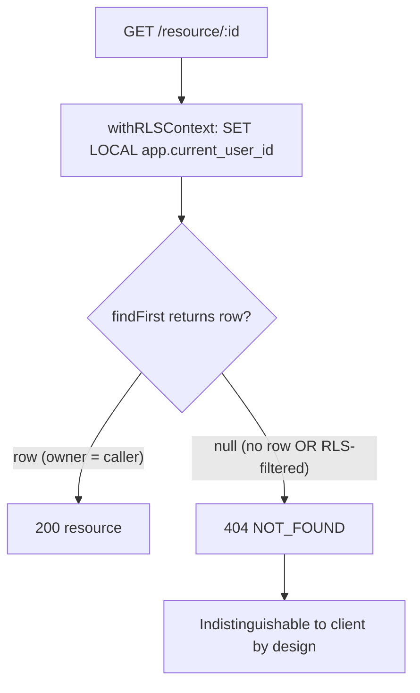
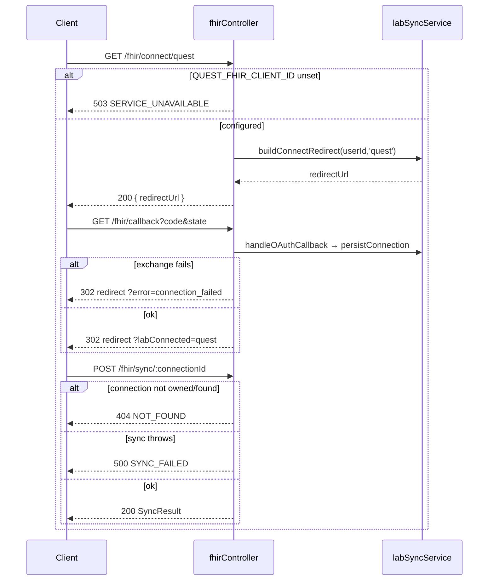

# ERROR_RECOVERY.md

> Every-error-code playbook for the OwnMyHealth API. Symptom → root cause → user-facing message → developer recovery → related code paths.
> Verified against the codebase on **2026-06-01**. Every row cites a `file:path:line`.

A frontend dev who sees `403 FORBIDDEN` (CSRF) or `401` (token expired) should land here and know exactly what to do. An ops engineer chasing a `503 SERVICE_UNAVAILABLE` on an AI route should find the env var to check. This doc is self-contained: you do not need repo access to use it.

---

## 1. Error envelope

All errors funnel through one Express error-handler middleware, mounted **last** (after routes and the 404 handler):

```ts
// Source: backend/src/app.ts:327-330
app.use(notFoundHandler);
...
app.use(errorHandler);
```

`errorHandler` builds the **canonical envelope**. `stack` is dev-only; `details` only present for validation errors:

```ts
// Source: backend/src/middleware/errorHandler.ts:199-208
const response: ApiResponse = {
  success: false,
  error: {
    code,
    message,
    ...(details ? { details } : {}),
    ...(config.isDevelopment ? { stack: err.stack } : {}),
  },
};
res.status(statusCode).json(response);
```

Canonical shape:

```json
{ "success": false, "error": { "code": "FORBIDDEN", "message": "Invalid CSRF token", "details": null, "stack": null } }
```

### Envelope inconsistency (real, documented)

Several **newer hand-built** bodies omit the top-level `success: false`. They emit only `{ error: { code, message } }`:

| Site | Body shape | Source |
|---|---|---|
| FHIR Quest unconfigured | `{ error: { code, message } }` (no `success`) | `backend/src/controllers/fhirController.ts:44-51` |
| FHIR connect failed | `{ error: { code, message } }` | `backend/src/controllers/fhirController.ts:64-66` |
| FHIR connection 404 | `{ error: { code, message } }` | `backend/src/controllers/fhirController.ts:158` |
| FHIR sync failed | `{ error: { code, message } }` | `backend/src/controllers/fhirController.ts:170-175` |
| FHIR disconnect failed | `{ error: { code, message } }` | `backend/src/controllers/fhirController.ts:197-202` |
| AI chat BAA gate | `{ error: { code, message } }` | `backend/src/controllers/aiChatController.ts:133-140` |
| AI chat context-assembly fail | `{ error: { code, message } }` | `backend/src/controllers/aiChatController.ts:151-153` |

By contrast, `planGating.ts`, `internalRoutes.ts`, `biomarkerController.ts`, `fileController.ts` and `biomarkerRoutes.ts` DO include `success: false` in their hand-built bodies (e.g. `backend/src/middleware/planGating.ts:90-104`, `backend/src/routes/biomarkerRoutes.ts:144-150`). The frontend tolerates both because it reads `data.error.code` / `data.error.message` regardless (`src/services/api/client.ts:313-324`), but the inconsistency is a real wart — see [§9 Known error drift](#9-known-error-drift).

### Two extra response keys

- **`details`** — only on `ValidationError` (the Zod issue array) and a few hand-built bodies (`ACCOUNT_LOCKED` carries `details.lockedUntil`, `backend/src/controllers/authController.ts:305-307`; batch biomarker failures carry per-item `details`, `backend/src/controllers/biomarkerController.ts:533,581`).
- **`meta`** — batch endpoints add `meta: { total, succeeded, failed }` alongside the error (`backend/src/controllers/biomarkerController.ts:535-539`).
- **`planLimit` fields** — `PLAN_LIMIT_EXCEEDED` adds `limit/current/feature/upgradeRequired` **inside** `error` (`backend/src/middleware/planGating.ts:90-104`).

---

## 2. HTTP status conventions

| Status | Meaning in this API | Representative code(s) | Source |
|---|---|---|---|
| 400 | Malformed request / bad input not caught by Zod | `BAD_REQUEST`, `INVALID_JSON`, `UPLOAD_ERROR`, `VERIFICATION_FAILED`, `RESET_FAILED`, `RESEND_FAILED`, `EMAIL_CHANGE_FAILED` | `errorHandler.ts:31,164,173`; `authController.ts:658,704,799,915` |
| 401 | Not authenticated / token problem | `UNAUTHORIZED`, `TOKEN_EXPIRED`, `INVALID_TOKEN` | `auth.ts:80`; `errorHandler.ts:123-124,127` |
| 403 | Authenticated but not allowed (CSRF, RBAC, demo, email-unverified, plan) | `FORBIDDEN`, `EMAIL_NOT_VERIFIED`, `PLAN_LIMIT_EXCEEDED` | `csrf.ts:156,169`; `errorHandler.ts:49`; `authController.ts:284`; `planGating.ts:93` |
| 404 | Resource not found (real or RLS-masked) | `NOT_FOUND` | `errorHandler.ts:55,111`; `fhirController.ts:158` |
| 409 | Uniqueness conflict (Prisma `P2002`) | `CONFLICT` | `errorHandler.ts:110` |
| 413 | Upload exceeds 10 MB | `FILE_TOO_LARGE` | `errorHandler.ts:171` |
| 422 | Zod validation failure | `VALIDATION_ERROR` | `errorHandler.ts:69` (note: **422, not 400**) |
| 423 | Account locked after failed logins | `ACCOUNT_LOCKED` | `authController.ts:303,310` |
| 429 | Rate limit exceeded (8 distinct limiters) | `RATE_LIMIT_EXCEEDED` + 7 siblings | `rateLimiter.ts:24,44,60,83,99,115,140,164` |
| 500 | Unhandled / internal | `INTERNAL_ERROR`, `DATABASE_ERROR`, `CONTEXT_ASSEMBLY_FAILED`, `CONNECT_FAILED`, `SYNC_FAILED`, `DISCONNECT_FAILED` | `errorHandler.ts:82,94`; `aiChatController.ts:152`; `fhirController.ts:65,172,199` |
| 502 | Storage stream read failure | `STORAGE_READ_FAILED` | `fileController.ts:272-274` |
| 503 | Service circuit-broken (AI budget, BAA gate, Quest unconfigured) | `SERVICE_UNAVAILABLE` | `aiSpendGuard.ts:42`; `aiChatController.ts:135`; `fhirController.ts:46`; `errorHandler.ts:87` |

> **There is NO 419.** Token/session expiry surfaces as **401 `TOKEN_EXPIRED`** (`errorHandler.ts:124`), not 419 or a `SESSION_EXPIRED` code. Oversize uploads are **413 `FILE_TOO_LARGE`** (`errorHandler.ts:171`), not 422 or 400.
> **502 `EXTERNAL_SERVICE_ERROR`** is defined as a subclass (`errorHandler.ts:98-102`) but **never instantiated** — see [§9](#9-known-error-drift).

---

## 3. Master error-code table

Codes come from four sources: **(a)** typed `AppError` subclasses in `errorHandler.ts`; **(b)** inline maps (Prisma / JWT / Multer / JSON) in `errorHandler.ts`; **(c)** per-limiter `message.error.code` in `rateLimiter.ts`; **(d)** hand-built `res.status(...).json({ error: { code } })` in controllers/middleware.

| `code` | HTTP | Source kind | User-facing message (verbatim) | Thrown / emitted at | Recovery action |
|---|---|---|---|---|---|
| `UNAUTHORIZED` | 401 | (a) subclass `UnauthorizedError` | "Authentication required" / "Session has been revoked. Please log in again." / "Token has expired. Please refresh your session." / "Invalid token" / "Bearer token required" / "Invalid email or password" | `auth.ts:80,88,113,115,189,194,213,215`; `errorHandler.ts:37`; `authController.ts:326,335`; `rbac.ts:61,80,101,123,259,323`; `internalRoutes.ts:59` | FE retries once via `/auth/refresh`; on failure hard-logout → `/login` |
| `TOKEN_EXPIRED` | 401 | (b) `JWT_ERROR_MAP` | "Authentication token has expired" | `errorHandler.ts:124` (raw `jsonwebtoken.TokenExpiredError` that bypasses the subclass) | Same 401 refresh flow |
| `INVALID_TOKEN` | 401 | (b) `JWT_ERROR_MAP` | "Invalid authentication token" | `errorHandler.ts:123` (raw `JsonWebTokenError`) | Same 401 refresh flow; if persistent, secret rotation suspected |
| `BAD_REQUEST` | 400 | (a) `BadRequestError`; (b) Prisma `P2003`/`P2014` | "Bad Request" / "Email and password are required" / "Content-Type must be application/json…" / "Invalid reference to related resource" / "Required relation is missing" | `errorHandler.ts:31,112-113`; `authController.ts:265,641,695`; `validation.ts:211` | Fix request payload/headers |
| `INVALID_JSON` | 400 | (b) SyntaxError branch | "Request body contains invalid JSON" | `errorHandler.ts:164` | Send well-formed JSON |
| `FORBIDDEN` | 403 | (a) `ForbiddenError` | "CSRF token missing" / "Invalid CSRF token" / "Demo account cannot…" / "Access denied. Required roles: …" / "You do not have access to this patient" / "Provider consent has expired" | `csrf.ts:156,169`; `errorHandler.ts:49`; `demoProtection.ts:54,73,99,123,131,151,170`; `rbac.ts:67,88,108,133,161,309`; `providerRoutes.ts:239,242,352,363,479,490,500,619,630,640,735,746` | CSRF: reload cookie + re-submit. RBAC/demo/consent: toast, no retry |
| `EMAIL_NOT_VERIFIED` | 403 | (d) hand-built | "Email not verified" (or service-supplied) | `authController.ts:284` | Prompt user to verify email / resend |
| `PLAN_LIMIT_EXCEEDED` | 403 | (d) hand-built | "You've reached your plan limit (current/limit). Upgrade to continue." / "This feature is not available on your current plan. Upgrade to access it." | `planGating.ts:93` | FE `isPlanLimitError()` → upgrade CTA |
| `ACCOUNT_LOCKED` | 423 | (d) hand-built | "Account is locked" (carries `details.lockedUntil`) | `authController.ts:303,310` | Wait until `lockedUntil`; ops can reset lockout |
| `VALIDATION_ERROR` | 422 | (a) `ValidationError`; (d) batch | Field-specific (`details` array) / "Validation failed" / "All biomarkers failed validation" | `validation.ts:172`; `errorHandler.ts:69`; `biomarkerController.ts:531` | Fix body per schema (see API_REFERENCE) |
| `NOT_FOUND` | 404 | (a) `NotFoundError`; (b) Prisma `P2025`; (d) FHIR/internal | "Resource not found" / "The requested resource was not found" / "Connection not found" / "Not found" / "Patient not found or account is inactive" / "Relationship not found" | `errorHandler.ts:55,111`; `fhirController.ts:158`; `internalRoutes.ts:49`; `rbac.ts:273`; `providerRoutes.ts:372,509,649,726` | Verify ID; RLS-masked rows ALSO surface here (see §6) |
| `CONFLICT` | 409 | (b) Prisma `P2002` | "A record with this data already exists" | `errorHandler.ts:110` | Change the conflicting field (e.g. duplicate email) |
| `RATE_LIMIT_EXCEEDED` | 429 | (c) `standardLimiter` | "Too many requests, please try again later." | `rateLimiter.ts:24` | Wait for `RateLimit-Reset` header |
| `AUTH_RATE_LIMIT_EXCEEDED` | 429 | (c) `authLimiter` | "Too many authentication attempts, please try again in 15 minutes." | `rateLimiter.ts:44` | Wait 15 min |
| `LOGIN_RATE_LIMIT_EXCEEDED` | 429 | (c) `strictAuthLimiter` | "Too many login attempts. Please try again in 15 minutes." | `rateLimiter.ts:60` | Wait 15 min (keyed by `email:ip`) |
| `UPLOAD_RATE_LIMIT_EXCEEDED` | 429 | (c) `uploadLimiter` | "Too many file uploads, please try again later." | `rateLimiter.ts:83` | Wait (20/hour cap) |
| `SENSITIVE_RATE_LIMIT_EXCEEDED` | 429 | (c) `sensitiveLimiter` | "Rate limit exceeded for sensitive operations." | `rateLimiter.ts:99` | Wait (10/hour cap) |
| `AI_RATE_LIMIT_EXCEEDED` | 429 | (c) `aiLimiter` | "Too many AI requests. Please try again later." | `rateLimiter.ts:115` | Wait (10/hour per user) |
| `PROVIDER_REQUEST_RATE_LIMIT_EXCEEDED` | 429 | (c) `providerAccessRequestLimiter` | "Too many access requests. Please try again later." | `rateLimiter.ts:140` | Wait (10/hour per provider) |
| `BULK_RATE_LIMIT_EXCEEDED` | 429 | (c) `bulkOperationLimiter` | "Too many bulk operations. Please try again later." | `rateLimiter.ts:164` | Wait (30/hour cap) |
| `FILE_TOO_LARGE` | 413 | (b) MulterError `LIMIT_FILE_SIZE` | "File too large. Maximum upload size is 10MB." | `errorHandler.ts:171` | Reduce file size |
| `UPLOAD_ERROR` | 400 | (b) other MulterError | "File upload failed. Check the file and try again." | `errorHandler.ts:173` | Re-check file/field name |
| `SERVICE_UNAVAILABLE` | 503 | (a) `ServiceUnavailableError`; (d) hand-built | "AI features are temporarily unavailable (daily budget reached)…" / "You've reached today's AI usage limit…" / "AI Health Guide is disabled: ANTHROPIC_BAA_ACTIVE…" / "AI guidance is disabled: ANTHROPIC_BAA_ACTIVE…" / "Cost analysis is disabled: ANTHROPIC_BAA_ACTIVE…" / "Quest FHIR integration is not configured…" | `aiSpendGuard.ts:42`; `aiChatController.ts:135`; `biomarkerRoutes.ts:147`; `expenseController.ts:632`; `fhirController.ts:46`; `errorHandler.ts:87` | Retry later; ops checks env (see §7 playbooks) |
| `CONTEXT_ASSEMBLY_FAILED` | 500 | (d) hand-built | "Unable to prepare your health context." | `aiChatController.ts:152` | Inspect logs — RLS/decrypt failure during context build |
| `CONNECT_FAILED` | 500 | (d) hand-built | "Could not start the Quest connection flow." | `fhirController.ts:65` | Retry; inspect Quest OAuth config + logs |
| `SYNC_FAILED` | 500 | (d) hand-built | (service error message) / "Sync failed" | `fhirController.ts:172` | Retry; inspect `labSyncService` logs, OAuth tokens |
| `DISCONNECT_FAILED` | 500 | (d) hand-built | (service error message) / "Disconnect failed" | `fhirController.ts:199` | Retry; inspect token-revocation path |
| `STORAGE_READ_FAILED` | 502 | (d) hand-built | "Unable to read file from storage" | `fileController.ts:274` (GCS stream `error` event, only if headers not yet sent) | Retry download; check GCS object exists / bucket perms |
| `DATABASE_ERROR` | 500 | (a) `DatabaseError`*; (b) Prisma default; (d) batch | "Failed to create biomarkers" / generic | `errorHandler.ts:94*,116`; `biomarkerController.ts:579` | Inspect server logs; the user message is sanitized |
| `INTERNAL_ERROR` | 500 | (a) `InternalServerError`; default | generic ("An unexpected error occurred. Please try again later.") in prod; real message in dev | `errorHandler.ts:82,143`; `claudeExtraction.ts:107,178,206,217,248,254,259,264`; `sbcExtraction.ts:768,828,867,878,999,1005,1010,1017`; `ocrService.ts:84,87,101,275,302,406,420,427,434,447`; `pdfParser.ts:888,1340`; `securePdfParsing.ts:274`; `anthropicClient.ts:51`; `auditLog.ts:295` | Inspect logs; check `ANTHROPIC_API_KEY` / GCP creds for extraction/OCR paths |
| `VERIFICATION_FAILED` | 400 | (d) hand-built | "Email verification failed" (or service msg) | `authController.ts:658` | Request a fresh verification email |
| `RESEND_FAILED` | 400 | (d) hand-built | "Failed to resend verification email" | `authController.ts:704` | Retry; check SendGrid status |
| `RESET_FAILED` | 400 | (d) hand-built | "Password reset failed" | `authController.ts:799` | Request a new reset link (token may be expired) |
| `EMAIL_CHANGE_FAILED` | 400 | (d) hand-built | "Email change failed" | `authController.ts:915` | Retry the email-change confirmation |

\* `DatabaseError` and the Prisma-default both map to `DATABASE_ERROR`; the subclass itself is never instantiated (see §9). `PARSE_ERROR`, `TIMEOUT`, `NETWORK_ERROR`, `HTTP_<status>` are **frontend-only** synthetic codes minted by `client.ts` — see [§5](#5-frontend-interpretation-layer).

**Distinct backend codes (count): 32.** Subclass-fixed: `UNAUTHORIZED`, `BAD_REQUEST`, `FORBIDDEN`, `NOT_FOUND`, `CONFLICT`, `VALIDATION_ERROR`, `RATE_LIMIT_EXCEEDED`, `INTERNAL_ERROR`, `SERVICE_UNAVAILABLE`, `DATABASE_ERROR`, `EXTERNAL_SERVICE_ERROR`, `AUTHENTICATION_FAILED` (12 classes; last 5 of these include never-instantiated ones). Mapped: `TOKEN_EXPIRED`, `INVALID_TOKEN`, `INVALID_JSON`, `FILE_TOO_LARGE`, `UPLOAD_ERROR`. Rate-limit: 8. Hand-built: `EMAIL_NOT_VERIFIED`, `PLAN_LIMIT_EXCEEDED`, `ACCOUNT_LOCKED`, `CONTEXT_ASSEMBLY_FAILED`, `CONNECT_FAILED`, `SYNC_FAILED`, `DISCONNECT_FAILED`, `STORAGE_READ_FAILED`, `VERIFICATION_FAILED`, `RESEND_FAILED`, `RESET_FAILED`, `EMAIL_CHANGE_FAILED`.

---

## 4. Per-code deep dives

### `UNAUTHORIZED` (HTTP 401)

**Thrown at** (a sample — full list in §3):
- `backend/src/middleware/auth.ts:80` — access token missing.
- `backend/src/middleware/auth.ts:88` — token revoked (logout / logout-all / password change blacklist).
- `backend/src/middleware/auth.ts:113,115` — expired / malformed JWT (the `next(...)` branches in the `catch`).
- `backend/src/controllers/authController.ts:326,335` — invalid login credentials (sanitized 401 after `LOGIN_FAILED` audit).

```ts
// Source: backend/src/middleware/auth.ts:111-119
} catch (error) {
  if (error instanceof jwt.TokenExpiredError) {
    next(new UnauthorizedError('Token has expired. Please refresh your session.'));
  } else if (error instanceof jwt.JsonWebTokenError) {
    next(new UnauthorizedError('Invalid token'));
  } else {
    next(error);
  }
}
```

> Note: inside the middleware, `jwt.verify` errors are re-wrapped as `UnauthorizedError` (→ code `UNAUTHORIZED`). The `errorHandler` JWT map (`TOKEN_EXPIRED`/`INVALID_TOKEN`) only fires when a raw `jsonwebtoken` error reaches the handler **un-wrapped** — e.g. a `jwt.verify` call elsewhere that does not catch.

**Developer recovery**:
1. The client retries ONCE via `POST /api/v1/auth/refresh` (cookie-borne refresh token) — `client.ts:284,303`.
2. If refresh returns 401 (terminal) or 429 (rate-limited), `onAuthFailureCallback` hard-logs-out → `/login`.
3. After re-login, retry the original request.

**Audit log**: yes for failed login — `LOGIN_FAILED` via `auditService.logAuth('LOGIN_FAILED', ...)` at `authController.ts:276,321,330`. Token-expiry/missing-token 401s are NOT audited (noise).

**Frontend handling**: `src/services/api/client.ts:284,303` — fetch wrapper detects `status === 401` (when `!isRetry` and not an auth-management endpoint) and calls `attemptTokenRefresh()`.

---

### `FORBIDDEN` (HTTP 403)

This single code covers **four distinct failure families** — disambiguate by message:

| Family | Message example | Source | Recovery |
|---|---|---|---|
| CSRF missing | "CSRF token missing" | `csrf.ts:156` | Re-read `csrf_token` cookie, set `x-csrf-token` header, resubmit |
| CSRF mismatch | "Invalid CSRF token" | `csrf.ts:169` | Same — token cookie may be stale; GET any route to refresh it |
| RBAC | "Access denied. Required roles: ADMIN" | `rbac.ts:67` | No retry; user lacks the role |
| Demo block | "Demo account cannot change roles…" | `demoProtection.ts:54` | No retry; demo accounts are write-restricted |
| Provider consent | "Provider consent has expired" | `providerRoutes.ts:363` | Patient must re-grant consent |

```ts
// Source: backend/src/middleware/csrf.ts:155-170
if (!cookieToken || !headerToken) {
  throw new ForbiddenError('CSRF token missing');
}
const cookieDigest = crypto.createHash('sha256').update(cookieToken).digest();
const headerDigest = crypto.createHash('sha256').update(headerToken).digest();
const tokensMatch = crypto.timingSafeEqual(cookieDigest, headerDigest);
if (!tokensMatch) {
  throw new ForbiddenError('Invalid CSRF token');
}
```

**CSRF recovery (frontend)** — the client auto-attaches the token on every mutation, reading it from the `csrf_token` cookie:

```ts
// Source: src/services/api/client.ts:228-238
const method = (options.method || 'GET').toUpperCase();
if (['POST', 'PUT', 'PATCH', 'DELETE'].includes(method)) {
  const csrfToken = getCsrfToken();
  if (csrfToken) {
    (headers as Record<string, string>)['x-csrf-token'] = csrfToken;
  } else if (import.meta.env.DEV) {
    apiLogger.warn('Mutation request without CSRF token', { method, endpoint });
  }
}
```

**Audit log**: RBAC/demo denials are not separately audited as a code; failed auth events go through `logAuth`. **Frontend handling**: 403 maps to `ERROR_MESSAGES.FORBIDDEN` ("You do not have permission to perform this action.") unless it's a plan-limit 403 (see `PLAN_LIMIT_EXCEEDED`).

**CSRF-exempt routes** (these never throw CSRF 403): public auth routes (`/auth/login`, `/auth/register`, `/auth/demo`, `/auth/refresh`, `/auth/forgot-password`, `/auth/reset-password`, `/auth/verify-email`, `/auth/resend-verification`), `/marketplace/plans/search`, the SSE `/ai/chat` (bearer-only), and `/internal/audit-cleanup` — `csrf.ts:98-139`. See [`ROUTING_TABLE.md`](./ROUTING_TABLE.md#csrf-exemption-list).

---

### `PLAN_LIMIT_EXCEEDED` (HTTP 403)

Hand-built body with usage numbers so the UI can render an upgrade CTA instead of a generic toast:

```ts
// Source: backend/src/middleware/planGating.ts:90-104
const body: PlanLimitErrorBody = {
  success: false,
  error: {
    code: 'PLAN_LIMIT_EXCEEDED',
    message:
      check.limit > 0
        ? `You've reached your plan limit (${check.current}/${check.limit}). Upgrade to continue.`
        : 'This feature is not available on your current plan. Upgrade to access it.',
    limit: check.limit,
    current: check.current,
    feature: limitKey,
    upgradeRequired: true,
  },
};
res.status(403).json(body);
```

**Recovery**: frontend `isPlanLimitError()` narrows the error and renders the upgrade prompt. **Note**: plan is read fresh from the DB (under RLS), not the JWT, so a stale token cannot bypass the gate (`planGating.ts:66-75`); expired `planExpiresAt` downgrades to FREE at request time (`planGating.ts:73-75`).

---

### `TOKEN_EXPIRED` / `INVALID_TOKEN` (HTTP 401)

These two come ONLY from the JWT inline map when a raw `jsonwebtoken` error reaches the handler:

```ts
// Source: backend/src/middleware/errorHandler.ts:122-124
const JWT_ERROR_MAP: Record<string, ErrorShape> = {
  JsonWebTokenError: { statusCode: 401, code: 'INVALID_TOKEN', message: 'Invalid authentication token' },
  TokenExpiredError: { statusCode: 401, code: 'TOKEN_EXPIRED', message: 'Authentication token has expired' },
};
```

**There is no 419 and no `SESSION_EXPIRED`.** Expiry is always 401. **Recovery**: identical to `UNAUTHORIZED` (one-shot `/auth/refresh`, then hard-logout). Access TTL = 900 s, refresh TTL = 604800 s (`config/index.ts:62,66`).

---

### `SERVICE_UNAVAILABLE` (HTTP 503) — the circuit breaker family

Five distinct trips, all 503, disambiguate by message:

| Trigger | Message | Source | Ops fix |
|---|---|---|---|
| AI daily spend budget (global) | "AI features are temporarily unavailable (daily budget reached)…" | `aiSpendGuard.ts:42` | Check `AI_DAILY_BUDGET_USD` (default 50) + `aiCostTracker` |
| AI daily spend budget (per-user) | "You've reached today's AI usage limit. Please try again tomorrow." | `aiSpendGuard.ts:42` | Check `AI_USER_DAILY_BUDGET_USD` (default 5) |
| AI chat BAA gate | "AI Health Guide is disabled: ANTHROPIC_BAA_ACTIVE must be \"true\"…" | `aiChatController.ts:135` | Set `ANTHROPIC_BAA_ACTIVE=true` |
| Biomarker guidance BAA gate | "AI guidance is disabled: ANTHROPIC_BAA_ACTIVE must be \"true\"…" | `biomarkerRoutes.ts:147` | Set `ANTHROPIC_BAA_ACTIVE=true` |
| Cost analysis BAA gate | "Cost analysis is disabled: ANTHROPIC_BAA_ACTIVE must be \"true\"…" | `expenseController.ts:632` | Set `ANTHROPIC_BAA_ACTIVE=true` |
| Quest FHIR not configured | "Quest FHIR integration is not configured on this server. Set QUEST_FHIR_CLIENT_ID." | `fhirController.ts:46` | Set `QUEST_FHIR_CLIENT_ID` |

```ts
// Source: backend/src/middleware/aiSpendGuard.ts:41-47
next(
  new ServiceUnavailableError(
    scope === 'global'
      ? 'AI features are temporarily unavailable (daily budget reached). Please try again later.'
      : "You've reached today's AI usage limit. Please try again tomorrow."
  )
);
```

> **This is a 503, not a 429.** The dollar budget is a circuit breaker, distinct from the request-count `aiLimiter` (429 `AI_RATE_LIMIT_EXCEEDED`).

---

### `NOT_FOUND` (HTTP 404)

```ts
// Source: backend/src/middleware/errorHandler.ts:110-111
P2002: { statusCode: 409, code: 'CONFLICT', message: 'A record with this data already exists' },
P2025: { statusCode: 404, code: 'NOT_FOUND', message: 'The requested resource was not found' },
```

A 404 can mean (a) the row truly does not exist, (b) Prisma `P2025` (update/delete of a missing row), or (c) **an RLS-filtered row owned by another user** — see [§6](#6-rls-masking-as-404). The FHIR controller hand-builds its own 404 for cross-user connection access (`fhirController.ts:158`).

---

## 5. Frontend interpretation layer

The frontend uses a **fetch wrapper** (`src/services/api/client.ts`), NOT axios. It maps codes/statuses to friendly strings via `ERROR_MESSAGES`:

```ts
// Source: src/services/api/client.ts:14-23
const ERROR_MESSAGES: Record<string, string> = {
  NETWORK_ERROR: 'Unable to connect to the server. Please check your internet connection and try again.',
  TIMEOUT_ERROR: 'The request took too long to complete. Please try again.',
  UNAUTHORIZED: 'Your session has expired. Please log in again.',
  FORBIDDEN: 'You do not have permission to perform this action.',
  NOT_FOUND: 'The requested resource was not found.',
  VALIDATION_ERROR: 'Please check your input and try again.',
  SERVER_ERROR: 'Something went wrong on our end. Please try again later.',
  UNKNOWN_ERROR: 'An unexpected error occurred. Please try again.',
};
```

**Synthetic frontend-only codes** (never sent by the server): `PARSE_ERROR` (unparseable error body, `client.ts:296`), `TIMEOUT` (abort, `client.ts:354`), `NETWORK_ERROR` (fetch threw, `client.ts:365`), `HTTP_<status>` (fallback when server omits a code, `client.ts:322`).

### One-shot 401 → `/auth/refresh` retry

```ts
// Source: src/services/api/client.ts:302-311
if (!response.ok) {
  if (response.status === 401 && !isRetry && !isAuthMgmtEndpoint) {
    const refreshed = await attemptTokenRefresh();
    if (refreshed) {
      return apiFetch<T>(endpoint, options, timeoutMs, true);
    }
    if (onAuthFailureCallback) {
      onAuthFailureCallback();
    }
  }
  ...
```

What makes it **one-shot**: the recursive retry passes `isRetry = true` (4th arg), and the guard is `!isRetry`. A second 401 cannot trigger another refresh.

### 429-on-refresh hard-logout

`attemptTokenRefresh` treats **any** non-OK refresh response (401 terminal OR 429 rate-limited) identically — clears the token and returns `false`, which routes to `onAuthFailureCallback`:

```ts
// Source: src/services/api/client.ts:159-166
// Explicit: 429 on refresh = rate limited, log user out
// rather than retrying and amplifying the storm. ...
clearAuthToken();
return false;
```

### Generic 429 backoff (non-refresh routes)

Non-auth-management routes back off and retry up to 3 times, respecting `Retry-After`:

```ts
// Source: src/services/api/client.ts:267-277
if (
  response.status === 429 &&
  !isAuthMgmtEndpoint &&
  !isRetry &&
  retryCount429 < MAX_RETRY_429
) {
  const retryAfterMs = parseRetryAfter(response.headers.get('Retry-After'));
  const delay = retryAfterMs ?? backoffDelayMs(retryCount429 + 1);
  await sleep(delay);
  return apiFetch<T>(endpoint, options, timeoutMs, isRetry, retryCount429 + 1);
}
```

> **Reset header**: all 8 limiters set `standardHeaders: true` (`rateLimiter.ts:28,48,…,168`), so each 429 carries `RateLimit-Limit`, `RateLimit-Remaining`, and `RateLimit-Reset`. The client prefers `Retry-After` and falls back to exponential backoff (1 s, 2 s, 4 s ± 25 %).

### `isPlanLimitError()` upgrade-CTA narrowing

```ts
// Source: src/services/api/client.ts:55-62
export function isPlanLimitError(err: unknown): err is ApiError & { planLimit: NonNullable<ApiError['planLimit']> } {
  return (
    typeof err === 'object' &&
    err !== null &&
    (err as ApiError).code === 'PLAN_LIMIT_EXCEEDED' &&
    !!(err as ApiError).planLimit
  );
}
```

Consumed in `src/components/settings/LabConnectionsSection.tsx:178`. The SSE AI-chat path uses its **own** fetch (not `apiFetch`) and re-parses `PLAN_LIMIT_EXCEEDED` separately (`src/services/api/ai.ts:135-146`).

---

## 6. RLS masking as 404

Row-Level Security policies scope every query to `app.current_user_id` set inside `withRLSContext` / `withRLSTransaction`. A `findFirst` / `findUnique` for a row owned by another user returns `null`, which controllers convert to a 404 — **identical to a non-existent row** (intentional, to prevent enumeration).

```ts
// Source: backend/src/controllers/fhirController.ts:152-159
const connection = await withRLSContext(userId, async (tx) => {
  return tx.labConnection.findFirst({
    where: { id: connectionId, userId },
  });
});
if (!connection) {
  res.status(404).json({ error: { code: 'NOT_FOUND', message: 'Connection not found' } });
  return;
}
```

The biomarker AI-guidance route does the same to fix an IDOR — null → 404 "regardless of whether it doesn't exist or belongs to a different user, to avoid enumeration via timing/status" (`biomarkerRoutes.ts:153-156`).

**How to tell the difference** (developer): a true-missing 404 and an RLS-masked 404 are indistinguishable to the client by design. Server-side, check the audit log — an access attempt on a foreign resource still logs `PHI_ACCESS`; correlate the `userId` against the resource owner. See [`ARCHITECTURE.md#rls-enforcement-path`](./ARCHITECTURE.md) and [`DATA_MODEL.md#rls-policies`](./DATA_MODEL.md).



---

## 7. Auth state decision tree (401 vs 403)

```
  API call → 401 ──▶ already a retry, OR endpoint is /auth/refresh|/auth/logout?
                          │                                   │
                         yes                                 no
                          │                                   ▼
                          ▼                         call /auth/refresh ──▶ ok? ──yes──▶ retry original (one-shot, isRetry=true)
                  hard logout                                  │
              (onAuthFailureCallback)              no (401 terminal OR 429 rate-limited)
                          │                                    ▼
                          ▼                              clearAuthToken → onAuthFailureCallback
                    redirect /login                            │
                                                               ▼
                                                         redirect /login

  API call → 403 FORBIDDEN ──▶ CSRF? (reload csrf_token cookie + resubmit)
                            └─▶ RBAC / demo / consent? (toast, no retry)
  API call → 403 PLAN_LIMIT_EXCEEDED ──▶ isPlanLimitError() → upgrade CTA (limit/current)
  API call → 403 EMAIL_NOT_VERIFIED ──▶ prompt verify-email / resend
```

`/auth/refresh` and `/auth/logout` are exempt from the 401-retry to break recursion (`client.ts:248`); `/auth/login` is **not** exempt — its 401 means wrong credentials, surfaced to the user.

---

## 8. Recovery playbooks

### Playbook A — user stuck in a `401` loop

1. The fetch wrapper is one-shot by design (`client.ts:284,303` guard on `!isRetry`). A true loop means a caller re-issues the request without the retry flag — inspect the caller.
2. Check JWT secret rotation. If a deploy rotated `JWT_ACCESS_SECRET` / `JWT_REFRESH_SECRET` (`config/index.ts:61,65`), **all** existing sessions are invalid and `/auth/refresh` will 401 → clean hard-logout. This is expected; users just re-login.
3. Inspect TTLs: `JWT_ACCESS_EXPIRES_SECONDS` (default 900) and `JWT_REFRESH_EXPIRES_SECONDS` (default 604800) at `config/index.ts:62,66`. A misconfigured tiny refresh TTL causes constant re-login.
4. Forced resolution: revoke sessions server-side (DB-backed `Session` table) so the next refresh fails cleanly into hard-logout. Token blacklist is checked at `auth.ts:87`.

### Playbook B — AI endpoint returning 500 / 503

1. **503 "daily budget reached" (global)** → `aiSpendGuard.ts:42` tripped. Check `AI_DAILY_BUDGET_USD` (default 50, `config/index.ts:196`) and the `aiCostTracker` accumulator. This is the dollar circuit breaker, NOT a 429.
2. **503 "today's AI usage limit" (per-user)** → same guard, per-user scope. Check `AI_USER_DAILY_BUDGET_USD` (default 5, `config/index.ts:197`).
3. **503 "ANTHROPIC_BAA_ACTIVE…"** → BAA gate at `aiChatController.ts:135`, `biomarkerRoutes.ts:147`, or `expenseController.ts:632`. Confirm `ANTHROPIC_BAA_ACTIVE=true` (`config/index.ts:185`). In production with a key but the flag unset, the config **hard-exits** at boot (`config/index.ts:300-310`). Watch for the Cloud Run env-pinning trap (a new revision can sit at 0 % traffic — see [`RUNBOOK.md`](./RUNBOOK.md)).
4. **500 `CONTEXT_ASSEMBLY_FAILED`** → `aiChatController.ts:152`; health-context assembly (RLS read + decrypt) threw. Inspect logs at `aiChatController.ts:148`.
5. **500 `INTERNAL_ERROR` from extraction/OCR** → `claudeExtraction.ts:107,178,206,217,248,254,259,264` / `ocrService.ts:84,87,101,…` wrap timeouts / config / parse failures. Check `ANTHROPIC_API_KEY`, `GCP_PROJECT_ID`, `GCP_PROCESSOR_ID`, and Anthropic/Document-AI status.

### Playbook C — upload `413 FILE_TOO_LARGE`

1. Multer hits the 10 MB limit; `errorHandler.ts:165-171` maps `LIMIT_FILE_SIZE` → 413 `FILE_TOO_LARGE`. The body parser shares the 10 MB cap (`app.ts:248`).
2. User-facing message is "File too large. Maximum upload size is 10MB." — no server action needed; user reduces file size.
3. Other Multer errors (wrong field, too many files) → 400 `UPLOAD_ERROR` (`errorHandler.ts:173`). Verify the form field name matches the route's `multer` config.
4. Pre-Multer content checks (file-type mismatch, empty upload) throw `VALIDATION_ERROR` → 422 from `upload/shared.ts:90,125,133,138`, NOT 413.

### Playbook D — Quest FHIR lab sync failing

1. **503 `SERVICE_UNAVAILABLE` "Quest FHIR integration is not configured"** → `fhirController.ts:46`. Set `QUEST_FHIR_CLIENT_ID` (+ secret / base / redirect env vars; gate is `config.quest.clientId.length > 0` at `fhirController.ts:30-32`).
2. **OAuth callback bounce `?error=connection_failed`** → `fhirController.ts:105`; token exchange in `labSyncService.handleOAuthCallback` failed. The callback is a **redirect**, not a JSON error — the frontend reads `error=` off the URL. A user-denied consent bounces with the raw provider error (`fhirController.ts:80-84`).
3. **500 `SYNC_FAILED`** → `fhirController.ts:172`; `syncLabResults` threw. Check `labSyncService` / `loincMapper`, expired OAuth tokens (`LabConnection.refreshTokenEncrypted` — see [`PHI_TAXONOMY.md`](./PHI_TAXONOMY.md)), or `fhir/urlSafety.ts` SSRF rejection.
4. **404 "Connection not found"** → `fhirController.ts:158`; RLS-scoped `findFirst` returned null for that `connectionId` (truly missing or another user's — see §6).



---

## 9. Logging + audit

| Event | Audited? | Where | Notes |
|---|---|---|---|
| Failed login (bad password) | Yes | `auditService.logAuth('LOGIN_FAILED', ...)` — `authController.ts:276,321,330` | Reason recorded; `remainingAttempts` kept server-side, NOT returned (avoids account-existence oracle, `authController.ts:314-326`) |
| Account lockout | Yes | `auditService.logAuth('ACCOUNT_LOCKOUT', ...)` — `authController.ts:295` | Carries `lockedUntil` |
| Successful login | Yes | `auditService.logAuth('LOGIN', ...)` — `authController.ts:351` | — |
| Email verification (pass/fail) | Yes | `authController.ts:650,667` | — |
| Email change (pass/fail) | Yes | `authController.ts:907,923` | — |
| AI chat blocked (no BAA) | Yes | `logAccess('HealthGuide', …, { operation: 'CHAT_BLOCKED_NO_BAA' })` — `aiChatController.ts:130` | — |
| AI chat failed mid-stream | Yes | `{ operation: 'CHAT_FAILED' }` — `aiChatController.ts:289` | Truncated error, never the question/response |
| Biomarker guidance blocked (no BAA) | Yes | `{ operation: 'GUIDANCE_BLOCKED_NO_BAA' }` — `biomarkerRoutes.ts:141` | — |
| Cost analysis blocked (no BAA) | Yes | `{ operation: 'ANALYZE_BLOCKED_NO_BAA' }` — `expenseController.ts:629` | — |
| 401 token-expired / missing | No | — | Noise; not audited |
| CSRF 403 | No | — | Noise; not audited |
| 429 rate-limit | No | — | Counter-only; not audited |
| 500 internal / extraction | Logged (not audited) | `logger.error` in `errorHandler.ts:192` (≥500 always logged) | Stack only in dev |

Audit failed-login pattern:

```ts
// Source: backend/src/controllers/authController.ts:321-326
await auditService.logAuth('LOGIN_FAILED', { req }, {
  email,
  reason: 'INVALID_CREDENTIALS',
  remainingAttempts: result.remainingAttempts,
});
throw new UnauthorizedError('Invalid email or password');
```

The error handler always logs ≥500 errors and only logs 4xx in development:

```ts
// Source: backend/src/middleware/errorHandler.ts:190-196
if (statusCode >= 500) {
  logger.error(`${err.name}: ${err.message}`, logData);
} else if (config.isDevelopment) {
  logger.warn(`${err.name}: ${err.message}`, logData);
}
```

---

## 10. PHI_ENCRYPTION_KEY rotation mid-session (recovery)

PHI is encrypted with AES-256-GCM using per-user keys derived from `PHI_ENCRYPTION_KEY` (see [`SECURITY_STATUS.md`](./SECURITY_STATUS.md) and [`PHI_TAXONOMY.md`](./PHI_TAXONOMY.md)). If `PHI_ENCRYPTION_KEY` is rotated **without** re-encrypting existing rows:

- **Symptom**: reads of previously-encrypted PHI fail during decrypt. In the AI chat path this surfaces as **500 `CONTEXT_ASSEMBLY_FAILED`** (`aiChatController.ts:152`); in extraction/decrypt-on-read paths it surfaces as **500 `INTERNAL_ERROR`** (the generic default), because decrypt throws a plain error that the handler does not have a dedicated code for.
- **Why no dedicated code**: there is no `DECRYPTION_FAILED` / `PHI_DECRYPT_ERROR` code anywhere in the codebase — decrypt failures degrade to 500 (see §9 drift).
- **Recovery**: rotating `PHI_ENCRYPTION_KEY` is a re-encryption migration, not a config flip. Roll back to the previous key, OR run a re-encrypt pass over all `*Encrypted` columns. There is no in-app self-heal. `AUDIT_LOG_SALT` is similarly load-bearing — rotating it makes all prior audit-log PHI undecryptable (`config/index.ts:50-54`). See [`RUNBOOK.md`](./RUNBOOK.md) and [`HIPAA_CHECKLIST.md`](./HIPAA_CHECKLIST.md).

---

## 11. Known error drift

Issues found in the code while writing this doc — candidates for cleanup:

1. **Five subclasses defined but never instantiated.** `AuthenticationError` (`AUTHENTICATION_FAILED`, `errorHandler.ts:41`), `ConflictError` (`CONFLICT`, `:59`), `RateLimitError` (`RATE_LIMIT_EXCEEDED`, `:74`), `DatabaseError` (`DATABASE_ERROR`, `:92`), and `ExternalServiceError` (`EXTERNAL_SERVICE_ERROR` / 502, `:98`) have **zero** `new <Class>(` call sites in `backend/src/**` (verified via Grep). `CONFLICT` and `DATABASE_ERROR` codes still appear, but only via the Prisma map / a hand-built body. `AUTHENTICATION_FAILED` and `EXTERNAL_SERVICE_ERROR` are produced **nowhere** — no route returns them. `RateLimitError` is dead because the rate-limit codes come from `express-rate-limit` `message` bodies, not thrown errors.
2. **No 502 actually reachable via `EXTERNAL_SERVICE_ERROR`.** The only 502 in the running code is the hand-built `STORAGE_READ_FAILED` (`fileController.ts:272`). External-service failures (Anthropic, Document AI, SendGrid) currently surface as 500 `INTERNAL_ERROR`, not 502.
3. **`storageService` throws plain `Error` (no code).** `throw new Error('Failed to upload file to storage')` (`storageService.ts:90`) and `throw new Error('Failed to delete file from storage')` (`storageService.ts:145`) are NOT `AppError` subclasses, so they fall through to the generic 500 `INTERNAL_ERROR`. There is no `STORAGE_WRITE_ERROR` / `STORAGE_DELETE_ERROR` code — only the read path has the hand-built `STORAGE_READ_FAILED`.
4. **No `DECRYPTION_FAILED` code.** Decrypt failures (key rotation, corruption) degrade to 500 `INTERNAL_ERROR` or `CONTEXT_ASSEMBLY_FAILED` — see §10.
5. **Envelope inconsistency.** FHIR and AI-chat hand-built bodies omit `success: false` (see §1). Frontend tolerates it, but it diverges from the canonical envelope.
6. **`DISCONNECT_FAILED` and `STORAGE_READ_FAILED` are undocumented in the spec's starter table** — both are real, included above.

---

## Acceptance questions (self-check)

1. **How many distinct error `code` values exist?** ~32 distinct backend codes: 12 subclass-defined (5 never instantiated) + 5 mapped (`TOKEN_EXPIRED`, `INVALID_TOKEN`, `INVALID_JSON`, `FILE_TOO_LARGE`, `UPLOAD_ERROR`) + 8 rate-limit + 12 hand-built controller codes. Plus 4 frontend-synthetic (`PARSE_ERROR`, `TIMEOUT`, `NETWORK_ERROR`, `HTTP_<status>`). → §3.
2. **How does token expiry surface?** 401 `TOKEN_EXPIRED` (`errorHandler.ts:124`) — never 419 / `SESSION_EXPIRED`. Client retries once via `/auth/refresh`, else hard-logout. → §2, §4, §5, §7.
3. **Missing/invalid CSRF token?** 403 `FORBIDDEN`, "CSRF token missing" / "Invalid CSRF token" (`csrf.ts:156,169`). Recovery: re-read `csrf_token` cookie, set `x-csrf-token` header, resubmit. → §4.
4. **Does a 404 mask an RLS-filtered row?** Yes — null `findFirst` → 404, indistinguishable from missing by design (`fhirController.ts:152-159`, `biomarkerRoutes.ts:153-156`). Tell them apart via audit log. → §6.
5. **What header carries 429 reset timing, and which limiter sets each code?** `RateLimit-Reset` (all set `standardHeaders: true`). 8 limiters → 8 codes (`rateLimiter.ts:24,44,60,83,99,115,140,164`). → §3, §5.
6. **AI spend budget — status + code + where?** 503 `SERVICE_UNAVAILABLE` at `aiSpendGuard.ts:42` (NOT 429). → §5 deep-dive, Playbook B.
7. **Which errors are audited, and where?** Failed/locked login, login success, email verify/change, AI blocks — all via `auditService.logAuth(...)` / `logAccess(...)` (`authController.ts:276`, `aiChatController.ts:130`, etc.). 401/CSRF/429 are noise. → §9.
8. **Does the frontend auto-refresh on 401? One-shot how?** Yes, `client.ts:284,303`; one-shot because the retry passes `isRetry=true` and the guard is `!isRetry`. → §5.
9. **`PHI_ENCRYPTION_KEY` rotation mid-session recovery?** Decrypt fails → 500 `CONTEXT_ASSEMBLY_FAILED` / `INTERNAL_ERROR`; no self-heal — roll back key or re-encrypt. → §10.
10. **No/invalid auth on a protected endpoint?** 401 `UNAUTHORIZED`, "Authentication required" (`auth.ts:80`). → §4.
11. **Demo account blocked mutation?** 403 `FORBIDDEN` via `ForbiddenError` (`demoProtection.ts:54,73,…`). → §3, §4.
12. **Generic 403 vs plan-limit 403?** `isPlanLimitError()` checks `code === 'PLAN_LIMIT_EXCEEDED'` + presence of `planLimit` (`client.ts:55-62`). → §5.
13. **Quest FHIR sync failure end-to-end?** Unconfigured → 503; OAuth fail → callback **redirect** `?error=connection_failed`; sync throw → 500 `SYNC_FAILED`; foreign connection → 404. → Playbook D.

---

## Related Documents

- [API_REFERENCE.md](./API_REFERENCE.md) — per-endpoint contracts and the error list each endpoint can return.
- [ROUTING_TABLE.md](./ROUTING_TABLE.md) — middleware chain (CSRF, rate limiters, RBAC, plan gating) that produces each error; CSRF-exemption list.
- [ARCHITECTURE.md](./ARCHITECTURE.md) — auth, CSRF double-submit, and RLS enforcement flows.
- [TROUBLESHOOTING.md](./TROUBLESHOOTING.md) — broader symptom catalog (narrative, less code-anchored).
- [RUNBOOK.md](./RUNBOOK.md) — operational incident playbooks (AI budget, BAA flag, Cloud Run env pinning, key rotation).
- [SECURITY_STATUS.md](./SECURITY_STATUS.md) — BAA gate (C-7), RLS posture, secret-rotation considerations.
- [PHI_TAXONOMY.md](./PHI_TAXONOMY.md) — encrypted fields touched by decrypt-failure 500s and Quest token PHI.
- [ENV_VARS.md](./ENV_VARS.md) — `ANTHROPIC_BAA_ACTIVE`, `AI_DAILY_BUDGET_USD`, `QUEST_FHIR_CLIENT_ID`, JWT TTLs/secrets referenced in playbooks.

---

## Prompt drift log

- **`./37-error-recovery-doc.md` says "~173 typed throws across 28 files".** Actual: **193** `throw new <X>Error(` / `next(new <X>Error(` occurrences across **28** files (Grep `throw new \w+Error\(|next\(new \w+Error\(` over `backend/src/**`, excluding `*.test.ts`). File count matches; throw count is higher (193, not 173).
- **Spec lists 12 typed subclasses as the code source, but 5 are never instantiated.** `AuthenticationError`/`AUTHENTICATION_FAILED`, `ConflictError`/`CONFLICT`, `RateLimitError`/`RATE_LIMIT_EXCEEDED`, `DatabaseError`/`DATABASE_ERROR`, `ExternalServiceError`/`EXTERNAL_SERVICE_ERROR` have zero `new <Class>(` call sites. `CONFLICT`/`DATABASE_ERROR` codes still appear via other sources; `AUTHENTICATION_FAILED` and `EXTERNAL_SERVICE_ERROR` (502) are produced nowhere. Logged in §9/§11.
- **Spec's master table omits several real hand-built codes.** Found and added: `EMAIL_NOT_VERIFIED` (403, `authController.ts:284`), `ACCOUNT_LOCKED` (423, `:303`), `VERIFICATION_FAILED`/`RESEND_FAILED`/`RESET_FAILED`/`EMAIL_CHANGE_FAILED` (400, `:658/704/799/915`), `DISCONNECT_FAILED` (500, `fhirController.ts:199`), and the `NOT_FOUND`/`UNAUTHORIZED` bodies in `internalRoutes.ts:49,59`. The spec also did not mention HTTP **423 Locked** — it exists (`authController.ts:310`).
- **Spec line refs `auth.ts:96,200` (invalid token type) and `demoProtection.ts` line numbers are approximate.** Verified actual: invalid-token-type throws at `auth.ts:96,199`; demo `ForbiddenError` throws at `demoProtection.ts:54,73,99,123,131,151,170`.
- **`client.ts:284,303`** confirmed as the one-shot 401 retry guard sites (spec was correct).
