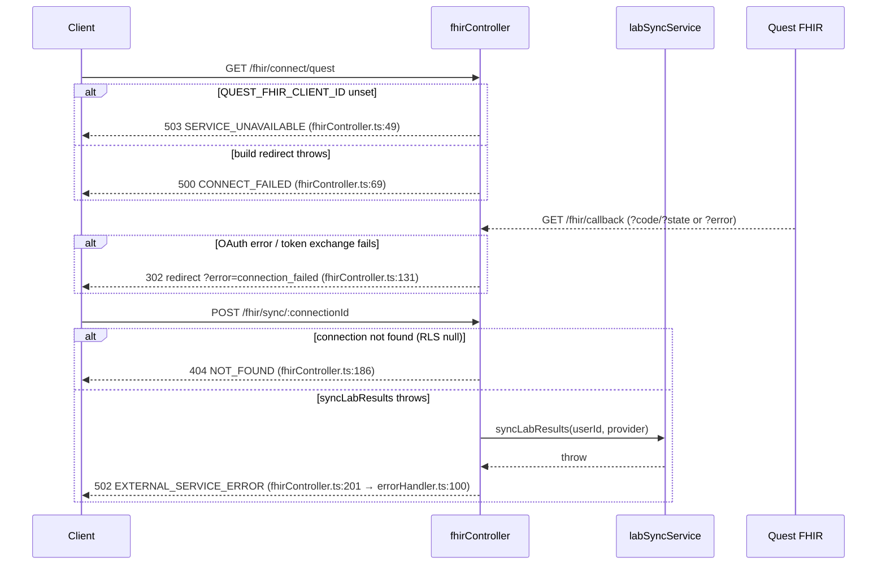

# ERROR_RECOVERY.md

> **The every-error-code playbook.** Symptom → root cause → user-facing message → developer recovery → related code paths. A frontend dev who sees a `403 FORBIDDEN` (CSRF) or a `401 TOKEN_EXPIRED` should land here and know exactly what to do.
>
> **Code state:** `master` @ `12b45ae` · **Refreshed:** 2026-08-01 (previous: `fb2cd32`, 2026-06-15)
> **Posture:** sandbox — no GCP (billing disabled ~2026-07-12; no deployment target, founder/test data only), declared 2026-07-14. See [`OPEN_FINDINGS.md` §Posture](./OPEN_FINDINGS.md).
>
> **New failure mode to know: a missing RLS policy is silent.** With RLS enabled, a command with no
> matching policy is denied by returning **zero rows**, not by raising an error — so the calling code
> takes its not-found branch and reports something unrelated. OF-22 is the worked example: a missing
> `sessions` UPDATE policy made a `SELECT ... FOR UPDATE` lock match nothing, and
> `authService.refreshTokens()` interpreted that as token **reuse** and revoked every session the user
> had. When a recovery path fires for a reason that makes no sense, check whether an RLS policy is
> missing for that command before trusting the error classification. Generated against live code. Every non-trivial claim cites `file:line`. Codes are **verified against the live code**, not assumed.

---

## How errors are produced (the four sources)

Error `code` values are **not** free-form strings. Every code in this codebase comes from exactly one of four mechanisms:

| # | Source | Where | Code is fixed by |
|---|---|---|---|
| (a) | **Typed `AppError` subclass** | `backend/src/middleware/errorHandler.ts:29-102` (12 subclasses) | The subclass constructor — `AppError(message, statusCode, code, isOperational)` (`errorHandler.ts:12-26`), so the subclass pins `(statusCode, code)`. |
| (b) | **Inline mapping** in the global handler | `errorHandler.ts:109-175` | `PRISMA_ERROR_MAP` / `JWT_ERROR_MAP` / the `SyntaxError`→`INVALID_JSON` branch / the `MulterError`→`FILE_TOO_LARGE`/`UPLOAD_ERROR` branch. |
| (c) | **Per-limiter `message.error.code`** | `backend/src/middleware/rateLimiter.ts` (8 limiters) | Each `rateLimit({ message: { error: { code } } })` literal. |
| (d) | **Hand-built `res.status(...).json({ error: { code } })`** | newer controllers/middleware (FHIR, AI chat, plan gating, auth, file download, biomarker batch/guidance, internal) | The literal in the controller — these bypass the global handler. |

> **Do not assume codes exist.** There is **no** `UNAUTHENTICATED`, `SESSION_EXPIRED`, `CSRF_MISMATCH`, `DEMO_BLOCKED`, `RLS_DENIED`, or `419` in this codebase. Token/session expiry surfaces as **401 `TOKEN_EXPIRED`** (`errorHandler.ts:124`); a demo block is **403 `FORBIDDEN`** (`demoProtection.ts` → `ForbiddenError`); an RLS-filtered row surfaces as **404 `NOT_FOUND`**.

---

## 1. Error envelope

The canonical envelope is built once in the global handler. Stack traces are dev-only.

```ts
// Source: backend/src/middleware/errorHandler.ts:199-208
const response: ApiResponse = {
  success: false,
  error: {
    code,
    message,
    ...(details ? { details } : {}),
    // Only include stack trace in development mode
    ...(config.isDevelopment ? { stack: err.stack } : {}),
  },
};
res.status(statusCode).json(response);
```

- `message` is **sanitized in production**: `config.isDevelopment ? err.message : GENERIC_ERROR_MESSAGE` for unknown errors (`errorHandler.ts:144`); `AppError` messages are considered safe and always exposed (`errorHandler.ts:153-155`).
- `details` is populated **only** for `ValidationError` (the per-field Zod errors) — `errorHandler.ts:156-158`.
- Client errors are logged only in dev; `statusCode >= 500` always logs full detail (`errorHandler.ts:190-196`).

### Inconsistency to know about (real drift)

The hand-built bodies in newer controllers **also** set `success: false` (verified — see `fhirController.ts:47-52`, `aiChatController.ts:156-163`, `planGating.ts:101-114`, `biomarkerController.ts:564-577`), so the top-level shape is consistent. **However**, two structural differences from the global envelope exist:

1. **`planGating` / `insuranceController` add extra fields *inside* `error`** (`limit`, `current`, `feature`, `upgradeRequired`) — `planGating.ts:101-114`, `insuranceController.ts:715-725`. The central `errorHandler` would **discard** these if a custom `AppError` carried them, which is exactly why these two sites hand-build the body (see the comment at `insuranceController.ts:710-713`).
2. **`biomarkerController` batch endpoints add a top-level `meta` object** (`total`/`succeeded`/`failed`/`failedItems`) alongside `error` — `biomarkerController.ts:570-576` and `:634-642`. The global envelope has no `meta`.

```ts
// Source: backend/src/middleware/planGating.ts:101-114 (extra fields inside `error`)
const body: PlanLimitErrorBody = {
  success: false,
  error: {
    code: 'PLAN_LIMIT_EXCEEDED',
    message: check.limit > 0
      ? `You've reached your plan limit (${check.current}/${check.limit}). Upgrade to continue.`
      : 'This feature is not available on your current plan. Upgrade to access it.',
    limit: check.limit,
    current: check.current,
    feature: limitKey,
    upgradeRequired: true,
  },
};
```

```
errorHandler (global)              hand-built controller body
─────────────────────              ──────────────────────────
{ success:false,                   { success:false,
  error:{ code, message,             error:{ code, message,
          details?, stack? } }               limit?, current?, feature?, upgradeRequired? },
                                     meta?:{ total, succeeded, failed, failedItems } }
```

---

## 2. HTTP status conventions

| Status | Meaning here | Representative code(s) | Source |
|---|---|---|---|
| 400 | Malformed request / bad input not from Zod | `BAD_REQUEST`, `INVALID_JSON`, `UPLOAD_ERROR`, hand-built `VALIDATION_ERROR`, `VERIFICATION_FAILED`, `RESET_FAILED`, `EMAIL_CHANGE_FAILED` | `errorHandler.ts:31,164,173`; `biomarkerController.ts:567`; `authController.ts:730,867,983` |
| 401 | Not authenticated / token problem | `UNAUTHORIZED`, `TOKEN_EXPIRED`, `INVALID_TOKEN`, `AUTHENTICATION_FAILED` | `errorHandler.ts:37,43,123-127`; `internalRoutes.ts:59` |
| 403 | Authenticated but not allowed | `FORBIDDEN`, `PLAN_LIMIT_EXCEEDED`, `EMAIL_NOT_VERIFIED` | `errorHandler.ts:49`; `planGating.ts:104`; `authController.ts:297` |
| 404 | Resource not found (incl. RLS-masked rows) | `NOT_FOUND` | `errorHandler.ts:55,111`; `fhirController.ts:186`; `internalRoutes.ts:49` |
| 409 | Conflict / uniqueness | `CONFLICT` | `errorHandler.ts:61,110` |
| 413 | Oversize upload | `FILE_TOO_LARGE` | `errorHandler.ts:171` |
| 422 | Zod validation failure | `VALIDATION_ERROR` | `errorHandler.ts:69` (note: **422**, not 400) |
| 423 | Account locked (correct password) | `ACCOUNT_LOCKED` | `authController.ts:318` |
| 429 | Rate limited (8 distinct codes) | `RATE_LIMIT_EXCEEDED` + 7 siblings | `rateLimiter.ts:73,95,112,141,158,184,218,247` |
| 500 | Server error | `INTERNAL_ERROR`, `DATABASE_ERROR`, `CONNECT_FAILED`, `CONTEXT_ASSEMBLY_FAILED`, `AI_GUIDANCE_FAILED` | `errorHandler.ts:82,94`; `fhirController.ts:69`; `aiChatController.ts:177`; `biomarkerRoutes.ts:312` |
| 502 | Upstream/external failure | `EXTERNAL_SERVICE_ERROR`, `STORAGE_READ_FAILED` | `errorHandler.ts:100`; `fileController.ts:295` |
| 503 | Capacity/budget/feature-off | `SERVICE_UNAVAILABLE` | `errorHandler.ts:88`; `aiSpendGuard.ts:47,61`; `aiChatController.ts:159`; `fhirController.ts:49`; `biomarkerRoutes.ts:160` |
| 504 | AI call timed out | `GATEWAY_TIMEOUT` | `biomarkerRoutes.ts:303` |

> **There is NO 419.** Session/token expiry is **401 `TOKEN_EXPIRED`** (`errorHandler.ts:124`). Oversize uploads are **413 `FILE_TOO_LARGE`** (`errorHandler.ts:171`), not 400.

---

## 3. Master error-code table

Every typed `throw new <Subclass>Error(` (187 occurrences across 29 non-test files — `Grep "throw new \w+Error\(|next\(new \w+Error\("` over `backend/src/`) maps to one of the subclass rows; every hand-built `res.status(...).json({ error: { code } })` maps to a hand-built row.

### (a) Typed subclasses — `errorHandler.ts`

| `code` | Status | Subclass (constructor) | Default message | Source |
|---|---|---|---|---|
| `BAD_REQUEST` | 400 | `BadRequestError` | "Bad Request" | `errorHandler.ts:29-33` |
| `UNAUTHORIZED` | 401 | `UnauthorizedError` | "Unauthorized" | `errorHandler.ts:35-39` |
| `AUTHENTICATION_FAILED` | 401 | `AuthenticationError` | "Authentication failed" | `errorHandler.ts:41-45` |
| `FORBIDDEN` | 403 | `ForbiddenError` | "Forbidden" | `errorHandler.ts:47-51` |
| `NOT_FOUND` | 404 | `NotFoundError` | "Resource not found" | `errorHandler.ts:53-57` |
| `CONFLICT` | 409 | `ConflictError` | "Conflict" | `errorHandler.ts:59-63` |
| `VALIDATION_ERROR` | 422 | `ValidationError` (carries `details`) | "Validation failed" | `errorHandler.ts:65-72` |
| `RATE_LIMIT_EXCEEDED` | 429 | `RateLimitError` | "Too many requests" | `errorHandler.ts:74-78` |
| `INTERNAL_ERROR` | 500 | `InternalServerError` (`isOperational=false`) | "Internal server error" | `errorHandler.ts:80-84` |
| `SERVICE_UNAVAILABLE` | 503 | `ServiceUnavailableError` | "Service temporarily unavailable" | `errorHandler.ts:86-90` |
| `DATABASE_ERROR` | 500 | `DatabaseError` (`isOperational=false`) | "Database operation failed" | `errorHandler.ts:92-96` |
| `EXTERNAL_SERVICE_ERROR` | 502 | `ExternalServiceError` (prefixes service name) | "`<service>`: External service error" | `errorHandler.ts:98-102` |

> The bare `AppError(...)` base default is `INTERNAL_ERROR` / 500 (`errorHandler.ts:14-15`) but is **essentially never instantiated directly** — every throw site uses a subclass.

### (b) Inline mappings — `errorHandler.ts`

| `code` | Status | Trigger | Message | Source |
|---|---|---|---|---|
| `CONFLICT` | 409 | Prisma `P2002` (unique violation) | "A record with this data already exists" | `errorHandler.ts:110` |
| `NOT_FOUND` | 404 | Prisma `P2025` (record not found) | "The requested resource was not found" | `errorHandler.ts:111` |
| `BAD_REQUEST` | 400 | Prisma `P2003` / `P2014` (FK / relation) | "Invalid reference…" / "Required relation is missing" | `errorHandler.ts:112-113` |
| `DATABASE_ERROR` | 500 | Any other Prisma known/validation error | generic | `errorHandler.ts:116,159-160` |
| `INVALID_TOKEN` | 401 | `JsonWebTokenError` (raw jsonwebtoken) | "Invalid authentication token" | `errorHandler.ts:123` |
| `TOKEN_EXPIRED` | 401 | `TokenExpiredError` (raw jsonwebtoken) | "Authentication token has expired" | `errorHandler.ts:124` |
| `UNAUTHORIZED` | 401 | JWT default (other jsonwebtoken error) | "Authentication failed" | `errorHandler.ts:127` |
| `INVALID_JSON` | 400 | `SyntaxError` with `body` (body-parser) | "Request body contains invalid JSON" | `errorHandler.ts:164` |
| `FILE_TOO_LARGE` | 413 | `MulterError` `LIMIT_FILE_SIZE` | "File too large. Maximum upload size is 10MB." | `errorHandler.ts:171` |
| `UPLOAD_ERROR` | 400 | Any other `MulterError` | "File upload failed. Check the file and try again." | `errorHandler.ts:173` |

### (c) Rate-limit codes — `rateLimiter.ts` (8 limiters, each 429)

| `code` | Limiter (export) | Window / max | Key | Source |
|---|---|---|---|---|
| `RATE_LIMIT_EXCEEDED` | `standardLimiter` | `config.rateLimit` (default 15min/100) | IP (/64 for IPv6) | `rateLimiter.ts:66-85` (code `:73`) |
| `AUTH_RATE_LIMIT_EXCEEDED` | `authLimiter` | 15min / 20 | IP | `rateLimiter.ts:88-102` (code `:95`) |
| `LOGIN_RATE_LIMIT_EXCEEDED` | `strictAuthLimiter` | 15min / 5 (failed only) | `email:IP` (normalized) | `rateLimiter.ts:105-131` (code `:112`) |
| `UPLOAD_RATE_LIMIT_EXCEEDED` | `uploadLimiter` | 1h / 20 | IP | `rateLimiter.ts:134-148` (code `:141`) |
| `SENSITIVE_RATE_LIMIT_EXCEEDED` | `sensitiveLimiter` | 1h / 10 | userId → IP | `rateLimiter.ts:151-174` (code `:158`) |
| `AI_RATE_LIMIT_EXCEEDED` | `aiLimiter` | 1h / 10 | userId → IP | `rateLimiter.ts:177-203` (code `:184`) |
| `PROVIDER_REQUEST_RATE_LIMIT_EXCEEDED` | `providerAccessRequestLimiter` | 1h / 10 | userId → IP | `rateLimiter.ts:211-237` (code `:218`) |
| `BULK_RATE_LIMIT_EXCEEDED` | `bulkOperationLimiter` | 1h / 30 | IP | `rateLimiter.ts:240-254` (code `:247`) |

All 8 set `standardHeaders: true` (e.g., `rateLimiter.ts:77`), so the **`RateLimit-Reset`** header carries reset timing on every 429.

### (d) Hand-built controller/route/middleware codes

| `code` | Status | Where | User message | Source |
|---|---|---|---|---|
| `PLAN_LIMIT_EXCEEDED` | 403 | plan gate (numeric/feature) | "You've reached your plan limit (current/limit). Upgrade to continue." | `planGating.ts:104` (`res.status(403)` `:115`) |
| `PLAN_LIMIT_EXCEEDED` | 403 | insurance plan over-limit activation | same as above (`feature: 'insurancePlans'`) | `insuranceController.ts:718` (`res.status` `:715`) |
| `SERVICE_UNAVAILABLE` | 503 | AI spend budget reached | "AI features are temporarily unavailable (daily budget reached)…" / "You've reached today's AI usage limit…" | `aiSpendGuard.ts:61-65` (`!admission.admitted`) |
| `SERVICE_UNAVAILABLE` | 503 | AI spend store (Redis) error | "AI features are temporarily unavailable. Please try again later." | `aiSpendGuard.ts:47` (store-error fail-closed) |
| `SERVICE_UNAVAILABLE` | 503 | AI chat BAA gate | "AI Health Guide is disabled: ANTHROPIC_BAA_ACTIVE must be \"true\"…" | `aiChatController.ts:159` (msg `:161`) |
| `SERVICE_UNAVAILABLE` | 503 | biomarker AI-guidance BAA gate | "AI guidance is disabled: ANTHROPIC_BAA_ACTIVE must be \"true\"…" | `biomarkerRoutes.ts:160` (`res.status` `:157`) |
| `SERVICE_UNAVAILABLE` | 503 | Quest FHIR not configured | "Quest FHIR integration is not configured… Set QUEST_FHIR_CLIENT_ID." | `fhirController.ts:49` (`res.status` `:46`) |
| `CONTEXT_ASSEMBLY_FAILED` | 500 | AI chat health-context assembly threw | "Unable to prepare your health context." | `aiChatController.ts:177` (`res.status` `:175`) |
| `GATEWAY_TIMEOUT` | 504 | biomarker AI guidance Anthropic timeout | "AI guidance request timed out. Please try again." | `biomarkerRoutes.ts:303` (`res.status` `:300`) |
| `AI_GUIDANCE_FAILED` | 500 | biomarker AI guidance other failure | "Failed to generate AI guidance" | `biomarkerRoutes.ts:312` (`res.status` `:309`) |
| `CONNECT_FAILED` | 500 | Quest connect-redirect build failed | "Could not start the Quest connection flow." | `fhirController.ts:69` (`res.status` `:67`) |
| `NOT_FOUND` | 404 | FHIR connection not found (RLS `findFirst` null) | "Connection not found" | `fhirController.ts:186` (`res.status` `:184`) |
| `STORAGE_READ_FAILED` | 502 | GCS read-stream error mid-download (headers not yet sent) | "Unable to read file from storage" | `fileController.ts:295` (`res.status` `:293`) |
| `VALIDATION_ERROR` | 400 | biomarker batch — all items failed validation | "All biomarkers failed validation" (+`meta.failedItems`) | `biomarkerController.ts:567` (`res.status` `:564`) |
| `DATABASE_ERROR` | 500 | biomarker batch — RLS tx threw | "Failed to create biomarkers" (+`meta.failedItems`) | `biomarkerController.ts:631` (`res.status` `:628`) |
| `EMAIL_NOT_VERIFIED` | 403 | login, email unverified | server `result.error` or "Email not verified" | `authController.ts:297` (`res.status` `:301`) |
| `ACCOUNT_LOCKED` | 423 | login, correct pw but locked | "Account is locked" (+`details.lockedUntil`) | `authController.ts:318` (`res.status` `:325`) |
| `VERIFICATION_FAILED` | 400 | email-verification failed | "Email verification failed" | `authController.ts:730` (`res.status` `:734`) |
| `RESET_FAILED` | 400 | password-reset completion failed | "Password reset failed" | `authController.ts:867` (`res.status` `:871`) |
| `EMAIL_CHANGE_FAILED` | 400 | email-change confirmation failed | "Email change failed" | `authController.ts:983` (`res.status` `:987`) |
| `UNAUTHORIZED` | 401 | internal audit-cleanup bad token | "Unauthorized" | `internalRoutes.ts:59` (`res.status` `:57`) |
| `NOT_FOUND` | 404 | internal audit-cleanup feature off | "Not found" | `internalRoutes.ts:49` (`res.status` `:47`) |

> **`SYNC_FAILED` is NOT an HTTP code.** FHIR sync/disconnect failures throw `ExternalServiceError` → **502 `EXTERNAL_SERVICE_ERROR`** (`fhirController.ts:201,225`). `SYNC_FAILED` exists only as an **audit `operation` string** at `labSyncService.ts:423`.

> **Plain `Error` with no code → 500 `INTERNAL_ERROR`.** `storageService.uploadFile`/`deleteFile` throw bare `Error('Failed to upload/delete file to/from storage')` (`storageService.ts:90,145`); these carry no `code`, so the global handler falls through to the default 500 `INTERNAL_ERROR` (`errorHandler.ts:142-143`). See [Known error drift](#9-known-error-drift).

### Distinct-code count

Counting unique `code` strings reachable by an API client: **(a)** 12 subclass codes + **(b)** inline maps that introduce 2 new ones not already in (a) — `INVALID_TOKEN`, `TOKEN_EXPIRED` (the rest reuse `CONFLICT`/`NOT_FOUND`/`BAD_REQUEST`/`DATABASE_ERROR`/`UNAUTHORIZED`) + `INVALID_JSON`, `FILE_TOO_LARGE`, `UPLOAD_ERROR` (3 more) + **(c)** 8 rate-limit codes + **(d)** hand-built codes that are not already counted: `PLAN_LIMIT_EXCEEDED`, `CONTEXT_ASSEMBLY_FAILED`, `GATEWAY_TIMEOUT`, `AI_GUIDANCE_FAILED`, `CONNECT_FAILED`, `STORAGE_READ_FAILED`, `EMAIL_NOT_VERIFIED`, `ACCOUNT_LOCKED`, `VERIFICATION_FAILED`, `RESET_FAILED`, `EMAIL_CHANGE_FAILED` (11). `SERVICE_UNAVAILABLE`, `VALIDATION_ERROR`, `DATABASE_ERROR`, `NOT_FOUND`, `UNAUTHORIZED` in (d) reuse codes from (a). Plus the frontend-only synthetic codes (see §5).

**Distinct backend API codes ≈ 36**: 12 (subclasses) + 5 new from inline maps + 8 rate-limit + 11 new hand-built = **36**.

---

## 4. Per-code deep dives

### `UNAUTHORIZED` (HTTP 401)

**Thrown at**:
- `auth.ts:83` — access token missing (`UnauthorizedError('Authentication required')`).
- `auth.ts:91` — session revoked (in-memory blacklist); `:99` invalid token type; `:107` stale token (`tokensValidAfter` cross-instance cutoff); catch branches `:124` (expired → "Token has expired. Please refresh your session.") / `:126` (invalid).
- `auth.ts:206,211,217,223` — same checks on the Bearer-only path (`requireBearerAuth`, used by `/ai/chat`).
- `rbac.ts:65,84,105` — `requireRole`/`requireMinRole`/`requirePermission` when `req.user` is absent (`next(new UnauthorizedError('Authentication required'))`).
- `authController.ts:352,361` — wrong-credentials login returns a **uniform** `UnauthorizedError('Invalid email or password')` (the audit event records the real reason; the HTTP body is sanitized to avoid an account-existence oracle).
- `internalRoutes.ts:59` — hand-built `UNAUTHORIZED` for a bad `X-Cleanup-Token`.

**User message**: "Authentication required" / "Token has expired. Please refresh your session." / "Invalid token". Raw jsonwebtoken errors that bypass the subclass map to `TOKEN_EXPIRED` / `INVALID_TOKEN` (`errorHandler.ts:123-124`).

**Developer recovery**:
1. Client retries ONCE via `POST /api/v1/auth/refresh` (cookie refresh token).
2. If refresh returns 401 (terminal) **or** 429 (rate-limited), `attemptTokenRefresh()` returns `false` → `onAuthFailureCallback()` → clear in-memory token → `/login` (`client.ts:166-184,313-315,336-338`).
3. After re-login, the original request is re-issued.

```ts
// Source: backend/src/middleware/auth.ts:82-84
if (!token) {
  throw new UnauthorizedError('Authentication required');
}
```

**Audit log**: failed login emits `LOGIN_FAILED` via `auditService.logAuth('LOGIN_FAILED', ...)` at `authController.ts:289,347,356`; lockouts emit `ACCOUNT_LOCKOUT` at `:310,334`.

**Frontend handling**: `client.ts:308` (JSON-parse-error path) and `:327` (normal path) detect `status === 401` when `!isRetry && !isAuthMgmtEndpoint` and call `attemptTokenRefresh()`.

---

### `TOKEN_EXPIRED` / `INVALID_TOKEN` (HTTP 401)

**Produced at**: `errorHandler.ts:123-124` (`JWT_ERROR_MAP`) — raw `jsonwebtoken` `TokenExpiredError`/`JsonWebTokenError` that reach the global handler (e.g., a refresh handler verifying the cookie token directly, not via `authenticate`).

> Note: the `authenticate` middleware itself **catches** jsonwebtoken errors and re-wraps them as `UnauthorizedError` (`auth.ts:123-126`), so most request paths surface `UNAUTHORIZED`, not `TOKEN_EXPIRED`. `TOKEN_EXPIRED`/`INVALID_TOKEN` appear when a raw jsonwebtoken error propagates unwrapped.

```ts
// Source: backend/src/middleware/errorHandler.ts:122-125
const JWT_ERROR_MAP: Record<string, ErrorShape> = {
  JsonWebTokenError: { statusCode: 401, code: 'INVALID_TOKEN', message: 'Invalid authentication token' },
  TokenExpiredError: { statusCode: 401, code: 'TOKEN_EXPIRED', message: 'Authentication token has expired' },
};
```

**Recovery**: identical to the 401 refresh flow above. **There is no 419** — expiry is a 401.

---

### `FORBIDDEN` (HTTP 403)

**Thrown at**:
- **CSRF**: `csrf.ts:169` token missing (`ForbiddenError('CSRF token missing')`), `:182` invalid token (`ForbiddenError('Invalid CSRF token')`). `csrf.ts:154` is the `EXEMPT_PATHS.has(...) → return next()` (an exemption, **not** a throw).
- **Demo**: `demoProtection.ts:54,73,99,123,131,151,170` — role change, admin access, modifying other users, profile update, AI features.
- **RBAC**: `rbac.ts:71,92,112` — role / min-role / permission denials.

```ts
// Source: backend/src/middleware/csrf.ts:167-170
if (!cookieToken || !headerToken) {
  throw new ForbiddenError('CSRF token missing');
}
```

**Developer recovery**:
- **CSRF** → reload the `csrf_token` cookie (any GET re-issues it via `ensureCsrfToken`/`csrfTokenHandler`, `csrf.ts:70-80,217-226`), re-read it into the `x-csrf-token` header (`client.ts:120-139,245-247`), re-submit. The double-submit cookie is re-issued on every successful `/auth/refresh` and at login (`csrf.ts:47-51`).
- **RBAC / demo / consent** → surface a toast; **do not retry** (the answer won't change without a permission/role change).

**Audit log**: RBAC/demo/CSRF throws are not individually audited; they surface in `errorHandler` logs only in dev (`errorHandler.ts:193-195`).

**Frontend handling**: `client.ts:96-97` maps 403 → "You do not have permission to perform this action." — **unless** the code is `PLAN_LIMIT_EXCEEDED` (see next).

---

### `PLAN_LIMIT_EXCEEDED` (HTTP 403)

**Produced at**: `planGating.ts:104` (the `requirePlanLimit`/`requirePlanFeature` middleware) and `insuranceController.ts:718` (over-limit plan activation, which rebuilds the same body shape because the global handler would drop the extra fields).

```ts
// Source: backend/src/middleware/planGating.ts:100-116
if (!check.allowed) {
  const body: PlanLimitErrorBody = {
    success: false,
    error: {
      code: 'PLAN_LIMIT_EXCEEDED',
      message: check.limit > 0
        ? `You've reached your plan limit (${check.current}/${check.limit}). Upgrade to continue.`
        : 'This feature is not available on your current plan. Upgrade to access it.',
      limit: check.limit, current: check.current, feature: limitKey, upgradeRequired: true,
    },
  };
  res.status(403).json(body);
  return;
}
```

> The gate reads the plan from the **DB under RLS**, not the JWT, and **fails CLOSED to FREE** on a DB error (`planGating.ts:76-88`) — a transient outage cannot reopen premium access. `maxBiomarkers` and `insurancePlans` limits are enforced; `providerSharing` is `true` on all tiers.

**Developer recovery**: the frontend narrows with `isPlanLimitError()` (`client.ts:55-62`) and renders an upgrade CTA carrying `limit`/`current`/`feature` instead of a generic 403 toast (`client.ts:356-369`).

---

### `VALIDATION_ERROR` (HTTP 422 from middleware; 400 hand-built)

**Produced at**:
- `validation.ts:255` — Zod failure in the `validate()` factory → `next(new ValidationError('Validation failed', details))` → **422** (`errorHandler.ts:69`), with `details` = per-field `{ field, message, code }` (`validation.ts:25-31,254`).
- `biomarkerController.ts:567` — hand-built `VALIDATION_ERROR` at **400** when every item in a batch fails validation (note: different status from the middleware path).

```ts
// Source: backend/src/middleware/validation.ts:252-256
if (isZodError(error)) {
  const details: ValidationErrorDetail[] = error.errors.map(zodIssueToDetail);
  next(new ValidationError('Validation failed', details));
}
```

**Developer recovery**: read `error.details[]` and fix the offending field per the schema in [`API_REFERENCE.md`](./API_REFERENCE.md). `requireJsonContentType` (`validation.ts:312`) emits **400 `BAD_REQUEST`** ("Content-Type must be application/json…") for a bodied request without a JSON content type — a sibling failure mode worth knowing.

---

### `RATE_LIMIT_EXCEEDED` + 7 siblings (HTTP 429)

**Produced at**: the 8 limiters in `rateLimiter.ts` (table in §3). Each limiter sets its own `code` and `standardHeaders: true`.

```ts
// Source: backend/src/middleware/rateLimiter.ts:105-118 (strictAuthLimiter)
export const strictAuthLimiter = rateLimit({
  store: createRateLimitStore('strict-auth'),
  windowMs: 15 * 60 * 1000,
  max: 5,
  message: { success: false, error: { code: 'LOGIN_RATE_LIMIT_EXCEEDED', message: 'Too many login attempts...' } },
  standardHeaders: true,
  legacyHeaders: false,
  skipSuccessfulRequests: true,
```

**Developer recovery**: wait for the `RateLimit-Reset` header. The frontend retries 429 up to 3 times with backoff (§5) — except auth-management endpoints, where a 429 on `/auth/refresh` forces logout (`client.ts:174-181`).

> **Multi-instance caveat**: the default store is in-process `MemoryStore`, so on N Cloud Run instances the effective ceiling is N×limit (`rateLimiter.ts:56-63`). Setting `REDIS_URL` switches every limiter to a shared store. See [`RUNBOOK.md`](./RUNBOOK.md).

---

### `SERVICE_UNAVAILABLE` (HTTP 503)

Four distinct causes, all 503:

| Cause | Where | Ops check |
|---|---|---|
| AI **spend budget** reached | `aiSpendGuard.ts:54-68` — `!admission.admitted` branch | `AI_DAILY_BUDGET_USD` / `AI_USER_DAILY_BUDGET_USD`, the `aiCostTracker` accumulator |
| AI spend **store error** (fail-closed) | `aiSpendGuard.ts:38-52` — log at `:42`, throw at `:47` | only reachable when `REDIS_URL` set; check Redis/Memorystore |
| AI chat **BAA gate** | `aiChatController.ts:159` (msg `:161`) | `ANTHROPIC_BAA_ACTIVE=true` |
| biomarker guidance **BAA gate** | `biomarkerRoutes.ts:160` | `ANTHROPIC_BAA_ACTIVE=true` + `ANTHROPIC_API_KEY` |
| Quest FHIR **not configured** | `fhirController.ts:49` | `QUEST_FHIR_CLIENT_ID` (+ secret/base/redirect) |

```ts
// Source: backend/src/middleware/aiSpendGuard.ts:54-67 (budget reached — 503, NOT 429)
if (!admission.admitted) {
  logger.warn('AI request refused — daily spend budget reached', { ... });
  next(new ServiceUnavailableError(
    admission.scope === 'global'
      ? 'AI features are temporarily unavailable (daily budget reached). Please try again later.'
      : "You've reached today's AI usage limit. Please try again tomorrow."));
  return;
}
```

> The spend guard is a **billing circuit breaker** and returns **503, not 429** — a 429 means "you hit a request-count limiter," a 503 from `aiSpendGuard` means "the dollar budget is exhausted." Do not conflate them.

---

### `EXTERNAL_SERVICE_ERROR` (HTTP 502)

**Thrown at**: `fhirController.ts:201` (`triggerSync` → `ExternalServiceError('Lab provider', 'Could not sync lab results. Please try again later.')`) and `:225` (`deleteConnection` → `ExternalServiceError('Lab provider', 'Could not disconnect…')`). Mapped to **502** by `errorHandler.ts:98-102`.

```ts
// Source: backend/src/controllers/fhirController.ts:195-202
} catch (err) {
  logger.error('Sync failed', { data: { userId, connectionId, error: ... } });
  throw new ExternalServiceError('Lab provider', 'Could not sync lab results. Please try again later.');
}
```

**Developer recovery**: inspect `labSyncService` / `loincMapper` logs, expired OAuth tokens (`LabConnection.refreshTokenEncrypted`), or `urlSafety` SSRF rejection. The detailed cause is kept server-side (`fhirController.ts:196-200`); the client sees a generic "Lab provider: …" message. **`SYNC_FAILED` is audit-only** (`labSyncService.ts:423`), never an HTTP code.

---

### `NOT_FOUND` (HTTP 404) — and the RLS-masking note

**Produced at**: `errorHandler.ts:55` (`NotFoundError`), `errorHandler.ts:111` (Prisma `P2025`), `fhirController.ts:186` (hand-built "Connection not found"), `biomarkerRoutes.ts:190` (`NotFoundError('Biomarker not found')`), `internalRoutes.ts:49` (hand-built), and the route-level `notFoundHandler` for unknown routes (`errorHandler.ts:214-216`).

**RLS masking**: a row owned by another user is **not** distinguishable from a non-existent row. Every user-scoped read runs under `withRLSContext`/`withRLSTransaction`, where Postgres RLS filters non-owned rows; `findFirst`/`findUnique` then returns `null`, and the controller converts that to a 404. Example:

```ts
// Source: backend/src/controllers/fhirController.ts:178-188
const connection = await withRLSContext(userId, async (tx) => {
  return tx.labConnection.findFirst({ where: { id: connectionId, userId } });
});
if (!connection) {
  res.status(404).json({ success: false, error: { code: 'NOT_FOUND', message: 'Connection not found' } });
  return;
}
```

**How to tell the difference**: you cannot, from the client — that opacity is intentional (anti-enumeration; see `biomarkerRoutes.ts:166-169`). Server-side, distinguish by checking whether the row exists under an admin/null RLS context (`withRLSContext(null, …)`). See [`ARCHITECTURE.md`](./ARCHITECTURE.md) for the RLS enforcement path.

---

## 5. Frontend interpretation layer (`src/services/api/client.ts` — a fetch wrapper, not axios)

| Concern | Mechanism | Source |
|---|---|---|
| Code → message | `ERROR_MESSAGES` map (`UNAUTHORIZED`, `FORBIDDEN`, `NOT_FOUND`, `VALIDATION_ERROR`, `SERVER_ERROR`, …) | `client.ts:14-23` |
| Status → message fallback | `getUserFriendlyMessage(status, serverMessage)` — 4xx prefers server message; 500/502/503 → `SERVER_ERROR`; 408/504 → `TIMEOUT_ERROR` | `client.ts:86-112` |
| One-shot 401 refresh | on 401, `!isRetry && !isAuthMgmtEndpoint` → `attemptTokenRefresh()`; success re-issues with `isRetry=true`; failure → `onAuthFailureCallback()` | `client.ts:308-316,327-339` |
| 429 retry w/ backoff | `MAX_RETRY_429 = 3`; honor `Retry-After` (`parseRetryAfter`), else exp 1s/2s/4s ± 25% jitter (`backoffDelayMs`) | `client.ts:200,202-221,291-301` |
| Plan-limit narrowing | `isPlanLimitError()` + attach `planLimit` from `error.{limit,current,feature,upgradeRequired}` | `client.ts:55-62,356-369` |
| CSRF header | `getCsrfToken()` reads `csrf_token` cookie (boundary-anchored regex), attached on POST/PUT/PATCH/DELETE | `client.ts:120-139,244-247` |

```ts
// Source: src/services/api/client.ts:291-301 (429 retry-with-backoff; NOT a blanket hard-logout)
if (response.status === 429 && !isAuthMgmtEndpoint && !isRetry && retryCount429 < MAX_RETRY_429) {
  const retryAfterMs = parseRetryAfter(response.headers.get('Retry-After'));
  const delay = retryAfterMs ?? backoffDelayMs(retryCount429 + 1);
  await sleep(delay);
  return apiFetch<T>(endpoint, options, timeoutMs, isRetry, retryCount429 + 1);
}
```

**Synthetic frontend-only codes** (never sent by the server): `PARSE_ERROR` (`client.ts:319`), `TIMEOUT` (`:381`), `NETWORK_ERROR` (`:392`), and the `HTTP_<status>` fallback when the server body has no `code` (`:350`).

> **429 is NOT a blanket hard-logout.** Only a 429 on the `/auth/refresh` path forces logout (refresh returns `false` → `onAuthFailureCallback`, `client.ts:174-181`). All other 429s back off and retry.

---

## 6. Auth-state decision tree (401 vs 403)

The auth-management exemption is exactly three endpoints — `/auth/refresh`, `/auth/logout`, `/auth/logout-all` (`client.ts:269-272`) — which never trigger a refresh retry (a refresh on those would recurse / be a no-op).

```
  API call → 401 ──▶ already retried (isRetry), or endpoint ∈ {/auth/refresh,/auth/logout,/auth/logout-all}?
                          │                                  │
                         yes                                no
                          │                                  ▼
                          ▼                          call /auth/refresh ──▶ success? ──yes──▶ retry original (one-shot, isRetry=true)
                  hard logout (onAuthFailureCallback)              │
                          │                                       no (401 terminal, or 429 rate-limited → refresh returns false)
                          ▼                                        ▼
                    redirect /login                          hard logout → /login

  API call → 403 FORBIDDEN ──▶ CSRF (reload csrf_token cookie + re-submit) | RBAC/consent/demo (toast, no retry)
  API call → 403 PLAN_LIMIT_EXCEEDED ──▶ isPlanLimitError() → upgrade CTA with limit/current/feature
  API call → 423 ACCOUNT_LOCKED ──▶ show lockedUntil; no retry
```

> **There is NO 419 path.** Token/session expiry is a **401** (`UNAUTHORIZED` from `auth.ts`, or `TOKEN_EXPIRED` from raw jsonwebtoken at `errorHandler.ts:124`).

---

## 7. Recovery playbooks

### Playbook: user stuck in a `401` loop

1. The wrapper is **one-shot by design** — `client.ts:308,327` guard on `!isRetry && !isAuthMgmtEndpoint`. A true loop means a caller re-issues the original request without the `isRetry` flag; inspect the caller.
2. Check `JWT_ACCESS_SECRET` / `JWT_REFRESH_SECRET` rotation: a deploy that rotated secrets invalidates all sessions and `/auth/refresh` will 401 (`config/index.ts:120,124`; see [`ENV_VARS.md`](./ENV_VARS.md)).
3. Check the cross-instance cutoff: `auth.ts:106` rejects any token issued before `users.tokens_valid_after`. A recent logout-all / password change / email change / admin deactivation stamps this — every active access token across all instances goes stale.
4. Inspect TTLs: `JWT_ACCESS_EXPIRES_SECONDS` (default 900) / `JWT_REFRESH_EXPIRES_SECONDS` (default 604800) (`config/index.ts:121,125`).
5. Forced resolution: revoke sessions server-side (DB-backed `sessions` table) so the next refresh fails cleanly into hard-logout.

### Playbook: AI endpoint returning 500 / 503

1. **503 "daily budget reached"** → `aiSpendGuard.ts:54-68` (`!admission.admitted`). Check `AI_DAILY_BUDGET_USD` / `AI_USER_DAILY_BUDGET_USD` and the `aiCostTracker` accumulator. This is the spend breaker, **not** a 429.
2. **503 "temporarily unavailable… try again later"** → store fail-closed at `aiSpendGuard.ts:42-47`; only when `REDIS_URL` is set. Check Redis/Memorystore.
3. **503 "ANTHROPIC_BAA_ACTIVE…"** → BAA gate (`aiChatController.ts:159`; `biomarkerRoutes.ts:160`). Confirm `ANTHROPIC_BAA_ACTIVE=true` (see [`RUNBOOK.md`](./RUNBOOK.md) on Cloud Run env pinning).
4. **500 `CONTEXT_ASSEMBLY_FAILED`** → `aiChatController.ts:177`; health-context assembly threw (RLS/decryption). Inspect the wrapped error logged at `:172`.
5. **504 `GATEWAY_TIMEOUT` / 500 `AI_GUIDANCE_FAILED`** → biomarker guidance Anthropic call timed out (`biomarkerRoutes.ts:303`) or otherwise failed (`:312`). Check `ANTHROPIC_API_KEY` and Anthropic status.

### Playbook: upload `413 FILE_TOO_LARGE`

1. The body parser / multer limit is 10MB; oversize triggers `MulterError` `LIMIT_FILE_SIZE` → **413 `FILE_TOO_LARGE`** (`errorHandler.ts:170-171`), **not** a 500.
2. Any other multer error (wrong field name, too many files) → **400 `UPLOAD_ERROR`** (`errorHandler.ts:173`).
3. Recovery: reduce the file under 10MB, or re-check the multipart field name. Uploads are also CSRF-validated now (the exemption was removed — `csrf.ts:147-152`), so the client must attach `x-csrf-token` (frontend `services/uploadUtils.ts` does this).
4. Uploads are also rate-limited (`UPLOAD_RATE_LIMIT_EXCEEDED`, 20/hour — `rateLimiter.ts:134-148`).

### Playbook: Quest FHIR lab sync failing (end-to-end)



1. **503 "Quest FHIR integration is not configured"** → `fhirController.ts:46-54`; set `QUEST_FHIR_CLIENT_ID` (+ secret/base/redirect — see [`ENV_VARS.md`](./ENV_VARS.md)).
2. **OAuth callback bounce `?error=connection_failed`** → `fhirController.ts:108-131`; token exchange in `handleOAuthCallback` failed (also audited as `CONNECT_FAILED` at `:119`). Inspect logs at `:110`.
3. **502 `EXTERNAL_SERVICE_ERROR`** → `triggerSync` (`:201`) / `deleteConnection` (`:225`) threw `ExternalServiceError('Lab provider', …)`. Check `labSyncService` / `loincMapper`, expired OAuth tokens, `urlSafety` SSRF rejection. `SYNC_FAILED` is the audit `operation` string only (`labSyncService.ts:423`).
4. **404 "Connection not found"** → `fhirController.ts:184-187`; the RLS-scoped `findFirst` returned null for that `connectionId`.

---

## 8. Logging + audit

Auth events go through `auditService.logAuth(...)` / `logAccess(...)` — **not** a flat log call. Errors that **must** be audited:

| Event | Audit `action`/`operation` | Where |
|---|---|---|
| Failed login (unverified email) | `LOGIN_FAILED` (reason `EMAIL_NOT_VERIFIED`) | `authController.ts:289` |
| Failed login (bad creds) | `LOGIN_FAILED` (reason `INVALID_CREDENTIALS`) | `authController.ts:347` |
| Failed login (generic) | `LOGIN_FAILED` (reason `UNKNOWN`) | `authController.ts:356` |
| Account lockout (correct pw) | `ACCOUNT_LOCKOUT` | `authController.ts:310` |
| Account lockout (tripped on failed attempt) | `ACCOUNT_LOCKOUT` | `authController.ts:334` |
| Email verification failed | `EMAIL_VERIFICATION` (`success:false`) | `authController.ts:722` |
| Password reset failed | `PASSWORD_RESET_COMPLETE` (`success:false`) | `authController.ts:859` |
| Email change failed | `EMAIL_CHANGE_COMPLETE` (`success:false`) | `authController.ts:975` |
| AI chat blocked (no BAA) | `CHAT_BLOCKED_NO_BAA` (under `*_ATTEMPT` so it doesn't count toward quota) | `aiChatController.ts:149-155` |
| Biomarker guidance blocked (no BAA) | `GUIDANCE_BLOCKED_NO_BAA` | `biomarkerRoutes.ts:154` |
| FHIR OAuth connect failed | `CONNECT_FAILED` (`success:false`, userId unknown) | `fhirController.ts:119` |
| FHIR sync failed | `SYNC_FAILED` (audit operation string) | `labSyncService.ts:423` |

**Noise (not separately audited)**: CSRF/RBAC/demo `ForbiddenError`, rate-limit 429s (logged via `logger.warn` in `makeRateLimitHandler`, `rateLimiter.ts:45-52`, hashed key, not audit), validation 422s, and generic 5xx (logged at `errorHandler.ts:190-196`). See [`HIPAA_CHECKLIST.md`](./HIPAA_CHECKLIST.md) for the audit-retention contract (DB-enforced 7-year window).

---

## 9. Known error drift

Codes/behaviors that are real in the code but inconsistent, undocumented, or worth flagging:

1. **No `STORAGE_ERROR` code on the write path.** `storageService.uploadFile` (`storageService.ts:90`) and `deleteFile` (`:145`) throw bare `Error('Failed to upload/delete file…')` with no `code`, so they degrade to a generic **500 `INTERNAL_ERROR`**. Only the *download stream* path has a dedicated code (`STORAGE_READ_FAILED`, 502, `fileController.ts:295`). Asymmetric — a future cleanup could add a `StorageError` subclass.
2. **`VALIDATION_ERROR` appears at two statuses.** The middleware path is **422** (`errorHandler.ts:69`); the biomarker-batch hand-built path is **400** (`biomarkerController.ts:567`). A client keying off status alone will mis-bucket batch validation.
3. **`biomarker` batch bodies carry a top-level `meta`** not present in the global envelope (`biomarkerController.ts:570-576,634-642`).
4. **`AUTHENTICATION_FAILED` (401) is defined but appears unused at throw sites** — `AuthenticationError` (`errorHandler.ts:41-45`) has no `throw new AuthenticationError(` in non-test `backend/src/` (the auth path uses `UnauthorizedError`). Defined-but-dormant; included in the master table for completeness.
5. **`mockFhirServer.ts:126,138`** returns `{ error: 'invalid_request' | 'unsupported_grant_type' }` (OAuth-shaped, not the app envelope) — a dev/test mock, not a production API code; intentionally excluded from the master table.

A second pass found no additional thrown-but-undocumented codes: every `throw new <Subclass>Error(` resolves to a §3(a) row, and every hand-built `res.status(...).json({ error:{ code } })` resolves to a §3(d) row.

---

## Acceptance questions (self-answered from this doc)

1. **Distinct API codes?** ≈ **36** — 12 subclasses + 5 new inline-map codes (`INVALID_TOKEN`, `TOKEN_EXPIRED`, `INVALID_JSON`, `FILE_TOO_LARGE`, `UPLOAD_ERROR`) + 8 rate-limit + 11 new hand-built (§3 count line).
2. **Token expiry?** **401**, code `UNAUTHORIZED` (via `auth.ts:124`) or `TOKEN_EXPIRED` (raw jsonwebtoken, `errorHandler.ts:124`). No 419/`SESSION_EXPIRED`. Client retries once via `/auth/refresh`, else hard-logout (§4, §6).
3. **Missing/invalid CSRF?** **403 `FORBIDDEN`** — "CSRF token missing" (`csrf.ts:169`) / "Invalid CSRF token" (`csrf.ts:182`). Recovery: reload `csrf_token` cookie + re-submit `x-csrf-token` (§4).
4. **Does 404 mask RLS rows?** Yes — RLS-filtered `findFirst`/`findUnique` returns null → controller 404; indistinguishable from non-existent by design (§4 `NOT_FOUND`).
5. **429 reset header / which limiter sets which code?** `RateLimit-Reset` (`standardHeaders: true`); the 8-code mapping is in §3(c).
6. **AI spend budget → status/code/where?** **503 `SERVICE_UNAVAILABLE`** at `aiSpendGuard.ts:54-68` (`!admission.admitted`), not `:42` (store-error log) and not a 429 (§4, §7).
7. **Which errors audited / where?** `LOGIN_FAILED` (`authController.ts:289,347,356`), `ACCOUNT_LOCKOUT` (`:310,334`), + the table in §8.
8. **Auto-refresh on 401 / one-shot?** Yes — `client.ts:308,327`, guarded by `!isRetry && !isAuthMgmtEndpoint` (§5, §6).
9. **`PHI_ENCRYPTION_KEY` rotation mid-session?** Decryption of existing rows fails → the wrapping operation throws → generic **500 `INTERNAL_ERROR`** (e.g., `CONTEXT_ASSEMBLY_FAILED` 500 for AI chat at `aiChatController.ts:177`); no dedicated code. Recovery: never rotate `PHI_ENCRYPTION_KEY` without a re-encryption migration (it derives per-user keys via PBKDF2 — `config/index.ts:428`, `encryption.ts:182`); roll back the key. See [`RUNBOOK.md`](./RUNBOOK.md) and [`SECURITY_STATUS.md`](./SECURITY_STATUS.md).
10. **No/invalid auth on a protected endpoint?** **401 `UNAUTHORIZED`** at `auth.ts:83` (missing) / `:124,126` (expired/invalid).
11. **Demo blocked mutation?** **403 `FORBIDDEN`** — `demoProtection.ts` → `ForbiddenError` (e.g., `:170` for AI, `:73` for admin) (§4).
12. **Generic 403 vs plan-limit 403?** `isPlanLimitError()` checks `code === 'PLAN_LIMIT_EXCEEDED'` + presence of `planLimit` (`client.ts:55-62`) (§3(d), §4).
13. **Quest FHIR failure end-to-end?** OAuth callback redirect `?error=connection_failed` (`fhirController.ts:131`) vs sync throwing `ExternalServiceError` → **502 `EXTERNAL_SERVICE_ERROR`** (`fhirController.ts:201`); `SYNC_FAILED` is audit-only (`labSyncService.ts:423`) (§7).

---

## Related Documents

- [API_REFERENCE.md](./API_REFERENCE.md) — per-endpoint request/response contracts and the error list each route can return.
- [ROUTING_TABLE.md](./ROUTING_TABLE.md) — the middleware chain (CSRF, rate limiters, plan gate, auth) that produces each error.
- [ARCHITECTURE.md](./ARCHITECTURE.md) — auth, CSRF double-submit, and RLS enforcement flows behind the 401/403/404 codes.
- [DATA_MODEL.md](./DATA_MODEL.md) — RLS policies that turn non-owned rows into 404s; `sessions`/`revoked_access_tokens`/`tokens_valid_after`.
- [ENV_VARS.md](./ENV_VARS.md) — `JWT_*`, `ANTHROPIC_BAA_ACTIVE`, `AI_*_BUDGET_USD`, `QUEST_FHIR_*`, `PHI_ENCRYPTION_KEY`, `REDIS_URL` referenced in the playbooks.
- [TROUBLESHOOTING.md](./TROUBLESHOOTING.md) — broader symptom catalog (narrative, cross-cutting).
- [RUNBOOK.md](./RUNBOOK.md) — operational incident playbooks (budget exhaustion, Redis, secret rotation, Cloud Run env pinning).
- [HIPAA_CHECKLIST.md](./HIPAA_CHECKLIST.md) — audit-logging and retention contract behind §8.

---

## Prompt drift log

- **`./37-error-recovery-doc.md` undercounts hand-built codes.** The prompt's master table lists ~14 codes; the live code has more hand-built bodies the prompt omits: `STORAGE_READ_FAILED` (502, `fileController.ts:295`), `EMAIL_NOT_VERIFIED` (403, `authController.ts:297`), `ACCOUNT_LOCKED` (423, `authController.ts:318`), `VERIFICATION_FAILED`/`RESET_FAILED`/`EMAIL_CHANGE_FAILED` (400, `authController.ts:730,867,983`), `GATEWAY_TIMEOUT` (504) + `AI_GUIDANCE_FAILED` (500) (`biomarkerRoutes.ts:303,312`), `CONTEXT_ASSEMBLY_FAILED` (500, `aiChatController.ts:177`), and the internal-route `UNAUTHORIZED`/`NOT_FOUND` (`internalRoutes.ts:49,59`). All are now in §3(d).
- **The prompt's "storage failure" row is stale.** It claims a GCS read failure "falls through to the default 500 (`INTERNAL_ERROR`)". The download path now emits a dedicated **502 `STORAGE_READ_FAILED`** (`fileController.ts:293-296`). Only the *write* path (`storageService.ts:90,145`) still degrades to 500 `INTERNAL_ERROR`. Corrected in §3(d) and §9.
- **`aiSpendGuard` line refs shifted.** The prompt says the budget branch is `:54-67` and the store-error log is `:42`. In the live file the `!admission.admitted` branch spans `:54-68` (the `ServiceUnavailableError` is constructed `:60-66`) and the store-error path logs at `:42` and throws at `:47`. Used the live lines.
- **`csrf.ts` exemption line is `:154`, not `:155`.** The `EXEMPT_PATHS.has(normalizedPath) → return next()` is at `csrf.ts:154`; throws remain `:169`/`:182`. (Single-line drift since the prompt was written.)
- **`AUTHENTICATION_FAILED` (`AuthenticationError`, 401) is defined but has no throw site** in non-test `backend/src/`. The prompt lists it among the 12 subclasses (correct that it's *defined*), but it is dormant — flagged in §9 #4.
- **403 `EMAIL_NOT_VERIFIED` and 423 `ACCOUNT_LOCKED` are new login outcomes** not in the prompt's status-conventions list (which only enumerated 400/401/403/404/409/413/422/429/500/502/503). Added 423 and the `EMAIL_NOT_VERIFIED` 403 to §2. These should be added to the prompt author's status table.
