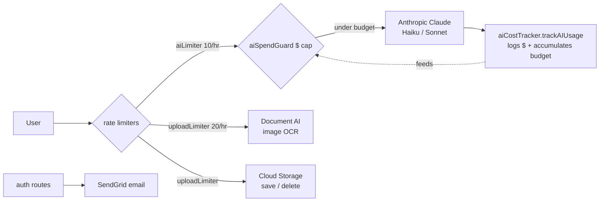
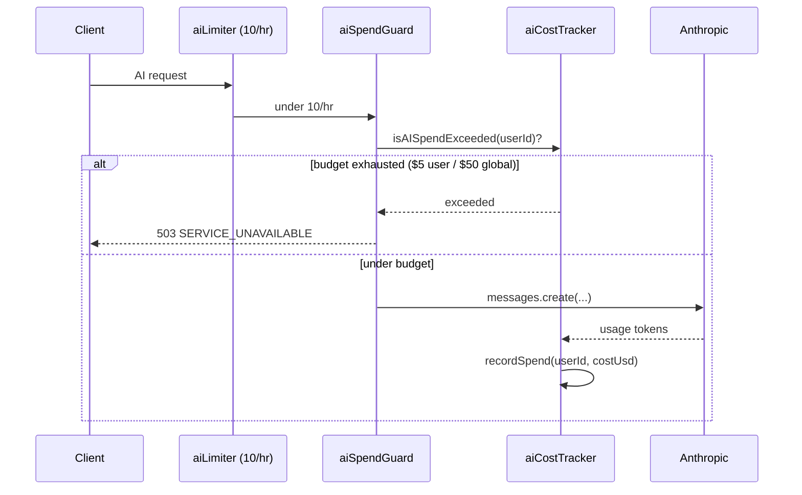

# FINANCIAL_TRACKER.md

> **Unit-economics + runway reference for OwnMyHealth.**
> What does this app cost to run per user, which services are metered, where the cost ceilings live in code, and what the in-code pricing tiers imply for break-even.
> Generated: 2026-06-01. All code claims cite `file:path:line` against repo HEAD.

This doc extracts the **structure** of costs from the codebase. Actual dollar figures (Cloud Run / Cloud SQL bills, savings, runway) live in the GCP billing console and the owner's records; those are marked `TBD (external: …)` with a resolution path. The code-derivable parts — which paid services are wired, per-token Anthropic pricing, the dollar circuit breaker, rate-limit ceilings, and the in-code plan tiers — are all here with citations.

---

## 1. Cost structure (derived from code)

Every external service the app pays for, its metered unit, the code entry point, the governing rate limit / cap, and where the per-unit cost is defined.

| Service | Metered unit | Code entry point | Governing rate limit / cap | Per-unit cost (ref) |
|---|---|---|---|---|
| Anthropic Claude API (**Haiku**) | input + output tokens | `claudeExtraction.ts:150` (lab extraction), `aiChatController.ts:39` + call (AI chat), `biomarkerRoutes.ts:233`/`:270` (biomarker guidance) — model `claude-haiku-4-5-20251001` | `aiLimiter` 10/hr/user (`rateLimiter.ts:108`) **then** `aiSpendGuard` dollar cap (`aiSpendGuard.ts:23`) | `aiCostTracker.ts:17` → $0.80/1M in, $4.00/1M out |
| Anthropic Claude API (**Sonnet**) | input + output tokens | `sbcExtraction.ts:808` (SBC extraction), `expenseController.ts:689` (cost analysis) — model `claude-sonnet-4-5-20250929` | `aiLimiter` + `aiSpendGuard` | `aiCostTracker.ts:18` → $3.00/1M in, $15.00/1M out |
| Google Document AI | pages processed (image OCR only) | `ocrService.ts:298` (`client.processDocument`), gated at `ocrService.ts:264` | `uploadLimiter` 20/hr (`rateLimiter.ts:76`) | GCP pricing (external) |
| Google Cloud Storage | GB-months stored + ops (`save`/`delete`/signed URL) | `storageService.ts:64` (`file.save`), `:124` (`file.delete`), bucket `config.gcp.bucketName` (`storageService.ts:25`) | `uploadLimiter` / `sensitiveLimiter` | GCP pricing (external) |
| SendGrid | emails sent (verification, password reset, email-change) | `emailService.ts:38` (`getSendGridClient`), enabled iff `SENDGRID_API_KEY` set (`config/index.ts:149`) | none (no per-email limiter — bounded only by `authLimiter`/`strictAuthLimiter` on the triggering auth routes) | SendGrid tier (external) |
| Cloud Run (backend) | vCPU-seconds + requests | deployed by `.github/workflows/deploy.yml:82` (`--max-instances=3`; no `--cpu`/`--memory` → Cloud Run defaults 1 vCPU / 512 MiB) | global `standardLimiter` + per-route limiters | GCP pricing (external) |
| Cloud SQL (PostgreSQL) | instance-hour + storage | not in repo — connection via `DATABASE_URL` (`config/index.ts:344-347` required in prod/staging) | n/a | GCP pricing (external) |
| Redis / Cloud Memorystore | instance-hour (**only if `REDIS_URL` set**) | `rateLimitStore.ts:41` (`new Redis(config.redis.url)`); deps `ioredis`, `rate-limit-redis` (`backend/package.json:34,41`) | n/a | GCP pricing — billed only when enabled (external) |

**Paid SDKs confirmed** in `backend/package.json` (`backend/package.json:20-25,34,41`):

```json
// Source: backend/package.json:L20-L25
"@anthropic-ai/sdk": "^0.91.1",
"@google-cloud/documentai": "^9.5.0",
"@google-cloud/storage": "^7.19.0",
"@prisma/adapter-pg": "^7.8.0",
"@prisma/client": "^7.7.0",
"@sendgrid/mail": "^8.1.4",
```


<sub>Source: `rateLimiter.ts:76,108`, `aiSpendGuard.ts:23`, `ocrService.ts:298`, `storageService.ts:64`, `emailService.ts:38`, `aiCostTracker.ts:91`.</sub>

**No paid observability/monitoring SDK is wired.** A search for `sentry|datadog|logflare|axiom|newrelic|prometheus|opentelemetry` over `backend/package.json` returns **no matches** — the only hits across the repo are in prompt files, generated Prisma runtime, and the word "sentry/-l" appearing incidentally. Logging is in-process structured logging (`utils/logger.ts`), shipped to Cloud Logging implicitly by Cloud Run (no SDK cost).

---

## 2. Fixed costs

These are billed whether or not anyone uses the app. Instance sizing is derivable from the deploy workflows; dollar amounts are not in the repo.

| Line item | Repo-derivable structure | Dollar amount |
|---|---|---|
| Cloud Run baseline | `--max-instances=3`, no `--cpu`/`--memory` flags → Cloud Run defaults **1 vCPU / 512 MiB** per instance (`.github/workflows/deploy.yml:88`; staging `deploy-staging.yml:67`). Scales to zero when idle, so baseline ≈ $0 when no traffic. | `TBD (external: actual Cloud Run $/mo — GCP billing console, project ownmyhealth-prod)` |
| Cloud SQL (PostgreSQL) | Required in prod/staging via `DATABASE_URL` (`config/index.ts:344-351`). Instance class not in repo. | `TBD (external: instance class + $/mo — GCP Console / Cloud SQL, project ownmyhealth-prod)` |
| Redis / Cloud Memorystore | **Only billed if `REDIS_URL` is set** (`config/index.ts:125-127`). Currently optional — `createRateLimitStore` returns `undefined` and falls back to in-process MemoryStore when unset (`rateLimitStore.ts:71-72`). | `TBD (external: only if enabled — GCP Console / Memorystore)` |
| Domain (`ownmyhealth.io`) | API at `api.ownmyhealth.io` (`deploy.yml:176`), staging `api-staging.ownmyhealth.io` (`deploy-staging.yml:73`). | `TBD (external: registrar invoice)` |
| Frontend hosting | GCS static bucket `ownmyhealth-frontend` (`deploy.yml:25,234`). Storage + egress only. | `TBD (external: GCP billing console)` |
| Monitoring / security subscriptions | **None wired** — no observability SDK in `backend/package.json`. | $0 (confirm none added before relying on this) |

**Sizing snippet** (the only place CPU/memory/instances are set — `railway.toml` holds build/deploy/healthcheck only, no sizing, see `backend/railway.toml:1-14`):

```yaml
# Source: .github/workflows/deploy.yml:L82-L89
gcloud run deploy ${{ env.SERVICE }} \
  --image "$IMAGE" \
  --region "${{ env.REGION }}" \
  --project "${{ env.PROJECT_ID }}" \
  --platform managed \
  --no-traffic \
  --max-instances=3 \
  --tag "$TAG"
```

---

## 3. Variable costs (per call)

| Cost driver | Unit price (in code where present) | Source |
|---|---|---|
| Anthropic Haiku | input `$0.80 / 1M tokens`, output `$4.00 / 1M tokens` | `aiCostTracker.ts:17` |
| Anthropic Sonnet | input `$3.00 / 1M tokens`, output `$15.00 / 1M tokens` | `aiCostTracker.ts:18` |
| Document AI | per page processed (price external) | `ocrService.ts:298` returns `pageCount` (`ocrService.ts:306`) |
| SendGrid email | per email (price external) | `emailService.ts:38` |
| GCS storage/ops | per GB-month + per op (price external) | `storageService.ts:64,124` |

The **per-call cost math lives only in `aiCostTracker.trackAIUsage`**, not at the call sites. Every successful Claude call passes its token usage here:

```ts
// Source: backend/src/services/aiCostTracker.ts:L16-L19
const PRICING: Record<string, { input: number; output: number }> = {
  'claude-haiku-4-5-20251001': { input: 0.80 / 1_000_000, output: 4.0 / 1_000_000 },
  'claude-sonnet-4-5-20250929': { input: 3.0 / 1_000_000, output: 15.0 / 1_000_000 },
};
```

```ts
// Source: backend/src/services/aiCostTracker.ts:L91-L96
export function trackAIUsage(record: AIUsageInput): void {
  const pricing = PRICING[record.model] || PRICING['claude-sonnet-4-5-20250929'];
  const estimatedCostUsd = (record.inputTokens * pricing.input) + (record.outputTokens * pricing.output);

  recordSpend(record.userId, estimatedCostUsd);
```

**Worked per-call examples** (using the in-code prices; token counts are *assumptions*, marked):

| Endpoint | Model | Assumed in/out tokens | Cost = in·price_in + out·price_out |
|---|---|---|---|
| AI chat (`ai-chat`) | Haiku | 4,500 in / 1,000 out (`aiChatController.ts:52` budget, `:40` `MAX_OUTPUT_TOKENS=1000`) | 4500·$0.0000008 + 1000·$0.000004 = **$0.0076** |
| Biomarker guidance (`biomarker-guidance`) | Haiku | 1,500 in / 800 out (assumed) | 1500·$0.0000008 + 800·$0.000004 = **$0.0044** |
| Lab extraction (`lab-extraction`) | Haiku | 6,000 in / 2,000 out (`claudeExtraction.ts:151` `max_tokens: 8192`) | 6000·$0.0000008 + 2000·$0.000004 = **$0.0128** |
| SBC extraction (`sbc-extraction`) | Sonnet | 8,000 in / 6,000 out (`sbcExtraction.ts:809` `max_tokens: 16384`) | 8000·$0.000003 + 6000·$0.000015 = **$0.114** |
| Cost analysis (`cost-analysis`) | Sonnet | 3,000 in / 2,000 out (`expenseController.ts:690` `max_tokens: 4000`) | 3000·$0.000003 + 2000·$0.000015 = **$0.039** |

> Token counts above are **assumptions** for illustration — real usage is whatever Anthropic returns in `response.usage` and is logged at `estimatedCostUsd` precision (`aiCostTracker.ts:102`). The Sonnet endpoints (SBC + cost analysis) are ~10-15× pricier per call than the Haiku endpoints.

---

## 4. AI dollar-budget circuit breaker (the tightest ceiling)

The **binding** cost ceiling for Anthropic spend is a dollar circuit breaker, not the request-count rate limiter. Two rolling per-UTC-day budgets:

| Budget | Env var | Default | Scope | Source |
|---|---|---|---|---|
| Global daily | `AI_DAILY_BUDGET_USD` | **$50/day** | per Cloud Run instance | `config/index.ts:196` |
| Per-user daily | `AI_USER_DAILY_BUDGET_USD` | **$5/day** | per user, per instance | `config/index.ts:197` |

```ts
// Source: backend/src/config/index.ts:L195-L198
ai: {
  dailyBudgetUsd: Number(process.env.AI_DAILY_BUDGET_USD ?? '50'),
  userDailyBudgetUsd: Number(process.env.AI_USER_DAILY_BUDGET_USD ?? '5'),
},
```

Enforcement: `aiSpendGuard` middleware reads the accumulator **before** each AI call and fails closed with `503` when exhausted (`aiSpendGuard.ts:30-47`). The accumulator is updated **after** each call by `trackAIUsage → recordSpend` (`aiCostTracker.ts:56-60,95`).

```ts
// Source: backend/src/services/aiCostTracker.ts:L69-L78
export function isAISpendExceeded(userId: string): { exceeded: boolean; scope: 'global' | 'user' | null } {
  rollIfNewDay();
  if (config.ai.dailyBudgetUsd > 0 && globalSpentUsd >= config.ai.dailyBudgetUsd) {
    return { exceeded: true, scope: 'global' };
  }
  if (config.ai.userDailyBudgetUsd > 0 && (userSpentUsd.get(userId) ?? 0) >= config.ai.userDailyBudgetUsd) {
    return { exceeded: true, scope: 'user' };
  }
  return { exceeded: false, scope: null };
}
```


<sub>Source: `aiRoutes.ts:31-32`, `aiSpendGuard.ts:23-47`, `aiCostTracker.ts:69-105`.</sub>

**Caveat — per-instance accumulator.** The budgets are in-memory per Cloud Run instance (`aiCostTracker.ts:29-41`). Under autoscale the effective ceiling is **N × budget**, bounded by `--max-instances=3` (`deploy.yml:88`). So the *true* worst case today is:

- Per-user: $5/day × 3 instances = **$15/day/user** worst case (≈ $450/mo if a single user somehow lands on all 3 instances every day).
- Global: $50/day × 3 = **$150/day** instance-diluted worst case (≈ $4,500/mo).
- A shared store (Memorystore) would restore exact single-instance precision (`aiCostTracker.ts:34-37`).

The endpoints carrying both `aiLimiter` and `aiSpendGuard`: AI chat (`aiRoutes.ts:31-32`), biomarker guidance (`biomarkerRoutes.ts:122-123`), expense cost analysis (`expenseRoutes.ts:113-114`), SBC extraction routes (`insuranceRoutes.ts:122-123,135-136`).

---

## 5. Per-user cost model

```
cost_per_user_per_month =
    fixed_infra / active_users
  + min( Anthropic_calls_per_user * avg_cost_per_call,
         AI_USER_DAILY_BUDGET_USD * 30 )   # = $5 * 30 = $150/mo hard cap per instance
  + Document_AI_pages_per_user * cost_per_page
  + emails_per_user * cost_per_email
  + GCS_storage_per_user * cost_per_GB_month
```

`avg_cost_per_call` is weighted by which model each endpoint uses (Haiku $0.80/$4.00, Sonnet $3.00/$15.00 per 1M — `aiCostTracker.ts:17-18`).

**Stated assumptions** (mark and tune):

- **AI biomarker guidance**: assume 20 calls/user/month. Bounded by `aiLimiter` at 10/hour (`rateLimiter.ts:108`) AND by the per-user `$5/day` budget (`config/index.ts:197`) AND by the plan limit `aiGuidancePerDay` (FREE = 5/day, `plans.ts:52`).
- **AI chat**: assume 30 messages/user/month. Plan limit `aiChatsPerDay` (FREE = 3/day, PRO = 50/day — `plans.ts:48,67`).
- **SBC extraction / cost analysis (Sonnet)**: assume 1 SBC + 1 cost analysis/user/month. FREE: `pdfUploadsPerMonth = 2`, `costAnalysisPerMonth = 1` (`plans.ts:49,53`).
- **Document AI**: ~0 pages for most users — only triggered for *image* uploads, and only when `GOOGLE_BAA_ACTIVE=true` (`ocrService.ts:274`). PDFs go to Claude, not Document AI (`ocrService.ts:394-397`).
- **Email**: ~2 emails/user lifetime (verify + occasional reset), so per-month ≈ 0.

**Illustrative variable cost/user/month** (using §3 per-call figures, assumptions above):

```
AI guidance:  20 × $0.0044  = $0.088
AI chat:      30 × $0.0076  = $0.228
SBC (Sonnet):  1 × $0.114   = $0.114
Cost analysis: 1 × $0.039   = $0.039
                              --------
Anthropic subtotal          ≈ $0.47 / user / month   (well under the $150/mo dollar cap)
+ Document AI ≈ $0, SendGrid ≈ $0, GCS ≈ pennies (PDFs ~MBs)
```

So the dominant per-user *driver* is the fixed-infra-amortized term (`fixed_infra / active_users`), not the AI calls — until a user approaches their daily caps. See §7 for the exploit ceiling.

---

## 6. Break-even table

Revenue inputs are the **in-code display prices** from `plans.ts` (PRO $9.99/mo, TEAM $19.99/mo). Prices are stored in **cents** (`plans.ts:35`): PRO `price: 999` (`plans.ts:64`), TEAM `price: 1999` (`plans.ts:83`), FREE `price: 0` (`plans.ts:45`). Annual: PRO `9900` ($99/yr), TEAM `19900` ($199/yr) (`plans.ts:65,84`).

```ts
// Source: backend/src/config/plans.ts:L60-L65
PRO: {
  tier: 'PRO',
  name: 'Pro',
  description: 'Full health intelligence',
  price: 999,
  annualPrice: 9900,
```

**Assumed adoption mix (external GTM decision):** 80% FREE, 15% PRO, 5% TEAM. Variable cost/user from §5 ≈ $0.47/mo (call it ~$0.50). Fixed infra is `TBD (external: GCP billing)` — modeled at $0 below to isolate the revenue side; add the real fixed line once known.

| Users | Paying (15% PRO + 5% TEAM) | Monthly revenue (PRO·$9.99 + TEAM·$19.99) | Variable cost (~$0.50/user) | Net (before fixed infra) |
|---|---|---|---|---|
| 100 | 15 PRO + 5 TEAM | 15·$9.99 + 5·$19.99 = **$249.80** | 100·$0.50 = $50 | **+$199.80** |
| 500 | 75 PRO + 25 TEAM | 75·$9.99 + 25·$19.99 = **$1,249.00** | 500·$0.50 = $250 | **+$999.00** |
| 1000 | 150 PRO + 50 TEAM | 150·$9.99 + 50·$19.99 = **$2,498.00** | 1000·$0.50 = $500 | **+$1,998.00** |

> **Break-even is gated entirely by fixed infra, not variable cost.** With ~$0.50/user variable cost and ~$2.50 blended revenue/user at the assumed mix, gross margin per user is strongly positive; the question is how many paying users cover the monthly Cloud Run + Cloud SQL bill. Fill the fixed-infra line (§2) from the GCP console, then break-even ≈ `fixed_infra / (blended_revenue_per_user − variable_per_user)`.

**Caveat — revenue is potential, not realized.** No payment processor is wired. Plans are assigned manually:

```ts
// Source: backend/src/config/plans.ts:L1-L7
/**
 * Subscription plan configuration.
 *
 * Defines what each tier gets. No payment processing yet — plans are assigned
 * manually via the admin panel or a direct DB update. When Stripe is added,
 * its webhook handler will update the same `users.plan` column.
 */
```

`price` is annotated `// monthly price in cents (display only, no billing)` (`plans.ts:35`). No Stripe/billing SDK appears in either `package.json`.

---

## 7. Rate-limit cost ceilings

The request-count limits are the **loose** bound. The **binding** AI ceiling is the dollar circuit breaker (§4): `AI_USER_DAILY_BUDGET_USD` $5/day → **~$150/user/month** per instance, and `AI_DAILY_BUDGET_USD` $50/day global. Whichever is smaller wins.

| Endpoint family | Limit (window/max) | Source | Max calls/user/month (loose) | Max cost/user/month |
|---|---|---|---|---|
| AI guidance / chat / extraction / cost analysis | `aiLimiter` 10/hour/user | `rateLimiter.ts:108-125` | ~7,200 (10·720h) | **min(count·per-call, $150/mo dollar cap)** — the $5/day budget binds first |
| Upload (`/upload/*`, SBC upload) | `uploadLimiter` 20/hour | `rateLimiter.ts:76-89` | ~14,400 | Document AI page price · pages (external) — but PDFs route to Claude (Haiku), capped by the AI dollar budget |
| Sensitive ops (export, delete, file download, FHIR) | `sensitiveLimiter` 10/hour | `rateLimiter.ts:92-105` | ~7,200 | GCS ops only — negligible $ |
| Provider access requests | `providerAccessRequestLimiter` 10/hour/user | `rateLimiter.ts:133-154` | ~7,200 | **negligible — no metered external service** |
| Bulk operations | `bulkOperationLimiter` 30/hour | `rateLimiter.ts:157-170` | ~21,600 | DB only — no external metered cost |
| Auth (register/verify/reset) | `authLimiter` 20/15min, `strictAuthLimiter` 5/15min | `rateLimiter.ts:37-73` | bounds SendGrid email volume | SendGrid email · count (external) |
| Global default | `standardLimiter` `RATE_LIMIT_MAX_REQUESTS=100` / 15 min | `rateLimiter.ts:17-34`, `config/index.ts:117-118` | — | n/a |

**On-paper AI exploit (count-only)** vs **dollar-capped reality:**

- Count-only worst case for a Sonnet endpoint at 10/hr: 7,200 calls/mo × ~$0.114 (SBC) ≈ **$821/user/mo** — but this is **never reachable** because…
- the per-user `$5/day` budget refuses further AI calls once spent (`aiSpendGuard.ts:30`), so the real cap is **$5 × 30 = $150/user/month** per instance (×3 instances worst case = $450/mo, §4).

```
                aiLimiter (count)           aiSpendGuard (dollars)   ← BINDING
AI per user/mo: ~7,200 calls (loose)   →    $150/mo cap ($5/day)
```

The eight rate limiters default to **in-memory per-instance** stores; under N instances each count ceiling is N×limit, bounded by `--max-instances=3` until `REDIS_URL` switches them to a shared store (`rateLimitStore.ts:5-15,71-72`).

---

## 8. Per-tier variable cost (consumable caps from `plans.ts`)

`-1` = unlimited (`plans.ts:118-120`), `0` = disabled, `N` = max in window. Caps that drive metered spend per tier:

| Limit field | FREE | PRO | TEAM | Drives | Source |
|---|---|---|---|---|---|
| `aiChatsPerDay` | 3 | 50 | -1 (unlimited) | Haiku tokens | `plans.ts:48,67,86` |
| `aiGuidancePerDay` | 5 | -1 | -1 | Haiku tokens | `plans.ts:52,71,90` |
| `costAnalysisPerMonth` | 1 | -1 | -1 | Sonnet tokens | `plans.ts:53,72,91` |
| `pdfUploadsPerMonth` | 2 | 20 | -1 | Claude (Haiku/Sonnet) extraction | `plans.ts:49,68,87` |
| `maxBiomarkers` (total stored) | 50 | -1 | -1 | DB rows (no external $) | `plans.ts:50,69,88` |
| `insurancePlans` (active) | 1 | 5 | -1 | DB rows | `plans.ts:51,70,89` |
| `questFhirIntegration` | false | true | true | external Quest API (not metered in repo) | `plans.ts:57,76,95` |

**Max metered spend a tier can drive (per user/month), before the dollar cap intervenes:**

- **FREE** is naturally cheap: 3 chats/day + 5 guidance/day + 1 cost analysis/mo + 2 PDF uploads/mo. Worst case ≈ (3·30·$0.0076 chat) + (5·30·$0.0044 guidance) + (1·$0.039) + (2·$0.06 PDF) ≈ **~$1.50/user/mo** — far under $150 budget cap.
- **PRO** (50 chats/day, unlimited guidance + cost analysis): the **$5/day dollar budget** (`config/index.ts:197`) becomes the real ceiling → **$150/user/mo** per instance. PRO revenue $9.99/mo, so a PRO user maxing AI would be loss-making — the dollar cap is what prevents an unbounded loss.
- **TEAM** (all unlimited): same $5/day dollar cap binds → **$150/user/mo** per instance ceiling. TEAM revenue $19.99/mo.

This is exactly why the dollar circuit breaker exists: unlimited tiers have **no count-based ceiling**, so without `aiSpendGuard` an abusive PRO/TEAM account could run Anthropic spend unbounded (`aiSpendGuard.ts:1-15`).

Plan enforcement path: route → `requirePlanLimit('<field>')` (`planGating.ts:37`) → `checkPlanLimit` (`usageTracker.ts:125`) → counts current usage (`usageTracker.ts:148-157`). Plan read fresh from DB under RLS, with `planExpiresAt` runtime downgrade to FREE (`planGating.ts:60-75`).

---

## 9. Current position / runway (external)

Intentionally external — not derivable from code. Slots + resolution path:

| Field | Value | Resolution path |
|---|---|---|
| Personal savings | `TBD (external)` | owner records |
| IRA / reserve | `TBD (external)` | owner records |
| Monthly burn rate | `TBD (external: GCP + SaaS billing)` | compute after filling fixed (§2) + variable (§5) actuals |
| Runway | `TBD (external — derived once burn known)` | savings ÷ burn |
| Revenue (realized) | **$0 today** — no payment processor wired (`plans.ts:5`) | becomes external once Stripe + webhook land |

---

## 10. Business accounts (external)

| Field | Value | Resolution path |
|---|---|---|
| Business credit card(s) | `TBD (external)` | owner / card statements |
| Business bank account | `TBD (external)` | owner / bank |
| GCP billing account | `TBD (external: GCP Console → Billing, project ownmyhealth-prod)` | `deploy.yml:21` names the project `ownmyhealth-prod` |
| SendGrid account / tier | `TBD (external: SendGrid dashboard)` | key in `SENDGRID_API_KEY` (`config/index.ts:150`) |
| Anthropic account / spend | `TBD (external: Anthropic Console billing)` | key in `ANTHROPIC_API_KEY` (`config/index.ts:181`) |

---

## 11. Pricing tiers

Structure and display prices are **in code** (`plans.ts`); only the go-to-market decision (when to turn billing on, conversion targets) is external.

| Tier | Monthly (display) | Annual (display) | Key gates | Source |
|---|---|---|---|---|
| FREE | $0 | $0 | 3 chats/day, 5 guidance/day, 2 PDF/mo, 1 cost analysis/mo, 50 biomarkers, 1 insurance plan, no provider sharing, no Quest FHIR; **data export always on** (HIPAA) | `plans.ts:41-59` |
| PRO | $9.99 (`price: 999`) | $99 (`annualPrice: 9900`) | 50 chats/day, unlimited guidance + cost analysis, 20 PDF/mo, unlimited biomarkers, 5 insurance plans, health profile, provider sharing, Quest FHIR | `plans.ts:60-78` |
| TEAM | $19.99 (`price: 1999`) | $199 (`annualPrice: 19900`) | everything unlimited; "For families and caregivers" | `plans.ts:79-97` |

```ts
// Source: backend/src/config/plans.ts:L56-L57
dataExport: true,            // HIPAA requires this regardless of plan
questFhirIntegration: false,
```

**External:** go-to-market pricing decision, conversion/adoption mix, which billing processor (`plans.ts:5` says Stripe is the intended future processor; not yet wired). → `TBD (external: GTM pricing + Stripe rollout decision, owner)`.

---

## 12. Tax / structure (external)

| Field | Value | Resolution path |
|---|---|---|
| Legal entity (LLC / C-corp / sole prop) | `TBD (external)` | owner / formation docs |
| State of incorporation | `TBD (external)` | owner |
| Tax treatment / EIN | `TBD (external: IRS / accountant)` | owner |
| BAA coverage (Anthropic, Google) | gated in code: `ANTHROPIC_BAA_ACTIVE` (`config/index.ts:185,300`), `GOOGLE_BAA_ACTIVE` (`config/index.ts:176,320`) — **legal agreement status itself is external** | owner / signed BAAs |

---

## Acceptance questions (self-answered from this doc)

1. **Which services does OwnMyHealth pay for?** Anthropic Claude (Haiku + Sonnet), Google Document AI, Google Cloud Storage, SendGrid, Cloud Run, Cloud SQL, and Redis/Memorystore **only if `REDIS_URL` set** — §1 table.
2. **Per-user cost formula?** §5: `fixed_infra/active_users + min(calls·avg_cost, $5/day·30) + DocAI pages·price + emails·price + GCS GB·price`.
3. **What caps worst-case Anthropic cost per user — limiter or dollar budget?** The per-user `AI_USER_DAILY_BUDGET_USD` **$5/day dollar cap binds before** the 10/hr `aiLimiter` (§4, §7).
4. **Which Anthropic models, and which endpoints use each?** **Haiku** (`claude-haiku-4-5-20251001`): AI chat, biomarker guidance, lab extraction. **Sonnet** (`claude-sonnet-4-5-20250929`): SBC extraction, expense cost analysis — §1 table + §3.
5. **Which file hosts the Document AI integration?** `backend/src/services/ocrService.ts` (`processImageWithDocumentAI`, `client.processDocument` at `:298`) — §1.
6. **Fixed vs variable split, conceptually?** Fixed = Cloud Run/SQL/Redis/domain (§2); variable = per-token Anthropic, per-page DocAI, per-email SendGrid, per-GB GCS (§3). Break-even is gated by fixed infra (§6).
7. **Break-even user count at PRO/TEAM?** §6: at 80/15/5 mix, 100 users ≈ +$199.80/mo before fixed infra; exact break-even = `fixed_infra / (blended_rev − variable)` once fixed infra is filled.
8. **Max cost/user if rate limits exploited, and the dollar-capped max?** Count-only ≈ $821/user/mo for Sonnet at 10/hr (never reachable); dollar-capped = **$150/user/mo** per instance ($5/day×30), ×3 instances worst case = $450/mo — §7.
9. **Which fixed costs are repo-derivable vs need GCP console?** Sizing (1 vCPU/512 MiB, max-instances 3) from `deploy.yml`; dollar amounts (Cloud Run, Cloud SQL, Memorystore) from the GCP console — §2.
10. **Which service has no in-repo rate limit / no code cost ceiling?** **SendGrid** has no per-email limiter (only the auth-route limiters indirectly bound it); **Cloud SQL** has no rate-limit cost ceiling in code — §1, §7.
11. **Is any revenue realized?** No — `plans.ts:5` states no payment processing yet; `price` is display-only (`plans.ts:35`); plans assigned manually — §6, §11.

---

## Prompt drift log

- **Document AI cost path.** The prompt's cost-structure table cites `ocrService.ts` for Document AI pages, which is correct, but note the live PDF path does **not** use Document AI — PDFs route to Claude (`ocrService.ts:394-397`); Document AI is **image-OCR only** and is BAA-gated off unless `GOOGLE_BAA_ACTIVE=true` (`ocrService.ts:274`). So Document AI spend is ~$0 in the default configuration. The prompt's `processorType: 'claude-api'` reference (~L252) is the PDF-via-Claude marker inside `ocrService.ts`, consistent with this.
- **No drift on models, pricing, tiers, budgets, or sizing** — all matched the prompt: two models (`claude-haiku-4-5-20251001`, `claude-sonnet-4-5-20250929`), `PRICING` $0.80/$4.00 and $3.00/$15.00 per 1M (`aiCostTracker.ts:17-18`), tiers FREE/$9.99/$19.99 (`plans.ts:44,64,83`), budgets $50/$5 (`config/index.ts:196-197`), `--max-instances=3` with no `--cpu`/`--memory` (`deploy.yml:88`), 8 rate limiters (`rateLimiter.ts`), `railway.toml` carries no sizing (`railway.toml:1-14`).
- **Test artifact note:** `sbcExtraction.test.ts:80` references a third model string `claude-sonnet-4-20250514`, but that is a **test fixture**, not a production call site — all production SBC calls use `claude-sonnet-4-5-20250929` (`sbcExtraction.ts:808`). No production drift.

---

## Related Documents

- [ARCHITECTURE.md](./ARCHITECTURE.md) — which paid services are in the stack and how requests flow through the middleware to them.
- [ENV_VARS.md](./ENV_VARS.md) — paid-service keys (`ANTHROPIC_API_KEY`, `SENDGRID_API_KEY`, `GCS_BUCKET_NAME`, `REDIS_URL`) and the AI-budget env vars (`AI_DAILY_BUDGET_USD`, `AI_USER_DAILY_BUDGET_USD`).
- [ROUTING_TABLE.md](./ROUTING_TABLE.md) — per-endpoint rate limiters and plan-gating middleware that act as cost ceilings.
- [STRATEGY.md](./STRATEGY.md) — pricing tiers, break-even narrative, and go-to-market revenue assumptions.
- [RUNBOOK.md](./RUNBOOK.md) — how to inspect billing, AI-spend logs (`AICost` logger), and rate-limit alerts.
- [API_REFERENCE.md](./API_REFERENCE.md) — the AI / upload endpoint contracts that drive metered spend.
