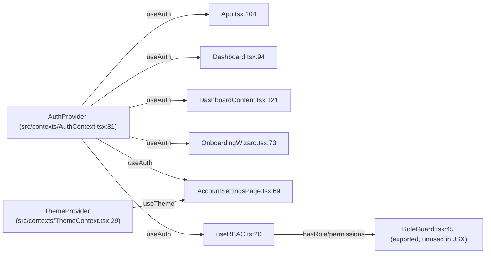
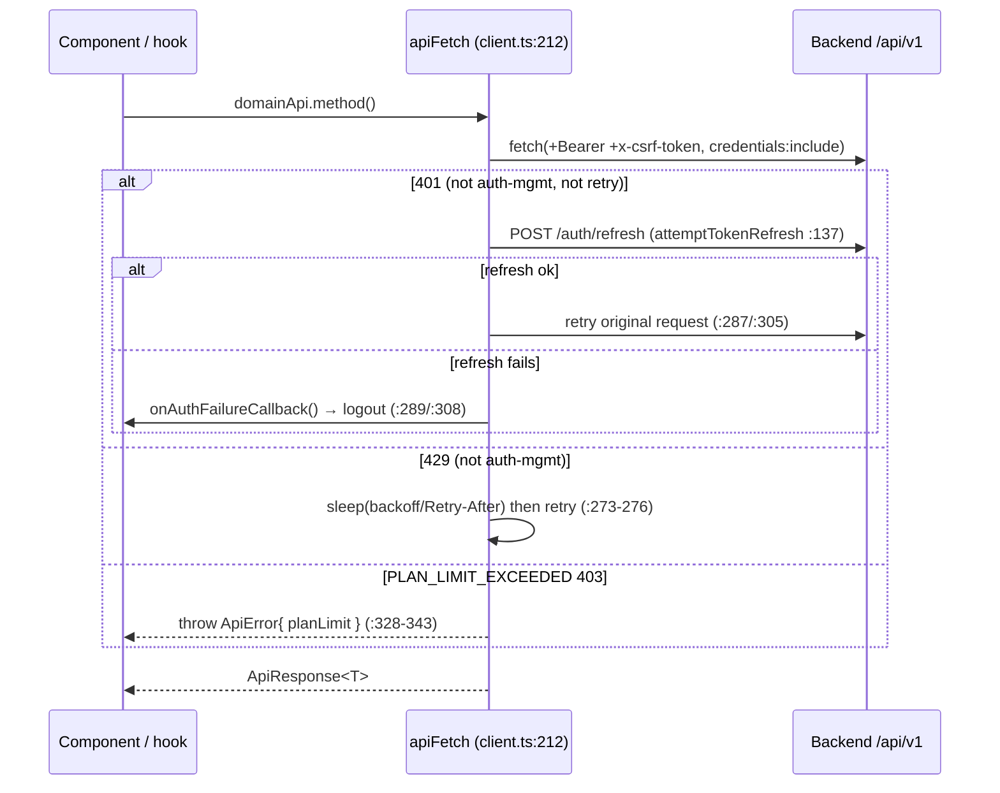
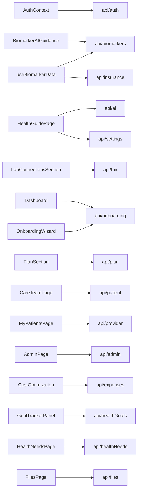

# FRONTEND_MAP.md

> Component + context + API-service atlas for the OwnMyHealth React frontend.
> Generated 2026-06-01 against the live codebase. Every claim cites `file:path:line`.
> Repo root for all paths below: `C:/Users/breil/Projects/OwnMyHealth/` (paths are repo-relative).

This document lets a reader answer "where do I add a new biomarker input field?" or "which component renders the insurance hub?" with **no repo access**. It is a reference, not a walkthrough — scan the tables and diagrams first.

---

## 1. Overview

| Fact | Value | Source |
|---|---|---|
| Total component files | **73** `.tsx` files | `Glob "src/components/**/*.tsx"` (verified count 73) |
| Component directories | **14** (`admin`, `analytics`, `auth`, `biomarkers`, `common`, `dashboard`, `files`, `health`, `insurance`, `onboarding`, `provider`, `settings`, `trends`, `upload`) | `Glob "src/components/*"` (14 dirs) |
| Contexts | **2**: `AuthContext`, `ThemeContext` | `Glob "src/contexts/*.tsx"` |
| API modules | **17** domain modules + `client.ts` core | `Glob "src/services/api/*.ts"` (18 files incl. `index.ts`) |
| Routing library | **None** — no `react-router`; see [§3](#3-routing--url-map) | `package.json` has no router dep (`Grep "react-router"` → no match) |
| State model | **React Context only** (no Redux, no Zustand). PHI is fetched on demand, never persisted. | `src/contexts/AuthContext.tsx:7-12` |

**Routing approach (three layers, all conditional rendering — no `<Route>`):**

1. **Unauthenticated view state** — `App.tsx` switches between `LoginPage` / `RegisterPage` / `ForgotPasswordPage` via a `useState<AuthView>` flag. `src/App.tsx:61`, `src/App.tsx:105`.
2. **URL special routes** — `App.tsx` parses `window.location.pathname` for `/verify-email`, `/reset-password`, `/confirm-email-change` (token in query string). `src/App.tsx:72-90`.
3. **In-app SPA paths** — once authenticated, `Dashboard` reads `window.location.pathname` against `pathToCategoryMap` and pushes history on category change. `src/components/dashboard/categoryRouting.ts:10`, `src/components/dashboard/Dashboard.tsx:100-102`, `:177-184`.

```
                         ┌─────────────────────────────────────────────┐
   window.location  ───▶ │ App.tsx getSpecialRoute()  (src/App.tsx:72)  │
                         └───────────────┬─────────────────────────────┘
                  special route? ────────┤
              yes │                       │ no
                  ▼                       ▼
   VerifyEmail / ResetPassword     isAuthenticated? (AuthContext)
   / ConfirmEmailChange            ┌──────────┴──────────┐
   (src/App.tsx:129-183)       no  │                     │ yes
                                   ▼                     ▼
                    LoginPage/RegisterPage/        Dashboard  (src/App.tsx:292)
                    ForgotPasswordPage                  │
                    (authView state, src/App.tsx:253)   ▼
                                            pathToCategoryMap → selectedCategory
                                            (categoryRouting.ts:10, Dashboard.tsx:100)
```

---

## 2. Component directory catalog

One H3 per directory. Component file → purpose, contexts consumed, API calls. "Calls API" cites the exact call site; components that get data through hooks are marked "(via hook)".

### `src/components/admin/`

Purpose: ADMIN-only console — user management, audit-log viewer, provider–patient relationship oversight, system stats.

| Component | File:line | Renders | Contexts | Calls API |
|---|---|---|---|---|
| `AdminPage` | `src/components/admin/AdminPage.tsx:1` | Tabbed admin console (users / audit / relationships / stats) | — (role gated upstream in `Dashboard`) | `adminApi.getStats` `:67`, `getUsers` `:128`, `deleteUserPermanently` `:165`, `updateUser` `:220`, `updateUserPlan` `:231`, `getAuditLogs` `:284`, `getProviderRelationships` `:371`, `updateProviderRelationship` `:384` |

Route/URL: SPA path `/admin` → category `Admin` (`categoryRouting.ts:20`). Mounted in `Dashboard.renderSpecialPage` `case 'Admin'` (`src/components/dashboard/Dashboard.tsx:312-317`). Role gate: `categories[].roles: ['ADMIN']` (`src/data/sampleData.ts:233`) filtered at `Dashboard.tsx:135` + deep-link gate `Dashboard.tsx:224-244`.

### `src/components/analytics/`

Purpose: health-goal tracking panel (this dir holds **one** component despite the name).

| Component | File:line | Renders | Contexts | Calls API |
|---|---|---|---|---|
| `GoalTrackerPanel` | `src/components/analytics/GoalTrackerPanel.tsx:1` | Goal list + progress + suggestions; uses `recharts` | — | `healthGoalsApi.getAll` `:201`, `getSummary` `:202`, `getSuggestions` `:217`, `delete` `:271`, `update` `:284`, `updateProgress` `:296`, `create` `:307` |

Route/URL: SPA path `/goals` → category `Goals` (`categoryRouting.ts:15`), mounted at `Dashboard.tsx:288-293`.

### `src/components/auth/`

Purpose: login, registration, email verification, password reset/forgot, email-change confirmation.

| Component | File:line | Renders | Contexts | Calls API |
|---|---|---|---|---|
| `LoginPage` | `src/components/auth/LoginPage.tsx` | Email/password form + demo button | — (callbacks from `App`) | via `App` → `useAuth().login` (`src/App.tsx:201-209`) |
| `RegisterPage` | `src/components/auth/RegisterPage.tsx` | Registration form | — | via `App` → `useAuth().register` (`src/App.tsx:226-234`) |
| `ForgotPasswordPage` | `src/components/auth/ForgotPasswordPage.tsx:41` | Request reset email | — | `authApi.forgotPassword` `:41` |
| `ResetPasswordPage` | `src/components/auth/ResetPasswordPage.tsx:62` | New-password form (token route) | — | `authApi.resetPassword` `:62` |
| `VerifyEmailPage` | `src/components/auth/VerifyEmailPage.tsx:17` | Confirms email token | — | `authApi.verifyEmail` `:52` |
| `ConfirmEmailChangePage` | `src/components/auth/ConfirmEmailChangePage.tsx:20` | Confirms email-change token | — | `authApi.confirmEmailChange` `:55` |

Route/URL: unauthenticated view state + URL special routes (`src/App.tsx:129-289`). See [§3](#3-routing--url-map).

### `src/components/biomarkers/`

Purpose: biomarker display, entry, range bars, charts, insurance panel. **Note:** components here do NOT call `biomarkersApi` directly — biomarker data flows in via props from the dashboard hooks (`useBiomarkerData`, `useBiomarkerStats`). The AI-guidance display lives in `trends/`, not here.

| Component | File:line | Renders | Contexts | Calls API |
|---|---|---|---|---|
| `AddMeasurementModal` | `src/components/biomarkers/AddMeasurementModal.tsx` | Manual entry form | — | — (mutation via parent → `useBiomarkerData.handleAddMeasurement`, `Dashboard.tsx:463`) |
| `BiomarkerActionPlan` | `src/components/biomarkers/BiomarkerActionPlan.tsx:83` | Expandable action-plan card for out-of-range markers | — | — (computes from biomarker + insurance props) |
| `BiomarkerChart` | `src/components/biomarkers/BiomarkerChart.tsx:166` | Recharts line chart | — | — (props) |
| `BiomarkerGraph` | `src/components/biomarkers/BiomarkerGraph.tsx:28` | Wraps `BiomarkerChart` for detail/compact views | — | — |
| `BiomarkerInsurancePanel` | `src/components/biomarkers/BiomarkerInsurancePanel.tsx:43` | Modal: insurance coverage for recommended services | — | — (props) |
| `BiomarkerRangeBar` | `src/components/biomarkers/BiomarkerRangeBar.tsx:25` | Compact SVG value-position bar | — | — |
| `BiomarkerSummary` | `src/components/biomarkers/BiomarkerSummary.tsx:27` | Category summary list | — | — (props `biomarkers`, `category`) |
| `TrendModal` | `src/components/biomarkers/TrendModal.tsx` | Modal embedding `BiomarkerChart` | — | — |

Form validation: **hand-rolled** — no Zod / react-hook-form on the frontend (`Grep "from 'zod'|react-hook-form|useForm"` over `src/` → no matches). See [§8](#8-notable-patterns).

Route/URL: rendered inside `Dashboard` via biomarker category state (e.g. `Blood`, `Hormones` in `src/data/sampleData.ts:244-261`) → `CategoryContent` (`Dashboard.tsx:436-449`). These subcategories are **state-only**, not in `categoryRouting.ts` (`categoryRouting.ts:5-8`).

Related API routes: `GET /biomarkers`, `POST /biomarkers`, `POST /biomarkers/:id/guidance` — see [`API_REFERENCE.md`](./API_REFERENCE.md).

### `src/components/common/`

Purpose: shared UI primitives and guards.

| Component | File:line | Renders | Contexts | Calls API |
|---|---|---|---|---|
| `ErrorBoundary` | `src/components/common/ErrorBoundary.tsx` | React error boundary; used keyed-by-category in `Dashboard` (`Dashboard.tsx:387`) | — | — |
| `ErrorToast` | `src/components/common/ErrorToast.tsx:26` | Fixed top-right error toast | — | — |
| `SuccessToast` | `src/components/common/SuccessToast.tsx` | Fixed success toast | — | — |
| `Modal` | `src/components/common/Modal.tsx` | Generic modal shell | — | — |
| `RoleGuard` (+ `PatientOnly`, `ProviderOnly`, `AdminOnly`, `ProviderOrAdmin`, `RoleBadge`) | `src/components/common/RoleGuard.tsx:44` | Conditional render by role via `useRBAC` | `AuthContext` (through `useRBAC`) | — |
| `UploadZone` | `src/components/common/UploadZone.tsx` | Drag-drop file input | — | — |

> **Drift:** `RoleGuard` and its wrappers are exported (`src/components/common/index.ts`) but have **no JSX consumers** in the app — `Grep "<RoleGuard|<ProviderOnly|<AdminOnly|<PatientOnly|<RoleBadge"` over `src/` returns only the definition file. Live role gating is done by filtering `categories[].roles` in `Dashboard.tsx:135` and the deep-link gate at `Dashboard.tsx:224`. See [§9](#9-drift-findings).

### `src/components/dashboard/`

Purpose: the authenticated app shell — header, sidebar, content router, modals.

| Component | File:line | Renders | Contexts | Calls API |
|---|---|---|---|---|
| `Dashboard` | `src/components/dashboard/Dashboard.tsx:93` | App shell + SPA router + role gate + onboarding gate | `useAuth()` (`:94`) | `onboardingApi.getStatus` `:150` (rest via hooks) |
| `DashboardHeader` | `src/components/dashboard/DashboardHeader.tsx:28` | Top nav bar, user menu | — (`user` via props from `Dashboard.tsx:360`) | — |
| `DashboardSidebar` | `src/components/dashboard/DashboardSidebar.tsx:110` | Category nav (mobile drawer + desktop); link hrefs from `categoryToPathMap` | — (props) | — |
| `DashboardContent` | `src/components/dashboard/DashboardContent.tsx:121` | Overview stats grid | `useAuth()` (`:121`) | — (props) |
| `CategoryContent` | `src/components/dashboard/CategoryContent.tsx` | Biomarker category detail view | — | — |
| `CategoryTab` | `src/components/dashboard/CategoryTab.tsx` | Tab pill | — | — |
| `CollapsibleNavGroup` | `src/components/dashboard/CollapsibleNavGroup.tsx` | Sidebar group accordion | — | — |
| `DashboardModals` | `src/components/dashboard/DashboardModals.tsx` | Lazy-mounts all modals (upload, SBC, trend, insurance panel) | — | — (delegated to upload components) |
| `RecentActivity` | `src/components/dashboard/RecentActivity.tsx` | Recent-events list | — | — |
| `getIcon` | `src/components/dashboard/getIcon.tsx` | lucide icon resolver (helper) | — | — |

Non-component sibling: `categoryRouting.ts` — SPA path ↔ category maps (`pathToCategoryMap`, `categoryToPathMap`, `pathForCategory`) (`src/components/dashboard/categoryRouting.ts:10`, `:24`, `:44`).

Route/URL: the shell itself is the authenticated root (`src/App.tsx:292`); in-app paths in [§3b](#3b-in-app-dashboard-spa-paths).

### `src/components/files/`

Purpose: uploaded-file management (list, view, download, delete).

| Component | File:line | Renders | Contexts | Calls API |
|---|---|---|---|---|
| `FilesPage` | `src/components/files/FilesPage.tsx` | File list + actions; signed-URL download via blob | — | `filesApi.getAll` `:35`, `downloadFile` `:61`/`:77`, `delete` `:104` |
| `FileCard` | `src/components/files/FileCard.tsx:23` | Single file card | — | — (props + callbacks) |

Route/URL: SPA path `/files` → category `Files` (`categoryRouting.ts:13`), mounted `Dashboard.tsx:265-270`.

### `src/components/health/`

Purpose: AI health-guide chat and health-needs management.

| Component | File:line | Renders | Contexts | Calls API |
|---|---|---|---|---|
| `HealthGuidePage` | `src/components/health/HealthGuidePage.tsx:92` | Streaming AI chat about your health data | — | `settingsApi.getHealthProfile` `:114`, `aiApi.chat` `:179` (streaming) |
| `HealthNeedsPage` | `src/components/health/HealthNeedsPage.tsx` | Health-needs cards grouped by urgency | — | `healthNeedsApi.getAll` `:107`, `updateStatus` `:140`, `delete` `:153`, `analyze` `:166`, `create` `:185`/`:202` |

Route/URL: `/health-guide` → `Health Guide` (`categoryRouting.ts:17`, `Dashboard.tsx:277-287`); `/needs` → `Needs` (`categoryRouting.ts:16`, `Dashboard.tsx:294-299`).

### `src/components/insurance/`

Purpose: insurance hub, plan CRUD, SBC upload + Claude extraction, expense projections/actuals, cost analysis, plan compare, knowledge base. **Largest directory (18 components).**

| Component | File:line | Renders | Contexts | Calls API |
|---|---|---|---|---|
| `InsuranceHub` | `src/components/insurance/InsuranceHub.tsx:185` | Insurance landing (plans, upload CTAs, stats) | — | — (props/callbacks from `Dashboard.tsx:248`) |
| `InsuranceKnowledgeBase` | `src/components/insurance/InsuranceKnowledgeBase.tsx` | Plan analysis / comparison hub | — | — (props) |
| `AddInsurancePlanModal` | `src/components/insurance/AddInsurancePlanModal.tsx:94` | Manual plan entry + SBC upload | — | `insuranceApi.createPlan` `:94`, `uploadSBC` `:177` |
| `InsuranceSBCUpload` | `src/components/insurance/InsuranceSBCUpload.tsx:40` | SBC PDF upload (basic) | — | `insuranceApi.uploadSBC` `:78` |
| `EnhancedInsuranceUpload` | `src/components/insurance/EnhancedInsuranceUpload.tsx:194` | SBC PDF upload ("smart") | — | `insuranceApi.uploadSBC` `:237` |
| `InsurancePlanCompare` | `src/components/insurance/InsurancePlanCompare.tsx:163` | Side-by-side compare + benefit search | — | `insuranceApi.comparePlans` `:163`, `searchBenefits` `:177` |
| `InsurancePlanDetail` | `src/components/insurance/InsurancePlanDetail.tsx:282` | Single-plan detail + re-analyze | — | `insuranceApi.reanalyzePlan` `:282` |
| `CostOptimization` | `src/components/insurance/CostOptimization.tsx` | Projections + AI cost analysis; `recharts` | — | `expensesApi.getProjections` `:166`, `getAnalyses` `:180`, `deleteProjection` `:229`, `analyzeCosts` `:253` |
| `ExpenseProjectionModal` | `src/components/insurance/ExpenseProjectionModal.tsx` | Projection create/edit | — | `expensesApi.updateProjection` `:128`, `createProjection` `:131` |
| `ExpenseActualModal` | `src/components/insurance/ExpenseActualModal.tsx` | Actual-cost create/edit | — | `expensesApi.updateActual` `:202`, `createActual` `:204` |
| `ExpenseActualsList` | `src/components/insurance/ExpenseActualsList.tsx` | Actuals table | — | `expensesApi.getActuals` `:76`, `deleteActual` `:107` |
| `InsuranceGuide` / `InsuranceLearnTab` / `InsurancePlanCard` / `InsurancePlanViewer` / `InsuranceStatsGrid` / `DeductibleProgressBar` / `InsuranceUtilizationTracker` | (presentational, see `Glob "src/components/insurance/*.tsx"`) | Cards, tabs, stat grids, progress bars | — | — (props) |

Route/URL: `/insurance` → `Insurance` (`categoryRouting.ts:11`, `Dashboard.tsx:246-258`); `/knowledge-base` → `Knowledge Base` (`categoryRouting.ts:12`, `Dashboard.tsx:259-264`). SBC modals open via `useModals` keys `sbcUpload` / `enhancedUpload` (`src/hooks/useModals.ts:19-20`, wired in `DashboardModals.tsx:143-158`).

### `src/components/onboarding/`

Purpose: new-user wizard.

| Component | File:line | Renders | Contexts | Calls API |
|---|---|---|---|---|
| `OnboardingWizard` | `src/components/onboarding/OnboardingWizard.tsx:68` | Step-by-step setup; lazy-mounts `LabUploadModal` | `useAuth()` (`:73`) | `onboardingApi.complete` `:111`/`:124` (status fetched by `Dashboard`, `Dashboard.tsx:150`) |

Route/URL: not a category. Rendered by `Dashboard` when `onboardingStatus.completed === false` (`Dashboard.tsx:164`, `:405-419`).

### `src/components/provider/`

Purpose: provider–patient collaboration (consent-based data sharing).

| Component | File:line | Renders | Contexts | Calls API |
|---|---|---|---|---|
| `CareTeamPage` | `src/components/provider/CareTeamPage.tsx` | **Patient-facing** consent management (approve/deny/edit/revoke providers) | — | `patientApi.getPendingRequests` `:125`, `getProviders` `:126`, `approveProvider` `:154`, `denyProvider` `:173`, `updateProviderPermissions` `:187`, `revokeProvider` `:201`, `removeProvider` `:215` |
| `MyPatientsPage` | `src/components/provider/MyPatientsPage.tsx` | **Provider-facing** patient list + scoped data | — | `providerApi.getPatients` `:100`, `requestPatientAccess` `:118`, `getPatient` `:140`, `getPatientBiomarkers` `:144`, `getPatientHealthNeeds` `:147`, `removePatient` `:160` |

Route/URL: `/care-team` → `Care Team` (`categoryRouting.ts:18`, `Dashboard.tsx:300-305`, all roles); `/my-patients` → `My Patients` (`categoryRouting.ts:19`, `Dashboard.tsx:306-311`, gated `roles: ['PROVIDER','ADMIN']` at `src/data/sampleData.ts:230`).

### `src/components/settings/`

Purpose: account settings hub, password/email change, health profile, plan, notifications, lab connections, data export/deletion.

| Component | File:line | Renders | Contexts | Calls API |
|---|---|---|---|---|
| `AccountSettingsPage` | `src/components/settings/AccountSettingsPage.tsx:69` | Settings shell; theme toggle, export, **account & data deletion** | `useAuth()` `:69`, `useTheme()` `:70` | `settingsApi.getProfile` `:115`, `updateProfile` `:135`, `exportData` `:161`, `deleteAllData` `:190`, `deleteAccount` `:215`; `authApi.logoutAll` `:149` |
| `ChangePasswordModal` | `src/components/settings/ChangePasswordModal.tsx:81` | Change password | — | `settingsApi.changePassword` `:81` |
| `ChangeEmailModal` | `src/components/settings/ChangeEmailModal.tsx:24` | Request email change (step 1 of 2) | — | `authApi.requestEmailChange` `:65` |
| `HealthProfileSection` | `src/components/settings/HealthProfileSection.tsx:163` | Demographics + conditions + meds | — | `settingsApi.getHealthProfile` `:163`, `updateHealthProfile` `:252` |
| `PlanSection` | `src/components/settings/PlanSection.tsx:77` | Current plan tier + usage | — | `planApi.getCurrentPlan` `:94` |
| `NotificationSettingsSection` | `src/components/settings/NotificationSettingsSection.tsx:50` | Email/notification prefs | — | `settingsApi.getNotificationPreferences` `:69`, `updateNotificationPreferences` `:104` |
| `LabConnectionsSection` | `src/components/settings/LabConnectionsSection.tsx:103` | Quest / SMART-on-FHIR lab connections | — | `fhirApi.listConnections` `:120`, `connectQuest` `:170`, `syncConnection` `:192`, `disconnect` `:225` |

Route/URL: `/settings` → `Account Settings` (`categoryRouting.ts:21`, `Dashboard.tsx:318-323`). Section components mounted inside `AccountSettingsPage` (imports `src/components/settings/AccountSettingsPage.tsx:40-45`; render `:406-419`; modals `:514`/`:520`). The email-change **confirm** half is `ConfirmEmailChangePage` in `auth/` (URL route `/confirm-email-change`).

### `src/components/trends/`

Purpose: trend visualizations, AI guidance display, export.

| Component | File:line | Renders | Contexts | Calls API |
|---|---|---|---|---|
| `TrendsPage` | `src/components/trends/TrendsPage.tsx` | Trend overview, embeds `TrendSparkline` | — | — (props `biomarkers`) |
| `BiomarkerAIGuidance` | `src/components/trends/BiomarkerAIGuidance.tsx:36` | Renders AI guidance for a biomarker (collapsible sections, skeleton loading, error+retry) | — | `biomarkersApi.getGuidance` `:56` |
| `TrendSparkline` | `src/components/trends/TrendSparkline.tsx:50` | Mini recharts sparkline | — | — |
| `TrendDetailModal` | `src/components/trends/TrendDetailModal.tsx` | Full-trend modal | — | — |
| `ExportMenu` | `src/components/trends/ExportMenu.tsx` | CSV / PDF report export | — | `settingsApi.getProfile` `:81`; dynamic-imports `exportBiomarkers` `:64` + `pdfReportGenerator` `:88` |

Route/URL: `/trends` → `Trends` (`categoryRouting.ts:14`, `Dashboard.tsx:271-276`). `BiomarkerAIGuidance` is also embedded in trend views (`TrendsPage`, `TrendDetailModal`).

### `src/components/upload/`

Purpose: lab-report / clinical-file upload (PDF parse + OCR + Claude extraction).

| Component | File:line | Renders | Contexts | Calls API |
|---|---|---|---|---|
| `PDFUploadModal` | `src/components/upload/PDFUploadModal.tsx` | Client-side PDF parse via `parseLabReport` | — | — (local parse: `utils/biomarkers/labReportParser` `:14`) |
| `LabUploadModal` | `src/components/upload/LabUploadModal.tsx:81` | Server OCR upload | — | `uploadFile('/upload/lab-results-ocr')` (`:146-147`, via `services/uploadUtils`) |
| `ClinicalFileUpload` | `src/components/upload/ClinicalFileUpload.tsx` | Clinical doc upload | — | (extraction path) |
| `ExtractionReviewStep` | `src/components/upload/ExtractionReviewStep.tsx` | Shared review/confirm step for extracted biomarkers | — | — |

Route/URL: not categories — opened as modals from `Dashboard` via `useModals` keys `pdfUpload` / `labUpload` / `clinicalUpload` (`src/hooks/useModals.ts:15-17`, wired in `DashboardModals.tsx`).

---

## 3. Routing / URL map

There is **no react-router**. Two layers, both verified against code.

### 3a. App.tsx special URL routes + unauthenticated view state

Source: `src/App.tsx`. View state: `useState<AuthView>` (`:105`). Special routes parsed by `getSpecialRoute()` (`:72`).

| Path / view state | Top-level component | Feature | Requires auth | Source |
|---|---|---|---|---|
| `authView === 'login'` | `LoginPage` | Auth | no | `src/App.tsx:277-288` |
| `authView === 'register'` | `RegisterPage` | Auth | no | `src/App.tsx:254-265` |
| `authView === 'forgot-password'` | `ForgotPasswordPage` | Auth | no | `src/App.tsx:267-275` |
| `/verify-email?token=` | `VerifyEmailPage` | Email verification | no | `src/App.tsx:130-146` |
| `/reset-password?token=` | `ResetPasswordPage` | Password reset | no | `src/App.tsx:148-164` |
| `/confirm-email-change?token=` | `ConfirmEmailChangePage` | Email-change confirm | no | `src/App.tsx:166-182` |
| (authenticated, default) | `Dashboard` | App shell | yes | `src/App.tsx:292-296` |

Security note: tokens are stripped from the URL immediately after read via `history.replaceState` (`src/App.tsx:121-126`).

### 3b. In-app dashboard SPA paths

Source: `src/components/dashboard/categoryRouting.ts`. All require auth; all render inside `Dashboard`. The path↔category sync happens at `Dashboard.tsx:100-102` (init), `:177-184` (push on select), `:187-194` (popstate).

| Path | Sidebar category | Top-level component | Source (mount) |
|---|---|---|---|
| `/` | Overview / Dashboard | `DashboardContent` | `Dashboard.tsx:422-434` |
| `/insurance` | Insurance | `InsuranceHub` | `Dashboard.tsx:246-258` |
| `/knowledge-base` | Knowledge Base | `InsuranceKnowledgeBase` | `Dashboard.tsx:259-264` |
| `/files` | Files | `FilesPage` | `Dashboard.tsx:265-270` |
| `/trends` | Trends | `TrendsPage` | `Dashboard.tsx:271-276` |
| `/goals` | Goals | `GoalTrackerPanel` | `Dashboard.tsx:288-293` |
| `/needs` | Needs | `HealthNeedsPage` | `Dashboard.tsx:294-299` |
| `/health-guide` | Health Guide | `HealthGuidePage` | `Dashboard.tsx:277-287` |
| `/care-team` | Care Team | `CareTeamPage` | `Dashboard.tsx:300-305` |
| `/my-patients` | My Patients | `MyPatientsPage` (PROVIDER/ADMIN) | `Dashboard.tsx:306-311` |
| `/admin` | Admin | `AdminPage` (ADMIN) | `Dashboard.tsx:312-317` |
| `/settings` | Account Settings | `AccountSettingsPage` | `Dashboard.tsx:318-323` |

```ts
// Source: src/components/dashboard/categoryRouting.ts:10-22
export const pathToCategoryMap: Record<string, string> = {
  '/insurance': 'Insurance',
  '/knowledge-base': 'Knowledge Base',
  '/files': 'Files',
  '/trends': 'Trends',
  '/goals': 'Goals',
  '/needs': 'Needs',
  '/health-guide': 'Health Guide',
  '/care-team': 'Care Team',
  '/my-patients': 'My Patients',
  '/admin': 'Admin',
  '/settings': 'Account Settings',
};
```

```ts
// Source: src/components/dashboard/Dashboard.tsx:177-184
const handleCategorySelect = useCallback((category: string) => {
  setSelectedCategory(category);
  setSelectedBiomarker(null);
  const newPath = categoryToPathMap[category] || '/';
  if (window.location.pathname !== newPath) {
    window.history.pushState(null, '', newPath);
  }
}, []);
```

Biomarker subcategories (`Blood`, `Hormones`, `Vitamins`, etc., `src/data/sampleData.ts:243-261`) are **state-only** — not in `categoryRouting.ts` — and render `CategoryContent` (`Dashboard.tsx:436-449`).

---

## 4. Context dependency graph

Two contexts. `AuthContext` is consumed indirectly by most role/data logic via the `useRBAC` hook; `ThemeContext` has a single consumer.



`useAuth` consumers (full list from `Grep "useAuth\(\)"` over `src/`, excluding tests):
`App.tsx:104`, `DashboardContent.tsx:121`, `Dashboard.tsx:94`, `OnboardingWizard.tsx:73`, `AccountSettingsPage.tsx:69`, and `useRBAC.ts:20` (which `RoleGuard.tsx:45`/`:118` consumes).

`useTheme` consumer: **only** `AccountSettingsPage.tsx:70` (`Grep "useTheme\(\)"` → single app consumer). Theme is otherwise applied globally by `ThemeProvider` toggling the `dark` class on `document.documentElement` (`src/contexts/ThemeContext.tsx:77-84`).

**What `AuthContext` exposes** (`src/contexts/AuthContext.tsx:58-77`):

```ts
// Source: src/contexts/AuthContext.tsx:58-77
interface AuthContextType {
  user: User | null;          // { id, email, role } — NO PHI (:48-52)
  isAuthenticated: boolean;   // !!user (:248)
  isLoading: boolean;
  login: (email, password) => Promise<void>;
  register: (email, password, firstName?, lastName?) => Promise<void>;
  logout: () => Promise<void>;
  error: string | null;
  setError: (message: string | null) => void;
  clearError: () => void;
}
```

`AuthContext` also runs a HIPAA inactivity watchdog (15-min logout, 13-min warning) — `src/contexts/AuthContext.tsx:40-41`, `:192-231`.

---

## 5. API client overview

The client uses native `fetch` (NOT axios, despite older `CLAUDE.md` text). Single wrapper `apiFetch<T>` (`src/services/api/client.ts:212`). All domain modules call through it.

| Concern | Mechanism | Source |
|---|---|---|
| Base URL | `import.meta.env.VITE_API_URL` ?? `http://localhost:3001/api/v1` | `src/services/api/client.ts:10` |
| Auth header | `Authorization: Bearer <authToken>` when token in memory | `client.ts:224-226` |
| Token storage | **in-memory only** (`let authToken`), never localStorage | `client.ts:65`, `:70-80` |
| CSRF | reads `csrf[_-]?token` cookie, sends `x-csrf-token` header on POST/PUT/PATCH/DELETE | `client.ts:120-135`, `:229-239` |
| Credentials | `credentials: 'include'` on every request (httpOnly cookies) | `client.ts:256` |
| Timeout | 30s default via `AbortController` | `client.ts:12`, `:114-118`, `:250` |
| 401 → refresh | on non-auth-mgmt 401, calls `attemptTokenRefresh()` then retries once; on failure fires `onAuthFailureCallback` | `client.ts:284-311`, `:137-177` |
| Refresh dedup | single in-flight refresh promise shared across callers | `client.ts:66-67`, `:138-141` |
| Auth-failure hook | `setOnAuthFailure` wired to `logout` in `AuthContext` | `client.ts:82-84`; `AuthContext.tsx:239-244` |
| 429 retry | exponential backoff (1s/2s/4s ±25% jitter, max 3), honors `Retry-After`; auth-mgmt endpoints exempt | `client.ts:185-206`, `:267-277` |
| Plan-limit errors | `code: 'PLAN_LIMIT_EXCEEDED'` parsed into `error.planLimit { limit, current, feature, upgradeRequired }`; narrow with `isPlanLimitError` | `client.ts:44-62`, `:328-341` |

```ts
// Source: src/services/api/client.ts:55-62
export function isPlanLimitError(err: unknown): err is ApiError & { planLimit: NonNullable<ApiError['planLimit']> } {
  return (
    typeof err === 'object' &&
    err !== null &&
    (err as ApiError).code === 'PLAN_LIMIT_EXCEEDED' &&
    !!(err as ApiError).planLimit
  );
}
```



`api/ai.ts` is the exception: it calls `fetch` directly for SSE streaming (not through `apiFetch`) and reuses the same plan-limit field shape (`src/services/api/ai.ts:107-141`).

---

## 6. API-to-component matrix

All 17 domain modules (each export `<domain>Api`, re-exported from `src/services/api/index.ts`) + the `client.ts` core. Consumers from `Grep "<module>Api\."` over `src/` (excludes `__tests__`).

| API module (export) | Key functions | Consumed by (file:line) |
|---|---|---|
| `api/auth.ts` (`authApi`) | `login`, `register`, `logout`, `logoutAll`, `getCurrentUser`, `demoLogin`, `refreshToken`, `verifyEmail`, `resetPassword`, `forgotPassword`, `requestEmailChange`, `confirmEmailChange` | `AuthContext.tsx:105,119,143,159,181`; `App.tsx:216`; `VerifyEmailPage.tsx:52`; `ResetPasswordPage.tsx:62`; `ForgotPasswordPage.tsx:41`; `ConfirmEmailChangePage.tsx:55`; `ChangeEmailModal.tsx:65`; `AccountSettingsPage.tsx:149` |
| `api/biomarkers.ts` (`biomarkersApi`) | `getAll`, `getById`, `getHistory`, `getSummary`, `getCategories`, `create`, `createBatch`, `update`, `delete`, `getGuidance` | `useBiomarkerData.ts:120,210,253,299,331`; `useApi.ts:108,118,130,140,145,252,256,261,267`; `BiomarkerAIGuidance.tsx:56` |
| `api/insurance.ts` (`insuranceApi`) | `getPlans`, `getPlanById`, `getBenefits`, `createPlan`, `updatePlan`, `deletePlan`, `uploadSBC`, `comparePlans`, `searchBenefits`, `reanalyzePlan` | `useBiomarkerData.ts:163,229,383,413`; `useApi.ts:154,161,173,272,277,283,287`; `AddInsurancePlanModal.tsx:94,177`; `InsuranceSBCUpload.tsx:78`; `EnhancedInsuranceUpload.tsx:237`; `InsurancePlanCompare.tsx:163,177`; `InsurancePlanDetail.tsx:282` |
| `api/expenses.ts` (`expensesApi`) | `getProjections`, `createProjection`, `updateProjection`, `deleteProjection`, `getActuals`, `createActual`, `updateActual`, `deleteActual`, `getAnalyses`, `analyzeCosts` | `CostOptimization.tsx:166,180,229,253`; `ExpenseProjectionModal.tsx:128,131`; `ExpenseActualModal.tsx:202,204`; `ExpenseActualsList.tsx:76,107` |
| `api/healthGoals.ts` (`healthGoalsApi`) | `getAll`, `getSummary`, `getSuggestions`, `create`, `update`, `updateProgress`, `delete` | `GoalTrackerPanel.tsx:201,202,217,271,284,296,307` |
| `api/healthNeeds.ts` (`healthNeedsApi`) | `getAll`, `getById`, `create`, `updateStatus`, `delete`, `analyze` | `HealthNeedsPage.tsx:107,140,153,166,185,202`; `useApi.ts:187,194,292,297,302` |
| `api/files.ts` (`filesApi`) | `getAll`, `downloadFile`, `delete` | `FilesPage.tsx:35,61,77,104` |
| `api/upload.ts` (`uploadApi`) | `uploadLabReport` | **No direct consumer** — see [§9](#9-drift-findings). Upload components call `uploadFile()` from `services/uploadUtils` directly (`LabUploadModal.tsx:146`). |
| `api/provider.ts` (`providerApi`) | `getPatients`, `requestPatientAccess`, `getPatient`, `getPatientBiomarkers`, `getPatientHealthNeeds`, `removePatient` | `MyPatientsPage.tsx:100,118,140,144,147,160` |
| `api/patient.ts` (`patientApi`) | `getProviders`, `getPendingRequests`, `approveProvider`, `denyProvider`, `updateProviderPermissions`, `revokeProvider`, `removeProvider` | `CareTeamPage.tsx:125,126,154,173,187,201,215` |
| `api/admin.ts` (`adminApi`) | `getStats`, `getUsers`, `updateUser`, `updateUserPlan`, `deleteUserPermanently`, `getAuditLogs`, `getProviderRelationships`, `updateProviderRelationship` | `AdminPage.tsx:67,128,165,220,231,284,371,384` |
| `api/ai.ts` (`aiApi`) | `chat` (SSE streaming) | `HealthGuidePage.tsx:179` |
| `api/settings.ts` (`settingsApi`) | `changePassword`, `getProfile`, `updateProfile`, `getNotificationPreferences`, `updateNotificationPreferences`, `getHealthProfile`, `updateHealthProfile`, `exportData`, `deleteAllData`, `deleteAccount` | `AccountSettingsPage.tsx:115,135,161,190,215`; `HealthProfileSection.tsx:163,252`; `NotificationSettingsSection.tsx:69,104`; `ChangePasswordModal.tsx:81`; `ExportMenu.tsx:81`; `HealthGuidePage.tsx:114` |
| `api/onboarding.ts` (`onboardingApi`) | `getStatus`, `complete` | `Dashboard.tsx:150`; `OnboardingWizard.tsx:111,124` |
| `api/plan.ts` (`planApi`) | `getCurrentPlan` (+ `isUnlimited` helper) | `PlanSection.tsx:94` |
| `api/fhir.ts` (`fhirApi`) | `listConnections`, `connectQuest`, `syncConnection`, `disconnect` | `LabConnectionsSection.tsx:120,170,192,225` |
| `client.ts` (core) | `apiFetch`, `setAuthToken`, `clearAuthToken`, `setOnAuthFailure`, `attemptTokenRefresh`, `isPlanLimitError`, `getCsrfToken` | every `*Api` module; `AuthContext.tsx:34` (`clearAuthToken`, `setOnAuthFailure`) |



---

## 7. Chunk-split components

Two layers: Rollup `manualChunks` vendor splits (`vite.config.ts:17-38`) and route-level `lazy()` per-page chunks.

### 7a. Vendor splits (`manualChunks`)

| Chunk | Libraries | Pulled in by (file:line) | Source |
|---|---|---|---|
| `pdf` | `pdfjs-dist`, `jspdf`, `pdf-lib`, `html2canvas-pro` | `utils/biomarkers/labReportParser.ts:8,10` (← `PDFUploadModal.tsx:14`); `utils/documents/documentParser.ts:1,3` (← `EnhancedInsuranceUpload.tsx`); `utils/insurance/sbcParser.ts:1`; `utils/biomarkers/exportBiomarkers.ts:1` (← `ExportMenu.tsx:64`); `utils/pdfReportGenerator.ts:12-14` (← `ExportMenu.tsx:88`) | `vite.config.ts:19-24` |
| `ocr` | `tesseract.js`, `tesseract.js-core` | `utils/biomarkers/labReportParser.ts:10`; `utils/documents/documentParser.ts:3` (lab/clinical upload path) | `vite.config.ts:27-30` |
| `charts` | `recharts`, `d3-*`, `victory-vendor` | `BiomarkerChart.tsx:28`; `TrendSparkline.tsx:23`; `GoalTrackerPanel.tsx:37`; `CostOptimization.tsx:36` | `vite.config.ts:33-37` |

```ts
// Source: vite.config.ts:19-24
if (id.includes('node_modules/pdfjs-dist/') ||
    id.includes('node_modules/jspdf/') ||
    id.includes('node_modules/pdf-lib/') ||
    id.includes('node_modules/html2canvas-pro/')) {
  return 'pdf';
}
```

> Note: the chunk split is keyed on the **library import**, which lives in `src/utils/*`, not directly in the components. The components above are the *entry points* that transitively load these chunks. `pdf-lib` / `d3-*` / `victory-vendor` are transitive deps of the named libraries (no direct app import found via `Grep`).

### 7b. Route-level `lazy()` per-page chunks

| Lazy component | Loaded when | Source |
|---|---|---|
| `Dashboard`, `LoginPage`, `RegisterPage`, `VerifyEmailPage`, `ResetPasswordPage`, `ForgotPasswordPage`, `ConfirmEmailChangePage` | App-level route resolution | `src/App.tsx:37-43` |
| `InsuranceHub`, `InsuranceKnowledgeBase`, `FilesPage`, `TrendsPage`, `AccountSettingsPage`, `GoalTrackerPanel`, `HealthNeedsPage`, `HealthGuidePage`, `OnboardingWizard`, `CareTeamPage`, `MyPatientsPage`, `AdminPage` | Navigating to that dashboard category | `src/components/dashboard/Dashboard.tsx:44-55` |
| `LabUploadModal`, `PDFUploadModal`, `ClinicalFileUpload`, `InsuranceSBCUpload`, `EnhancedInsuranceUpload`, `BiomarkerInsurancePanel`, `TrendModal`, `InsurancePlanViewer` | Opening the corresponding modal | `src/components/dashboard/DashboardModals.tsx:14-22` |
| `BiomarkerGraph`, `BiomarkerActionPlan` | Expanding a biomarker detail | `src/components/dashboard/CategoryContent.tsx:28-29` |

Loading fallbacks: `LoadingFallback` (full-screen, `src/App.tsx:46-58`) and `PageLoadSpinner` (in-content, `src/components/dashboard/Dashboard.tsx:68-77`).

---

## 8. Notable patterns

**Role gating (live mechanism).** Not `RoleGuard`. The dashboard filters the nav `categories` by `roles` and gates deep links:

```ts
// Source: src/components/dashboard/Dashboard.tsx:134-138
const role = user?.role ?? 'PATIENT';
const visibleCategories = categories.filter((c) => !c.roles || c.roles.includes(role));
const visibleNavGroups = navGroups.filter((g) =>
  visibleCategories.some((c) => c.group === g.id)
);
```

Role data comes from `useRBAC` (`src/hooks/useRBAC.ts:19`), which reads `user.role` from `AuthContext` and exposes `hasRole`, `hasMinRole`, and a `permissions` object (`isAdmin`, `canViewPatients`, etc., `:40-49`). `RoleGuard` (`src/components/common/RoleGuard.tsx:44`) wraps `useRBAC` but is currently unused in JSX.

**Form validation.** Hand-rolled — no validation library. `Grep "from 'zod'|react-hook-form|useForm|zodResolver"` over `src/` returns **no matches**. Forms validate inline (e.g. `AccountSettingsPage` password checks `:182-186`, `:207-211`).

**Error / success display.** `ErrorToast` (`src/components/common/ErrorToast.tsx:26`) and `SuccessToast` (`src/components/common/SuccessToast.tsx`), driven by the `useErrorNotification` hook (`src/hooks/index.ts`) at the dashboard level (`Dashboard.tsx:95`, `:352-356`). Component-local errors use `useState<string | null>` (e.g. `BiomarkerAIGuidance.tsx:42`).

**AI guidance error/loading state.** `BiomarkerAIGuidance` shows a skeleton during load (`:152-159`) and an error block with a retry that clears the cache:

```ts
// Source: src/components/trends/BiomarkerAIGuidance.tsx:82-87
const handleRetry = () => {
  guidanceCache.delete(cacheKey);
  setGuidance(null);
  setError(null);
  fetchGuidance(true);
};
```

**Modal state.** Centralized in `useModals` — a single `Record<ModalName, boolean>` with `open`/`close`/`toggle`/`isOpen` (`src/hooks/useModals.ts:13-24`, `:60-90`). 11 modal names enumerated.

**Error boundaries.** `Dashboard` wraps page content in an `ErrorBoundary` keyed by category (`Dashboard.tsx:387`) and modals in a `fallback={null}` boundary (`:455`), so one page's render error cannot unmount the shell.

---

## 9. Drift findings

| # | Finding | Evidence |
|---|---|---|
| D1 | **`RoleGuard` is dead in JSX.** Exported from `common/index.ts` with `PatientOnly`/`ProviderOnly`/`AdminOnly`/`ProviderOrAdmin`/`RoleBadge`, but `Grep "<RoleGuard\|<ProviderOnly\|<AdminOnly\|<PatientOnly\|<RoleBadge"` over `src/` finds **0** usages. Live gating is the `categories[].roles` filter (`Dashboard.tsx:135`). The spec's Q4/Q5 assume `RoleGuard` is the guard; it is not. | `RoleGuard.tsx:44`; `Dashboard.tsx:134-138`, `:224-244` |
| D2 | **`uploadApi.uploadLabReport` has no consumer.** Exported (`index.ts:49`) but `Grep "uploadApi\."` over `src/` (excl. tests/defs) finds none. Upload components call `uploadFile()` from `services/uploadUtils` directly (`LabUploadModal.tsx:146`). | `upload.ts:7`; `LabUploadModal.tsx:19,146` |
| D3 | **Duplicate SBC upload components.** `InsuranceSBCUpload` (`InsuranceSBCUpload.tsx:40`) and `EnhancedInsuranceUpload` (`EnhancedInsuranceUpload.tsx:194`) both call `insuranceApi.uploadSBC` and are both wired (`DashboardModals.tsx:143-158`, opened via `onUploadSBC`/`onSmartUpload` from `InsuranceHub`). Functional overlap. | `DashboardModals.tsx:143-158`; `Dashboard.tsx:251-252` |
| D4 | **`CLAUDE.md` says the client is "axios + interceptors".** It is native `fetch` with a hand-written `apiFetch` wrapper. | `CLAUDE.md` "Project Structure" vs `client.ts:212,253` |
| D5 | **`CLAUDE.md` lists "13 API modules" / 10 component dirs.** Actual: 17 domain API modules (+`client.ts`+`index.ts`) and 14 component dirs. New since: `ai`, `fhir`, `onboarding`, `plan`, `expenses`, `files`, `patient`, `settings`, `admin`, `provider`; new dirs `analytics`, `health`, `onboarding`, `provider`, plus split `trends`/`upload`. | `Glob "src/services/api/*.ts"` (18); `Glob "src/components/*"` (14) |
| D6 | **`analytics/` dir holds a single component** (`GoalTrackerPanel`), not the "TrendChart, BiomarkerChart" the `CLAUDE.md` structure implies; charts live in `biomarkers/` and `trends/`. | `Glob "src/components/analytics/*.tsx"` → 1 file |

---

## Acceptance questions (self-answered from this doc)

1. **Which directory contains insurance-related components?** `src/components/insurance/` — 18 components ([§2](#srccomponentsinsurance)).
2. **Which component renders the biomarker summary, and which API function does it call?** `BiomarkerSummary` (`BiomarkerSummary.tsx:27`) — calls **no** API; it renders from `biomarkers`/`category` props supplied by the dashboard hooks. The AI-guidance display `BiomarkerAIGuidance` (`trends/`) calls `biomarkersApi.getGuidance` (`:56`). ([§2](#srccomponentsbiomarkers), [§6](#6-api-to-component-matrix))
3. **What context does `DashboardHeader`/`DashboardSidebar` consume, and for what state?** Neither consumes context directly — `user` and nav state arrive via props from `Dashboard` (`Dashboard.tsx:360`, `:369`). `Dashboard` itself reads `useAuth()` for `user`/`logout` (`:94`). ([§2](#srccomponentsdashboard), [§4](#4-context-dependency-graph))
4. **How does a component get the current user's role?** `useRBAC()` (`src/hooks/useRBAC.ts:19-22`), which calls `useAuth()` and reads `user.role` from `AuthContext` (`AuthContext.tsx:48-52`, `:246-256`). ([§4](#4-context-dependency-graph), [§8](#8-notable-patterns))
5. **Which components are gated to PROVIDER/ADMIN, and via what guard?** `MyPatientsPage` (PROVIDER/ADMIN, `sampleData.ts:230`) and `AdminPage` (ADMIN, `sampleData.ts:233`). Guard = the `categories[].roles` filter + deep-link gate in `Dashboard.tsx:135,224` — **not** `RoleGuard` (see drift D1). ([§3b](#3b-in-app-dashboard-spa-paths), [§9](#9-drift-findings))
6. **Where is `AuthContext` defined and what does it expose?** `src/contexts/AuthContext.tsx:79`; exposes `user{id,email,role}`, `isAuthenticated`, `isLoading`, `login`, `register`, `logout`, `error`, `setError`, `clearError` (`:58-77`). ([§4](#4-context-dependency-graph))
7. **Which API module handles SBC upload, and which component uses it?** `insuranceApi.uploadSBC` (`api/insurance.ts`); used by `InsuranceSBCUpload.tsx:78`, `EnhancedInsuranceUpload.tsx:237`, `AddInsurancePlanModal.tsx:177`. ([§6](#6-api-to-component-matrix))
8. **Which components are in the `pdf` chunk, and why?** Entry points `PDFUploadModal`, `EnhancedInsuranceUpload`, `ExportMenu` (via `utils/*` that import `pdfjs-dist`/`jspdf`/`html2canvas-pro`/`pdf-lib`); the libs are split out because they are large and lazy-loaded (`vite.config.ts:19-24`). ([§7a](#7a-vendor-splits-manualchunks))
9. **How many `.tsx` files in `src/components/`, across how many dirs?** **73** files across **14** directories. ([§1](#1-overview))
10. **Routing approach?** No react-router. `App.tsx` view-state + URL special routes ([§3a](#3a-apptsx-special-url-routes--unauthenticated-view-state)) + dashboard `categoryRouting.ts` SPA paths ([§3b](#3b-in-app-dashboard-spa-paths)).
11. **Which component handles account deletion and consent revocation?** Account/data deletion: `AccountSettingsPage` (`deleteAllData:190`, `deleteAccount:215`). Provider-consent revocation (patient side): `CareTeamPage` (`revokeProvider:201`). ([§2](#srccomponentssettings), [§2](#srccomponentsprovider))
12. **Which component displays an AI guidance response, and how does error state look?** `BiomarkerAIGuidance` (`trends/BiomarkerAIGuidance.tsx:36`); on error it sets `error` state and renders an error block with a retry that clears the cache (`:82-87`); skeleton during load (`:152-159`). ([§8](#8-notable-patterns))
13. **Shared form library?** No — forms are hand-rolled, no Zod/react-hook-form (`Grep` → 0 matches). ([§8](#8-notable-patterns))
14. **Which components subscribe to `ThemeContext`?** Only `AccountSettingsPage` (`useTheme()` `:70`); the provider applies the theme globally to `<html>` (`ThemeContext.tsx:77-84`). ([§4](#4-context-dependency-graph))
15. **Which component drives onboarding, and which API feeds it?** `OnboardingWizard` (`onboarding/OnboardingWizard.tsx:68`) calling `onboardingApi.complete`; status is fetched by `Dashboard` via `onboardingApi.getStatus` (`Dashboard.tsx:150`). ([§6](#6-api-to-component-matrix))
16. **Which component manages Quest/FHIR lab connections, and which API?** `LabConnectionsSection` (`settings/LabConnectionsSection.tsx:103`) → `fhirApi` (`listConnections:120`, `connectQuest:170`, `syncConnection:192`, `disconnect:225`). ([§2](#srccomponentssettings), [§6](#6-api-to-component-matrix))
17. **Which component shows plan tier/usage, and which API?** `PlanSection` (`settings/PlanSection.tsx:77`) → `planApi.getCurrentPlan` (`:94`). ([§6](#6-api-to-component-matrix))
18. **Which component(s) handle the email-change flow?** Request: `ChangeEmailModal` (`settings/ChangeEmailModal.tsx:24` → `authApi.requestEmailChange:65`). Confirm: `ConfirmEmailChangePage` (`auth/ConfirmEmailChangePage.tsx:20` → `authApi.confirmEmailChange:55`, URL `/confirm-email-change`). ([§2](#srccomponentsauth), [§2](#srccomponentssettings))
19. **Which component manages notification preferences?** `NotificationSettingsSection` (`settings/NotificationSettingsSection.tsx:50`) → `settingsApi.getNotificationPreferences:69` / `updateNotificationPreferences:104`. ([§6](#6-api-to-component-matrix))

---

## Related Documents

- [ARCHITECTURE.md](./ARCHITECTURE.md) — full-stack diagram, middleware stack, data flows the frontend talks to.
- [API_REFERENCE.md](./API_REFERENCE.md) — per-endpoint contracts behind each `*Api` module (request/response, auth, rate limits).
- [ROUTING_TABLE.md](./ROUTING_TABLE.md) — backend route + middleware chain for every endpoint these components call.
- [LOCAL_DEV.md](./LOCAL_DEV.md) — Vite dev server, ports, chunking, env vars (`VITE_API_URL`, `VITE_DEMO_MODE`).
- [TESTING_PATTERNS.md](./TESTING_PATTERNS.md) — frontend Vitest recipes (see `src/__tests__/`).
- [PHI_TAXONOMY.md](./PHI_TAXONOMY.md) — which fields rendered by these components are PHI and how they're decrypted server-side.

---

## Prompt drift log

- `./39-frontend-component-map-doc.md` and `CLAUDE.md` imply `RoleGuard`/`useRBAC` is the role-gating mechanism (Q4, Q5, §8). **Actual:** `RoleGuard` and all its wrappers are exported but have **0 JSX consumers**; live gating is `categories[].roles` filtering in `Dashboard.tsx:134-138` + the deep-link gate at `Dashboard.tsx:224-244`. `useRBAC` is used only by `RoleGuard` itself. Drift D1.
- The spec's API-matrix stub lists `uploadApi` as consumed by SBC components. **Actual:** `uploadApi.uploadLabReport` has no consumer (`Grep "uploadApi\."` → none); upload components call `uploadFile()` from `services/uploadUtils` directly. Drift D2.
- `CLAUDE.md` "Project Structure" describes `client.ts` as "axios + interceptors" and "13 API modules". **Actual:** native `fetch` wrapper (`client.ts:212`), 17 domain modules. Drift D4/D5 — prompt author should update `00-index.md` "Verified codebase counts".
- The spec's chunk-split table attributes the `pdf`/`ocr`/`charts` chunks directly to components. **Actual:** the Rollup `manualChunks` predicate keys on `node_modules/...` library paths (`vite.config.ts:17-38`); the heavy imports live in `src/utils/*` (`labReportParser.ts`, `documentParser.ts`, `sbcParser.ts`, `exportBiomarkers.ts`, `pdfReportGenerator.ts`) and chart components, which the listed components load transitively. Documented in §7a.
- The spec's per-directory example calls `analytics/` "Trend charts (TrendChart, BiomarkerChart)". **Actual:** `analytics/` holds only `GoalTrackerPanel`; there is no `TrendChart` file anywhere (`Glob` → not found). Drift D6.
