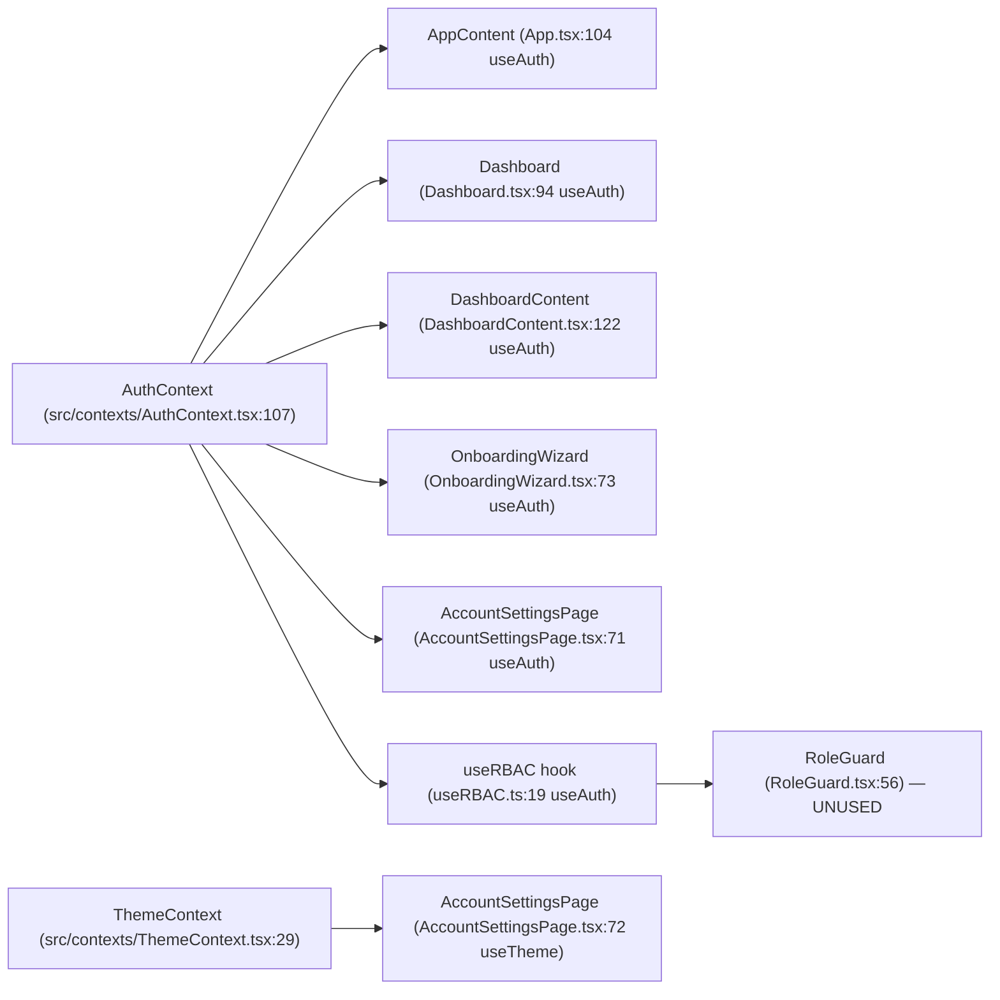
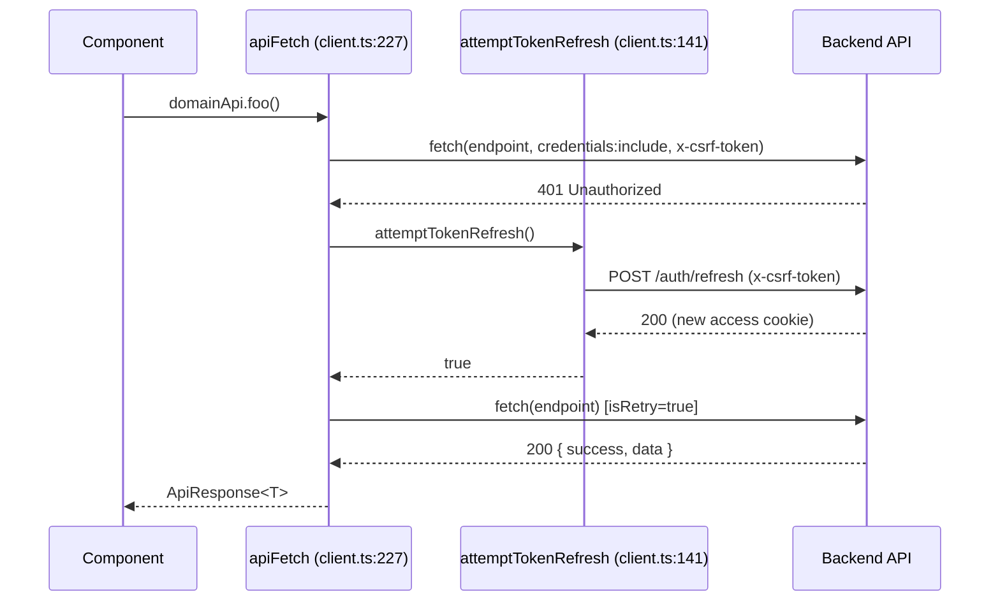

# FRONTEND_MAP.md — Component + Context + API-Service Atlas

> Generated against HEAD `fb2cd32` (2026-06-15). Frontend = Vite + React 18 + TypeScript at repo **root** (`src/`); backend is at `backend/`. All paths below are repo-relative.

This is the navigation atlas for the OwnMyHealth SPA frontend. A reader asking "where do I add a new biomarker input field?", "which component renders the insurance hub?", or "which API module backs the plan tier badge?" should land on the answer here without opening the repo.

## Required reading before generating

This doc was produced under:

1. [`_doc-quality.md`](../prompts/_doc-quality.md) — self-containedness, citation, TBD, cross-link, and format rules.
2. [`_verification-tools.md`](../prompts/_verification-tools.md) — Grep/Glob/Read cheat sheet.

It passes the five tests (question-answering, path-and-line, snippet, diagram, reproducibility) — see [Acceptance questions](#acceptance-questions-self-answered).

---

## 1. Overview

| Fact | Value | Evidence |
|---|---|---|
| Component files (`*.tsx`) under `src/components/` | **73** | `Glob "src/components/**/*.tsx"` → 73 hits |
| Distinct component directories | **14** | `admin, analytics, auth, biomarkers, common, dashboard, files, health, insurance, onboarding, provider, settings, trends, upload` |
| React contexts | **2** | `src/contexts/AuthContext.tsx`, `src/contexts/ThemeContext.tsx` |
| API service modules (`src/services/api/*.ts`) | **18** (17 domain `*Api` objects + `client.ts`) | `Glob "src/services/api/*.ts"` |
| Custom hooks (`src/hooks/*.ts`) | **8** | `useApi`, `useBiomarkerData`, `useBiomarkerStats`, `useBiomarkerTrends`, `useErrorNotification`, `useModals`, `useRBAC`, `index` |
| Routing library | **None (no react-router)** | conditional rendering — see [§3](#3-routing--url-map) |
| State model | **React Context only (no Redux/Zustand/MobX)** | `AuthContext`, `ThemeContext`; data state lives in hooks (`useBiomarkerData`) |
| HTTP transport | **native `fetch`, NOT axios** | `apiFetch` (`src/services/api/client.ts:227`); CLAUDE.md's "axios + interceptors" is stale |

### Routing approach (three layers, no router)

OwnMyHealth has **no react-router**. Navigation is three cooperating mechanisms:

1. **URL special routes** parsed manually in `App.tsx` (`getSpecialRoute`, `src/App.tsx:72`) for `/verify-email`, `/reset-password`, `/confirm-email-change` (token in query string).
2. **Unauthenticated view state** — `authView: 'login' | 'register' | 'forgot-password'` (`src/App.tsx:61,105`).
3. **In-app dashboard SPA paths** — once authenticated, `Dashboard` reads `window.location.pathname`, maps it to a sidebar category via `pathToCategoryMap` (`src/components/dashboard/categoryRouting.ts:10`), and `pushState`s on nav (`src/components/dashboard/Dashboard.tsx:196-203`).

```
                       window.location
                              │
            ┌─────────────────┼──────────────────────────┐
            ▼                 ▼                          ▼
   getSpecialRoute()    authView state           pathToCategoryMap[pathname]
   (App.tsx:72)         (App.tsx:61,105)         (categoryRouting.ts:10)
            │                 │                          │
   /verify-email      LoginPage / RegisterPage    selectedCategory state
   /reset-password    ForgotPasswordPage          (Dashboard.tsx:100)
   /confirm-email-change                                 │
            │                 │                          ▼
            ▼                 ▼               renderSpecialPage() switch
      <Suspense> page    <Suspense> page      (Dashboard.tsx:238-354)
```

---

## 2. Component directory catalog

Per-directory `.tsx` counts (authoritative — verified `Glob "src/components/<dir>/*.tsx"`; the older "9/22/11" counts in some inventories double-counted `index.ts` barrels and helper `.ts` files — see [Prompt drift log](#prompt-drift-log)):

| Dir | `.tsx` | Non-`.tsx` helpers present |
|---|---|---|
| admin | 1 | `index.ts` |
| analytics | 1 | `index.ts` |
| auth | 6 | `index.ts` |
| biomarkers | 8 | `index.ts` |
| common | 6 | `index.ts` |
| dashboard | 10 | `categoryRouting.ts`, `index.ts` (note: `getIcon.tsx` is `.tsx`) |
| files | 2 | `index.ts` |
| health | 2 | (none) |
| insurance | 18 | `index.ts`, `insuranceKnowledgeBaseConstants.ts`, `useInsuranceKnowledgeBase.ts` |
| onboarding | 1 | `index.ts` |
| provider | 2 | (none) |
| settings | 7 | `index.ts` |
| trends | 5 | `index.ts` |
| upload | 4 | `index.ts` |
| **Total** | **73** | |

### `src/components/admin/`

Purpose: admin console — user management, audit-log viewer, system health stats.

| Component | File:line | Renders | Consumes contexts | Calls API |
|---|---|---|---|---|
| `AdminPage` | `src/components/admin/AdminPage.tsx:470` | User table, audit log, stats | (none directly) | `adminApi.*` (`AdminPage.tsx`) |

Route/URL: `/admin` → category `Admin` (`categoryRouting.ts:20`); lazy-loaded + role-rechecked in `Dashboard.renderSpecialPage` (`Dashboard.tsx:336-341,248-268`). Restricted to ADMIN via `categories[].roles` filter + defensive recheck.

### `src/components/analytics/`

Purpose: health-goal tracking panel (the `analytics` dir holds the Goals page despite the name).

| Component | File:line | Renders | Consumes contexts | Calls API |
|---|---|---|---|---|
| `GoalTrackerPanel` | `src/components/analytics/GoalTrackerPanel.tsx:176` | Goal list, progress, suggestions, create | (none directly) | `healthGoalsApi.getAll/getSummary/getSuggestions/create/update/updateProgress/delete` (`GoalTrackerPanel.tsx:201-307`) |

Route/URL: `/goals` → category `Goals` (`categoryRouting.ts:16`); lazy at `Dashboard.tsx:49`, rendered `Dashboard.tsx:312-317`.

### `src/components/auth/`

Purpose: login, registration, email verification, password reset, email-change confirm.

| Component | File:line | Renders | Consumes contexts | Calls API |
|---|---|---|---|---|
| `LoginPage` | `src/components/auth/LoginPage.tsx:33` | Login form (+ demo) | via props from `App` (`useAuth` lives in `App`) | — (login via `AuthContext.login`) |
| `RegisterPage` | `src/components/auth/RegisterPage.tsx:36` | Register form + resend verify | via props | `authApi.resendVerification` (`RegisterPage.tsx:120`) |
| `ForgotPasswordPage` | `src/components/auth/ForgotPasswordPage.tsx:15` | Request-reset form | — | `authApi.forgotPassword` (`ForgotPasswordPage.tsx:41`) |
| `ResetPasswordPage` | `src/components/auth/ResetPasswordPage.tsx:17` | New-password form (token) | — | `authApi.resetPassword` (`ResetPasswordPage.tsx:62`) |
| `VerifyEmailPage` | `src/components/auth/VerifyEmailPage.tsx:17` | Verify-token result | — | `authApi.verifyEmail` (`VerifyEmailPage.tsx:52`) |
| `ConfirmEmailChangePage` | `src/components/auth/ConfirmEmailChangePage.tsx:20` | Email-change confirm (token) | — | `authApi.confirmEmailChange` (`ConfirmEmailChangePage.tsx:55`) |

Form validation: **hand-rolled** — no `react-hook-form`/`zod`/`formik`/`yup` anywhere in `src/` (`Grep "react-hook-form|zod|formik|yup"` → No files found). Forms use `useState` + manual checks.

Route/URL: `LoginPage`/`RegisterPage`/`ForgotPasswordPage` are `authView` states in `App.tsx` (`src/App.tsx:253-289`); `VerifyEmailPage`/`ResetPasswordPage`/`ConfirmEmailChangePage` are special URL routes (`src/App.tsx:129-183`). All auth pages are `lazy()`-imported (`src/App.tsx:37-43`).

### `src/components/biomarkers/`

Purpose: biomarker display, manual entry, charts, range bars, per-marker insurance panel, action plans.

| Component | File:line | Renders | Consumes contexts | Calls API |
|---|---|---|---|---|
| `BiomarkerSummary` | `src/components/biomarkers/BiomarkerSummary.tsx:27` | Per-category stat cards | — | **— (props only)**; computes in/out-of-range from `biomarkers` prop (`BiomarkerSummary.tsx:30-49`) |
| `AddMeasurementModal` | `src/components/biomarkers/AddMeasurementModal.tsx:37` | Manual entry form | — | — (mutation via parent `onAdd` → `useBiomarkerData`) |
| `BiomarkerChart` | `src/components/biomarkers/BiomarkerChart.tsx:166` | recharts line chart | — | — (charts chunk) |
| `BiomarkerGraph` | `src/components/biomarkers/BiomarkerGraph.tsx:29` | Compact sparkline/graph | — | — (charts chunk) |
| `BiomarkerRangeBar` | `src/components/biomarkers/BiomarkerRangeBar.tsx:25` | In/out-of-range bar (a11y-announced) | — | — (props) |
| `BiomarkerActionPlan` | `src/components/biomarkers/BiomarkerActionPlan.tsx:83` | Static action card for out-of-range markers | — | — (computes from biomarker + insurance props) |
| `BiomarkerInsurancePanel` | `src/components/biomarkers/BiomarkerInsurancePanel.tsx:43` | Coverage panel for a marker | — | — (props) |
| `TrendModal` | `src/components/biomarkers/TrendModal.tsx:30` | Trend modal wrapper | — | — (props) |

**Important:** components in `biomarkers/` do **not** call `biomarkersApi` directly. Biomarker data flows through hooks — `useBiomarkerData` (`src/hooks/useBiomarkerData.ts:50` → `biomarkersApi.getAll`) and `useBiomarkerStats`/`useFilteredBiomarkers` — and the dashboard passes the results down as props. The only component that displays an AI-guidance response and calls the biomarker AI endpoint is `BiomarkerAIGuidance` (in `trends/`, see below).

Route/URL: rendered via dashboard category state (`Dashboard.renderSpecialPage` is for non-biomarker pages; biomarker categories render through `CategoryContent`/`DashboardContent`, `Dashboard.tsx:449-476`). No SPA path — biomarker subcategories are state-only (`categoryRouting.ts:6` comment).

Related API routes: `GET /biomarkers`, `POST /biomarkers`, `POST /biomarkers/batch`, `POST /biomarkers/:id/guidance` — see [`API_REFERENCE.md`](./API_REFERENCE.md).

### `src/components/common/`

Purpose: shared UI primitives + role guard + toasts + error boundary.

| Component | File:line | Renders | Notes |
|---|---|---|---|
| `ErrorBoundary` | `src/components/common/ErrorBoundary.tsx` | React error boundary | Wraps `App`, `Dashboard` main, and modals (`App.tsx:301`, `Dashboard.tsx:414,482`) |
| `Modal` | `src/components/common/Modal.tsx:55` | Generic modal shell | — |
| `UploadZone` | `src/components/common/UploadZone.tsx:53` | Drag-drop upload area | — |
| `ErrorToast` | `src/components/common/ErrorToast.tsx:26` | Dismissible error toast (`role="alert"`) | See [§8](#8-notable-patterns) snippet |
| `SuccessToast` | `src/components/common/SuccessToast.tsx:26` | Dismissible success toast (`role="status"`) | — |
| `RoleGuard` | `src/components/common/RoleGuard.tsx:55` | Role-gated wrapper (+ `PatientOnly`/`ProviderOnly`/`AdminOnly`/`ProviderOrAdmin`/`RoleBadge`) | **Currently UNUSED by any rendered component** (audit L-18) — see [§9 Drift](#9-drift-findings) |

### `src/components/dashboard/`

Purpose: app shell — header, sidebar, content panes, modal orchestration, lightweight router.

| Component | File:line | Renders | Consumes contexts |
|---|---|---|---|
| `Dashboard` | `src/components/dashboard/Dashboard.tsx:93` | App shell + router | `useAuth()` (`Dashboard.tsx:94`) |
| `DashboardHeader` | `src/components/dashboard/DashboardHeader.tsx:28` | Top nav bar, user menu | receives `user` prop from `Dashboard` |
| `DashboardSidebar` | `src/components/dashboard/DashboardSidebar.tsx:110` | Category nav (mobile drawer + desktop) | receives `navGroups`/`categories`/`selectedCategory` props |
| `DashboardContent` | `src/components/dashboard/DashboardContent.tsx:110` | Overview stats pane | `useAuth()` (`DashboardContent.tsx:122`) |
| `CategoryContent` | `src/components/dashboard/CategoryContent.tsx:121` | Biomarker category detail | props |
| `DashboardModals` | `src/components/dashboard/DashboardModals.tsx:88` | All modal dialogs | props |
| `CategoryTab` | `src/components/dashboard/CategoryTab.tsx:29` | Single sidebar tab (`href` from `categoryRouting`) | props |
| `CollapsibleNavGroup` | `src/components/dashboard/CollapsibleNavGroup.tsx:23` | Sidebar group | props |
| `RecentActivity` | `src/components/dashboard/RecentActivity.tsx:68` | Recent-activity list | props |
| `getIcon` | `src/components/dashboard/getIcon.tsx:60` | Icon resolver (helper) | — |

`DashboardHeader`/`DashboardSidebar` do **not** call `useAuth` themselves — `Dashboard` reads `useAuth()` once (`Dashboard.tsx:94`) and passes `user` (id, email, role) + `onLogout` down (`Dashboard.tsx:386-407`). For the role state used to filter nav, see `role = user?.role ?? 'PATIENT'` (`Dashboard.tsx:134`).

Route/URL: `Dashboard` is the authenticated root (`App.tsx:292-296`); the SPA path↔category table lives in `categoryRouting.ts`.

### `src/components/files/`

Purpose: lab-file management — list, view, download, delete.

| Component | File:line | Renders | Calls API |
|---|---|---|---|
| `FilesPage` | `src/components/files/FilesPage.tsx:22` | File list page | `filesApi.*` (`FilesPage.tsx`) |
| `FileCard` | `src/components/files/FileCard.tsx:23` | Single file row (view/download/delete) | — (callbacks via props) |

Route/URL: `/files` → `Files` (`categoryRouting.ts:13`); lazy at `Dashboard.tsx:46`, rendered `Dashboard.tsx:289-294`. Upload is triggered via `onUploadClick → modals.open('pdfUpload')`.

### `src/components/health/`

Purpose: AI health-guide chat + health-needs tracking. **2 files** (not 3 — `HealthGuidePage`, `HealthNeedsPage`).

| Component | File:line | Renders | Consumes contexts | Calls API |
|---|---|---|---|---|
| `HealthGuidePage` | `src/components/health/HealthGuidePage.tsx:92` | Streaming AI chat | — | `aiApi.chat` (`HealthGuidePage.tsx:179`), `settingsApi.getHealthProfile` (`HealthGuidePage.tsx:114`) |
| `HealthNeedsPage` | `src/components/health/HealthNeedsPage.tsx:82` | Health-needs cards by urgency | — | `healthNeedsApi.getAll/create/updateStatus/delete/analyze` (`HealthNeedsPage.tsx:107-202`) |

Route/URL: `/health-guide` → `Health Guide` (`categoryRouting.ts:17`, lazy `Dashboard.tsx:51`, rendered `Dashboard.tsx:301-311`); `/needs` → `Needs` (`categoryRouting.ts:15`, lazy `Dashboard.tsx:50`, rendered `Dashboard.tsx:318-323`).

### `src/components/insurance/`

Purpose: insurance hub, plan CRUD/compare/view, SBC/enhanced upload, knowledge base, expense projections/actuals, cost analysis. Largest dir (18 `.tsx`).

| Component | File:line | Purpose | Calls API |
|---|---|---|---|
| `InsuranceHub` | `src/components/insurance/InsuranceHub.tsx:185` | Hub (plans, stats, upload triggers) | via props/children |
| `InsuranceKnowledgeBase` | `src/components/insurance/InsuranceKnowledgeBase.tsx:26` | Searchable benefits KB | (data via `useInsuranceKnowledgeBase.ts`) |
| `InsuranceSBCUpload` | `src/components/insurance/InsuranceSBCUpload.tsx:40` | SBC PDF upload modal | `insuranceApi.uploadSBC` (`InsuranceSBCUpload.tsx`, see [§9](#9-drift-findings)) |
| `EnhancedInsuranceUpload` | `src/components/insurance/EnhancedInsuranceUpload.tsx:194` | "Smart" multi-doc upload modal | `insuranceApi.uploadSBC` (same endpoint — duplicate) |
| `AddInsurancePlanModal` | `src/components/insurance/AddInsurancePlanModal.tsx:60` | Manual plan entry | `insuranceApi.*` |
| `InsurancePlanCard` | `src/components/insurance/InsurancePlanCard.tsx:98` | Plan summary card (+ `formatCurrency` exports) | — |
| `InsurancePlanDetail` | `src/components/insurance/InsurancePlanDetail.tsx:240` | Plan detail view | `insuranceApi.*` |
| `InsurancePlanCompare` | `src/components/insurance/InsurancePlanCompare.tsx:125` (`InsuranceKnowledgePanel`) | Compare panel | `insuranceApi.*` |
| `InsurancePlanViewer` | `src/components/insurance/InsurancePlanViewer.tsx:51` | Modal plan viewer | — |
| `InsuranceStatsGrid` | `src/components/insurance/InsuranceStatsGrid.tsx:19` | Stat cards | — |
| `InsuranceUtilizationTracker` | `src/components/insurance/InsuranceUtilizationTracker.tsx:60` | Utilization view | — |
| `InsuranceGuide` | `src/components/insurance/InsuranceGuide.tsx:58` (`InsuranceEducationPanel`) | Education panel | — |
| `InsuranceLearnTab` | `src/components/insurance/InsuranceLearnTab.tsx:46` | Learn tab | — |
| `DeductibleProgressBar` | `src/components/insurance/DeductibleProgressBar.tsx:18` | Deductible bar | — |
| `CostOptimization` | `src/components/insurance/CostOptimization.tsx:147` | Cost-optimization card | `insuranceApi.*` |
| `ExpenseProjectionModal` | `src/components/insurance/ExpenseProjectionModal.tsx:53` | Projection entry | `expensesApi.createProjection/updateProjection` |
| `ExpenseActualModal` | `src/components/insurance/ExpenseActualModal.tsx:112` | Actual entry | `expensesApi.createActual/updateActual` |
| `ExpenseActualsList` | `src/components/insurance/ExpenseActualsList.tsx:60` | Actuals list | `expensesApi.getActuals/deleteActual` |

Route/URL: `/insurance` → `Insurance` (`categoryRouting.ts:11`, rendered `Dashboard.tsx:270-282`); `/knowledge-base` → `Knowledge Base` (`categoryRouting.ts:12`, rendered `Dashboard.tsx:283-288`).

### `src/components/onboarding/`

| Component | File:line | Renders | Consumes contexts | Calls API |
|---|---|---|---|---|
| `OnboardingWizard` | `src/components/onboarding/OnboardingWizard.tsx:68` | First-session step wizard | `useAuth()` (`OnboardingWizard.tsx:73`) | `onboardingApi.complete` (`OnboardingWizard.tsx:111,124`) |

Route/URL: not a category path — rendered conditionally inside `Dashboard` when `onboardingStatus.completed === false` (`Dashboard.tsx:183,432-446`). `Dashboard` itself fetches `onboardingApi.getStatus()` (`Dashboard.tsx:153`).

### `src/components/provider/`

Purpose: provider-collaboration UI (patient-facing consent + provider-facing patient list).

| Component | File:line | Renders | Calls API | Role |
|---|---|---|---|---|
| `CareTeamPage` | `src/components/provider/CareTeamPage.tsx:105` | **Patient**-facing consent management (approve/deny/edit/revoke providers) | `patientApi.getPendingRequests/getProviders/approveProvider/denyProvider/updateProviderPermissions/revokeProvider/removeProvider` (`CareTeamPage.tsx:130-220`) | PATIENT (all roles can reach) |
| `MyPatientsPage` | `src/components/provider/MyPatientsPage.tsx:73` | **Provider**-facing list of consented patients | `providerApi.*` (`MyPatientsPage.tsx`) | PROVIDER/ADMIN |

Route/URL: `/care-team` → `Care Team` (`categoryRouting.ts:18`, rendered `Dashboard.tsx:324-329`); `/my-patients` → `My Patients` (`categoryRouting.ts:19`, rendered `Dashboard.tsx:330-335`, role-rechecked).

### `src/components/settings/`

Purpose: account settings, profile, password/email change, health profile, notifications, plan tier, lab connections.

| Component | File:line | Renders | Consumes contexts | Calls API |
|---|---|---|---|---|
| `AccountSettingsPage` | `src/components/settings/AccountSettingsPage.tsx:70` | Settings shell — profile, export, **delete data**, **delete account**, logout-all | `useAuth()` + `useTheme()` (`AccountSettingsPage.tsx:71-72`) | `settingsApi.getProfile/updateProfile/exportData/deleteAllData/deleteAccount`, `authApi.logoutAll` (`AccountSettingsPage.tsx:117-217`) |
| `ChangePasswordModal` | `src/components/settings/ChangePasswordModal.tsx:14` | Password change | — | `settingsApi.changePassword` (`ChangePasswordModal.tsx:81`) |
| `ChangeEmailModal` | `src/components/settings/ChangeEmailModal.tsx:24` | Email-change **request** | — | `authApi.requestEmailChange` (`ChangeEmailModal.tsx:65`) |
| `HealthProfileSection` | `src/components/settings/HealthProfileSection.tsx:137` | Health profile editor | — | `settingsApi.getHealthProfile/updateHealthProfile` (`HealthProfileSection.tsx:163,252`) |
| `NotificationSettingsSection` | `src/components/settings/NotificationSettingsSection.tsx:50` | **Notification preferences** | — | `settingsApi.getNotificationPreferences/updateNotificationPreferences` (`NotificationSettingsSection.tsx:69,104`) |
| `PlanSection` | `src/components/settings/PlanSection.tsx:82` | **Plan tier + usage** | — | `planApi.getCurrentPlan` (`PlanSection.tsx:99`) |
| `LabConnectionsSection` | `src/components/settings/LabConnectionsSection.tsx:106` | **Quest/FHIR lab connections** | — | `fhirApi.listConnections/connectQuest/syncConnection/disconnect` (`LabConnectionsSection.tsx:125-235`) |

Route/URL: `/settings` → `Account Settings` (`categoryRouting.ts:21`, lazy `Dashboard.tsx:48`, rendered `Dashboard.tsx:342-350`). The settings sub-sections render inside `AccountSettingsPage`.

### `src/components/trends/`

Purpose: trend visualizations, AI guidance display, export menu.

| Component | File:line | Renders | Calls API |
|---|---|---|---|
| `TrendsPage` | `src/components/trends/TrendsPage.tsx:89` | Trends page (per-marker trend list) | — (biomarkers via props) |
| `BiomarkerAIGuidance` | `src/components/trends/BiomarkerAIGuidance.tsx:36` | **AI guidance display** for a marker | `biomarkersApi.getGuidance(biomarker.id)` (`BiomarkerAIGuidance.tsx:56`) |
| `TrendDetailModal` | `src/components/trends/TrendDetailModal.tsx:43` | Per-marker detail modal | — |
| `TrendSparkline` | `src/components/trends/TrendSparkline.tsx:50` | Inline sparkline | — (charts chunk) |
| `ExportMenu` | `src/components/trends/ExportMenu.tsx:33` | PDF/CSV export menu | `settingsApi.getProfile` (`ExportMenu.tsx:81`); jspdf/html2canvas (pdf chunk) |

Route/URL: `/trends` → `Trends` (`categoryRouting.ts:14`, lazy `Dashboard.tsx:47`, rendered `Dashboard.tsx:295-300`).

### `src/components/upload/`

Purpose: file/lab upload modals + OCR/extraction review.

| Component | File:line | Renders | Calls API |
|---|---|---|---|
| `PDFUploadModal` | `src/components/upload/PDFUploadModal.tsx:65` | PDF upload modal | — (pdf chunk; extract via parent) |
| `LabUploadModal` | `src/components/upload/LabUploadModal.tsx:84` | Lab upload + OCR review | `biomarkersApi.delete/update` on review (`LabUploadModal.tsx:183-184`) |
| `ClinicalFileUpload` | `src/components/upload/ClinicalFileUpload.tsx:86` | Clinical file upload | — |
| `ExtractionReviewStep` | `src/components/upload/ExtractionReviewStep.tsx:70` | OCR review/edit step | — (props) |

Route/URL: no SPA path — these are modals opened via `modals.open('pdfUpload' | 'labUpload' | 'clinicalUpload')` from `Dashboard`/`DashboardModals` (`Dashboard.tsx:457-459,483-497`).

---

## 3. Routing / URL map

There is **no react-router**. Two routing layers:

### (a) `App.tsx` special URL routes + unauthenticated view state

| Path / view state | Top-level component | Feature | Requires auth | Source |
|---|---|---|---|---|
| `authView === 'login'` | `LoginPage` | Auth | no | `App.tsx:277-289` |
| `authView === 'register'` | `RegisterPage` | Auth | no | `App.tsx:254-265` |
| `authView === 'forgot-password'` | `ForgotPasswordPage` | Auth | no | `App.tsx:267-275` |
| `/verify-email?token=` | `VerifyEmailPage` | Email verification | no | `App.tsx:130-146` |
| `/reset-password?token=` | `ResetPasswordPage` | Password reset | no | `App.tsx:148-164` |
| `/confirm-email-change?token=` | `ConfirmEmailChangePage` | Email-change confirm | no | `App.tsx:166-182` |
| `?sessionExpired=true` | `LoginPage` + idle notice | HIPAA idle logoff landing | no | `AuthContext.tsx:128-142` |
| (authenticated) | `Dashboard` | App shell | yes | `App.tsx:292-296` |

State pattern: `AppContent` reads `isAuthenticated`/`isLoading` from `useAuth()` (`App.tsx:104`); `specialRoute` short-circuits everything (`App.tsx:129`); then loading spinner; then `!isAuthenticated` branch; else `Dashboard`. Tokens are stripped from the URL immediately after read (`App.tsx:121-126`).

### (b) In-app dashboard SPA paths (all require auth, all render inside `Dashboard`)

| Path | Sidebar category | Top-level component | Source |
|---|---|---|---|
| `/` | Overview / Dashboard | `DashboardContent` | `Dashboard.tsx:449-461` |
| `/insurance` | Insurance | `InsuranceHub` | `Dashboard.tsx:270-282` |
| `/knowledge-base` | Knowledge Base | `InsuranceKnowledgeBase` | `Dashboard.tsx:283-288` |
| `/files` | Files | `FilesPage` | `Dashboard.tsx:289-294` |
| `/trends` | Trends | `TrendsPage` | `Dashboard.tsx:295-300` |
| `/goals` | Goals | `GoalTrackerPanel` | `Dashboard.tsx:312-317` |
| `/needs` | Needs | `HealthNeedsPage` | `Dashboard.tsx:318-323` |
| `/health-guide` | Health Guide | `HealthGuidePage` | `Dashboard.tsx:301-311` |
| `/care-team` | Care Team | `CareTeamPage` | `Dashboard.tsx:324-329` |
| `/my-patients` | My Patients | `MyPatientsPage` | `Dashboard.tsx:330-335` |
| `/admin` | Admin | `AdminPage` | `Dashboard.tsx:336-341` |
| `/settings` | Account Settings | `AccountSettingsPage` | `Dashboard.tsx:342-350` |

```ts
// Source: src/components/dashboard/Dashboard.tsx:196-203 — nav writes the URL
const handleCategorySelect = useCallback((category: string) => {
  setSelectedCategory(category);
  setSelectedBiomarker(null);
  const newPath = categoryToPathMap[category] || '/';
  if (window.location.pathname !== newPath) {
    window.history.pushState(null, '', newPath);
  }
}, []);
```

```ts
// Source: src/components/dashboard/categoryRouting.ts:10-22 — path → category
export const pathToCategoryMap: Record<string, string> = {
  '/insurance': 'Insurance',
  '/knowledge-base': 'Knowledge Base',
  '/files': 'Files',
  '/trends': 'Trends',
  // ... '/goals','/needs','/health-guide','/care-team','/my-patients','/admin','/settings'
};
```

Deep links land on the right page via `pathToCategoryMap[window.location.pathname]` at init (`Dashboard.tsx:100-102`); back/forward syncs via a `popstate` listener (`Dashboard.tsx:206-213`).

---

## 4. Context dependency graph

Two providers wrap the app at `src/App.tsx:301-316`: `ErrorBoundary > ThemeProvider > AuthProvider > AppContent`.



Direct context consumers (verified `Grep "useAuth()|useRBAC()|useTheme()"`):

| Context | Consumer | File:line |
|---|---|---|
| `AuthContext` (`useAuth`) | `AppContent` | `App.tsx:104` |
| | `Dashboard` | `Dashboard.tsx:94` |
| | `DashboardContent` | `DashboardContent.tsx:122` |
| | `OnboardingWizard` | `OnboardingWizard.tsx:73` |
| | `AccountSettingsPage` | `AccountSettingsPage.tsx:71` |
| | `useRBAC` hook (indirect → `RoleGuard`) | `useRBAC.ts:19` |
| `ThemeContext` (`useTheme`) | `AccountSettingsPage` | `AccountSettingsPage.tsx:72` |

> `ThemeContext` is applied globally (it toggles the `dark` class on `<html>`, `ThemeContext.tsx:77-84`) but `useTheme()` is consumed by **only one** component (`AccountSettingsPage`, the theme picker). All other components react to the theme via Tailwind `dark:` classes, not the hook.

### AuthContext exposed shape

```ts
// Source: src/contexts/AuthContext.tsx:84-103 (interface) + :360-370 (value)
interface AuthContextType {
  user: User | null;          // { id, email, role } — non-PHI only (line 74-78)
  isAuthenticated: boolean;   // !!user
  isLoading: boolean;
  login: (email, password) => Promise<void>;
  register: (email, password, firstName?, lastName?) => Promise<void>;
  logout: () => Promise<void>;
  error: string | null;
  setError: (message: string | null) => void;
  clearError: () => void;
}
```

`AuthProvider` also runs a HIPAA idle-logoff watchdog (15-min timeout, 13-min warning dialog, cross-tab `BroadcastChannel` sync) — `AuthContext.tsx:40-57,286-345` — and wires `setOnAuthFailure(logout)` so a failed 401-refresh in the API client triggers logout (`AuthContext.tsx:353-358`).

---

## 5. API client overview

The single transport is `apiFetch` in `src/services/api/client.ts:227` — a native-`fetch` wrapper (no axios). Every domain `*Api` object calls `apiFetch`.

```ts
// Source: src/services/api/client.ts:227-241 — apiFetch core
export async function apiFetch<T>(
  endpoint: string,
  options: RequestInit = {},
  timeoutMs: number = DEFAULT_TIMEOUT_MS,
  isRetry: boolean = false,
  retryCount429: number = 0
): Promise<ApiResponse<T>> {
  const headers: HeadersInit = { 'Content-Type': 'application/json', ...options.headers };
  if (authToken) (headers as Record<string,string>)['Authorization'] = `Bearer ${authToken}`;
```

| Concern | Mechanism | Source |
|---|---|---|
| Base URL | `import.meta.env.VITE_API_URL \|\| 'http://localhost:3001/api/v1'` | `client.ts:10` |
| Auth token | in-memory only (`authToken` module var); sent as `Authorization: Bearer` | `client.ts:65,239-241` |
| Cookies | `credentials: 'include'` on every request (httpOnly access/refresh/csrf cookies) | `client.ts:280` |
| CSRF | reads `csrf_token` cookie (`getCsrfToken`, anchored regex), attaches `x-csrf-token` on POST/PUT/PATCH/DELETE | `client.ts:120-139,244-254` |
| 401 refresh | on 401 (non-auth-mgmt), calls `attemptTokenRefresh()` once; on success replays request, on failure calls `onAuthFailureCallback` | `client.ts:308-316,327-339` |
| Token refresh | `attemptTokenRefresh` POSTs `/auth/refresh` with `x-csrf-token` (refresh is NOT CSRF-exempt); de-dupes concurrent refreshes | `client.ts:141-192` |
| Plan-limit errors | parses `PLAN_LIMIT_EXCEEDED` 403s into `apiError.planLimit {limit,current,feature,upgradeRequired}`; `isPlanLimitError()` narrows | `client.ts:46-62,356-369` |
| 429 retry | exponential backoff (1s/2s/4s ±25% jitter, `Retry-After` honored), 3 attempts; auth-mgmt endpoints exempt | `client.ts:200-301` |
| Timeout | 30s `AbortController` → 408 | `client.ts:12,114-118,378-384` |

```ts
// Source: src/services/api/client.ts:327-339 — one-shot 401 → refresh → replay
if (response.status === 401 && !isRetry && !isAuthMgmtEndpoint) {
  const refreshed = await attemptTokenRefresh();
  if (refreshed) {
    return apiFetch<T>(endpoint, options, timeoutMs, true, retryCount429);
  }
  if (onAuthFailureCallback) { onAuthFailureCallback(); }
}
```



> The AI streaming client (`aiApi.chat`) does **not** go through `apiFetch` — it uses raw `fetch` + `ReadableStream` to read SSE from `/ai/chat` (`src/services/api/ai.ts:1-14`), with its own 60s ceiling and `AbortSignal` support for the Stop button.

---

## 6. API-to-component matrix

All 17 domain `*Api` objects are re-exported from `src/services/api/index.ts` (+ `client.ts` helpers). Consumers below are **non-test** call sites (verified per-module `Grep "<name>Api\\."` over `src/**`, excluding `__tests__`).

| API module | Key functions | Consumed by |
|---|---|---|
| `auth.ts` (`authApi`) | `login`, `logout`, `register`, `refreshToken`, `getCurrentUser`, `demoLogin`, `verifyEmail`, `resendVerification`, `forgotPassword`, `resetPassword`, `requestEmailChange`, `confirmEmailChange`, `logoutAll` | `AuthContext` (`AuthContext.tsx:154,168,192,208,230`), `App` (`App.tsx:216`), `VerifyEmailPage`, `ResetPasswordPage`, `ForgotPasswordPage`, `RegisterPage`, `ConfirmEmailChangePage`, `ChangeEmailModal`, `AccountSettingsPage` (`logoutAll`) |
| `biomarkers.ts` (`biomarkersApi`) | `getAll`, `getById`, `getHistory`, `getSummary`, `getCategories`, `create`, `createBatch`, `update`, `delete`, `getGuidance` | `useBiomarkerData` (`useBiomarkerData.ts:50,62,336,398,452`), `useApi` (`useApi.ts:110-269`), `LabUploadModal` (`LabUploadModal.tsx:183-184`), `BiomarkerAIGuidance` (`getGuidance`, `BiomarkerAIGuidance.tsx:56`) |
| `insurance.ts` (`insuranceApi`) | `uploadSBC` (`insurance.ts:295`), plan CRUD/compare | `InsuranceSBCUpload`, `EnhancedInsuranceUpload`, `AddInsurancePlanModal`, `InsurancePlanDetail`, `InsurancePlanCompare`, `CostOptimization` |
| `expenses.ts` (`expensesApi`) | `getProjections`, `createProjection`, `updateProjection`, `deleteProjection`, `getActuals`, `createActual`, `updateActual`, `deleteActual`, `analyzeCosts`, `getAnalyses`, `updateCurrentSpending` | `ExpenseProjectionModal`, `ExpenseActualModal`, `ExpenseActualsList`, `CostOptimization` |
| `healthGoals.ts` (`healthGoalsApi`) | `getAll`, `getSummary`, `getSuggestions`, `create`, `update`, `updateProgress`, `delete` | `GoalTrackerPanel` (`GoalTrackerPanel.tsx:201-307`) |
| `healthNeeds.ts` (`healthNeedsApi`) | `getAll`, `getById`, `create`, `updateStatus`, `delete`, `analyze` | `HealthNeedsPage` (`HealthNeedsPage.tsx:107-202`), `useApi` (`useApi.ts:189-304`) |
| `settings.ts` (`settingsApi`) | `getProfile`, `updateProfile`, `getHealthProfile`, `updateHealthProfile`, `getNotificationPreferences`, `updateNotificationPreferences`, `changePassword`, `exportData`, `deleteAllData`, `deleteAccount` | `AccountSettingsPage`, `HealthProfileSection`, `NotificationSettingsSection`, `ChangePasswordModal`, `HealthGuidePage` (`getHealthProfile`), `ExportMenu` (`getProfile`) |
| `files.ts` (`filesApi`) | list/view/download/delete | `FilesPage` |
| `upload.ts` (`uploadApi`) | `uploadLabReport` (`upload.ts:8`) | **NONE** (no non-test consumer — see [§9](#9-drift-findings)) |
| `provider.ts` (`providerApi`) | patient-list / patient-data (provider side) | `MyPatientsPage` |
| `patient.ts` (`patientApi`) | `getPendingRequests`, `getProviders`, `approveProvider`, `denyProvider`, `updateProviderPermissions`, `revokeProvider`, `removeProvider` | `CareTeamPage` (`CareTeamPage.tsx:130-220`) |
| `admin.ts` (`adminApi`) | users / audit / stats | `AdminPage` |
| `ai.ts` (`aiApi`) | `chat` (SSE streaming, `ai.ts`) | `HealthGuidePage` (`HealthGuidePage.tsx:179`) |
| `settings.ts` → see above | — | — |
| `onboarding.ts` (`onboardingApi`) | `getStatus`, `complete` | `Dashboard` (`Dashboard.tsx:153,167`), `OnboardingWizard` (`OnboardingWizard.tsx:111,124`) |
| `plan.ts` (`planApi`) | `getCurrentPlan` | `PlanSection` (`PlanSection.tsx:99`) |
| `fhir.ts` (`fhirApi`) | `listConnections`, `connectQuest`, `syncConnection`, `disconnect` | `LabConnectionsSection` (`LabConnectionsSection.tsx:125-235`) |

> Per-endpoint request/response contracts, middleware, and rate limits for each function live in [`API_REFERENCE.md`](./API_REFERENCE.md).

---

## 7. Chunk-split components

### (a) `manualChunks` vendor splits (`vite.config.ts:85-106`)

| Chunk | Vendor libs (`vite.config.ts`) | Components pulling it |
|---|---|---|
| `pdf` | `pdfjs-dist`, `jspdf`, `pdf-lib`, `html2canvas-pro` (`vite.config.ts:87-90`) | `PDFUploadModal`, `InsuranceSBCUpload`, `EnhancedInsuranceUpload`, `ClinicalFileUpload`, `FileCard`, `ExportMenu` (PDF generate/parse/preview) |
| `ocr` | `tesseract.js`, `tesseract.js-core` (`vite.config.ts:95-96`) | `LabUploadModal` / `ClinicalFileUpload` extraction path (client-side OCR) |
| `charts` | `recharts`, `d3-*`, `victory-vendor` (`vite.config.ts:101-103`) | `BiomarkerChart`, `BiomarkerGraph`, `TrendSparkline`, `TrendDetailModal`, `TrendsPage` |

```ts
// Source: vite.config.ts:85-98 — manualChunks
manualChunks: (id) => {
  if (id.includes('node_modules/pdfjs-dist/') ||
      id.includes('node_modules/jspdf/') ||
      id.includes('node_modules/pdf-lib/') ||
      id.includes('node_modules/html2canvas-pro/')) {
    return 'pdf';
  }
  if (id.includes('node_modules/tesseract.js/') ||
      id.includes('node_modules/tesseract.js-core/')) {
    return 'ocr';
  }
  // ... 'charts' for recharts / d3- / victory-vendor
}
```

### (b) Route-level `lazy()` splits (separate per-route chunks)

| Lazy import | Source |
|---|---|
| `Dashboard`, `LoginPage`, `RegisterPage`, `VerifyEmailPage`, `ResetPasswordPage`, `ForgotPasswordPage`, `ConfirmEmailChangePage` | `src/App.tsx:37-43` |
| `InsuranceHub`, `InsuranceKnowledgeBase`, `FilesPage`, `TrendsPage`, `AccountSettingsPage`, `GoalTrackerPanel`, `HealthNeedsPage`, `HealthGuidePage`, `OnboardingWizard`, `CareTeamPage`, `MyPatientsPage`, `AdminPage` | `src/components/dashboard/Dashboard.tsx:44-55` |

Each `lazy()` page renders inside a `<Suspense fallback={<PageLoadSpinner/>}>` (`Dashboard.tsx:68-77,272`+) or `<Suspense fallback={<LoadingFallback/>}>` (`App.tsx:46-58,132`+).

---

## 8. Notable patterns

**RoleGuard / useRBAC** — `RoleGuard` (`src/components/common/RoleGuard.tsx:55`) is backed by `useRBAC` (`src/hooks/useRBAC.ts:18`), which reads `user.role` from `useAuth()` and exposes `hasRole`/`hasMinRole` (hierarchy ADMIN=3 > PROVIDER=2 > PATIENT=1, `useRBAC.ts:12-16`). **However, both are currently unused by any rendered component** (audit L-18, `RoleGuard.tsx:7-16`). Real UI role gating is done inline in `Dashboard`:

```ts
// Source: src/components/dashboard/Dashboard.tsx:248-258 — inline role recheck
const cat = categories.find((c) => c.name === selectedCategory);
if (cat?.roles && !cat.roles.includes(role)) {
  return (/* "You don't have access to this page" notice */);
}
```

Client-side gating is cosmetic only — the backend RBAC middleware is the authorization boundary (`Dashboard.tsx:242-247`).

**Form validation** — no shared form library. `Grep "react-hook-form|zod|formik|yup"` over `src/` returns nothing; every form (login, register, AddMeasurement, AddInsurancePlan, settings) is hand-rolled with `useState` + manual checks.

**Error / success display** — `ErrorToast` (`src/components/common/ErrorToast.tsx:26`, `role="alert"` `aria-live="assertive"`) and `SuccessToast` (`src/components/common/SuccessToast.tsx:26`, `role="status"`); the dashboard wires `ErrorToast` to the `useErrorNotification` hook (`Dashboard.tsx:379-383`).

```tsx
// Source: src/components/common/ErrorToast.tsx:34-40 — a11y live region
<div className="fixed top-4 right-4 z-50 max-w-md animate-slide-in-right"
     role="alert" aria-live="assertive" aria-atomic="true">
```

**Loading states** — `LoadingFallback` (full-screen, `App.tsx:46`) for auth-page/Dashboard suspense; `PageLoadSpinner` (centered, `Dashboard.tsx:68`) for in-dashboard lazy pages; per-section `isLoading` flags in data hooks.

**AI guidance display + error state** — `BiomarkerAIGuidance` (`trends/BiomarkerAIGuidance.tsx:36`) calls `biomarkersApi.getGuidance(biomarker.id)` (`:56`), caches by `${id}-${value}` (`:34,37`), and on failure sets an inline error with a retry:

```ts
// Source: src/components/trends/BiomarkerAIGuidance.tsx:61-69 — error state
} catch (err) {
  if (isMountedRef.current) {
    setError(err instanceof Error ? err.message : 'Unable to load guidance.');
  }
} finally {
  if (isMountedRef.current) { setIsLoading(false); }
}
```

The error renders with an `AlertCircle` icon + `RefreshCw` retry button (imported `BiomarkerAIGuidance.tsx:11`; `handleRetry` `:82-87`).

---

## 9. Drift findings

| Finding | Evidence | Impact |
|---|---|---|
| **`uploadApi` (`upload.ts`) has no non-test consumer** — its only export `uploadLabReport` (`upload.ts:8`) is never called by a component. SBC upload uses `insuranceApi.uploadSBC` (`insurance.ts:295`); lab review uses `biomarkersApi`. | `Grep "uploadApi\\.\|uploadLabReport"` over `src/` (non-test) → only the definition | Dead/legacy API module — candidate for removal or wiring |
| **`InsuranceSBCUpload` vs `EnhancedInsuranceUpload` duplicate** — both modals import `insuranceApi` and call `insuranceApi.uploadSBC` against the same backend endpoint; `Enhanced` adds NLP term tagging UI but no distinct API. | `InsuranceSBCUpload.tsx:25`, `EnhancedInsuranceUpload.tsx:28` | Two upload UIs for one endpoint (`Dashboard` exposes both: `onUploadSBC` + `onSmartUpload`, `Dashboard.tsx:275-276`) |
| **`RoleGuard` + `useRBAC` unused** by any rendered component (retained only for barrel re-exports). | `RoleGuard.tsx:7-16` (audit L-18) | Dead UI code; role gating is inline in `Dashboard` |
| **`ThemeContext` consumed by only one component** (`AccountSettingsPage`) despite global theme application. | `Grep "useTheme()"` → 1 non-test hit | Expected (Tailwind `dark:` classes do the rest), noted for completeness |
| **`analytics/` dir holds the Goals page, not analytics charts** — only `GoalTrackerPanel`. | `Glob "src/components/analytics/*.tsx"` → 1 file | Misleading dir name |

---

## Prompt drift log

- **Per-directory `.tsx` counts in `prompts/39-frontend-component-map-doc.md` (and the fact-digest) are inflated.** The prompt lists e.g. `auth (8)`, `biomarkers (9)`, `common (7)`, `dashboard (11)`, `health (3)`, `insurance (22)`. Actual `.tsx`-only per `Glob "src/components/<dir>/*.tsx"`: `auth (6)`, `biomarkers (8)`, `common (6)`, `dashboard (10)`, `health (2)`, `insurance (18)`. The inflation comes from counting `index.ts` barrels and helper `.ts` files (`categoryRouting.ts`, `insuranceKnowledgeBaseConstants.ts`, `useInsuranceKnowledgeBase.ts`). **The total is correct: 73 `.tsx` across 14 dirs** (`find src/components -name '*.tsx' | wc -l` = 73). Per-directory truth is in [§2](#2-component-directory-catalog).
- **Prompt §6 / acceptance Q7 implies `uploadApi` ("upload.ts") handles SBC upload.** It does not — SBC upload is `insuranceApi.uploadSBC` (`insurance.ts:295`); `uploadApi.uploadLabReport` has no consumer. Corrected in [§6](#6-api-to-component-matrix) and [§9](#9-drift-findings).
- **Prompt mentions `LabConnectionsSection` calls `fhirApi.connectQuest`/`sync`** — confirmed (`LabConnectionsSection.tsx:125-235`); no drift, just verified.
- **CLAUDE.md says the API client is "axios + interceptors"** — stale. The client is native `fetch` (`client.ts:227`, no axios import anywhere). CLAUDE.md also lists "13 API modules"; actual is 18 files / 17 `*Api` objects.
- **Prompt's example diagram references `RoleGuard`/`useRBAC` as live consumers.** They exist but are unused by rendered components (`RoleGuard.tsx:7-16`); diagram in [§4](#4-context-dependency-graph) marks `RoleGuard` as UNUSED.

---

## Acceptance questions (self-answered)

1. **Which directory contains insurance-related components?** `src/components/insurance/` (18 `.tsx`) — [§2](#srccomponentsinsurance).
2. **Which component renders the biomarker summary, and which API does it call?** `BiomarkerSummary` (`biomarkers/BiomarkerSummary.tsx:27`) — calls **no API**; it computes from the `biomarkers` prop. Data is fetched by `useBiomarkerData` → `biomarkersApi.getAll` (`useBiomarkerData.ts:50`). The AI-guidance display `BiomarkerAIGuidance` calls `biomarkersApi.getGuidance` (`BiomarkerAIGuidance.tsx:56`).
3. **What context do `DashboardHeader`/`DashboardSidebar` consume?** Neither calls a context directly; `Dashboard` reads `useAuth()` (`Dashboard.tsx:94`) and passes `user` (id/email/role) + nav state down ([§2 dashboard](#srccomponentsdashboard)).
4. **How does a component get the current user's role?** Via `useRBAC` (`useRBAC.ts:18-21`) which reads `user.role` from `useAuth()` (`AuthContext.tsx:420`); or inline `user?.role` (`Dashboard.tsx:134`).
5. **Which components are gated to PROVIDER/ADMIN?** `MyPatientsPage` (PROVIDER/ADMIN), `AdminPage` (ADMIN), via `categories[].roles` nav filter + defensive recheck in `Dashboard.renderSpecialPage` (`Dashboard.tsx:248-268`). `RoleGuard` exists but is unused ([§9](#9-drift-findings)).
6. **Where is AuthContext defined and what does it expose?** `src/contexts/AuthContext.tsx:107` (`AuthProvider`); exposes `user{id,email,role}`, `isAuthenticated`, `isLoading`, `login`, `register`, `logout`, `error`, `setError`, `clearError` (`AuthContext.tsx:84-103`) — [§4](#authcontext-exposed-shape).
7. **Which API module handles SBC upload, and which component uses it?** `insuranceApi.uploadSBC` (`insurance.ts:295`), used by `InsuranceSBCUpload` and `EnhancedInsuranceUpload` (NOT `uploadApi` — [§6](#6-api-to-component-matrix)/[§9](#9-drift-findings)).
8. **Which components are in the `pdf` chunk, and why?** `PDFUploadModal`, `InsuranceSBCUpload`, `EnhancedInsuranceUpload`, `ClinicalFileUpload`, `FileCard`, `ExportMenu` — they pull `pdfjs-dist`/`jspdf`/`pdf-lib`/`html2canvas-pro` for PDF parse/generate/preview ([§7](#7-chunk-split-components)).
9. **How many `.tsx` files in `src/components/`, across how many dirs?** 73 across 14 dirs ([§1](#1-overview)/[§2](#2-component-directory-catalog)).
10. **Routing approach?** No react-router — `App.tsx` view state + special URL routes, plus dashboard `categoryRouting.ts` SPA paths ([§3](#3-routing--url-map)).
11. **Which component handles account deletion and consent revocation?** Account deletion: `AccountSettingsPage` (`settingsApi.deleteAllData`/`deleteAccount`, `AccountSettingsPage.tsx:192,217`). Provider-consent revocation (patient side): `CareTeamPage` (`patientApi.revokeProvider`, `CareTeamPage.tsx:206`).
12. **Which component displays an AI guidance response and how does error state look?** `BiomarkerAIGuidance` (`trends/BiomarkerAIGuidance.tsx:36`); on failure sets inline `error` (`:61-69`) shown with an `AlertCircle` + retry button ([§8](#8-notable-patterns)).
13. **Shared form library?** None — all hand-rolled (`Grep "react-hook-form|zod|formik|yup"` → none) ([§2 auth](#srccomponentsauth)/[§8](#8-notable-patterns)).
14. **Which components subscribe to `ThemeContext`?** Only `AccountSettingsPage` via `useTheme()` (`AccountSettingsPage.tsx:72`) ([§4](#4-context-dependency-graph)).
15. **Which component drives onboarding, and which API feeds it?** `OnboardingWizard` (`onboarding/OnboardingWizard.tsx:68`), fed by `onboardingApi` (`getStatus` from `Dashboard.tsx:153`, `complete` from `OnboardingWizard.tsx:111`).
16. **Which component manages Quest/FHIR lab connections, and which API?** `LabConnectionsSection` (`settings/LabConnectionsSection.tsx:106`) → `fhirApi` (`listConnections`/`connectQuest`/`syncConnection`/`disconnect`, `LabConnectionsSection.tsx:125-235`).
17. **Which component shows plan tier/usage, and which API?** `PlanSection` (`settings/PlanSection.tsx:82`) → `planApi.getCurrentPlan` (`PlanSection.tsx:99`).
18. **Which components handle the email-change flow?** Request: `ChangeEmailModal` (`settings/ChangeEmailModal.tsx:24` → `authApi.requestEmailChange`). Confirm: `ConfirmEmailChangePage` (`auth/ConfirmEmailChangePage.tsx:20` → `authApi.confirmEmailChange`).
19. **Which component manages notification preferences?** `NotificationSettingsSection` (`settings/NotificationSettingsSection.tsx:50` → `settingsApi.getNotificationPreferences`/`updateNotificationPreferences`).

All 19 are answerable from this doc alone. ✓

---

## Related Documents

- [ARCHITECTURE.md](./ARCHITECTURE.md) — full-stack system overview, middleware stack, data flows the frontend talks to.
- [API_REFERENCE.md](./API_REFERENCE.md) — per-endpoint request/response contracts, auth, and rate limits behind each `*Api` function.
