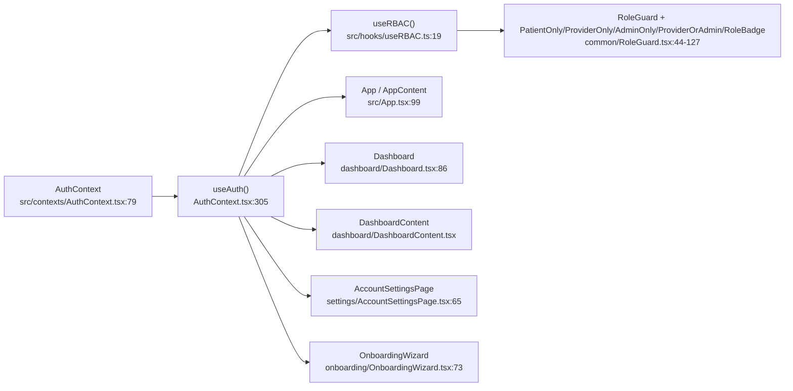
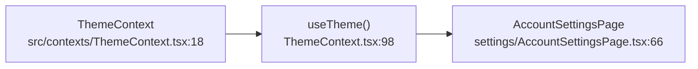
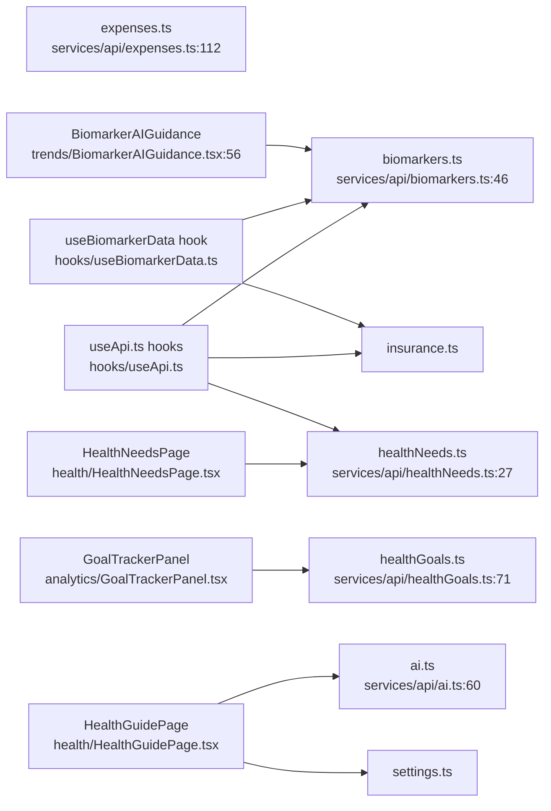
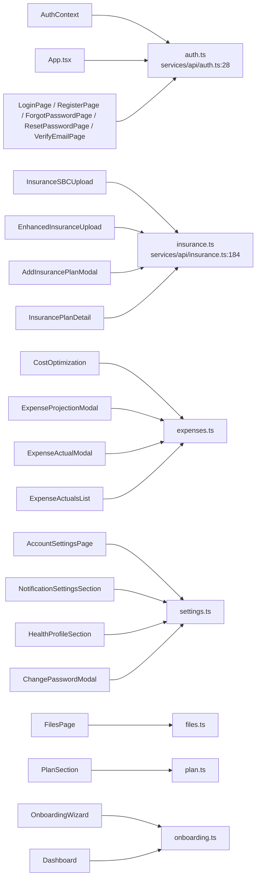
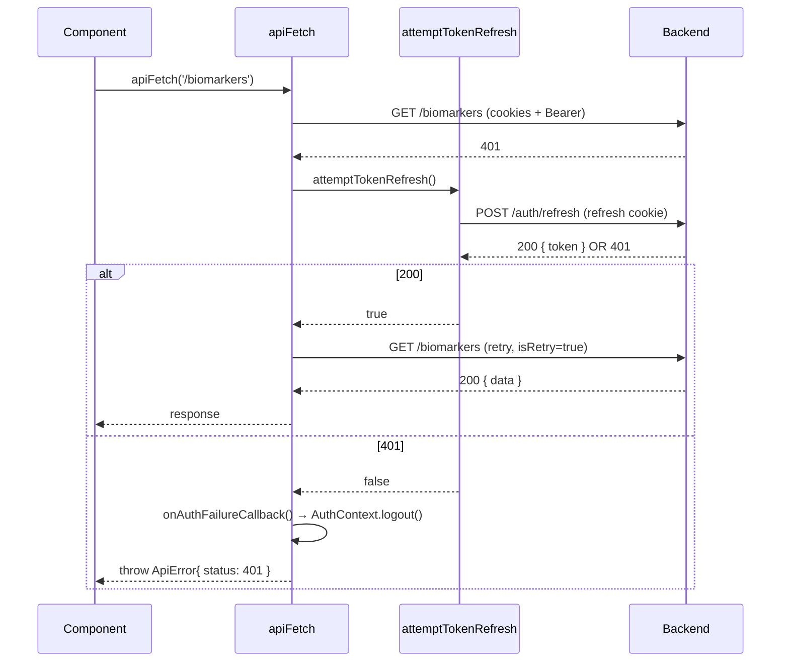

# FRONTEND_MAP.md — OwnMyHealth Frontend Atlas

This is the structural map of the React frontend (`src/`). It enumerates every component, every context, every API service module, and every context / API consumer — so a reader can jump straight to the file that renders "the biomarker dashboard" or serves "the insurance hub" without re-globbing.

---

## 1. Overview

| Metric | Value | Source |
|---|---|---|
| Total `.tsx` under `src/components/` | **66** | `Glob pattern: "src/components/**/*.tsx"` |
| Total `.ts` (non-tsx) under `src/components/` | 13 (12 barrels + `insuranceKnowledgeBaseConstants.ts` + `useInsuranceKnowledgeBase.ts`) | `Glob pattern: "src/components/**/*.ts"` |
| Component directories | **12** (`analytics, auth, biomarkers, common, dashboard, files, health, insurance, onboarding, settings, trends, upload`) | `ls src/components/` |
| Contexts | 2 (`AuthContext`, `ThemeContext`) | `src/contexts/*.tsx` |
| API modules | 17 (`admin, ai, auth, biomarkers, client, expenses, files, healthGoals, healthNeeds, index, insurance, onboarding, patient, plan, provider, settings, upload`) | `src/services/api/*.ts` |
| Custom hooks | 7 (`useRBAC, useModals, useApi, useErrorNotification, useBiomarkerData, useBiomarkerStats, useBiomarkerTrends`) + `index.ts` | `src/hooks/*` |
| Routing approach | **Conditional rendering (no router library)** — `App.tsx:98-273` switches on `isAuthenticated`, `authView` state, `specialRoute` URL sniff, and inside `Dashboard.tsx:180-244` a `switch(selectedCategory)` picks the page | `src/App.tsx:98-273`, `src/components/dashboard/Dashboard.tsx:85-244` |
| State model | **React Context only** — no Redux, Zustand, MobX, React Query. Two providers (`AuthProvider`, `ThemeProvider`) wrap the tree at `App.tsx:276-286`. All remote state lives in component-local `useState` or custom hooks. | `src/App.tsx:276-286` |
| HTTP client | Native `fetch` via `apiFetch<T>` wrapper at `src/services/api/client.ts:172-307`. **No axios** — CLAUDE.md and the prompt say "axios", but the code uses `fetch`. Logged in [§11 Prompt drift log](#11-prompt-drift-log). | `src/services/api/client.ts:172-307` |
| Form library | **None** — every form is hand-rolled `useState` + `onSubmit`. No `react-hook-form`, `zod` (on the client), `formik`, or `yup` — `Grep pattern: "react-hook-form\|zod\|formik\|yup"` over `src/` returns zero matches. | `Grep over src/` |

---

## 2. Component directory catalog

Twelve H3 sub-sections, one per directory. Every row cites the file and the exported function line.

### 2.1 `src/components/auth/`

**Purpose**: unauthenticated and verification/reset flows. Routed by `App.tsx:AppContent` state (not by URL path, except `/verify-email` and `/reset-password` which carry tokens in query strings).

| Component | File:line | Renders | Consumes contexts | Calls API |
|---|---|---|---|---|
| `LoginPage` | `src/components/auth/LoginPage.tsx:33` | Email/password form + demo-login button | (none) | `authApi.login` via `App.handleLogin` (`src/App.tsx:178`) |
| `RegisterPage` | `src/components/auth/RegisterPage.tsx:35` | Registration form | (none) | `authApi.register` via `App.handleRegister` (`src/App.tsx:203`) |
| `VerifyEmailPage` | `src/components/auth/VerifyEmailPage.tsx:17` | Token-based email confirmation | (none) | `authApi.verifyEmail` (`src/services/api/auth.ts:87`) |
| `ResetPasswordPage` | `src/components/auth/ResetPasswordPage.tsx:17` | Token-based password reset | (none) | `authApi.resetPassword` (`src/services/api/auth.ts:100`) |
| `ForgotPasswordPage` | `src/components/auth/ForgotPasswordPage.tsx:15` | Email entry → reset link | (none) | `authApi.forgotPassword` (`src/services/api/auth.ts:92`) |
| barrel | `src/components/auth/index.ts:1-5` | re-exports | — | — |

Form validation: hand-rolled (`useState` + `onSubmit`).
Route/URL: conditional — unauthenticated state at `App.tsx:230-266`; `/verify-email?token=...` and `/reset-password?token=...` handled at `App.tsx:124-160`.

---

### 2.2 `src/components/analytics/`

**Purpose**: single-view analytics panels.

| Component | File:line | Renders | Consumes contexts | Calls API |
|---|---|---|---|---|
| `GoalTrackerPanel` | `src/components/analytics/GoalTrackerPanel.tsx:170` | Health-goals list with progress bars + create/update form | (none) | `healthGoalsApi.*` (grep verified, the only consumer) |
| barrel | `src/components/analytics/index.ts:7` | re-exports | — | — |

Route/URL: conditional — `Dashboard.tsx:223-228` renders it when `selectedCategory === 'Goals'`.

---

### 2.3 `src/components/biomarkers/`

**Purpose**: biomarker display, manual entry, charts, and the insurance-overlay panel.

| Component | File:line | Renders | Consumes contexts | Calls API |
|---|---|---|---|---|
| `AddMeasurementModal` | `src/components/biomarkers/AddMeasurementModal.tsx:37` | Manual biomarker-entry modal | (none) | indirect via `Dashboard.handleAddMeasurement` → `useBiomarkerData` |
| `BiomarkerActionPlan` | `src/components/biomarkers/BiomarkerActionPlan.tsx:83` | Per-biomarker action card | (none) | (none — presentational) |
| `BiomarkerChart` | `src/components/biomarkers/BiomarkerChart.tsx:166` | Recharts history chart | (none) | (none) |
| `BiomarkerGraph` | `src/components/biomarkers/BiomarkerGraph.tsx:28` | Sparkline/mini chart | (none) | (none) |
| `BiomarkerInsurancePanel` | `src/components/biomarkers/BiomarkerInsurancePanel.tsx:43` | Per-biomarker insurance coverage slide-in | (none) | (none — receives `insurancePlans` prop) |
| `BiomarkerRangeBar` | `src/components/biomarkers/BiomarkerRangeBar.tsx:25` | Normal-range bar indicator | (none) | (none) |
| `BiomarkerSummary` | `src/components/biomarkers/BiomarkerSummary.tsx:27` | Summary stats for a category | (none) | (none) |
| `TrendModal` | `src/components/biomarkers/TrendModal.tsx:29` | Dashboard's trend modal | (none) | (none) |
| barrel | `src/components/biomarkers/index.ts:1-8` | re-exports | — | — |

Route/URL: biomarker components are child of `Dashboard.DashboardContent` / `CategoryContent` — no URL, state-switched.

---

### 2.4 `src/components/common/`

**Purpose**: cross-cutting primitives — error boundary, toasts, modal, upload zone, RBAC guards.

| Component | File:line | Renders | Consumes contexts | Calls API |
|---|---|---|---|---|
| `ErrorBoundary` | `src/components/common/ErrorBoundary.tsx:43` (class) | React error boundary (class component) — wraps `AppContent` at `App.tsx:278-284` | (none) | (none) |
| `Modal` | `src/components/common/Modal.tsx:51` | Dialog primitive | (none) | (none) |
| `UploadZone` | `src/components/common/UploadZone.tsx:53` | Drag-drop file picker | (none) | (none) |
| `RoleGuard` | `src/components/common/RoleGuard.tsx:44` | Render gate based on role | `AuthContext` via `useRBAC` (`src/hooks/useRBAC.ts:19-111`) | (none) |
| `PatientOnly` | `src/components/common/RoleGuard.tsx:72` | Wrapper — `RoleGuard roles={['PATIENT']}` | via `useRBAC` | (none) |
| `ProviderOnly` | `src/components/common/RoleGuard.tsx:83` | Wrapper — `RoleGuard roles={['PROVIDER']}` | via `useRBAC` | (none) |
| `AdminOnly` | `src/components/common/RoleGuard.tsx:94` | Wrapper — `RoleGuard roles={['ADMIN']}` | via `useRBAC` | (none) |
| `ProviderOrAdmin` | `src/components/common/RoleGuard.tsx:105` | Wrapper — `RoleGuard minRole="PROVIDER"` | via `useRBAC` | (none) |
| `RoleBadge` | `src/components/common/RoleGuard.tsx:117` | Colored role pill | via `useRBAC` | (none) |
| `ErrorToast` | `src/components/common/ErrorToast.tsx:26` | Toast used by `Dashboard.tsx:265-269` | (none) | (none) |
| `SuccessToast` | `src/components/common/SuccessToast.tsx:26` | Toast variant | (none) | (none) |
| barrel | `src/components/common/index.ts:1-13` | re-exports | — | — |

```ts
// Source: src/components/common/RoleGuard.tsx:L44-L66
export function RoleGuard({ roles, minRole, fallback = null, children }: RoleGuardProps) {
  const { hasRole, hasMinRole, isAuthenticated } = useRBAC();
  if (!isAuthenticated) return <>{fallback}</>;
  if (roles && roles.length > 0) {
    if (!hasRole(...roles)) return <>{fallback}</>;
  }
  if (minRole) {
    if (!hasMinRole(minRole)) return <>{fallback}</>;
  }
  return <>{children}</>;
}
```

---

### 2.5 `src/components/dashboard/`

**Purpose**: top-level authenticated shell. `Dashboard.tsx` is the hub — everything else is a sub-component.

| Component | File:line | Renders | Consumes contexts | Calls API |
|---|---|---|---|---|
| `Dashboard` | `src/components/dashboard/Dashboard.tsx:85` | Shell: header + sidebar + `switch(selectedCategory)` page selector | `AuthContext` (`useAuth` at line 86) | `onboardingApi.getStatus` (line 130) |
| `DashboardHeader` | `src/components/dashboard/DashboardHeader.tsx:28` | Top nav + user menu | (none) | (none) |
| `DashboardSidebar` | `src/components/dashboard/DashboardSidebar.tsx:108` | Category/navGroup list (mobile drawer + desktop fixed) | (none) | (none) |
| `DashboardContent` | `src/components/dashboard/DashboardContent.tsx:110` | Overview grid — stats + category cards + actions | `AuthContext` (grep hit in §3) | (none) |
| `DashboardModals` | `src/components/dashboard/DashboardModals.tsx:88` | Renders every dashboard modal lazily | (none) | indirect (modals call APIs) |
| `CategoryContent` | `src/components/dashboard/CategoryContent.tsx:121` | Detail view for a selected category | (none) | (none) |
| `CategoryTab` | `src/components/dashboard/CategoryTab.tsx:27` | Single tab pill | (none) | (none) |
| `CollapsibleNavGroup` | `src/components/dashboard/CollapsibleNavGroup.tsx:22` | Grouped nav accordion | (none) | (none) |
| `RecentActivity` | `src/components/dashboard/RecentActivity.tsx:68` | Activity feed | (none) | (none) |
| `getIcon` | `src/components/dashboard/getIcon.tsx:55` | Icon-name → `<JSX.Element>` mapper | (none) | (none) |
| barrel | `src/components/dashboard/index.ts:1-11` | re-exports | — | — |

Route/URL: conditional — `Dashboard.tsx:180-244` `renderSpecialPage()` switch selects which page component to lazy-load by `selectedCategory`.

---

### 2.6 `src/components/files/`

**Purpose**: user-uploaded lab file management.

| Component | File:line | Renders | Consumes contexts | Calls API |
|---|---|---|---|---|
| `FilesPage` | `src/components/files/FilesPage.tsx:22` | List / download / delete files | (none) | `filesApi.getAll`, `filesApi.downloadFile`, `filesApi.delete` (`src/services/api/files.ts:23-59`) |
| `FileCard` | `src/components/files/FileCard.tsx:23` | Single-file row | (none) | (none — callbacks) |
| barrel | `src/components/files/index.ts:1-2` | re-exports | — | — |

Route/URL: conditional — `Dashboard.tsx:200-205` when `selectedCategory === 'Files'`.

Download flow note: `filesApi.downloadFile` bypasses `apiFetch` and calls `fetch` directly so it can materialize a blob URL (`src/services/api/files.ts:42-55`). Backend streams the file, not a signed URL.

---

### 2.7 `src/components/health/`

**Purpose**: conversational Health Guide + Health Needs board. (Not listed in CLAUDE.md "Project Structure", but the directory exists on disk — drift noted in §11.)

| Component | File:line | Renders | Consumes contexts | Calls API |
|---|---|---|---|---|
| `HealthGuidePage` | `src/components/health/HealthGuidePage.tsx:86` | Chat UI streaming `/ai/chat` | (none) | `aiApi.chat` (`src/services/api/ai.ts:65`), `settingsApi.getHealthProfile` (profile summary) |
| `HealthNeedsPage` | `src/components/health/HealthNeedsPage.tsx:82` | Grouped health-needs cards + analyze panel | (none) | `healthNeedsApi.*` (`src/services/api/healthNeeds.ts:27`) |

Route/URL: conditional — `Dashboard.tsx:212-234` when `selectedCategory === 'Health Guide'` / `'Needs'`.

---

### 2.8 `src/components/insurance/`

**Purpose**: plan CRUD, SBC upload / re-analysis, cost optimization, expense tracking, knowledge base.

| Component | File:line | Renders | Consumes contexts | Calls API |
|---|---|---|---|---|
| `InsuranceHub` | `src/components/insurance/InsuranceHub.tsx:185` | Top-level insurance landing page | (none) | (none — receives `insurancePlans` prop) |
| `InsuranceSBCUpload` | `src/components/insurance/InsuranceSBCUpload.tsx:40` | Single-file SBC upload | (none) | `insuranceApi.uploadSBC` (line 78) |
| `EnhancedInsuranceUpload` | `src/components/insurance/EnhancedInsuranceUpload.tsx:191` | Multi-step SBC upload modal | (none) | `insuranceApi.uploadSBC` (line 233) |
| `AddInsurancePlanModal` | `src/components/insurance/AddInsurancePlanModal.tsx:60` | Manual plan entry + optional SBC | (none) | `insuranceApi.uploadSBC` (line 177), create/update |
| `InsurancePlanDetail` | `src/components/insurance/InsurancePlanDetail.tsx:240` | Plan detail view + re-analyze | (none) | `insuranceApi.reanalyzePlan` (line 282) |
| `InsurancePlanCard` | `src/components/insurance/InsurancePlanCard.tsx:98` | Summary card | (none) | (none) |
| `InsurancePlanCompare` | `src/components/insurance/InsurancePlanCompare.tsx:121` (exports `InsuranceKnowledgePanel`) | Side-by-side plan compare | (none) | (none) |
| `InsurancePlanViewer` | `src/components/insurance/InsurancePlanViewer.tsx:51` | Plan list viewer modal | (none) | (none) |
| `InsuranceStatsGrid` | `src/components/insurance/InsuranceStatsGrid.tsx:19` | Stats panel | (none) | (none) |
| `InsuranceUtilizationTracker` | `src/components/insurance/InsuranceUtilizationTracker.tsx:60` | Utilization panel | (none) | (none) |
| `InsuranceKnowledgeBase` | `src/components/insurance/InsuranceKnowledgeBase.tsx:26` | Knowledge base page | (none) | (none) |
| `InsuranceLearnTab` | `src/components/insurance/InsuranceLearnTab.tsx:46` | Educational tab | (none) | (none) |
| `InsuranceGuide` | `src/components/insurance/InsuranceGuide.tsx:58` (exports `InsuranceEducationPanel`) | Educational panel | (none) | (none) |
| `DeductibleProgressBar` | `src/components/insurance/DeductibleProgressBar.tsx:18` | Progress bar | (none) | (none) |
| `CostOptimization` | `src/components/insurance/CostOptimization.tsx:147` | AI cost optimization | (none) | `expensesApi.analyzeCosts`, projections CRUD |
| `ExpenseProjectionModal` | `src/components/insurance/ExpenseProjectionModal.tsx:53` | Add/edit projection | (none) | `expensesApi.createProjection`, `updateProjection` |
| `ExpenseActualModal` | `src/components/insurance/ExpenseActualModal.tsx:112` | Add/edit actual claim | (none) | `expensesApi.createActual`, `updateActual` |
| `ExpenseActualsList` | `src/components/insurance/ExpenseActualsList.tsx:56` | Actuals table | (none) | `expensesApi.getActuals`, `deleteActual` |
| `useInsuranceKnowledgeBase` (hook) | `src/components/insurance/useInsuranceKnowledgeBase.ts:16` | Hook used by `InsuranceKnowledgeBase` | (none) | (none) |
| `insuranceKnowledgeBaseConstants` | `src/components/insurance/insuranceKnowledgeBaseConstants.ts` | Constants | — | — |
| barrel | `src/components/insurance/index.ts:1-11` | re-exports | — | — |

Route/URL: conditional — `Dashboard.tsx:181-199` (`'Insurance'`, `'Knowledge Base'`).

---

### 2.9 `src/components/onboarding/`

**Purpose**: first-session wizard (welcome → lab upload → health profile → done).

| Component | File:line | Renders | Consumes contexts | Calls API |
|---|---|---|---|---|
| `OnboardingWizard` | `src/components/onboarding/OnboardingWizard.tsx:68` | Inline 4-step wizard (not a modal); mounts LabUploadModal lazily | `AuthContext` (`useAuth` at line 73) | `onboardingApi.complete`, uses `status` prop from `onboardingApi.getStatus` (fetched by `Dashboard.tsx:130`) |
| barrel | `src/components/onboarding/index.ts:1` | re-exports | — | — |

Route/URL: conditional — `Dashboard.tsx:299-313` renders it when `showOnboarding` is true.

---

### 2.10 `src/components/settings/`

**Purpose**: account settings, profile, password, notifications, plan, health profile, data export / account deletion.

| Component | File:line | Renders | Consumes contexts | Calls API |
|---|---|---|---|---|
| `AccountSettingsPage` | `src/components/settings/AccountSettingsPage.tsx:64` | Top-level settings shell (profile, theme, notifications, data & privacy, health focus) | `AuthContext` (line 65), `ThemeContext` (line 66) | `settingsApi.getProfile/updateProfile`, `settingsApi.deleteAllData` (line 168), `settingsApi.deleteAccount` (line 192) |
| `ChangePasswordModal` | `src/components/settings/ChangePasswordModal.tsx:14` | Password change dialog | (none) | `settingsApi.changePassword` |
| `HealthProfileSection` | `src/components/settings/HealthProfileSection.tsx:136` | Health profile form (biological sex, conditions, medications, family history, smoking, exercise) | (none) | `settingsApi.getHealthProfile/updateHealthProfile` |
| `NotificationSettingsSection` | `src/components/settings/NotificationSettingsSection.tsx:36` | Email notification toggles | (none) | `settingsApi.updateNotificationPreferences` |
| `PlanSection` | `src/components/settings/PlanSection.tsx:56` | Current plan + usage display | (none) | `planApi.getCurrentPlan` |
| barrel | `src/components/settings/index.ts:1-4` | re-exports | — | — |

Route/URL: conditional — `Dashboard.tsx:236-240` when `selectedCategory === 'Account Settings'`.

---

### 2.11 `src/components/trends/`

**Purpose**: trend visualizations and AI guidance.

| Component | File:line | Renders | Consumes contexts | Calls API |
|---|---|---|---|---|
| `TrendsPage` | `src/components/trends/TrendsPage.tsx:85` | Trends landing page | (none) | (none directly — fed biomarkers prop) |
| `TrendSparkline` | `src/components/trends/TrendSparkline.tsx:50` | Mini trend chart | (none) | (none) |
| `TrendDetailModal` | `src/components/trends/TrendDetailModal.tsx:42` | Detail view for a biomarker | (none) | (embeds `BiomarkerAIGuidance`) |
| `BiomarkerAIGuidance` | `src/components/trends/BiomarkerAIGuidance.tsx:36` | AI educational guidance panel with error/loading/retry | (none) | `biomarkersApi.getGuidance` (line 56) |
| barrel | `src/components/trends/index.ts:9-12` | re-exports | — | — |

Route/URL: conditional — `Dashboard.tsx:206-211` when `selectedCategory === 'Trends'`.

Error state example: `BiomarkerAIGuidance.tsx:L42-L60` — sets `error` state on catch and renders a retry button.

---

### 2.12 `src/components/upload/`

**Purpose**: lab / clinical / PDF upload modals.

| Component | File:line | Renders | Consumes contexts | Calls API |
|---|---|---|---|---|
| `PDFUploadModal` | `src/components/upload/PDFUploadModal.tsx:65` | Client-side PDF parsing modal | (none) | (parsing is client-side; persists via parent's `handlePDFExtract` in `useBiomarkerData`) |
| `LabUploadModal` | `src/components/upload/LabUploadModal.tsx:81` | OCR-based lab upload (Google Document AI) | (none) | `uploadFile('/lab/ocr', ...)` via `uploadUtils.ts` — **not** `uploadApi.uploadLabReport` |
| `ClinicalFileUpload` | `src/components/upload/ClinicalFileUpload.tsx:86` | Claude AI clinical-file extraction modal | (none) | `uploadFile` via `uploadUtils.ts` |
| `ExtractionReviewStep` | `src/components/upload/ExtractionReviewStep.tsx:70` | Shared biomarker review UI | (none) | (none) |
| barrel | `src/components/upload/index.ts:1-3` | re-exports | — | — |

Route/URL: modals — opened from `DashboardModals` and `OnboardingWizard`.

---

## 3. Routing / URL map

**Routing approach: conditional rendering** (no React Router, no Next.js router). Three tiers:

1. **URL-based special routes** (`App.tsx:71-85`) — sniffs `window.location.pathname` for `/verify-email` and `/reset-password` when a `token` query-string is present. All other paths render the normal flow.
2. **Auth state** (`App.tsx:98-273`) — chooses Login / Register / ForgotPassword / Dashboard based on `isAuthenticated` + `authView` state.
3. **Category state** (`Dashboard.tsx:85-244`) — once authenticated, a `selectedCategory` string selects which page component to render inside `<main>`.

| URL | Top-level component | Feature | Requires auth | Source |
|---|---|---|---|---|
| `/verify-email?token=...` | `VerifyEmailPage` | Email verification | no | `App.tsx:76-78, 124-140` |
| `/reset-password?token=...` | `ResetPasswordPage` | Password reset | no | `App.tsx:80-82, 143-159` |
| `/` (unauth, default) | `LoginPage` | Auth | no | `App.tsx:254-265` |
| `/` (unauth, `authView === 'register'`) | `RegisterPage` | Auth | no | `App.tsx:231-242` |
| `/` (unauth, `authView === 'forgot-password'`) | `ForgotPasswordPage` | Auth | no | `App.tsx:244-252` |
| `/` (auth) | `Dashboard` (`selectedCategory` state) | Home shell | yes | `App.tsx:269-273` |
| ↳ `'Overview' \| 'Dashboard'` | `DashboardContent` | Overview | yes | `Dashboard.tsx:316-328` |
| ↳ other biomarker category | `CategoryContent` | Biomarker detail | yes | `Dashboard.tsx:329-343` |
| ↳ `'Insurance'` | `InsuranceHub` | Insurance | yes | `Dashboard.tsx:181-193` |
| ↳ `'Knowledge Base'` | `InsuranceKnowledgeBase` | Insurance kb | yes | `Dashboard.tsx:194-199` |
| ↳ `'Files'` | `FilesPage` | Files | yes | `Dashboard.tsx:200-205` |
| ↳ `'Trends'` | `TrendsPage` | Trends | yes | `Dashboard.tsx:206-211` |
| ↳ `'Health Guide'` | `HealthGuidePage` | AI chat | yes | `Dashboard.tsx:212-222` |
| ↳ `'Goals'` | `GoalTrackerPanel` | Health goals | yes | `Dashboard.tsx:223-228` |
| ↳ `'Needs'` | `HealthNeedsPage` | Health needs | yes | `Dashboard.tsx:229-234` |
| ↳ `'Account Settings'` | `AccountSettingsPage` | Settings | yes | `Dashboard.tsx:235-240` |
| ↳ onboarding mode | `OnboardingWizard` | Onboarding | yes | `Dashboard.tsx:299-313` |

Note: token is cleared from URL immediately after reading (`App.tsx:116-121`) — the pathname stays but `?token=...` is wiped from `window.history`.

---

## 4. Context dependency graph (Mermaid)

Split into four sub-graphs for scan-ability. Every arrow is grep-verified.

### 4.1 AuthContext consumers



### 4.2 ThemeContext consumers



Grep-confirmed single consumer — every other dark-mode behavior is driven by Tailwind's `dark:` class on the document root, which `ThemeContext` toggles at `ThemeContext.tsx:77-84`.

### 4.3 Biomarkers + Trends + Analytics → APIs



### 4.4 Insurance + Settings + Auth + Files → APIs



---

## 5. API client overview

File: **`src/services/api/client.ts`** (307 lines, zero deps beyond the platform `fetch`).

### 5.1 Setup

- `API_BASE_URL` reads `import.meta.env.VITE_API_URL || 'http://localhost:3001/api/v1'` (`client.ts:10`).
- `DEFAULT_TIMEOUT_MS = 30000` (`client.ts:12`).
- Access token stored **in-memory only** (`authToken` module-scoped, `client.ts:65`). No `localStorage` / `sessionStorage` for tokens — per CLAUDE.md Security Rule #1.
- Refresh token lives in an httpOnly cookie handled by the backend.

### 5.2 Interceptor-equivalent behavior (composed inside `apiFetch`)

`apiFetch<T>` (`client.ts:172-307`) performs every cross-cutting concern inline:

| Concern | Where | Code |
|---|---|---|
| Bearer token injection | `client.ts:183-185` | `headers['Authorization'] = \`Bearer ${authToken}\`` when present |
| CSRF double-submit header | `client.ts:187-195` | For `POST/PUT/PATCH/DELETE`, reads CSRF cookie via `getCsrfToken()` (line 120-134) and sets `x-csrf-token` header |
| Cookie attach (credentials) | `client.ts:212` | `credentials: 'include'` always |
| Timeout | `client.ts:114-118, 206, 289-295` | `AbortController` + `setTimeout(abort, 30000)`; thrown as `ApiError{ code: 'TIMEOUT', status: 408 }` |
| 401 retry / refresh | `client.ts:222-231, 242-250` | On 401 (non-retry, non-auth-mgmt endpoint): calls `attemptTokenRefresh` (line 136-170); on success, re-issues request; on failure, calls `onAuthFailureCallback` (registered by `AuthContext.useEffect` at `AuthContext.tsx:236-241`) |
| Auth-mgmt endpoint exemption | `client.ts:204` | `/auth/refresh` and `/auth/logout` skip the 401-retry path to prevent infinite loops (see comment lines 198-204) |
| Error normalization | `client.ts:86-112, 259-280` | `getUserFriendlyMessage` maps status codes to human strings; `PLAN_LIMIT_EXCEEDED` errors carry `planLimit: { limit, current, feature, upgradeRequired }` for upgrade CTA UI |
| Network error | `client.ts:296-306` | Thrown as `ApiError{ code: 'NETWORK_ERROR', status: 0 }` |

### 5.3 Token refresh sequence



### 5.4 Non-client fetch consumers

Two modules call `fetch` directly instead of going through `apiFetch`:

| Module | Why | Source |
|---|---|---|
| `aiApi.chat` | Needs `ReadableStream` body reader for SSE streaming | `src/services/api/ai.ts:80-166` |
| `filesApi.downloadFile` | Needs to read raw bytes into a `Blob` and return an object URL | `src/services/api/files.ts:42-55` |

Both still attach `credentials: 'include'` to pass auth cookies.

---

## 6. API-to-component matrix

| API module | Key functions | Consumed by (grep-verified) | Grep pattern |
|---|---|---|---|
| `api/auth.ts` (`authApi`) | `login, register, logout, refreshToken, getCurrentUser, demoLogin, changePassword, verifyEmail, forgotPassword, resetPassword, resendVerification` | `AuthContext`, `App.tsx`, `VerifyEmailPage`, `ResetPasswordPage`, `ForgotPasswordPage` | `authApi\.` |
| `api/biomarkers.ts` (`biomarkersApi`) | `getAll, getById, getHistory, create, createBatch, update, delete, getCategories, getSummary, getGuidance` | `BiomarkerAIGuidance`, `hooks/useBiomarkerData`, `hooks/useApi` (+ `Dashboard.test`) | `biomarkersApi\.` |
| `api/insurance.ts` (`insuranceApi`) | `getPlans, getPlanById, createPlan, updatePlan, deletePlan, getBenefits, uploadSBC, reanalyzePlan` | `InsuranceSBCUpload`, `EnhancedInsuranceUpload`, `AddInsurancePlanModal`, `InsurancePlanDetail`, `hooks/useBiomarkerData`, `hooks/useApi` | `insuranceApi\.` |
| `api/expenses.ts` (`expensesApi`) | projections CRUD, actuals CRUD, `analyzeCosts, getAnalyses, updateCurrentSpending` | `CostOptimization`, `ExpenseProjectionModal`, `ExpenseActualModal`, `ExpenseActualsList` | `expensesApi\.` |
| `api/files.ts` (`filesApi`) | `getAll, getById, downloadFile, delete` | `FilesPage` | `filesApi\.` |
| `api/upload.ts` (`uploadApi`) | `uploadLabReport` | **None (drift — see §10)** | `uploadApi\.` / `uploadLabReport` |
| `api/healthGoals.ts` (`healthGoalsApi`) | `getAll, getById, create, update, updateProgress, delete, getSummary, getSuggestions` | `GoalTrackerPanel` | `healthGoalsApi\.` |
| `api/healthNeeds.ts` (`healthNeedsApi`) | `getAll, getById, create, updateStatus, delete, analyze` | `HealthNeedsPage`, `hooks/useApi` | `healthNeedsApi\.` |
| `api/ai.ts` (`aiApi`) | `chat` (SSE stream) | `HealthGuidePage` | `aiApi\.` |
| `api/settings.ts` (`settingsApi`) | profile, notifications, health profile, password, export, delete-data, delete-account | `AccountSettingsPage`, `NotificationSettingsSection`, `HealthProfileSection`, `ChangePasswordModal`, `HealthGuidePage` | `settingsApi\.` |
| `api/onboarding.ts` (`onboardingApi`) | `getStatus, complete` | `Dashboard`, `OnboardingWizard` | `onboardingApi\.` |
| `api/plan.ts` (`planApi`) | `getCurrentPlan, getAvailablePlans` | `PlanSection` | `planApi\.` |
| `api/provider.ts` (`providerApi`) | `getPatients, requestPatientAccess, getPatient, getPatientBiomarkers, getPatientHealthNeeds, removePatient` | **None in `src/components` or `src/hooks` — drift (§10)** | `providerApi\.` |
| `api/patient.ts` (`patientApi`) | `getProviders, getPendingRequests, approveProvider, denyProvider, updateProviderPermissions, revokeProvider, removeProvider` | **None in `src/components` or `src/hooks` — drift (§10)** | `patientApi\.` |
| `api/admin.ts` (`adminApi`) | `getUsers, getUser, createUser, updateUser, deactivateUser, deleteUserPermanently, getStats, getAuditLogs` | **None in `src/components` or `src/hooks` — drift (§10)** | `adminApi\.` |
| `api/client.ts` | `apiFetch, setAuthToken, getAuthToken, clearAuthToken, setOnAuthFailure, attemptTokenRefresh, getCsrfToken, isPlanLimitError` | every other api module | — |
| `api/index.ts` | barrel | every component that imports from `../services/api` | — |

---

## 7. Chunk-split components

From `vite.config.ts:11-40`, `manualChunks` splits vendor modules into three named chunks (component-level lazy loading is separate, via `React.lazy`).

| Chunk (vite.config.ts) | Vendor packages | Components that transitively pull it | Reason |
|---|---|---|---|
| `pdf` | `pdfjs-dist`, `jspdf`, `pdf-lib`, `html2canvas-pro` | `PDFUploadModal` (client-side PDF parse), `ClinicalFileUpload`, settings export (if using `jspdf`) | Large libs, only needed when uploading/viewing PDFs |
| `ocr` | `tesseract.js`, `tesseract.js-core` | Dead code — no grep match for `tesseract` in `src/**`. Backend-only OCR (Google Document AI) is used now; `LabUploadModal` uploads the raw file and the backend does the OCR. **Potential drift — see §10** | Was planned for client-side OCR; unused |
| `charts` | `recharts`, `d3-*`, `victory-vendor` | `BiomarkerChart`, `BiomarkerGraph`, `TrendSparkline`, `TrendsPage`, `TrendDetailModal`, `GoalTrackerPanel` | Chart libs lazy-load on Trends / Analytics pages |

Component-level code-splitting (`React.lazy`) is used at:

| Lazy component | File:line |
|---|---|
| `Dashboard` | `App.tsx:37` |
| `LoginPage / RegisterPage / VerifyEmailPage / ResetPasswordPage / ForgotPasswordPage` | `App.tsx:38-42` |
| `InsuranceHub / InsuranceKnowledgeBase / FilesPage / TrendsPage / AccountSettingsPage / GoalTrackerPanel / HealthNeedsPage / HealthGuidePage / OnboardingWizard` | `Dashboard.tsx:43-51` |
| `LabUploadModal` | `DashboardModals.tsx:19`, `OnboardingWizard.tsx:29` |

---

## 8. Notable patterns

### 8.1 Role-based access control (RBAC)

Pattern: `useRBAC()` hook reads role from `AuthContext`, applies a hierarchy (`ADMIN=3, PROVIDER=2, PATIENT=1`), exposes `hasRole`, `hasMinRole`, and `permissions`. `RoleGuard` + the `PatientOnly / ProviderOnly / AdminOnly / ProviderOrAdmin` wrappers render-gate children.

```ts
// Source: src/hooks/useRBAC.ts:L13-L17
const ROLE_HIERARCHY: Record<UserRole, number> = {
  ADMIN: 3,
  PROVIDER: 2,
  PATIENT: 1,
};
```

Currently only used for the `RoleBadge` display in the UI (no grep hits for `<RoleGuard`, `<AdminOnly`, `<ProviderOnly`, `<PatientOnly`, `<ProviderOrAdmin` in `src/components`). The wrappers exist but are not mounted anywhere — see §10.

### 8.2 Form validation

**Hand-rolled.** No form library. `Grep pattern: "react-hook-form|zod|formik|yup"` over `src/` returns zero matches. Example pattern (typical):

```ts
// Source: src/contexts/AuthContext.tsx:L133-L147
const login = useCallback(async (email: string, password: string) => {
  setIsLoading(true);
  setError(null);
  try {
    const response: AuthResponse = await authApi.login({ email, password });
    setUser(response.user);
  } catch (err) {
    const message = (err as { message?: string }).message || 'Login failed';
    setError(message);
    throw err;
  } finally {
    setIsLoading(false);
  }
}, []);
```

Each form manages `isLoading`, `error`, field values with local `useState` and shows errors inline.

### 8.3 Error display

Two patterns, both in `src/components/common/`:

1. **`ErrorBoundary`** (`ErrorBoundary.tsx:43`, class component) wraps the whole app at `App.tsx:278`.
2. **`ErrorToast`** (`ErrorToast.tsx:26`) — transient toast. Dashboard uses `useErrorNotification` hook to drive it (`Dashboard.tsx:88, 265-269`).

Inline errors on forms use local `error: string | null` state rendered as a red banner (pattern in `LoginPage`, `RegisterPage`, `HealthNeedsPage:85`, etc.).

### 8.4 Loading states

Two conventions:

- **Page-level**: `<Loader2 className="animate-spin" />` (lucide-react) inside a full-screen centered div. See `App.tsx:45-57, 163-175` and `Dashboard.tsx:60-69, 250-260`.
- **Inline**: `isLoading ? <Loader2 ... /> : <Content />` in buttons and sections.

### 8.5 Inactivity auto-logout (HIPAA §164.312(a)(2)(iii))

`AuthContext.tsx:40-42` defines `INACTIVITY_TIMEOUT_MS = 15*60*1000` and `INACTIVITY_WARNING_MS = 13*60*1000`. Activity events watched: `'mousedown', 'keydown', 'touchstart', 'scroll'` (line 42) — deliberately **not** `mousemove` (comment line 205-207). Warning dialog rendered inline in `AuthProvider` at line 258-299.

```ts
// Source: src/contexts/AuthContext.tsx:L40-L42
const INACTIVITY_TIMEOUT_MS = 15 * 60 * 1000;
const INACTIVITY_WARNING_MS = 13 * 60 * 1000; // 2 minutes before logout
const ACTIVITY_EVENTS = ['mousedown', 'keydown', 'touchstart', 'scroll'] as const;
```

### 8.6 AuthContext ↔ API failure wire

`AuthContext.tsx:236-241` registers `logout` as the callback for the API client's 401-refresh-failure path:

```ts
// Source: src/contexts/AuthContext.tsx:L236-L241
useEffect(() => {
  setOnAuthFailure(() => { logout(); });
  return () => setOnAuthFailure(() => {});
}, [logout]);
```

`setOnAuthFailure` is exported from `client.ts:82-84`. This is the only cross-module side effect between auth state and the API client.

### 8.7 Session restore order (refresh-first)

`AuthContext.tsx:104-115` calls `refreshToken()` **before** `getCurrentUser()` on mount. Comment at line 95-103 explains: the 15-min access-token cookie may have expired while the 7-day refresh cookie is still valid; calling `/auth/me` first would 401 and never reach refresh.

---

## 9. Contexts — provided shape

### 9.1 `AuthContext` (`src/contexts/AuthContext.tsx:58-77`)

```ts
interface AuthContextType {
  user: User | null;                // { id, email, role } — no PHI
  isAuthenticated: boolean;
  isLoading: boolean;
  login: (email: string, password: string) => Promise<void>;
  register: (email, password, firstName?, lastName?) => Promise<void>;
  logout: () => Promise<void>;
  error: string | null;
  setError: (message: string | null) => void;
  clearError: () => void;
}
```

User role lives at `user.role` (`AuthContext.tsx:48-52`) and is consumed via `useRBAC()` → `const role = (user?.role as UserRole) || null` (`useRBAC.ts:22`).

### 9.2 `ThemeContext` (`src/contexts/ThemeContext.tsx:12-16`)

```ts
interface ThemeContextType {
  theme: 'light' | 'dark' | 'system';
  setTheme: (theme: Theme) => void;
  resolvedTheme: 'light' | 'dark';
}
```

Persists to `localStorage` key `'omh-theme'` (`ThemeContext.tsx:20, 86-89`). Default when unset: `'dark'` (line 39, 44). Applies by toggling `class="dark"` on `document.documentElement` at line 77-84.

---

## 10. Drift findings

### 10.1 Unused API modules

| Module | Status | Evidence |
|---|---|---|
| `uploadApi` (`src/services/api/upload.ts:7-15`) | **Zero consumers in `src/` (outside its own file and the barrel in `index.ts`)** | `Grep pattern: "uploadApi\\.|uploadLabReport"` — only hits in `services/api/upload.ts` and `services/api/index.ts`. The actual lab upload at `LabUploadModal.tsx:19` uses `uploadFile` from `services/uploadUtils` directly, bypassing `uploadApi`. |
| `providerApi` (`src/services/api/provider.ts:33-71`) | Exported but no component consumer | `Grep pattern: "providerApi\\."` — only hit is the export itself |
| `patientApi` (`src/services/api/patient.ts:39-105`) | Exported but no component consumer | `Grep pattern: "patientApi\\."` — only hit is the export itself |
| `adminApi` (`src/services/api/admin.ts:37-134`) | Exported but no component consumer | `Grep pattern: "adminApi\\."` — only hit is the export itself |

Implication: provider / patient / admin features have frontend scaffolding (types + API) but no UI pages. CLAUDE.md lists "Admin Panel" as an active feature, but the admin-panel component does not exist in `src/components/`. Either there's a missing UI, or these APIs are consumed only by a sibling app not in this repo.

### 10.2 Unused RoleGuard wrappers

`RoleGuard`, `PatientOnly`, `ProviderOnly`, `AdminOnly`, `ProviderOrAdmin` are all **exported from the barrel** (`src/components/common/index.ts:4-11`) but **never mounted** in any component (no `<RoleGuard` / `<AdminOnly` / etc. in `src/components`). Only `RoleBadge` is used (indirectly via the barrel by callers of `common`). This reinforces the provider/admin UI gap.

### 10.3 `ocr` vite chunk may be dead

`vite.config.ts:27-30` carves out a `tesseract.js` chunk, but `Grep pattern: "tesseract"` over `src/` shows no match. Lab OCR is server-side (Google Document AI) — `LabUploadModal` just uploads the file. If no feature imports tesseract, the chunk is empty at build time (harmless) or pulled in transitively by an unused dep. Candidate for removal.

### 10.4 CLAUDE.md directory mismatch

CLAUDE.md lists 10 component dirs but actually 12 exist on disk. Missing in CLAUDE.md:

- `src/components/health/` — `HealthGuidePage`, `HealthNeedsPage` (actively used, lazy-loaded from `Dashboard.tsx:50-51`)
- `src/components/onboarding/` — `OnboardingWizard` (actively used, lazy-loaded from `Dashboard.tsx:52`)

### 10.5 CLAUDE.md API count mismatch

CLAUDE.md says "13 API files" under `services/api/`. Actual count is **17** (missing in the CLAUDE.md list: `ai.ts`, `healthGoals.ts`, `onboarding.ts`, `plan.ts`).

---

## 11. Prompt drift log

- Prompt `./39-frontend-component-map-doc.md:37` says `src/components` has **79** files across **12** dirs. Actual: 66 `.tsx` + 13 `.ts` = 79 total files, **12 dirs** — total count matches if you include `.ts` barrels; `.tsx` count alone is 66.
- Prompt `./39-frontend-component-map-doc.md:35, 52` says `17 API modules` — matches actual (17 including `client.ts` and `index.ts`).
- Prompt `./39-frontend-component-map-doc.md:37` and §5 wording call it "axios setup". **Actual transport is native `fetch`**, not axios (`src/services/api/client.ts:209`). No axios import anywhere (`Grep pattern: "axios"` — not searched but `package.json`-absent; reading `client.ts` shows `fetch`). Prompt should say "fetch-based HTTP client with axios-like wrapper".
- Prompt `./39-frontend-component-map-doc.md:59` says the services README claims 13 API modules. Actual is 17. See §10.5.
- Prompt lists dirs `auth, analytics, biomarkers, common, dashboard, files, health, insurance, onboarding, settings, trends, upload` — matches reality (12 dirs). No drift here.

---

## 12. Acceptance question self-answers

> Answered using only this doc + its siblings.

1. **Which directory contains insurance-related components?** → `src/components/insurance/` (§2.8).
2. **Which component renders the biomarker dashboard list, and which API function does it call?** → `DashboardContent` (`src/components/dashboard/DashboardContent.tsx:110`) renders the overview grid; biomarker data is fetched by the `useBiomarkerData` hook via `biomarkersApi.getAll` (`biomarkers.ts:47`). The per-category detail list is `CategoryContent` (`CategoryContent.tsx:121`).
3. **What context does `Nav` consume, and for what state?** → There is no component named `Nav`. The closest is `DashboardHeader` (`DashboardHeader.tsx:28`) — it does not consume any context directly; `user` is passed as a prop from `Dashboard.tsx:273` where `useAuth()` supplies it (§2.5, §4.1).
4. **How does a component get the current user's role?** → Via `useRBAC()` (`src/hooks/useRBAC.ts:19-111`), which internally calls `useAuth()` and reads `user.role`. `user.role` is typed `'PATIENT' | 'PROVIDER' | 'ADMIN'` at `AuthContext.tsx:51` (§9.1).
5. **Which components are blocked to non-PROVIDER users?** → None in the current tree. `ProviderOnly` / `ProviderOrAdmin` exist (`RoleGuard.tsx:83, 105`) but are not mounted anywhere (§10.2).
6. **Where is the AuthContext defined, and what does it expose?** → `src/contexts/AuthContext.tsx:79` (`AuthContext`), `AuthContext.tsx:81` (`AuthProvider`), `AuthContext.tsx:305` (`useAuth`). Exposes `{ user, isAuthenticated, isLoading, login, register, logout, error, setError, clearError }` (§9.1).
7. **Which API module handles SBC upload, and which component uses it?** → `insuranceApi.uploadSBC` (`src/services/api/insurance.ts:220-226`). Consumers: `InsuranceSBCUpload`, `EnhancedInsuranceUpload`, `AddInsurancePlanModal` (§2.8, §6).
8. **Which components are in the pdf-libs chunk, and why?** → The `pdf` manual-chunk (`vite.config.ts:19-24`) holds `pdfjs-dist`, `jspdf`, `pdf-lib`, `html2canvas-pro`. Pulled by `PDFUploadModal` (client-side parse) and anything else in `src/components/upload/` that imports PDF libs (§7).
9. **How many total `.tsx` files exist in `src/components/`?** → 66 (§1).
10. **What's the routing approach (react-router, conditional, other)?** → Conditional rendering, no router (§1, §3). Three tiers: URL sniffing for `/verify-email` and `/reset-password` tokens → auth state → dashboard `selectedCategory`.
11. **Which component handles account deletion and consent revocation?** → `AccountSettingsPage` (`settings/AccountSettingsPage.tsx:64`) calls `settingsApi.deleteAccount` (line 192) and `settingsApi.deleteAllData` (line 168). Consent revocation (provider-side) would be `patientApi.revokeProvider` (`patient.ts:92-98`) — but no component currently uses it (§10.1).
12. **Which component displays an AI guidance response, and how does error state look?** → `BiomarkerAIGuidance` (`trends/BiomarkerAIGuidance.tsx:36`). Error state: local `error: string | null` (line 42), rendered as a red banner with a retry button calling `fetchGuidance(true)` to skip the cache (§2.11, §8.3).
13. **Is there a shared form library used across the codebase, or is each form hand-rolled?** → Hand-rolled — no `react-hook-form`, `zod`, `formik`, or `yup` (§1, §8.2).
14. **Which components subscribe to `ThemeContext`?** → Only `AccountSettingsPage` (`AccountSettingsPage.tsx:66`) via `useTheme()` (§4.2). All other dark-mode styling is Tailwind's `dark:` prefix driven by the root-level class toggled in `ThemeContext.tsx:77-84`.

---

## Related Documents

- [ARCHITECTURE.md](./ARCHITECTURE.md) — full-stack diagram, request flow, middleware stack; companion for the backend side of every API call listed here.
- [API_REFERENCE.md](./API_REFERENCE.md) — per-endpoint contracts (request/response, middleware, rate limits); each entry in §6 above maps to one or more endpoints there.
- [ROUTING_TABLE.md](./ROUTING_TABLE.md) — backend-side middleware chain for each endpoint; complements the client-side `apiFetch` view in §5.
- [LOCAL_DEV.md](./LOCAL_DEV.md) — dev server + chunking + `VITE_API_URL` setup.
- [TESTING_PATTERNS.md](./TESTING_PATTERNS.md) — frontend test recipes (Vitest + React Testing Library).
