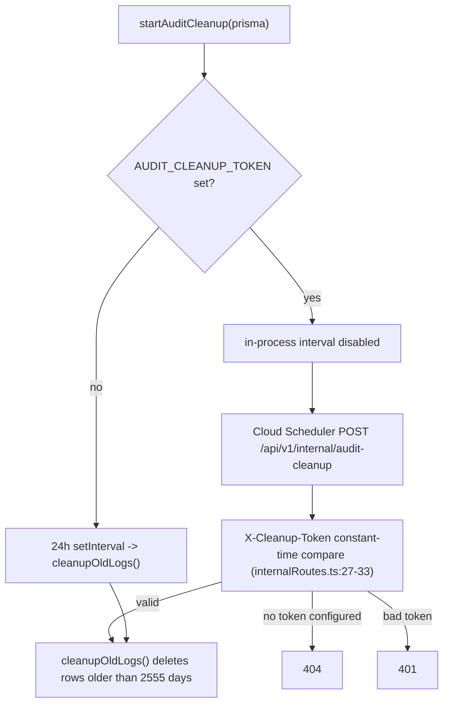

# HIPAA_CHECKLIST.md

> Current-state HIPAA Security Rule compliance reference for **OwnMyHealth**. Each safeguard maps to **code evidence** (`file:path:line`) and a **status**. Read this to answer "how does this app satisfy §164.312(b) audit controls?" with a code pointer, not a paragraph.

**Audit date:** 2026-06-01
**Maturity phase:** pre-beta / pre-production (no real patient PHI in live use yet; production deploy target is GCP Cloud Run + Cloud SQL — see [Transmission security](#transmission-security-164312e)).
**Compliance officer / Privacy & Security Officer (§164.308(a)(2)):** TBD (external: no named officer captured in repo; assign before beta — flag to project owner `breilly1296@pm.me`).
**Scope:** Backend at `backend/src/`, Prisma schema/migrations at `backend/prisma/`, CI/CD at `.github/workflows/`. This is a Security Rule (§164.3xx) checklist; Privacy Rule policy documents are tracked under [Required documentation](#required-documentation).

Status legend: ✅ shipped • 🟡 partial • ⚠️ gap / open finding • ⏳ TBD / pending

---

## Table of contents

1. [Business Associate Agreements (BAAs)](#business-associate-agreements-baas)
2. [Technical Safeguards (§164.312)](#technical-safeguards-164312)
3. [Administrative Safeguards (§164.308)](#administrative-safeguards-164308)
4. [Physical Safeguards (§164.310)](#physical-safeguards-164310)
5. [Breach Notification (§164.400-414)](#breach-notification-164400-414)
6. [Required documentation](#required-documentation)
7. [Minimum necessary + PHI access](#minimum-necessary--phi-access)
8. [Roadmap](#roadmap)
9. [Acceptance questions](#acceptance-questions-self-answered)
10. [Related Documents](#related-documents)
11. [Prompt drift log](#prompt-drift-log)

---

## Business Associate Agreements (BAAs)

Every third party that receives PHI must be under a signed BAA before that disclosure is lawful (§164.308(b), §164.502(e)). OwnMyHealth gates the two AI/OCR disclosure paths behind explicit runtime flags so PHI cannot leave the box until a BAA is acknowledged.

| Vendor | Service | BAA status | Date (ISO) | Runtime gate / Source |
|---|---|---|---|---|
| Anthropic | Claude API — biomarker guidance, SBC/lab document extraction, cost analysis | ✅ Signed | 2026-04-16 | `config.anthropic.baaActive` from `ANTHROPIC_BAA_ACTIVE` (`backend/src/config/index.ts:185`); enforced in `claudeExtraction.ts:106`, `sbcExtraction.ts:767`; flip postmortem in project memory `cloud-run-env-update-pinning.md` (2026-04-17 `ANTHROPIC_BAA_ACTIVE` flip) |
| Google Cloud | Document AI (image OCR of scanned lab reports) | ⏳ TBD (external: confirm Google Cloud BAA covers Document AI in the billing account) | TBD | `config.gcp.documentAiBaaActive` from `GOOGLE_BAA_ACTIVE` (`backend/src/config/index.ts:176`); enforced in `ocrService.ts:274` |
| Google Cloud | Infra — Cloud Run, Cloud SQL, GCS (PHI at rest in DB + file storage) | ⏳ TBD (external: confirm GCP BAA signed for project `ownmyhealth-prod`; resolve in GCP Console → IAM & Admin → billing/legal) | TBD | Deploy target `ownmyhealth-prod` (`.github/workflows/deploy.yml:21`) |
| Quest Diagnostics | SMART-on-FHIR lab connection (OAuth, lab result sync) | ⏳ TBD (external: Quest developer/partner agreement) — OAuth tokens stored encrypted (see [OAuth token encryption](#oauth-token-encryption-lab-connections)) | TBD | `QUEST_FHIR_*` env vars (`backend/src/config/index.ts:205-224`); tokens in `LabConnection.*TokenEncrypted` |
| SendGrid (Twilio) | Transactional email — verification, password reset, email-change | ⏳ TBD (external: Twilio/SendGrid BAA) — email body carries no PHI beyond the address; address alone is not classed PHI here (see [`PHI_TAXONOMY.md`](./PHI_TAXONOMY.md)) | TBD | `config.email` (`backend/src/config/index.ts:148-159`) |

**Key fact:** Production *refuses to boot* if an AI/OCR key is configured without its BAA flag.

```ts
// Source: backend/src/config/index.ts:L300-L306
if (config.anthropic.apiKey && !config.anthropic.baaActive) {
  if (config.isProduction) {
    throw new Error(
      'ANTHROPIC_BAA_ACTIVE must be set to "true" in production when ANTHROPIC_API_KEY is configured. ' +
      'This flag asserts that a signed Business Associate Agreement is in effect. ' +
      'If no BAA is in place, unset ANTHROPIC_API_KEY to disable AI features.'
    );
```

The identical pattern guards Document AI image OCR (`GCP_PROCESSOR_ID` + `GOOGLE_BAA_ACTIVE`) at `backend/src/config/index.ts:320-333`. See [`ENV_VARS.md`](./ENV_VARS.md) for the full gate variable list.

---

## Technical Safeguards (§164.312)

This is the load-bearing artifact. Each row maps a Security Rule technical-safeguard implementation specification to code.

| Requirement | Standard | Status | Evidence (file:line) | Notes |
|---|---|---|---|---|
| Unique user identification | §164.312(a)(2)(i) | ✅ | `backend/prisma/schema.prisma:11` — `User.id String @id @default(dbgenerated("gen_random_uuid()")) @db.Uuid` | DB-generated UUID; aligned to `gen_random_uuid()` in migration `20260424_align_uuid_defaults_and_rename_claude_response` |
| Emergency access procedure | §164.312(a)(2)(ii) | 🟡 | Admin role + `is_admin_session()` RLS bypass (`backend/prisma/migrations/20260107_add_rls_policies/migration.sql:28-36`); audit-logged via `actorType=ADMIN` (`backend/src/services/auditLog.ts:205-209`) | No formal break-glass SOP doc — see [Required documentation](#required-documentation) |
| Automatic logoff | §164.312(a)(2)(iii) | ✅ | Access token 900s (`backend/src/config/index.ts:62`), `JWT_ACCESS_EXPIRES_SECONDS` default `900`; expiry enforced at `backend/src/middleware/auth.ts:112` | See [Automatic logoff](#automatic-logoff-164312a2iii) |
| Encryption / decryption at rest | §164.312(a)(2)(iv) | ✅ | AES-256-GCM in `backend/src/services/encryption.ts:57` (`ALGORITHM = 'aes-256-gcm'`), `encrypt()` at `:262`; per-user PBKDF2-SHA512 keys at `:192-200` | See [Encryption at rest](#encryption-at-rest-164312a2iv); per-field matrix in [`PHI_TAXONOMY.md`](./PHI_TAXONOMY.md) |
| OAuth token encryption (lab connections) | §164.312(a)(2)(iv) | ✅ | `PHI_FIELDS.LabConnection` = `accessTokenEncrypted`, `refreshTokenEncrypted` (`backend/src/services/encryption.ts:482-485`); encrypt/decrypt in `backend/src/services/fhir/labSyncService.ts:142-143,213-215` | See [OAuth token encryption](#oauth-token-encryption-lab-connections); migration `20260418_add_lab_connections` |
| Access control (technical, RLS) | §164.312(a)(1) | ✅ prod / 🟡 dev-staging | Policies in `backend/prisma/migrations/20260107_add_rls_policies/migration.sql`; `withRLSContext`/`withRLSTransaction` + `assertNoBypassRLS()` in `backend/src/services/database.ts:218-261,447-474` | See [Access control / RLS](#access-control--rls-164312a1) |
| Audit controls | §164.312(b) | ✅ | `RETENTION_DAYS = 2555` (`backend/src/services/auditLog.ts:10`); `log()`/`logCreate`/`logUpdate`/`logDelete` at `:237-395`; scheduler `startAuditCleanup` at `:582-613` | See [Audit controls](#audit-controls-164312b); read-audit coverage partial — [`PHI_TAXONOMY.md#audit-log-coverage`](./PHI_TAXONOMY.md#audit-log-coverage) |
| Integrity (ePHI not altered/destroyed) | §164.312(c)(1) | 🟡 | AES-256-GCM AEAD auth tag verified on every decrypt (`backend/src/services/encryption.ts:317-323`, `setAuthTag` + `final()` throws on tamper); audit logs immutable (no UPDATE policy, `migration.sql:524`) | No higher-level chain-of-custody / record signing |
| Person / entity authentication | §164.312(d) | ✅ | JWT verify at `backend/src/middleware/auth.ts:92`; bcrypt password hashing at `backend/src/services/authService.ts:194-195`, cost `config.security.bcryptRounds` default 13 (`backend/src/config/index.ts:100`) | See [Authentication](#person--entity-authentication-164312d); MFA not implemented — [Roadmap](#roadmap) |
| Transmission security (encryption) | §164.312(e)(2)(ii) | ✅ | TLS terminated by Cloud Run edge (HTTPS-only managed platform), `gcloud run deploy` at `.github/workflows/deploy.yml:82-89`; prod base `https://api.ownmyhealth.io` (`deploy.yml:176`) | See [Transmission security](#transmission-security-164312e) |
| Transmission integrity controls | §164.312(e)(2)(i) | ✅ | TLS provides in-transit integrity; CSRF double-submit cookie on mutations (`backend/src/middleware/csrf.ts`); cookies `httpOnly`+`secure` in prod (`backend/src/config/index.ts:74-87`) | Bearer-only exempt routes use `requireBearerAuth` to avoid the cookie+CSRF gap (`auth.ts:180`, `csrf.ts:110-117`) |

### Encryption at rest (§164.312(a)(2)(iv))

All PHI is encrypted at the application layer with **AES-256-GCM** before it reaches Postgres, using a **per-user key** derived from a master key + per-user salt via **PBKDF2-SHA512**.

```ts
// Source: backend/src/services/encryption.ts:L262-L278
encrypt(plaintext: string, userSalt: string): string {
  if (!plaintext) return '';
  const salt = Buffer.from(userSalt, 'hex');
  const key = this.deriveUserKey(salt);
  const iv = crypto.randomBytes(IV_LENGTH);
  const cipher = crypto.createCipheriv(ALGORITHM, key, iv);
  let encrypted = cipher.update(plaintext, 'utf8', 'base64');
  encrypted += cipher.final('base64');
  const authTag = cipher.getAuthTag();
  // Format: iv:authTag:ciphertext
  return `${iv.toString('base64')}:${authTag.toString('base64')}:${encrypted}`;
}
```

- **Key derivation:** PBKDF2-SHA512, 600,000 iterations (`PBKDF2_ITERATIONS`, `encryption.ts:85`), with a 100k legacy fallback on decrypt (`encryption.ts:86,306-314`) so older rows decrypt without a coordinated re-encryption.
- **Per-user salt:** generated and stored encrypted-with-master-key in `UserEncryptionKey` (`backend/src/services/userEncryption.ts:55-62`).
- **Master key validation:** the service throws and the server refuses to start if `PHI_ENCRYPTION_KEY` is missing, < 64 hex chars, non-hex, or a known placeholder (`encryption.ts:102-185`); prod/staging re-validate in config (`backend/src/config/index.ts:354-383`).
- **Canonical PHI field list:** `PHI_FIELDS` (`encryption.ts:410-486`) — 13 models. Per-field encryption × audit × read/write matrix lives in [`PHI_TAXONOMY.md`](./PHI_TAXONOMY.md).

```
PHI write path (encryption-at-rest):

Controller ──plaintext──▶ encryption.encrypt(value, userSalt)   (encryption.ts:262)
                               │  AES-256-GCM, per-user PBKDF2 key
                               ▼
                         "iv:authTag:ciphertext"  ──▶  tx.<model>.create({ valueEncrypted })
                                                              │ inside withRLSContext (database.ts:447)
                                                              ▼
                                                        PostgreSQL (Cloud SQL)
```

### OAuth token encryption (lab connections)

Quest SMART-on-FHIR OAuth tokens are PHI-adjacent: a stolen access token is a direct path to live PHI at the lab. Both are encrypted with the user's per-user key before write and decrypted only at use.

```ts
// Source: backend/src/services/fhir/labSyncService.ts:L142-L143
const accessEnc = encryption.encrypt(tokenSet.accessToken, salt);
const refreshEnc = tokenSet.refreshToken ? encryption.encrypt(tokenSet.refreshToken, salt) : null;
```

`PHI_FIELDS.LabConnection` (`encryption.ts:482-485`) lists `accessTokenEncrypted` and `refreshTokenEncrypted`, so iteration-based sweeps (export, deletion, redaction) include them. `token`/`accessToken`/`refreshToken` keys are also log-redacted (`backend/src/utils/logger.ts:22`).

### Audit controls (§164.312(b))

Every PHI **mutation** is audited and **fails closed** — if the audit row cannot be written, the operation is rejected.

```ts
// Source: backend/src/services/auditLog.ts:L291-L298
// Fail closed for PHI mutations (create/update/delete/export): re-throw
// so the operation surfaces an error instead of completing with no
// durable audit trail. Read/auth audits remain best-effort.
if (entry.failClosed) {
  throw new InternalServerError(
    'Operation could not be securely recorded in the audit log and was not completed.'
  );
}
```

- `failClosed: true` is set on `logCreate` (`:345`), `logUpdate` (`:370`), `logDelete` (`:394`), `logExport` (`:459`); read/auth audits are best-effort (`logAccess` `:309`, `logAuth` `:400`).
- Audit rows store **encrypted** before/after PHI snapshots (`previousValueEncrypted`, `newValueEncrypted`, `auditLog.ts:240-241`), using the **system salt** (`AUDIT_LOG_SALT`), not a per-user salt, so logs survive account deletion for the 7-year window (`auditLog.ts:148,214-220`).
- Audit logs are **immutable**: RLS allows INSERT (`WITH CHECK (true)`) and admin DELETE only — no UPDATE policy (`migration.sql:520-530`).

**7-year retention scheduler** — `RETENTION_DAYS = 2555` (`auditLog.ts:10`). Two mutually-exclusive enforcement paths:

```ts
// Source: backend/src/services/auditLog.ts:L582-L592
export function startAuditCleanup(prisma: PrismaClient): void {
  // #38: when retention cleanup is delegated to Cloud Scheduler (a shared-secret
  // POST to /internal/audit-cleanup), skip the in-process interval. The 24h
  // setInterval rarely fires on scale-to-zero Cloud Run ...
  if (config.scheduler.auditCleanupToken) {
    logger.info('Audit retention cleanup delegated to Cloud Scheduler; in-process interval disabled', {
      prefix: 'AuditLog',
    });
    return;
  }
```



The scheduler endpoint is 404 unless `AUDIT_CLEANUP_TOKEN` is set, 401 on a bad token (`backend/src/routes/internalRoutes.ts:40-72`); it is CSRF-exempt because a scheduler can't carry the cookie (`backend/src/middleware/csrf.ts:138-139`). See [`ENV_VARS.md`](./ENV_VARS.md) for `AUDIT_CLEANUP_TOKEN` and [`RUNBOOK.md`](./RUNBOOK.md) for provisioning the Cloud Scheduler job.

### Access control / RLS (§164.312(a)(1))

Tenant isolation is enforced at **two layers**: application wrappers (`withRLSContext`/`withRLSTransaction`) that issue `SET LOCAL app.current_user_id`, and **PostgreSQL Row-Level Security policies** that check that variable.

```ts
// Source: backend/src/services/database.ts:L368-L377
async function applyRLSContext(
  tx: Prisma.TransactionClient,
  userId: string | null,
  isAdmin: boolean
): Promise<void> {
  const userIdValue = userId ?? '';
  const isAdminValue = isAdmin ? 'true' : 'false';
  await tx.$executeRaw`SELECT set_config('app.current_user_id', ${userIdValue}, true)`;
  await tx.$executeRaw`SELECT set_config('app.is_admin', ${isAdminValue}, true)`;
}
```

**C-8 production enforcement (now closed in prod):** `assertNoBypassRLS()` queries `pg_roles` at boot and **hard-exits in production** if the DB role has `BYPASSRLS`; dev/staging only warn.

```ts
// Source: backend/src/services/database.ts:L248-L260
if (config.isProduction) {
  logger.error(
    'FATAL: Production database role has BYPASSRLS. ' +
    'RLS policies are not enforcing. Refusing to start. ' +
    'See C8_PART3_RUNBOOK.md.'
  );
  process.exit(1);
}
logger.warn(
  'WARNING: Database role has BYPASSRLS — RLS policies are not enforcing. ' +
  'This is acceptable in development but must be fixed before production.'
);
```

```
Two-layer access control:

Request (userId) ──▶ withRLSContext(userId, tx => ...)        (database.ts:447)
                          │ SET LOCAL app.current_user_id = userId
                          ▼
                    Postgres RLS policy USING (user_id = current_user_id()
                                               OR has_provider_access(...)
                                               OR is_admin_session())   (migration.sql:151-157)
                          ▲
                          └── assertNoBypassRLS() ensures the role can't skip these  (database.ts:218)
```

- **Policies:** RLS enabled + per-table SELECT/INSERT/UPDATE/DELETE policies in `backend/prisma/migrations/20260107_add_rls_policies/migration.sql:68-551`.
- **Provider consent:** `has_provider_access(patient_user_id, permission_type)` checks an ACTIVE, unexpired `provider_patients` row with the right capability flag (`migration.sql:39-62`); patched in `20260529_fix_has_provider_access` (dropped dead `can_view_dna` branch) and `20260530_add_users_select_provider` (provider can read a consented patient's minimal identity row).
- **Residual dev/staging gap:** the boot guard only `process.exit(1)`s when `config.isProduction`; dev/staging commonly connect as the `postgres` superuser (`rolbypassrls=true`), so RLS is structurally present but inert there. The fix is provisioning a `NOBYPASSRLS` `omh_app` role + rotating `DATABASE_URL`. Tracked as the Critical finding in [`SECURITY_STATUS.md`](./SECURITY_STATUS.md). RLS regression harness: `backend/scripts/setup-rls-test-db.sh` + `backend/src/services/rls.test.ts` (see [`TESTING_PATTERNS.md`](./TESTING_PATTERNS.md)).

### Automatic logoff (§164.312(a)(2)(iii))

```ts
// Source: backend/src/config/index.ts:L60-L66
jwt: {
  // Access token - short lived (15 minutes = 900 seconds)
  accessSecret: requireEnv('JWT_ACCESS_SECRET'),
  accessExpiresIn: parseInt(process.env.JWT_ACCESS_EXPIRES_SECONDS || '900', 10),
  // Refresh token - longer lived (7 days = 604800 seconds)
  refreshSecret: requireEnv('JWT_REFRESH_SECRET'),
  refreshExpiresIn: parseInt(process.env.JWT_REFRESH_EXPIRES_SECONDS || '604800', 10),
```

- **Timeout:** access token expires after **900 seconds (15 minutes)** by default. Expiry is enforced on every protected route — `jwt.verify` throws `TokenExpiredError`, mapped to 401 at `backend/src/middleware/auth.ts:112-113`.
- **Revocation before natural expiry:** an in-memory blacklist (`revokeAccessToken`/`isTokenRevoked`, `authService.ts:151-173`) stops a logged-out/rotated token immediately on that instance; checked at `auth.ts:87-89`. (Per-instance — not shared across Cloud Run instances.)
- **Refresh tokens** are DB-backed sessions with a 7-day expiry (`Session.expiresAt`, `schema.prisma:67`), 30 days for the demo account (`authService.ts:253,287-289`).

### Person / entity authentication (§164.312(d))

```ts
// Source: backend/src/services/authService.ts:L194-L202
export async function hashPassword(password: string): Promise<string> {
  return bcrypt.hash(password, config.security.bcryptRounds);
}
/**
 * Verify a password against its hash
 */
export async function verifyPassword(password: string, hash: string): Promise<boolean> {
  return bcrypt.compare(password, hash);
}
```

- **Algorithm:** `bcryptjs` (`authService.ts:16`), cost factor `config.security.bcryptRounds` = **13** by default (`backend/src/config/index.ts:99-100`, "13 rounds minimum recommended for healthcare/HIPAA workloads").
- **Token verification:** JWT signature verified with `JWT_ACCESS_SECRET` at `auth.ts:92`; refresh tokens rejected on access routes (`auth.ts:95-97`).
- **Brute-force controls:** account lockout after `MAX_LOGIN_ATTEMPTS` (default 5) for `LOCKOUT_DURATION_MINUTES` (default 30) (`config/index.ts:97-98`); timing-safe dummy compare on unknown-user login (`authService.ts:785`); password strength ≥12 chars with complexity (`authService.ts:208-228`); 8 rate limiters (`backend/src/middleware/rateLimiter.ts:17-157`).
- **Gap — MFA:** no multi-factor auth implemented. See [Roadmap](#roadmap).

### Transmission security (§164.312(e))

- **TLS in transit:** the live deploy target is **GCP Cloud Run**, which terminates HTTPS at the managed edge (HTTP→HTTPS by default). Deploy step `gcloud run deploy ownmyhealth-backend` at `.github/workflows/deploy.yml:82-89`; production base URL `https://api.ownmyhealth.io` (`deploy.yml:176`); frontend `VITE_API_URL=https://api.ownmyhealth.io/api/v1` (`deploy.yml:222`).
- **DB in transit:** backend↔Cloud SQL goes through the Cloud SQL Auth Proxy (30s connect timeout for the proxy, `backend/src/services/database.ts:112`).
- **Cookies:** `secure: true` in production, `httpOnly: true`, `sameSite` defaults to `strict` for prod same-domain (`backend/src/config/index.ts:74-87`).
- **Legacy note:** `backend/railway.toml` exists but Cloud Run is the live target (`deploy.yml` is authoritative). See [`ARCHITECTURE.md`](./ARCHITECTURE.md) for the deployment topology.

---

## Administrative Safeguards (§164.308)

Administrative safeguards are dominantly **policy artifacts** that do not live in code. Code-enforced controls are cited; policy gaps are marked TBD with a resolution path.

| Standard | Requirement | Status | Evidence / Gap |
|---|---|---|---|
| §164.308(a)(1)(i) | Security management process | 🟡 | Prompt-driven audits in `prompts/` + [`SECURITY_STATUS.md`](./SECURITY_STATUS.md) act as an informal process; no formal written security-management policy |
| §164.308(a)(1)(ii)(A) | Risk analysis | 🟡 | Multi-agent security audits (project memory `ownmyhealth-2026-05-29-analysis.md`, 94 findings) + [`SECURITY_STATUS.md`](./SECURITY_STATUS.md); not a formal §164.308 risk-analysis document. TBD (external: formal risk analysis not yet written — flag to compliance owner; stub in `docs/` when drafted) |
| §164.308(a)(1)(ii)(B) | Risk management | 🟡 | Findings tracked + remediated via PRs (project memory backlog notes); see [Roadmap](#roadmap) |
| §164.308(a)(1)(ii)(C) | Sanction policy | ⏳ | TBD (external: formal policy not yet written — flag to compliance owner; stub in `docs/` when drafted) |
| §164.308(a)(1)(ii)(D) | Information system activity review | ✅ | Audit logging (`backend/src/services/auditLog.ts`) + admin audit-log viewer route (RBAC-gated, `auditLog.ts:482-525`); see [Audit controls](#audit-controls-164312b) |
| §164.308(a)(2) | Assigned security responsibility | ⏳ | TBD (external: no named Security/Privacy Officer in repo — assign before beta) |
| §164.308(a)(3) | Workforce security / authorization | ✅ | RBAC `PATIENT`/`PROVIDER`/`ADMIN` (`backend/src/middleware/rbac.ts:16-53`); least-privilege role permission matrix at `rbac.ts:31-53` |
| §164.308(a)(4) | Information access management | ✅ | RLS policies + provider consent (`migration.sql`, `has_provider_access`); consent-first sharing per `CLAUDE.md` |
| §164.308(a)(5) | Security awareness & training | ⏳ | TBD (external: solo/small-team project — no formal training program; document when staffing grows) |
| §164.308(a)(6) | Security incident procedures | ⏳ | Partial detection (audit log + redaction) but no SOP — see [Breach Notification](#breach-notification-164400-414) |
| §164.308(a)(7) | Contingency plan (backup/DR) | 🟡 | Cloud SQL automated backups + Cloud Run rollback via named revisions (`deploy.yml:141-171`); no written DR/contingency policy. TBD (external: GCP Console → Cloud SQL backup config; formal DR plan) |
| §164.308(a)(8) | Evaluation (periodic technical/non-technical) | 🟡 | Quarterly doc/audit re-verification cadence (`prompts/_doc-quality.md` refresh table); not a formal §164.308(a)(8) evaluation |
| §164.308(b)(1) | Business associate contracts | 🟡 | Runtime BAA gates implemented (`ANTHROPIC_BAA_ACTIVE`, `GOOGLE_BAA_ACTIVE`); signed-agreement status per-vendor in [BAA table](#business-associate-agreements-baas) |

---

## Physical Safeguards (§164.310)

Physical safeguards are **inherited from Google Cloud Platform** under its BAA (data centers, facility access, device/media controls). They are not implemented in application code.

| Standard | Requirement | Status | Evidence / Gap |
|---|---|---|---|
| §164.310(a)(1) | Facility access controls | ⏳ inherited | GCP data-center physical security under GCP BAA. TBD (external: confirm GCP BAA — see [BAA table](#business-associate-agreements-baas)) |
| §164.310(b)/(c) | Workstation use & security | ⏳ | TBD (external: workforce workstation policy not in repo) |
| §164.310(d)(1) | Device and media controls / disposal | 🟡 | PHI at rest is GCS + Cloud SQL (GCP-managed media lifecycle); app-level account deletion destroys per-user salt rendering that user's PHI unrecoverable (per-user key model, `encryption.ts:14-17`). TBD (external: GCP media-disposal attestation) |

The deploy infra confirming the GCP footprint: project `ownmyhealth-prod`, region `us-central1`, Cloud Run service `ownmyhealth-backend`, GCS buckets `ownmyhealth-frontend` (frontend) and `ownmyhealth-user-files` (PHI files) (`.github/workflows/deploy.yml:20-25`, `backend/src/config/index.ts:168`).

---

## Breach Notification (§164.400-414)

| Item | Standard | Status | Evidence / Owner | Gap |
|---|---|---|---|---|
| Detection — logging | §164.400 | 🟡 | Audit log (`auditLog.ts`) + PHI redaction in app logs (`backend/src/utils/logger.ts:21-30,46-55`); rejected-token + invalid-scheduler-token warnings (`internalRoutes.ts:56`) | No automated alerting — logs are not wired to a Cloud Logging alert policy |
| Detection — alerting | §164.404 | ⚠️ | None in repo | **Most urgent gap.** Hook audit/error logs to GCP Cloud Logging alert policies (anomalous PHI-access volume, decrypt failures at `encryption.ts:375`, audit-write failures at `auditLog.ts:279`). TBD (external: GCP Console → Logging → Alerting) |
| Notification process (individuals) | §164.404 | ⏳ | TBD (external: breach-notification SOP not written) | Create SOP: who notifies, within 60 days, content requirements |
| HHS reporting | §164.408 | ⏳ | TBD (external: process not documented) | Define <500 vs ≥500 affected thresholds + HHS breach portal submission flow |
| Media notice (≥500 in a state) | §164.406 | ⏳ | TBD (external: media-notice procedure not written — fold into the breach-notification SOP, see row above) | Part of the SOP above |

**Most urgent breach gap:** there is no **detection alerting** (§164.404). Audit data and PHI-redacted error logs exist, but nothing surfaces an active incident in real time. The lowest-effort high-value step is wiring decrypt-failure / audit-write-failure / anomalous-access signals to a Cloud Logging alert policy. Operational breach-response steps belong in [`RUNBOOK.md`](./RUNBOOK.md).

---

## Required documentation

§164.316 requires written policies/procedures retained 6 years. Most are not yet authored.

| Document | Status | Where it lives / should live |
|---|---|---|
| Risk analysis (§164.308(a)(1)(ii)(A)) | 🟡 informal | Security audits in project memory + [`SECURITY_STATUS.md`](./SECURITY_STATUS.md); formal doc TBD (external — stub in `docs/`) |
| Policies & procedures (§164.316(a)) | ⏳ | TBD (external: not written — create `docs/policies/`) |
| Breach-notification SOP (§164.404-408) | ⏳ | TBD (external — see [Breach Notification](#breach-notification-164400-414)) |
| Incident-response SOP (§164.308(a)(6)) | ⏳ | TBD (external: not written — create `docs/incident-response.md`; see [Breach Notification](#breach-notification-164400-414)) |
| Contingency / DR plan (§164.308(a)(7)) | 🟡 | GCP-backed; formal plan TBD (external: not written — create `docs/dr-plan.md`; confirm Cloud SQL backup config in GCP Console → Cloud SQL) |
| BAAs (§164.308(b)) | 🟡 | Per-vendor in [BAA table](#business-associate-agreements-baas); signed-copy storage TBD (external) |
| RLS rollout/rollback runbook | ✅ | `C8_PART3_RUNBOOK.md` (referenced in `database.ts:253`) |

---

## Minimum necessary + PHI access

- **Encryption + audit per field:** the authoritative per-field matrix (encryption status, write/read sites, audit coverage) is [`PHI_TAXONOMY.md`](./PHI_TAXONOMY.md). The canonical field source is `PHI_FIELDS` (`backend/src/services/encryption.ts:410-486`).
- **Log redaction (§164.502(b) minimum necessary):** `SENSITIVE_FIELDS` redacts known PHI/secret keys recursively, including inside arrays (`backend/src/utils/logger.ts:21-30,39-55`). Status 🟡 — redaction is key-name-based, so a renamed/unlisted field can leak; drift findings are tracked in [`PHI_TAXONOMY.md#logger-redaction-coverage`](./PHI_TAXONOMY.md#logger-redaction-coverage).
- **Provider minimum-necessary:** providers see only data covered by the patient's granted capability flags (`can_view_biomarkers`/`can_view_insurance`/`can_view_health_needs`/`can_edit_data`) via `has_provider_access` (`migration.sql:39-62`) and the app-layer column allowlist on the `users` table (`20260530_add_users_select_provider/migration.sql:16-29`). See [`DATA_MODEL.md`](./DATA_MODEL.md).
- **Data subject rights:** export + account-deletion capabilities required by product rules (`CLAUDE.md` Product Guidelines); export is audit-logged via `logExport` (`auditLog.ts:440-461`).

---

## Roadmap

| Phase | Item | HIPAA driver | Tracking |
|---|---|---|---|
| Pre-beta (now) | Provision `NOBYPASSRLS` `omh_app` role + rotate `DATABASE_URL` in dev/staging | §164.312(a)(1) | Critical finding in [`SECURITY_STATUS.md`](./SECURITY_STATUS.md); harness `backend/scripts/setup-rls-test-db.sh` |
| Pre-beta | Confirm + record Google Cloud BAA (infra + Document AI); set `GOOGLE_BAA_ACTIVE=true` | §164.308(b) | [BAA table](#business-associate-agreements-baas); TBD (external: GCP Console) |
| Pre-beta | Confirm Quest + SendGrid BAAs | §164.308(b) | [BAA table](#business-associate-agreements-baas) |
| Beta | Wire audit/error logs to Cloud Logging alert policies (breach detection) | §164.404 | [Breach Notification](#breach-notification-164400-414); TBD (external: GCP Console) |
| Beta | Author breach-notification + incident-response SOPs | §164.404-408, §164.308(a)(6) | [Required documentation](#required-documentation) |
| Beta | Assign named Security/Privacy Officer | §164.308(a)(2) | TBD (external: no named officer in repo — project owner `breilly1296@pm.me` to designate and record before beta) |
| GA | Implement MFA | §164.312(d) | No code yet — `auth.ts` |
| GA | Shared-store token revocation + rate limiting (cross-instance) | §164.312(a)(2)(iii) | `REDIS_URL` gate exists (`config/index.ts:125-127`); revocation map is per-instance (`authService.ts:142`) |
| GA | Per-ciphertext PBKDF2 iteration envelope; drop legacy 100k fallback | §164.312(a)(2)(iv) | `TODO(key-rotation)` in `encryption.ts:81-83` |

---

## Acceptance questions (self-answered)

1. **Which vendors have signed BAAs, and when?** Anthropic — ✅ signed 2026-04-16 (`config/index.ts:185`, project memory). Google Cloud (infra + Document AI), Quest, SendGrid — ⏳ TBD external. See [BAA table](#business-associate-agreements-baas).
2. **§164.312(a) auto-logoff evidence + timeout?** 900s (15-min) access token, `JWT_ACCESS_EXPIRES_SECONDS` default `900` (`config/index.ts:62`); expiry enforced at `auth.ts:112`. See [Automatic logoff](#automatic-logoff-164312a2iii).
3. **Where is ePHI encryption + which fields?** AES-256-GCM in `encryption.ts:262`, per-user PBKDF2-SHA512 keys (`:192`); fields = `PHI_FIELDS` (`:410-486`), full matrix in [`PHI_TAXONOMY.md`](./PHI_TAXONOMY.md). See [Encryption at rest](#encryption-at-rest-164312a2iv).
4. **§164.312(a)(1) access-control status, prod vs dev/staging?** ✅ prod / 🟡 dev-staging. RLS policies + `withRLSContext`; `assertNoBypassRLS()` hard-exits prod with BYPASSRLS, warns in dev/staging (`database.ts:248-260`). See [Access control / RLS](#access-control--rls-164312a1).
5. **Which scheduler enforces 7-year retention + where?** `RETENTION_DAYS = 2555` (`auditLog.ts:10`). In-process 24h `setInterval` when `AUDIT_CLEANUP_TOKEN` unset; otherwise Cloud Scheduler → `POST /api/v1/internal/audit-cleanup` (`auditLog.ts:582-592`, `internalRoutes.ts:40`). See [Audit controls](#audit-controls-164312b).
6. **Which standards are ✅ vs 🟡 vs ⏳?** See [Technical Safeguards table](#technical-safeguards-164312) (mostly ✅), [Administrative table](#administrative-safeguards-164308) (mix), [Physical table](#physical-safeguards-164310) (inherited/⏳).
7. **Is the Anthropic BAA active + how gated? Google Document AI?** Anthropic: ✅, `config.anthropic.baaActive` from `ANTHROPIC_BAA_ACTIVE`, enforced `claudeExtraction.ts:106`/`sbcExtraction.ts:767`, prod boot-fails without it (`config/index.ts:300-306`). Document AI: gated by `GOOGLE_BAA_ACTIVE`→`documentAiBaaActive` (`config/index.ts:176`), enforced `ocrService.ts:274`, prod boot-fails (`config/index.ts:320-333`); signed status ⏳ TBD external.
8. **Most urgent breach gap?** Detection alerting (§164.404) — no Cloud Logging alert policy. See [Breach Notification](#breach-notification-164400-414).
9. **Where is the per-field PHI encryption matrix?** [`PHI_TAXONOMY.md`](./PHI_TAXONOMY.md).
10. **RLS C-8 status / where is `assertNoBypassRLS()` / residual gap?** Closed in production (`database.ts:218-261`, hard-exit on BYPASSRLS in prod). Residual: dev/staging only warn (superuser `postgres`); fix = `NOBYPASSRLS` `omh_app` role + `DATABASE_URL` rotation. See [`SECURITY_STATUS.md`](./SECURITY_STATUS.md).
11. **Password hashing / §164.312(d) / bcrypt cost?** `bcryptjs` (`authService.ts:16,194-195`), cost `BCRYPT_ROUNDS` default **13** (`config/index.ts:99-100`). See [Authentication](#person--entity-authentication-164312d).
12. **TLS at the edge + cite?** Yes — Cloud Run HTTPS edge; `gcloud run deploy` at `deploy.yml:82-89`, prod `https://api.ownmyhealth.io` (`deploy.yml:176`). See [Transmission security](#transmission-security-164312e).
13. **How are Quest OAuth tokens protected + which PHI_FIELDS?** Encrypted per-user before write (`labSyncService.ts:142-143`); `PHI_FIELDS.LabConnection` = `accessTokenEncrypted`, `refreshTokenEncrypted` (`encryption.ts:482-485`). See [OAuth token encryption](#oauth-token-encryption-lab-connections).

---

## Related Documents

- [SECURITY_STATUS.md](./SECURITY_STATUS.md) — open findings (incl. the dev/staging RLS Critical) that map to 🟡 / ⚠️ statuses here.
- [PHI_TAXONOMY.md](./PHI_TAXONOMY.md) — per-field encryption + audit coverage matrix (the §164.312(a)(2)(iv) detail).
- [DATA_MODEL.md](./DATA_MODEL.md) — full schema, RLS policies, provider-consent model.
- [ARCHITECTURE.md](./ARCHITECTURE.md) — system-level encryption, audit, and deployment topology.
- [ENV_VARS.md](./ENV_VARS.md) — BAA gates (`ANTHROPIC_BAA_ACTIVE`, `GOOGLE_BAA_ACTIVE`), `PHI_ENCRYPTION_KEY`, `AUDIT_LOG_SALT`, `AUDIT_CLEANUP_TOKEN`, `QUEST_FHIR_*`.
- [RUNBOOK.md](./RUNBOOK.md) — breach-response operational steps, Cloud Scheduler provisioning.

---

## Prompt drift log

- `./22-hipaa-checklist-doc.md` Files-to-review table and BAA table reference `documentAiBaaActive` and the Anthropic gate — both verified present (`config/index.ts:176,185`). No drift on those.
- `./22-hipaa-checklist-doc.md` example row cites unique-user-ID as "Was cuid; switched to DB-generated UUID in migration `20260424_align_uuid_defaults_and_rename_claude_response`". Verified: `schema.prisma:11` now uses `gen_random_uuid()`, but migration `20260424` only changes UUID **defaults** on 4 tables (`user_files`, `expense_projections`, `expense_actuals`, `cost_analyses`) and renames `claude_response` (`migration.sql:36-53`) — it does **not** touch `User.id`. `User.id` already used `gen_random_uuid()` before that migration. Minor over-attribution in the prompt example; the §164.312(a)(2)(i) status (✅, DB-generated UUID) is unchanged.
- `CLAUDE.md` "PHI Encryption" section still lists `Insurance: ... plan name, provider name, benefits` and "AI Responses: guidance content" as encrypted fields, and lists `unit` for Biomarker. The authoritative `PHI_FIELDS` (`encryption.ts:410-486`) does **not** include `InsurancePlan` plan/provider/benefits names, biomarker `unit`, or a standalone AI-guidance field — `CostAnalysis.claudeResponseEncrypted` is the only AI-response PHI field. Treat `PHI_FIELDS` / [`PHI_TAXONOMY.md`](./PHI_TAXONOMY.md) as authoritative; `CLAUDE.md` PHI list is stale.
- `CLAUDE.md` Project Structure lists `uploadController.ts` as a controller; upload handlers have since moved (per project memory feature-map, legacy `uploadController` is dead code). Not load-bearing for this doc.
