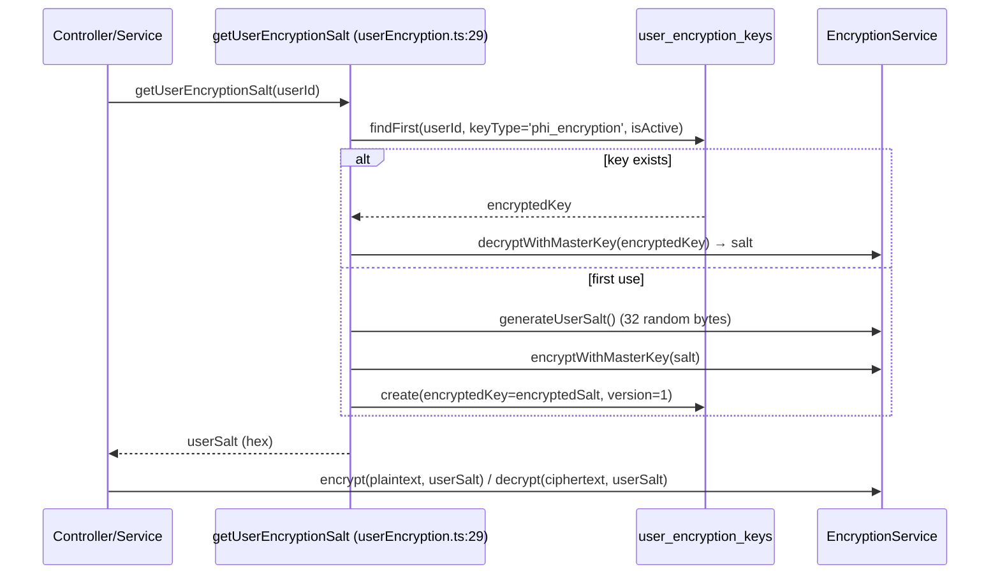

# PHI_TAXONOMY.md

> Authoritative, citation-dense reference for every Protected Health Information (PHI) field in OwnMyHealth: where each is **written** (encrypted), **read** (decrypted), **audited**, **redacted in logs**, and whether a non-owner (PROVIDER) can read it.
>
> Generated: 2026-06-01. Source of truth: `backend/src/services/encryption.ts` `PHI_FIELDS` constant (`backend/src/services/encryption.ts:410`).

## Purpose and scope

This document is the full standalone expansion of the lightweight seed inventory in `_phi-inventory.md`. The seed lists field names for security-prompt inheritance; this taxonomy lists **each field × every site that touches it**, so a reader with no repo access can answer "where is `Biomarker.valueEncrypted` decrypted?" or "can a provider read a patient's insurance member ID?" from this file alone.

Scope: the 13 models with entries in `PHI_FIELDS` (`backend/src/services/encryption.ts:L410-L486`). Every `*Encrypted` column in `backend/prisma/schema.prisma` is cross-checked against that constant in the [Drift findings](#drift-findings) section. PHI is encrypted application-side with AES-256-GCM under a per-user key derived from the master `PHI_ENCRYPTION_KEY` + a per-user salt — see [Encryption key lifecycle](#encryption-key-lifecycle).

What is **not** PHI (and why) per `_phi-inventory.md`: `User.email` (identifier, still log-redacted), `User.role` (enum), timestamps, `Biomarker.category`/`unit`, `InsurancePlan.planType` enum.

---

## Encryption model (one diagram)

```
                         PHI_ENCRYPTION_KEY (master, 64 hex = 256 bit)
                                    │
        getUserEncryptionSalt(userId)  ──reads──▶ user_encryption_keys.encrypted_key
        (userEncryption.ts:29)                     (salt, itself encrypted w/ master key)
                                    │
                                    ▼
        deriveUserKey = PBKDF2-SHA512(masterKey, userSalt, 600000, 32)   (encryption.ts:192)
                                    │
                                    ▼
   encrypt(plaintext, userSalt) ──▶ "iv:authTag:ciphertext" (all base64)  (encryption.ts:262)
   decrypt(ciphertext, userSalt) ◀── tries 600k iters, falls back to 100k (encryption.ts:287)
```

- Algorithm: `aes-256-gcm` (`backend/src/services/encryption.ts:57`).
- Format: `iv(16B):authTag(16B):ciphertext`, base64 (`backend/src/services/encryption.ts:L226`, `:277`).
- Per-user key: PBKDF2-SHA512, **600,000** iterations current / **100,000** legacy fallback (`backend/src/services/encryption.ts:L85-L86`, decrypt fallback at `:L305-L314`).
- The real API is `getEncryptionService().encrypt(plaintext, userSalt)` (`backend/src/services/encryption.ts:262`). There is **no** `encryptPHI(userId, plaintext)` helper.

```ts
// Source: backend/src/services/encryption.ts:L262-L278
encrypt(plaintext: string, userSalt: string): string {
  if (!plaintext) return '';
  const salt = Buffer.from(userSalt, 'hex');
  const key = this.deriveUserKey(salt);
  const iv = crypto.randomBytes(IV_LENGTH);
  const cipher = crypto.createCipheriv(ALGORITHM, key, iv);
  let encrypted = cipher.update(plaintext, 'utf8', 'base64');
  encrypted += cipher.final('base64');
  const authTag = cipher.getAuthTag();
  // Format: iv:authTag:ciphertext
  return `${iv.toString('base64')}:${authTag.toString('base64')}:${encrypted}`;
}
```

---

## Canonical model × field list

`PHI_FIELDS` defines **34 fields across 13 models** (`backend/src/services/encryption.ts:L410-L486`). Count by model: User 6, Biomarker 2, BiomarkerHistory 1, InsurancePlan 2, ProviderPatient 1, HealthNeed 1, HealthGoal 2, GoalProgressHistory 1, AuditLog 2, ExpenseProjection 3, ExpenseActual 8, CostAnalysis 3, LabConnection 2 → total **34**. (Field rows in the master table below = 34.)

Legend — **Audited W/R** cites the `AuditLogService` helper call site (`auditService.logCreate/logUpdate/logDelete/logAccess/logExport`); **Redacted?** = key present in `SENSITIVE_FIELDS` (`backend/src/utils/logger.ts:L21-L30`); **Provider?** = readable by a PROVIDER via a `ProviderPatient` consent flag.

| Model | Field | Column (DB) | In `PHI_FIELDS`? | Write site | Read site(s) | Audited W | Audited R | Redacted? | Provider? | Notes |
|---|---|---|---|---|---|---|---|---|---|---|
| User | `firstNameEncrypted` | `first_name_encrypted` | yes `:413` | `settingsController.ts:1056` | `settingsController.ts:1011,1079`; export `:451` | `settingsController.ts:1085` (logUpdate) | `settingsController.ts:1017` (logAccess) | **no** (only `dateOfBirth`, `address`, `phoneNumber` keys) | no | Name written only via profile update |
| User | `lastNameEncrypted` | `last_name_encrypted` | yes `:414` | `settingsController.ts:1060` | `settingsController.ts:1014,1082`; export `:452` | `settingsController.ts:1085` | `settingsController.ts:1017` | **no** | no | — |
| User | `dateOfBirthEncrypted` | `date_of_birth_encrypted` | yes `:415` | (no write site in repo) | export `settingsController.ts:453` | — | export logExport / logAccess `:693` | yes (`dateOfBirth`) | no | No current update path writes DOB; see [drift](#drift-findings) |
| User | `phoneEncrypted` | `phone_encrypted` | yes `:416` | (no write site in repo) | export `settingsController.ts:454` | — | `:693` | partial (`phoneNumber`, not `phone`/`phoneEncrypted`) | no | See [logger gaps](#logger-redaction-coverage) |
| User | `addressEncrypted` | `address_encrypted` | yes `:417` | (no write site in repo) | export `settingsController.ts:455` | — | `:693` | yes (`address`) | no | — |
| User | `healthProfileEncrypted` | `health_profile_encrypted` | yes `:418` | `healthProfileService.saveHealthProfile` `:102` | `healthProfileService.getDecryptedHealthProfile` `:73`; export `:445` | `settingsController.ts:1276` (logUpdate) | `settingsController.ts:1230` (logAccess) | **no** | no | JSON blob (conditions, meds). Read for AI via `healthContextService` |
| Biomarker | `valueEncrypted` | `value_encrypted` | yes `:422` | `biomarkerController.ts:238,328,504`; upload `shared.ts:194`; FHIR `labSyncService.ts:299` | `biomarkerController.ts:67,312,803`; routes `:180`; provider `providerRoutes.ts:522`; export `:462`; AI `healthContextService.ts:229` | `biomarkerController.ts:273,363,601` | `biomarkerController.ts:160,215,442,723,827` | yes (`valueEncrypted`) | **yes** `canViewBiomarkers` | Most-read PHI field |
| Biomarker | `notesEncrypted` | `notes_encrypted` | yes `:423` | `biomarkerController.ts:240,332,505`; upload `shared.ts:197` | `biomarkerController.ts:69`; provider `providerRoutes.ts:523`; export `:494` | `biomarkerController.ts:273,363` | `biomarkerController.ts:215` | partial (`notesEncrypted` not in set; `descriptionEncrypted`/`noteEncrypted` are) | **yes** `canViewBiomarkers` | See [logger gaps](#logger-redaction-coverage) |
| BiomarkerHistory | `valueEncrypted` | `value_encrypted` | yes `:425` | `biomarkerController.ts` (history rows on create/update); FHIR sync | `biomarkerController.ts:77,807`; routes `:188`; export `:476`; AI `healthContextService.ts:146` | via parent Biomarker | via parent Biomarker | yes (`valueEncrypted`) | **yes** `canViewBiomarkers` (parent) | No `notesEncrypted` by design (`encryption.ts:427`) |
| InsurancePlan | `memberIdEncrypted` | `member_id_encrypted` | yes `:431` | `insuranceController.ts:513,621` | `insuranceController.ts:237` (`toResponse`→`:231`); export | `insuranceController.ts:585,685` | `insuranceController.ts:450,489,769,867` | yes (`memberIdEncrypted`) | **yes** `canViewInsurance` | tryDecrypt swallows failures |
| InsurancePlan | `groupIdEncrypted` | `group_id_encrypted` | yes `:432` | `insuranceController.ts:516,626` | `insuranceController.ts:238` | `insuranceController.ts:585,685` | `insuranceController.ts:450,489` | yes (`groupIdEncrypted`) | **yes** `canViewInsurance` | — |
| ProviderPatient | `notesEncrypted` | `notes_encrypted` | yes `:436` | `providerRoutes.ts:221` (with **provider's** salt) | `settingsController.ts:644` (with **patient's** salt); `providerRoutes.ts` paths | `providerRoutes.ts:271` (logCreate) | `patientRoutes.ts` consent reads | partial (key not in set) | written by provider | **Salt-mismatch bug** — see [drift](#drift-findings) |
| HealthNeed | `descriptionEncrypted` | `description_encrypted` | yes `:440` | `healthNeedsController.ts:198,249,554` | `healthNeedsController.ts:47`; provider `providerRoutes.ts:661`; export | `healthNeedsController.ts:216,273,331` | `healthNeedsController.ts:128,175` | yes (`descriptionEncrypted`) | **yes** `canViewHealthNeeds` | Required column (non-null) |
| HealthGoal | `descriptionEncrypted` | `description_encrypted` | yes `:445` | `healthGoalsController.ts:376,484` | `healthGoalsController.ts:117`; export | `healthGoalsController.ts:434,532` | `healthGoalsController.ts:272,324` | yes (`descriptionEncrypted`) | no | — |
| HealthGoal | `targetValueEncrypted` | `target_value_encrypted` | yes `:446` | `healthGoalsController.ts:391,491` | `healthGoalsController.ts:39` | `healthGoalsController.ts:434,532` | `healthGoalsController.ts:272,324` | **no** | no | New (migration `20260420_encrypt_health_goal_target`); plaintext `targetValue` Decimal still present |
| GoalProgressHistory | `noteEncrypted` | `note_encrypted` | yes `:449` | `healthGoalsController.ts:424,624` | `healthGoalsController.ts:158`; export | via parent goal `:644` (logUpdate) | `healthGoalsController.ts:324` | yes (`noteEncrypted`) | no | — |
| AuditLog | `previousValueEncrypted` | `previous_value_encrypted` | yes `:453` | `auditLog.ts:240` (system salt) | admin viewer `adminRoutes.ts:915` (ciphertext returned) | n/a (is the audit record) | n/a | **no** | no | Encrypted with **system** salt, not per-user — see [lifecycle](#encryption-key-lifecycle) |
| AuditLog | `newValueEncrypted` | `new_value_encrypted` | yes `:454` | `auditLog.ts:241` (system salt) | admin viewer `adminRoutes.ts:915` | n/a | n/a | **no** | no | Same as above |
| ExpenseProjection | `serviceTypeEncrypted` | `service_type` | yes `:458` | `expenseController.ts:95,206,390` | `expenseController.ts:113,160,230,661` | `expenseController.ts:105,225` | `expenseController.ts:167` | **no** | no | DB column is `service_type` (not suffixed) |
| ExpenseProjection | `estimatedCostEncrypted` | `estimated_cost` | yes `:459` | `expenseController.ts:96,209` | `expenseController.ts:114,161,231,662`; AI `healthContextService.ts:296` | `:105,225` | `:167` | **no** | no | Monetary PHI stored as ciphertext string |
| ExpenseProjection | `notesEncrypted` | `notes` | yes `:460` | `expenseController.ts:99,214` | `expenseController.ts:115,162,232,665`; export `:583` | `:105,225` | `:167` | partial | no | — |
| ExpenseActual | `serviceTypeEncrypted` | `service_type` | yes `:463` | `expenseController.ts:390,510` | `expenseController.ts:299`; export `:602` | `expenseController.ts:409,535` | `expenseController.ts:456` | **no** | no | — |
| ExpenseActual | `providerNameEncrypted` | `provider_name` | yes `:464` | `expenseController.ts:392` | `expenseController.ts:301`; export | `:409,535` | `:456` | **no** | no | See [logger gaps](#logger-redaction-coverage) |
| ExpenseActual | `billedAmountEncrypted` | `billed_amount` | yes `:465` | `expenseController.ts:382` (`encNum`) | `expenseController.ts:293` (`decryptNumber`) | `:409,535` | `:456` | **no** | no | — |
| ExpenseActual | `insurancePaidEncrypted` | `insurance_paid` | yes `:466` | `expenseController.ts:382` | `expenseController.ts:293` | `:409,535` | `:456` | **no** | no | — |
| ExpenseActual | `patientPaidEncrypted` | `patient_paid` | yes `:467` | `expenseController.ts:382` | `expenseController.ts:293`; AI `healthContextService.ts:309` | `:409,535` | `:456` | **no** | no | — |
| ExpenseActual | `appliedToDeductibleEncrypted` | `applied_to_deductible` | yes `:468` | `expenseController.ts:382` | `expenseController.ts:293` | `:409,535` | `:456` | **no** | no | — |
| ExpenseActual | `appliedToOopEncrypted` | `applied_to_oop` | yes `:469` | `expenseController.ts:382` | `expenseController.ts:293` | `:409,535` | `:456` | **no** | no | — |
| ExpenseActual | `notesEncrypted` | `notes` | yes `:470` | `expenseController.ts:400,522` | `expenseController.ts:309`; export | `:409,535` | `:456` | partial | no | — |
| CostAnalysis | `claudeResponseEncrypted` | `claude_response_encrypted` | yes `:476` | `expenseController.ts:737` | `expenseController.ts:799`; export `settingsController.ts:613` | `expenseController.ts:748` | `expenseController.ts:629,808` | partial (`claudeResponse` key matches plaintext, not `claudeResponseEncrypted`) | no | Renamed from `claudeResponse` (migration `20260424...`) |
| CostAnalysis | `totalProjectedOopEncrypted` | `total_projected_oop` | yes `:477` | `expenseController.ts:739` | `expenseController.ts:801` | `:748` | `:808` | **no** | no | — |
| CostAnalysis | `projectedExpensesSnapshotEncrypted` | `projected_expenses_snapshot` | yes `:478` | `expenseController.ts:742` | export | `:748` | `:808` | **no** | no | JSON snapshot |
| LabConnection | `accessTokenEncrypted` | `access_token_encrypted` | yes `:483` | `labSyncService.ts:142,230` | `labSyncService.ts:213,403` | `labSyncService.ts:173` (logAccess CONNECT) | `labSyncService.ts:351,369,416` | yes (`accessToken`) | no (user-scoped only) | SMART-on-FHIR OAuth — top-tier |
| LabConnection | `refreshTokenEncrypted` | `refresh_token_encrypted` | yes `:484` | `labSyncService.ts:143,232` | `labSyncService.ts:215` | `labSyncService.ts:173` | `labSyncService.ts:351` | yes (`refreshToken`) | no (user-scoped only) | — |

`InsuranceBenefit` holds **no** `*Encrypted` columns (`backend/prisma/schema.prisma:L361-L382`) — confirmed not PHI-bearing per schema; member/group IDs live on `InsurancePlan`, not benefits.

---

## Per-field deep dives

### `Biomarker.valueEncrypted`

- **Column**: `value_encrypted` — `backend/prisma/schema.prisma:147` (non-null).
- **Encryption site(s)**: create `biomarkerController.ts:238`, update `:328`, bulk `:504`; lab upload `controllers/upload/shared.ts:194`; Quest FHIR sync `services/fhir/labSyncService.ts:299`.
- **Decryption site(s)** (8 owner + provider paths):
  - `biomarkerController.getBiomarker`/list `:67`, update read-back `:312,346`, acknowledge `:803,807`
  - AI guidance route `routes/biomarkerRoutes.ts:180,188`
  - provider path `routes/providerRoutes.ts:522` (gated by `canViewBiomarkers`)
  - data export `settingsController.ts:462,476`
  - AI health context `services/healthContextService.ts:146,229`
- **Audit**: write — `auditService.logCreate('Biomarker', …)` `biomarkerController.ts:273`, `logUpdate` `:363`, bulk `logCreate(…, 'BULK')` `:601`; read — `auditService.logAccess('Biomarker', …)` `:160,215,442,723,827`.
- **Logger redaction**: `valueEncrypted` ∈ `SENSITIVE_FIELDS` (`backend/src/utils/logger.ts:24`); the set lowercases keys before matching (`:49`).
- **Provider exposure**: yes, via `ProviderPatient.canViewBiomarkers = true` (default `true`, `schema.prisma:98`).

```ts
// Source: backend/src/controllers/biomarkerController.ts:L238-L240
const valueEncrypted = encryptionService.encrypt(String(input.value), userSalt);
const notesEncrypted = input.notes
  ? encryptionService.encrypt(input.notes, userSalt)
  : null;
```

### `User.healthProfileEncrypted`

- **Column**: `health_profile_encrypted` — `backend/prisma/schema.prisma:33` (migration `20260418_add_health_profile`).
- **Encryption site**: `healthProfileService.saveHealthProfile` — `backend/src/services/healthProfileService.ts:102` (encrypts `JSON.stringify(stamped)`).
- **Decryption site(s)**: `getDecryptedHealthProfile` `:73` (used by `getHealthProfile`, `updateHealthProfile`, AI `healthContextService`, and data export `settingsController.ts:445`).
- **Audit**: write — `logUpdate('UserHealthProfile', …)` `settingsController.ts:1276`; read — `logAccess('UserHealthProfile', …)` `:1230`.
- **Logger redaction**: **not covered** — `healthProfileEncrypted` is absent from `SENSITIVE_FIELDS`. See [logger gaps](#logger-redaction-coverage).
- **Provider exposure**: no provider route reads this field.

```ts
// Source: backend/src/services/healthProfileService.ts:L99-L109
const salt = await getUserEncryptionSalt(userId);
const stamped: UserHealthProfile = { ...profile, updatedAt: new Date().toISOString() };
const ciphertext = encryption.encrypt(JSON.stringify(stamped), salt);
await withRLSContext(userId, async (tx) => {
  await tx.user.update({ where: { id: userId }, data: { healthProfileEncrypted: ciphertext } });
});
```

### `LabConnection.accessTokenEncrypted` / `refreshTokenEncrypted`

- **Columns**: `access_token_encrypted` (non-null), `refresh_token_encrypted` — `backend/prisma/schema.prisma:700-701` (migration `20260418_add_lab_connections`).
- **Encryption site(s)**: `persistConnection` `services/fhir/labSyncService.ts:142-143`; refresh `:230-232` — both with the **user's own** salt.
- **Decryption site(s)**: sync `:213,215`; disconnect/revoke `:403` — all inside `withRLSContext(userId, …)`, **user-scoped only, never provider-shared**.
- **Audit**: connect `logAccess('LabConnection', …, { operation: 'CONNECT' })` `:173`; sync `:351,369`; disconnect `:416`.
- **Logger redaction**: `accessToken` and `refreshToken` ∈ `SENSITIVE_FIELDS` (`logger.ts:22`). The `*Encrypted` variants are not explicitly listed but the base keys are.
- **Provider exposure**: **no** — there is no provider route that reads `LabConnection`. A stolen token is a direct path to live PHI at Quest, so this is top-tier (treated as PHI even though it is technically a credential).

```ts
// Source: backend/src/services/fhir/labSyncService.ts:L140-L143
const encryption = getEncryptionService();
const salt = await getUserEncryptionSalt(userId);
const accessEnc = encryption.encrypt(tokenSet.accessToken, salt);
const refreshEnc = tokenSet.refreshToken ? encryption.encrypt(tokenSet.refreshToken, salt) : null;
```

### `ProviderPatient.notesEncrypted`

- **Column**: `notes_encrypted` — `backend/prisma/schema.prisma:106`.
- **Encryption site**: `routes/providerRoutes.ts:221` — encrypted with the **provider's** salt (`getUserEncryptionSalt(providerId)` `:220`).
- **Decryption site**: `settingsController.ts:644` — the **patient's** own data export decrypts it with the **patient's** `userSalt`.
- **Audit**: write — `logCreate('provider_patient_request', …)` `providerRoutes.ts:271`.
- **Provider/patient access**: written by the provider when requesting access; surfaced into the patient's own §164.524 export. See the salt-mismatch finding in [drift](#drift-findings) — a patient export will fail to decrypt notes written under the provider's salt.

### `AuditLog.previousValueEncrypted` / `newValueEncrypted`

- **Columns**: `previous_value_encrypted`, `new_value_encrypted` — `backend/prisma/schema.prisma:468-469`.
- **Encryption site**: `AuditLogService.log` → `encryptValue` `auditLog.ts:240-241`, which calls `encrypt(value, this.systemSalt)` `:220` — the **system** salt (`config.auditSalt`, `:148`), **not** a per-user salt. This is deliberate: per-user salts are destroyed on account deletion, but audit logs survive for 7-year HIPAA retention (`RETENTION_DAYS = 2555`, `auditLog.ts:10`), so per-user encryption would render them unreadable post-deletion.
- **Read**: admin audit viewer `routes/adminRoutes.ts:915` returns rows (ciphertext); these encrypted snapshots hold the before/after PHI change values for create/update/delete.
- **Fail-closed**: `encryptValue` re-throws on failure so PHI mutations fail rather than write a counterfeit ciphertext (`auditLog.ts:L221-L231`).

```ts
// Source: backend/src/services/auditLog.ts:L214-L221
private encryptValue(value: unknown): string | null {
  if (value === undefined || value === null) return null;
  try {
    const encryptionService = getEncryptionService();
    const stringValue = typeof value === 'string' ? value : JSON.stringify(value);
    return encryptionService.encrypt(stringValue, this.systemSalt);
  } catch (error) { /* re-throw → fail closed */ }
}
```

---

## Logger redaction coverage

`SENSITIVE_FIELDS` is a `Set` of lowercased key names; the recursive sanitizer walks objects and arrays and replaces matched keys with `[REDACTED]` (`backend/src/utils/logger.ts:L21-L56`).

```ts
// Source: backend/src/utils/logger.ts:L21-L30
const SENSITIVE_FIELDS = new Set([
  'password', 'token', 'accessToken', 'refreshToken', 'secret',
  'ssn', 'socialSecurityNumber', 'memberId', 'groupNumber',
  'memberIdEncrypted', 'groupIdEncrypted', 'valueEncrypted',
  'descriptionEncrypted', 'noteEncrypted', 'genotype',
  'email', 'phoneNumber', 'address', 'dateOfBirth',
  // AI response fields that may contain PHI
  'responseText', 'jsonText', 'claudeResponse', 'guidance',
  'extractedData', 'pdfText', 'pdfContent', 'biomarker',
]);
```

> Matching is by exact (lowercased) **key name**. A PHI field whose key is not in this set leaks in full if its object is ever passed as `logger.*('msg', { data })`. The set lowercases stored entries too, so `accessToken` matches `accesstoken` but **not** `accessTokenEncrypted`.

**Logger redaction gaps** (PHI field in `PHI_FIELDS` but key absent from `SENSITIVE_FIELDS`):

| PHI field (key as it appears in objects) | In `PHI_FIELDS`? | In `SENSITIVE_FIELDS`? | Risk |
|---|---|---|---|
| `healthProfileEncrypted` | yes `:418` | **no** | Conditions/meds blob leaks if logged — patch `logger.ts` |
| `claudeResponseEncrypted` | yes `:476` | **no** (only plaintext `claudeResponse` matches) | AI analysis ciphertext key not matched |
| `accessTokenEncrypted` / `refreshTokenEncrypted` | yes `:483-484` | **no** (base `accessToken`/`refreshToken` match plaintext only) | OAuth token ciphertext key not matched |
| `providerNameEncrypted` (ExpenseActual) | yes `:464` | **no** | Provider name could leak into logs |
| `serviceTypeEncrypted`, `estimatedCostEncrypted`, `billedAmountEncrypted`, `insurancePaidEncrypted`, `patientPaidEncrypted`, `appliedToDeductibleEncrypted`, `appliedToOopEncrypted`, `totalProjectedOopEncrypted`, `projectedExpensesSnapshotEncrypted` | yes | **no** | All expense/cost ciphertext keys unmatched |
| `notesEncrypted` (Biomarker/Expense/ProviderPatient) | yes | **no** (`noteEncrypted` singular matches GoalProgressHistory only) | Note ciphertext key unmatched |
| `targetValueEncrypted` (HealthGoal) | yes `:446` | **no** | — |
| `firstNameEncrypted` / `lastNameEncrypted` | yes `:413-414` | **no** | Name ciphertext keys unmatched |
| `phoneEncrypted` / `dateOfBirthEncrypted` / `addressEncrypted` | yes | partial — `dateOfBirth`/`address` plaintext keys match; `*Encrypted` keys do not | — |

**Stale entries to remove** (present in `SENSITIVE_FIELDS`, no longer valid):

| Stale key | Why stale | Source |
|---|---|---|
| `genotype` | `DNAVariant` model dropped (migration `20260423_drop_dna_genetics`); only surviving hit is the initial-schema migration SQL `00000000000000_initial_schema/migration.sql:222` | `backend/src/utils/logger.ts:25` |
| `claudeResponse` | Renamed to `claudeResponseEncrypted` (migration `20260424...`); the column/field no longer exists under the old name | `backend/src/utils/logger.ts:29` |

Mitigation in place: since the stored ciphertext keys carry an `Encrypted` suffix, a leaked value is AES-256-GCM ciphertext, not plaintext — defense in depth, not a clean redaction. Free-text PHI sent to AI is separately scrubbed by `redactPHI` (`backend/src/utils/phiRedaction.ts:97`), which fires regex patterns for SSN/MRN/NPI/DEA/phone/email/DOB/address/ZIP/name.

---

## Audit log coverage

Audit calls use the `AuditLogService` helpers from `getAuditLogService(prisma)` (`backend/src/services/auditLog.ts:565`): `logCreate`, `logUpdate`, `logDelete`, `logAccess`, `logExport`, `logAuth`, `logSystem`. Create/update/delete/export are **fail-closed** (`failClosed: true` re-throws on audit failure — `auditLog.ts:L329-L461`); read and auth are best-effort. `AuditAction` enum values: `READ, CREATE, UPDATE, DELETE, EXPORT, LOGIN, LOGOUT, …, KEY_ROTATION` (`backend/prisma/schema.prisma:L589-L608`).

| Model / resource | Audited on write? | Audited on read? | Source (write / read) |
|---|---|---|---|
| Biomarker | yes | yes | `biomarkerController.ts:273,363,409,601` / `:160,215,442,723,827` |
| BiomarkerHistory | via parent | via parent | (no own resourceType) |
| InsurancePlan | yes | yes | `insuranceController.ts:585,685,731` / `:450,489,769,867` |
| HealthNeed | yes | yes | `healthNeedsController.ts:216,273,331,373` / `:128,175,442,512` |
| HealthGoal + GoalProgressHistory | yes | yes | `healthGoalsController.ts:434,532,644,689` / `:272,324,769,860` |
| ExpenseProjection | yes | yes | `expenseController.ts:105,225,255` / `:167` |
| ExpenseActual | yes | yes | `expenseController.ts:409,535,562` / `:456` |
| CostAnalysis | yes | yes | `expenseController.ts:748` / `:629,808` |
| User profile (name) | yes | yes | `settingsController.ts:1085` / `:1017` |
| User healthProfile | yes | yes | `settingsController.ts:1276` / `:1230` |
| User data export | export | export | `settingsController.ts:693` (logAccess), `:613` region |
| LabConnection | yes (CONNECT/sync) | yes | `labSyncService.ts:173,351` / `:369,416` |
| ProviderPatient (notes) | yes (request) | consent reads | `providerRoutes.ts:271` / `patientRoutes.ts` |
| Provider cross-user PHI read | n/a | yes (incl. failures) | `providerRoutes.ts:474-545,614-671` |
| AuditLog | is the record | admin viewer | `adminRoutes.ts:915` |

See [Audit coverage gaps](#drift-findings) for the one notable gap.

---

## Encryption key lifecycle



- **Master key**: `PHI_ENCRYPTION_KEY`, 64 hex chars (256-bit), validated and **fails hard** on missing/short/non-hex/placeholder values in every environment (`backend/src/services/encryption.ts:L102-L142`, `:L164-L185`). Config-level validation at `backend/src/config/index.ts:L354-L381`. See [ENV_VARS.md](./ENV_VARS.md).
- **Per-user salt**: 32 random bytes (`generateUserSalt` `encryption.ts:205`), stored in `user_encryption_keys.encrypted_key` **encrypted with the master key** (`userEncryption.ts:55`), schema `backend/prisma/schema.prisma:L77-L92`. Lookup is admin-context to keep the salt service infrastructure-level (`userEncryption.ts:L29-L72`).
- **Derived key**: `PBKDF2-SHA512(masterKey, salt, 600000, 32)` (`encryption.ts:L192-L200`). Decrypt tries 600k then falls back to 100k legacy (`:L305-L314`).
- **System salt** (audit logs only): `config.auditSalt` from `AUDIT_LOG_SALT`, length-validated at boot (`backend/src/config/index.ts:L284-L291`, used `auditLog.ts:148`).
- **Key rotation**: the per-user rotation helper was **removed** as a footgun (it rotated the salt without re-encrypting existing PHI — `userEncryption.ts:L74-L80`). The `KEY_ROTATION` `AuditAction` enum value is retained for a future dedicated re-encryption job (`schema.prisma:607`). There is a `TODO(key-rotation)` to store iteration count per ciphertext (`encryption.ts:L80-L83`).
  - **Master-key rotation cadence**: TBD (external: `PHI_ENCRYPTION_KEY` rotation cadence is not documented in the repo — no entry in `New Project Documents/` matched a rotation grep. Define in [RUNBOOK.md](./RUNBOOK.md) and cross-link here. Operationally, the key lives in GCP Secret Manager — see [ENV_VARS.md](./ENV_VARS.md)).

---

## Cross-user exposure matrix

A PROVIDER reads a patient's PHI only through `routes/providerRoutes.ts`, gated by an **ACTIVE, unexpired** `ProviderPatient` consent plus a per-domain boolean flag. RLS policies also enforce this at the DB layer via `has_provider_access(...)` (migration `20260529_fix_has_provider_access`). The four real flags (`backend/src/types/index.ts:L28-L31`, schema `:98-101`):

| PHI domain | Provider can read? | Permission flag (default) | Route + gate | Decrypt site |
|---|---|---|---|---|
| Biomarkers (`value`, `notes`) | yes | `canViewBiomarkers` (default `true`) | `GET /provider/patients/:id/biomarkers`; check `providerRoutes.ts:493` | `providerRoutes.ts:522-523` (patient's salt) |
| Health needs (`description`) | yes | `canViewHealthNeeds` (default `true`) | `GET /provider/patients/:id/health-needs`; check `providerRoutes.ts:633` | `providerRoutes.ts:661` |
| Insurance (`memberId`, `groupId`) | gated | `canViewInsurance` (default `false`) | flag exists; no provider insurance read route ships today | n/a (no provider decrypt site) |
| Write/edit patient data | gated | `canEditData` (default `false`) | `rbac.ts:240` maps `write`→`canEditData` | n/a |
| Health goals, expenses, cost analysis, health profile, lab tokens | **no** | — | no provider route exposes these | owner-only |

Every provider PHI read is audited, **including denials** (`operation: 'PHI_ACCESS', success: false, reason: …`) — e.g. consent expired `providerRoutes.ts:484`, permission denied `:495`, success `:540`.

```ts
// Source: backend/src/routes/providerRoutes.ts:L493-L501
if (!relationship.canViewBiomarkers) {
  await auditService.logAccess('patient_biomarkers', patientId, { req, userId: providerId }, {
    operation: 'PHI_ACCESS',
    success: false,
    reason: 'permission_denied',
  });
  throw new ForbiddenError('You do not have permission to view this patient\'s biomarkers');
}
```

```ts
// Source: backend/src/middleware/rbac.ts:L239-L245
if (permission === 'read') return relationship.canViewBiomarkers;
if (permission === 'write') return relationship.canEditData;
// ...
if (permission === 'read') return relationship.canViewInsurance;
```

**PHI on user deletion**: hard cascade delete. `tx.user.delete()` (`settingsController.ts:966`) cascades to all owned rows via `onDelete: Cascade` (e.g. `schema.prisma:69,87,109-110,711`). Order matters: lab OAuth tokens are revoked first (`settingsController.ts:929` → `revokeAllUserConnections`), then GCS files deleted "fail-hard" (`:941-962`), then the cascade. The purge is audit-logged with per-category counts via `logDelete('UserData', …)` (`settingsController.ts:862`) and `logDelete('User', …)` (`:920`). Audit rows themselves survive deletion (system-salt encrypted, see [lifecycle](#encryption-key-lifecycle)).

---

## Drift findings

**Schema vs `PHI_FIELDS`** — every `*Encrypted` column in `backend/prisma/schema.prisma` (34 columns at lines 14-18, 33, 106, 147-148, 182, 199-200, 389, 408, 416, 449, 468-469, 618-619, 622, 641-642, 644-648, 651, 674-675, 677, 700-701) maps 1:1 to a `PHI_FIELDS` entry (`encryption.ts:L410-L486`). **No schema/PHI_FIELDS drift.** Several expense columns map to non-suffixed DB names (`service_type`, `billed_amount`, etc.) but the Prisma field is `*Encrypted`.

**Logger redaction gaps** (detail in [Logger redaction coverage](#logger-redaction-coverage)):

| PHI field key | In `PHI_FIELDS`? | In `SENSITIVE_FIELDS`? | Risk |
|---|---|---|---|
| `healthProfileEncrypted` | yes | **no** | Patch `logger.ts` — conditions/meds blob |
| `accessTokenEncrypted` / `refreshTokenEncrypted` | yes | **no** (base names match plaintext only) | OAuth token ciphertext key unmatched |
| `claudeResponseEncrypted` | yes | **no** (`claudeResponse` is stale) | AI analysis ciphertext key unmatched |
| `providerNameEncrypted` + all expense/name/note `*Encrypted` keys | yes | **no** | Ciphertext leaks if object logged |

**Stale logger entries**: `genotype` (DNA model removed) and `claudeResponse` (renamed) should be cleaned from `SENSITIVE_FIELDS` (`logger.ts:25,29`).

**Audit coverage gap**:

| Resource | Audited on write? | Audited on read? | Notes |
|---|---|---|---|
| `BiomarkerHistory` | inherited (parent) | inherited (parent) | No own `resourceType`; acceptable |
| Bulk biomarker create | yes (`'BULK'`) | n/a | `resourceId='BULK'`, not per-row IDs (`biomarkerController.ts:601`) |

All write paths in the master table have a matching `logCreate/logUpdate/logDelete`. No write-without-audit found among `PHI_FIELDS` models.

**ProviderPatient salt-mismatch bug**: `ProviderPatient.notesEncrypted` is encrypted with the **provider's** salt (`providerRoutes.ts:220-221`) but the only decrypt site is the **patient's** own data export, which uses the **patient's** salt (`settingsController.ts:644`). The two PBKDF2-derived keys differ, so the GCM auth tag fails and the patient export cannot decrypt the relationship note. The export uses a bare `decrypt` closure (`settingsController.ts:439`) that throws on failure (it is not wrapped in the field-level `try/catch` of `decryptFields`). Flag for fix: encrypt notes under a shared/patient salt, or skip the field in patient export.

**Removed since seed** (no longer in schema or `PHI_FIELDS`; do **not** treat as deprecated PHI fields):

| Model | Field | Removed by |
|---|---|---|
| `DNAVariant` | `genotypeEncrypted` | migration `20260423_drop_dna_genetics` |
| `GeneticTrait` | `descriptionEncrypted`, `recommendationsEncrypted` | migration `20260423_drop_dna_genetics` |

No `DNAVariant`/`GeneticTrait` references remain in `backend/src/`; the only `genotype` hits are `logger.ts:25` (stale, flagged) and `00000000000000_initial_schema/migration.sql:222` (historical DDL, expected).

---

## Reproducing this inventory

Run from repo root `C:/Users/breil/Projects/OwnMyHealth/`. Prefer the Claude Code Grep/Glob tools; the equivalent ripgrep commands are shown for portability.

```bash
# 1. PHI_FIELDS source of truth
rg -n "PHI_FIELDS|Encrypted'" backend/src/services/encryption.ts

# 2. Every *Encrypted column in the schema (should match PHI_FIELDS 1:1)
rg -n "Encrypted\s+String" backend/prisma/schema.prisma

# 3. All encrypt call sites
rg -n "getEncryptionService|\.encrypt\(" backend/src

# 4. All decrypt call sites
rg -n "\.decrypt\(" backend/src

# 5. Audit helper call sites
rg -n "\.log(Access|Create|Update|Delete|Export|Auth|System)\(" backend/src

# 6. Logger redaction map
rg -n "SENSITIVE_FIELDS" backend/src/utils/logger.ts

# 7. Provider consent flags
rg -n "canViewBiomarkers|canViewInsurance|canViewHealthNeeds|canEditData" backend/src

# 8. Confirm DNA/genetics fully removed
rg -n "DNAVariant|GeneticTrait|genotype" backend/
```

---

## Acceptance questions (self-answered from this doc)

1. **How many PHI fields in `PHI_FIELDS`, all mapped to `*Encrypted` columns?** 34 fields across 13 models ([master table](#canonical-model--field-list)); all map 1:1 to schema `*Encrypted` columns — no drift ([drift](#drift-findings)).
2. **Where is `Biomarker.valueEncrypted` decrypted, how many sites?** 8+ owner/provider/export/AI sites — see the [deep dive](#biomarkervalueencrypted) (`biomarkerController.ts:67,312,803`; `biomarkerRoutes.ts:180,188`; `providerRoutes.ts:522`; `settingsController.ts:462,476`; `healthContextService.ts:146,229`).
3. **Is `ExpenseActual.providerNameEncrypted` covered by logger redaction?** No — key absent from `SENSITIVE_FIELDS` ([gaps](#logger-redaction-coverage)).
4. **Which PHI can a PROVIDER read, via which flag?** Biomarkers (`canViewBiomarkers`), health needs (`canViewHealthNeeds`); insurance gated by `canViewInsurance` (no read route ships); `canEditData` for writes ([matrix](#cross-user-exposure-matrix)).
5. **How is the per-user key derived, where is the salt stored?** PBKDF2-SHA512(masterKey, salt, 600000); salt from `getUserEncryptionSalt`, stored in `user_encryption_keys.encrypted_key` (master-key-encrypted) ([lifecycle](#encryption-key-lifecycle)).
6. **Does every PHI write have a matching audit call?** Yes for all `PHI_FIELDS` models ([audit coverage](#audit-log-coverage)); bulk create uses `resourceId='BULK'` ([drift](#drift-findings)).
7. **Where are `LabConnection` tokens written/read, user-scoped only?** Written `labSyncService.ts:142-143,230-232`, read `:213,215,403`, all inside `withRLSContext(userId)` — never provider-shared ([deep dive](#labconnectionaccesstokenencrypted--refreshtokenencrypted)).
8. **Which audit fields hold encrypted PHI?** `AuditLog.previousValueEncrypted` / `newValueEncrypted` (system-salt encrypted) ([deep dive](#auditlogpreviousvalueencrypted--newvalueencrypted)).
9. **Rotation policy for `PHI_ENCRYPTION_KEY`?** Per-user rotation helper removed; master-key cadence is `TBD (external: …)` → define in [RUNBOOK.md](./RUNBOOK.md) ([lifecycle](#encryption-key-lifecycle)).
10. **Redaction gap in `logger.ts`?** Yes — `healthProfileEncrypted`, `claudeResponseEncrypted`, `accessTokenEncrypted` and most `*Encrypted` keys are unmatched; `genotype`/`claudeResponse` are stale ([gaps](#logger-redaction-coverage)).
11. **How is `ProviderPatient.notesEncrypted` accessed?** Written by provider (provider's salt), read in patient's export (patient's salt) — salt-mismatch bug ([deep dive](#providerpatientnotesencrypted), [drift](#drift-findings)).
12. **What happens to PHI on user deletion?** Hard cascade delete after token revoke + GCS purge; logged via `logDelete('UserData'/'User')` ([matrix](#cross-user-exposure-matrix)).
13. **Which controllers decrypt PHI for non-owner access, what gates each?** Only `providerRoutes.ts` (biomarkers/health-needs), gated by `canViewBiomarkers`/`canViewHealthNeeds` + ACTIVE consent ([matrix](#cross-user-exposure-matrix)).
14. **Is `HealthNeed.descriptionEncrypted` encrypted, and `User.healthProfileEncrypted` covered everywhere?** Yes — HealthNeed `:440` ([table](#canonical-model--field-list)); healthProfile encrypted at all write/read sites but **not** logger-redacted ([deep dive](#userhealthprofileencrypted), [gaps](#logger-redaction-coverage)).

---

## Prompt drift log

- `./40-phi-taxonomy-doc.md` and `_phi-inventory.md` say "13 models" — the field **count** is 34 across those 13 models (not 13). The doc states 34 explicitly.
- The spec's drift-table example posits `ExpenseActual.providerName` "in `PHI_FIELDS`? yes". The actual `PHI_FIELDS` key is `providerNameEncrypted` (`encryption.ts:464`); the unsuffixed `providerName` is the response-shape field, not a `PHI_FIELDS` entry. Documented under the suffixed name.
- Spec example "`HealthNeed.description` audited on write? yes / read? no" does **not** hold: `HealthNeed` read **is** audited (`healthNeedsController.ts:128,175`). No HealthNeed audit gap exists; recorded accurately.
- `CLAUDE.md` "PHI Encryption" list still names "Insurance: ... plan name, provider name, benefits" and "AI Responses: guidance content" as encrypted. Schema reality: `InsurancePlan.planName`/`insurerName` are plaintext `VarChar`, `InsuranceBenefit` has no encrypted columns, and biomarker AI guidance is generated on-the-fly (not a stored encrypted column). Drift in `CLAUDE.md`, not in code.
- New finding not in the seed: `ProviderPatient.notesEncrypted` salt mismatch (write=provider salt, read=patient salt). Recorded in [drift](#drift-findings).

---

## Related Documents

- [DATA_MODEL.md](./DATA_MODEL.md) — full Prisma schema, per-model tables, RLS policies, cascade behavior.
- [ARCHITECTURE.md](./ARCHITECTURE.md) — encryption layer, audit flow, RLS context (`withRLSContext`/`withRLSTransaction`).
- [API_REFERENCE.md](./API_REFERENCE.md) — endpoints that return decrypted PHI (biomarker/insurance/expense/provider routes).
- [HIPAA_CHECKLIST.md](./HIPAA_CHECKLIST.md) — §164.312 technical safeguards citing the encryption + audit evidence here.
- [ENV_VARS.md](./ENV_VARS.md) — `PHI_ENCRYPTION_KEY`, `AUDIT_LOG_SALT` classification and consumers.
- [SECURITY_STATUS.md](./SECURITY_STATUS.md) — open PHI-related findings (logger gaps, ProviderPatient salt mismatch).
- [RUNBOOK.md](./RUNBOOK.md) — key/salt rotation procedure (rotation cadence TBD, to be defined there).
- `_phi-inventory.md` — the lightweight seed inventory this doc expands.
