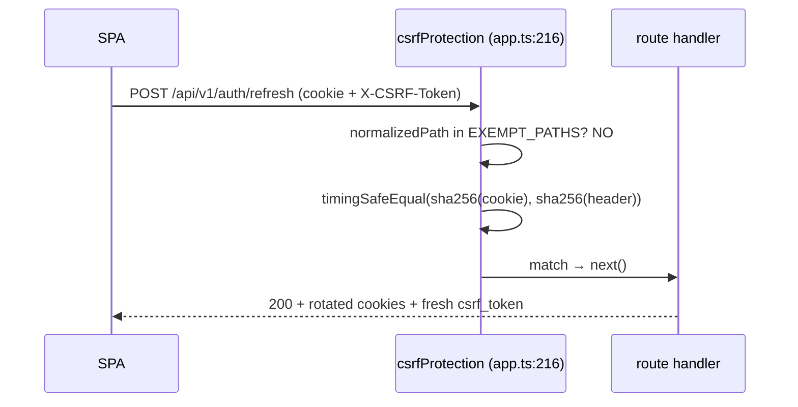

# ROUTING_TABLE.md — Middleware & Security Stack per Endpoint

> **Generated** 2026-06-16 against HEAD `fb2cd32`. Source of truth = the live route files under `backend/src/routes/` (18 non-test files incl. `index.ts`), `backend/src/app.ts`, and the middleware in `backend/src/middleware/`. Every non-trivial claim cites `file:line`.

## Purpose & how to read

This is the **security-stack-facing** view of the OwnMyHealth API. For each endpoint it answers: *what guards this request, in what order, and what breaks if a guard is missing?* It is the companion to [`API_REFERENCE.md`](./API_REFERENCE.md) (the contract-facing view — request/response shapes, curl, JSON). Both docs cover the same endpoints; this one tracks the **middleware chain, rate limiter, RBAC role, RLS wrap, validation schema, plan/AI-spend gating, demo blocking, and audit logging** rather than payloads.

Open this doc first when **adding a new route** (copy the guard pattern of a sibling route in the same group) or when **reviewing a route for a missing guard**. The single biggest correctness rule in this codebase: `authenticate` is almost always applied **router-level** via `router.use(authenticate)` at the top of each route file, so it does NOT appear on individual `router.get/post(...)` lines — do not report it as missing. RLS (`withRLSContext` / `withRLSTransaction`) is enforced **inside the controller body**, not in the route file — you must read the controller to confirm it.

```
Browser / SPA ──HTTP──▶ Express app (app.ts)
                          │  global middleware chain (§2)
                          ▼
                   /api/v1 router (routes/index.ts)  ── + /api/v1/internal (mounted directly in app.ts)
                          │  router.use(authenticate)  ← per route-file, router-level
                          │  per-route middleware: limiter → spend → demo → plan → validate
                          ▼
                   controller handler
                          │  withRLSContext / withRLSTransaction  ← RLS enforced HERE
                          ▼
                   PostgreSQL (FORCE ROW LEVEL SECURITY on all 19 RLS tables)
```

---

## §1 Global middleware chain (runs before any route)

Authority: `backend/src/app.ts`. Order is the literal `app.use(...)` order:

```
1. trust proxy = 1                     app.ts:120   (real client IP behind Cloud Run LB)
2. Helmet (CSP, frame, CORP)           app.ts:125-141
3. CORS + app.options('*') preflight   app.ts:191, app.ts:194
4. cookie-parser                       app.ts:197
5. compression (opts OUT of SSE)       app.ts:204-211
6. csrfProtection (double-submit)      app.ts:215-217  (skippable in dev via DISABLE_CSRF=true)
7. standardLimiter (global rate cap)   app.ts:220
8. morgan request logging (query-stripped in prod)  app.ts:239-245
9. express.json({ limit: '10mb' })     app.ts:248
10. express.urlencoded({10mb})         app.ts:249
11. requireJsonContentType             app.ts:252
12. /api → Cache-Control: no-store     app.ts:259-262
13. routes mounted at /api/v1          app.ts:265
14. /api/v1/internal mounted SEPARATELY app.ts:269
15. /api/v1/csrf-token endpoint        app.ts:284
16. notFoundHandler (404)              app.ts:327
17. errorHandler (centralized)         app.ts:330
```

Key non-obvious details:

- **Compression explicitly skips SSE** so the AI Health Guide stream isn't buffered:

  ```ts
  // Source: backend/src/app.ts:204-211
  app.use(compression({
    threshold: 1024,
    level: 6,
    filter: (req, res) => {
      if (req.headers.accept === 'text/event-stream') return false;
      return compression.filter(req, res);
    },
  }));
  ```

- **`standardLimiter` is the global rate cap** (`config.rateLimit.maxRequests` = 100 / 15 min by default) applied to every request before routing (`app.ts:220`, `rateLimiter.ts:66-85`). Routes that need a tighter cap *add their own* limiter on top.
- **`requireJsonContentType`** rejects non-JSON `POST/PUT/PATCH` bodies but **skips `multipart/form-data`** so file uploads pass (`validation.ts:273-285`).
- **`/api` blanket `Cache-Control: no-store, no-cache, private`** prevents any intermediate cache from storing PHI responses (`app.ts:259-262`).
- **`csrfProtection` is mounted at the app root** (before the `/api/v1` router), so inside the CSRF middleware `req.path` is the **fully-qualified** path including `/api/v1` — that is why `EXEMPT_PATHS` entries are spelled with the full prefix (`csrf.ts:100-145`). See [`ARCHITECTURE.md#middleware-stack`](./ARCHITECTURE.md).

---

## §2 Route group index (base mounts)

15 groups are mounted in `backend/src/routes/index.ts`; `internalRoutes` is mounted directly in `app.ts`.

| Base path | Route file | Mount site | Router-level guards |
|---|---|---|---|
| `/api/v1/auth` | `authRoutes.ts` | `index.ts:82` | `router.use(authLimiter)` (`authRoutes.ts:34`) — auth is per-route |
| `/api/v1/biomarkers` | `biomarkerRoutes.ts` | `index.ts:83` | `router.use(authenticate)` (`biomarkerRoutes.ts:48`) |
| `/api/v1/insurance` | `insuranceRoutes.ts` | `index.ts:84` | `router.use(authenticate)` (`insuranceRoutes.ts:64`) |
| `/api/v1/expenses` | `expenseRoutes.ts` | `index.ts:85` | `router.use(authenticate)` (`expenseRoutes.ts:32`) |
| `/api/v1/health-needs` | `healthNeedsRoutes.ts` | `index.ts:86` | `router.use(authenticate)` (`healthNeedsRoutes.ts:39`) |
| `/api/v1/health-goals` | `healthGoalsRoutes.ts` | `index.ts:87` | `router.use(authenticate)` (`healthGoalsRoutes.ts:42`) |
| `/api/v1/provider` | `providerRoutes.ts` | `index.ts:90` | `router.use(authenticate)` + `router.use(requireRole('PROVIDER','ADMIN'))` (`providerRoutes.ts:27-28`) |
| `/api/v1/patient` | `patientRoutes.ts` | `index.ts:91` | `router.use(authenticate)` + `router.use(requireRole('PATIENT'))` (`patientRoutes.ts:22-24`) |
| `/api/v1/admin` | `adminRoutes.ts` | `index.ts:92` | `router.use(authenticate)` + `router.use(blockDemoAdminAccess)` + `router.use(requireRole('ADMIN'))` (`adminRoutes.ts:30-32`) |
| `/api/v1/upload` | `uploadRoutes.ts` | `index.ts:95` | `router.use(uploadLimiter)` (`uploadRoutes.ts:27`); auth is per-route |
| `/api/v1/files` | `fileRoutes.ts` | `index.ts:98` | `router.use(authenticate)` (`fileRoutes.ts:42`) |
| `/api/v1/settings` | `settingsRoutes.ts` | `index.ts:101` | `router.use(authenticate)` (`settingsRoutes.ts:31`) |
| `/api/v1/ai` | `aiRoutes.ts` | `index.ts:104` | `router.use(requireBearerAuth)` (`aiRoutes.ts:21`) |
| `/api/v1/fhir` | `fhirRoutes.ts` | `index.ts:107` | `router.use(authenticate)` at `fhirRoutes.ts:27` — but `/callback` is declared BEFORE it (`fhirRoutes.ts:24`) so it is unauthenticated |
| `/api/v1/plan` | `planRoutes.ts` | `index.ts:110` | none router-level; `/` adds `authenticate`, `/available` is public |
| `/api/v1/onboarding` | `onboardingRoutes.ts` | `index.ts:113` | `router.use(authenticate)` (`onboardingRoutes.ts:22`) |
| `/api/v1/internal` | `internalRoutes.ts` | **`app.ts:269`** (NOT `routes/index.ts`) | none — authed by `X-Cleanup-Token` constant-time compare in handler |

---

## §3 Mega-table — every endpoint

Enumerated from the route files (`Grep router\.(get|post|put|patch|delete)\(`). **77 endpoints** total (including `/internal/audit-cleanup` and the two group-index info routes in `routes/index.ts`).

Legend: "router-auth" = `authenticate` applied router-level; "CSRF —(GET)" = state-non-changing so CSRF skips it (`csrf.ts:96`); "CSRF global" = covered by the global `csrfProtection` (`app.ts:216`); "CSRF +route" = explicit `csrfProtection` added in the route line *on top of* global. RLS column = wrap used inside the controller body.

| # | Method | Path | Route file:line | Auth | CSRF | Rate limiter | RBAC | Plan / AI-spend | RLS wrap (controller) | Validation | Controller (`file:fn:line`) | Demo blocked? | Audit |
|---|---|---|---|---|---|---|---|---|---|---|---|---|---|
| 1 | GET | `/api/v1/health` | `index.ts:42` | public | —(GET) | global | — | — | — | — | inline (`index.ts:42`) | no | no |
| 2 | GET | `/api/v1/` | `index.ts:54` | public | —(GET) | global | — | — | — | — | inline (`index.ts:54`) | no | no |
| 3 | POST | `/api/v1/auth/register` | `authRoutes.ts:41` | public | exempt | `authLimiter` | — | — | none (pre-session) | `schemas.auth.register` (`validation.ts:360`) | `authController.register:175` | no | yes |
| 4 | POST | `/api/v1/auth/login` | `authRoutes.ts:48` | public | exempt | `authLimiter`+`strictAuthLimiter` | — | — | none (pre-session) | `schemas.auth.login` (`validation.ts:355`) | `authController.login:270` | no | yes |
| 5 | POST | `/api/v1/auth/refresh` | `authRoutes.ts:56` | cookie (refresh) | **NOT exempt** (global) | `authLimiter` | — | — | none | — | `authController.refreshToken:395` | no | yes |
| 6 | POST | `/api/v1/auth/demo` | `authRoutes.ts:59` | public | exempt | `authLimiter` | — | — | none | — | `authController.demoLogin:659` | no | yes |
| 7 | GET | `/api/v1/auth/verify-email` | `authRoutes.ts:62` | public | —(GET) | `authLimiter` | — | — | none | `schemas.auth.verifyEmailQuery` (`validation.ts:385`, query) | `authController.verifyEmail:706` | no | yes |
| 8 | POST | `/api/v1/auth/resend-verification` | `authRoutes.ts:71` | public | exempt | `authLimiter`+`strictAuthLimiter` | — | — | none | `schemas.auth.resendVerification` (`validation.ts:381`) | `authController.resendVerification:760` | no | yes |
| 9 | POST | `/api/v1/auth/forgot-password` | `authRoutes.ts:79` | public | exempt | `authLimiter`+`strictAuthLimiter` | — | — | none | `schemas.auth.forgotPassword` (`validation.ts:372`) | `authController.forgotPassword:800` | no | yes |
| 10 | POST | `/api/v1/auth/reset-password` | `authRoutes.ts:87` | public | exempt | `authLimiter`+`strictAuthLimiter` | — | — | none | `schemas.auth.resetPassword` (`validation.ts:376`) | `authController.resetPasswordHandler:839` | no | yes |
| 11 | GET | `/api/v1/auth/confirm-email-change` | `authRoutes.ts:96` | public | —(GET) | `authLimiter`+`strictAuthLimiter` | — | — | none | `schemas.auth.confirmEmailChangeQuery` (`validation.ts:394`, query) | `authController.confirmEmailChangeHandler:960` | no | yes |
| 12 | POST | `/api/v1/auth/logout` | `authRoutes.ts:114` | `optionalAuth` | global | `authLimiter` | — | — | none | — | `authController.logout:439` | no | yes |
| 13 | POST | `/api/v1/auth/logout-all` | `authRoutes.ts:117` | `authenticate` | global | `authLimiter` | — | — | none | — | `authController.logoutAll:508` | no | yes |
| 14 | GET | `/api/v1/auth/me` | `authRoutes.ts:120` | `authenticate` | —(GET) | `authLimiter` | — | — | none | — | `authController.getCurrentUser:542` | no | yes |
| 15 | POST | `/api/v1/auth/change-password` | `authRoutes.ts:123` | `authenticate` | global | `authLimiter` | — | — | none | `schemas.auth.changePassword` (`validation.ts:367`) | `authController.changePassword:569` | no | yes |
| 16 | POST | `/api/v1/auth/change-email` | `authRoutes.ts:133` | `authenticate` | global | `authLimiter`+`strictAuthLimiter` | — | — | none | `schemas.auth.changeEmail` (`validation.ts:389`) | `authController.changeEmailHandler:901` | no | yes |
| 17 | GET | `/api/v1/biomarkers` | `biomarkerRoutes.ts:51` | router-auth | —(GET) | global | — | — | `withRLSTransaction` | `schemas.biomarker.listQuery` (`validation.ts:460`, query) | `biomarkerController.getBiomarkers:143` | no | yes |
| 18 | GET | `/api/v1/biomarkers/summary` | `biomarkerRoutes.ts:58` | router-auth | —(GET) | global | — | — | `withRLSTransaction` | — | `biomarkerController.getSummary:714` | no | yes |
| 19 | GET | `/api/v1/biomarkers/categories` | `biomarkerRoutes.ts:64` | router-auth | —(GET) | global | — | — | n/a (static) | — | `biomarkerController.getCategories:457` | no | no |
| 20 | GET | `/api/v1/biomarkers/:id` | `biomarkerRoutes.ts:70` | router-auth | —(GET) | global | — | — | `withRLSContext` | `schemas.uuidParam` (`validation.ts:332`, params) | `biomarkerController.getBiomarker:225` | no | yes |
| 21 | GET | `/api/v1/biomarkers/:id/history` | `biomarkerRoutes.ts:77` | router-auth | —(GET) | global | — | — | `withRLSContext` | `schemas.uuidParam` (params) | `biomarkerController.getHistory:804` | no | yes |
| 22 | POST | `/api/v1/biomarkers` | `biomarkerRoutes.ts:85` | router-auth | global | global | — | `requirePlanLimit('maxBiomarkers')` | `withRLSTransaction` | `schemas.biomarker.create` (`validation.ts:403`) | `biomarkerController.createBiomarker:260` | no | yes |
| 23 | POST | `/api/v1/biomarkers/batch` | `biomarkerRoutes.ts:102` | router-auth | global | `bulkOperationLimiter` | — | `requirePlanLimit('maxBiomarkers')` | `withRLSTransaction` | `schemas.biomarker.batchCreate` (`validation.ts:437`) | `biomarkerController.bulkCreateBiomarkers:493` | no | yes |
| 24 | PATCH | `/api/v1/biomarkers/:id` | `biomarkerRoutes.ts:111` | router-auth | global | global | — | — | `withRLSTransaction` | `schemas.uuidParam`(params)+`schemas.biomarker.update` (`validation.ts:421`) | `biomarkerController.updateBiomarker:323` | no | yes |
| 25 | DELETE | `/api/v1/biomarkers/:id` | `biomarkerRoutes.ts:119` | router-auth | global | global | — | — | `withRLSTransaction` | `schemas.uuidParam` (params) | `biomarkerController.deleteBiomarker:416` | no | yes |
| 26 | POST | `/api/v1/biomarkers/:id/guidance` | `biomarkerRoutes.ts:133` | router-auth | global | `aiLimiter` | — | `aiSpendGuard`+`requirePlanLimit('aiGuidancePerDay')` | `withRLSTransaction` (inline) | `schemas.uuidParam` (params) | inline AI handler (`biomarkerRoutes.ts:140`) | **`blockDemoAI`** | yes |
| 27 | GET | `/api/v1/insurance/plans` | `insuranceRoutes.ts:67` | router-auth | —(GET) | global | — | — | `withRLSContext` | — | `insuranceController.getInsurancePlans:419` | no | yes |
| 28 | GET | `/api/v1/insurance/plans/:id` | `insuranceRoutes.ts:73` | router-auth | —(GET) | global | — | — | `withRLSContext` | `schemas.uuidParam` (params) | `insuranceController.getInsurancePlan:473` | no | yes |
| 29 | POST | `/api/v1/insurance/plans` | `insuranceRoutes.ts:81` | router-auth | global | global | — | `requirePlanLimit('insurancePlans')` | `withRLSTransaction` | `schemas.insurancePlan.create` (`validation.ts:488`) | `insuranceController.createInsurancePlan:507` | no | yes |
| 30 | PATCH | `/api/v1/insurance/plans/:id` | `insuranceRoutes.ts:89` | router-auth | global | global | — | — | `withRLSTransaction` | `schemas.uuidParam`(params)+`schemas.insurancePlan.update` (`validation.ts:535`) | `insuranceController.updateInsurancePlan:607` | no | yes |
| 31 | DELETE | `/api/v1/insurance/plans/:id` | `insuranceRoutes.ts:97` | router-auth | global | global | — | — | `withRLSTransaction` | `schemas.uuidParam` (params) | `insuranceController.deleteInsurancePlan:751` | no | yes |
| 32 | POST | `/api/v1/insurance/compare` | `insuranceRoutes.ts:104` | router-auth | global | global | — | — | `withRLSContext` | `compareSchema` (inline, `insuranceRoutes.ts:54`) | `insuranceController.comparePlans:792` | no | yes |
| 33 | GET | `/api/v1/insurance/benefits/search` | `insuranceRoutes.ts:111` | router-auth | —(GET) | global | — | — | `withRLSContext` | `benefitSearchSchema` (inline, `insuranceRoutes.ts:58`, query) | `insuranceController.searchBenefits:874` | no | yes |
| 34 | PUT | `/api/v1/insurance/plans/:id/reanalyze` | `insuranceRoutes.ts:119` | router-auth | global | `uploadLimiter`+`aiLimiter` | — | `aiSpendGuard`+`requirePlanLimit('pdfUploadsPerMonth')` | `withRLSTransaction` | `schemas.uuidParam` (params) | `upload/sbcUploadController.reanalyzePlan:244` | **`blockDemoAI`** | yes |
| 35 | POST | `/api/v1/insurance/upload-sbc` | `insuranceRoutes.ts:133` | router-auth | global | `uploadLimiter`+`aiLimiter` | — | `aiSpendGuard`+`requirePlanLimit('pdfUploadsPerMonth')` | `withRLSTransaction` | (multer file) | `upload/sbcUploadController.uploadSBC:49` | **`blockDemoAI`** | yes |
| 36 | PUT | `/api/v1/insurance/plans/:id/spending` | `insuranceRoutes.ts:145` | router-auth | global | global | — | — | `withRLSTransaction` | `schemas.uuidParam`(params)+`schemas.expense.updateSpending` (`validation.ts:764`) | `expenseController.updateCurrentSpending:628` | no | yes |
| 37 | GET | `/api/v1/expenses/projections` | `expenseRoutes.ts:39` | router-auth | —(GET) | global | — | — | `withRLSContext` | `schemas.expense.projectionsQuery` (`validation.ts:713`, query) | `expenseController.getProjections:166` | no | yes |
| 38 | POST | `/api/v1/expenses/projections` | `expenseRoutes.ts:46` | router-auth | **CSRF +route** | global | — | — | `withRLSTransaction` | `schemas.expense.createProjection` (`validation.ts:692`) | `expenseController.createProjection:107` | no | yes |
| 39 | PUT | `/api/v1/expenses/projections/:id` | `expenseRoutes.ts:54` | router-auth | **CSRF +route** | global | — | — | `withRLSTransaction` | `schemas.uuidParam`(params)+`schemas.expense.updateProjection` (`validation.ts:701`) | `expenseController.updateProjection:237` | no | yes |
| 40 | DELETE | `/api/v1/expenses/projections/:id` | `expenseRoutes.ts:63` | router-auth | **CSRF +route** | global | — | — | `withRLSTransaction` | `schemas.uuidParam` (params) | `expenseController.deleteProjection:284` | no | yes |
| 41 | GET | `/api/v1/expenses/actuals` | `expenseRoutes.ts:75` | router-auth | —(GET) | global | — | — | `withRLSContext` | `schemas.expense.actualsQuery` (`validation.ts:755`, query) | `expenseController.getActuals:475` | no | yes |
| 42 | POST | `/api/v1/expenses/actuals` | `expenseRoutes.ts:82` | router-auth | **CSRF +route** | global | — | — | `withRLSTransaction` | `schemas.expense.createActual` (`validation.ts:724`) | `expenseController.createActual:404` | no | yes |
| 43 | PUT | `/api/v1/expenses/actuals/:id` | `expenseRoutes.ts:89` | router-auth | **CSRF +route** | global | — | — | `withRLSTransaction` | `schemas.uuidParam`(params)+`schemas.expense.updateActual` (`validation.ts:740`) | `expenseController.updateActual:534` | no | yes |
| 44 | DELETE | `/api/v1/expenses/actuals/:id` | `expenseRoutes.ts:99` | router-auth | **CSRF +route** | global | — | — | `withRLSTransaction` | `schemas.uuidParam` (params) | `expenseController.deleteActual:598` | no | yes |
| 45 | POST | `/api/v1/expenses/analyze` | `expenseRoutes.ts:111` | router-auth | **CSRF +route** | `aiLimiter` | — | `aiSpendGuard`+`requirePlanLimit('costAnalysisPerMonth')` | `withRLSTransaction` | `schemas.expense.analyzeCosts` (`validation.ts:709`) | `expenseController.analyzeCosts:667` | **`blockDemoAI`** | yes |
| 46 | GET | `/api/v1/expenses/analyses` | `expenseRoutes.ts:123` | router-auth | —(GET) | global | — | — | `withRLSContext` | `schemas.expense.analysesQuery` (`validation.ts:719`, query) | `expenseController.getAnalyses:838` | no | yes |
| 47 | GET | `/api/v1/health-needs` | `healthNeedsRoutes.ts:42` | router-auth | —(GET) | global | — | — | `withRLSContext` | `schemas.healthNeed.listQuery` (`validation.ts:591`, query) | `healthNeedsController.getHealthNeeds:58` | no | yes |
| 48 | GET | `/api/v1/health-needs/analyze` | `healthNeedsRoutes.ts:49` | router-auth | —(GET) | `aiLimiter` | — | — (no spend guard) | `withRLSContext` | — | `healthNeedsController.analyzeHealthNeeds:392` | no | yes |
| 49 | GET | `/api/v1/health-needs/summary` | `healthNeedsRoutes.ts:53` | router-auth | —(GET) | global | — | — | `withRLSContext` | — | `healthNeedsController.getHealthNeedsSummary:471` | no | yes |
| 50 | GET | `/api/v1/health-needs/:id` | `healthNeedsRoutes.ts:56` | router-auth | —(GET) | global | — | — | `withRLSContext` | `schemas.uuidParam` (params) | `healthNeedsController.getHealthNeed:159` | no | yes |
| 51 | POST | `/api/v1/health-needs` | `healthNeedsRoutes.ts:63` | router-auth | global | global | — | — | `withRLSTransaction` | `schemas.healthNeed.create` (`validation.ts:569`) | `healthNeedsController.createHealthNeed:192` | no | yes |
| 52 | PATCH | `/api/v1/health-needs/:id` | `healthNeedsRoutes.ts:70` | router-auth | global | global | — | — | `withRLSTransaction` | `schemas.uuidParam`(params)+`schemas.healthNeed.update` (`validation.ts:581`) | `healthNeedsController.updateHealthNeedStatus:299` | no | yes |
| 53 | DELETE | `/api/v1/health-needs/:id` | `healthNeedsRoutes.ts:78` | router-auth | global | global | — | — | `withRLSTransaction` | `schemas.uuidParam` (params) | `healthNeedsController.deleteHealthNeed:352` | no | yes |
| 54 | GET | `/api/v1/health-goals/summary` | `healthGoalsRoutes.ts:45` | router-auth | —(GET) | global | — | — | `withRLSContext` | — | `healthGoalsController.getGoalsSummary:727` | no | yes |
| 55 | GET | `/api/v1/health-goals/suggestions` | `healthGoalsRoutes.ts:48` | router-auth | —(GET) | `aiLimiter` | — | — (no spend guard) | `withRLSContext` | — | `healthGoalsController.suggestGoals:807` | no | yes |
| 56 | GET | `/api/v1/health-goals` | `healthGoalsRoutes.ts:51` | router-auth | —(GET) | global | — | — | `withRLSContext` | `schemas.healthGoal.listQuery` (`validation.ts:652`, query) | `healthGoalsController.getHealthGoals:226` | no | yes |
| 57 | GET | `/api/v1/health-goals/:id` | `healthGoalsRoutes.ts:58` | router-auth | —(GET) | global | — | — | `withRLSContext` | `schemas.uuidParam` (params) | `healthGoalsController.getHealthGoal:307` | no | yes |
| 58 | POST | `/api/v1/health-goals` | `healthGoalsRoutes.ts:65` | router-auth | global | global | — | — | `withRLSTransaction` | `schemas.healthGoal.create` (`validation.ts:605`) | `healthGoalsController.createHealthGoal:345` | no | yes |
| 59 | PUT | `/api/v1/health-goals/:id` | `healthGoalsRoutes.ts:72` | router-auth | global | global | — | — | `withRLSTransaction` | `schemas.uuidParam`(params)+`schemas.healthGoal.update` (`validation.ts:631`) | `healthGoalsController.updateHealthGoal:472` | no | yes |
| 60 | PATCH | `/api/v1/health-goals/:id/progress` | `healthGoalsRoutes.ts:80` | router-auth | global | global | — | — | `withRLSTransaction` | `schemas.uuidParam`(params)+`schemas.healthGoal.updateProgress` (`validation.ts:647`) | `healthGoalsController.updateGoalProgress:571` | no | yes |
| 61 | DELETE | `/api/v1/health-goals/:id` | `healthGoalsRoutes.ts:88` | router-auth | global | global | — | — | `withRLSTransaction` | `schemas.uuidParam` (params) | `healthGoalsController.deleteHealthGoal:686` | no | yes |
| 62 | GET | `/api/v1/provider/patients` | `providerRoutes.ts:53` | router-auth | —(GET) | global | **PROVIDER/ADMIN** | — | `withRLSContext` | — | inline (`providerRoutes.ts:53`) | no | yes |
| 63 | POST | `/api/v1/provider/patients/request` | `providerRoutes.ts:171` | router-auth | global | `providerAccessRequestLimiter` | **PROVIDER/ADMIN** | — | `withRLSContext` (+admin lookup) | `schemas.providerPatient.request` (`validation.ts:666`) | inline (`providerRoutes.ts:171`) | no | yes |
| 64 | GET | `/api/v1/provider/patients/:patientId` | `providerRoutes.ts:319` | router-auth | —(GET) | global | **PROVIDER/ADMIN** | — | `withRLSContext` | `schemas.patientIdParam` (`validation.ts:342`, params) | inline (`providerRoutes.ts:319`) | no | yes |
| 65 | GET | `/api/v1/provider/patients/:patientId/biomarkers` | `providerRoutes.ts:442` | router-auth | —(GET) | global | **PROVIDER/ADMIN** | `resolveProviderAccess('canViewBiomarkers')` | `withRLSContext` | `schemas.patientIdParam` (params) | inline (`providerRoutes.ts:442`) | no | yes |
| 66 | GET | `/api/v1/provider/patients/:patientId/health-needs` | `providerRoutes.ts:526` | router-auth | —(GET) | global | **PROVIDER/ADMIN** | `resolveProviderAccess('canViewHealthNeeds')` | `withRLSContext` | `schemas.patientIdParam` (params) | inline (`providerRoutes.ts:526`) | no | yes |
| 67 | GET | `/api/v1/provider/patients/:patientId/insurance` | `providerRoutes.ts:602` | router-auth | —(GET) | global | **PROVIDER/ADMIN** | `resolveProviderAccess('canViewInsurance')` | `withRLSContext` | `schemas.patientIdParam` (params) | inline (`providerRoutes.ts:602`) | no | yes |
| 68 | DELETE | `/api/v1/provider/patients/:patientId` | `providerRoutes.ts:659` | router-auth | global | global | **PROVIDER/ADMIN** | — | `withRLSContext` | `schemas.patientIdParam` (params) | inline (`providerRoutes.ts:659`) | no | yes |
| 69 | GET | `/api/v1/patient/providers` | `patientRoutes.ts:30` | router-auth | —(GET) | global | **PATIENT** | — | `withRLSContext` (+admin lookup) | — | inline (`patientRoutes.ts:30`) | no | yes |
| 70 | GET | `/api/v1/patient/providers/pending` | `patientRoutes.ts:109` | router-auth | —(GET) | global | **PATIENT** | — | `withRLSContext` (+admin lookup) | — | inline (`patientRoutes.ts:109`) | no | yes |
| 71 | POST | `/api/v1/patient/providers/:id/approve` | `patientRoutes.ts:180` | router-auth | global | global | **PATIENT** | — | `withRLSContext` | `schemas.uuidParam`(params)+`schemas.providerPatient.approve` (`validation.ts:672`) | inline (`patientRoutes.ts:180`) | no | yes |
| 72 | POST | `/api/v1/patient/providers/:id/deny` | `patientRoutes.ts:273` | router-auth | global | global | **PATIENT** | — | `withRLSContext` | `schemas.uuidParam` (params) | inline (`patientRoutes.ts:273`) | no | yes |
| 73 | PATCH | `/api/v1/patient/providers/:id` | `patientRoutes.ts:330` | router-auth | global | global | **PATIENT** | — | `withRLSContext` | `schemas.uuidParam`(params)+`schemas.providerPatient.updatePermissions` (`validation.ts:680`) | inline (`patientRoutes.ts:330`) | no | yes |
| 74 | POST | `/api/v1/patient/providers/:id/revoke` | `patientRoutes.ts:422` | router-auth | global | global | **PATIENT** | — | `withRLSContext` | `schemas.uuidParam` (params) | inline (`patientRoutes.ts:422`) | no | yes |
| 75 | DELETE | `/api/v1/patient/providers/:id` | `patientRoutes.ts:486` | router-auth | global | global | **PATIENT** | — | `withRLSContext` | `schemas.uuidParam` (params) | inline (`patientRoutes.ts:486`) | no | yes |
| 76 | GET | `/api/v1/admin/users` | `adminRoutes.ts:42` | router-auth | —(GET) | global | **ADMIN** | — | `withRLSContext(null,…,{isAdmin:true})` | `schemas.admin.listUsersQuery` (`validation.ts:880`, query) | inline (`adminRoutes.ts:42`) | router `blockDemoAdminAccess` | yes |
| 77 | GET | `/api/v1/admin/users/:id` | `adminRoutes.ts:136` | router-auth | —(GET) | global | **ADMIN** | — | `withRLSContext(null,…,{isAdmin:true})` | `schemas.uuidParam` (params) | inline (`adminRoutes.ts:136`) | router `blockDemoAdminAccess` | yes |
| 78 | POST | `/api/v1/admin/users` | `adminRoutes.ts:206` | router-auth | global | global | **ADMIN** | — | `withRLSContext(null,…,{isAdmin:true})` | `schemas.admin.createUser` (`validation.ts:865`) | inline (`adminRoutes.ts:206`) | router `blockDemoAdminAccess` | yes |
| 79 | PATCH | `/api/v1/admin/users/:id` | `adminRoutes.ts:272` | router-auth | global | global | **ADMIN** | — | `withRLSContext(null,…,{isAdmin:true})` | `schemas.uuidParam`(params)+`schemas.admin.updateUser` (`validation.ts:873`) | inline (`adminRoutes.ts:272`) | router `blockDemoAdminAccess` | yes |
| 80 | DELETE | `/api/v1/admin/users/:id` | `adminRoutes.ts:406` | router-auth | global | global | **ADMIN** | — | `withRLSContext(null,…,{isAdmin:true})` | `schemas.uuidParam` (params) | inline (`adminRoutes.ts:406`) | router `blockDemoAdminAccess` | yes |
| 81 | DELETE | `/api/v1/admin/users/:id/permanent` | `adminRoutes.ts:500` | router-auth | global | `sensitiveLimiter` | **ADMIN** | — | `withRLSContext(null,…,{isAdmin:true})` | `schemas.uuidParam`(params)+`schemas.admin.permanentDelete` (`validation.ts:907`) | inline (`adminRoutes.ts:500`) | router `blockDemoAdminAccess` | yes |
| 82 | PATCH | `/api/v1/admin/users/:id/plan` | `adminRoutes.ts:598` | router-auth | global | global | **ADMIN** | — | `withRLSContext(null,…,{isAdmin:true})` | `schemas.uuidParam`(params)+`schemas.admin.updateUserPlan` (`validation.ts:899`) | inline (`adminRoutes.ts:598`) | router `blockDemoAdminAccess` | yes |
| 83 | GET | `/api/v1/admin/provider-relationships` | `adminRoutes.ts:687` | router-auth | —(GET) | global | **ADMIN** | — | `withRLSContext(null,…,{isAdmin:true})` | — | inline (`adminRoutes.ts:687`) | router `blockDemoAdminAccess` | yes |
| 84 | PATCH | `/api/v1/admin/provider-relationships/:id` | `adminRoutes.ts:727` | router-auth | global | global | **ADMIN** | — | `withRLSContext(null,…,{isAdmin:true})` | `schemas.uuidParam`(params)+`schemas.admin.updateProviderRelationship` (`validation.ts:915`) | inline (`adminRoutes.ts:727`) | router `blockDemoAdminAccess` | yes |
| 85 | GET | `/api/v1/admin/stats` | `adminRoutes.ts:860` | router-auth | —(GET) | global | **ADMIN** | — | `withRLSContext(null,…,{isAdmin:true})` | — | inline (`adminRoutes.ts:860`) | router `blockDemoAdminAccess` | yes |
| 86 | GET | `/api/v1/admin/audit-logs` | `adminRoutes.ts:953` | router-auth | —(GET) | global | **ADMIN** | — | `withRLSContext(null,…,{isAdmin:true})` | `schemas.admin.auditLogQuery` (`validation.ts:888`, query) | inline (`adminRoutes.ts:953`) | router `blockDemoAdminAccess` | yes |
| 87 | POST | `/api/v1/upload/lab-report` | `uploadRoutes.ts:78` | `authenticate` (per-route) | global | `uploadLimiter`(router)+`aiLimiter` | — | `aiSpendGuard`+`requirePlanLimit('pdfUploadsPerMonth')`+`requirePlanLimit('maxBiomarkers')` | `withRLSTransaction` | (multer file) | `upload/labUploadController.uploadLabReport:37` | **`blockDemoAI`** | yes |
| 88 | POST | `/api/v1/upload/insurance-sbc` | `uploadRoutes.ts:100` | `authenticate` (per-route) | global | `uploadLimiter`(router)+`aiLimiter` | — | `aiSpendGuard`+`requirePlanLimit('pdfUploadsPerMonth')` | `withRLSTransaction` | (multer file) | `upload/sbcUploadController.uploadSBC:49` | **`blockDemoAI`** | yes |
| 89 | POST | `/api/v1/upload/lab-results-ocr` | `uploadRoutes.ts:131` | `authenticate` (per-route) | global | `uploadLimiter`(router)+`aiLimiter` | — | `aiSpendGuard`+`requirePlanLimit('pdfUploadsPerMonth')`+`requirePlanLimit('maxBiomarkers')` | `withRLSTransaction` | (multer file) | `upload/labUploadController.uploadLabResultOCR:197` | **`blockDemoAI`** | yes |
| 90 | GET | `/api/v1/files` | `fileRoutes.ts:45` | router-auth | —(GET) | global | — | — | `withRLSTransaction` | `schemas.pagination` (`validation.ts:326`, query) | `fileController.getFiles:44` | no | yes |
| 91 | GET | `/api/v1/files/:id` | `fileRoutes.ts:52` | router-auth | —(GET) | global | — | — | `withRLSTransaction` | `schemas.uuidParam` (params) | `fileController.getFile:138` | no | yes |
| 92 | GET | `/api/v1/files/:id/download` | `fileRoutes.ts:59` | router-auth | —(GET) | `sensitiveLimiter` | — | — | `withRLSTransaction` | `schemas.uuidParam` (params) | `fileController.getFileDownloadUrl:212` | no | yes |
| 93 | DELETE | `/api/v1/files/:id` | `fileRoutes.ts:67` | router-auth | global | global | — | — | `withRLSTransaction` | `schemas.uuidParam` (params) | `fileController.deleteFile:310` | no | yes |
| 94 | GET | `/api/v1/settings/profile` | `settingsRoutes.ts:34` | router-auth | —(GET) | `sensitiveLimiter` | — | — | `withRLSContext` | — | `settingsController.getProfile:1061` | no | yes |
| 95 | PATCH | `/api/v1/settings/profile` | `settingsRoutes.ts:41` | router-auth | global | `sensitiveLimiter` | — | — | `withRLSTransaction` | `schemas.settings.updateProfile` (`validation.ts:792`) | `settingsController.updateProfile:1119` | **`blockDemoProfileUpdate`** | yes |
| 96 | GET | `/api/v1/settings/notifications` | `settingsRoutes.ts:50` | router-auth | —(GET) | `sensitiveLimiter` | — | — | `withRLSContext` | — | `settingsController.getNotifications:1191` | no | yes |
| 97 | PATCH | `/api/v1/settings/notifications` | `settingsRoutes.ts:57` | router-auth | global | `sensitiveLimiter` | — | — | `withRLSTransaction` | `schemas.settings.updateNotifications` (`validation.ts:800`) | `settingsController.updateNotifications:1223` | **`blockDemoProfileUpdate`** | yes |
| 98 | GET | `/api/v1/settings/health-profile` | `settingsRoutes.ts:66` | router-auth | —(GET) | `sensitiveLimiter` | — | — | `withRLSContext` | — | `settingsController.getHealthProfile:1299` | no | yes |
| 99 | PATCH | `/api/v1/settings/health-profile` | `settingsRoutes.ts:76` | router-auth | global | `sensitiveLimiter` | — | `requirePlanFeature('healthProfile')` | `withRLSTransaction` | `schemas.settings.updateHealthProfile` (`validation.ts:832`) | `settingsController.updateHealthProfile:1329` | **`blockDemoProfileUpdate`** | yes |
| 100 | GET | `/api/v1/settings/export-data` | `settingsRoutes.ts:86` | router-auth | —(GET) | `sensitiveLimiter` | — | — | `withRLSContext` | — | `settingsController.exportUserData:334` | no | yes |
| 101 | DELETE | `/api/v1/settings/delete-data` | `settingsRoutes.ts:98` | router-auth | global | `sensitiveLimiter` | — | — | `withRLSTransaction` | `schemas.settings.deleteData` (`validation.ts:822`) | `settingsController.deleteAllData:762` | **`blockDemoProfileUpdate`** | yes |
| 102 | DELETE | `/api/v1/settings/delete-account` | `settingsRoutes.ts:107` | router-auth | global | `sensitiveLimiter` | — | — | `withRLSTransaction` | `schemas.settings.deleteAccount` (`validation.ts:828`) | `settingsController.deleteAccount:939` | **`blockDemoProfileUpdate`** | yes |
| 103 | POST | `/api/v1/ai/chat` | `aiRoutes.ts:29` | **`requireBearerAuth`** | **exempt** (Bearer-only SSE) | `aiLimiter` | — | `aiSpendGuard`+`requirePlanLimit('aiChatsPerDay')` | (read context in handler) | `schemas.ai.chat` (`validation.ts:774`) | `aiChatController.handleAIChat:135` | **`blockDemoAI`** | yes |
| 104 | GET | `/api/v1/fhir/callback` | `fhirRoutes.ts:24` | **none** (OAuth redirect; PKCE+state bind) | —(GET) | global | — | — | `withRLSContext` | — | `fhirController.handleCallback:80` | no | yes |
| 105 | GET | `/api/v1/fhir/connect/quest` | `fhirRoutes.ts:30` | router-auth (after `/callback`) | —(GET) | `sensitiveLimiter` | — | `requirePlanFeature('questFhirIntegration')` | `withRLSContext` | — | `fhirController.initiateQuestConnect:40` | **`blockDemoAI`** | yes |
| 106 | GET | `/api/v1/fhir/connections` | `fhirRoutes.ts:39` | router-auth | —(GET) | global | — | — | `withRLSContext` | — | `fhirController.listConnections:139` | no | yes |
| 107 | POST | `/api/v1/fhir/sync/:connectionId` | `fhirRoutes.ts:54` | router-auth | **CSRF +route** | `sensitiveLimiter` | — | `requirePlanFeature('questFhirIntegration')` | `withRLSContext` | `schemas.connectionIdParam` (`validation.ts:337`, params) | `fhirController.triggerSync:171` | **`blockDemoAI`** | yes |
| 108 | DELETE | `/api/v1/fhir/connections/:id` | `fhirRoutes.ts:65` | router-auth | **CSRF +route** | `sensitiveLimiter` | — | — | `withRLSContext` | `schemas.uuidParam` (`validation.ts:332`, params) | `fhirController.deleteConnection:209` | **`blockDemoAI`** | yes |
| 109 | GET | `/api/v1/plan/available` | `planRoutes.ts:32` | **public** | —(GET) | global | — | — | none (static catalog) | — | inline (`planRoutes.ts:32`) | no | no |
| 110 | GET | `/api/v1/plan` | `planRoutes.ts:52` | `authenticate` (per-route) | —(GET) | global | — | — | `withRLSContext` | — | inline (`planRoutes.ts:52`) | no | no |
| 111 | GET | `/api/v1/onboarding/status` | `onboardingRoutes.ts:24` | router-auth | —(GET) | global | — | — | (service) | — | inline → `onboardingService.getOnboardingStatus` (`onboardingRoutes.ts:24`) | no | no |
| 112 | POST | `/api/v1/onboarding/complete` | `onboardingRoutes.ts:34` | router-auth | global | global | — | — | (service) | — | inline → `onboardingService.completeOnboarding` (`onboardingRoutes.ts:34`) | no | no |
| 113 | POST | `/api/v1/internal/audit-cleanup` | `internalRoutes.ts:40` | **`X-Cleanup-Token`** (constant-time) | **exempt** (scheduler) | global | — | — | n/a (admin cleanup) | — | inline (`internalRoutes.ts:40`) | no | yes |

> **Endpoint count:** 113 rows above − 2 group-index info routes (#1 `/health`, #2 `/api/v1/`) = **111 user/security-relevant API endpoints**, or 113 counting the two unauthenticated info routes. The mega-table is the authoritative enumeration; `internalRoutes` (#113) is mounted in `app.ts:269`, not in `routes/index.ts`, and is counted here.

---

## §4 Per-group deep dives

### `authRoutes.ts` (`backend/src/routes/authRoutes.ts`)

**Base mount**: `/api/v1/auth` — `routes/index.ts:82`. **Router-level**: `router.use(authLimiter)` (`authRoutes.ts:34`) — every auth route is rate-limited; `authenticate` is per-route (the protected block at the bottom).

```ts
// Source: backend/src/routes/authRoutes.ts:34,48-56,114
router.use(authLimiter);
router.post('/login', strictAuthLimiter, validate(schemas.auth.login), asyncHandler(login));
router.post('/refresh', asyncHandler(refreshToken));   // NOT CSRF-exempt
router.post('/logout', optionalAuth, asyncHandler(logout));  // optionalAuth, not authenticate
```

Notable:
- `/login` stacks `authLimiter` (20/15min) + `strictAuthLimiter` (5/15min, counts only failures via `skipSuccessfulRequests`, keyed by `email:ip`) — `rateLimiter.ts:88-131`.
- `/logout` uses `optionalAuth` (not `authenticate`) deliberately: the idle-logoff fires exactly at access-token expiry, so a hard 401 would orphan the 7-day refresh cookie. CSRF + possession of the refresh cookie is the session-ownership proof (`authRoutes.ts:107-114`).
- `/refresh` is **NOT** in `EXEMPT_PATHS` — the SPA double-submits `X-CSRF-Token` on it (see §7).
- Auth controllers run **bare Prisma, not `withRLSContext`** — by design: login/register/refresh happen pre-session (no authenticated user id to set as the RLS identity). Confirmed: 0 `withRLS*` calls in `authController.ts`. This is expected, not a drift finding (see §12).

### `biomarkerRoutes.ts` (`backend/src/routes/biomarkerRoutes.ts`)

**Base mount**: `/api/v1/biomarkers` — `routes/index.ts:83`. **Router-level**: `router.use(authenticate)` (`biomarkerRoutes.ts:48`).

```ts
// Source: backend/src/routes/biomarkerRoutes.ts:48,133-139
router.use(authenticate); // every route below requires auth
router.post(
  '/:id/guidance',
  aiLimiter,            // 10/hr per user (rateLimiter.ts:177)
  aiSpendGuard,         // daily $ budget (aiSpendGuard.ts:28)
  blockDemoAI,          // demo accounts blocked (demoProtection.ts:164)
  requirePlanLimit('aiGuidancePerDay'),  // plan tier limit (planGating.ts:37)
  validate(schemas.uuidParam, 'params'),
  asyncHandler(async (req, res) => { /* inline AI handler, BAA-gated */ }),
);
```

Notable:
- `POST /` and `POST /batch` both add `requirePlanLimit('maxBiomarkers')` (M-21). `/batch` also adds `bulkOperationLimiter` (30/hr). The per-request gate cannot enforce exact post-insert totals for a batch — documented limitation at `biomarkerRoutes.ts:94-101`.
- `POST /:id/guidance` is the full AI stack (limiter → spend → demo → plan), and is additionally **BAA-gated** inside the handler (returns 503 unless `ANTHROPIC_BAA_ACTIVE=true`) — `biomarkerRoutes.ts:150-164`.
- RLS: every handler wraps in `withRLSContext`/`withRLSTransaction` (`biomarkerController.ts`, e.g. the guidance handler at `biomarkerRoutes.ts:173`).

| Route | Middleware chain (after router-level `authenticate`) | RLS wrap | Audit |
|---|---|---|---|
| `GET /` | `validate(listQuery,'query')` | `withRLSTransaction` | yes |
| `POST /` | `requirePlanLimit('maxBiomarkers'), validate(create)` | `withRLSTransaction` | yes |
| `POST /batch` | `bulkOperationLimiter, requirePlanLimit('maxBiomarkers'), validate(batchCreate)` | `withRLSTransaction` | yes |
| `POST /:id/guidance` | `aiLimiter, aiSpendGuard, blockDemoAI, requirePlanLimit('aiGuidancePerDay'), validate(uuidParam,'params')` | `withRLSTransaction` | yes |

### `insuranceRoutes.ts`

**Base mount**: `/api/v1/insurance` — `routes/index.ts:84`. **Router-level**: `router.use(authenticate)` (`insuranceRoutes.ts:64`). Hosts two upload routes (`uploadSBC`, `reanalyzePlan`) plus the spending update borrowed from `expenseController`. AI/upload routes stack `uploadLimiter + aiLimiter + aiSpendGuard + blockDemoAI + requirePlanLimit('pdfUploadsPerMonth')` then `multer.single('file')` (`insuranceRoutes.ts:119-142`). `POST /plans` gates on `requirePlanLimit('insurancePlans')` (M-20, `insuranceRoutes.ts:81`).

### `expenseRoutes.ts`

**Base mount**: `/api/v1/expenses` — `routes/index.ts:85`. **Router-level**: `router.use(authenticate)` (`expenseRoutes.ts:32`). **Unusual:** every mutating route adds an *explicit* `csrfProtection` on the route line (`expenseRoutes.ts:48,57,65,84,93,101,117`) — redundant with the global `csrfProtection` (`app.ts:216`) but harmless (CSRF validation is idempotent). `POST /analyze` is the AI route: `aiLimiter, aiSpendGuard, blockDemoAI, requirePlanLimit('costAnalysisPerMonth'), csrfProtection` (`expenseRoutes.ts:111-119`).

### `healthGoalsRoutes.ts` & `healthNeedsRoutes.ts`

**Mounts**: `/api/v1/health-goals` (`index.ts:87`), `/api/v1/health-needs` (`index.ts:86`); both `router.use(authenticate)`. Each has one AI route guarded **only by `aiLimiter`** with NO `aiSpendGuard` and NO plan limit: `GET /health-goals/suggestions` (`healthGoalsRoutes.ts:48`) and `GET /health-needs/analyze` (`healthNeedsRoutes.ts:49`). These are flagged in §10 — they call Claude but bypass the daily-budget kill switch.

### `uploadRoutes.ts`

**Base mount**: `/api/v1/upload` — `routes/index.ts:95`. **Router-level**: `router.use(uploadLimiter)` (`uploadRoutes.ts:27`) — note the limiter is router-level but `authenticate` is **per-route** here (`uploadRoutes.ts:80,102,133`). All three routes stack `authenticate, aiLimiter, aiSpendGuard, blockDemoAI, requirePlanLimit('pdfUploadsPerMonth')` then multer; the two biomarker-ingesting routes also add `requirePlanLimit('maxBiomarkers')` (M12). Upload routes are **no longer CSRF-exempt** (see §7).

### `fileRoutes.ts`

**Base mount**: `/api/v1/files` — `routes/index.ts:98`. `router.use(authenticate)`. Ownership is enforced two ways (defense in depth): controller scopes `findFirst`/`findUnique` by `{ id, userId }` inside `withRLSTransaction`, AND the `user_files` RLS policy filters by `user_id = current_user_id()` (`fileRoutes.ts:26-42`). `GET /:id/download` adds `sensitiveLimiter` (10/hr).

### `providerRoutes.ts`

**Base mount**: `/api/v1/provider` — `routes/index.ts:90`. **Router-level**: `router.use(authenticate)` + `router.use(requireRole('PROVIDER','ADMIN'))` (`providerRoutes.ts:27-28`). Every patient-data read resolves access through the single `resolveProviderAccess(tx, providerId, patientId, flag)` choke point with the required consent flag (`providerRoutes.ts:30-47`): `canViewBiomarkers`, `canViewHealthNeeds`, `canViewInsurance`. `POST /patients/request` adds `providerAccessRequestLimiter` (10/hr, user-keyed) and returns a uniform response to prevent email enumeration (`providerRoutes.ts:171-174`). `canEditData` is intentionally never consumed (L37) — there is no provider write route.

### `patientRoutes.ts`

**Base mount**: `/api/v1/patient` — `routes/index.ts:91`. **Router-level**: `router.use(authenticate)` + `router.use(requireRole('PATIENT'))` (`patientRoutes.ts:22-24`). Consent lifecycle: approve / deny / update-permissions / revoke / delete. Consent writes wrap in `withRLSContext(patientId, …)`; cross-tenant provider-email lookups use the admin context `withRLSContext(null, …, { isAdmin: true })` (`patientRoutes.ts:49-63`).

### `adminRoutes.ts`

**Base mount**: `/api/v1/admin` — `routes/index.ts:92`. **Router-level chain** (order matters):

```ts
// Source: backend/src/routes/adminRoutes.ts:30-32
router.use(authenticate);
router.use(blockDemoAdminAccess);   // demo rejected BEFORE the role check (F-5)
router.use(requireRole('ADMIN'));
```

Every admin handler runs under the **admin RLS context** `withRLSContext(null, …, { isAdmin: true })` (belt-and-suspenders on top of the RBAC gate). `DELETE /users/:id/permanent` additionally adds `sensitiveLimiter` (`adminRoutes.ts:500`). Plan/role/deactivation changes stamp `tokensValidAfter` for cross-instance access-token revocation (`adminRoutes.ts:321,478`).

### `onboardingRoutes.ts`

**Base mount**: `/api/v1/onboarding` — `routes/index.ts:113`. `router.use(authenticate)`. `GET /status` is a pure read; `POST /complete` is the only durable write (CSRF-protected via global) — stamping inside the GET would be a CSRF-exempt non-idempotent write on a safe method (`onboardingRoutes.ts:6-12`).

### `fhirRoutes.ts`

**Base mount**: `/api/v1/fhir` — `routes/index.ts:107`. **Critical ordering**: `/callback` is declared at `fhirRoutes.ts:24` *before* `router.use(authenticate)` at `fhirRoutes.ts:27`, so the OAuth callback is the one FHIR route with no session auth.

```ts
// Source: backend/src/routes/fhirRoutes.ts:24-27
router.get('/callback', asyncHandler(fhir.handleCallback));  // unauthenticated by design
router.use(authenticate);  // everything below requires auth
```

`/callback` is safe without `authenticate` because PKCE + the stashed 24-byte random `state` (10-min TTL) bind the redirect to a specific user — a cross-user forgery would require guessing the state (`fhirRoutes.ts:17-23`). `/connect/quest` and `/sync/:connectionId` gate on `requirePlanFeature('questFhirIntegration')`; the two mutating routes (`/sync`, `DELETE /connections/:id`) add explicit `csrfProtection`. All authed FHIR routes add `sensitiveLimiter` and `blockDemoAI`.

### `aiRoutes.ts`

**Base mount**: `/api/v1/ai` — `routes/index.ts:104`. **Router-level**: `router.use(requireBearerAuth)` (`aiRoutes.ts:21`) — NOT `authenticate`.

```ts
// Source: backend/src/routes/aiRoutes.ts:21,29-37
router.use(requireBearerAuth);  // Bearer-only — cookie auth rejected
router.post('/chat', aiLimiter, aiSpendGuard, blockDemoAI,
  requirePlanLimit('aiChatsPerDay'), validate(schemas.ai.chat), asyncHandler(handleAIChat));
```

`requireBearerAuth` ignores the cookie and reads only `Authorization: Bearer`. Because `/ai/chat` is CSRF-exempt (SSE can't carry `x-csrf-token` via `EventSource`), accepting the cookie path would let a cross-site POST pass auth AND bypass CSRF simultaneously. Bearer-only closes that shape (`auth.ts:52-68,186-243`; `aiRoutes.ts:17-20`). See acceptance Q15.

### `planRoutes.ts`

**Base mount**: `/api/v1/plan` — `routes/index.ts:110`. **No router-level guard.** `/available` is **public** (pricing page loads without auth) — `planRoutes.ts:32`; `/` adds `authenticate` per-route and reports the *effective* tier (post-`planExpiresAt` downgrade) to match what `requirePlanLimit` enforces (`planRoutes.ts:52,79-81`).

### `internalRoutes.ts` — mounted in `app.ts`, NOT `routes/index.ts`

**Base mount**: `/api/v1/internal` — **`app.ts:269`** (this router is imported and mounted directly in `app.ts:50,269`, separate from the main `routes/index.ts` group). It is **not** session-authed and **not** CSRF-protected by cookie; the single endpoint is authed by a constant-time `X-Cleanup-Token` compare and 404s unless `AUDIT_CLEANUP_TOKEN` is set.

```ts
// Source: backend/src/routes/internalRoutes.ts:27-33,45-55
function tokenMatches(provided, expected) {
  if (!expected) return false;
  const a = Buffer.from(provided), b = Buffer.from(expected);
  if (a.length !== b.length) return false;
  return timingSafeEqual(a, b);
}
// ...
if (!expected) { res.status(404)... }           // feature off → hide endpoint
if (!tokenMatches(provided, expected)) { res.status(401)... }
```

---

## §5 Middleware cross-reference

| Middleware | File:line | Routes using it (count + sites) |
|---|---|---|
| `authenticate` | `auth.ts:74` | Router-level in 11 files: biomarker (`:48`), insurance (`:64`), expense (`:32`), health-needs (`:39`), health-goals (`:42`), provider (`:27`), patient (`:22`), admin (`:30`), files (`:42`), settings (`:31`), onboarding (`:22`), fhir (`:27`, after `/callback`). Per-route: auth `/logout-all`/`/me`/`/change-password`/`/change-email` (`authRoutes.ts:117,120,123,133`), upload (`:80,102,133`), plan `/` (`:54`). |
| `optionalAuth` | `auth.ts:137` | `POST /auth/logout` (`authRoutes.ts:114`) — only use. |
| `requireBearerAuth` | `auth.ts:197` | Router-level in `aiRoutes.ts:21` (CSRF-exempt SSE streaming). Only use. |
| `csrfProtection` (global) | `csrf.ts:193`; mounted `app.ts:216` | All state-changing routes app-wide. Explicit per-route additions: expense (7 routes), fhir `/sync` + `DELETE /connections/:id`. |
| `requireRole(...)` | `rbac.ts:62` | `provider` router (`PROVIDER,ADMIN` — `providerRoutes.ts:28`), `patient` router (`PATIENT` — `patientRoutes.ts:24`), `admin` router (`ADMIN` — `adminRoutes.ts:32`). |
| `standardLimiter` (global) | `rateLimiter.ts:66` | Every request (`app.ts:220`) + explicit on `/api/health/db` (`app.ts:318`). |
| `authLimiter` | `rateLimiter.ts:88` | Router-level all of `authRoutes.ts` (`:34`). |
| `strictAuthLimiter` | `rateLimiter.ts:105` | `/auth/login`, `/resend-verification`, `/forgot-password`, `/reset-password`, `/confirm-email-change`, `/change-email` (`authRoutes.ts:48,71,79,87,96,133`). |
| `uploadLimiter` | `rateLimiter.ts:134` | Router-level `uploadRoutes.ts:27`; per-route `insurance` reanalyze + upload-sbc (`insuranceRoutes.ts:123,137`). |
| `sensitiveLimiter` | `rateLimiter.ts:151` | `files/:id/download` (`:59`); all `settings` routes (`:34,41,50,57,66,76,86,98,107`); `admin` permanent-delete (`:500`); all authed `fhir` routes (`:31,57,66`). |
| `aiLimiter` | `rateLimiter.ts:177` | biomarker guidance (`:135`), expenses analyze (`:113`), insurance reanalyze + upload-sbc (`:124,138`), upload ×3 (`:81,104,135`), health-goals suggestions (`:48`), health-needs analyze (`:49`), ai chat (`:31`). |
| `providerAccessRequestLimiter` | `rateLimiter.ts:211` | `POST /provider/patients/request` (`providerRoutes.ts:173`). Only use. |
| `bulkOperationLimiter` | `rateLimiter.ts:240` | `POST /biomarkers/batch` (`biomarkerRoutes.ts:104`). Only use. |
| `aiSpendGuard` | `aiSpendGuard.ts:28` | **8 mount points across 5 route files**: biomarker guidance (`:136`), expenses analyze (`:114`), insurance reanalyze + upload-sbc (`:125,139`), upload ×3 (`:82,105,136`), ai chat (`:32`). |
| `requirePlanLimit(...)` | `planGating.ts:37` | biomarker `POST`/`POST /batch` (`maxBiomarkers`), biomarker guidance (`aiGuidancePerDay`), insurance `POST /plans` (`insurancePlans`), insurance reanalyze + upload-sbc (`pdfUploadsPerMonth`), expenses analyze (`costAnalysisPerMonth`), upload ×3 (`pdfUploadsPerMonth` + `maxBiomarkers` on 2), ai chat (`aiChatsPerDay`). |
| `requirePlanFeature(...)` | `planGating.ts:131` | settings `PATCH /health-profile` (`healthProfile`), fhir `/connect/quest` + `/sync` (`questFhirIntegration`). |
| `blockDemoAI` | `demoProtection.ts:164` | biomarker guidance, insurance reanalyze + upload-sbc, expenses analyze, upload ×3, ai chat, fhir `/connect`+`/sync`+`DELETE /connections/:id`. |
| `blockDemoAdminAccess` | `demoProtection.ts:67` | Router-level `adminRoutes.ts:31`. |
| `blockDemoProfileUpdate` | `demoProtection.ts:145` | settings `PATCH /profile`, `PATCH /notifications`, `PATCH /health-profile`, `DELETE /delete-data`, `DELETE /delete-account` (`settingsRoutes.ts:44,60,79,101,110`). |
| `blockDemoRoleChange` | `demoProtection.ts:43` | **Exported but UNUSED** in routes — admin role changes are covered by `blockDemoAdminAccess` (router-level) + the self-role-elevation guard. Flagged in §12. |
| `blockDemoUserModification` | `demoProtection.ts:85` | **Exported but UNUSED** in routes — admin user-management covered by `blockDemoAdminAccess`. Flagged in §12. |
| `validate(schema, source?)` | `validation.ts` (factory) | See §11. |

---

## §6 RLS wrap usage

Every controller that touches PHI wraps its Prisma calls in `withRLSContext(userId, …)` (single statement) or `withRLSTransaction(userId, …)` (atomic multi-statement) from `backend/src/services/database.ts`. RLS is enforced **inside the controller body**, never in the route file. FORCE ROW LEVEL SECURITY is on for all 19 RLS tables, and `database.ts` hard-exits at boot if FORCE RLS is missing (`assertRLSForced()`) — see [`DATA_MODEL.md`](./DATA_MODEL.md).

| Controller / route handler | Wrap pattern | Context | Note |
|---|---|---|---|
| `biomarkerController.*` | `withRLSContext` / `withRLSTransaction` | user | 20 wrap sites |
| `insuranceController.*` | `withRLSContext` / `withRLSTransaction` | user | 14 sites |
| `expenseController.*` | `withRLSContext` / `withRLSTransaction` | user | 24 sites |
| `healthGoalsController.*` | `withRLSContext` / `withRLSTransaction` | user | 16 sites |
| `healthNeedsController.*` | `withRLSContext` / `withRLSTransaction` | user | 16 sites |
| `fileController.*` | `withRLSTransaction` | user | 9 sites |
| `settingsController.*` | `withRLSContext` / `withRLSTransaction` | user | 21 sites |
| `fhirController.*` | `withRLSContext` | user (incl. `/callback`, bound via state) | 7 sites |
| `aiChatController.handleAIChat` | reads health context under user RLS | user | 1 site |
| `upload/*` handlers | `withRLSTransaction` | user | labUpload(4), sbcUpload(5), shared(12) sites |
| `providerRoutes.ts` inline handlers | `withRLSContext(providerId, …)` for reads; `withRLSContext(null, …, {isAdmin:true})` for email lookup | user + admin | choke point `resolveProviderAccess` |
| `patientRoutes.ts` inline handlers | `withRLSContext(patientId, …)` for own rows; admin context for provider-email render | user + admin | |
| `adminRoutes.ts` inline handlers | `withRLSContext(null, …, { isAdmin: true })` on **all** queries | **admin (`null`)** | belt-and-suspenders on top of `requireRole('ADMIN')` |
| `planGating.requirePlanLimit` | `withRLSContext(userId, …)` for the plan lookup | user | middleware, not a controller (`planGating.ts:66`) |
| `authController.*` | **NONE — bare Prisma** | n/a | by design: runs pre-session, no user id to scope by. Not a finding (§12). |
| `internalRoutes.audit-cleanup` | uses `auditLogService.cleanupOldLogs()` (admin/system path) | system | scheduler endpoint |

```ts
// Source: backend/src/routes/adminRoutes.ts:62-98 (representative admin RLS wrap)
const { users, total } = await withRLSContext(
  null,                                  // null userId → admin context
  async (tx) => { /* tx.user.findMany + count */ },
  { isAdmin: true }                      // RLS policies see is_admin_session() = true
);
```

---

## §7 CSRF exemption list

Authority: the single flat `EXEMPT_PATHS` Set in `validateCsrfToken` (`csrf.ts:124-145`). There are **no named bucket variables** (`publicAuthRoutes`/`bearerOnlyStreamingRoutes` were removed). Matching is strict, fully-qualified `===` against the normalized path (`csrf.ts:111,154`) — the old `endsWith` suffix match (which a path like `/api/v1/evil/auth/login` could exploit) was the M-2 fix.

| Path | Group (conceptual) | Exemption reason | Authority |
|---|---|---|---|
| `/api/v1/auth/login` | public auth | Pre-session — no cookie to protect yet | `csrf.ts:125` |
| `/api/v1/auth/register` | public auth | Pre-session | `csrf.ts:126` |
| `/api/v1/auth/demo` | public auth | Pre-session | `csrf.ts:127` |
| `/api/v1/auth/forgot-password` | public auth | Pre-session | `csrf.ts:128` |
| `/api/v1/auth/reset-password` | public auth | Pre-session | `csrf.ts:129` |
| `/api/v1/auth/verify-email` | public auth | Pre-session (also a GET) | `csrf.ts:130` |
| `/api/v1/auth/resend-verification` | public auth | Pre-session | `csrf.ts:131` |
| `/api/v1/marketplace/plans/search` | public (DEAD) | CMS Marketplace feature was removed; **no route handler exists for this path** (no match anywhere in `backend/src/routes/`). Dead exemption — see §12. | `csrf.ts:132` |
| `/api/v1/ai/chat` | Bearer-only streaming | SSE/`EventSource` can't attach `x-csrf-token`; safe ONLY because the route uses `requireBearerAuth` (cookie path rejected) | `csrf.ts:139` |
| `/api/v1/internal/audit-cleanup` | scheduler | Cloud Scheduler can't carry the CSRF cookie; authed by constant-time `X-Cleanup-Token`; 404s unless `AUDIT_CLEANUP_TOKEN` set | `csrf.ts:144` |

```ts
// Source: backend/src/middleware/csrf.ts:113-123 (why /auth/refresh is NOT exempt)
// RT (Low): /api/v1/auth/refresh is intentionally NOT exempt. It is a
// cookie-authenticated, state-changing endpoint ... so exempting it from CSRF
// was a real CSRF hole. The SPA double-submits X-CSRF-Token on /refresh ...
```

**`/api/v1/auth/refresh` is deliberately NOT exempt** (cookie-authed + state-changing). **Upload routes are NOT exempt** — the old exemption was removed so any new upload path that forgets to attach the CSRF token via `services/uploadUtils.ts` fails closed (`csrf.ts:147-152`).



---

## §8 Demo-blocked routes

`isDemoAccount(req)` returns false when `DEMO_EMAIL` is unset, so production (no demo email) blocks no one inadvertently (`demoProtection.ts:33-36`).

| Variant | File:line | Routes guarded | Why |
|---|---|---|---|
| `blockDemoAI` | `demoProtection.ts:164` | biomarker `/:id/guidance`, insurance `/plans/:id/reanalyze` + `/upload-sbc`, expenses `/analyze`, upload `/lab-report`+`/insurance-sbc`+`/lab-results-ocr`, ai `/chat`, fhir `/connect/quest`+`/sync/:connectionId`+`DELETE /connections/:id` | Demo accounts can't create real PHI or burn AI quota / API spend |
| `blockDemoAdminAccess` | `demoProtection.ts:67` | **Router-level** in `adminRoutes.ts:31` → guards all 11 admin endpoints. Runs between `authenticate` (`:30`) and `requireRole('ADMIN')` (`:32`) so a demo account is rejected before any role check (F-5) | Demo accounts must never reach admin functions |
| `blockDemoProfileUpdate` | `demoProtection.ts:145` | settings `PATCH /profile`, `PATCH /notifications`, `PATCH /health-profile`, `DELETE /delete-data`, `DELETE /delete-account` | Demo state stays consistent for all testers; demo has a real password so would otherwise pass verification |
| `blockDemoUserModification` | `demoProtection.ts:85` | **Exported, not mounted** on any route (covered by `blockDemoAdminAccess`). See §12 | — |
| `blockDemoRoleChange` | `demoProtection.ts:43` | **Exported, not mounted** on any route (covered by `blockDemoAdminAccess` + self-role-elevation guard). See §12 | — |

---

## §9 Plan-gating map

Keys resolve through `backend/src/config/plans.ts` (`PlanLimits`). `requirePlanLimit` reads the plan from the DB under RLS, applies the `planExpiresAt` downgrade, and **fails CLOSED to FREE on DB error** (`planGating.ts:60-88`).

| Limit / feature key | Middleware | Routes | Route file:line |
|---|---|---|---|
| `maxBiomarkers` | `requirePlanLimit` | `POST /biomarkers`, `POST /biomarkers/batch`, `POST /upload/lab-report`, `POST /upload/lab-results-ocr` | `biomarkerRoutes.ts:87,105`; `uploadRoutes.ts:88,139` |
| `aiGuidancePerDay` | `requirePlanLimit` | `POST /biomarkers/:id/guidance` | `biomarkerRoutes.ts:138` |
| `insurancePlans` | `requirePlanLimit` | `POST /insurance/plans` | `insuranceRoutes.ts:83` |
| `pdfUploadsPerMonth` | `requirePlanLimit` | `PUT /insurance/plans/:id/reanalyze`, `POST /insurance/upload-sbc`, `POST /upload/lab-report`, `POST /upload/insurance-sbc`, `POST /upload/lab-results-ocr` | `insuranceRoutes.ts:126,139`; `uploadRoutes.ts:84,106,137` |
| `costAnalysisPerMonth` | `requirePlanLimit` | `POST /expenses/analyze` | `expenseRoutes.ts:116` |
| `aiChatsPerDay` | `requirePlanLimit` | `POST /ai/chat` | `aiRoutes.ts:34` |
| `healthProfile` | `requirePlanFeature` | `PATCH /settings/health-profile` (GET is ungated) | `settingsRoutes.ts:80` |
| `questFhirIntegration` | `requirePlanFeature` | `GET /fhir/connect/quest`, `POST /fhir/sync/:connectionId` | `fhirRoutes.ts:34,59` |

Note: `providerSharing` is `true` on all tiers (no route gates on it). `requirePlanFeature` is a thin alias for `requirePlanLimit` (`planGating.ts:131-133`).

---

## §10 AI spend-guard usage

`aiSpendGuard` (`aiSpendGuard.ts:28`) is a **dollar-based daily-budget circuit breaker** — distinct from `aiLimiter` (a per-user request-count cap). It calls `admitAISpend(userId)` (reserve/settle; `isAISpendExceeded` was deleted), backs the reservation out on `res 'finish'`/`'close'`, and **fails CLOSED with 503** both when the budget (`AI_DAILY_BUDGET_USD` / `AI_USER_DAILY_BUDGET_USD`) is reached AND when the shared store (Redis) errors. The store is pluggable: in-memory per-instance by default, shared Redis when `REDIS_URL` is set.

| Aspect | `aiLimiter` (`rateLimiter.ts:177`) | `aiSpendGuard` (`aiSpendGuard.ts:28`) |
|---|---|---|
| Bounds | request **count** (10/hr per user) | request **dollar cost** (rolling daily budget) |
| Scope | per user (user-keyed) | per user AND global (two budgets) |
| Failure mode | 429 `AI_RATE_LIMIT_EXCEEDED` | 503 `SERVICE_UNAVAILABLE` (fail-closed) |
| Store | Redis (if `REDIS_URL`) else in-memory | Redis (if `REDIS_URL`) else in-memory |

**8 `aiSpendGuard` mount points across 5 files**: biomarker guidance (`:136`), expenses analyze (`:114`), insurance reanalyze (`:125`) + upload-sbc (`:139`), upload lab-report (`:82`) + insurance-sbc (`:105`) + lab-results-ocr (`:136`), ai chat (`:32`).

**Gap (flag, §12):** `GET /health-goals/suggestions` (`healthGoalsRoutes.ts:48`) and `GET /health-needs/analyze` (`healthNeedsRoutes.ts:49`) call Claude but carry only `aiLimiter` — NO `aiSpendGuard` and NO plan limit. They are bounded by request count but not by dollars.

---

## §11 Validation schema map

Schemas live in the central `schemas` registry in `backend/src/middleware/validation.ts:324`. `validate(schema, source?)` takes an optional source (`'body'` default, `'query'`, `'params'`).

| Schema | File:line | Validates (route + source) |
|---|---|---|
| `schemas.pagination` | `validation.ts:326` | `GET /files` (query) |
| `schemas.uuidParam` | `validation.ts:332` | all `:id` routes (params) — biomarkers, insurance, health-goals/needs, files, admin users, patient providers, `DELETE /fhir/connections/:id` |
| `schemas.connectionIdParam` | `validation.ts:337` | `POST /fhir/sync/:connectionId` (params) |
| `schemas.patientIdParam` | `validation.ts:342` | all `provider/patients/:patientId*` (params) |
| `schemas.auth.login` | `validation.ts:355` | `POST /auth/login` (body) |
| `schemas.auth.register` | `validation.ts:360` | `POST /auth/register` (body) |
| `schemas.auth.changePassword` | `validation.ts:367` | `POST /auth/change-password` (body) |
| `schemas.auth.forgotPassword` | `validation.ts:372` | `POST /auth/forgot-password` (body) |
| `schemas.auth.resetPassword` | `validation.ts:376` | `POST /auth/reset-password` (body) |
| `schemas.auth.resendVerification` | `validation.ts:381` | `POST /auth/resend-verification` (body) |
| `schemas.auth.verifyEmailQuery` | `validation.ts:385` | `GET /auth/verify-email` (query) |
| `schemas.auth.changeEmail` | `validation.ts:389` | `POST /auth/change-email` (body) |
| `schemas.auth.confirmEmailChangeQuery` | `validation.ts:394` | `GET /auth/confirm-email-change` (query) |
| `schemas.biomarker.create` | `validation.ts:403` | `POST /biomarkers` (body) |
| `schemas.biomarker.update` | `validation.ts:421` | `PATCH /biomarkers/:id` (body) |
| `schemas.biomarker.batchCreate` | `validation.ts:437` | `POST /biomarkers/batch` (body) |
| `schemas.biomarker.listQuery` | `validation.ts:460` | `GET /biomarkers` (query) |
| `schemas.insurancePlan.create` | `validation.ts:488` | `POST /insurance/plans` (body) |
| `schemas.insurancePlan.update` | `validation.ts:535` | `PATCH /insurance/plans/:id` (body) |
| `schemas.healthNeed.create` | `validation.ts:569` | `POST /health-needs` (body) |
| `schemas.healthNeed.update` | `validation.ts:581` | `PATCH /health-needs/:id` (body) |
| `schemas.healthNeed.listQuery` | `validation.ts:591` | `GET /health-needs` (query) |
| `schemas.healthGoal.create` | `validation.ts:605` | `POST /health-goals` (body) |
| `schemas.healthGoal.update` | `validation.ts:631` | `PUT /health-goals/:id` (body) |
| `schemas.healthGoal.updateProgress` | `validation.ts:647` | `PATCH /health-goals/:id/progress` (body) |
| `schemas.healthGoal.listQuery` | `validation.ts:652` | `GET /health-goals` (query) |
| `schemas.providerPatient.request` | `validation.ts:666` | `POST /provider/patients/request` (body) |
| `schemas.providerPatient.approve` | `validation.ts:672` | `POST /patient/providers/:id/approve` (body) |
| `schemas.providerPatient.updatePermissions` | `validation.ts:680` | `PATCH /patient/providers/:id` (body) |
| `schemas.expense.createProjection` | `validation.ts:692` | `POST /expenses/projections` (body) |
| `schemas.expense.updateProjection` | `validation.ts:701` | `PUT /expenses/projections/:id` (body) |
| `schemas.expense.analyzeCosts` | `validation.ts:709` | `POST /expenses/analyze` (body) |
| `schemas.expense.projectionsQuery` | `validation.ts:713` | `GET /expenses/projections` (query) |
| `schemas.expense.analysesQuery` | `validation.ts:719` | `GET /expenses/analyses` (query) |
| `schemas.expense.createActual` | `validation.ts:724` | `POST /expenses/actuals` (body) |
| `schemas.expense.updateActual` | `validation.ts:740` | `PUT /expenses/actuals/:id` (body) |
| `schemas.expense.actualsQuery` | `validation.ts:755` | `GET /expenses/actuals` (query) |
| `schemas.expense.updateSpending` | `validation.ts:764` | `PUT /insurance/plans/:id/spending` (body) |
| `schemas.ai.chat` | `validation.ts:774` | `POST /ai/chat` (body) |
| `schemas.settings.updateProfile` | `validation.ts:792` | `PATCH /settings/profile` (body) |
| `schemas.settings.updateNotifications` | `validation.ts:800` | `PATCH /settings/notifications` (body) |
| `schemas.settings.deleteData` | `validation.ts:822` | `DELETE /settings/delete-data` (body) |
| `schemas.settings.deleteAccount` | `validation.ts:828` | `DELETE /settings/delete-account` (body) |
| `schemas.settings.updateHealthProfile` | `validation.ts:832` | `PATCH /settings/health-profile` (body) |
| `schemas.admin.createUser` | `validation.ts:865` | `POST /admin/users` (body) |
| `schemas.admin.updateUser` | `validation.ts:873` | `PATCH /admin/users/:id` (body) |
| `schemas.admin.listUsersQuery` | `validation.ts:880` | `GET /admin/users` (query) |
| `schemas.admin.auditLogQuery` | `validation.ts:888` | `GET /admin/audit-logs` (query) |
| `schemas.admin.updateUserPlan` | `validation.ts:899` | `PATCH /admin/users/:id/plan` (body) |
| `schemas.admin.permanentDelete` | `validation.ts:907` | `DELETE /admin/users/:id/permanent` (body) |
| `schemas.admin.updateProviderRelationship` | `validation.ts:915` | `PATCH /admin/provider-relationships/:id` (body) |
| `compareSchema` (inline) | `insuranceRoutes.ts:54` | `POST /insurance/compare` (body) |
| `benefitSearchSchema` (inline) | `insuranceRoutes.ts:58` | `GET /insurance/benefits/search` (query) |

> `schemas.userIdParam` (`validation.ts:347`) is defined but no admin route currently uses it (admin user routes use `schemas.uuidParam`). Minor dead schema — see §12.

---

## §12 Drift / findings

No PHI-writing route was found missing `authenticate` or missing an RLS wrap. The findings below are dead/orphaned code and observed bypasses, not confidentiality holes. Cross-link: [`SECURITY_STATUS.md`](./SECURITY_STATUS.md).

1. **Dead CSRF exemption — `/api/v1/marketplace/plans/search`** (`csrf.ts:132`). The CMS Marketplace feature was removed; no route handler matches this path anywhere in `backend/src/routes/`. Harmless (the path 404s before any handler) but should be deleted to keep `EXEMPT_PATHS` honest.
2. **AI routes without `aiSpendGuard`** — `GET /health-goals/suggestions` (`healthGoalsRoutes.ts:48`) and `GET /health-needs/analyze` (`healthNeedsRoutes.ts:49`) call Claude but carry only `aiLimiter` (count cap), bypassing the daily dollar-budget kill switch and any plan limit. Bounded by 10/hr per user but not by spend.
3. **Unused demo-protection exports** — `blockDemoRoleChange` (`demoProtection.ts:43`) and `blockDemoUserModification` (`demoProtection.ts:85`) are exported but mounted on no route. Their intent is fully covered by router-level `blockDemoAdminAccess` (`adminRoutes.ts:31`) plus the self-role-elevation guard (`adminRoutes.ts:283`). Latent foot-guns if a future author assumes they're wired.
4. **Redundant per-route `csrfProtection`** — `expenseRoutes.ts` adds `csrfProtection` on every mutating route (`:48,57,65,84,93,101,117`) and `fhirRoutes.ts` on its two mutating routes (`:60,70`), even though global `csrfProtection` (`app.ts:216`) already covers them. Harmless (idempotent) but inconsistent with the other route files.
5. **`schemas.userIdParam` dead** (`validation.ts:347`) — defined, no consumer (admin uses `schemas.uuidParam`).
6. **`authController.*` runs bare Prisma (no RLS wrap)** — NOT a finding. Auth handlers execute pre-session (login/register/refresh/password-reset) where there is no authenticated user id to set as the RLS identity; user lookups are by email/token, not by `current_user_id()`. Documented here so a reviewer doesn't re-flag it.

---

## Acceptance questions (self-answered from this doc)

1. **Which middleware always runs before any route, in order?** §1: trust proxy → Helmet → CORS(+OPTIONS) → cookie-parser → compression(skips SSE) → csrfProtection → standardLimiter → morgan → express.json(10mb) → urlencoded(10mb) → requireJsonContentType → `/api` no-store → routes (`app.ts:120-265`).
2. **Middleware chain for `POST /api/v1/biomarkers`?** Global chain (§1), then router-level `authenticate` (`biomarkerRoutes.ts:48`), then `requirePlanLimit('maxBiomarkers')` → `validate(schemas.biomarker.create)` → handler `createBiomarker` (wraps `withRLSTransaction`). Row #22.
3. **Rate limiter for `POST /biomarkers/:id/guidance`, window, what else gates it?** `aiLimiter` (10/hr per user, `rateLimiter.ts:177-203`) + `aiSpendGuard` (daily $ budget, fail-closed 503) + `blockDemoAI` + `requirePlanLimit('aiGuidancePerDay')`, plus BAA gate inside the handler. Row #26, §4 biomarker.
4. **Which routes are CSRF-exempt and why (is `/auth/refresh` among them)?** §7: 7 public auth routes, the dead `/marketplace/plans/search`, `/ai/chat` (Bearer-only SSE), `/internal/audit-cleanup` (scheduler token). **`/auth/refresh` is NOT exempt** (cookie-authed + state-changing; SPA double-submits `X-CSRF-Token`).
5. **Demo-blocked routes and via which variant?** §8: `blockDemoAI` (all AI/upload/FHIR-write routes + `/ai/chat`), `blockDemoAdminAccess` (router-level, all admin), `blockDemoProfileUpdate` (5 settings mutations). `blockDemoRoleChange`/`blockDemoUserModification` exported but unused.
6. **Which controllers skip `withRLSContext`, and is it a finding?** §6/§12: `authController.*` (bare Prisma) — NOT a finding (pre-session). Admin uses the `null` admin context (`isAdmin:true`), which is correct, not a skip. No PHI controller skips wrapping.
7. **Validation schema for `POST /api/v1/insurance/plans`?** `schemas.insurancePlan.create` (`validation.ts:488`, body). §11, row #29.
8. **Which routes require `PROVIDER`?** All of `/api/v1/provider/*` (router-level `requireRole('PROVIDER','ADMIN')`, `providerRoutes.ts:28`) — rows #62-#68. §2/§5.
9. **Which routes require `ADMIN`?** All of `/api/v1/admin/*` (router-level `requireRole('ADMIN')`, `adminRoutes.ts:32`) — rows #76-#86. PROVIDER routes also accept ADMIN.
10. **`POST /upload/lab-report`: limiter, auth, demo, plan, handler?** `uploadLimiter` (router-level, 20/hr) + `aiLimiter`; `authenticate` per-route; `blockDemoAI`; `requirePlanLimit('pdfUploadsPerMonth')` + `requirePlanLimit('maxBiomarkers')` + `aiSpendGuard`; handler `upload/labUploadController.uploadLabReport:37`. Row #87, §4 upload.
11. **How many total endpoints?** 111 user/security-relevant API endpoints (113 mega-table rows minus the 2 info routes), counting `/internal/audit-cleanup` mounted in `app.ts:269`. §3.
12. **Routes guarded by `requirePlanLimit`/`requirePlanFeature` and against which keys?** §9: `maxBiomarkers`, `aiGuidancePerDay`, `insurancePlans`, `pdfUploadsPerMonth`, `costAnalysisPerMonth`, `aiChatsPerDay` (limits); `healthProfile`, `questFhirIntegration` (features).
13. **Which routes use `aiSpendGuard` and how does it differ from `aiLimiter`?** §10: 8 mount points (biomarker guidance, expenses analyze, insurance reanalyze + upload-sbc, upload ×3, ai chat). `aiSpendGuard` bounds dollars (503 fail-closed); `aiLimiter` bounds request count (429).
14. **Why does `GET /fhir/callback` have no `authenticate`?** §4 fhir: it's declared before `router.use(authenticate)` (`fhirRoutes.ts:24` vs `:27`). OAuth providers redirect the browser as a plain GET; PKCE + a 24-byte random `state` (10-min TTL) bind the callback to a user, so no session cookie is needed and forgery requires guessing the state.
15. **Why does `POST /ai/chat` use `requireBearerAuth` instead of `authenticate`?** §4 ai: the route is CSRF-exempt (SSE can't carry `x-csrf-token`); if it also accepted the cookie path, a cross-site POST would pass auth AND bypass CSRF at once. Bearer-only rejects the cookie path, closing that shape (`aiRoutes.ts:17-21`, `auth.ts:186-243`).

---

## Related Documents

- [API_REFERENCE.md](./API_REFERENCE.md) — contract-facing counterpart: request/response shapes, curl, JSON for the same endpoints.
- [ARCHITECTURE.md](./ARCHITECTURE.md) — system overview and the global middleware stack (§1 here).
- [DATA_MODEL.md](./DATA_MODEL.md) — the RLS policies each `withRLSContext`/`withRLSTransaction` wrap relies on (FORCE RLS, `current_user_id()`, `is_admin_session()`).
- [PHI_TAXONOMY.md](./PHI_TAXONOMY.md) — per-field encryption + audit coverage for the PHI these routes expose.
- [ERROR_RECOVERY.md](./ERROR_RECOVERY.md) — the error each guard produces (401/403/429/503) and recovery.
- [SECURITY_STATUS.md](./SECURITY_STATUS.md) — open findings, incl. the §12 drift items.

## Prompt drift log

- `./34-routing-table-doc.md` (and `00-index.md`) reference an "old ~70" endpoint figure; the live count is **111** user/security-relevant endpoints (§3). Prompt author should update the verified-counts table.
- The prompt's mega-table placeholder shows `/api/v1/auth/login` rate limiter as "`authLimiter` + `strictAuthLimiter`" — confirmed correct (`authRoutes.ts:34,48`).
- The prompt says `internalRoutes` mounts only `/internal/audit-cleanup`; confirmed — it is the single endpoint, mounted at `app.ts:269` (not `routes/index.ts`).
- The prompt's `aiRoutes.ts` comment (`aiRoutes.ts:27`) still references a `bearerOnlyStreamingRoutes` list; that named bucket no longer exists — exemption is now the flat `EXEMPT_PATHS` Set (`csrf.ts:124-145`). The route-file comment is stale; the actual mechanism (flat set) is what this doc documents.
- The prompt did not anticipate the two **AI routes without `aiSpendGuard`** (`/health-goals/suggestions`, `/health-needs/analyze`) — surfaced in §10/§12 as a real finding.
- `blockDemoRoleChange` / `blockDemoUserModification` are exported but unmounted (§12) — the prompt lists them as if wired to admin user-management/role paths; in the live code those paths are covered by router-level `blockDemoAdminAccess` instead.
