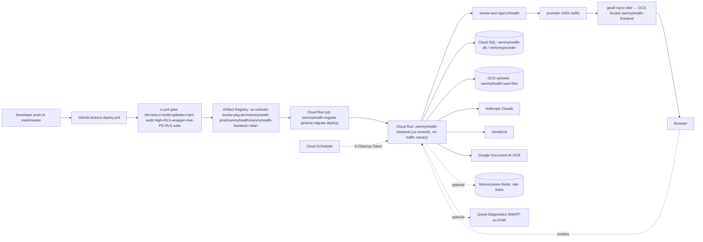

# RUNBOOK.md — OwnMyHealth Operator Reference

> **Audience**: on-call operator. Every command here is intended to run verbatim against
> production unless marked otherwise. Every non-trivial claim cites `file:line`.
> **Code anchor**: HEAD `fb2cd32` (2026-06-15). **Generated**: 2026-06-16.

## Required reading before generating

Before writing a single line, read:

1. [`_doc-quality.md`](../prompts/_doc-quality.md) — self-containedness, citation, TBD, cross-link, and format rules.
2. [`_verification-tools.md`](../prompts/_verification-tools.md) — Grep/Glob/Read cheat sheet.
3. [`_phi-inventory.md`](../prompts/_phi-inventory.md) — incident playbooks involving PHI must respect encryption + audit contracts.

This doc passes the five tests in `_doc-quality.md` (question-answering, path-and-line, snippet, diagram, reproducibility).

---

## 1. Quick reference

| Property | Value | Source |
|---|---|---|
| GCP project (prod + staging) | `ownmyhealth-prod` | `.github/workflows/deploy.yml:38`, `deploy-staging.yml:34` |
| Region | `us-central1` | `deploy.yml:39` |
| Prod backend service | `ownmyhealth-backend` (`--max-instances=3`) | `deploy.yml:40,189` |
| Prod backend URL | `https://api.ownmyhealth.io` | `deploy.yml:279` (post-promote probe) |
| Prod frontend URL | `https://app.ownmyhealth.io`, `https://ownmyhealth.io` | `backend/src/app.ts:65-68` (hardcoded CORS origins) |
| Frontend bucket | `ownmyhealth-frontend` | `deploy.yml:42` |
| Image repo | `us-central1-docker.pkg.dev/ownmyhealth-prod/ownmyhealth/ownmyhealth-backend:<sha>` | `deploy.yml:99-100` |
| Cloud SQL instance (connection name) | `ownmyhealth-prod:us-central1:ownmyhealth-db` | `deploy.yml:46`, `maintenance.yml:55` |
| Prod database name | `verifymyprovider` (per `CLAUDE.md`); `ownmyhealth` per `docs/STAGING.md:16` | see [§7 note](#db-name-note) |
| Migrate job | `ownmyhealth-migrate` (Cloud Run job) | `deploy.yml:43` |
| Maintenance job | `ownmyhealth-maintenance` (Cloud Run job) | `maintenance.yml:54` |
| Runtime | Node 22-alpine (digest-pinned), `EXPOSE 3001`, `CMD ["node","dist/app.js"]` | `backend/Dockerfile:15,81,93` |

---

## 2. Environments

| Property | Local | Staging | Prod |
|---|---|---|---|
| Branch | (any) | `staging` | `master` / `main` |
| Deploy trigger | manual (`npm run dev`) | push to `staging` → `deploy-staging.yml:4-5` | push to `master`/`main` → `deploy.yml:14-15` (canary → smoke → promote) |
| Frontend URL | `http://localhost:5173` | `https://staging.ownmyhealth.io` (`docs/STAGING.md:12`) | `https://app.ownmyhealth.io` / `https://ownmyhealth.io` (`app.ts:66-67`) |
| Backend URL | `http://localhost:3001` | `https://api-staging.ownmyhealth.io` (`deploy-staging.yml:94`) | `https://api.ownmyhealth.io` (`deploy.yml:279`) |
| GCP project | n/a | `ownmyhealth-prod` (`deploy-staging.yml:34`) | `ownmyhealth-prod` (`deploy.yml:38`) |
| Cloud Run service | n/a | `ownmyhealth-backend-staging` (`deploy-staging.yml:36`) | `ownmyhealth-backend` (`deploy.yml:40`, `--max-instances=3`) |
| Frontend bucket | n/a | `ownmyhealth-frontend-staging` (`deploy-staging.yml:38`) | `ownmyhealth-frontend` (`deploy.yml:42`) |
| Cloud SQL instance | local Postgres | `ownmyhealth-prod:us-central1:ownmyhealth-db`, DB `ownmyhealth_staging` (`docs/STAGING.md:16,83`) | `ownmyhealth-prod:us-central1:ownmyhealth-db` (`deploy.yml:46`) |
| `NODE_ENV` | `development` | `staging` (`docs/STAGING.md:53`) | `production` (`Dockerfile:53` + `deploy.yml:190`) |
| Database name | `ownmyhealth_dev` | `ownmyhealth_staging` | `verifymyprovider` / `ownmyhealth` (see [§7](#db-name-note)) |
| Service account | n/a | service runtime SA (resolved dynamically) | service runtime SA (resolved at deploy, `deploy.yml:125-127`) |
| Migrations run? | manual `npx prisma migrate dev` | **NOT yet** — no migrate step (`deploy-staging.yml:21-31`) | `ownmyhealth-migrate` Cloud Run job (`deploy.yml:106-161`) |

**Staging caveat**: `deploy-staging.yml:21-31` documents that the staging Cloud SQL instance, service,
and `DATABASE_URL` secret **do not exist yet** (verified via gcloud 2026-06-12), so staging has no
migrate step. When staging infra is provisioned, copy `deploy.yml`'s "Run database migrations" step.

---

## 3. Deployment topology



**Service list (prod)**:

| Component | Type | Identifier | Source |
|---|---|---|---|
| Backend API | Cloud Run service | `ownmyhealth-backend` | `deploy.yml:40` |
| DB migrations | Cloud Run job | `ownmyhealth-migrate` | `deploy.yml:43,139` |
| One-off data jobs | Cloud Run job | `ownmyhealth-maintenance` | `maintenance.yml:54` |
| Frontend SPA | GCS static bucket | `ownmyhealth-frontend` | `deploy.yml:42,342` |
| Database | Cloud SQL Postgres | `ownmyhealth-prod:us-central1:ownmyhealth-db` | `deploy.yml:46` |
| File uploads | GCS bucket | `ownmyhealth-user-files` | `config/index.ts:228` |
| Audit-cleanup trigger | Cloud Scheduler (optional) | `omh-audit-retention` | `docs/INFRA_REDIS_AND_SCHEDULER.md:97` |
| Rate-limit store | Memorystore Redis (optional) | `omh-ratelimit` | `docs/INFRA_REDIS_AND_SCHEDULER.md:22` |

---

## 4. Deploy: backend

### 4.1 Automatic (push to main/master)

`deploy.yml` triggers on push to `master` or `main` (`deploy.yml:14-15`). The **entire deploy is
gated on CI**: `deploy.yml` invokes `ci.yml` as a reusable workflow, and `build-and-stage` will not
run unless CI passes.

```yaml
# Source: .github/workflows/deploy.yml:57-66
  ci:
    uses: ./.github/workflows/ci.yml
    permissions:
      contents: read
  build-and-stage:
    needs: ci
```

`ci.yml` runs: frontend lint+test+build (`ci.yml:40-47`), backend lint+`test:ci`+build
(`ci.yml:79-96`), gitleaks secret scan (`ci.yml:123-127`), `npm audit --audit-level=high` on
frontend+backend (`ci.yml:138-143`), the RLS-wrapper guard (`ci.yml:148-149`), and the
**NOBYPASSRLS RLS-regression suite against a real Postgres** (`ci.yml:155-213`). Nothing builds or
ships unless all pass. `deploy-frontend` additionally has `needs: [ci, promote]` (`deploy.yml:301`).

**Pipeline stages** (job dependency graph):

```
ci ──► build-and-stage ──► smoke-test ──► promote ──► deploy-frontend
       (needs: ci)         (needs:         (needs:     (needs:
                            build-and-stage) [build-     [ci, promote])
                                            and-stage,
                                            smoke-test])
```

1. **build-and-stage** (`deploy.yml:65-210`): build+push image `:${{ github.sha }}` (`:99-104`);
   run the migrate job (`:106-161`); deploy a **no-traffic** tagged revision `staging-<short-sha>`
   at 0% traffic (`:163-191`).
2. **smoke-test** (`deploy.yml:216-242`): probe the tagged staging URL `/api/v1/health`, retrying 6×
   for cold-start, requires `200` with `"success":true`.
3. **promote** (`deploy.yml:252-294`): shift 100% traffic via `update-traffic --to-revisions=NEW=100`
   (`:271-274`), then probe `https://api.ownmyhealth.io/api/v1/health` 3× (`:276-286`), then remove the
   staging tag (`:288-294`).
4. **deploy-frontend** (`deploy.yml:300-344`): `npm run build` then `gsutil -m rsync -d -r dist/`.

### 4.2 Migrate-as-Cloud-Run-job (the migration step)

Migrations run as a dedicated Cloud Run **job** AFTER the image push and BEFORE the new revision is
staged — **not** at container boot (`Dockerfile:86-93` CMD is `node`-only).

```bash
# Source: .github/workflows/deploy.yml:139-161 (run as the service runtime SA)
gcloud run jobs deploy ownmyhealth-migrate \
  --image "$IMAGE" \
  --region us-central1 --project ownmyhealth-prod \
  --set-cloudsql-instances ownmyhealth-prod:us-central1:ownmyhealth-db \
  --set-secrets DATABASE_URL=DATABASE_URL:latest \
  --service-account "$RUNTIME_SA" \
  --command npx --args prisma,migrate,deploy \
  --max-retries 0 --task-timeout 10m --memory 512Mi
gcloud run jobs execute ownmyhealth-migrate --region us-central1 --project ownmyhealth-prod --wait
```

`jobs execute --wait` blocks and exits **nonzero** if the migration fails, which fails the deploy step
(`deploy.yml:152-161`). `--max-retries 0`: a migration is not safely re-run blindly — a human inspects
failures. **A failed migration fails the DEPLOY; the running service keeps serving the old revision.**

**Re-run the migrate job manually** (e.g. after fixing forward):

```bash
gcloud run jobs execute ownmyhealth-migrate --region us-central1 --project ownmyhealth-prod --wait
```

**Read the migrate job's execution logs**:

```bash
EXEC=$(gcloud run jobs executions list --job ownmyhealth-migrate \
  --region us-central1 --project ownmyhealth-prod --limit 1 --format='value(metadata.name)')
gcloud logging read \
  "resource.type=\"cloud_run_job\" AND resource.labels.job_name=\"ownmyhealth-migrate\" AND labels.\"run.googleapis.com/execution_name\"=\"$EXEC\"" \
  --project ownmyhealth-prod --limit 300 --freshness=1h --format='value(textPayload)' --order=asc
```

(Log-read shape mirrors `maintenance.yml:155-169`.)

### 4.3 Manual backend deploy (no git push)

```bash
# Build + push by SHA (matches deploy.yml:99-104)
IMAGE=us-central1-docker.pkg.dev/ownmyhealth-prod/ownmyhealth/ownmyhealth-backend:$(git rev-parse HEAD)
gcloud auth configure-docker us-central1-docker.pkg.dev --quiet
docker build -t "$IMAGE" backend/
docker push "$IMAGE"

# Run migrations first (see §4.2), then deploy no-traffic + promote
gcloud run deploy ownmyhealth-backend --image "$IMAGE" \
  --region us-central1 --project ownmyhealth-prod --platform managed \
  --no-traffic --max-instances=3 --update-env-vars=NODE_ENV=production --tag manual-$(git rev-parse --short HEAD)
# verify the tagged URL /api/v1/health, then:
NEW_REV=$(gcloud run services describe ownmyhealth-backend --region us-central1 \
  --project ownmyhealth-prod --format='value(status.latestCreatedRevisionName)')
gcloud run services update-traffic ownmyhealth-backend --region us-central1 \
  --project ownmyhealth-prod --to-revisions="$NEW_REV=100"
```

> **Always use `--update-env-vars` (NOT `--set-env-vars`)** for single-key changes — `--set-env-vars`
> replaces the whole env set and wipes out-of-band secrets (`deploy.yml:179-182`).

---

## 5. Deploy: frontend

### 5.1 Automatic
The `deploy-frontend` job (`deploy.yml:300-344`) runs after `ci` + `promote`: `npm ci`, `npm run build`
(with `VITE_API_URL=https://api.ownmyhealth.io/api/v1`), then `gsutil rsync`.

```bash
# Source: .github/workflows/deploy.yml:341-343
gsutil -m rsync -d -r dist/ gs://ownmyhealth-frontend/
gsutil setmeta -h "Cache-Control:no-cache, no-store, must-revalidate" gs://ownmyhealth-frontend/index.html
```

`rsync -d -r` uploads new/changed files first, then deletes destination-only objects — no 404 window
(`deploy.yml:333-340`). `index.html` is set to `no-cache` so the SPA picks up new hashed assets.

### 5.2 Manual
```bash
VITE_API_URL=https://api.ownmyhealth.io/api/v1 npm run build
gsutil -m rsync -d -r dist/ gs://ownmyhealth-frontend/
gsutil setmeta -h "Cache-Control:no-cache, no-store, must-revalidate" gs://ownmyhealth-frontend/index.html
```

---

## 6. Rollback

### 6.1 Backend (Cloud Run revision rollback)
```bash
# List revisions
gcloud run revisions list --service=ownmyhealth-backend --region=us-central1 --project=ownmyhealth-prod

# Pin 100% traffic to a specific prior revision (deterministic, named-revision op)
gcloud run services update-traffic ownmyhealth-backend \
  --region=us-central1 --project=ownmyhealth-prod \
  --to-revisions=ownmyhealth-backend-0000N-abc=100
```

The prod pipeline promotes via explicit `--to-revisions` (`deploy.yml:271-274`), so rollback is just
re-pinning to the previous named revision.

### 6.2 Pinning gotcha (load-bearing)
`gcloud run services update --update-env-vars=...` creates a new revision but keeps it at **0% traffic**
if the service was previously pinned with `--to-revisions=...` (which the prod pipeline always does,
`deploy.yml:244-251`). Detection signal: `latestReadyRevisionName ≠ latestCreatedRevisionName`.

```bash
gcloud run services describe ownmyhealth-backend --region=us-central1 --project=ownmyhealth-prod \
  --format='value(status.latestReadyRevisionName, status.latestCreatedRevisionName)'
# If they differ, traffic is pinned — flip it:
gcloud run services update-traffic ownmyhealth-backend --region=us-central1 --project=ownmyhealth-prod --to-latest
```

See project memory `cloud-run-env-update-pinning.md` (2026-04-17 `ANTHROPIC_BAA_ACTIVE` postmortem) and
`docs/INFRA_REDIS_AND_SCHEDULER.md:54-61`.

### 6.3 Frontend rollback
GCS has no built-in revision history. Roll back by re-building from a prior commit and re-running the
rsync in §5.2 (`git checkout <old-sha> -- src/`, rebuild, rsync). Or, if a prior `dist/` is preserved,
rsync it back. Because `index.html` is `no-cache` (`deploy.yml:343`), the rollback is visible to clients
on next load.

---

## 7. Database operations

<a name="db-name-note"></a>
**DB name note**: `CLAUDE.md` records the prod DB as `verifymyprovider`; `docs/STAGING.md:16` calls
it `ownmyhealth`. The Cloud SQL **instance** connection name is unambiguous —
`ownmyhealth-prod:us-central1:ownmyhealth-db` (`deploy.yml:46`). The migrate/maintenance jobs read the
DB name from the `DATABASE_URL` secret, so the operator never types it. Confirm the live name with:
`gcloud secrets versions access latest --secret=DATABASE_URL --project=ownmyhealth-prod | sed 's/:[^@]*@/:REDACTED@/'`
(redaction pattern from `docs/c-8-part-c-runbook.md:28-31`).

### 7.1 Connect to prod Cloud SQL from your laptop

```bash
# Option A: gcloud convenience connect (prompts for the DB user password)
gcloud sql connect ownmyhealth-db --database=verifymyprovider --user=postgres --project=ownmyhealth-prod

# Option B: Cloud SQL Auth Proxy (preferred for psql/Prisma) — instance connection name from deploy.yml:46
cloud-sql-proxy ownmyhealth-prod:us-central1:ownmyhealth-db --port 5433 &
psql "postgresql://postgres:<pw>@127.0.0.1:5433/verifymyprovider"
```

Get the connection string (password redacted) from Secret Manager:
```bash
gcloud secrets versions access latest --secret=DATABASE_URL --project=ownmyhealth-prod | sed 's/:[^@]*@/:REDACTED@/'
```

The app connects via the `pg` pool with `connectionTimeoutMillis: 30000` for the Auth Proxy
(`backend/src/services/database.ts:106-112`); pool `max` is env-tunable via `DATABASE_POOL_SIZE`
(default 10, `database.ts:108`).

### 7.2 Migration procedure (prod)
On Cloud Run, migrations run as the `ownmyhealth-migrate` Cloud Run job — see §4.2. They do **not**
run at container boot (`Dockerfile:86-93`). The legacy Railway target still boot-migrates via
`railway.toml:14` (`npx prisma migrate deploy && node dist/app.js`), an intentional divergence
(`railway.toml:9-13`).

To apply a new migration to prod, the normal path is to merge to `master` and let the pipeline run the
job. To apply manually, deploy+execute the migrate job (§4.2). There are 32 migrations as of HEAD
(`backend/prisma/migrations/`; newest `20260615_provider_consent_immutable_audit_insert_check`).

### 7.3 One-time maintenance / backfill jobs
These re-encrypt or backfill PHI and **cannot run from a laptop** — they need the prod
`PHI_ENCRYPTION_KEY` so re-encrypted PHI is decryptable by the live service
(`maintenance.yml:3-12`). Run them via `.github/workflows/maintenance.yml` (workflow_dispatch),
which clones the live service's env + Secret Manager mounts and runs the same image as a Cloud Run job
(`ownmyhealth-maintenance`). **Dry-run is the default** (`apply=false`, `maintenance.yml:30-34`).

| Task input (`maintenance.yml:26-29`) | Entrypoint (`maintenance.yml:81-83`) | npm script | Purpose |
|---|---|---|---|
| `consolidate-biomarkers` | `dist/maintenance/consolidateBiomarkerSeries.js` | `consolidate:biomarkers` (`package.json:18`) | Biomarker consolidation/dedupe |
| `backfill-goal-values` (M4) | `dist/maintenance/backfillGoalValues.js` | `backfill:goal-values` (`package.json:19`) | Encrypt legacy plaintext goal numeric values |
| `backfill-userfile-filenames` (L24) | `dist/maintenance/backfillUserFileNames.js` | `backfill:userfile-names` (`package.json:20`) | Re-encrypt legacy `user_files.original_filename` |

Run: GitHub → Actions → "Run maintenance job" → pick task, `apply=false` for a DRY RUN, then re-run
with `apply=true`. Optionally scope to one user via `only_user` (`maintenance.yml:35-39`).

> **OPEN OPS ITEM (L24 / OF-03)**: the `backfill-userfile-filenames` re-encrypt backfill **has NOT yet
> been run in prod**. Legacy `user_files.original_filename` rows are still plaintext. Follow §7.3.1
> below — the drop-side changeset is prepared and waiting in **PR #227** (self-guarded migration
> `20260711_drop_userfile_plaintext_filename`; merge only after steps 1–3 below are complete).

#### 7.3.1 L24 filename backfill — run procedure + evidence record (OF-03)

Prereq: the currently-serving prod image must still carry
`dist/maintenance/backfillUserFileNames.js` (any image built BEFORE PR #227 merges — the job is
retired by that PR because it cannot compile against the post-drop schema).

Run each step via GitHub → Actions → **Run maintenance job** → task `backfill-userfile-filenames`.
Fill in the evidence table as you go; this table is the OF-03 closure record.

| # | Step | Expected | Evidence (fill in) |
|---|------|----------|--------------------|
| 1 | Dry run (`apply=false`) | `DRY RUN — N user(s), M file row(s) to encrypt` | run link: ____ · N=____ · M=____ |
| 2 | Apply (`apply=true`) | `APPLIED — N user(s), M file row(s) encrypted` (same N/M as step 1) | run link: ____ · N=____ · M=____ |
| 3 | Verification dry run (`apply=false`) | `DRY RUN — 0 user(s), 0 file row(s) to encrypt` (idempotency = proof) | run link: ____ |
| 4 | Mark PR #227 ready + merge | Deploy's migrate job applies `20260711_drop_userfile_plaintext_filename` cleanly | merge commit: ____ · deploy run: ____ |
| 5 | Post-deploy check | `SELECT column_name FROM information_schema.columns WHERE table_name='user_files' AND column_name LIKE 'original%';` returns ONLY `original_filename_encrypted` | date/operator: ____ |
| 6 | Close the ledger entry | [`OPEN_FINDINGS.md`](./OPEN_FINDINGS.md) OF-03 moved to Closed with this table linked | commit: ____ |

**If the guard trips at step 4** (deploy's migrate job fails with *"Refusing to drop
user_files.original_filename: N row(s) still hold an un-backfilled plaintext filename"*): new legacy
rows appeared between step 3 and the deploy — re-run steps 1–3, then recover the failed migration
state before redeploying:

```bash
# via Cloud SQL Auth Proxy with prod DATABASE_URL (§7.1)
npx prisma migrate resolve --rolled-back 20260711_drop_userfile_plaintext_filename
```

The guard is a data-loss backstop, not the workflow — the running service is untouched when it
fires (migrate job fails the DEPLOY, traffic stays on the current revision, §4).

### 7.4 PHI-aware query warnings
Most PHI columns are AES-256-GCM ciphertext (14 models / 39 `*Encrypted` columns,
`backend/src/services/encryption.ts:476-562`). A raw `SELECT` returns **ciphertext, not plaintext** —
that is the intended at-rest state. **Do not write decrypted PHI to a query result file, a ticket, or
a log.** RLS is FORCED on all 19 RLS tables (`assertRLSForced`, `database.ts:270-291`); when connected
as a `NOBYPASSRLS` role you must `SET LOCAL app.current_user_id` (or query as admin) to see rows. The
audit_logs DELETE policy DB-enforces 7-year retention even for admins
(migration `20260613_force_rls_and_audit_retention`). See
[`DATA_MODEL.md`](./DATA_MODEL.md) and [`PHI_TAXONOMY.md`](./PHI_TAXONOMY.md).

---

## 8. Secret management

Secrets live in **GCP Secret Manager** in project `ownmyhealth-prod`, mounted into the Cloud Run
service out-of-band (the deploy pipeline never sets them — it uses `--update-env-vars` for `NODE_ENV`
only, `deploy.yml:179-182`). The migrate job mounts `DATABASE_URL=DATABASE_URL:latest`
(`deploy.yml:144`).

### 8.1 List + update a secret
```bash
# List all secrets
gcloud secrets list --project=ownmyhealth-prod

# Add a new version (rotation)
echo -n "<new-value>" | gcloud secrets versions add jwt-access-secret --project=ownmyhealth-prod --data-file=-

# Point the service at the latest version (then flip traffic — pinning gotcha §6.2)
gcloud run services update ownmyhealth-backend --region=us-central1 --project=ownmyhealth-prod \
  --update-secrets=JWT_ACCESS_SECRET=jwt-access-secret:latest,JWT_REFRESH_SECRET=jwt-refresh-secret:latest
gcloud run services update-traffic ownmyhealth-backend --region=us-central1 --project=ownmyhealth-prod --to-latest
```

### 8.2 Secret inventory

| Secret (env var) | Required | Consumer (file:line) | Rotation notes |
|---|---|---|---|
| `JWT_ACCESS_SECRET` | yes | `config/index.ts:120` (`requireEnv`); min 32 chars + blocklist `:324,338` | Rotating invalidates all access JWTs (signature mismatch). Boot hard-fails if missing. |
| `JWT_REFRESH_SECRET` | yes | `config/index.ts:124`; min 32 + blocklist `:330,345` | Rotating invalidates all refresh tokens → forces re-login. Boot hard-fails if missing. |
| `PHI_ENCRYPTION_KEY` | prod/staging | `config/index.ts:428,436,439,446,459`; `encryption.ts:182` | 64 hex chars. **Load-bearing — see §8.3.** |
| `AUDIT_LOG_SALT` | all envs | `config/index.ts:113`, hard-fail if `<16` chars `:358` | **Load-bearing — see §8.4.** |
| `ANTHROPIC_API_KEY` | optional (feature) | `anthropicClient.ts:49,68` | Rotating disables/re-enables Claude. In prod, setting it requires `ANTHROPIC_BAA_ACTIVE=true` or boot fails (`config/index.ts:381-394`). |
| `SENDGRID_API_KEY` | optional (feature) | `config/index.ts:209-210` | Empty disables email. |
| `REDIS_URL` | optional | `config/index.ts:186` | Switches rate-limit store to Memorystore — see §12. |
| `AUDIT_CLEANUP_TOKEN` | optional | `config/index.ts:196`; `internalRoutes.ts:43` | Enables Cloud Scheduler cleanup endpoint — see §11. |
| `QUEST_FHIR_CLIENT_ID` | optional | `config/index.ts:266` | Quest SMART-on-FHIR — feature off unless set. |
| `QUEST_FHIR_CLIENT_SECRET` | optional | `config/index.ts:267` | |
| `QUEST_FHIR_BASE_URL` | optional | `config/index.ts:269` | default `https://api.questdiagnostics.com/fhir/r4` |
| `QUEST_FHIR_REDIRECT_URI` | optional | `config/index.ts:271` | |
| `QUEST_FHIR_AUTH_HOSTS` | optional | `config/index.ts:280` | SSRF allowlist (comma-separated). |
| `DATABASE_URL` | prod/staging | `config/index.ts:427`; `database.ts:58` | Cloud SQL connection; also the migrate job's only env (`deploy.yml:144`). |

Full env matrix: [`ENV_VARS.md`](./ENV_VARS.md).

### 8.3 Rotating `PHI_ENCRYPTION_KEY` (end-to-end)
PHI is encrypted with **per-user keys derived from `PHI_ENCRYPTION_KEY` via PBKDF2-SHA512**
(`encryption.ts:182`; per-user salts). Rotating the master key changes every derived key, so:

1. **Do not** simply rotate and redeploy — every existing `*Encrypted` column would become
   undecryptable and all PHI reads would fail.
2. Stand up the new key alongside the old; **re-encrypt all PHI**: decrypt each row with the old
   derived key and re-encrypt with the new derived key. There is no in-repo all-tables re-encryption
   job today (the maintenance jobs in §7.3 re-encrypt specific columns, not the whole corpus).
   `TBD (external: a full PHI re-encryption migration must be authored before a PHI_ENCRYPTION_KEY
   rotation; track in SECURITY_STATUS.md and add a maintenance entrypoint under
   backend/src/maintenance/)`.
3. Only after re-encryption completes and is verified, cut `PHI_ENCRYPTION_KEY` to the new version and
   redeploy.

### 8.4 Why rotating `AUDIT_LOG_SALT` is dangerous
`AUDIT_LOG_SALT` is hard-required and the app boot **hard-fails if it's unset or `<16` chars**
(`config/index.ts:113,358`). It is used to derive the audit-log PHI encryption material. **Rotating it
renders all existing audit-log PHI snapshots undecryptable** (the `previousValueEncrypted` /
`newValueEncrypted` / `metadataEncrypted` columns, `encryption.ts:528-530`). For HIPAA 7-year
retention this is data loss.

To recover the live salt (e.g. matching a staging cutover), extract it from
`system_config.audit_encryption_salt` — the extraction path is documented in
`docs/STAGING.md` / `docs/c-8-part-c-runbook.md`. Treat `AUDIT_LOG_SALT` as immutable for the life of
the audit corpus; if it must change, the audit history encrypted under the old salt must be migrated
first.

### 8.5 Force logout all users (cross-instance)
Rotating JWT secrets is no longer the only lever, and **`DELETE FROM sessions` alone does NOT kill
in-flight access JWTs across Cloud Run replicas** (the in-memory blacklist is per-instance,
`authService.ts:142-154`). Two DB-backed, cross-instance mechanisms exist:

- **`users.tokens_valid_after`** (migration `20260606000002_add_tokens_valid_after`): stamped by
  `revokeAllUserTokens` (`authService.ts:648-651`); `authenticate` rejects any access JWT whose `iat`
  predates it on every replica (`auth.ts:106-108`).
- **`revoked_access_tokens`** (migration `20260613_revoked_access_tokens`): single-device cross-instance
  revoke by `jti`.

Both are read in one combined cached lookup (`fetchUserRevocationState`, `authService.ts:259-278`, 15s
TTL). To force-logout-all a single user, stamp `tokens_valid_after`:

```sql
-- Stamp now() so all currently-issued access tokens for the user are stale on every replica.
-- (Application path: logout-all / password-change call revokeAllUserTokens automatically.)
UPDATE users SET tokens_valid_after = now() WHERE id = '<user-uuid>';
```

The combined cache means this propagates within ≤15s on instances that have not been invalidated
directly (`authService.ts:167,334-336`).

---

## 9. Log access + filtering

Logs land in Cloud Logging under `resource.type="cloud_run_revision"`. The prod logger **strips query
strings** so single-use `?token=...` reset/verify links never persist
(`app.ts:222-245`, `PROD_LOG_FORMAT` at `app.ts:236-237`; PHI sanitizer in `utils/phiRedaction.ts`).

```bash
# Auth failures in last hour
gcloud logging read '
  resource.type="cloud_run_revision"
  resource.labels.service_name="ownmyhealth-backend"
  jsonPayload.action="LOGIN_FAILED"
' --project=ownmyhealth-prod --freshness=1h --limit=100

# Rate-limit hits
gcloud logging read '
  resource.type="cloud_run_revision"
  resource.labels.service_name="ownmyhealth-backend"
  jsonPayload.code="RATE_LIMIT_EXCEEDED"
' --project=ownmyhealth-prod --freshness=1d --limit=100

# RLS-denied requests in the LAST HOUR (surface as 404 NOT_FOUND with an rls tag if logged)
gcloud logging read '
  resource.type="cloud_run_revision"
  resource.labels.service_name="ownmyhealth-backend"
  jsonPayload.rls_denied=true
' --project=ownmyhealth-prod --freshness=1h --limit=100

# Tail recent service logs (any text)
gcloud run services logs read ownmyhealth-backend --region=us-central1 --project=ownmyhealth-prod --limit=200
```

---

## 10. Schedulers

Three in-process schedulers boot from `startServer()` (`app.ts:342-349`) and stop in
`gracefulShutdown` (`app.ts:384-386`). Plus the optional Cloud-Scheduler-driven audit cleanup.

| Job | File:line | Cadence | Effect |
|---|---|---|---|
| Audit log retention cleanup | `auditLog.ts:669` (`startAuditCleanup`) | daily (24h `setInterval`, `auditLog.ts:688,697`) — **DISABLED in-process when `AUDIT_CLEANUP_TOKEN` set** (`auditLog.ts:674-679`) | Delete `audit_logs` rows older than `RETENTION_DAYS = 2555` (~7y) via `cleanupOldLogs` (`auditLog.ts:10,690`) |
| Session cleanup | `authService.ts:1792` (`startSessionCleanup`) | every 10 min (`authService.ts:1801,1808`) | `sweepRevokedTokens()` (evict expired in-memory blacklist, `authService.ts:239,1804`) + `cleanupExpiredSessions()` deletes expired `sessions` (`authService.ts:1805`) |
| Email engagement scheduler | `schedulers/emailScheduler.ts:462` (`startEmailScheduler`) | hourly tick (`emailScheduler.ts:464-466`) | Mon 08:00 UTC weekly summary; once-per-UTC-day goal-reminder + plan-expiry sweeps (`emailScheduler.ts:440-454`) |
| Audit cleanup via Cloud Scheduler | `internalRoutes.ts:40` (`POST /audit-cleanup`) | external (Cloud Scheduler) when `AUDIT_CLEANUP_TOKEN` set | Same retention delete, triggered by `X-Cleanup-Token` shared secret (`internalRoutes.ts:54-65`) |
| RLS wrapper sanity check | `scripts/check-rls-wrappers.sh` | manual / CI (`ci.yml:148-149`) | Fails build if a controller/service calls bare `prisma.<model>` instead of `tx` inside a `withRLSContext` callback (`check-rls-wrappers.sh:3-15`) |

```ts
// Source: backend/src/app.ts:342-349 — all three booted at startup
    startSessionCleanup();
    // Start audit log cleanup scheduler (runs daily)
    startAuditCleanup(getPrismaClient());
    // Start engagement email scheduler (weekly summary + goal reminders on
    // Mondays 8am UTC, daily plan-expiring sweep).
    startEmailScheduler();
```

> **Scale-to-zero caveat**: the 24h in-process audit interval rarely fires on Cloud Run because the
> instance is reaped before 24h (`auditLog.ts:670-673`). That is exactly why the Cloud Scheduler path
> (§11) exists — provision it in prod so retention actually runs.

---

## 11. Cloud Scheduler / internal endpoint

When `AUDIT_CLEANUP_TOKEN` is set: the in-process daily cleanup is disabled (`auditLog.ts:674-679`,
logs `Audit retention cleanup delegated to Cloud Scheduler; in-process interval disabled`) and Cloud
Scheduler POSTs to `/api/v1/internal/audit-cleanup` with the `X-Cleanup-Token` header.

```ts
// Source: backend/src/routes/internalRoutes.ts:43-62
    const expected = config.scheduler.auditCleanupToken;
    if (!expected) {
      res.status(404).json({ success: false, error: { code: 'NOT_FOUND', message: 'Not found' } });
      return;
    }
    const provided = req.get('X-Cleanup-Token') || '';
    if (!tokenMatches(provided, expected)) {       // constant-time compare, internalRoutes.ts:27-33
      res.status(401).json({ success: false, error: { code: 'UNAUTHORIZED', message: 'Unauthorized' } });
      return;
    }
```

**Auth + return codes**:
- Shared-secret in `X-Cleanup-Token`, constant-time compared (`internalRoutes.ts:27-33`). CSRF-exempt
  (a scheduler can't carry the CSRF cookie, `internalRoutes.ts:6-8`).
- **404** when `AUDIT_CLEANUP_TOKEN` is unset — feature dormant, endpoint hidden (`internalRoutes.ts:45-52`).
- **401** on bad/missing token (`internalRoutes.ts:55-62`).
- **200** `{ "success": true, "data": { "deletedCount": N } }` on success (`internalRoutes.ts:70`).

**Provisioning** (full runbook: `docs/INFRA_REDIS_AND_SCHEDULER.md:71-114`):
```bash
TOKEN=$(openssl rand -base64 32)
gcloud run services update ownmyhealth-backend --project=ownmyhealth-prod --region=us-central1 \
  --update-env-vars=AUDIT_CLEANUP_TOKEN="$TOKEN"
gcloud run services update-traffic ownmyhealth-backend --project=ownmyhealth-prod --region=us-central1 --to-latest
API_URL=$(gcloud run services describe ownmyhealth-backend --project=ownmyhealth-prod --region=us-central1 --format="value(status.url)")
gcloud scheduler jobs create http omh-audit-retention --project=ownmyhealth-prod --location=us-central1 \
  --schedule="17 4 * * *" --uri="${API_URL}/api/v1/internal/audit-cleanup" \
  --http-method=POST --headers="X-Cleanup-Token=${TOKEN}" --attempt-deadline=120s
```

**Verify it's firing**:
```bash
gcloud scheduler jobs run omh-audit-retention --project=ownmyhealth-prod --location=us-central1
# Expect 200 + an "Audit retention cleanup ran via scheduler" log line. 401 = secret mismatch;
# 404 = AUDIT_CLEANUP_TOKEN not on the live revision (check the traffic flip).
```

---

## 12. Redis rate-limit store

There are **8 named rate limiters** (`backend/src/middleware/rateLimiter.ts`). Setting `REDIS_URL`
(`config/index.ts:186`) switches them from per-instance `MemoryStore` to a shared Memorystore Redis
store (`rateLimitStore.ts`). On boot you'll see `✓ Rate limiters using shared Redis store`
(`docs/INFRA_REDIS_AND_SCHEDULER.md:64`).

- **Fallback when unset/unreachable**: limiters fall back to per-instance in-memory counters
  (`docs/INFRA_REDIS_AND_SCHEDULER.md:119-120`). The `aiSpendGuard` shares the same store concept and
  **fails closed with 503** on a shared-store (Redis) error rather than uncapping
  (`aiSpendGuard.ts:42-51`).
- **Per-instance dilution caveat**: with the in-memory store, the effective ceiling under autoscale is
  N×budget. The service is pinned `--max-instances=3` (`deploy.yml:189`, `deploy-staging.yml:88`)
  precisely to bound that dilution. Raising `--max-instances` requires moving to Redis first
  (`deploy.yml:171-174`).

**Provisioning** (full runbook: `docs/INFRA_REDIS_AND_SCHEDULER.md:18-67`): create the Memorystore
instance (`omh-ratelimit`), a Serverless VPC connector (`omh-connector`), then:
```bash
gcloud run services update ownmyhealth-backend --project=ownmyhealth-prod --region=us-central1 \
  --vpc-connector=omh-connector --update-env-vars=REDIS_URL=redis://10.0.0.3:6379
gcloud run services update-traffic ownmyhealth-backend --project=ownmyhealth-prod --region=us-central1 --to-latest
```

---

## 13. Incident playbooks

> Steps marked **(derived)** are inferred from the architecture, not from a recorded incident.
> Steps marked **(proven)** come from a recorded postmortem in repo/memory.

### Playbook: Auth outage
**Symptoms**: every request returns 401 across users; logs show `JsonWebTokenError: invalid signature`.
**Likely cause**: `JWT_ACCESS_SECRET` / `JWT_REFRESH_SECRET` rotated but the revision didn't update, or a
new revision didn't get traffic (pinning gotcha §6.2). Both go through `requireEnv()`
(`config/index.ts:120,124`) so a *missing* secret is a boot crash-loop — a different signal from
`invalid signature`.
**Diagnosis**:
1. `gcloud run services describe ownmyhealth-backend --region=us-central1 --project=ownmyhealth-prod --format='value(status.latestReadyRevisionName, status.latestCreatedRevisionName)'`
2. If `latestReady ≠ latestCreated`, traffic is pinned → fix via `update-traffic` (§6.2).
3. Grep logs for `invalid signature`; correlate with last secret update.
**Remediation**:
1. `gcloud run services update ownmyhealth-backend --region=us-central1 --project=ownmyhealth-prod --update-secrets=JWT_ACCESS_SECRET=jwt-access-secret:latest,JWT_REFRESH_SECRET=jwt-refresh-secret:latest`
2. `gcloud run services update-traffic ownmyhealth-backend --region=us-central1 --project=ownmyhealth-prod --to-latest`
3. Force logout-all if tokens are compromised — stamp `tokens_valid_after` (§8.5), **not** just
   `DELETE FROM sessions` (which leaves in-flight access JWTs valid cross-instance, `authService.ts:142-154`).
**Cross-link**: [`ERROR_RECOVERY.md`](./ERROR_RECOVERY.md).

### Playbook: DB outage (Cloud SQL unavailable / pool exhausted)
**Symptoms**: `/health` returns 503 (`app.ts:301-312`); requests time out or 500.
**Likely cause**: Cloud SQL down, or pool exhausted (default `max=10`, `database.ts:108`;
`connectionTimeoutMillis=30000`, `database.ts:110`). **(derived)**
**Diagnosis**:
1. `curl -s https://api.ownmyhealth.io/health` — `{ "status": "unhealthy", "checks": { "database": "disconnected" } }` confirms DB.
2. `gcloud sql instances describe ownmyhealth-db --project=ownmyhealth-prod` — check `state`.
3. Logs for `connection terminated` / `timeout exceeded`.
**Remediation**:
1. If Cloud SQL is down/restarting, wait for it to return; the app boot **refuses to start without DB**
   (`database.ts:151-168`) so a fresh revision won't come up until DB is back.
2. If pool-exhausted: raise `DATABASE_POOL_SIZE` (`database.ts:108`) via `--update-env-vars` + flip
   traffic (§6.2), or scale Cloud SQL. **(derived)**

### Playbook: Claude API outage or BAA misconfiguration
**Symptoms**: AI features (chat, biomarker guidance, SBC/expense extraction) fail; or in prod the
container **won't boot** with a BAA error.
**Likely cause**: Anthropic outage, bad `ANTHROPIC_API_KEY`, or `ANTHROPIC_API_KEY` set in prod
**without** `ANTHROPIC_BAA_ACTIVE=true` → boot hard-fail (`config/index.ts:381-394`).
**Diagnosis**:
1. If boot crash-loops: logs show the BAA gate message — set `ANTHROPIC_BAA_ACTIVE=true` (only if a
   signed BAA is actually in place) **or** unset `ANTHROPIC_API_KEY` to disable Claude.
2. If runtime-only: AI endpoints error but `/health` is 200 → upstream Anthropic issue.
**Remediation**:
1. Toggle the BAA flag / key via `--update-env-vars` + traffic flip (§6.2).
2. The 8 AI mount points sit behind `aiSpendGuard` and the `aiLimiter`; an Anthropic outage degrades
   only those routes, not the rest of the app. **(derived)**
**Cross-link**: project memory `cloud-run-env-update-pinning.md` (the 2026-04-17 `ANTHROPIC_BAA_ACTIVE`
pinning postmortem — flipping the flag created a 0%-traffic revision). **(proven)**

### Playbook: AI spend budget exhausted
**Symptoms**: AI endpoints return **503 SERVICE_UNAVAILABLE** for all users (global) or one user.
**Likely cause**: daily spend hit `AI_DAILY_BUDGET_USD` (default 50, `config/index.ts:256`) or
`AI_USER_DAILY_BUDGET_USD` (default 5, `config/index.ts:257`). `aiSpendGuard` fails **closed** with 503
(`aiSpendGuard.ts:60-67`).
**Diagnosis**: logs for the 503 on the 8 guarded routes (`/ai/chat`, biomarker `/guidance`,
`/expenses/analyze`, insurance `reanalyze`+`upload-sbc`, 3 upload routes). The guard reserves a fixed
`$0.05` per call (`aiCostTracker.ts:67`); real cost added post-call by `trackAIUsage`.
**Remediation**:
1. If legitimate load: raise the budget via `--update-env-vars=AI_DAILY_BUDGET_USD=<n>` + traffic flip
   (§6.2). `0` disables that scope (`config/index.ts:249`).
2. If abuse: identify the user from logs; the per-user cap already contains blast radius.
3. The per-day accumulator resets at UTC midnight (`aiCostTracker.ts:130-137`). **(derived)**

### Playbook: GCS outage or bucket-permission error
**Symptoms**: uploads/downloads fail; signed-URL generation errors; or in prod the container **won't
boot** ("GCS_BUCKET_NAME must be set").
**Likely cause**: GCS outage, SA lost `storage.objectAdmin` on `ownmyhealth-user-files`, or
`GCS_BUCKET_NAME` unset in prod (hard-fail `config/index.ts:480` — the F-28 boot guard behind the
2026-06-02 outage).
**Diagnosis**:
1. Boot crash → confirm `GCS_BUCKET_NAME=ownmyhealth-user-files` is set
   (`gcloud run services describe ... --format='value(spec.template.spec.containers[0].env)'`).
2. Runtime errors → check SA IAM on the bucket and GCS status.
**Remediation**: set the bucket env var + traffic flip (§6.2); or re-grant the runtime SA bucket access.
**Cross-link**: project memory `ownmyhealth-prod-deploy-broken.md` (the GCS_BUCKET_NAME boot-guard
outage). **(proven)**

### Playbook: Quest FHIR / lab sync outage or OAuth token failure
**Symptoms**: lab sync fails; `LabConnection.syncStatus='error'`; SMART token refresh fails.
**Likely cause**: Quest/SMART endpoint down, the patient's refresh token revoked/expired, or a
multi-instance PKCE-callback drop (L-39: the PKCE verifier map is per-process, `smartAuth.ts:374-386`).
**Diagnosis**:
1. Logs for `SYNC_FAILED` / `CONNECT_FAILED` (`labSyncService.ts:422-427`, `fhirController.ts:116-129`).
2. Token auto-refreshes within 60s of expiry (`labSyncService.ts:230-254`); a hard failure means the
   refresh token itself is dead → the patient must re-connect.
**Remediation**:
1. Transient upstream issue: retry the sync (it's idempotent, deduped on `fhir:{provider}:{obs.id}`,
   `labSyncService.ts:280-330`).
2. Dead OAuth token: instruct the patient to re-connect (re-runs PKCE). **(derived)**
3. Intermittent connect failures at >1 instance: pin `--max-instances=1` for FHIR connect until a
   shared verifier store exists (documented mitigation, `smartAuth.ts:374-386`). **(derived)**

### Playbook: Redis / Memorystore unavailable
**Symptoms**: AI routes 503 (spend guard fails closed on store error); rate limits behave per-instance.
**Likely cause**: Memorystore down or VPC connector broken while `REDIS_URL` is set.
**Diagnosis**: logs for the spend-guard 503 (`aiSpendGuard.ts:42-51`) and missing
`✓ Rate limiters using shared Redis store`.
**Remediation**: rate limiters degrade gracefully to per-instance counters; if Redis is down hard,
unset `REDIS_URL` + `--to-latest` to drop back to in-memory and stop the spend-guard 503s
(`docs/INFRA_REDIS_AND_SCHEDULER.md:119-120`). Restore Redis, re-set `REDIS_URL` when healthy. §12.

### Playbook: PHI leak in logs
**Symptoms**: PHI (name, value, member ID, reset `?token=`) found in Cloud Logging.
**Containment + remediation**:
1. Identify scope: `gcloud logging read` filtered to the offending field; note time window + record IDs.
2. The prod logger already strips query strings and uses `utils/phiRedaction.ts`
   (`app.ts:222-245`) — a leak means a new log call bypassed the sanitizer. Patch the call site to route
   through the sanitizer, ship, and deploy.
3. If reset/verify tokens leaked: those are single-use and short-lived, but force-rotate affected users
   (stamp `tokens_valid_after`, §8.5) and invalidate pending reset tokens.
4. Delete the offending log entries if Cloud Logging retention/policy permits; record the incident in
   the audit trail (`auditService`); follow HIPAA breach-assessment in
   [`HIPAA_CHECKLIST.md`](./HIPAA_CHECKLIST.md). **(derived)**

### Playbook: Rate-limit abuse / DDoS
**Symptoms**: spike in `RATE_LIMIT_EXCEEDED` (`jsonPayload.code`), elevated 429s, instance saturation.
**Diagnosis**: the rate-limit log filter in §9; correlate source IPs (`trust proxy` is set,
`app.ts:120`, so `req.ip` is the real client).
**Remediation**:
1. With `REDIS_URL` set, limits hold globally; without it they're per-instance (×3). Provision Redis
   (§12) if not already. **(derived)**
2. For an L7 flood, add a Cloud Armor policy / WAF in front of Cloud Run.
   `TBD (external: Cloud Armor is not configured in-repo; set up in GCP Console project ownmyhealth-prod)`.

### Playbook: Runaway / failed migration
**Symptoms**: a deploy fails at the "Run database migrations" step; the **OLD revision keeps serving**.
**Key fact**: migrations run as the `ownmyhealth-migrate` Cloud Run job with `--max-retries 0` and
`jobs execute --wait` (`deploy.yml:139-161`). A failed migration **aborts the DEPLOY** (the step exits
nonzero) and **does not crash-loop container boot** (boot is `node`-only, `Dockerfile:93`). The
playbook is "the deploy halted before staging a new revision," NOT "the service is down."
**Diagnosis**: read the migrate-job execution logs (§4.2 last block). Identify whether the migration
partially applied (Prisma tracks applied migrations in `_prisma_migrations`).
**Remediation**:
1. Fix the migration forward (the failing migration may be half-applied — inspect `_prisma_migrations`
   and the affected tables via §7.1).
2. Re-run the migrate job manually: `gcloud run jobs execute ownmyhealth-migrate --region us-central1 --project ownmyhealth-prod --wait`.
3. Once the job is green, re-run the deploy (push or `workflow_dispatch`). The old revision served
   throughout. **(derived from deploy.yml architecture)**

### Playbook: Env-var update silently held back by an explicit revision pin
**Symptoms**: you ran `gcloud run services update --update-env-vars=...`, it "succeeded," but the change
isn't live.
**Cause**: the prod pipeline pins traffic with `--to-revisions` (`deploy.yml:271`), so `services update`
creates a new revision at **0% traffic**.
**Detection + fix**: §6.2 — `latestReady ≠ latestCreated` → `update-traffic --to-latest` (or
`--to-revisions=NEW=100`). **(proven** — project memory `cloud-run-env-update-pinning.md`, 2026-04-17.)

---

## 14. Smoke test after deploy

The pipeline's own smoke-test probes `/api/v1/health` 6× with backoff (`deploy.yml:216-242`) and the
post-promote probe hits prod `/api/v1/health` 3× (`deploy.yml:276-286`). Run these manually after any
out-of-band change:

```bash
# 1. Docker/monitoring health (exercises Cloud SQL connectivity)
curl -s https://api.ownmyhealth.io/health
# → { "status": "healthy", "checks": { "database": "connected" } }   (app.ts:301-312)

# 2. Legacy DB health
curl -s https://api.ownmyhealth.io/api/health/db
# → { "success": true, "data": { "connected": true, ... } }          (app.ts:318-324)

# 3. API health (what the pipeline checks)
curl -s https://api.ownmyhealth.io/api/v1/health
# → { "success": true, ... }                                          (deploy.yml:222-241)
```

**Critical-path manual check** (register → login → create biomarker): register a throwaway account,
log in (expect `200` + `access`/`refresh`/`csrf_token` cookies), then `POST /api/v1/biomarkers` with the
CSRF header and confirm it returns the created row. Health endpoints alone don't exercise auth/RLS/PHI
encryption — the pipeline deliberately excludes authed tests (`deploy.yml:213-215`).

---

## 15. Runbook maintenance

Update this doc when any of these change: a workflow `env:` block (`deploy.yml`, `deploy-staging.yml`,
`maintenance.yml`), a scheduler cadence (`auditLog.ts`, `authService.ts`, `emailScheduler.ts`), a
secret name, a migration that adds/changes a job, or a recorded incident yields a new playbook. Re-verify
the §13 Acceptance Questions quarterly per [`_doc-quality.md`](../prompts/_doc-quality.md). Treat doc
drift as a bug — it produces wrong Claude Project answers.

---

## Acceptance self-answers (verified from this doc alone)

1. **Roll back a Cloud Run revision** → §6.1: `gcloud run services update-traffic ownmyhealth-backend --region=us-central1 --project=ownmyhealth-prod --to-revisions=ownmyhealth-backend-0000N-abc=100`.
2. **Env-var update not taking effect** → §6.2 pinning gotcha: `services update` makes a 0%-traffic revision when traffic is pinned with `--to-revisions`; `latestReady ≠ latestCreated`; fix with `update-traffic --to-latest`.
3. **Audit cleanup cadence/effect/when disabled** → §10: daily (24h), deletes `audit_logs` > 2555 days (~7y); in-process disabled when `AUDIT_CLEANUP_TOKEN` is set (Cloud Scheduler takes over, §11).
4. **Connect to prod Cloud SQL from laptop** → §7.1: `gcloud sql connect ownmyhealth-db ...` or Cloud SQL Auth Proxy on `ownmyhealth-prod:us-central1:ownmyhealth-db`.
5. **RLS-wrapper validation script** → §10 + §4.1: `scripts/check-rls-wrappers.sh` (run in `ci.yml:148-149`).
6. **Staging vs prod trigger + canary** → §2/§4.1: staging = push `staging` → 100%; prod = push `master`/`main` → ci → build no-traffic canary → smoke-test → promote 100% → frontend.
7. **Rotate `PHI_ENCRYPTION_KEY` / danger of `AUDIT_LOG_SALT`** → §8.3/§8.4: re-encrypt all PHI before cutover (per-user PBKDF2 keys); rotating the audit salt makes existing audit PHI undecryptable + boot hard-fails if unset/short.
8. **Where secrets live + update one** → §8.1/§8.2: GCP Secret Manager; `--update-secrets=JWT_ACCESS_SECRET=jwt-access-secret:latest,JWT_REFRESH_SECRET=jwt-refresh-secret:latest` + traffic flip.
9. **Smoke test + endpoints** → §14: `/health`, `/api/health/db`, `/api/v1/health` (+ register→login→create biomarker).
10. **RLS-denied filter (last hour)** → §9: `jsonPayload.rls_denied=true` with `--freshness=1h`.
11. **Claude outage + budget exhaustion playbooks** → §13 (Claude API outage; AI spend budget exhausted, 503 fail-closed).
12. **Three in-process schedulers + cadence** → §10: audit cleanup (daily), session cleanup (10 min), email engagement (hourly).
13. **Cloud Scheduler endpoint auth + unset behavior** → §11: `X-Cleanup-Token` shared secret (constant-time); **404** when `AUDIT_CLEANUP_TOKEN` unset, **401** on bad token.
14. **What `REDIS_URL` changes + fallback** → §12: switches the 8 rate limiters to shared Memorystore; falls back to per-instance in-memory counters when unset/unreachable (spend guard fails closed 503 on store error).

---

## Related Documents

- [ARCHITECTURE.md](./ARCHITECTURE.md) — system topology, middleware stack, data flows.
- [ENV_VARS.md](./ENV_VARS.md) — full env var + secret matrix with consumers.
- [DATA_MODEL.md](./DATA_MODEL.md) — DB schema, RLS policies, migration history for query/migration examples.
- [PHI_TAXONOMY.md](./PHI_TAXONOMY.md) — every PHI field × encryption, for PHI-aware query warnings.
- [ERROR_RECOVERY.md](./ERROR_RECOVERY.md) — per-error recovery referenced by the incident playbooks.
- [TROUBLESHOOTING.md](./TROUBLESHOOTING.md) — broader symptom catalog.
- [LOCAL_DEV.md](./LOCAL_DEV.md) — local environment parallel to §2.
- [SECURITY_STATUS.md](./SECURITY_STATUS.md) — open infra findings (BYPASSRLS cutover, PHI re-encryption job, Redis/edge headers).
- [HIPAA_CHECKLIST.md](./HIPAA_CHECKLIST.md) — operational HIPAA obligations (audit retention, breach assessment).

In-repo operational docs referenced above:
- `docs/INFRA_REDIS_AND_SCHEDULER.md` — Memorystore (`REDIS_URL`) + Cloud Scheduler audit-cleanup provisioning.
- `docs/STAGING.md` — staging environment setup + audit-salt context.
- `docs/c-8-part-c-runbook.md` — NOBYPASSRLS DB role-cutover runbook (audit-salt extraction path).

---

## Prompt drift log

- `prompts/15-runbook-doc.md` (and the prompt's Files table) says schedulers live at `auditLog.ts` `startAuditCleanup (L669)`, `authService.ts` `startSessionCleanup (L1792)`, `emailScheduler.ts` `startEmailScheduler (L462)`, `internalRoutes.ts POST /audit-cleanup (~L40)` — all confirmed exact at HEAD `fb2cd32` (`auditLog.ts:669`, `authService.ts:1792`, `emailScheduler.ts:462`, `internalRoutes.ts:40`). No drift.
- The prompt's Environments table lists "GCS uploads: ownmyhealth-user-files" and the SQL instance as TBD. The Cloud SQL **instance connection name** IS in-repo (`deploy.yml:46`, `maintenance.yml:55`): `ownmyhealth-prod:us-central1:ownmyhealth-db` — promoted out of TBD here.
- DB **name** divergence: `CLAUDE.md` says `verifymyprovider`; `docs/STAGING.md:16` says `ownmyhealth` (prod) / `ownmyhealth_staging`. Recorded as a known divergence in §7 (operators read it from the `DATABASE_URL` secret, not by hand). Prompt author may want to reconcile the canonical prod DB name.
- The prompt references "32 migration dirs; newest `20260615_provider_consent_immutable_audit_insert_check`" — confirmed (fact-digest db-schema, 32 dirs, that newest dir).
- `backend/Dockerfile` is Node **22**-alpine (M15 off EOL Node 20), CMD `node`-only — matches the prompt. `railway.toml:14` still boot-migrates (legacy Railway), an intentional divergence — matches the prompt.
- PHI_FIELDS count: this run's canonical numbers say 14 models / 39 encrypted fields; the fact-digest phi-fields table enumerates 37. The §7.4 wording uses the canonical 39 per the run's cross-doc-consistency instruction; the enumerated discrepancy (37 vs 39) is flagged here for the prompt author to reconcile in `PHI_TAXONOMY.md`.
