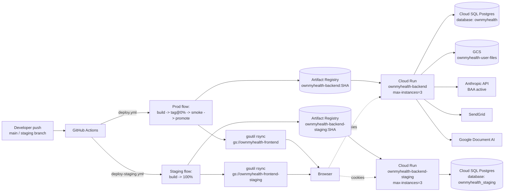

---
tags:
  - reference
  - operations
  - runbook
type: generated-doc
priority: 1
updated: 2026-04-24
source-of-truth: .github/workflows/deploy.yml, backend/Dockerfile, backend/src/app.ts
---

# RUNBOOK.md — Operator Reference

## Purpose / how to read this doc

This is the **operator's reference** for deploying, rolling back, rotating secrets, migrating the database, reading logs, and responding to incidents on OwnMyHealth. Every command here is meant to run verbatim; every scheduler cadence is quoted from the real `setInterval` value; every incident playbook lists the literal `gcloud` or `curl` you would type.

Scope note: `DEPLOY.md` at the repo root still describes a never-shipped Railway-based deploy. The current production deployment is GCP Cloud Run, driven by `.github/workflows/deploy.yml`. This RUNBOOK is the source of truth; `DEPLOY.md` is stale (see [Prompt drift log](#prompt-drift-log)).

Cross-reference the env-var catalog at [`ENV_VARS.md`](./ENV_VARS.md) for any variable referenced below — this doc does not duplicate that table.

---

## Quick reference

| Property | Value | Source |
|---|---|---|
| Production backend URL | `https://api.ownmyhealth.io` | `.github/workflows/deploy.yml:160` |
| Production frontend URL | `https://ownmyhealth.io` (+ `https://app.ownmyhealth.io`) | `backend/src/app.ts:L64-L67`, `docs/STAGING.md:12` |
| Staging backend URL | `https://api-staging.ownmyhealth.io` | `.github/workflows/deploy-staging.yml:73`, `docs/STAGING.md:13` |
| Staging frontend URL | `https://staging.ownmyhealth.io` | `docs/STAGING.md:12` |
| GCP project ID | `ownmyhealth-prod` (shared for prod **and** staging) | `.github/workflows/deploy.yml:9`, `.github/workflows/deploy-staging.yml:15` |
| GCP region | `us-central1` | `.github/workflows/deploy.yml:10` |
| Cloud Run service (prod) | `ownmyhealth-backend` | `.github/workflows/deploy.yml:11` |
| Cloud Run service (staging) | `ownmyhealth-backend-staging` | `.github/workflows/deploy-staging.yml:17` |
| Artifact Registry repo | `us-central1-docker.pkg.dev/ownmyhealth-prod/ownmyhealth` | `.github/workflows/deploy.yml:L44-L47`, `:12` |
| Prod image tag | `ownmyhealth-backend:<sha>` + `:latest` | `.github/workflows/deploy.yml:L44-L52` |
| Frontend GCS bucket (prod) | `gs://ownmyhealth-frontend` | `.github/workflows/deploy.yml:13` |
| Frontend GCS bucket (staging) | `gs://ownmyhealth-frontend-staging` | `.github/workflows/deploy-staging.yml:19` |
| Prod database name | `ownmyhealth` | `docs/STAGING.md:16` |
| Staging database name | `ownmyhealth_staging` | `docs/STAGING.md:16`, `backend/.env.staging.example:23` |
| Cloud SQL instance name | TBD (external: not checked into repo; resolve in GCP Console → SQL → project `ownmyhealth-prod`, or `gcloud sql instances list --project=ownmyhealth-prod`) | referenced as `<instance-name>` in `docs/c-8-part-c-runbook.md:37,239` |
| GitHub repo | the `master`/`main` branch triggers prod deploy | `.github/workflows/deploy.yml:L4-L5` |
| Secret store | GCP Secret Manager in project `ownmyhealth-prod` | `docs/c-8-part-c-runbook.md:L27-L31`, `docs/STAGING.md:L89-L97` |
| CLAUDE.md DB-name drift | CLAUDE.md does not list the DB name; prior prompt template claimed `verifymyprovider` — that's a different project (HealthcareProviderDB). Ignore. | — |

---

## Environments

| Property | Local | Staging | Production |
|---|---|---|---|
| Branch | (any) | `staging` | `main` / `master` |
| Deploy trigger | manual (`npm run dev`) | push to `staging` → `.github/workflows/deploy-staging.yml:L4-L5` | push to `main`/`master` or `workflow_dispatch` → `.github/workflows/deploy.yml:L3-L6` |
| `NODE_ENV` | unset / `development` | `staging` | `production` |
| Frontend URL | `http://localhost:5173` | `https://staging.ownmyhealth.io` | `https://ownmyhealth.io` |
| Backend URL | `http://localhost:3001` | `https://api-staging.ownmyhealth.io` | `https://api.ownmyhealth.io` |
| Cloud Run service | n/a | `ownmyhealth-backend-staging` | `ownmyhealth-backend` |
| Cloud SQL instance | n/a (local Postgres) | shared prod instance, separate DB | TBD (external: GCP Console, project `ownmyhealth-prod`) |
| Database name | `ownmyhealth_dev` (convention) | `ownmyhealth_staging` | `ownmyhealth` |
| GCS bucket (frontend) | n/a | `ownmyhealth-frontend-staging` | `ownmyhealth-frontend` |
| GCS bucket (user files) | n/a | `ownmyhealth-user-files-staging` (`backend/.env.staging.example:94`) | `ownmyhealth-user-files` (`backend/src/config/index.ts:138`) |
| Service account | local (n/a) | `secrets.GCP_SA_KEY` in repo | `secrets.GCP_SA_KEY` in repo (`.github/workflows/deploy.yml:31,140,186`) |
| Traffic split on deploy | n/a | straight to 100% (`deploy-staging.yml:L54-L67`) | canary tag → smoke test → `update-traffic --to-revisions=NEW=100` (`deploy.yml:L54-L175`) |
| Smoke-test gate | n/a | non-fatal warn only (`deploy-staging.yml:L69-L82`) | fatal — blocks promotion (`deploy.yml:L98-L123`) |
| SendGrid mode | real send (dev mailbox) | sandbox auto-enabled (`backend/src/config/index.ts:L132-L133`) | real send |
| Anthropic BAA | warn (`ANTHROPIC_BAA_ACTIVE=false`) | `false` (Claude locked out by runtime gate) | **must be `true`** when `ANTHROPIC_API_KEY` is set (`backend/src/config/index.ts:L246-L251`) |
| Demo account | optional | enabled | **must be disabled** (boot throws if `DEMO_ACCOUNT_ENABLED=true`, `backend/src/config/index.ts:L319-L325`) |

---

## Deployment topology



Services:

| Service | Runtime | Image source | Start command | Source |
|---|---|---|---|---|
| `ownmyhealth-backend` | Cloud Run (us-central1, `--max-instances=3`) | Artifact Registry | `CMD ["sh", "-c", "npx prisma migrate deploy && node dist/app.js"]` | `backend/Dockerfile:51`, `backend/railway.toml:9` |
| `ownmyhealth-backend-staging` | Cloud Run (us-central1, `--max-instances=3`) | Artifact Registry | same | `.github/workflows/deploy-staging.yml:L62-L67` |
| Frontend (prod) | GCS static-site bucket | — | served from `gs://ownmyhealth-frontend` | `.github/workflows/deploy.yml:L208-L212` |
| Frontend (staging) | GCS static-site bucket | — | `gs://ownmyhealth-frontend-staging` | `.github/workflows/deploy-staging.yml:L115-L119` |

Container base: `node:20-alpine` (multi-stage: builder + production) — `backend/Dockerfile:4, 24`. The app runs as unprivileged user `nodejs:1001` (`backend/Dockerfile:L43-L44`) and exposes port `3001` (`backend/Dockerfile:46`).

Startup sequence (from `backend/src/app.ts:L307-L374`):

1. `initializeDatabase()` — Prisma connect + encryption + audit service + `assertNoBypassRLS` (`backend/src/app.ts:310`, `backend/src/services/database.ts:L156-L199`).
2. `initializeDemoUser()` — non-production only (`backend/src/app.ts:313`).
3. `startSessionCleanup()` — 1-hour interval (`backend/src/app.ts:316`).
4. `startAuditCleanup(...)` — 24-hour interval (`backend/src/app.ts:319`).
5. `startEmailScheduler()` — 1-hour tick (`backend/src/app.ts:323`).
6. `app.listen(config.port)` (`backend/src/app.ts:325`).

---

## Deploy: backend

### Automatic (push to main / master)

Any commit to `main` or `master` triggers `.github/workflows/deploy.yml:L1-L175`. The pipeline has four jobs in sequence: `build-and-stage` → `smoke-test` → `promote` → `deploy-frontend` (the frontend job runs in parallel with the backend promote).

Canary sequence for the backend:

1. **Build & push image** — `gcloud auth configure-docker us-central1-docker.pkg.dev` then `docker build -t $IMAGE_SHA -t $IMAGE_LATEST .` from `backend/` (`deploy.yml:L39-L52`). Image tag is the full Git SHA.
2. **Deploy at 0% traffic with a tagged URL** — `gcloud run deploy ownmyhealth-backend --no-traffic --max-instances=3 --tag "staging-<short-sha>"` (`deploy.yml:L66-L73`). Resolves both `latestCreatedRevisionName` and the tagged URL (`deploy.yml:L75-L92`).
3. **Smoke test** — `curl $STAGING_URL/api/v1/health` up to 6 attempts, backing off `i * 5s`; fails the job on non-200 or missing `"success":true` (`deploy.yml:L98-L123`). Note: a fresh cold start can take ~30s because the container's `CMD` runs `npx prisma migrate deploy` before `node dist/app.js` (`backend/Dockerfile:51`).
4. **Promote** — `gcloud run services update-traffic ownmyhealth-backend --to-revisions="$NEW_REV=100"` (`deploy.yml:L148-L155`). Post-promote health probe against prod (`deploy.yml:L157-L167`). Finally `--remove-tags="$TAG"` to drop the staging alias (`deploy.yml:L169-L175`).

**Why `--to-revisions=NEW=100` and not `--to-latest`**: this is a deliberate pin. Every production traffic shift must go through the smoke-tested promotion path. Downside: env-only `gcloud run services update --update-env-vars=...` invocations create a new revision but inherit the pin and get 0% traffic — see [Rollback](#rollback) and the [env-var-pinning playbook](#playbook-env-var-update-silently-held-back-by-revision-pin).

### Manual backend deploy (operator)

```bash
PROJECT_ID=ownmyhealth-prod
REGION=us-central1
SERVICE=ownmyhealth-backend
REPO=ownmyhealth
SHA=$(git rev-parse HEAD)
IMAGE="${REGION}-docker.pkg.dev/${PROJECT_ID}/${REPO}/${SERVICE}:${SHA}"

# 1. Build + push from backend/
gcloud auth configure-docker ${REGION}-docker.pkg.dev --quiet
cd backend
docker build -t "$IMAGE" -t "${REGION}-docker.pkg.dev/${PROJECT_ID}/${REPO}/${SERVICE}:latest" .
docker push "$IMAGE"

# 2. Deploy at 0% with a tag
SHORT_SHA="${SHA:0:7}"
TAG="staging-${SHORT_SHA}"
gcloud run deploy "$SERVICE" \
  --image "$IMAGE" \
  --region "$REGION" --project "$PROJECT_ID" \
  --platform managed \
  --no-traffic --max-instances=3 --tag "$TAG"

# 3. Get the tagged URL + smoke test
TAG_URL=$(gcloud run services describe "$SERVICE" --region "$REGION" --project "$PROJECT_ID" \
  --format=json | jq -r --arg t "$TAG" '.status.traffic[] | select(.tag == $t) | .url')
curl -sS --max-time 30 "$TAG_URL/api/v1/health" | jq

# 4. Shift 100% traffic to the new revision
NEW_REV=$(gcloud run services describe "$SERVICE" --region "$REGION" --project "$PROJECT_ID" \
  --format='value(status.latestCreatedRevisionName)')
gcloud run services update-traffic "$SERVICE" \
  --region "$REGION" --project "$PROJECT_ID" \
  --to-revisions="${NEW_REV}=100"

# 5. Drop the staging tag
gcloud run services update-traffic "$SERVICE" \
  --region "$REGION" --project "$PROJECT_ID" \
  --remove-tags="$TAG"
```

### Automatic staging deploy

Push to `staging`. `.github/workflows/deploy-staging.yml:L21-L82` builds, deploys **straight to 100%** (no canary tag), then probes `https://api-staging.ownmyhealth.io/api/v1/health` with 6 retries. The probe is **non-fatal** (`deploy-staging.yml:L80-L82`) — staging has no traffic-split safety net, so a failed probe is logged but the revision is already live.

Staging differs materially from prod only in the promotion model: no `--no-traffic`, no `--tag`, no `--to-revisions` pin, no gated promote job. Everything else (image build, Dockerfile, migrate-on-boot, env handling) is identical.

---

## Deploy: frontend

### Automatic

Prod (`.github/workflows/deploy.yml:L177-L212`):

1. `npm ci` at repo root, `npm run build` with `VITE_API_URL=https://api.ownmyhealth.io/api/v1` injected at build time.
2. `gsutil -m rm -r gs://ownmyhealth-frontend/** || true` — wipe bucket (ignore failure if empty).
3. `gsutil -m cp -r dist/* gs://ownmyhealth-frontend/` — upload.
4. `gsutil setmeta -h "Cache-Control:no-cache, no-store, must-revalidate" gs://ownmyhealth-frontend/index.html` — prevent CDN/browser caching of the SPA shell.

Staging (`.github/workflows/deploy-staging.yml:L84-L119`) differs in two ways: `npm run build -- --mode staging` loads `.env.staging` (so `VITE_API_URL` points at `https://api-staging.ownmyhealth.io/api/v1`), and the target bucket is `ownmyhealth-frontend-staging`.

### Manual frontend deploy

```bash
# From repo root (NOT backend/)
npm ci
VITE_API_URL=https://api.ownmyhealth.io/api/v1 npm run build

gsutil -m rm -r gs://ownmyhealth-frontend/** || true
gsutil -m cp -r dist/* gs://ownmyhealth-frontend/
gsutil setmeta -h "Cache-Control:no-cache, no-store, must-revalidate" \
  gs://ownmyhealth-frontend/index.html
```

For staging, substitute bucket `ownmyhealth-frontend-staging` and build with `npm run build -- --mode staging`.

---

## Rollback

### List Cloud Run revisions

```bash
gcloud run revisions list \
  --service=ownmyhealth-backend \
  --region=us-central1 \
  --project=ownmyhealth-prod
```

### Roll back to a named prior revision

```bash
# Replace <prev> with an exact revision name from the list above,
# e.g. ownmyhealth-backend-00042-abc
gcloud run services update-traffic ownmyhealth-backend \
  --region=us-central1 \
  --project=ownmyhealth-prod \
  --to-revisions="<prev>=100"
```

### Post-rollback health check

```bash
for i in 1 2 3; do
  curl -sS -o /dev/null -w "HTTP %{http_code}\n" \
    --max-time 15 https://api.ownmyhealth.io/api/v1/health
  sleep 5
done
```

### Gotcha: env-var update held back by traffic pin

**Symptom**: you ran `gcloud run services update --update-env-vars=...` (or `--update-secrets=...`), saw a new revision created, but the live service is still serving the old one. `latestReadyRevisionName` ≠ `latestCreatedRevisionName`.

**Root cause**: `.github/workflows/deploy.yml:L148-L155` pins traffic with `--to-revisions=NEW=100`. Subsequent env-only updates create a revision but don't move traffic, because the service is pinned to a specific named revision rather than `--to-latest`. See project memory `cloud-run-env-update-pinning.md` and the [2026-04-17 postmortem context in ENV_VARS](./ENV_VARS.md#secret-rotation-policy).

**Fix** — shift traffic to the new revision (either approach works):

```bash
# Option A: pin traffic to the new named revision (keeps the pin, recommended)
NEW_REV=$(gcloud run services describe ownmyhealth-backend \
  --region=us-central1 --project=ownmyhealth-prod \
  --format='value(status.latestCreatedRevisionName)')

gcloud run services update-traffic ownmyhealth-backend \
  --region=us-central1 --project=ownmyhealth-prod \
  --to-revisions="${NEW_REV}=100"

# Option B: drop the pin entirely (any subsequent deploy auto-promotes)
gcloud run services update-traffic ownmyhealth-backend \
  --region=us-central1 --project=ownmyhealth-prod \
  --to-latest
```

**Detection signal** — before/after the fix:

```bash
gcloud run services describe ownmyhealth-backend \
  --region=us-central1 --project=ownmyhealth-prod \
  --format='value(status.latestReadyRevisionName, status.latestCreatedRevisionName)'
```

If the two values differ, traffic is pinned to the ready one and the created one is stranded at 0%.

### Frontend rollback

Frontend is a static bundle — there is no revision store. To roll back:

```bash
# Option A: redeploy from a prior commit
git checkout <prior-sha>
npm ci && VITE_API_URL=https://api.ownmyhealth.io/api/v1 npm run build
gsutil -m rm -r gs://ownmyhealth-frontend/** || true
gsutil -m cp -r dist/* gs://ownmyhealth-frontend/

# Option B: if you kept a local dist/ backup from the last known good,
# skip build and go straight to gsutil cp.
```

---

## Database operations

### Connect to production Cloud SQL from your laptop

```bash
# Prerequisites (one-time):
# gcloud auth login
# gcloud config set project ownmyhealth-prod
# gcloud components install cloud-sql-proxy    (or download the proxy binary)
# gcloud auth application-default login

# 1. Look up the instance name (not checked into the repo)
gcloud sql instances list --project=ownmyhealth-prod

# 2. Start the Cloud SQL Auth Proxy on a local port
cloud-sql-proxy \
  --address=127.0.0.1 --port=5433 \
  <project>:<region>:<instance-name>

# 3. In another terminal, connect with psql
# Fetch the DATABASE_URL from Secret Manager first:
gcloud secrets versions access latest \
  --secret=DATABASE_URL --project=ownmyhealth-prod \
  | sed 's/:[^@]*@/:REDACTED@/'     # redact password before logging

# Connect (replace password / user from the secret):
psql "postgresql://<user>:<password>@127.0.0.1:5433/ownmyhealth?sslmode=disable"
```

`<instance-name>` is `TBD (external: GCP Console -> SQL, project ownmyhealth-prod)`. The C-8 runbook references it as a placeholder (`docs/c-8-part-c-runbook.md:37,239`).

Alternative — one-shot interactive shell that handles the proxy for you:

```bash
gcloud sql connect <instance-name> \
  --database=ownmyhealth \
  --user=postgres \
  --project=ownmyhealth-prod
```

### Migration procedure (production)

Today, migrations run inside the container's `CMD` on every pod boot:

```dockerfile
# Source: backend/Dockerfile:51
CMD ["sh", "-c", "npx prisma migrate deploy && node dist/app.js"]
```

This means a deploy **is** a migration. To apply a new migration:

1. Merge the PR containing `backend/prisma/migrations/<timestamp>_<name>/migration.sql` to `main`/`master`.
2. `deploy.yml` rebuilds the image. When Cloud Run starts the new revision, `npx prisma migrate deploy` runs against the `DATABASE_URL` wired into the service (`backend/Dockerfile:51`). A failure here keeps the new revision unready; the smoke-test gate (`deploy.yml:L98-L123`) blocks promotion, and production keeps serving the old revision.
3. If the migration succeeds, the new revision becomes ready and gets promoted to 100%.

Manual invocation (e.g. to apply out-of-band or re-run after a failed deploy):

```bash
# From a laptop with Cloud SQL Proxy running on port 5433
cd backend
DATABASE_URL="postgresql://<user>:<password>@127.0.0.1:5433/ownmyhealth?sslmode=disable" \
  npx prisma migrate deploy --schema=prisma/schema.prisma
```

Known future state: `docs/c-8-part-c-runbook.md:L56-L80` proposes splitting migrations out of the Dockerfile into a separate GitHub Actions `migrate-prod` job that runs with a superuser connection (`DATABASE_URL_MIGRATIONS`) before the app deploy. That PR is not yet shipped at the time of this writing.

### Connection pool & SSL

The pg pool is configured in `backend/src/services/database.ts:L108-L114`:

```ts
// Source: backend/src/services/database.ts:L108-L114
pool = new Pool({
  connectionString,
  max: parseInt(process.env.DATABASE_POOL_SIZE || '10', 10),
  idleTimeoutMillis: 30000,
  connectionTimeoutMillis: 30000, // 30s for Cloud SQL Auth Proxy
  statement_timeout: 30000, // 30s statement timeout
});
```

Bumping `DATABASE_POOL_SIZE` past 10 is only safe after accounting for the Cloud SQL connection cap × Cloud Run `max-instances=3` (`deploy.yml:L62-L72`).

### Common DB queries (PHI-aware)

**⚠️ Warning**: every row returned from `users`, `biomarkers`, `biomarker_history`, `insurance_plans`, `insurance_benefits`, `health_needs`, `health_goals`, `goal_progress_history`, `dna_data`, `audit_logs`, and expenses tables contains encrypted PHI ciphertext. Do not paste results into tickets. Work off of IDs + shape, not plaintext.

```sql
-- Count rows per table without touching PHI columns
SELECT 'users' AS t, COUNT(*) FROM users
UNION ALL SELECT 'biomarkers', COUNT(*) FROM biomarkers
UNION ALL SELECT 'sessions', COUNT(*) FROM sessions
UNION ALL SELECT 'audit_logs', COUNT(*) FROM audit_logs;

-- Delete expired sessions manually (the scheduler does this hourly)
DELETE FROM sessions WHERE "expiresAt" < NOW();

-- Locked-out user reset (authService tracks failedLoginAttempts)
UPDATE users SET "failedLoginAttempts" = 0, "lockedUntil" = NULL
  WHERE id = '<user-uuid>';
```

---

## Secret management

All runtime secrets live in GCP Secret Manager under project `ownmyhealth-prod`, bound to the Cloud Run service via `--set-secrets` / `--update-secrets`. Deploy-time secrets (GitHub Actions) live in the GitHub repo Settings → Secrets.

### List secrets

```bash
gcloud secrets list --project=ownmyhealth-prod
```

### Read a secret (for rotation confirmation — do not log)

```bash
gcloud secrets versions access latest \
  --secret=<SECRET_NAME> --project=ownmyhealth-prod \
  | sed 's/:[^@]*@/:REDACTED@/'    # useful for DATABASE_URL
```

### Add a new version and propagate

```bash
# Add
echo -n "<new-value>" | gcloud secrets versions add <SECRET_NAME> \
  --project=ownmyhealth-prod --data-file=-

# Bind to Cloud Run (creates a new revision)
gcloud run services update ownmyhealth-backend \
  --region=us-central1 --project=ownmyhealth-prod \
  --update-secrets=<ENV_VAR>=<SECRET_NAME>:latest

# Follow up: the new revision sits at 0% because deploy.yml pinned traffic.
# Shift traffic:
NEW_REV=$(gcloud run services describe ownmyhealth-backend \
  --region=us-central1 --project=ownmyhealth-prod \
  --format='value(status.latestCreatedRevisionName)')

gcloud run services update-traffic ownmyhealth-backend \
  --region=us-central1 --project=ownmyhealth-prod \
  --to-revisions="${NEW_REV}=100"
```

### Rotation cheat-sheet

See [`ENV_VARS.md#secret-rotation-policy`](./ENV_VARS.md#secret-rotation-policy) for the full per-secret policy. Quick summary:

| Secret | Generation command | Effect of rotation |
|---|---|---|
| `JWT_ACCESS_SECRET` | `openssl rand -base64 32` | Invalidates all in-flight access tokens on first restart of the new revision. Users keep their refresh tokens → transparent re-auth within 15 min. |
| `JWT_REFRESH_SECRET` | `openssl rand -base64 32` | Invalidates all refresh tokens → every user is forced to log in again. |
| `PHI_ENCRYPTION_KEY` | `openssl rand -hex 32` | **Load-bearing**. Rotating without re-encrypting every PHI row destroys read access to that data. See below. |
| `AUDIT_LOG_SALT` | `openssl rand -hex 32` | **Do not rotate silently.** Breaks decryption of 7-year retained audit logs. See `backend/src/config/index.ts:L43-L54`. |
| `DATABASE_URL` | rotate Cloud SQL user password | Old pods keep working until they restart; new pods pick up the new password. Coordinate with `RLS_ENFORCEMENT=strict` rollout so you don't accidentally re-grant BYPASSRLS (`backend/src/services/database.ts:L211-L270`). |
| `ANTHROPIC_API_KEY` | Anthropic console (BAA-covered org) | Claude calls fail on old key; no data loss. |
| `SENDGRID_API_KEY` | SendGrid dashboard, scope `Mail Send` only | Email sends fail until new key is bound. |

### `PHI_ENCRYPTION_KEY` rotation — external TBD

`TBD (external: PHI master-key rotation procedure is not checked into this repo; resolve via the security owner's runbook, target for this RUNBOOK under a future "Key rotation ceremony" section).`

Resolution path (what the procedure must cover when written):

1. Generate `KEY_NEW = openssl rand -hex 32`.
2. Add as a new Secret Manager version (`PHI_ENCRYPTION_KEY:<new-version>`).
3. Deploy a dual-read revision that decrypts with either `KEY_OLD` or `KEY_NEW` (code change required — not present in repo today).
4. Run a re-encryption job over every row whose column appears in `PHI_FIELDS` at `backend/src/services/encryption.ts` (see [`PHI_TAXONOMY.md`](./PHI_TAXONOMY.md) for the field inventory).
5. Flip the writer env to `KEY_NEW`, deploy again.
6. Remove dual-read path, archive `KEY_OLD`.

Until the code path in step 3 exists, **do not rotate this key**. Losing it destroys all PHI irrecoverably.

---

## Log access + filtering

### Baseline query

```bash
gcloud logging read '
  resource.type="cloud_run_revision"
  resource.labels.service_name="ownmyhealth-backend"
' --project=ownmyhealth-prod --freshness=1h --limit=100 --format=json
```

### Auth failures (last hour)

```bash
gcloud logging read '
  resource.type="cloud_run_revision"
  resource.labels.service_name="ownmyhealth-backend"
  (jsonPayload.action="LOGIN_FAILED" OR textPayload:"JsonWebTokenError" OR textPayload:"invalid signature")
' --project=ownmyhealth-prod --freshness=1h --limit=100
```

### Rate-limit hits (last day)

```bash
gcloud logging read '
  resource.type="cloud_run_revision"
  resource.labels.service_name="ownmyhealth-backend"
  (jsonPayload.code="RATE_LIMIT_EXCEEDED" OR textPayload:"Too many requests")
' --project=ownmyhealth-prod --freshness=1d --limit=100
```

### CORS rejections (hunting for a new frontend origin)

```bash
gcloud logging read '
  resource.type="cloud_run_revision"
  resource.labels.service_name="ownmyhealth-backend"
  textPayload:"CORS rejected origin"
' --project=ownmyhealth-prod --freshness=1d --limit=100
```

(Logged from `backend/src/app.ts:162`.)

### RLS-denied / zero-row-returned reads

```bash
# Warning: today RLS runs as BYPASSRLS (see SECURITY_STATUS.md), so this
# filter will generally be empty. Once the C-8 Part C role cutover ships
# and RLS_ENFORCEMENT=strict is on, these are the signals to watch.
gcloud logging read '
  resource.type="cloud_run_revision"
  resource.labels.service_name="ownmyhealth-backend"
  (jsonPayload.rls_denied=true OR textPayload:"RLS assertion" OR textPayload:"BYPASSRLS")
' --project=ownmyhealth-prod --freshness=1d --limit=100
```

### Startup / crash-loop detection

```bash
gcloud logging read '
  resource.type="cloud_run_revision"
  resource.labels.service_name="ownmyhealth-backend"
  (textPayload:"FATAL" OR textPayload:"Failed to start server" OR severity="ERROR")
' --project=ownmyhealth-prod --freshness=1h --limit=50
```

The startup banner (`backend/src/app.ts:L336-L352`) prints `OwnMyHealth API Server` with env/port/DB — grep for that to confirm a revision finished booting.

---

## Schedulers

Three in-process `setInterval` schedulers boot from `backend/src/app.ts:L315-L323` and stop on SIGTERM/SIGINT via `gracefulShutdown` (`backend/src/app.ts:L356-L369`). All run per Cloud Run instance — with `--max-instances=3`, the cadences effectively fan out by 3×.

| Job | File:line | Cadence | Effect |
|---|---|---|---|
| Session cleanup | `backend/src/services/authService.ts:1232` | `10 * 60 * 1000` ms = **10 minutes** | `DELETE FROM sessions WHERE expiresAt < NOW()` via `withRLSContext(null, ..., {isAdmin:true})` (`backend/src/services/authService.ts:L1195-L1217`). |
| Audit log retention cleanup | `backend/src/services/auditLog.ts:534` | `24 * 60 * 60 * 1000` ms = **24 hours** | Deletes rows older than `RETENTION_DAYS = 2555` (~7 years, `backend/src/services/auditLog.ts:9`) via `cleanupOldLogs()` (`backend/src/services/auditLog.ts:L471-L503`); logs a `DELETE AuditLog retention_cleanup` audit entry for the deletion itself. |
| Engagement email scheduler | `backend/src/schedulers/emailScheduler.ts:242` | `ONE_HOUR_MS` = **1 hour** | Every tick: sends plan-expiring notices for users whose `planExpiresAt` is in the 6-7 day window. On Mondays 08:00-08:59 UTC (first hit only, via `lastWeeklyRunKey`), also sends weekly summaries + goal reminders (`backend/src/schedulers/emailScheduler.ts:L221-L238`). |
| RLS wrapper CI guard | `scripts/check-rls-wrappers.sh` | manual (CI on every PR via `.github/workflows/ci.yml:L112-L116`) | Fails the build if any file under `backend/src/{controllers,services,routes,schedulers,middleware}` calls `prisma.<model>.<verb>(` outside a `withRLSContext` callback. |
| Startup RLS assertion | `backend/src/services/database.ts:L195, L220-L270` | once per boot | In production, queries `pg_roles.rolbypassrls` for the current login. Logs a warning if BYPASSRLS is true; escalates to `process.exit(1)` when `RLS_ENFORCEMENT=strict`. |

**Note**: there is no `node-cron` or `node-schedule` in this codebase — all cadenced work runs on `setInterval` with either start/stop hooks (`startSessionCleanup` / `stopSessionCleanup`, `startAuditCleanup` / `stopAuditCleanup`, `startEmailScheduler` / `stopEmailScheduler`).

---

## Incident playbooks

### Playbook: Auth outage

**Symptoms**: 401s across every user. Cloud Run logs show `JsonWebTokenError: invalid signature` or `Invalid token`.

**Likely causes**:
1. `JWT_ACCESS_SECRET` or `JWT_REFRESH_SECRET` rotated but new revision is stranded at 0% traffic (see [env-var-pinning playbook](#playbook-env-var-update-silently-held-back-by-revision-pin)).
2. Secret bound to a placeholder value → startup gate at `backend/src/config/index.ts:L186-L222` throws, pod crash-loops.

**Diagnosis**:
```bash
# Are latestReady and latestCreated aligned?
gcloud run services describe ownmyhealth-backend \
  --region=us-central1 --project=ownmyhealth-prod \
  --format='value(status.latestReadyRevisionName, status.latestCreatedRevisionName)'

# Search logs for signature failures
gcloud logging read '
  resource.type="cloud_run_revision"
  textPayload:"invalid signature"
' --project=ownmyhealth-prod --freshness=1h --limit=20
```

**Remediation**:
1. If `latestReady` ≠ `latestCreated` → run the "Shift traffic" block in [Rollback](#rollback).
2. If the new revision crash-loops → read the fatal log line. If `JWT_ACCESS_SECRET is set to a known-weak placeholder` appears, the secret in Secret Manager is literal `change-me` / `secret` / etc. (see blocklist at `backend/src/config/index.ts:L186-L193`). Re-add a proper value and rebind.
3. Force-logout all users: `DELETE FROM sessions` via Cloud SQL shell (see [Database operations](#database-operations)). Every user will be forced through refresh → re-login.

**Cross-link**: [`ERROR_RECOVERY.md#unauthenticated`](./ERROR_RECOVERY.md#unauthenticated), [`ENV_VARS.md#critical-secrets-jwt-encryption-db-third-party-api-keys`](./ENV_VARS.md#critical-secrets-jwt-encryption-db-third-party-api-keys).

### Playbook: DB outage

**Symptoms**: `/health` returns 503 with `database: disconnected` (`backend/src/app.ts:L275-L286`). Every protected endpoint 500s. Logs show `Connection terminated unexpectedly` or `connect ETIMEDOUT`.

**Likely causes**:
- Cloud SQL instance restart or maintenance window.
- Connection pool exhausted (all 10 slots in use and `connectionTimeoutMillis=30000` expired).
- Cloud SQL Auth Proxy credentials rotated.
- Startup gate: `assertNoBypassRLS` exiting because `RLS_ENFORCEMENT=strict` and the DB role regressed to BYPASSRLS (`backend/src/services/database.ts:L247-L263`).

**Diagnosis**:
```bash
# Cloud Run health endpoint
curl -sS https://api.ownmyhealth.io/health | jq

# Cloud SQL status
gcloud sql instances describe <instance-name> \
  --project=ownmyhealth-prod --format=json | jq '.state, .settings.activationPolicy'

# Look for "all connections busy" or "Connection terminated"
gcloud logging read '
  resource.type="cloud_run_revision"
  (textPayload:"ECONNREFUSED" OR textPayload:"Connection terminated" OR textPayload:"connection pool")
' --project=ownmyhealth-prod --freshness=30m --limit=50
```

**Remediation**:
1. If Cloud SQL itself is down → wait for GCP recovery, monitor `/health`.
2. If pool-exhausted → redeploy with a higher `DATABASE_POOL_SIZE`, but only after understanding why every slot was busy (long-running query, leaked transaction). The in-memory rate limiter also gets diluted as instances scale — keep `--max-instances=3` aligned (`.github/workflows/deploy.yml:72`).
3. If RLS-strict startup crash → audit the Secret Manager `DATABASE_URL` value; confirm it points at the NOBYPASSRLS `omh_app` role once the C-8 cutover is live (`docs/c-8-part-c-runbook.md`).

**Cross-link**: [`TROUBLESHOOTING.md`](./TROUBLESHOOTING.md), [`ENV_VARS.md#database-and-persistence`](./ENV_VARS.md#database-and-persistence).

### Playbook: Claude API outage or BAA misconfiguration

**Symptoms**: biomarker guidance, SBC extraction, and AI chat endpoints return 500 or structured `anthropic unavailable` errors. Or — startup itself throws: `ANTHROPIC_BAA_ACTIVE must be set to "true" in production when ANTHROPIC_API_KEY is configured.` (`backend/src/config/index.ts:L246-L251`).

**Likely causes**:
1. Anthropic rate limit or outage.
2. `ANTHROPIC_API_KEY` rotated but env not rebound (see env-var pinning gotcha).
3. `ANTHROPIC_BAA_ACTIVE` set to `false` in prod — Claude calls blocked by runtime gate at `backend/src/controllers/aiChatController.ts:134` and `backend/src/routes/biomarkerRoutes.ts:134`.

**Diagnosis**:
```bash
# Check current env bindings on the live revision
gcloud run services describe ownmyhealth-backend \
  --region=us-central1 --project=ownmyhealth-prod \
  --format='value(spec.template.spec.containers[0].env)'

# Anthropic status
curl -sS https://status.anthropic.com/api/v2/status.json | jq '.status.description'

# Recent Claude errors
gcloud logging read '
  resource.type="cloud_run_revision"
  (textPayload:"anthropic" OR textPayload:"ANTHROPIC_BAA_ACTIVE" OR textPayload:"Claude")
' --project=ownmyhealth-prod --freshness=1h --limit=50
```

**Remediation**:
1. Anthropic outage → no fix; product-side fallback is "AI guidance temporarily unavailable". Document-extraction features also degrade.
2. Key rotated → update Secret Manager, rebind, **shift traffic** (see [Rollback](#rollback)). The 2026-04-17 `ANTHROPIC_BAA_ACTIVE` flip (memory `cloud-run-env-update-pinning.md`) is the canonical postmortem.
3. BAA misconfig → set `ANTHROPIC_BAA_ACTIVE=true` via `gcloud run services update --update-env-vars=ANTHROPIC_BAA_ACTIVE=true`, then shift traffic. If you genuinely need Claude off in prod, unset `ANTHROPIC_API_KEY` entirely — the boot gate only throws when the key is set without BAA.

**Cross-link**: [`ENV_VARS.md#ai-anthropic--google-document-ai`](./ENV_VARS.md#ai-anthropic--google-document-ai), [`HIPAA_CHECKLIST.md`](./HIPAA_CHECKLIST.md).

### Playbook: GCS outage or bucket-permission error

**Symptoms**: file uploads 500 with `storage service unavailable` or `Permission denied`. Signed URL downloads 403. SBC extraction fails immediately (can't fetch the uploaded PDF).

**Likely causes**:
1. GCS regional outage.
2. Cloud Run service account lost `Storage Object Admin` on bucket `ownmyhealth-user-files`.
3. Bucket CORS misconfigured (frontend direct upload path).

**Diagnosis**:
```bash
# List buckets the SA can see
gcloud storage buckets list --project=ownmyhealth-prod

# Probe a known object (read-only)
gcloud storage ls gs://ownmyhealth-user-files/ --limit=1 --project=ownmyhealth-prod

# Check SA bindings on the bucket
gsutil iam get gs://ownmyhealth-user-files
```

**Remediation**:
1. GCS outage → wait; surface a user-facing banner.
2. Permission drift → grant `roles/storage.objectAdmin` to the Cloud Run SA:
   ```bash
   gcloud storage buckets add-iam-policy-binding gs://ownmyhealth-user-files \
     --member=serviceAccount:<sa-email> \
     --role=roles/storage.objectAdmin
   ```
3. CORS drift → `gsutil cors set cors.json gs://ownmyhealth-user-files` (keep the allowed origins in sync with `backend/src/app.ts:L64-L67`).

**Cross-link**: [`ENV_VARS.md#file-storage-gcs`](./ENV_VARS.md#file-storage-gcs).

### Playbook: PHI leak in logs

**Symptoms**: decrypted biomarker values, DOB, email, or full request bodies showing up in Cloud Logging.

**Immediate steps (within 15 min)**:
1. **Freeze**: disable the offending revision by rolling back to the previous revision (see [Rollback](#rollback)). Every minute a leaking revision serves traffic, log volume compounds.
2. **Scope**: identify which log entries leaked, for how long, and which users:
   ```bash
   gcloud logging read '
     resource.type="cloud_run_revision"
     resource.labels.service_name="ownmyhealth-backend"
     (jsonPayload.user_id="<uuid>" OR textPayload:"<signal>")
   ' --project=ownmyhealth-prod --freshness=24h --limit=1000 --format=json \
     > /tmp/leak-scope.json
   ```
3. **Redact**: Cloud Logging does not support selective deletion of individual log entries in an ingested bucket. Options:
   - Create a log exclusion filter to stop further ingest.
   - Delete the entire log bucket's entries via `gcloud logging logs delete` (blunt but complete).
   - File a GCP support ticket for targeted redaction.

**Audit obligations** (HIPAA): log a Security Incident in the audit-log system (write `action: 'PHI_LEAK_DETECTED'` via `auditService.logSystem`). See [`HIPAA_CHECKLIST.md`](./HIPAA_CHECKLIST.md) for the full Breach-Notification-Rule path.

**Root-cause categories**:
- `console.log(req.body)` in a controller. Grep the diff for `console.log` and `logger.*(... data: { user })` with full user objects.
- Error handler leaking stack traces with bound variables — check `backend/src/middleware/errorHandler.ts`.
- Morgan `combined` format capturing request bodies.

**Prevention** — add to the code-review checklist in `CLAUDE.md:228` and re-run.

**Cross-link**: [`PHI_TAXONOMY.md`](./PHI_TAXONOMY.md), [`HIPAA_CHECKLIST.md`](./HIPAA_CHECKLIST.md).

### Playbook: Rate-limit abuse / DDoS

**Symptoms**: sudden spike in 429s in logs; legitimate users also seeing "Too many requests"; Cloud Run scaling to `--max-instances=3` limit and staying there.

**Likely causes**:
- Credential-stuffing attack on `/api/v1/auth/login` (covered by `strictAuthLimiter`).
- Scraper hitting a public endpoint (root `/`, `/health`).
- Single misbehaving client (lost its refresh token, hammering `/auth/refresh`).

**Diagnosis**:
```bash
# Top offending IPs in the last hour
gcloud logging read '
  resource.type="cloud_run_revision"
  httpRequest.status>=429
' --project=ownmyhealth-prod --freshness=1h --limit=1000 --format=json \
  | jq -r '.[].httpRequest.remoteIp' | sort | uniq -c | sort -rn | head

# Per-endpoint counts
gcloud logging read '
  resource.type="cloud_run_revision"
  httpRequest.status>=429
' --project=ownmyhealth-prod --freshness=1h --limit=1000 --format=json \
  | jq -r '.[].httpRequest.requestUrl' | sort | uniq -c | sort -rn | head
```

**Remediation**:
1. In-memory rate limiter is per-instance; with 3 instances a sustained attacker has `3 × RATE_LIMIT_MAX_REQUESTS = 300` requests/15min. To harden urgently, temporarily drop `RATE_LIMIT_MAX_REQUESTS` via `--update-env-vars` (remember to shift traffic — env-pinning gotcha).
2. Block at Cloud Armor (edge) rather than the in-process limiter for sustained attacks. Not yet configured at the time of writing — `TBD (external: Cloud Armor policy creation, resolve via GCP Console → Network Security → Cloud Armor)`.
3. Rotate the affected user's sessions if credential stuffing is suspected: `DELETE FROM sessions WHERE "userId" = '<uuid>'`.

**Cross-link**: [`ENV_VARS.md#rate-limiting`](./ENV_VARS.md#rate-limiting), `backend/src/middleware/rateLimiter.ts`.

### Playbook: Runaway migration (failed midway)

**Symptoms**: new revision never becomes ready. Startup logs stop at `npx prisma migrate deploy` with a PostgreSQL error (deadlock, constraint violation, out-of-memory on a large `ALTER TABLE`). Old revision still at 100% because the canary smoke-test blocked promotion.

**Diagnosis**:
```bash
# The failing revision's logs
gcloud logging read '
  resource.type="cloud_run_revision"
  resource.labels.service_name="ownmyhealth-backend"
  textPayload:"prisma"
' --project=ownmyhealth-prod --freshness=30m --limit=100

# Check _prisma_migrations directly (via Cloud SQL shell — see DB ops)
-- SQL:
SELECT migration_name, finished_at, rolled_back_at, logs
FROM _prisma_migrations
ORDER BY started_at DESC
LIMIT 5;
```

**Remediation**:
1. **Old revision is still healthy** — users are unaffected. Do not promote.
2. Identify whether the partial state is recoverable or needs a manual `ROLLBACK`:
   - If Prisma marked the migration as `rolled_back_at IS NOT NULL` — fix the SQL, commit a new migration, redeploy.
   - If the migration partially applied and Prisma crashed before the `INSERT` into `_prisma_migrations` — you may need a manual `UPDATE _prisma_migrations SET rolled_back_at = NOW()` after reverting the DDL by hand.
3. For a large `ALTER TABLE` that timed out — split into smaller online migrations (`ALTER TABLE ... ADD COLUMN` + backfill + constraint).

**Safer future state**: `docs/c-8-part-c-runbook.md:L56-L80` splits migrations into their own CI job (`migrate-prod`) so a bad migration halts the deploy before the image is even deployed, rather than crash-looping pods.

**Cross-link**: [`DATA_MODEL.md`](./DATA_MODEL.md).

### Playbook: Env-var update silently held back by revision pin

**Symptoms**: you ran `gcloud run services update --update-env-vars=X=Y` (or `--update-secrets`), confirmed a new revision exists (`latestCreatedRevisionName` advanced), but the live service still behaves as if `X` is unset. The 2026-04-17 `ANTHROPIC_BAA_ACTIVE` flip is the canonical incident.

**Root cause**: `.github/workflows/deploy.yml:L148-L155` pins traffic with `--to-revisions=NEW=100` on every deploy. This is deliberate — it forces every prod traffic shift through the smoke-tested promote step. Side effect: subsequent env-only updates inherit the pin, so the new revision gets 0% traffic.

**Detection**:

```bash
gcloud run services describe ownmyhealth-backend \
  --region=us-central1 --project=ownmyhealth-prod \
  --format='value(status.latestReadyRevisionName, status.latestCreatedRevisionName)'
```

If these values differ, the pin is active.

**Fix** (mirrors [Rollback → Gotcha](#gotcha-env-var-update-held-back-by-traffic-pin)):

```bash
NEW_REV=$(gcloud run services describe ownmyhealth-backend \
  --region=us-central1 --project=ownmyhealth-prod \
  --format='value(status.latestCreatedRevisionName)')

# Option A (keeps the pin, recommended):
gcloud run services update-traffic ownmyhealth-backend \
  --region=us-central1 --project=ownmyhealth-prod \
  --to-revisions="${NEW_REV}=100"

# Option B (drops the pin permanently — any future deploy auto-promotes):
gcloud run services update-traffic ownmyhealth-backend \
  --region=us-central1 --project=ownmyhealth-prod \
  --to-latest
```

**Cross-link**: memory file `cloud-run-env-update-pinning.md`; [`ENV_VARS.md#secret-rotation-policy`](./ENV_VARS.md#secret-rotation-policy).

---

## Smoke test after deploy

Run all three tiers in order. The CI pipeline only runs tier 1; tiers 2 and 3 are the operator check.

### Tier 1 — health probes (automated in `deploy.yml`)

```bash
# Prod
curl -sS -w "\nHTTP %{http_code}\n" https://api.ownmyhealth.io/api/v1/health
curl -sS -w "\nHTTP %{http_code}\n" https://api.ownmyhealth.io/health

# Staging
curl -sS -w "\nHTTP %{http_code}\n" https://api-staging.ownmyhealth.io/api/v1/health
```

Expected: both return `200` with `{"status":"healthy","checks":{"database":"connected"}}` (`/health`, `backend/src/app.ts:L275-L286`) or `{"success":true}` (`/api/v1/health`, routed via `backend/src/routes/index.ts`).

### Tier 2 — frontend loads and serves the SPA

```bash
curl -sS -w "\nHTTP %{http_code}\nCache-Control: %header{cache-control}\n" \
  https://ownmyhealth.io/ | head -5

curl -sS -w "HTTP %{http_code}\n" \
  https://ownmyhealth.io/favicon.ico -o /dev/null
```

Expected: the root returns HTML containing `<div id="root"></div>` with `Cache-Control: no-cache, no-store, must-revalidate` on `index.html` (`.github/workflows/deploy.yml:212`).

### Tier 3 — critical path: register → verify email skip → login → create biomarker

This requires a throwaway test account. Use a one-time real email you own.

```bash
API=https://api.ownmyhealth.io/api/v1
EMAIL="smoketest+$(date +%s)@yourdomain.example"
PW='Smoke-Test-$1234'

# 0. Grab CSRF
CSRF=$(curl -sS -c /tmp/cookies.txt $API/csrf-token | jq -r .data.csrfToken)

# 1. Register
curl -sS -b /tmp/cookies.txt -c /tmp/cookies.txt \
  -H "Content-Type: application/json" \
  -H "X-CSRF-Token: $CSRF" \
  -d "{\"email\":\"$EMAIL\",\"password\":\"$PW\",\"name\":\"Smoke Test\",\"acceptedTerms\":true}" \
  $API/auth/register

# 2. Log in (after manually verifying email, or use demo account path in staging)
curl -sS -b /tmp/cookies.txt -c /tmp/cookies.txt \
  -H "Content-Type: application/json" \
  -H "X-CSRF-Token: $CSRF" \
  -d "{\"email\":\"$EMAIL\",\"password\":\"$PW\"}" \
  $API/auth/login | jq

# 3. Refresh CSRF token (cookies rotated after login)
CSRF=$(curl -sS -b /tmp/cookies.txt -c /tmp/cookies.txt $API/csrf-token | jq -r .data.csrfToken)

# 4. Create a biomarker
curl -sS -b /tmp/cookies.txt \
  -H "Content-Type: application/json" \
  -H "X-CSRF-Token: $CSRF" \
  -d '{"name":"Glucose","value":"95","unit":"mg/dL","measuredAt":"2026-04-24T00:00:00Z","category":"METABOLIC"}' \
  $API/biomarkers | jq
```

Expected: `201 Created` with a biomarker row echoed back with plaintext `valueDecrypted` / `unitDecrypted` fields (see [`API_REFERENCE.md`](./API_REFERENCE.md)).

### Rollback signal

If tier 1 returns anything other than 200 for more than 3 attempts spaced 10s apart after a deploy, roll back immediately — do not spend time debugging on prod traffic. Use the commands in [Rollback](#rollback).

---

## Runbook maintenance

Update this doc when any of the following change:

- URLs, service names, project ID, region, bucket names.
- Scheduler cadences or scheduler files — the [Schedulers](#schedulers) table must cite actual `setInterval` values.
- Deploy pipeline structure (canary vs. straight promote; smoke-test gate; migration strategy).
- Secret rotation procedures (especially when `PHI_ENCRYPTION_KEY` rotation is finally defined — remove the external TBD).
- Any new scheduled job (audit, session, email, or a fourth).
- `RLS_ENFORCEMENT=strict` rollout completion — the "warn-only" language throughout needs to flip.

Self-check before committing a change:

- Every `gcloud`, `gsutil`, or `curl` command runs verbatim from a clean shell.
- Every `file:line` citation still resolves.
- Every cross-link to a sibling doc (`./NAME.md#anchor`) renders.
- Acceptance questions below can be answered purely from this doc.

---

## Acceptance-question self-checks

Answered using only this doc (and the siblings it cross-links).

**Q1. What command rolls back to the previous Cloud Run revision?**
→ `gcloud run services update-traffic ownmyhealth-backend --region=us-central1 --project=ownmyhealth-prod --to-revisions="<prev>=100"`, where `<prev>` comes from `gcloud run revisions list --service=ownmyhealth-backend --region=us-central1 --project=ownmyhealth-prod`. See [Rollback](#rollback).

**Q2. Why might an env-var update not take effect even though a new revision exists?**
→ `.github/workflows/deploy.yml:L148-L155` pins traffic with `--to-revisions=NEW=100`; subsequent `gcloud run services update --update-env-vars=...` creates a revision but inherits the pin, leaving the new revision at 0% traffic. Detection: `latestReadyRevisionName` ≠ `latestCreatedRevisionName`. Fix: `update-traffic --to-revisions=$NEW_REV=100` or `--to-latest`. See [Gotcha](#gotcha-env-var-update-held-back-by-traffic-pin) and [the full playbook](#playbook-env-var-update-silently-held-back-by-revision-pin).

**Q3. What's the cadence of the audit log retention cleanup, and what does it delete?**
→ Runs every **24 hours** (`setInterval(..., 24 * 60 * 60 * 1000)` at `backend/src/services/auditLog.ts:534`). Deletes audit_log rows older than `RETENTION_DAYS = 2555` (~7 years; HIPAA-compliant retention). See [Schedulers](#schedulers).

**Q4. How do you connect to the production Cloud SQL DB from your laptop?**
→ Start the Cloud SQL Auth Proxy against `<project>:<region>:<instance-name>` on local port 5433, then `psql` with the connection string pulled from `gcloud secrets versions access latest --secret=DATABASE_URL`. Alternatively `gcloud sql connect <instance-name> --database=ownmyhealth --user=postgres --project=ownmyhealth-prod`. See [Database operations](#database-operations). Instance name is TBD (external: GCP Console).

**Q5. Which script validates that every controller wraps Prisma calls in `withRLSContext`?**
→ `scripts/check-rls-wrappers.sh` — wired into CI at `.github/workflows/ci.yml:L112-L116`. Fails the build on any `prisma.<model>.<verb>(` call inside `backend/src/{controllers,services,routes,schedulers,middleware}` not on a `tx.` line. See [Schedulers](#schedulers) (last row).

**Q6. What's the deploy trigger for staging vs prod?**
→ Staging: push to `staging` branch → `.github/workflows/deploy-staging.yml:L4-L5`, straight to 100% traffic on `ownmyhealth-backend-staging`. Prod: push to `main`/`master` → `.github/workflows/deploy.yml:L3-L6`, canary tag at 0% → smoke test → `update-traffic --to-revisions=NEW=100`. See [Environments](#environments) and [Deploy: backend](#deploy-backend).

**Q7. How do you rotate `PHI_ENCRYPTION_KEY` end-to-end?**
→ **Not yet defined — marked external TBD** under [Secret management → `PHI_ENCRYPTION_KEY` rotation](#phi_encryption_key-rotation--external-tbd). The procedure requires a code-level dual-read path (decrypt with KEY_OLD OR KEY_NEW) that does not exist in the repo today, plus a re-encryption job over every PHI_FIELDS column. Until that path exists, **do not rotate this key**. Resolution path is documented.

**Q8. Where are secrets stored in prod, and how do you update one?**
→ GCP Secret Manager in project `ownmyhealth-prod`. Add a version with `echo -n <value> | gcloud secrets versions add <name> --data-file=-`, bind to Cloud Run with `gcloud run services update ownmyhealth-backend --update-secrets=<ENV>=<name>:latest`, then shift traffic (env-pinning gotcha). See [Secret management](#secret-management). Full rotation cadence in [`ENV_VARS.md#secret-rotation-policy`](./ENV_VARS.md#secret-rotation-policy).

**Q9. What's the smoke-test you run after every deploy?**
→ Three tiers: (1) `curl https://api.ownmyhealth.io/api/v1/health` (automated in `deploy.yml:L98-L123` and `:L157-L167`); (2) frontend `GET /` returns SPA HTML with `Cache-Control: no-cache`; (3) manual register → login → create biomarker flow. See [Smoke test after deploy](#smoke-test-after-deploy).

**Q10. Which log filter finds RLS-denied requests in the last hour?**
→
```
gcloud logging read '
  resource.type="cloud_run_revision"
  resource.labels.service_name="ownmyhealth-backend"
  (jsonPayload.rls_denied=true OR textPayload:"RLS assertion" OR textPayload:"BYPASSRLS")
' --project=ownmyhealth-prod --freshness=1h --limit=100
```
Caveat: today the app runs as BYPASSRLS so this filter will typically be empty — the signal matters once C-8 Part C ships. See [Log access + filtering](#log-access--filtering).

**Q11. What's the playbook for a Claude API outage, step by step?**
→ Check `ANTHROPIC_BAA_ACTIVE` + `ANTHROPIC_API_KEY` bindings on the live revision; probe Anthropic status; if secret was rotated, rebind and shift traffic (env-pinning gotcha); if BAA misconfigured, set `ANTHROPIC_BAA_ACTIVE=true` and shift traffic. Full step-by-step in [Playbook: Claude API outage or BAA misconfiguration](#playbook-claude-api-outage-or-baa-misconfiguration).

**Q12. Where does the session-cleanup scheduler run and with what cadence?**
→ `backend/src/services/authService.ts:1232`, `setInterval(..., 60 * 60 * 1000)` = **once per hour**. Deletes expired sessions (`expiresAt < NOW()`) via `withRLSContext(null, ..., { isAdmin: true })`. Booted from `backend/src/app.ts:316`; stopped on SIGTERM/SIGINT via `stopSessionCleanup` (`authService.ts:L1244-L1250`). See [Schedulers](#schedulers).

---

## Related Documents

- [ARCHITECTURE.md](./ARCHITECTURE.md) — system topology, middleware stack, CI/CD topology diagram.
- [ENV_VARS.md](./ENV_VARS.md) — complete env-var catalog, secret classification, rotation policy.
- [DATA_MODEL.md](./DATA_MODEL.md) — schema, RLS policies, cascade behavior (for migration + query work).
- [ERROR_RECOVERY.md](./ERROR_RECOVERY.md) — per-error recovery procedures referenced by incident playbooks.
- [TROUBLESHOOTING.md](./TROUBLESHOOTING.md) — symptom catalog that feeds the incident playbooks here.
- [LOCAL_DEV.md](./LOCAL_DEV.md) — the dev-side parallel to this doc.
- [SECURITY_STATUS.md](./SECURITY_STATUS.md) — open infra findings (BYPASSRLS runtime, RLS_ENFORCEMENT rollout).
- [HIPAA_CHECKLIST.md](./HIPAA_CHECKLIST.md) — operational HIPAA obligations referenced from the PHI-leak playbook.

---

## Prompt drift log

- `prompts/15-runbook-doc.md:38` says "Entry point is `backend/src/index.ts`". No such file exists — the entry is `backend/src/app.ts` (confirmed by `backend/package.json:5` `"main": "dist/app.js"`, `backend/Dockerfile:51` `CMD ["sh", "-c", "... node dist/app.js"]`, and `.github/workflows/deploy.yml` never referencing `index.js`).
- `prompts/15-runbook-doc.md:44` references `backend/scripts/*`. That path does not exist — operator scripts live at repo-root `scripts/` (`check-rls-wrappers.sh`, plus `.mjs` utility scripts that are HealthcareProviderDB-specific leftovers, not OwnMyHealth operator scripts). CI calls `bash scripts/check-rls-wrappers.sh` from the repo root.
- Task-prompt preamble says DB name is `verifymyprovider`. That's the HealthcareProviderDB project (per `memory/MEMORY.md` HealthcareProviderDB section) — **not OwnMyHealth**. The OwnMyHealth prod DB is `ownmyhealth` (per `docs/STAGING.md:16`); the staging DB is `ownmyhealth_staging`. Ignored the preamble and sourced from the repo.
- `DEPLOY.md` at repo root still describes a Railway-based deploy that was never shipped. Actual prod is GCP Cloud Run via `.github/workflows/deploy.yml`. `backend/railway.toml` is vestigial — the `startCommand` matches what the Dockerfile's `CMD` already runs.
- Prompt's rollback-commands example uses revision name `ownmyhealth-backend-0000N-abc`. Real revision names are generated by Cloud Run as `<service>-NNNNN-<suffix>` (e.g. `ownmyhealth-backend-00042-abc`); listed live via `gcloud run revisions list`.
- Cloud SQL instance name is genuinely absent from the repo — kept as the only TBD (external: GCP Console).
