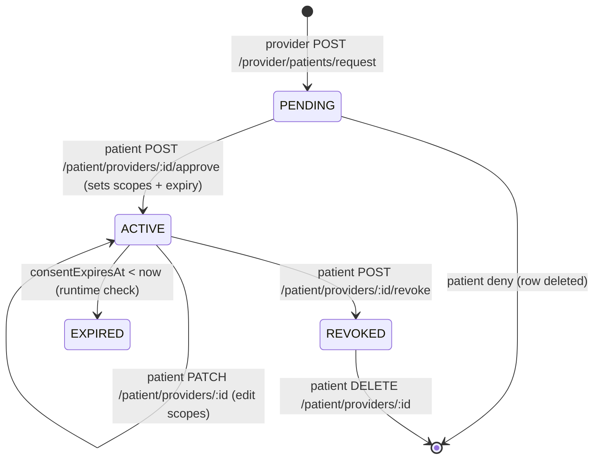

# STRATEGY.md — OwnMyHealth Product + Business Direction

> Reference doc for product strategy: mission, principles, target user, code-grounded feature map, AI strategy, provider/lab/plan strategy, roadmap, decisions, risks, and open questions. Every claim cites `file:path:line`. Generated 2026-06-01.

## Required reading before generating

This doc was generated against the live codebase per [`prompts/14-strategy-doc.md`](../prompts/14-strategy-doc.md) and the shared protocol in [`prompts/_doc-quality.md`](../prompts/_doc-quality.md). It must pass the five quality tests (question-answering, path-and-line, snippet, diagram, reproducibility). Where the prompt or `CLAUDE.md` disagrees with the code, the code wins and the divergence is logged under [Prompt drift log](#prompt-drift-log).

---

## 1. Mission / vision

OwnMyHealth is a **privacy-first, HIPAA-compliant health biomarker tracking platform** that lets a patient own their own health data: track biomarkers and trends, manage insurance documents and out-of-pocket cost projections, get educational (non-diagnostic) AI guidance, sync labs directly from Quest, and selectively share scoped data with their providers under explicit consent.

Code-derived product statement (the durable, citable version):

```text
// Source: README.md:3
A privacy-first, HIPAA-compliant health biomarker tracking platform with
insurance document management. Built for patients managing chronic conditions
like osteoporosis.
```

`CLAUDE.md:4` adds the wider scope:

```text
// Source: CLAUDE.md:4 (What This Is)
Privacy-first HIPAA-compliant health biomarker tracking platform with insurance
document management, AI-powered guidance, provider-patient collaboration, and
expense tracking.
```

A single crisp **brand mission sentence** (one-line tagline, vision horizon) is not stated verbatim anywhere in the repo. `TBD (external: owner mission statement / tagline, resolve via founder interview; the code-derived statement above is the working stand-in)`.

## 2. Core principles

These are enforced rules in the codebase, not aspirations. Each cites the mechanism.

| Principle | Rule (CLAUDE.md) | Code that enforces it |
|---|---|---|
| Privacy-first / all PHI encrypted | "All PHI must be encrypted with AES-256-GCM" (`CLAUDE.md` Security §2) | `PHI_FIELDS` + `encrypt()` in `backend/src/services/encryption.ts`; per-user keys in `backend/src/services/userEncryption.ts` (PBKDF2-SHA512) |
| Consent-first sharing | "provider access only via explicit patient consent" (`CLAUDE.md` Product §3) | Provider read paths gated on `status === 'ACTIVE'` + permission flag + expiry — `backend/src/routes/providerRoutes.ts:443-447` |
| AI is educational, never diagnostic | "always include disclaimers on AI-generated content" (`CLAUDE.md` Product §1/§4) | Disclaimer baked into the guidance prompt: `backend/src/routes/biomarkerRoutes.ts:221` |
| User owns their data (export + delete) | "export and deletion capabilities required" (`CLAUDE.md` Product §2) | `dataExport: true` for **every** tier incl. FREE — `backend/src/config/plans.ts:56`; settings/export controller `backend/src/controllers/settingsController.ts` |
| Every PHI access audit-logged (7y) | "Every PHI access must be audit logged - 7-year retention" (`CLAUDE.md` Security §3) | `auditService.logAccess(...)` on PHI paths, e.g. `backend/src/routes/providerRoutes.ts:540`; retention cleanup in `backend/src/services/auditLog.ts` |
| Row-level isolation (defense in depth) | "users can only access their own data" (`CLAUDE.md` RLS §) | `withRLSContext` / `withRLSTransaction` (`backend/src/services/database.ts`); boot-time `assertNoBypassRLS()` hard-exits prod on `BYPASSRLS` — `backend/src/services/database.ts:194,250` |

The privacy posture extends to AI: PHI is **gated behind a signed BAA flag** before any Claude/Document AI call — see [§5](#5-ai-integration-strategy).

## 3. Target user

Derived from the feature set and stated scope; no explicit persona doc exists in the repo.

| Signal | Evidence | Implied user |
|---|---|---|
| "Built for patients managing chronic conditions like osteoporosis" | `README.md:3` | Solo patient with ongoing labs to track |
| DEXA / bone-density tracking called out | `CLAUDE.md` Current Features (DEXA Scan Support) | Osteoporosis / bone-health patient |
| Insurance SBC + cost projection + actuals | `backend/src/routes/expenseRoutes.ts`, models `ExpenseProjection`/`ExpenseActual`/`CostAnalysis` | Cost-conscious self-payer / high-deductible plan holder |
| TEAM tier "For families and caregivers" | `backend/src/config/plans.ts:84` | Caregiver managing others (family plan) |
| Provider-patient consent + provider UI | `backend/src/routes/providerRoutes.ts`, `src/components/provider/MyPatientsPage.tsx` | A clinician the patient invites (provider-led collaboration, patient-initiated consent) |

Default role at signup is `PATIENT` (`backend/prisma/schema.prisma:28`). The platform is **patient-owned, consent-out** to providers — not a provider-led EHR. Crisp committed personas (primary vs. secondary) → `TBD (external: owner persona definition; resolve via product owner)`.

## 4. Feature map

Counts verified 2026-06-01: 16 mounted route modules (`backend/src/routes/index.ts:82-113`) plus separately-mounted internal routes (`backend/src/routes/internalRoutes.ts`); 8 named rate limiters (`backend/src/middleware/rateLimiter.ts:17-157`); 22 Prisma migrations under `backend/prisma/migrations/` (excluding `migration_lock.toml`).

### 4a. Shipped features

| Feature | Code evidence | Status |
|---|---|---|
| Biomarker tracking (manual entry, history, trends, normal ranges, AI guidance) | `backend/src/routes/biomarkerRoutes.ts`; models `Biomarker`/`BiomarkerHistory` (`schema.prisma:141,179`); `src/components/biomarkers/` | Shipped |
| DEXA / bone-density tracking | `CLAUDE.md` Current Features; stored as biomarkers via `DataSourceType` `LAB_UPLOAD`/`MANUAL` (`schema.prisma:523`) | Shipped |
| Insurance management (SBC upload + Claude extraction, benefit search, coverage matrix) | `backend/src/routes/insuranceRoutes.ts`; `backend/src/services/sbcExtraction.ts`, `claudeExtraction.ts`; models `InsurancePlan`/`InsuranceBenefit` (`schema.prisma:192,361`); benefit-search wired `feat(insurance)` 2026-05-31 | Shipped |
| Expense tracking (projections, actuals, AI cost analysis) | `backend/src/routes/expenseRoutes.ts`; models `ExpenseProjection`/`ExpenseActual`/`CostAnalysis` (`schema.prisma:614,636,664`); `analyzeCosts` `backend/src/controllers/expenseController.ts:614` | Shipped |
| Health goals (progress notes, history, reminder cadence) | `backend/src/routes/healthGoalsRoutes.ts`; models `HealthGoal`/`GoalProgressHistory` (`schema.prisma:404,444`) | Shipped |
| Health needs (type, urgency, status) | `backend/src/routes/healthNeedsRoutes.ts`; model `HealthNeed` (`schema.prisma:384`) | Shipped |
| Provider-patient consent collaboration (+ provider UI) | `backend/src/routes/providerRoutes.ts`, `patientRoutes.ts`; model `ProviderPatient` (`schema.prisma:94`); UI `src/components/provider/MyPatientsPage.tsx`, `CareTeamPage.tsx` | Shipped |
| File management (lab report upload, PDF parse + OCR, list/download/delete) | `backend/src/routes/uploadRoutes.ts`, `fileRoutes.ts`; `backend/src/controllers/upload/` (`labUploadController.ts`, `sbcUploadController.ts`); `fileController.ts`; `ocrService.ts`, `pdfParser.ts` | Shipped |
| AI Health Guide chat (SSE streaming) | `backend/src/routes/aiRoutes.ts`; `backend/src/controllers/aiChatController.ts`; `backend/src/services/anthropicClient.ts`; `backend/src/services/knowledge/` | Shipped |
| Quest FHIR lab connections (SMART-on-FHIR OAuth) | `backend/src/routes/fhirRoutes.ts`; `backend/src/controllers/fhirController.ts`; `backend/src/services/fhir/`; model `LabConnection` (`schema.prisma:692`) | Shipped |
| Onboarding wizard | `backend/src/routes/onboardingRoutes.ts`; `backend/src/services/onboardingService.ts`; `src/components/onboarding/OnboardingWizard.tsx` | Shipped |
| Plan tiers / gating (FREE/PRO/TEAM, no billing) | `backend/src/routes/planRoutes.ts`; `backend/src/config/plans.ts`; `backend/src/middleware/planGating.ts` | Shipped |
| Admin panel (user mgmt, audit viewer, system stats) + UI | `backend/src/routes/adminRoutes.ts`; `src/components/admin/AdminPage.tsx` | Shipped |
| Audit logging (7-year retention + scheduler) | `backend/src/services/auditLog.ts`; model `AuditLog` (`schema.prisma:458`); Cloud Scheduler cleanup `backend/src/routes/internalRoutes.ts` | Shipped |
| Email verification + password reset + email change | `backend/src/services/authService.ts`, `emailService.ts`, `emailTemplates.ts`; migration `20260601_add_email_change`; `User.pendingEmail`/`emailChangeToken` (`schema.prisma:24-26`) | Shipped |
| Notification preferences + goal reminders | `backend/src/services/notificationService.ts`; `User.notificationPreferences` (`schema.prisma:32`); migration `20260417_add_notification_preferences`; reminder cadence `backend/src/schedulers/emailScheduler.ts:187` | Shipped |
| Doctor PDF report + CSV export (Trends page) | `src/utils/pdfReportGenerator.ts`; wired `feat(trends)` 2026-05-29 (PR #114), test added PR #132 | Shipped (frontend-generated) |
| Demo mode (blocked in prod) | `backend/src/middleware/demoProtection.ts` (`blockDemoAI`); prod guard `backend/src/config/index.ts:408` | Shipped |

### 4b. Removed features

| Feature | Removed | Evidence | Reason |
|---|---|---|---|
| Health Scoring (0-100 scores, risk assessments) | Jan 2025 (per `CLAUDE.md`) | `CLAUDE.md` Removed Features §; dashboard now shows "Biomarkers in Range %" — `src/components/dashboard/DashboardContent.tsx:168,171` | Over-promised diagnostic advice; replaced by a simple in-range ratio |
| CMS Marketplace Integration (healthcare.gov plan search) | Jan 2025 | `CLAUDE.md` Removed Features § | External dependency; out of scope |
| Provider Directory (doctor search/recommendations) | Jan 2025 | `CLAUDE.md` Removed Features § | Moved to sibling project HealthcareProviderDB (project memory) |
| DNA / Genetics (`DNAVariant`, `GeneticTrait` models + encrypted genotype/trait fields) | 2026-04-25 | Migration `20260423_drop_dna_genetics`; commit `Cleanup/remove dna genetics (#75)`; zero hits for `DNAVariant`/`GeneticTrait`/`genotypeEncrypted` in `backend/` | Fully **dropped** (not deprecated) — models gone from `schema.prisma` and `PHI_FIELDS` |

> `uploadController.ts` no longer exists. Upload logic moved to `backend/src/controllers/upload/` (`labUploadController.ts`, `sbcUploadController.ts`, `shared.ts`), wired via `backend/src/routes/uploadRoutes.ts`; `fileController.ts` handles only list/download/delete. `CLAUDE.md`'s controller list (which still names `uploadController.ts`) is stale — see [Prompt drift log](#prompt-drift-log).

### 4c. Deprecated (still in schema, candidate for removal)

| Model/Field | Evidence | Removal plan |
|---|---|---|
| `SystemConfig` model | `schema.prisma:487`; audit salt moved to env (`config/index.ts:54`), so the historic `system_config.audit_encryption_salt` row is read only during the one-time prod salt migration (`config/index.ts:46-53`) | Removable once every environment has migrated the audit salt to `AUDIT_LOG_SALT` — verify before drop |

> **No** truly-dead deprecated row for `reminderFrequency`. The earlier project-memory note calling `reminderFrequency` / `ReminderFrequency` dead code is **out of date**: the field is read by the goal-reminder scheduler at `backend/src/schedulers/emailScheduler.ts:187,194` and is part of the create/update/export contract (`healthGoalsController.ts:413,510`; `settingsController.ts:550`). It is live, not deprecated — logged under [Prompt drift log](#prompt-drift-log).

## 5. AI integration strategy

OwnMyHealth uses Anthropic Claude for four distinct jobs and Google Document AI for image OCR. **All PHI-bearing AI calls are gated behind a signed-BAA flag**, rate-limited, and bounded by a dollar budget.

### 5a. Claude use cases

| Use case | Entry point | Model | BAA gate |
|---|---|---|---|
| Biomarker educational guidance | `backend/src/routes/biomarkerRoutes.ts:120` (POST `/:id/guidance`, via fetch, no SDK — `:114`) | (fetch call; Claude API) | `:137` blocks unless `baaActive` |
| SBC / insurance document extraction | `backend/src/services/sbcExtraction.ts` | (Claude Sonnet) | `:767` `if (!config.anthropic.baaActive)` |
| Generic document extraction | `backend/src/services/claudeExtraction.ts` | (Claude) | `:106` `if (!config.anthropic.baaActive)` |
| Expense cost analysis | `backend/src/controllers/expenseController.ts:614` `analyzeCosts` | `claude-sonnet-4-5-20250929` (`:689`) | `:627` `if (!config.anthropic.baaActive)` |
| Health Guide chat (SSE streaming) | `backend/src/controllers/aiChatController.ts` | `claude-haiku-4-5-20251001` (`:39`) | shared `config.anthropic.baaActive` (`:9`) |

All five funnel through one shared SDK client (`backend/src/services/anthropicClient.ts`) — one place to set timeout/retry, gate, and reset on key rotation:

```ts
// Source: backend/src/services/anthropicClient.ts:46-59
export function getAnthropicClient(options: AnthropicClientOptions = {}): Anthropic {
  if (client) return client;
  const apiKey = process.env.ANTHROPIC_API_KEY;
  if (!apiKey) {
    throw new InternalServerError('ANTHROPIC_API_KEY environment variable is not set');
  }
  client = new Anthropic({
    apiKey,
    timeout: options.timeout ?? DEFAULT_TIMEOUT_MS,
    maxRetries: options.maxRetries ?? DEFAULT_MAX_RETRIES,
  });
  return client;
}
```

The Health Guide assembles structured (non-encrypted-blob) health context, runs `stripPHIFromText` as defense-in-depth, never logs the question or the answer, and audit-logs `PHI_ACCESS` with an `externalApiCall` flag (`backend/src/controllers/aiChatController.ts:8-16`).

### 5b. Dual BAA gates

Two independent flags assert signed Business Associate Agreements before PHI leaves the system:

| Flag | Covers | Config | Prod boot behavior |
|---|---|---|---|
| `ANTHROPIC_BAA_ACTIVE` | All Claude calls | `config.anthropic.baaActive` (`backend/src/config/index.ts:185`) | If API key set but flag unset → **prod refuses to boot**; dev/staging warn (`:300-313`) |
| `GOOGLE_BAA_ACTIVE` | Document AI image OCR | `config.gcp.documentAiBaaActive` (`backend/src/config/index.ts:176`) | If `GCP_PROCESSOR_ID` set but flag unset → **prod refuses to boot**; dev/staging warn (`:320-333`) |

```ts
// Source: backend/src/config/index.ts:300-306
if (config.anthropic.apiKey && !config.anthropic.baaActive) {
  if (config.isProduction) {
    throw new Error(
      'ANTHROPIC_BAA_ACTIVE must be set to "true" in production when ANTHROPIC_API_KEY is configured. ' +
      'This flag asserts that a signed Business Associate Agreement is in effect. ' +
      'If no BAA is in place, unset ANTHROPIC_API_KEY to disable AI features.'
    );
```

Current values in checked-in examples: `ANTHROPIC_BAA_ACTIVE=false` (`backend/.env.example:215`). Whether a BAA is **actually signed** with Anthropic / Google in production → `TBD (external: signed BAA status; resolve via legal/owner and the prod Secret Manager value of ANTHROPIC_BAA_ACTIVE / GOOGLE_BAA_ACTIVE)`. Per project memory, the Anthropic flag was flipped to true in prod on 2026-04-17.

### 5c. Cost controls

| Control | Mechanism | Source |
|---|---|---|
| Per-route AI rate limit | `aiLimiter` (one of 8 limiters) | `backend/src/middleware/rateLimiter.ts:108`; applied `aiRoutes.ts:32`, `biomarkerRoutes.ts:122` |
| Rolling daily $ budget (global + per-user) | `aiSpendGuard` middleware reads accumulator, fails closed with 503 | `backend/src/middleware/aiSpendGuard.ts:23-48` |
| Spend accounting | `aiCostTracker` (`trackAIUsage`, `isAISpendExceeded`) | `backend/src/services/aiCostTracker.ts` |
| Usage / plan-limit accounting | `usageTracker` (`checkPlanLimit`) | `backend/src/services/usageTracker.ts` |
| Budget env vars | `AI_DAILY_BUDGET_USD` (default 50), `AI_USER_DAILY_BUDGET_USD` (default 5) | `backend/src/config/index.ts:196-197` |

> Known limitation, stated in code: the spend accumulator and rate-limit counters are in-memory/per-instance, so under Cloud Run autoscale the effective ceiling is N×budget (`backend/src/config/index.ts:190-194`). Mitigation = Redis store (`REDIS_URL`, `config/index.ts:125`) and `--max-instances`.

## 6. Provider collaboration strategy

**Model:** patient-owned, consent-out. A provider requests access by patient email; the patient approves with granular, time-boxed permissions; either side can revoke. Backend enforces consent at the app layer **and** as an RLS backstop.

`ProviderPatient` carries four permission flags, a relation type, a status, and an expiry (`backend/prisma/schema.prisma:94-117`):

```prisma
// Source: backend/prisma/schema.prisma:98-105
  canViewBiomarkers  Boolean               @default(true)  @map("can_view_biomarkers")
  canViewInsurance   Boolean               @default(false) @map("can_view_insurance")
  canViewHealthNeeds Boolean               @default(true)  @map("can_view_health_needs")
  canEditData        Boolean               @default(false) @map("can_edit_data")
  relationshipType   ProviderRelationType  @default(PRIMARY_CARE) @map("relationship_type")
  status             ProviderPatientStatus @default(PENDING)
```

Enums (`schema.prisma:507-521`):

- `ProviderRelationType`: `PRIMARY_CARE`, `SPECIALIST`, `CONSULTANT`, `EMERGENCY`, `OTHER`.
- `ProviderPatientStatus`: `PENDING`, `ACTIVE`, `SUSPENDED`, `REVOKED`, `EXPIRED`.

Consent lifecycle (state machine):



Every provider PHI read requires the relationship to be `ACTIVE`, the right flag, and unexpired — the viability gate:

```ts
// Source: backend/src/routes/providerRoutes.ts:443-447
const viable =
  rel &&
  rel.status === 'ACTIVE' &&
  rel.canViewBiomarkers &&
  !(rel.consentExpiresAt && new Date(rel.consentExpiresAt) < new Date());
```

Approve sets scopes + optional expiry; cross-user reads (`canViewBiomarkers` etc.) decrypt the patient's PHI with the **patient's** key and audit-log a `PHI_ACCESS` row (`providerRoutes.ts:513,540`). Routes: `backend/src/routes/providerRoutes.ts` (provider side), `backend/src/routes/patientRoutes.ts` (approve/deny/revoke/update/delete). See [`ROUTING_TABLE.md`](./ROUTING_TABLE.md) and [`DATA_MODEL.md`](./DATA_MODEL.md#providerpatient).

**UI status:** provider-facing UI now exists (`src/components/provider/MyPatientsPage.tsx`, `CareTeamPage.tsx`, built 2026-05-31 via PR #128 `feat/complete-wiring-and-ui` and covered by tests in PR #129). This **supersedes** the older "backend-complete, no provider UI" note in project memory — logged under [Prompt drift log](#prompt-drift-log). Open strategic question: whether providers self-register or are admin-provisioned (see [§9](#9-open-strategic-questions)).

## 6a. Lab connection strategy (Quest FHIR)

SMART-on-FHIR OAuth pulls labs directly from Quest into the user's biomarker store, removing manual entry / PDF upload for connected labs.

| Component | Source |
|---|---|
| Routes (connect/callback/sync/list/delete) | `backend/src/routes/fhirRoutes.ts:24-60` |
| Controller | `backend/src/controllers/fhirController.ts` |
| Services | `backend/src/services/fhir/` — `smartAuth.ts` (PKCE handshake), `labSyncService.ts` (token enc/dec + import), `loincMapper.ts`, `fhirClient.ts`, `urlSafety.ts` (SSRF guard), `mockFhirServer.ts` (local) |
| Model | `LabConnection` — `accessTokenEncrypted` / `refreshTokenEncrypted` (`schema.prisma:700-701`) |
| Config | `QUEST_FHIR_CLIENT_ID/SECRET/BASE_URL/REDIRECT_URI/SUCCESS_REDIRECT/AUTH_HOSTS` (`config/index.ts:205-223`; `backend/.env.example:225-230`) |
| Feature gate | `requirePlanFeature('questFhirIntegration')` on connect/sync (`fhirRoutes.ts:34,47`) |

The OAuth callback is the one unauthenticated route — bound to the user by PKCE + a stashed 24-byte state with a 10-minute TTL:

```ts
// Source: backend/src/routes/fhirRoutes.ts:24
router.get('/callback', asyncHandler(fhir.handleCallback));
```

Security notes: OAuth tokens are PHI (a stolen access token reaches live lab PHI), encrypted with the user's per-user key; `urlSafety.ts` plus the `QUEST_FHIR_AUTH_HOSTS` allowlist (`config/index.ts:219-223`) prevent SSRF/token exfiltration. **Tier gate:** Quest FHIR is **PRO and TEAM only** (`questFhirIntegration: false` on FREE — `config/plans.ts:57`). See [`SECURITY_STATUS.md`](./SECURITY_STATUS.md) and [`PHI_TAXONOMY.md`](./PHI_TAXONOMY.md#labconnection).

## 6b. Plan / tier strategy

Three tiers — **FREE / PRO / TEAM** — defined in `backend/src/config/plans.ts:40-98`. **No billing/Stripe yet**: plans are assigned manually via the admin panel or a direct DB update (`plans.ts:6-7`); prices are display-only placeholders (`plans.ts:13,35`).

| Limit / feature | FREE | PRO | TEAM | Source |
|---|---|---|---|---|
| Price (monthly, cents — display only) | 0 | 999 | 1999 | `plans.ts:46,65,84` |
| `aiChatsPerDay` | 3 | 50 | unlimited (-1) | `plans.ts:48,67,86` |
| `pdfUploadsPerMonth` | 2 | 20 | unlimited | `plans.ts:49,68,87` |
| `maxBiomarkers` | 50 | unlimited | unlimited | `plans.ts:50,69,88` |
| `insurancePlans` | 1 | 5 | unlimited | `plans.ts:51,70,89` |
| `aiGuidancePerDay` | 5 | unlimited | unlimited | `plans.ts:52,71,90` |
| `costAnalysisPerMonth` | 1 | unlimited | unlimited | `plans.ts:53,72,91` |
| `healthProfile` | off | on | on | `plans.ts:54,73,92` |
| `providerSharing` | off | on | on | `plans.ts:55,74,93` |
| `dataExport` | **on** (HIPAA) | on | on | `plans.ts:56,75,94` |
| `questFhirIntegration` | off | on | on | `plans.ts:57,76,95` |

Enforcement is `requirePlanLimit(key)` / `requirePlanFeature(flag)` (`backend/src/middleware/planGating.ts:37,120`). The middleware reads the plan from the **DB, not the JWT** (a stale token could keep premium access for 15 min after a downgrade) and applies `planExpiresAt` at request time so expired paid plans fall back to FREE:

```ts
// Source: backend/src/middleware/planGating.ts:66-75
const userRow = await withRLSContext(userId, async (tx) => {
  return tx.user.findUnique({
    where: { id: userId },
    select: { plan: true, planExpiresAt: true },
  });
});
effectivePlan = normalizePlan(userRow?.plan);
if (userRow?.planExpiresAt && userRow.planExpiresAt.getTime() < Date.now()) {
  effectivePlan = 'FREE';
}
```

Over-limit responses return 403 `PLAN_LIMIT_EXCEEDED` with `upgradeRequired: true` so the UI can swap in an upgrade CTA (`planGating.ts:8-10,90-104`). Committed prices + whether Stripe ships → see [`FINANCIAL_TRACKER.md`](./FINANCIAL_TRACKER.md); `TBD (external: committed pricing + billing model; resolve via owner / FINANCIAL_TRACKER.md — config/plans.ts numbers are placeholders)`.

## 7. Roadmap (from PR titles)

Merge history clusters in two waves: an initial scaffold PR (#1, 2025-12-09) and a large security-hardening + feature-completion sprint (#103-#132, 2026-05-29 → 2026-06-01). PRs #2-#102 do not appear as merge commits in `git log` (squash-merged / history-rewritten) — feature dates below come from the underlying `feat:` commits.

| Status | Scope | Evidence |
|---|---|---|
| Shipped | AI Health Guide — streaming conversational AI over user health data | commit `feat(ai): Health Guide ... (#58)` 2026-04-17 |
| Shipped | Knowledge layer for Health Guide | commit `feat(ai): knowledge layer ... (#59)` 2026-04-17 |
| Shipped | Self-reported health profile + condition-aware AI context | commit `feat(health-profile): ... (#60)` 2026-04-17; migration `20260418_add_health_profile` |
| Shipped | Quest SMART-on-FHIR lab integration | commits `(#68/#69/#71)` 2026-04-18; PR #115 `feat/fhir-lab-connect` 2026-05-29; migration `20260418_add_lab_connections` |
| Shipped | Plan tiers + onboarding | migrations `20260420_add_user_plan`, `20260420_add_onboarding` |
| Shipped | DNA/Genetics removal | PR `#75` 2026-04-25; migration `20260423_drop_dna_genetics` |
| Shipped | C-8 prep — audit salt to env, BYPASSRLS bar | commit `feat(c-8) ... (#76)` 2026-04-25 |
| Shipped | Security hardening P1-P8 (RLS context, spend/export, FHIR SSRF, BAA gates, enumeration) | PRs #103,#108,#109,#110,#111,#113,#116 (2026-05-29/30) |
| Shipped | Redis rate-limit store + Cloud Scheduler audit retention | PR #125 (#37), PR #126 (#38) 2026-05-30 |
| Shipped | Doctor PDF report + CSV export | PR #114 2026-05-29; test PR #132 2026-06-01 |
| Shipped | Complete wiring + provider/admin UI | PR #128 2026-05-31; coverage PRs #129/#130 2026-06-01 |
| Shipped | Verified email-change flow (request → confirm) | commit `feat: verified email-change flow (#133)`; migration `20260601_add_email_change`; PR #131 2026-06-01 |
| In flight / planned | C-8 BYPASSRLS role cutover (NOBYPASSRLS app role in prod) | `assertNoBypassRLS()` live (`database.ts:194`); cutover steps in `docs/c-8-part-c-runbook.md`; per project memory production still on superuser `DATABASE_URL` |
| In flight / planned | Move AI spend accumulator + rate-limit counters to shared store for multi-instance precision | `config/index.ts:190-194` |
| Planned | Billing / Stripe (plans currently manual) | `config/plans.ts:6-7` |
| Planned | Soft-revoke for provider-side relationship delete (F-23) | `providerRoutes.ts:702-708` (deferred hard-delete) |

Next-best PR-title roadmap evidence (reproducible):

```bash
git -C "C:/Users/breil/Projects/OwnMyHealth" log --since='6 months ago' \
  --grep='Merge pull request' --pretty='%ad %s' --date=short
```

## 8. Strategic decisions log

| Decision | Rationale | Evidence |
|---|---|---|
| Gate all PHI-bearing AI behind explicit BAA flags; prod hard-fails without them | No PHI to a third party without a signed BAA; a missing flag must crash, not silently send | `config/index.ts:295-333` (C-7) |
| Document AI image OCR gets its own BAA gate (`GOOGLE_BAA_ACTIVE`) | Image pixels carry demographics text-redaction can't reach | `config/index.ts:172-176,315-333` |
| Encrypt **all** monetary expense fields as strings, not Decimal | Amounts are PHI; keep them ciphertext, not queryable numbers | migration `20260206_fix_expense_encryption_types`; `CLAUDE.md` PHI Encryption § |
| Drop DNA/Genetics entirely rather than deprecate | Reduce PHI blast radius for an unshipped feature | migration `20260423_drop_dna_genetics`; PR #75 |
| Move audit salt from DB to env var | Boot must not depend on an admin-bypass DB read, which blocks the NOBYPASSRLS cutover | `config/index.ts:43-54` |
| Read plan from DB (not JWT) + enforce `planExpiresAt` at request time | A 15-min-stale token must not preserve premium access after downgrade/expiry | `planGating.ts:50-75` |
| Per-day AI dollar budget as a circuit breaker | Bound runaway Anthropic billing from a buggy loop, leaked key, or unlimited-tier abuse | `aiSpendGuard.ts:1-15`; `config/index.ts:188-198` |
| Ship plans + gating before billing | Establish the tier shape and limits now; wire Stripe later against the same `users.plan` column | `config/plans.ts:6-7` |
| Bearer-only auth + CSRF-exempt for SSE chat | EventSource can't send `x-csrf-token`; bearer-only closes the "auth via cookie + no CSRF" attack shape | `aiRoutes.ts:17-21` |
| Provider relationship is consent-out with RLS backstop | App-layer check is primary gate + audit driver; RLS turns a missed check into no-disclosure | `providerRoutes.ts:300-304,423-427` |

## 9. Open strategic questions

| Question | Owner to answer | Why it's open in code |
|---|---|---|
| Committed pricing + whether Stripe ships | Product owner / [`FINANCIAL_TRACKER.md`](./FINANCIAL_TRACKER.md) | `config/plans.ts` prices are flagged placeholders; no billing wired (`plans.ts:6-13`) |
| Production RLS posture — finish C-8 cutover to a NOBYPASSRLS app role? | Eng owner | `assertNoBypassRLS()` only warns off-prod; per memory prod still uses superuser `DATABASE_URL` (`database.ts:212-218`) |
| Provider acquisition — self-register vs. admin-provisioned providers? | Product owner | Routes require `PROVIDER` role (`providerRoutes.ts:26`) but no provider self-signup flow is evident |
| Multi-instance spend/limit precision before scaling AI | Eng owner | Accumulator is per-instance (`config/index.ts:190-194`) |
| Crisp mission + primary persona | Founder | Not stated verbatim in repo (see [§1](#1-mission--vision), [§3](#3-target-user)) |
| Competitive positioning | External research | Not in repo (see [§11](#11-competitive-posture)) |

## 10. User journey

Plan-gated steps annotated; `questFhirIntegration`, `healthProfile`, and `providerSharing` are PRO/TEAM (`config/plans.ts:54-57,73-76`).

```text
  Register ──▶ Verify email ──▶ Login ──▶ Onboarding wizard ──▶ First biomarker entry
   /auth        SendGrid        JWT       /onboarding            (manual or lab upload)
                                          (suggests: upload_lab          │
                                           → health_profile [PRO]        ▼
                                           → insurance)          Dashboard ("Biomarkers in Range %")
                                                                         │
                            ┌──────────────────────────┐                │
                            │ Connect Quest lab         │  [PRO/TEAM]    │
                            │ (FHIR OAuth, /fhir)       │────────────────┤
                            └──────────────────────────┘                │
                                                                         │
        ┌──────────────────────────────┬─────────────────────┬─────────┴───────────────┐
        ▼                              ▼                     ▼                           ▼
 Insurance SBC upload ──▶ benefit   AI Health Guide chat   Add health goal / need   Doctor PDF /
 (Claude extract) ──▶ Cost          (/ai/chat, SSE)        (reminders)              CSV export
 analysis (Claude) ──▶ Expense                                       │
 projection/actuals                                                  ▼
                                                          Grant provider access [PRO/TEAM]
                                                          (patient approves scopes + expiry)
                                                                     │
                                                                     ▼
                                                          Provider views scoped PHI
                                                          (consent + RLS enforced)
```

Onboarding suggested-step priority: lab upload → health profile → insurance → explore (`backend/src/services/onboardingService.ts:49-54`).

## 11. Competitive posture

No competitive analysis exists in the repo. `TBD (external: competitive positioning vs. patient-facing health-record / lab-tracking apps; resolve via market research / owner)`. Code-grounded differentiators worth positioning around: (1) per-user-key AES-256-GCM PHI encryption (`encryption.ts` + `userEncryption.ts`); (2) BAA-gated AI that hard-fails closed (`config/index.ts:295-333`); (3) consent-out provider sharing with RLS backstop (`providerRoutes.ts`); (4) direct Quest FHIR lab sync (`services/fhir/`).

## 12. Success metrics

**Primary dashboard metric: "Biomarkers in Range %"** — the simple in-range ratio that replaced the removed Health Scoring feature.

```tsx
// Source: src/components/dashboard/DashboardContent.tsx:168-174
{stats.biomarkersInRangePercent >= 0 ? `${stats.biomarkersInRangePercent}%` : '—'}
...
<p className="text-sm opacity-90">Biomarkers in Range</p>
...
{stats.biomarkersInRangePercent >= 0
  ? `${stats.inRangeCount} of ${stats.totalCount} within normal range`
```

Per-category in-range % is also rendered (`DashboardContent.tsx:303`). Business KPIs (activation, retention, conversion to PRO, AI cost/user) are not tracked in-repo → `TBD (external: business KPI targets; resolve via owner / analytics — FINANCIAL_TRACKER.md tracks AI cost economics)`.

## 13. Risks (top 5)

| # | Risk | Evidence | Sibling |
|---|---|---|---|
| 1 | **Production may still run a superuser DB role** — RLS is the tenant-isolation backstop but off-prod `assertNoBypassRLS()` only warns; the C-8 cutover to a NOBYPASSRLS role is unfinished | `database.ts:212-218`; project memory; `docs/c-8-part-c-runbook.md` | [`SECURITY_STATUS.md`](./SECURITY_STATUS.md) |
| 2 | **Per-instance AI spend cap** — under Cloud Run autoscale the effective ceiling is N×budget; a compromised key or abusive unlimited-tier account could overrun the intended dollar cap | `config/index.ts:190-194`; `aiSpendGuard.ts` | [`KNOWN_ISSUES.md`](./KNOWN_ISSUES.md) |
| 3 | **BAA dependency for AI** — if `ANTHROPIC_BAA_ACTIVE`/`GOOGLE_BAA_ACTIVE` are unset, prod won't boot with keys present; AI features go dark until a BAA is confirmed (compliance + product risk) | `config/index.ts:300-333`; `.env.example:215` | [`HIPAA_CHECKLIST.md`](./HIPAA_CHECKLIST.md) |
| 4 | **No billing wired** — plans are manual; no revenue path until Stripe ships (business risk) | `config/plans.ts:6-7` | [`FINANCIAL_TRACKER.md`](./FINANCIAL_TRACKER.md) |
| 5 | **PHI-to-third-party surface** — Claude (5 call sites) + Document AI + Quest tokens; redaction (`stripPHIFromText`, `urlSafety`) is defense-in-depth, not a guarantee | `aiChatController.ts:8-16`; `services/fhir/urlSafety.ts` | [`SECURITY_STATUS.md`](./SECURITY_STATUS.md), [`PHI_TAXONOMY.md`](./PHI_TAXONOMY.md) |

Additional business risks (regulatory positioning, market timing, fundraising) → `TBD (external: business risk register; resolve via owner)`.

---

## Acceptance questions (self-answered)

1. **Mission in one sentence?** Privacy-first, HIPAA-compliant patient-owned health biomarker tracking with insurance/cost management, BAA-gated educational AI, Quest lab sync, and consent-based provider sharing ([§1](#1-mission--vision)). Crisp tagline is external-TBD.
2. **Live feature pillars?** Biomarkers (incl. DEXA), insurance/SBC, expenses + AI cost analysis, health goals/needs, provider sharing, AI Health Guide chat, Quest FHIR lab sync, onboarding, plan tiers, admin ([§4a](#4a-shipped-features)).
3. **Removed Jan 2025 + replacement; dropped 2026-04?** Health Scoring removed → replaced by "Biomarkers in Range %"; CMS Marketplace + Provider Directory also removed; DNA/Genetics fully dropped 2026-04-25 (migration `20260423_drop_dna_genetics`) ([§4b](#4b-removed-features)).
4. **Fully removed vs. deprecated-but-present?** Dropped: DNA/Genetics (gone from schema). Deprecated-but-present: `SystemConfig` (post-salt-migration). `reminderFrequency` is **live**, not deprecated ([§4b](#4b-removed-features), [§4c](#4c-deprecated-still-in-schema-candidate-for-removal)).
5. **Anthropic + Google BAA status?** Both gated by env flags (`ANTHROPIC_BAA_ACTIVE`, `GOOGLE_BAA_ACTIVE`); prod hard-fails if a key/processor is set without its flag; checked-in example has Anthropic false; actual signed status is external-TBD ([§5b](#5b-dual-baa-gates)).
6. **Provider access flow?** Provider requests by email → patient approves with scopes + expiry → reads gated on ACTIVE+flag+unexpired + audited → patient can edit/revoke/delete ([§6](#6-provider-collaboration-strategy)).
7. **Top 3 risks?** Superuser DB role / unfinished RLS cutover; per-instance AI spend cap; BAA dependency for AI ([§13](#13-risks-top-5)).
8. **Next on roadmap?** C-8 NOBYPASSRLS cutover (highest-priority in-flight) ([§7](#7-roadmap-from-pr-titles)).
9. **Primary success metric?** "Biomarkers in Range %" on the dashboard ([§12](#12-success-metrics)).
10. **Open questions + owners?** Pricing/billing (owner/FINANCIAL_TRACKER), RLS cutover (eng), provider acquisition (product), multi-instance precision (eng), mission/persona (founder), competition (research) ([§9](#9-open-strategic-questions)).
11. **Plan tiers + gates + billing?** FREE/PRO/TEAM in `config/plans.ts`; gated by `requirePlanLimit`/`requirePlanFeature`; **no billing wired** (manual assignment) ([§6b](#6b-plan--tier-strategy)).
12. **Quest FHIR strategy + tier?** SMART-on-FHIR OAuth lab sync via `/fhir` + `services/fhir/`; **PRO/TEAM only** (`questFhirIntegration`) ([§6a](#6a-lab-connection-strategy-quest-fhir)).

---

## Prompt drift log

- **`reminderFrequency` is NOT dead code.** `prompts/14-strategy-doc.md` (Deprecated table) and project memory `ownmyhealth-feature-map.md` list `reminderFrequency` / `ReminderFrequency` as dead code to plan for removal. The field is actively read by the goal-reminder scheduler (`backend/src/schedulers/emailScheduler.ts:187,194`) and is part of the goal create/update/export contract (`healthGoalsController.ts:413,510`; `settingsController.ts:550`; validation `validation.ts:512,528`). Removed it from the Deprecated table; prompt + memory should be corrected.
- **Provider UI now exists.** `prompts/14-strategy-doc.md` §6 and project memory state provider collaboration is "backend-complete with NO provider-facing UI." UI shipped 2026-05-31 (PR #128 `feat/complete-wiring-and-ui`) — `src/components/provider/MyPatientsPage.tsx`, `src/components/provider/CareTeamPage.tsx`, plus admin UI `src/components/admin/AdminPage.tsx` (test coverage PR #129/#130). Marked Shipped with the UI; prompt/memory should be refreshed.
- **`CLAUDE.md` controller list is stale.** `CLAUDE.md` Project Structure lists `backend/src/controllers/uploadController.ts` and "10 controllers." That single file no longer exists; upload logic is in `backend/src/controllers/upload/` (`labUploadController.ts`, `sbcUploadController.ts`, `shared.ts`) wired from `uploadRoutes.ts`. Newer controllers (`aiChatController.ts`, `fhirController.ts`, `healthGoalsController.ts`, `healthNeedsController.ts`, `onboardingService`-backed routes) are also absent from the list.
- **`CLAUDE.md` route count is stale.** It says "13 route files, 60+ endpoints"; the routes index mounts 16 modules (`backend/src/routes/index.ts:82-113`) plus separately-mounted `internalRoutes.ts`. New since: `aiRoutes`, `fhirRoutes`, `planRoutes`, `onboardingRoutes`.
- **`CLAUDE.md`/`README.md` "Removed Features" omit DNA/Genetics.** Both predate migration `20260423_drop_dna_genetics`; DNA/Genetics belongs in Removed, not Current. README's "Security Audit: PASS / 0 findings / Jan 2025" banner also predates the 2026 multi-agent audits (see [`SECURITY_STATUS.md`](./SECURITY_STATUS.md)).
- **`CLAUDE.md` bcrypt rounds.** CLAUDE.md/README say bcrypt 12 rounds; config default is 13 (`backend/src/config/index.ts:100`).
- **Notification migration name.** The spec's Shipped-features note references migration `20260601_add_email_change` for *notifications*; notification preferences are migration `20260417_add_notification_preferences` (`20260601_add_email_change` is the email-change flow). Both exist; cited to the correct one.

---

## Related Documents

- [ARCHITECTURE.md](./ARCHITECTURE.md) — how shipped features map to components, middleware stack, RLS plumbing.
- [API_REFERENCE.md](./API_REFERENCE.md) — per-endpoint contracts for each feature (auth, rate limits, request/response).
- [DATA_MODEL.md](./DATA_MODEL.md) — Prisma models behind each feature (`ProviderPatient`, `LabConnection`, expense models) + RLS policies.
- [FINANCIAL_TRACKER.md](./FINANCIAL_TRACKER.md) — committed pricing, billing model, AI cost economics + runway.
- [SECURITY_STATUS.md](./SECURITY_STATUS.md) — strategic risks (RLS cutover, BAA gates, AI spend, enumeration fixes).
- [HIPAA_CHECKLIST.md](./HIPAA_CHECKLIST.md) — compliance maturity (encryption, audit retention, BAA coverage).
- [CHANGELOG.md](./CHANGELOG.md) — shipped milestones mapped to PRs/migrations.
- [ROUTING_TABLE.md](./ROUTING_TABLE.md) — full route + middleware-chain reference (provider/patient/fhir/ai).
- [PHI_TAXONOMY.md](./PHI_TAXONOMY.md) — every PHI field × encryption × audit coverage (incl. Quest OAuth tokens).
- [ENV_VARS.md](./ENV_VARS.md) — BAA flags, Quest FHIR vars, AI budget vars, plan/secret config.
