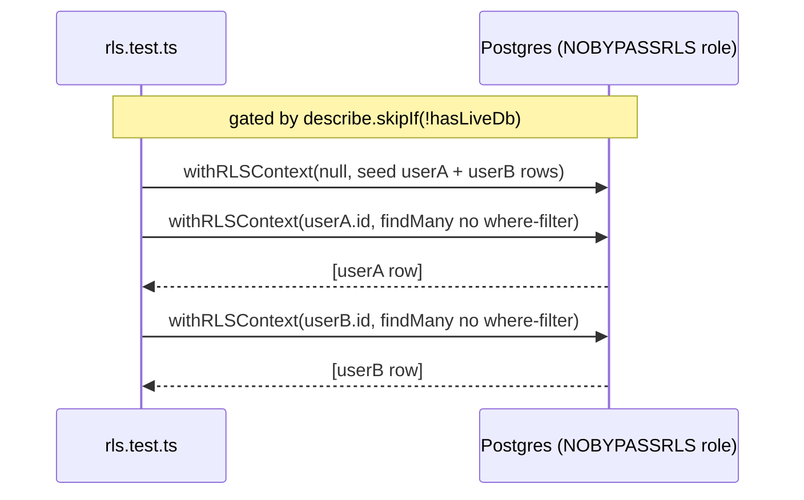

# TESTING_PATTERNS.md

The **how-to-write-a-test** reference for OwnMyHealth. A dev adding a new
controller, route, service, middleware, frontend component, or e2e test can copy
the closest real pattern below without re-reading the whole test tree. Every
non-trivial claim cites `file:line`; every snippet is verbatim from the repo.

> Runner is **Vitest** everywhere (backend `node` env, frontend `jsdom` env) plus
> **Playwright** for e2e. There is no Jest in this repo (`backend/package.json:11-17`,
> root `package.json:12-19`).

## Required reading before generating

Before writing a single line, read:

1. [`_doc-quality.md`](../prompts/_doc-quality.md) — self-containedness, citation, TBD, cross-link, format rules.
2. [`_verification-tools.md`](../prompts/_verification-tools.md) — Grep/Glob/Read cheat sheet.
3. [`_phi-inventory.md`](../prompts/_phi-inventory.md) — tests that touch PHI must respect encryption + audit contracts.

---

## 1. Test pyramid

As of 2026-06-16 (`Glob` counts, verbatim):

| Layer | Count | Glob | Runner / env | What it catches |
|---|---|---|---|---|
| Backend unit + integration (colocated `*.test.ts`) | **54** | `backend/src/**/*.test.ts` | Vitest, `node` (`backend/vitest.config.ts:6`) | Controller/service/middleware/route logic, encryption, RLS-wrap usage, security regressions |
| Frontend unit (`src/__tests__/`) | **25** | `src/__tests__/**/*.test.{ts,tsx}` | Vitest, `jsdom` (`vitest.config.ts:9`) | Component render/interaction, hooks, contexts, util math, PDF/export logic |
| Live-DB RLS regression | 1 of the 54, **gated** | `backend/src/services/rls.test.ts` | Vitest + real Postgres (NOBYPASSRLS) | Tenant isolation, provider-consent policy, FORCE-RLS, audit retention |
| E2E (Playwright) | **5 specs** | `e2e/*.spec.ts` | Playwright/Chromium (`playwright.config.ts:19`) | Full auth + biomarker-entry + export + health-guide + settings flows |

```
        ┌───────────────────────────────────────────────┐
   E2E  │  5 Playwright specs  (e2e/*.spec.ts)           │  slow, real stack
        │  auth / biomarker-entry / data-export /        │  NOT yet in CI (ci.yml:215)
        │  health-guide / settings                       │
        ├───────────────────────────────────────────────┤
  FE U  │  25 frontend Vitest (jsdom)                    │  components/hooks/utils
        │  src/__tests__/**                              │
        ├───────────────────────────────────────────────┤
  BE U  │  54 backend Vitest (node) — colocated *.test.ts│  fast, mocked deps
        │  + 1 live-DB rls.test.ts (skip-if-no-DB)       │  the bulk of the pyramid
        └───────────────────────────────────────────────┘
```

The live-DB integration test (`rls.test.ts`) **skips** when `DATABASE_URL`/
`PHI_ENCRYPTION_KEY` are absent, so unit-only CI runs stay green:

```ts
// Source: backend/src/services/rls.test.ts:27-29
const hasLiveDb = Boolean(process.env.DATABASE_URL) && Boolean(process.env.PHI_ENCRYPTION_KEY);

describe.skipIf(!hasLiveDb)('RLS tenant isolation (withRLSContext)', () => {
```

In CI, the testSetup defaults set `DATABASE_URL` to a stub (`postgresql://localhost/test`,
`backend/src/testSetup.ts:13`), so the live-DB suite would *try* to run under `test:ci` —
which is exactly why `vitest.config.ci.ts` explicitly **excludes** `rls.test.ts` and runs it
in the dedicated `rls` CI job against a real Postgres instead (`backend/vitest.config.ci.ts:18-26`,
`.github/workflows/ci.yml:151-213`).

---

## 2. Runners + commands

### Backend (`backend/package.json:11-17`)

| Script | Command | Use |
|---|---|---|
| `test` | `vitest run` | Run the full colocated suite once (`backend/package.json:11`) |
| `test:watch` | `vitest` | Watch mode (`backend/package.json:12`) |
| `test:coverage` | `vitest run --coverage` | v8 coverage (`backend/package.json:13`) |
| `test:ci` | `vitest run --config vitest.config.ci.ts` | **The real CI command** — runs every colocated `*.test.ts` except `rls.test.ts` (`backend/package.json:14`, `.github/workflows/ci.yml:92-93`) |
| `test:unit` | `vitest run src/__tests__/unit` | **DEAD** — `src/__tests__/unit` does not exist; runs zero tests (`backend/package.json:15`) |
| `test:integration` | `vitest run src/__tests__/integration` | **DEAD** — directory does not exist; runs zero tests (`backend/package.json:16`) |
| `test:rls` | `vitest run src/services/rls.test.ts` | Live-DB RLS suite (`backend/package.json:17`, run by the `rls` CI job `ci.yml:213`) |

> **Run the backend unit suite with `npm run test` (all) or `npm run test:ci` (CI variant) — NOT
> `test:unit`.** `test:unit`/`test:integration` point at `src/__tests__/unit` and
> `src/__tests__/integration`, neither of which exists, so they silently no-op. This was the bug
> that left ~417 colocated tests ungated for a period; the comment block in
> `vitest.config.ci.ts:5-17` documents it.

### Frontend / root (`package.json:12-19`)

| Script | Command | Use |
|---|---|---|
| `test` | `vitest run` | Frontend unit suite once (`package.json:12`) |
| `test:watch` | `vitest` | Watch mode (`package.json:13`) |
| `test:coverage` | `vitest run --coverage` | Coverage (`package.json:14`) |
| `test:ui` | `vitest --ui` | Vitest UI (`package.json:15`) |
| `test:e2e:setup` | `cd backend && npx tsx ../e2e/setup/seed-test-user.ts` | Seed the e2e user (`package.json:16`) |
| `test:e2e` | `npm run test:e2e:setup && playwright test` | **Seeds first, then runs Playwright** (`package.json:17`) |
| `test:e2e:ui` | `playwright test --ui` | Playwright UI (`package.json:18`) |
| `test:e2e:install` | `playwright install chromium` | Install the browser (`package.json:19`) |

See [LOCAL_DEV.md](./LOCAL_DEV.md) *(doc pending — see prompt `../prompts/21-local-dev-doc.md`)* for prerequisites (Postgres, `backend/.env`).

---

## 3. Backend unit test recipe — service functions

Service tests import the real function and assert pure behavior. The encryption
service is the canonical example: it uses the **real** crypto path with a test
`PHI_ENCRYPTION_KEY` (never a plaintext stub), and validates the key contract.

**Reference**: `backend/src/services/encryption.test.ts:1-65`

```ts
// Source: backend/src/services/encryption.test.ts:1-22
import { describe, it, expect, beforeEach, afterEach, vi } from 'vitest';
import crypto from 'crypto';
import { EncryptionService, validateEncryptionKey } from './encryption.js';

vi.mock('../utils/logger.js');

const TEST_PHI_ENCRYPTION_KEY = 'a1b2c3d4e5f6a7b8c9d0e1f2a3b4c5d6e7f8a9b0c1d2e3f4a5b6c7d8e9f0a1b2';

describe('encryption.ts', () => {
  beforeEach(() => {
    vi.resetModules();                                    // fresh singleton per test
    process.env.PHI_ENCRYPTION_KEY = TEST_PHI_ENCRYPTION_KEY;
    process.env.NODE_ENV = 'development';
  });
  afterEach(() => {
    delete process.env.PHI_ENCRYPTION_KEY;
    delete process.env.NODE_ENV;
    vi.clearAllMocks();
  });
```

What this covers:
- Real key validation (`validateEncryptionKey`) for short/non-hex/placeholder keys (`encryption.test.ts:55-70`).
- `vi.resetModules()` in `beforeEach` so the encryption singleton re-reads env (`encryption.test.ts:18`).
- `process.env.PHI_ENCRYPTION_KEY` set to a real 64-hex key, NOT a fake `encrypt → plaintext` stub.

When to copy this pattern: any pure service/util whose behavior depends on env config or crypto.

---

## 4. Controller test recipe

Controllers are tested by mocking `withRLSContext`/`withRLSTransaction` to inject a
mock tx (from `testHelpers.ts`), then asserting on tx-level spies, the audit
service, and the response shape. Mocks are declared **before** the controller
import; shared handles use `vi.hoisted()`.

**Reference**: `backend/src/controllers/biomarkerController.test.ts:38-72, 166-216`

```ts
// Source: backend/src/controllers/biomarkerController.test.ts:38-72
const mocks = vi.hoisted(() => ({
  tx: null as unknown,
  auditService: null as unknown,
  encryptionService: null as unknown,
  config: { anthropic: { baaActive: true, apiKey: 'test-key' } },
  currentUserId: 'test-user-id',
  guidanceTxResult: null as unknown,
}));

vi.mock('../services/database.js', () => ({
  getPrismaClient: vi.fn(() => ({})),
  withRLSContext: vi.fn(async (_userId: unknown, fn: (tx: unknown) => unknown) =>
    fn((mocks.tx as Record<string, unknown>) ?? {})
  ),
  withRLSTransaction: vi.fn(async (_userId: unknown, fn: (tx: unknown) => unknown) => {
    if (mocks.guidanceTxResult !== null) {
      const result = mocks.guidanceTxResult;
      mocks.guidanceTxResult = null;
      return result;
    }
    return fn((mocks.tx as Record<string, unknown>) ?? {});
  }),
}));
```

The `beforeEach` rebuilds the factory mocks and wires them into the hoisted handle,
then a test asserts user-scoping + audit + response:

```ts
// Source: backend/src/controllers/biomarkerController.test.ts:170-209
beforeEach(() => {
  vi.clearAllMocks();
  tx = createMockPrismaTransaction();
  audit = createMockAuditService();
  mocks.tx = tx;
  mocks.auditService = audit;
  mocks.encryptionService = createMockEncryptionService();
});

it('scopes the findMany to the authenticated userId', async () => {
  tx.biomarker.count.mockResolvedValue(3);
  tx.biomarker.findMany.mockResolvedValue([ /* makeBiomarkerRow ... */ ]);
  const req = createMockRequest({ user: { id: 'user-A', email: 'a@example.com', role: 'PATIENT' }, query: {} });
  const res = createMockResponse();
  await getBiomarkers(req, res);
  const findManyArg = tx.biomarker.findMany.mock.calls[0][0];
  expect(findManyArg.where).toEqual({ userId: 'user-A' });
  expect(audit.logAccess).toHaveBeenCalledWith(
    'Biomarker', undefined, expect.any(Object),
    expect.objectContaining({ operation: 'LIST', count: 3 }),
  );
});
```

What this covers:
- Mocks `withRLSContext`/`withRLSTransaction` to inject a `createMockPrismaTransaction()` tx — never the module-level Prisma client.
- Asserts the controller user-scopes the query (`findManyArg.where`).
- Asserts the audit service was called with the right method/action.
- Imports the controller **after** the `vi.mock` block (`biomarkerController.test.ts:154-161`).

When to copy this pattern: any new controller function.

### How a controller test "respects RLS"

The controller never sees raw Prisma — it goes through `withRLSContext`/
`withRLSTransaction` (`backend/src/services/database.ts`, see [ARCHITECTURE.md](./ARCHITECTURE.md)).
In a unit test you **mock those wrappers** to run the callback against a mock tx
(`biomarkerController.test.ts:57-72`). That proves the controller (a) routes through the RLS
wrapper and (b) user-scopes its query — without a DB. The *enforcement* of RLS itself is proven
separately in `rls.test.ts` (§7) against a live NOBYPASSRLS Postgres.

---

## 5. Route (integration) test recipe

Route tests mount the **real router** on a minimal Express app and drive it with
**supertest**, stubbing only the auth/rate-limit/demo/plan middleware so the
request reaches the handler. They assert HTTP status + body + that no PHI/network
egress happened on the deny path.

**Reference**: `backend/src/routes/biomarkerRoutes.guidance.test.ts:144-212`

```ts
// Source: backend/src/routes/biomarkerRoutes.guidance.test.ts:139-150
import express from 'express';
import request from 'supertest';
import biomarkerRouter from './biomarkerRoutes.js';
import { errorHandler } from '../middleware/errorHandler.js';

function buildApp() {
  const app = express();
  app.use(express.json());
  app.use('/api/v1/biomarkers', biomarkerRouter);
  app.use(errorHandler);                 // real centralized error handler
  return app;
}
```

```ts
// Source: backend/src/routes/biomarkerRoutes.guidance.test.ts:188-212
it('returns 503 and never calls fetch when baaActive is false', async () => {
  mocks.config.anthropic.baaActive = false;
  const app = buildApp();
  const res = await request(app)
    .post(`/api/v1/biomarkers/${validUuid()}/guidance`)
    .send({});
  expect(res.status).toBe(503);
  expect(res.body).toMatchObject({
    success: false,
    error: { code: 'SERVICE_UNAVAILABLE', message: expect.stringContaining('ANTHROPIC_BAA_ACTIVE') },
  });
  expect(mocks.fetchMock).not.toHaveBeenCalled();         // no network egress
  expect(mocks.withRLSTransaction).not.toHaveBeenCalled(); // no DB read
  expect(mocks.logAccess).toHaveBeenCalledWith(
    'biomarker_ai_guidance', validUuid(), expect.any(Object),
    expect.objectContaining({ operation: 'GUIDANCE_BLOCKED_NO_BAA' }),
  );
});
```

```
supertest(request) ──POST /api/v1/biomarkers/:id/guidance──▶ buildApp()
                                                                 │
   express.json() ─▶ biomarkerRouter (real) ─▶ stubbed authenticate/aiLimiter/blockDemoAI
                                                                 │
                                          inline guidance handler (biomarkerRoutes.ts)
                                                                 │
                          ◀── 503 SERVICE_UNAVAILABLE ── errorHandler (real, ci.yml-gated)
```

What this covers:
- Real router + real `errorHandler`; everything else mocked at the module boundary.
- BAA gate (503) + IDOR 404 (`guidance.test.ts:215-228`) + happy path, all via HTTP.
- Asserts deny paths do **not** touch the DB or the Anthropic client.

Other route exemplars: `adminRoutes.demoProtection.test.ts`, `adminRoutes.updateUser.test.ts`,
`internalRoutes.test.ts`, `providerRoutes.requestUniformity.test.ts`,
`providerRoutes.insurance.test.ts`, `healthNeedsRoutes.statusUpdate.test.ts`,
`authRoutes.logout.test.ts` (all under `backend/src/routes/`). Middleware chains a routed
test should exercise are documented in [ROUTING_TABLE.md](./ROUTING_TABLE.md)
*(doc pending — see prompt `../prompts/16-routing-table-doc.md`)*.

When to copy this pattern: any route whose behavior lives in middleware ordering, status
codes, or an inline handler (not a named controller export).

---

## 6. Middleware test recipe

Middleware tests call the middleware **directly** with hand-built `req`/`res`/`next`
stubs and assert on `next(err)` / `res.status`. The two highest-value security
middlewares are `aiSpendGuard` (AI dollar spend cap / 503 fail-closed) and
`planGating` (plan-tier limit enforcement).

> Do **not** look for `rbac.test.ts` — the rbac parallel-authz cluster and its tests were
> removed (L-26). There is no `backend/src/middleware/rbac.test.ts`.

### 6a. `aiSpendGuard` — 503 fail-closed (complete file)

**Reference**: `backend/src/middleware/aiSpendGuard.test.ts:1-95` (full file)

```ts
// Source: backend/src/middleware/aiSpendGuard.test.ts:9-32
import { afterEach, beforeEach, describe, expect, it, vi } from 'vitest';
import type { Request, Response, NextFunction } from 'express';

const mocks = vi.hoisted(() => ({ admitAISpend: vi.fn() }));
vi.mock('../services/aiCostTracker.js', () => ({ admitAISpend: mocks.admitAISpend }));
vi.mock('../utils/logger.js', () => ({ logger: { warn: vi.fn(), error: vi.fn() } }));

import { aiSpendGuard } from './aiSpendGuard.js';
import { ServiceUnavailableError } from './errorHandler.js';

function makeReq(userId?: string): Request {
  return { user: userId ? { id: userId } : undefined, path: '/ai/chat' } as unknown as Request;
}
function makeRes(): Response & { handlers: Record<string, () => void> } {
  const handlers: Record<string, () => void> = {};
  return {
    handlers,
    on: vi.fn((event: string, listener: () => void) => { handlers[event] = listener; }),
  } as unknown as Response & { handlers: Record<string, () => void> };
}
```

```ts
// Source: backend/src/middleware/aiSpendGuard.test.ts:84-94
it('fails CLOSED with a 503 when the shared store errors', async () => {
  mocks.admitAISpend.mockRejectedValueOnce(new Error('redis down'));
  const res = makeRes();
  const next = vi.fn() as unknown as NextFunction;
  await aiSpendGuard(makeReq('u1'), res, next);
  const err = (next as ReturnType<typeof vi.fn>).mock.calls[0][0];
  expect(err).toBeInstanceOf(ServiceUnavailableError);
  expect(res.on).not.toHaveBeenCalled(); // no settle registered on error
});
```

What this covers: no-user pass-through (`:38`), admit + settle on `finish`/`close` (`:46`),
refuse user/global scope (`:60`,`:73`), and **fail-closed on store error** (`:84`). The deleted
refuse-branch mutation this test was written to kill is described at `aiSpendGuard.test.ts:1-7`.

### 6b. `planGating` — plan-tier limit enforcement

The real middleware + `checkPlanLimit` + `getUserUsage` run against a **mocked
`withRLSContext`** (it does NOT stub `planGating` itself — that would assert nothing).

**Reference**: `backend/src/middleware/planGating.test.ts:14-74`

```ts
// Source: backend/src/middleware/planGating.test.ts:25-34
vi.mock('../services/database.js', () => ({
  // Run the callback against the shared mock tx, ignoring the RLS userId.
  withRLSContext: (_userId: string, fn: (tx: unknown) => unknown) => fn(mocks.tx),
}));
import { requirePlanLimit } from './planGating.js';
```

```ts
// Source: backend/src/middleware/planGating.test.ts:54-74
it('403 PLAN_LIMIT_EXCEEDED when a FREE user is at the maxBiomarkers cap', async () => {
  mocks.tx.biomarker.count.mockResolvedValue(50);
  const { req, res, next, status, json } = harness('u1');
  await requirePlanLimit('maxBiomarkers')(req, res, next);
  expect(next).not.toHaveBeenCalled();
  expect(status).toHaveBeenCalledWith(403);
  expect(json).toHaveBeenCalledWith(expect.objectContaining({
    error: expect.objectContaining({
      code: 'PLAN_LIMIT_EXCEEDED', feature: 'maxBiomarkers',
      limit: 50, current: 50, upgradeRequired: true,
    }),
  }));
});
```

What this covers: the 403 cap, the under-cap pass (`:76`), the expired-paid-plan downgrade to
FREE limits (`:86`), and the no-user bypass. `maxBiomarkers` + `insurancePlans` are now enforced;
`planGating` fails CLOSED to FREE on a DB error.

### 6c. Other middleware exemplars

| Middleware | File | What it pins |
|---|---|---|
| CSRF | `backend/src/middleware/csrf.test.ts:52-...` | Upload routes NOT exempt (throws `ForbiddenError`); bearer-only `/ai/chat` exemption still works (`csrf.test.ts:1-13`) |
| Error handler | `backend/src/middleware/errorHandler.test.ts` | Centralized error → sanitized response (see [ERROR_RECOVERY.md](./ERROR_RECOVERY.md)) |
| Rate-limit store | `backend/src/middleware/rateLimitStore.test.ts` | Shared store keying / window math |
| Validation (Zod) | `backend/src/middleware/validation.test.ts`, `validation.healthNeed.test.ts` | Boundary input rejection |

CSRF middleware is invoked synchronously and its throw is caught in-test:

```ts
// Source: backend/src/middleware/csrf.test.ts:38-50
function callMiddleware(req: Request): { error: unknown; nextCalled: boolean } {
  let nextCalled = false;
  let error: unknown = null;
  const next: NextFunction = () => { nextCalled = true; };
  try { validateCsrfToken(req, {} as Response, next); } catch (e) { error = e; }
  return { error, nextCalled };
}
```

When to copy these patterns: any middleware — build `req`/`res`/`next` stubs, call directly,
assert on `next(err)` instance type or `res.status`.

[ERROR_RECOVERY.md](./ERROR_RECOVERY.md) *(doc pending — see prompt `../prompts/19-error-recovery-doc.md`)* documents which error paths are worth asserting.

---

## 7. Service test recipe (RLS-aware)

There is **no** `asUser`/`asAdmin` wrapper helper in the repo today. The real RLS
test calls `withRLSContext(userId, fn)` and `withRLSContext(null, fn)` (admin
context) **directly**, and the whole suite is gated by `describe.skipIf(!hasLiveDb)`
because it needs a live Postgres with migration `20260107_add_rls_policies` applied.

**Reference**: `backend/src/services/rls.test.ts:1-540` (full live-DB suite)

Seed both tenants' rows via the **admin context** (`withRLSContext(null, …)`):

```ts
// Source: backend/src/services/rls.test.ts:60-98
await withRLSContext(null, async (tx) => {
  await tx.user.create({ data: { id: userA.id, email: userA.email, passwordHash: 'test-hash-not-used' } });
  await tx.user.create({ data: { id: userB.id, email: userB.email, passwordHash: 'test-hash-not-used' } });
  await tx.biomarker.create({
    data: {
      userId: userA.id, category: 'test', name: markerNames[0], unit: 'test',
      valueEncrypted: 'ct-a', normalRangeMin: 0, normalRangeMax: 1, measurementDate: new Date(),
    },
  });
  await tx.biomarker.create({
    data: {
      userId: userB.id, category: 'test', name: markerNames[1], unit: 'test',
      valueEncrypted: 'ct-b', normalRangeMin: 0, normalRangeMax: 1, measurementDate: new Date(),
    },
  });
});
```

**Cross-user isolation** — the queries intentionally OMIT a `where: { userId }` filter, so a
leak surfaces if RLS were off:

```ts
// Source: backend/src/services/rls.test.ts:228-242
it('user A sees only their row when no where-filter is applied', async () => {
  const rows = await withRLSContext(userA.id, async (tx) =>
    tx.biomarker.findMany({ where: { name: { in: markerNames } } }));
  expect(rows).toHaveLength(1);
  expect(rows[0].userId).toBe(userA.id);
});

it('user B sees only their row when no where-filter is applied', async () => {
  const rows = await withRLSContext(userB.id, async (tx) =>
    tx.biomarker.findMany({ where: { name: { in: markerNames } } }));
  expect(rows).toHaveLength(1);
  expect(rows[0].userId).toBe(userB.id);
});
```

Beyond plain tenant isolation, the suite also proves: admin context sees both tenants (`:244`),
no cross-call pool leakage (`:251`), consented provider reads via `has_provider_access` (`:296-389`),
FORCE-RLS on every table (`:393-407`), DB-enforced 7-year audit retention (`:410-427`), and
consent-column immutability (L23) + audit-insert check (L40) (`:436-539`).



### `asUser` helper — what it would do (proposed, does NOT exist yet)

If you want a thin convenience wrapper, label it explicitly as proposed and align it with
`database.ts`:

```ts
// Proposed (does NOT exist in the repo) — a thin alias over withRLSContext:
export async function asUser<T>(userId: string, fn: (tx: PrismaTx) => Promise<T>): Promise<T> {
  return withRLSContext(userId, fn);
}
```

`asUser(userId, fn)` would run `fn` inside a transaction that carries `SET LOCAL app.current_user_id`,
so RLS policies scope every query to `userId` — the difference from calling Prisma directly is that
a bare `prisma.biomarker.findMany()` runs on a connection **without** that `SET LOCAL`, so the policy
matches against NULL and isolation breaks (this exact failure mode is what `rls.test.ts:1-12` and
CLAUDE.md's RLS section warn against). Today, write `withRLSContext(userId, fn)` directly.

The `rls` CI job runs this suite against a real Postgres as a NOBYPASSRLS role
(`.github/workflows/ci.yml:155-213`) — that is what gates it from running in unit-only CI.

---

## 8. Frontend unit test recipe

Vitest (`jsdom`) + React Testing Library. Tests live under `src/__tests__/`
(NOT colocated). Global stubs for `matchMedia`/`ResizeObserver`/
`IntersectionObserver`/`localStorage`/`scrollTo` are in the setup file
(`src/__tests__/setup.ts:8-63`).

**Reference**: `src/__tests__/components/Button.test.tsx:1-56` (full file)

```tsx
// Source: src/__tests__/components/Button.test.tsx:7-36
import { describe, it, expect, vi } from 'vitest';
import { render, screen, fireEvent } from '@testing-library/react';
import React from 'react';

describe('Button Component', () => {
  it('should render with text', () => {
    render(<TestButton>Click Me</TestButton>);
    expect(screen.getByText('Click Me')).toBeInTheDocument();
  });

  it('should call onClick when clicked', () => {
    const handleClick = vi.fn();
    render(<TestButton onClick={handleClick}>Click Me</TestButton>);
    fireEvent.click(screen.getByText('Click Me'));
    expect(handleClick).toHaveBeenCalledTimes(1);
  });
});
```

What this covers: render assertion (`getByText` + `toBeInTheDocument`), click handler spy via
`vi.fn()` + `fireEvent`, disabled-state assertion. `@testing-library/jest-dom` matchers come from
`src/__tests__/setup.ts:8`.

Frontend tests with real component coverage (selected from the 25):
`AdminPage`, `BiomarkerSummary`, `CareTeamPage`, `LoginPage`, `RegisterPage`, `Dashboard`,
`AddMeasurementModal`, `MyPatientsPage`, `LabConnectionsSection`, `TrendsPage`,
`ConfirmEmailChangePage`, `a11yScreenReader` (components); `useAuth`, `useBiomarkerData` (hooks);
`AuthContext` (context); `healthNeeds` (api service); plus utils (`exportBiomarkers`,
`pdfReportGenerator`, `dateNormalizer`, `trendCalculations`, `extractionReview`, `frameGuard`,
`pdfWorker`) and a build test (`rewriteCspConnectSrc`). All paths under `src/__tests__/`.

When to copy this pattern: any component/hook/util. Put the file under `src/__tests__/`,
import RTL, render, query by role/text, assert.

---

## 9. E2E test recipe (Playwright)

Specs live under `e2e/*.spec.ts`, run against a locally-running dev stack
(backend `:3001`, frontend `:5173`) that Playwright auto-starts via `webServer`
(`playwright.config.ts:50-64`). The 5 specs cover **auth, biomarker-entry,
data-export, health-guide, settings**.

Auth is centralized in `e2e/helpers/auth.ts` — never hardcode creds inline:

```ts
// Source: e2e/helpers/auth.ts:18-45
export const TEST_USER = {
  email: 'e2e-test@ownmyhealth.io',
  password: 'E2ETestPass123!',
};

export async function loginAsTestUser(page: Page): Promise<void> {
  await page.goto('/');
  await expect(page.getByRole('heading', { name: /welcome back/i })).toBeVisible({ timeout: 10_000 });
  await page.getByLabel(/email/i).first().fill(TEST_USER.email);
  await page.getByLabel(/password/i).first().fill(TEST_USER.password);
  await page.getByRole('button', { name: /^sign in$/i }).click();
  await expect(page.getByRole('heading', { name: /welcome back,|^dashboard$/i }).first())
    .toBeVisible({ timeout: 15_000 });
}
```

A full spec imports that helper in `beforeEach` and drives the real UI:

```ts
// Source: e2e/biomarker-entry.spec.ts:11-28
import { test, expect } from '@playwright/test';
import { loginAsTestUser } from './helpers/auth';

test.describe('Biomarker manual entry', () => {
  test.beforeEach(async ({ page }) => { await loginAsTestUser(page); });

  test('add a biomarker manually and confirm it appears on the dashboard', async ({ page }) => {
    await page.getByRole('button', { name: /add (measurement|manually)/i }).first().click();
    await expect(page.getByRole('heading', { name: /add measurement/i })).toBeVisible();
    // ... fill value/date, save, assert it appears ...
  });
});
```

### Seed-test-user helper

The seed script is at **`e2e/setup/seed-test-user.ts`**. It is idempotent (creates or refreshes
the user) and is run automatically by `npm run test:e2e` via the `test:e2e:setup` script
(`package.json:16-17`). It seeds `emailVerified: true`, `plan: 'PRO'`, and
`onboardingCompletedAt: now` so plan-gating / email-gate / onboarding don't block flow tests:

```ts
// Source: e2e/setup/seed-test-user.ts:42-61
const existing = await prisma.user.findUnique({ where: { email: EMAIL } });
if (existing) {
  await prisma.user.update({
    where: { email: EMAIL },
    data: {
      plan: 'PRO', planExpiresAt: null, planUpdatedAt: new Date(),
      emailVerified: true, isActive: true, lockedUntil: null,
      failedLoginAttempts: 0, onboardingCompletedAt: new Date(),
    },
  });
  console.log(`[seed] Refreshed existing E2E user: ${EMAIL}`);
  return;
}
```

E2E is **not yet wired into CI** — the `e2e-tests` job is commented out pending staging DB
(`.github/workflows/ci.yml:215-239`); see [KNOWN_ISSUES.md](./KNOWN_ISSUES.md).

When to copy this pattern: any new full-flow test. Import `loginAsTestUser`, use a `test.describe`
+ `beforeEach`, query by role/label, assert visible DOM (the SPA does not change URL on login —
`auth.ts:1-14`).

---

## 10. Mock catalog

There are **no `__mocks__/` directories** in this repo. Backend tests mock two ways:
(1) inline `vi.mock('../services/...')` declared **before** the module-under-test import
(often via `vi.hoisted()` so the same handle is shared across describe blocks —
`biomarkerController.test.ts:38-72`), and (2) the reusable factory functions in
`backend/src/controllers/testHelpers.ts`.

| Dependency | Real source | How to use |
|---|---|---|
| Prisma tx | `createMockPrismaTransaction()` (`controllers/testHelpers.ts:48-82`) | Returns a mock tx whose every model exposes `findMany/findFirst/findUnique/create/createMany/update/updateMany/delete/deleteMany/count` (`testHelpers.ts:49-60`) for User, Biomarker, InsurancePlan, etc. Inject via the `withRLSContext`/`withRLSTransaction` mock. Note: it also defines a stale `conversationHistory` spy (`testHelpers.ts:79`) for a model that does not exist in `schema.prisma` — harmless dead helper state. |
| Audit log | `createMockAuditService()` (`controllers/testHelpers.ts:87-97`) | Spies for `logAccess/logCreate/logUpdate/logDelete/logAuth/logExport/logSystem`. Assert the right method was called. |
| Encryption | `createMockEncryptionService()` (`controllers/testHelpers.ts:106-114`) | Deterministic `encrypt → enc:<value>` / `decrypt` reverse (+ master-key + salt variants); assert values were encrypted before persistence. |
| Anthropic client | inline `vi.mock('../services/anthropicClient.js')` (`biomarkerController.test.ts:97-111`, `biomarkerRoutes.guidance.test.ts:125-136`) | Stub `getAnthropicClient` to return `{ messages: { create } }`; the route uses the shared `anthropicClient` SDK, not raw `fetch`. See also `claudeExtraction.test.ts`, `sbcExtraction.test.ts`. |
| SendGrid / email | inline `vi.mock` of `@sendgrid/mail` / `services/emailService` (see `schedulers/emailScheduler.test.ts`) | No-op send; assert on the send spy. |
| GCS / Document AI OCR | inline `vi.mock` of `services/storageService` / `services/ocrService` | In-memory buffer / fixed OCR text per fixture. |
| FHIR SSRF guard | **real (no mock)** — `services/fhir/urlSafety.test.ts` | Asserts disallowed hosts/IPs are rejected before any outbound request. |
| AI cost/spend | **real (no mock)** — `services/aiCostTracker.test.ts` | Asserts reserve-first per-user/global budget accounting used by `aiSpendGuard`. |

The Anthropic stub at the boundary, verbatim:

```ts
// Source: backend/src/routes/biomarkerRoutes.guidance.test.ts:125-136
vi.mock('../services/anthropicClient.js', () => ({
  getAnthropicClient: vi.fn(() => ({
    messages: {
      create: (...args: unknown[]) => {
        mocks.fetchMock(...args);          // "did the network call happen"
        return mocks.messagesCreate(...args); // canned SDK response per test
      },
    },
  })),
  isEnabled: () => Boolean(process.env.ANTHROPIC_API_KEY),
  reset: vi.fn(),
}));
```

> A `__mocks__/`-directory recipe is **not present** in this repo. If you introduce one,
> label it explicitly as not-yet-present and prefer the inline + factory approach above for
> consistency.

---

## 11. Security-domain test recipes

| Concern | File | What it asserts |
|---|---|---|
| FHIR SSRF guard | `backend/src/services/fhir/urlSafety.test.ts:6-66` | Same-host allow, relative-resolve, **different-host reject**, cloud-metadata reject, cleartext-http reject, non-http scheme reject, auth-host allowlist |
| AI cost / budget | `backend/src/services/aiCostTracker.test.ts:1-...` | Reserve-first semantics across `InMemorySpendStore` + `RedisSpendStore` (faithful fake ioredis), atomic reserve/refund |
| AI spend-cap 503 | `backend/src/middleware/aiSpendGuard.test.ts:1-95` | Refuse user/global + **fail-closed on store error** (see §6a) |
| Plan-limit enforcement | `backend/src/middleware/planGating.test.ts:1-...` | 403 cap, expired-plan downgrade, fail-closed to FREE (see §6b) |
| Provider-access choke point | `backend/src/services/providerAccess.test.ts:1-44` | Every denial reason in `resolveProviderAccess`; the REQUIRED flag drives the check; denied flag short-circuits before the patient row loads |
| Provider request uniformity | `backend/src/routes/providerRoutes.requestUniformity.test.ts` | Identical responses regardless of patient existence (no enumeration oracle) |
| Internal/cron endpoints | `backend/src/routes/internalRoutes.test.ts` | Token-gated cleanup/scheduler endpoints |
| Schema↔PHI_FIELDS guard | `backend/src/services/phiFieldsCoverage.test.ts:1-172` | Two-way sync of every `*Encrypted` column ↔ PHI_FIELDS + plaintext-PHI-twin guard (see §13) |
| Server-side AI disclaimer | `backend/src/utils/aiDisclaimer.test.ts` | Disclaimer appended server-side, not trusted from client |
| Filename PHI encrypt/decrypt | `backend/src/utils/userFileNames.test.ts` | `originalFilename` round-trips through per-user AES-GCM (L24) |
| FHIR sync idempotency | `backend/src/services/fhir/labSyncService.sync.test.ts` | Re-sync does not duplicate biomarkers (dedup on `sourceFile`) |

The FHIR SSRF guard, verbatim (real — no mock):

```ts
// Source: backend/src/services/fhir/urlSafety.test.ts:20-30
it('rejects an absolute URL on a DIFFERENT host (SSRF / token exfil)', () => {
  expect(() =>
    assertAllowedFhirUrl('https://evil.example.com/steal', { baseUrl: BASE })
  ).toThrow(/not the trusted FHIR host/i);
});

it('rejects the cloud metadata endpoint', () => {
  expect(() =>
    assertAllowedFhirUrl('http://169.254.169.254/latest/meta-data/', { baseUrl: BASE })
  ).toThrow();
});
```

---

## 12. Fixture + factory conventions

| Need | Tool | Source |
|---|---|---|
| Mock authenticated request | `createMockRequest(overrides)` | `controllers/testHelpers.ts:14-27` |
| Mock Express response | `createMockResponse()` (chainable `status/json/setHeader/write/end/send`) | `controllers/testHelpers.ts:30-39` |
| Mock Prisma tx (all models) | `createMockPrismaTransaction()` | `controllers/testHelpers.ts:48-82` |
| Mock audit service | `createMockAuditService()` | `controllers/testHelpers.ts:87-97` |
| Mock encryption service | `createMockEncryptionService()` | `controllers/testHelpers.ts:106-114` |
| Inline row builders | per-test `makeBiomarkerRow` / `cannedBiomarkerRow` / `relRow` | `biomarkerController.test.ts`, `biomarkerRoutes.guidance.test.ts:156-170`, `providerAccess.test.ts:22-40` |
| Seed e2e user | `e2e/setup/seed-test-user.ts` (idempotent, run by `test:e2e`) | `seed-test-user.ts:32-80` |

There are **no** `fixtures/`, `factories/`, or `__mocks__/` source directories — `e2e/fixtures/`
holds only a README. The shared factory module is `testHelpers.ts` (named non-`*.test.ts` so
Vitest does not treat it as a test — `testHelpers.ts:1-7`). For DB-backed factories (rls test),
seed via the admin context as in §7. Tables the factories model are documented in
[DATA_MODEL.md](./DATA_MODEL.md) *(doc pending — see prompt `../prompts/15-data-model-doc.md`)*.

`createMockPrismaTransaction` model-method set, verbatim:

```ts
// Source: backend/src/controllers/testHelpers.ts:48-60
export function createMockPrismaTransaction() {
  const modelMethods = () => ({
    findMany: vi.fn(), findFirst: vi.fn(), findUnique: vi.fn(),
    create: vi.fn(), createMany: vi.fn(),
    update: vi.fn(), updateMany: vi.fn(),
    delete: vi.fn(), deleteMany: vi.fn(), count: vi.fn(),
  });
  // ...one entry per model (user, biomarker, insurancePlan, ...)
```

---

## 13. PHI-aware test conventions

Rules: **never print decrypted PHI; always use the real encryption path with a test
`PHI_ENCRYPTION_KEY` (not a plaintext stub) in service tests; assert that values are encrypted
before persistence.** See [`_phi-inventory.md`](../prompts/_phi-inventory.md). PHI canonical
state: PHI_FIELDS covers **14 models / 39 encrypted fields** (`encryption.ts:476-562`); the schema
has 39 matching `*Encrypted` columns.

The canonical guard is `phiFieldsCoverage.test.ts` — it parses `schema.prisma`, extracts every
`*Encrypted` column per model, and asserts an **exact two-way match** against `PHI_FIELDS`,
failing the build on drift in either direction. It also enforces a plaintext-PHI-twin rule (M5):

```ts
// Source: backend/src/services/phiFieldsCoverage.test.ts:120-135
it('every *Encrypted column in schema.prisma is registered in PHI_FIELDS', () => {
  const missing: string[] = [];
  for (const [model, fields] of Object.entries(schemaModels)) {
    const registered = new Set(phiFields[model] ?? []);
    for (const field of fields) {
      if (!registered.has(field)) missing.push(`${model}.${field}`);
    }
  }
  expect(missing, `Encrypted column(s) missing from PHI_FIELDS ...`).toEqual([]);
});
```

```ts
// Source: backend/src/services/phiFieldsCoverage.test.ts:107-110
const PLAINTEXT_PHI_REQUIRING_TWIN: Record<string, string[]> = {
  HealthGoal: ['targetValue', 'currentValue', 'startValue'],
  GoalProgressHistory: ['value'],
};
```

This guard was extended after the L24 filename-encryption, M4 goal-value, and M6 audit-metadata
work, so `PHI_FIELDS` now covers `UserFile.originalFilenameEncrypted`,
`HealthGoal.{current,start,target}ValueEncrypted`, `GoalProgressHistory.valueEncrypted`, and
`AuditLog.metadataEncrypted` (`encryption.ts:499-530`). It cannot prove a value is actually
encrypted at its controller write site — that stays a manual review item
(`phiFieldsCoverage.test.ts:23-25`).

**Asserting equality on encrypted fields**: do not compare against a plaintext value. Either
(a) in controller tests use the deterministic mock (`encrypt → enc:<value>`) and assert the
ciphertext form, e.g. `valueEncrypted: 'enc:120'` (`biomarkerController.test.ts:186`); or
(b) in service tests use the real encrypt→decrypt round-trip with the test key
(`encryption.test.ts:20`). In the live RLS suite, rows store literal placeholder ciphertext
(`valueEncrypted: 'ct-a'`) and are **never decrypted** (`rls.test.ts:81`,
`.github/workflows/ci.yml:184-188`).

See [PHI_TAXONOMY.md / DATA_MODEL.md](./DATA_MODEL.md) *(doc pending — see prompt `../prompts/15-data-model-doc.md`)* for the full field × encryption map.

---

## 14. Bad vs good examples

| Category | ❌ Bad pattern | ✅ Good pattern |
|---|---|---|
| Controller test | Hand-rolls a bespoke Prisma stub per test | Uses `createMockPrismaTransaction()` (`testHelpers.ts:48`); mocks `withRLSContext`/`withRLSTransaction` to inject it; asserts tx-level + audit spies (`biomarkerController.test.ts:170-209`) |
| Controller test | Asserts `value: 120` against an encrypted field | Asserts the encrypted form `valueEncrypted: 'enc:120'` via the deterministic mock (`biomarkerController.test.ts:186`) |
| Route test | Issues raw SQL to set up state | supertest against a minimal Express app + shared mocks (`biomarkerRoutes.guidance.test.ts:144-150`) |
| Route test | Skips the error handler so failures look like 500s | Mounts the real `errorHandler` so status/body match prod (`biomarkerRoutes.guidance.test.ts:148`) |
| Service test | Stubs encryption to return plaintext | Real encryption path with a test `PHI_ENCRYPTION_KEY` (`encryption.test.ts:20`) |
| Middleware test | Stubs `planGating` itself (asserts nothing) | Runs the real middleware against a mocked `withRLSContext` (`planGating.test.ts:25-34`) |
| RLS test | Adds a `where: { userId }` filter that hides whether RLS works | Omits the filter; gates on `describe.skipIf(!hasLiveDb)` against a live DB (`rls.test.ts:29, 228-242`) |
| E2E | Hardcodes test creds inline | Imports `TEST_USER`/`loginAsTestUser` from `e2e/helpers/auth.ts`; seeds via `e2e/setup/seed-test-user.ts` (run by `test:e2e`) (`auth.ts:18-45`) |

---

## Related Documents

- [ARCHITECTURE.md](./ARCHITECTURE.md) — the layers being tested (controllers, services, RLS wrappers, middleware stack).
- [KNOWN_ISSUES.md](./KNOWN_ISSUES.md) — missing-test gaps (e.g. e2e not in CI) worth prioritizing.
- [DATA_MODEL.md](./DATA_MODEL.md) *(doc pending — see prompt `../prompts/15-data-model-doc.md`)* — tables used by factories + RLS policies.
- [ROUTING_TABLE.md](./ROUTING_TABLE.md) *(doc pending — see prompt `../prompts/16-routing-table-doc.md`)* — middleware chains a routed test must exercise.
- [ERROR_RECOVERY.md](./ERROR_RECOVERY.md) *(doc pending — see prompt `../prompts/19-error-recovery-doc.md`)* — error paths worth asserting.
- [LOCAL_DEV.md](./LOCAL_DEV.md) *(doc pending — see prompt `../prompts/21-local-dev-doc.md`)* — how to run the suites locally.

---

## Prompt drift log

- `../prompts/38-testing-patterns-doc.md` and `_doc-quality.md` instruct cross-linking to
  `DATA_MODEL.md`, `ROUTING_TABLE.md`, `ERROR_RECOVERY.md`, and `LOCAL_DEV.md`. At the time of this
  generation run (HEAD `fb2cd32`), only `ARCHITECTURE.md` and `KNOWN_ISSUES.md` exist in
  `New Project Documents/` (`Glob "New Project Documents/*.md"`). Per `_doc-quality.md:270`, the
  not-yet-present siblings are written with the `(doc pending — see prompt …)` form rather than as
  live links, to avoid linking to docs that do not yet exist in this run's output set.
- The prompt's §1 says "54 backend `*.test.ts`, 25 frontend tests, 5 Playwright e2e specs" — all
  three confirmed exactly by `Glob` (`backend/src/**/*.test.ts` = 54; `src/__tests__/**/*.test.{ts,tsx}`
  = 25; `e2e/*.spec.ts` = 5). No drift.
- The root `CLAUDE.md` "Testing" / structure section is stale in places the canonical fact digest
  corrects (e.g. it predates `vitest.config.ci.ts`, the `test:ci` script, and the removal of
  `rbac.test.ts`). This doc follows the live code and the fact digest, not `CLAUDE.md`.
- The fact digest notes "14 models / 39 encrypted fields" as the canonical PHI count and also
  contains an internal inline tally of "37" in one prose paragraph; this doc uses the canonical
  **39** (the task's CANONICAL NUMBERS line and `encryption.ts:476-562`). Not load-bearing for any
  test recipe here.
