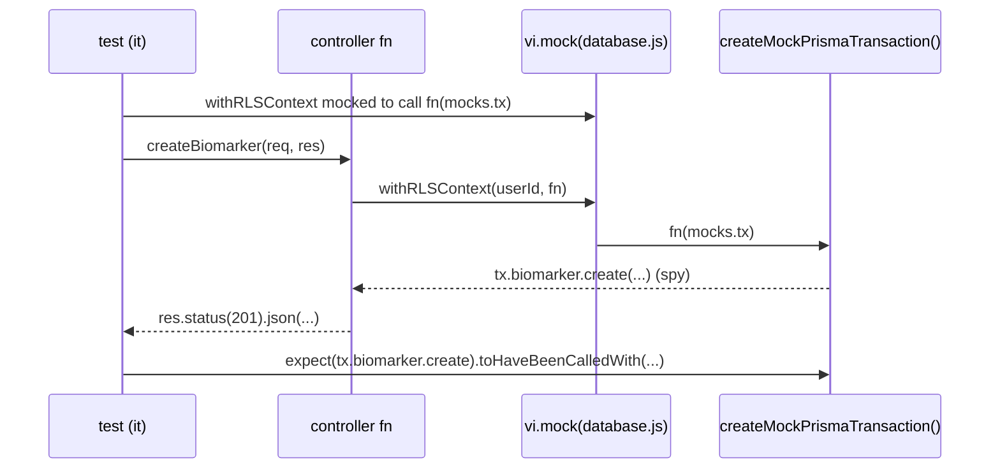

# TESTING_PATTERNS.md

> **Scope**: The how-to-write-a-test reference for OwnMyHealth. A dev adding a new controller / route / service / middleware / frontend component / e2e test should be able to copy the nearest real pattern below without re-reading the whole test tree.
> **Generated**: 2026-06-01. Counts and line citations verified against the repo on that date.
> **Quality bar**: this doc follows [`_doc-quality.md`](../prompts/_doc-quality.md) — every non-trivial claim cites `file:path:line`; snippets are verbatim with a `// Source:` marker.

---

## 1. Test pyramid

Three runners, three scopes. All three are **Vitest or Playwright — there is no Jest in this repo** (`backend/package.json:11`, root `package.json:12`, `playwright.config.ts:13`).

```
            ┌─────────────────────────────────────┐
   e2e      │  5 Playwright specs (e2e/*.spec.ts)  │  real browser + real backend + live DB
            │  auth, biomarker-entry, data-export, │  seeded user, ~minutes, 1 worker
            │  health-guide, settings             │
            └─────────────────────────────────────┘
        ┌───────────────────────────────────────────────┐
  integ │  Route tests (supertest) + rls.test.ts          │  Express app or live Postgres
        │  biomarkerRoutes.guidance, internalRoutes,      │  rls.test.ts skips w/o DB
        │  providerRoutes.requestUniformity, adminRoutes  │
        └───────────────────────────────────────────────┘
    ┌─────────────────────────────────────────────────────────┐
unit│  34 backend *.test.ts (colocated) + 14 frontend tests     │  pure functions / mocked deps
    │  controllers, services, middleware, utils, schedulers,    │  jsdom (FE) / node (BE)
    │  config + 14 src/__tests__/**/*.test.{ts,tsx}             │  milliseconds–seconds
    └─────────────────────────────────────────────────────────┘
```

| Layer | Count | Glob | Runner / env | What it catches |
|---|---|---|---|---|
| Backend unit + route (colocated) | **34** | `backend/src/**/*.test.ts` | Vitest, `node` (`backend/vitest.config.ts:6`) | Encryption, RLS-wrapping, audit calls, validation, SSRF guard, AI budget, route gates |
| Frontend unit | **14** | `src/__tests__/**/*.test.{ts,tsx}` | Vitest, `jsdom` (`vitest.config.ts:9`) | Component render/interaction, auth context, export utils |
| E2E | **5** | `e2e/*.spec.ts` | Playwright, Chromium (`playwright.config.ts:67`) | Login, manual biomarker entry, data export, health-guide chat, settings |
| Live-DB RLS regression | 1 (in the 34) | `backend/src/services/rls.test.ts` | Vitest, **skips without DB** | Cross-tenant isolation, provider-consent policy branches |

The live-DB suite self-skips: `describe.skipIf(!hasLiveDb)` where `hasLiveDb = Boolean(process.env.DATABASE_URL) && Boolean(process.env.PHI_ENCRYPTION_KEY)` (`backend/src/services/rls.test.ts:27-29`). So unit-only CI runs stay green even though the file is part of the 34.

> Counts are exact as of 2026-06-01 (re-glob to refresh). The comment in `backend/vitest.config.ci.ts:9` mentions "~417 colocated unit tests" — that is the *test-case* count across the 34 *files*, not a file count. See [`KNOWN_ISSUES.md`](./KNOWN_ISSUES.md) for missing-coverage gaps.

---

## 2. Runners + commands

### Backend (`cd backend`)

| Command | Script | What it runs | Source |
|---|---|---|---|
| `npm test` | `vitest run` | The **full colocated suite** (all 34, incl. `rls.test.ts` which self-skips w/o DB) | `backend/package.json:11` |
| `npm run test:watch` | `vitest` | Same, watch mode | `backend/package.json:12` |
| `npm run test:coverage` | `vitest run --coverage` | Full suite + v8 coverage | `backend/package.json:13` |
| `npm run test:ci` | `vitest run --config vitest.config.ci.ts` | **The real CI command** — full suite **except** `rls.test.ts` | `backend/package.json:14` |
| `npm run test:unit` | `vitest run src/__tests__/unit` | **Runs ZERO tests** — that dir does not exist | `backend/package.json:15` |
| `npm run test:integration` | `vitest run src/__tests__/integration` | **Runs ZERO tests** — that dir does not exist | `backend/package.json:16` |
| `npm run test:rls` | `vitest run src/services/rls.test.ts` | The live-Postgres RLS suite (its own CI job) | `backend/package.json:17` |

> **Trap (Acceptance Q2)**: `test:unit` and `test:integration` point at `src/__tests__/unit` and `src/__tests__/integration`, **directories that do not exist** in the backend. They run nothing. The way to run the backend unit suite is **`npm test`** (local) or **`npm run test:ci`** (CI). This is documented in the config header: *"The old `test:unit` script pointed at `src/__tests__/unit`, a directory that does not exist, so `--passWithNoTests` made the step a silent no-op"* (`backend/vitest.config.ci.ts:7-12`).

`vitest.config.ci.ts` is a thin override that excludes only the live-DB file:

```ts
// Source: backend/vitest.config.ci.ts:18-27
export default mergeConfig(baseConfig, {
  test: {
    exclude: [
      'node_modules',
      'dist',
      // Live-Postgres suite — runs in the dedicated `rls` CI job instead.
      'src/services/rls.test.ts',
    ],
  },
});
```

### Frontend / root (repo root)

| Command | Script | What it runs | Source |
|---|---|---|---|
| `npm test` | `vitest run` | All 14 frontend tests (`jsdom`) | `package.json:12` |
| `npm run test:watch` | `vitest` | Watch mode | `package.json:13` |
| `npm run test:coverage` | `vitest run --coverage` | + coverage | `package.json:14` |
| `npm run test:ui` | `vitest --ui` | Vitest browser UI | `package.json:15` |
| `npm run test:e2e:setup` | `cd backend && npx tsx ../e2e/setup/seed-test-user.ts` | Idempotently seed the e2e user | `package.json:16` |
| `npm run test:e2e` | `npm run test:e2e:setup && playwright test` | **Seed then run all 5 specs** | `package.json:17` |
| `npm run test:e2e:ui` | `playwright test --ui` | Playwright UI mode | `package.json:18` |
| `npm run test:e2e:install` | `playwright install chromium` | Install the browser | `package.json:19` |

> **Acceptance Q1**: backend unit → Vitest (`node`); frontend unit → Vitest (`jsdom`); e2e → Playwright (Chromium).

Both Vitest configs seed env before any import so `config/index.ts` doesn't throw on missing secrets. Backend uses `src/testSetup.ts` (`backend/vitest.config.ts:11`); frontend uses `src/__tests__/setup.ts` (`vitest.config.ts:10`).

```ts
// Source: backend/src/testSetup.ts:11-24
const testDefaults: Record<string, string> = {
  NODE_ENV: 'test',
  DATABASE_URL: 'postgresql://localhost/test',
  JWT_ACCESS_SECRET: 'test-access-secret-' + 'a'.repeat(32),
  JWT_REFRESH_SECRET: 'test-refresh-secret-' + 'b'.repeat(32),
  PHI_ENCRYPTION_KEY: 'a1b2c3d4e5f6a7b8c9d0e1f2a3b4c5d6e7f8a9b0c1d2e3f4a5b6c7d8e9f0a1b2',
  AUDIT_LOG_SALT: 'test-audit-salt-' + 'c'.repeat(32),
};
for (const [key, value] of Object.entries(testDefaults)) {
  if (!process.env[key]) { process.env[key] = value; }
}
```

> **Acceptance Q15**: `backend/src/testSetup.ts` seeds `NODE_ENV` + secrets before backend tests import config. It only fills values **not already set**, so a real `.env` in local dev keeps winning (`backend/src/testSetup.ts:5-8`).

---

## 3. Backend unit test recipe (service functions)

Service tests use the **real implementation** wherever the dependency is deterministic (encryption, URL safety, cost math), and inline `vi.mock` only for I/O (DB, network, logger).

**Reference**: `backend/src/services/encryption.test.ts:L1-L27` (real encryption path, no plaintext stub).

```ts
// Source: backend/src/services/encryption.test.ts:1-27
import { describe, it, expect, beforeEach, afterEach, vi } from 'vitest';
import { EncryptionService, validateEncryptionKey } from './encryption.js';

vi.mock('../utils/logger.js');

const TEST_PHI_ENCRYPTION_KEY = 'a1b2c3d4e5f6a7b8c9d0e1f2a3b4c5d6e7f8a9b0c1d2e3f4a5b6c7d8e9f0a1b2';
// ...
describe('encryption.ts', () => {
  beforeEach(() => {
    vi.resetModules();                       // fresh singleton per test
    process.env.PHI_ENCRYPTION_KEY = TEST_PHI_ENCRYPTION_KEY;
    process.env.NODE_ENV = 'development';
  });
  afterEach(() => {
    delete process.env.PHI_ENCRYPTION_KEY;
    delete process.env.NODE_ENV;
    vi.clearAllMocks();
  });
```

What this covers:
- Drives the **real** `EncryptionService` / `validateEncryptionKey` (`encryption.test.ts:2`) — no plaintext stub.
- Uses a 64-hex test key so AES-256-GCM derivation actually runs (`encryption.test.ts:7`).
- `vi.resetModules()` in `beforeEach` resets the encryption singleton so each test gets a clean instance (`encryption.test.ts:18`).

**When to copy this pattern**: any pure-ish service (encryption, hashing, URL parsing, cost math). For services that hit the DB/network, mock only those edges with `vi.mock('../services/...')` and keep the function under test real.

---

## 4. Controller test recipe (uses `testHelpers.ts` + hoisted `vi.mock`)

Controllers are tested by **mocking the RLS wrappers** so the test injects a fake `tx`, then asserting on tx-level spies, audit-service spies, and encryption calls. The mocks are declared with `vi.hoisted()` + `vi.mock()` **before** the controller import.

**Reference**: `backend/src/controllers/biomarkerController.test.ts` — hoisted handles (`:38-53`), the `database.js` mock that injects the tx (`:57-72`), and the `createBiomarker` assertions (`:257-310`).

```ts
// Source: backend/src/controllers/biomarkerController.test.ts:57-72
vi.mock('../services/database.js', () => ({
  getPrismaClient: vi.fn(() => ({})),
  withRLSContext: vi.fn(async (_userId: unknown, fn: (tx: unknown) => unknown) =>
    fn((mocks.tx as Record<string, unknown>) ?? {})
  ),
  withRLSTransaction: vi.fn(async (_userId: unknown, fn: (tx: unknown) => unknown) => {
    if (mocks.guidanceTxResult !== null) {
      const result = mocks.guidanceTxResult;
      mocks.guidanceTxResult = null;
      return result;
    }
    return fn((mocks.tx as Record<string, unknown>) ?? {});
  }),
}));
```

The per-test setup wires the shared factories into the hoisted handles:

```ts
// Source: backend/src/controllers/biomarkerController.test.ts:168-175
beforeEach(() => {
  vi.clearAllMocks();
  tx = createMockPrismaTransaction();
  audit = createMockAuditService();
  mocks.tx = tx;
  mocks.auditService = audit;
  mocks.encryptionService = createMockEncryptionService();
});
```

The assertions prove the controller respects the encrypt-before-persist + audit contracts:

```ts
// Source: backend/src/controllers/biomarkerController.test.ts:283-305
// Encryption service called for both value and notes with userSalt.
expect(encryption.encrypt).toHaveBeenCalledWith('95', 'salt');
expect(encryption.encrypt).toHaveBeenCalledWith('Fasted 12h', 'salt');
// tx.biomarker.create called with the encrypted payload, not the raw value.
const createArg = tx.biomarker.create.mock.calls[0][0];
expect(createArg.data.valueEncrypted).toBe('enc:95');
expect(createArg.data).not.toHaveProperty('value');   // raw value never persisted
// Audit log written.
expect(audit.logCreate).toHaveBeenCalledWith(
  'Biomarker', 'new-b',
  expect.objectContaining({ name: 'Glucose', category: 'METABOLIC', value: 95 }),
  expect.any(Object)
);
```

What this covers (Acceptance Q3, Q8, Q10):
- **RLS respected**: the test never touches a real DB; it mocks `withRLSContext`/`withRLSTransaction` to invoke the callback with `mocks.tx`, exactly the shape the controller passes through (`biomarkerController.test.ts:57-72`).
- **Mock tx factory**: `createMockPrismaTransaction()` builds a tx with spies for every model (`testHelpers.ts:48-82`).
- **Audit assertion**: `audit.logCreate` (from `createMockAuditService()`, `testHelpers.ts:87-97`) is asserted with resource type, id, and snapshot.
- **404 / IDOR path**: when `tx.biomarker.findFirst` returns `null`, the controller throws `NotFoundError` and never deletes (`biomarkerController.test.ts:401-418`).

**When to copy this pattern**: any new controller function.



---

## 5. Route (integration) test recipe (supertest + minimal Express app)

Route tests mount the **real router** on a minimal Express app and drive it with `supertest`. Auth / rate-limit / demo / plan-gating middleware are stubbed to pass-through so the test isolates the handler invariant.

**Reference**: `backend/src/routes/biomarkerRoutes.guidance.test.ts` — the build-app helper (`:143-149`), the stubbed Anthropic client (`:124-135`), and the BAA-gate test (`:186-200`).

```ts
// Source: backend/src/routes/biomarkerRoutes.guidance.test.ts:137-149
import express from 'express';
import request from 'supertest';
import biomarkerRouter from './biomarkerRoutes.js';
import { errorHandler } from '../middleware/errorHandler.js';

function buildApp() {
  const app = express();
  app.use(express.json());
  app.use('/api/v1/biomarkers', biomarkerRouter);
  app.use(errorHandler);              // so AppError → JSON envelope
  return app;
}
```

```ts
// Source: backend/src/routes/biomarkerRoutes.guidance.test.ts:187-200
it('returns 503 and never calls fetch when baaActive is false', async () => {
  mocks.config.anthropic.baaActive = false;
  const app = buildApp();
  const res = await request(app)
    .post(`/api/v1/biomarkers/${validUuid()}/guidance`)
    .send({});
  expect(res.status).toBe(503);
  expect(res.body).toMatchObject({
    success: false,
    error: { code: 'SERVICE_UNAVAILABLE',
```

Auth is stubbed so every request is the test user (`biomarkerRoutes.guidance.test.ts:80-89`); the controller import is mocked because only the inline guidance handler is under test (`biomarkerRoutes.guidance.test.ts:109-119`).

What this covers:
- **Full middleware chain** runs except the explicitly-stubbed ones — see [`ROUTING_TABLE.md`](./ROUTING_TABLE.md) for the real chain.
- **Error envelope**: mounting `errorHandler` last means thrown `AppError`s become the real JSON shape (`{ success:false, error:{ code } }`) — see [`ERROR_RECOVERY.md`](./ERROR_RECOVERY.md).
- Other route tests in this family: `internalRoutes.test.ts` (cron token gating, below), `providerRoutes.requestUniformity.test.ts` (enumeration defense, below), `adminRoutes.demoProtection.test.ts`, `adminRoutes.updateUser.test.ts`.

The internal/cron endpoint test follows the same shape with a config getter so each test can flip the token (Acceptance Q —security recipes §11):

```ts
// Source: backend/src/routes/internalRoutes.test.ts:57-62
it('returns 404 when AUDIT_CLEANUP_TOKEN is not configured (feature off)', async () => {
  mocks.token = '';
  const res = await request(buildApp()).post('/api/v1/internal/audit-cleanup');
  expect(res.status).toBe(404);
  expect(mocks.cleanupOldLogs).not.toHaveBeenCalled();
});
```

**When to copy this pattern**: any route whose behavior depends on the router wiring (status gates, exemptions, uniform responses), not just controller logic.

---

## 6. Middleware test recipe

Middleware tests build bare `req`/`res`/`next` stubs (or `supertest` for CSRF on real routes) and assert control-flow: `next()` called, or an error thrown.

**Reference**: `backend/src/middleware/rbac.test.ts` — mocks `withRLSContext` so the provider-patient lookup goes through the admin RLS context, then asserts allow/deny.

```ts
// Source: backend/src/middleware/rbac.test.ts:22-34
const mocks = vi.hoisted(() => ({
  findUnique: vi.fn(),
  withRLSContext: vi.fn(),
}));

vi.mock('../services/database.js', () => ({
  withRLSContext: mocks.withRLSContext,
  getPrismaClient: vi.fn(),
}));

import { requireResourceAccess, requireOwnership } from './rbac.js';
```

```ts
// Source: backend/src/middleware/validation.test.ts:51-55
describe('validate()', () => {
  const testSchema = z.object({
    name: z.string().min(1),
    email: z.string().email(),
    age: z.number().optional(),
```

What each middleware test pins:
- `rbac.test.ts` — the lookup must run inside `withRLSContext` (admin), and a provider with no ACTIVE relationship is denied (`rbac.test.ts:1-13`).
- `validation.test.ts` — `validate(schema, source)` calls `next()` on valid input and throws `ValidationError` (mocked at `:7-22`) on invalid.
- `csrf.test.ts` — upload routes are **not** CSRF-exempt; POST without `X-CSRF-Token` throws `ForbiddenError`; the bearer-only `/ai/chat` exemption still works (`csrf.test.ts:1-13`).
- `errorHandler.test.ts`, `rateLimitStore.test.ts` — error-envelope shaping and the in-memory rate-limit store.

**When to copy this pattern**: any middleware. Stub `req`/`res`/`next` directly for pure middleware; mock `database.js` if it queries; use `supertest` if the behavior depends on Express routing (CSRF).

---

## 7. Service test recipe — RLS-aware (`rls.test.ts`)

There is **no `asUser`/`asAdmin` wrapper helper in the repo today** (Acceptance Q6). The real RLS test calls `withRLSContext(userId, fn)` for a tenant and `withRLSContext(null, fn)` for the admin/system context **directly** (`rls.test.ts:53`, `:190`). The whole suite is gated:

```ts
// Source: backend/src/services/rls.test.ts:27-29
const hasLiveDb = Boolean(process.env.DATABASE_URL) && Boolean(process.env.PHI_ENCRYPTION_KEY);

describe.skipIf(!hasLiveDb)('RLS tenant isolation (withRLSContext)', () => {
```

It requires a **live Postgres with migration `20260107_add_rls_policies` applied** (`rls.test.ts:14-16`). Seed both tenants through the admin context so RLS doesn't block the inserts:

```ts
// Source: backend/src/services/rls.test.ts:53-67
await withRLSContext(null, async (tx) => {
  await tx.user.create({
    data: { id: userA.id, email: userA.email, passwordHash: 'test-hash-not-used' },
  });
  await tx.user.create({
    data: { id: userB.id, email: userB.email, passwordHash: 'test-hash-not-used' },
  });
  // ... biomarkers, provider-patient consents, health needs
});
```

The isolation assertion (Acceptance Q9) deliberately **omits any `where: { userId }` filter** — so a leak surfaces if RLS were off:

```ts
// Source: backend/src/services/rls.test.ts:189-203
it('user A sees only their row when no where-filter is applied', async () => {
  const rows = await withRLSContext(userA.id, async (tx) => {
    return tx.biomarker.findMany({ where: { name: { in: markerNames } } });
  });
  expect(rows).toHaveLength(1);
  expect(rows[0].userId).toBe(userA.id);
});

it('user B sees only their row when no where-filter is applied', async () => {
  const rows = await withRLSContext(userB.id, async (tx) =>
    tx.biomarker.findMany({ where: { name: { in: markerNames } } }));
  expect(rows).toHaveLength(1);
  expect(rows[0].userId).toBe(userB.id);
});
```

It also covers the provider-consent policy branch (`has_provider_access`): consented provider reads the patient row; non-consented sees nothing; REVOKED/SUSPENDED/PENDING/expired all grant nothing (`rls.test.ts:241-323`). Admin context sees both tenants (`rls.test.ts:205-210`).

**The `asUser` helper (Acceptance Q6)**: it does **not exist**. The canonical call is `withRLSContext(userId, fn)` (`backend/src/services/database.ts:447`), which wraps the callback in a `$transaction` and issues `SET LOCAL app.current_user_id` so RLS policies evaluate against the right user. Calling `prisma.*` directly (outside the wrapper) runs on a different connection that does **not** carry the `SET LOCAL`, so RLS evaluates against NULL and is effectively bypassed (`backend/src/services/database.ts:388-391`). If you want a thin convenience wrapper, it would be **proposed (does not exist yet)**:

```ts
// PROPOSED — not in the repo. Aligns with database.ts:447.
export async function asUser<T>(
  userId: string,
  fn: (tx: Prisma.TransactionClient) => Promise<T>,
): Promise<T> {
  return withRLSContext(userId, fn);          // wrapper over the real export
}
```

**When to copy this pattern**: any DB-level isolation regression. Gate it on `describe.skipIf(!hasLiveDb)` so unit-only CI stays green, and run it via `npm run test:rls`. See [`DATA_MODEL.md`](./DATA_MODEL.md) for the RLS policies and [`ARCHITECTURE.md`](./ARCHITECTURE.md) for the RLS layer.

---

## 8. Frontend unit test recipe (Vitest `jsdom` + React Testing Library)

Frontend tests live under `src/__tests__/` (NOT colocated) and run in `jsdom` (`vitest.config.ts:9-14`). The setup file polyfills browser APIs RTL needs.

**Reference**: `src/__tests__/components/Button.test.tsx:L1-L56` (smallest complete example).

```tsx
// Source: src/__tests__/components/Button.test.tsx:7-36
import { describe, it, expect, vi } from 'vitest';
import { render, screen, fireEvent } from '@testing-library/react';
import React from 'react';
// ...
describe('Button Component', () => {
  it('should render with text', () => {
    render(<TestButton>Click Me</TestButton>);
    expect(screen.getByText('Click Me')).toBeInTheDocument();
  });
  it('should call onClick when clicked', () => {
    const handleClick = vi.fn();
    render(<TestButton onClick={handleClick}>Click Me</TestButton>);
    fireEvent.click(screen.getByText('Click Me'));
    expect(handleClick).toHaveBeenCalledTimes(1);
  });
```

Real components are tested the same way with prop spies — e.g. `LoginPage` asserts headings, labelled inputs, the demo button, and the security notice (`src/__tests__/components/LoginPage.test.tsx:29-72`):

```tsx
// Source: src/__tests__/components/LoginPage.test.tsx:30-37
it('should render the login form', () => {
  render(<LoginPage {...defaultProps} />);
  expect(screen.getByRole('heading', { name: /welcome back/i })).toBeInTheDocument();
  expect(screen.getByLabelText(/email address/i)).toBeInTheDocument();
  expect(screen.getByLabelText(/^password/i)).toBeInTheDocument();
  expect(screen.getByRole('button', { name: /sign in/i })).toBeInTheDocument();
});
```

The setup file mocks `matchMedia`, `ResizeObserver`, `IntersectionObserver`, `localStorage`, and `scrollTo` (`src/__tests__/setup.ts:11-63`) — required because recharts and the SPA shell call these on mount.

**Frontend coverage (Acceptance Q12)** — all under `src/__tests__/`:

| Test file | Source |
|---|---|
| `components/AddMeasurementModal.test.tsx` | `src/__tests__/components/AddMeasurementModal.test.tsx` |
| `components/AdminPage.test.tsx` | `src/__tests__/components/AdminPage.test.tsx` |
| `components/BiomarkerSummary.test.tsx` | `src/__tests__/components/BiomarkerSummary.test.tsx` |
| `components/Button.test.tsx` | `src/__tests__/components/Button.test.tsx` |
| `components/CareTeamPage.test.tsx` | `src/__tests__/components/CareTeamPage.test.tsx` |
| `components/Dashboard.test.tsx` | `src/__tests__/components/Dashboard.test.tsx` |
| `components/LabConnectionsSection.test.tsx` | `src/__tests__/components/LabConnectionsSection.test.tsx` |
| `components/LoginPage.test.tsx` | `src/__tests__/components/LoginPage.test.tsx` |
| `components/MyPatientsPage.test.tsx` | `src/__tests__/components/MyPatientsPage.test.tsx` |
| `components/ConfirmEmailChangePage.test.tsx` | `src/__tests__/components/ConfirmEmailChangePage.test.tsx` |
| `contexts/AuthContext.test.tsx` | `src/__tests__/contexts/AuthContext.test.tsx` |
| `hooks/useAuth.test.ts` | `src/__tests__/hooks/useAuth.test.ts` |
| `utils/exportBiomarkers.test.ts` | `src/__tests__/utils/exportBiomarkers.test.ts` |
| `utils/pdfReportGenerator.test.ts` | `src/__tests__/utils/pdfReportGenerator.test.ts` |

> The frontend config excludes OneDrive sync-conflict duplicates (`**/*\\(1\\)*` etc.) so local `npm test` matches CI (`vitest.config.ts:18-25`).

**When to copy this pattern**: any new React component / hook / util. Render with RTL, query by accessible role/label, assert with `@testing-library/jest-dom` matchers.

---

## 9. E2E test recipe (Playwright + seeded user)

E2E specs drive a real Chromium against a real backend + frontend (auto-started by `webServer`, `playwright.config.ts:50-64`). They import the shared seeded user and login helper — **never hardcode creds inline**.

**Reference**: `e2e/biomarker-entry.spec.ts:L1-L56` (complete spec).

```ts
// Source: e2e/biomarker-entry.spec.ts:11-28
import { test, expect } from '@playwright/test';
import { loginAsTestUser } from './helpers/auth';

test.describe('Biomarker manual entry', () => {
  test.beforeEach(async ({ page }) => {
    await loginAsTestUser(page);
  });

  test('add a biomarker manually and confirm it appears on the dashboard', async ({ page }) => {
    await page
      .getByRole('button', { name: /add (measurement|manually)/i })
      .first().click();
    await expect(page.getByRole('heading', { name: /add measurement/i })).toBeVisible();
```

The login helper + `TEST_USER` live in `e2e/helpers/auth.ts` (Acceptance Q5):

```ts
// Source: e2e/helpers/auth.ts:18-37
export const TEST_USER = {
  email: 'e2e-test@ownmyhealth.io',
  password: 'E2ETestPass123!',
};

export async function loginAsTestUser(page: Page): Promise<void> {
  await page.goto('/');
  await expect(page.getByRole('heading', { name: /welcome back/i })).toBeVisible({ timeout: 10_000 });
  await page.getByLabel(/email/i).first().fill(TEST_USER.email);
  await page.getByLabel(/password/i).first().fill(TEST_USER.password);
  await page.getByRole('button', { name: /^sign in$/i }).click();
  // SPA does not navigate on login — wait on dashboard greeting:
  await expect(page.getByRole('heading', { name: /welcome back,|^dashboard$/i }).first())
    .toBeVisible({ timeout: 15_000 });
}
```

The **seed-test-user script** (Acceptance Q5) is `e2e/setup/seed-test-user.ts`, run by `test:e2e:setup` (which `test:e2e` calls first, `package.json:16-17`). It is idempotent — refreshes an existing row or creates one — and grants `emailVerified`, `plan: 'PRO'`, and `onboardingCompletedAt` so gates don't block flows:

```ts
// Source: e2e/setup/seed-test-user.ts:42-61
const existing = await prisma.user.findUnique({ where: { email: EMAIL } });
if (existing) {
  await prisma.user.update({
    where: { email: EMAIL },
    data: {
      plan: 'PRO', planExpiresAt: null, planUpdatedAt: new Date(),
      emailVerified: true, isActive: true, lockedUntil: null,
      failedLoginAttempts: 0, onboardingCompletedAt: new Date(),
    },
  });
  console.log(`[seed] Refreshed existing E2E user: ${EMAIL}`);
  return;
}
```

**The 5 e2e specs and what they cover (Acceptance Q7)**:

| Spec | Covers | Source |
|---|---|---|
| `auth.spec.ts` | Login with valid creds lands on dashboard; logout | `e2e/auth.spec.ts:1-7` |
| `biomarker-entry.spec.ts` | Manual biomarker entry → appears on dashboard | `e2e/biomarker-entry.spec.ts:1-9` |
| `data-export.spec.ts` | Trigger export → JSON file downloads (HIPAA) | `e2e/data-export.spec.ts:1-9` |
| `health-guide.spec.ts` | Health-guide chat page mounts + responds (no Claude-output assert) | `e2e/health-guide.spec.ts:1-12` |
| `settings.spec.ts` | Account settings flows | `e2e/settings.spec.ts` |

> `e2e/fixtures/` holds only `README.md` (`e2e/fixtures/README.md`); upload-spec PDF fixtures are described in `e2e/helpers/testData.ts:6-14` but the binaries must be created locally (a `%PDF-1.4` magic-byte prefix is enough). Playwright only treats `*.spec.ts` as tests (`playwright.config.ts:19`), so `helpers/`, `setup/`, `fixtures/` are ignored.

**When to copy this pattern**: any critical user flow. Always `import { TEST_USER, loginAsTestUser } from './helpers/auth'`.

---

## 10. Mock catalog

**There are no `__mocks__/` directories.** Backend tests mock two ways: (1) inline `vi.mock('../services/...')` factories declared **before** the module-under-test import, often hoisted via `vi.hoisted()` so the same handle is shared across describe blocks; and (2) the reusable factories in `backend/src/controllers/testHelpers.ts`.

| Dependency | Real source | How to use |
|---|---|---|
| Prisma tx | `createMockPrismaTransaction()` — `controllers/testHelpers.ts:48-82` | Mock tx with `findMany/findFirst/findUnique/create/createMany/update/updateMany/delete/deleteMany/count` spies for every model (user, biomarker, insurancePlan, labConnection, …). Inject via the mocked `withRLSContext`/`withRLSTransaction`. |
| Audit log | `createMockAuditService()` — `controllers/testHelpers.ts:87-97` | Spies for `logAccess/logCreate/logUpdate/logDelete/logAuth/logExport/logSystem`. Assert the right method + action. |
| Encryption | `createMockEncryptionService()` — `controllers/testHelpers.ts:106-114` | Deterministic `encrypt`→`enc:<v>` / `decrypt` reverse (+ master-key + `generateUserSalt`). Assert values were encrypted before persistence. |
| Anthropic client | inline `vi.mock('../services/anthropicClient.js')` — `biomarkerController.test.ts:96-110`, `biomarkerRoutes.guidance.test.ts:124-135` | Stub `getAnthropicClient()` to return `{ messages: { create } }`; the guidance route uses the shared SDK, **not** raw `fetch`. See §11. |
| SendGrid | inline `vi.mock('@sendgrid/mail')` / `services/emailService` (used by `schedulers/emailScheduler.test.ts`) | No-op send; assert on the send spy. |
| GCS / Document AI OCR | inline `vi.mock` of `services/storageService` / `services/ocrService` | In-memory buffer / fixed OCR text per fixture. |
| FHIR SSRF guard | real, no mock — `services/fhir/urlSafety.test.ts` | Asserts disallowed hosts/IPs are rejected before any outbound request. See §11. |
| AI cost/spend | real, no mock — `services/aiCostTracker.test.ts` | Asserts per-day / per-user budget used by `aiSpendGuard`. See §11. |

The two `testHelpers.ts` factories that carry the encrypt/audit contracts:

```ts
// Source: backend/src/controllers/testHelpers.ts:106-114
export function createMockEncryptionService() {
  return {
    encrypt: vi.fn((value: string) => `enc:${value}`),
    decrypt: vi.fn((value: string) => value.replace(/^enc:/, '')),
    encryptWithMasterKey: vi.fn((value: string) => `menc:${value}`),
    decryptWithMasterKey: vi.fn((value: string) => value.replace(/^menc:/, '')),
    generateUserSalt: vi.fn(() => 'mock-user-salt'),
  };
}
```

**Mocking the Anthropic client (Acceptance Q4)** — stub the shared client at its module boundary; both `fetchMock` (legacy "did the network call happen" alias) and `messagesCreate` (the SDK resolver each test sets) fire on every call:

```ts
// Source: backend/src/controllers/biomarkerController.test.ts:96-110
vi.mock('../services/anthropicClient.js', () => ({
  getAnthropicClient: () => ({
    messages: {
      create: (...args: unknown[]) => {
        if (mocks.fetchMock) (mocks.fetchMock as ReturnType<typeof vi.fn>)(...args);
        if (mocks.messagesCreate) {
          return (mocks.messagesCreate as ReturnType<typeof vi.fn>)(...args);
        }
        return Promise.resolve({ content: [{ type: 'text', text: '' }] });
      },
    },
  }),
  isEnabled: () => Boolean(process.env.ANTHROPIC_API_KEY),
  reset: () => undefined,
}));
```

> A `__mocks__/`-directory recipe is **not present** in this repo. If you add one later, label it as new; today everything is inline `vi.mock` + `testHelpers.ts`.

---

## 11. Security-domain test recipes

| Domain | File | What it pins |
|---|---|---|
| FHIR SSRF guard | `backend/src/services/fhir/urlSafety.test.ts` | Cross-host / metadata / cleartext / non-http schemes rejected before any request (Acceptance Q13) |
| AI cost/budget | `backend/src/services/aiCostTracker.test.ts` | Per-user + global spend caps used by `aiSpendGuard` (Acceptance Q14) |
| PHI redaction | `backend/src/utils/phiRedaction.test.ts` | SSN/email/NPI/DEA/ZIP/labeled-name scrubbed from log text |
| Provider-access uniformity | `backend/src/routes/providerRoutes.requestUniformity.test.ts` | Same response body for unknown/non-patient/patient → no account enumeration |
| Internal/cron token | `backend/src/routes/internalRoutes.test.ts` | 404 w/o token, 401 on bad token, runs cleanup on good token |

**FHIR SSRF guard (Q13)** — `assertAllowedFhirUrl` rejects anything not the trusted Quest host, before any outbound call:

```ts
// Source: backend/src/services/fhir/urlSafety.test.ts:20-30
it('rejects an absolute URL on a DIFFERENT host (SSRF / token exfil)', () => {
  expect(() =>
    assertAllowedFhirUrl('https://evil.example.com/steal', { baseUrl: BASE })
  ).toThrow(/not the trusted FHIR host/i);
});

it('rejects the cloud metadata endpoint', () => {
  expect(() =>
    assertAllowedFhirUrl('http://169.254.169.254/latest/meta-data/', { baseUrl: BASE })
  ).toThrow();
});
```

Private/loopback detection is table-driven with `it.each` (`urlSafety.test.ts:57-66`).

**AI cost/budget (Q14)** — token counts are derived from the configured budgets so the test survives env overrides; it asserts user-scope vs global-scope circuit-breaking:

```ts
// Source: backend/src/services/aiCostTracker.test.ts:41-50
it.runIf(USER_CAP > 0 && GLOBAL_CAP > USER_CAP)(
  'blocks a user once their per-user budget is exceeded (user scope), leaving others unaffected',
  () => {
    spend('user-1', USER_CAP + 1); // over per-user, still under global
    const r = isAISpendExceeded('user-1');
    expect(r.exceeded).toBe(true);
    expect(r.scope).toBe('user');
    expect(isAISpendExceeded('user-2').exceeded).toBe(false);
  }
);
```

It resets the accumulator between tests with `__resetAISpendForTests()` (`aiCostTracker.test.ts:35`).

**PHI redaction** — asserts both the substitution and the `firedPatterns` report:

```ts
// Source: backend/src/utils/phiRedaction.test.ts:20-25
it('redacts email addresses', () => {
  const { text, firedPatterns } = redactPHI('Contact: jane.doe@example.com');
  expect(text).toContain('[EMAIL_REDACTED]');
  expect(text).not.toContain('jane.doe@example.com');
  expect(firedPatterns).toContain('Email');
});
```

**Provider-access uniformity** — the `withRLSContext` mock returns a tx exposing exactly the delegates the controller uses, so the test can assert that an unknown email never triggers `providerPatient.upsert` while a real patient does (`providerRoutes.requestUniformity.test.ts:44-63`).

---

## 12. Fixture + factory conventions

| Need | Use | Source |
|---|---|---|
| Mock `req` (AuthenticatedRequest) | `createMockRequest(overrides)` | `controllers/testHelpers.ts:14-27` |
| Mock `res` (chainable) | `createMockResponse()` | `controllers/testHelpers.ts:30-39` |
| Mock Prisma tx (all models) | `createMockPrismaTransaction()` | `controllers/testHelpers.ts:48-82` |
| Mock audit service | `createMockAuditService()` | `controllers/testHelpers.ts:87-97` |
| Mock encryption service | `createMockEncryptionService()` | `controllers/testHelpers.ts:106-114` |
| Build a biomarker row | local `makeBiomarkerRow(overrides)` factory | `controllers/biomarkerController.test.ts:613-628` |
| Build a provider-patient relationship | local `buildRelationship(overrides)` factory | `middleware/rbac.test.ts:57-75` |
| Seed an e2e user | `e2e/setup/seed-test-user.ts` (via `test:e2e:setup`) | `e2e/setup/seed-test-user.ts:32-80` |
| Shared e2e user constant | `TEST_USER` | `e2e/helpers/auth.ts:18-21` |

> `testHelpers.ts` is named without `*.test.ts` on purpose so Vitest does not treat it as a test file — it's a pure helper module imported by the colocated tests (`controllers/testHelpers.ts:4-7`). There are **no** `fixtures/`, `factories/`, or `__mocks__/` source directories in `backend/src`. Per-test row factories (`makeBiomarkerRow`, `buildRelationship`) live inside the test file that uses them.

Local row factory pattern (copy into your test file):

```ts
// Source: backend/src/controllers/biomarkerController.test.ts:613-628
function makeBiomarkerRow(overrides: BiomarkerRowOverrides = {}) {
  return {
    id: 'b1', userId: 'user-A', name: 'Glucose', category: 'METABOLIC',
    unit: 'mg/dL', valueEncrypted: 'enc:95', notesEncrypted: null,
    normalRangeMin: 70, normalRangeMax: 100, normalRangeSource: null,
    measurementDate: new Date('2026-04-18'),
    sourceType: 'MANUAL', sourceFile: null, extractionConfidence: null,
    // ...overrides
  };
}
```

See [`DATA_MODEL.md`](./DATA_MODEL.md) for the real model fields these rows mirror.

---

## 13. PHI-aware test conventions

PHI rules from [`_phi-inventory.md`](../prompts/_phi-inventory.md) carry into tests:

1. **Never print decrypted PHI.** Assert on encryption *shape*, not plaintext leaking out — the controller test asserts `createArg.data.valueEncrypted === 'enc:95'` and that the raw `value` property is **absent** from the persisted payload (`biomarkerController.test.ts:289-295`).
2. **Use the real encryption path in service tests.** `encryption.test.ts` drives the real `EncryptionService` with a 64-hex `PHI_ENCRYPTION_KEY` (`encryption.test.ts:7,19`) — it does **not** stub `encrypt` to return plaintext. The mock encryption service (`enc:<value>` prefix) is only for *controller* unit tests where you assert "encryption was invoked", not crypto correctness.
3. **Encrypted-field equality**: compare the ciphertext placeholder (`enc:95`), or decrypt through the same service and compare the round-trip — never assume `valueEncrypted` equals the plaintext (Acceptance Q11).
4. **OAuth tokens are PHI.** `LabConnection.accessTokenEncrypted` / `refreshTokenEncrypted` must be encrypted before write — the same rules apply to any test seeding a lab connection.
5. **Audit logs use the system salt, not per-user salt** (so they survive account deletion) — verify in `auditLog.test.ts`, not by re-deriving a per-user key.

The encrypt-before-persist assertion that proves no plaintext PHI reaches the DB:

```ts
// Source: backend/src/controllers/biomarkerController.test.ts:289-295
expect(createArg.data.valueEncrypted).toBe('enc:95');
expect(createArg.data.notesEncrypted).toBe('enc:Fasted 12h');
expect(createArg.data.userId).toBe('user-A');
// Raw `value` field is never persisted.
expect(createArg.data).not.toHaveProperty('value');
expect(createArg.data).not.toHaveProperty('notes');
```

See [`PHI_TAXONOMY.md`](./PHI_TAXONOMY.md) for the full encrypted-field inventory and [`HIPAA_CHECKLIST.md`](./HIPAA_CHECKLIST.md) for the safeguard mapping.

---

## 14. Bad vs good examples

| Category | ❌ Bad | ✅ Good |
|---|---|---|
| Controller | Hand-rolls a bespoke Prisma stub per test | `createMockPrismaTransaction()` (`testHelpers.ts:48`); mock `withRLSContext`/`withRLSTransaction` to inject it; assert tx-level spies (`biomarkerController.test.ts:57-72,283-305`) |
| Route | Issues raw SQL to set up state | supertest against a minimal Express app + mock factories (`biomarkerRoutes.guidance.test.ts:143-149`) |
| Service (crypto) | Stubs encryption to return plaintext | Real encryption path with a test `PHI_ENCRYPTION_KEY` (`encryption.test.ts:7,19`) |
| RLS | Adds `where: { userId }` that hides whether RLS works | Omits the filter; gate on `describe.skipIf(!hasLiveDb)` against a live DB (`rls.test.ts:27-29,189-195`) |
| E2E | Hardcodes creds inline | Import `TEST_USER`/`loginAsTestUser` (`e2e/helpers/auth.ts:18-37`); seed via `e2e/setup/seed-test-user.ts` (run by `npm run test:e2e`) |
| AI mock | Intercept raw `fetch` | Stub `getAnthropicClient()` at the module boundary (`biomarkerController.test.ts:96-110`) — the route uses the SDK, not `fetch` |

Two concrete pairs:

**Pair 1 — Controller (encrypt-before-persist).**
- ❌ `prisma.biomarker.create = jest.fn()` (wrong runner; bypasses RLS wrapper; can't assert the encrypted payload shape).
- ✅ Mock `withRLSContext` to call `fn(mocks.tx)`, then `expect(tx.biomarker.create.mock.calls[0][0].data.valueEncrypted).toBe('enc:95')` (`biomarkerController.test.ts:288-289`).

**Pair 2 — RLS isolation.**
- ❌ `tx.biomarker.findMany({ where: { userId: userB.id } })` — the filter does the scoping, so the test passes even with RLS disabled.
- ✅ `tx.biomarker.findMany({ where: { name: { in: markerNames } } })` with no `userId` filter, expecting exactly the caller's row (`rls.test.ts:190-195`).

---

## Acceptance questions — self-answers

1. **Backend / frontend / e2e runner?** Backend unit → Vitest `node` (`backend/vitest.config.ts:6`); frontend → Vitest `jsdom` (`vitest.config.ts:9`); e2e → Playwright Chromium (`playwright.config.ts:67`). §1–§2.
2. **Exact script that runs the backend unit suite?** `npm test` (local) or `npm run test:ci` (CI). **Not** `test:unit`/`test:integration` — those target nonexistent dirs and run zero tests. §2.
3. **Controller test respecting RLS?** Mock `withRLSContext`/`withRLSTransaction` to call the callback with `createMockPrismaTransaction()`; assert tx + audit spies. §4.
4. **Mock the Anthropic client?** Inline `vi.mock('../services/anthropicClient.js')` stubbing `getAnthropicClient().messages.create`. §10.
5. **Seed-test-user helper?** `e2e/setup/seed-test-user.ts`, run by `test:e2e:setup`. §9.
6. **What does `asUser` do / vs Prisma directly?** It does **not exist**; canonical call is `withRLSContext(userId, fn)` which sets `SET LOCAL app.current_user_id` inside a transaction. Raw `prisma.*` bypasses RLS. §7.
7. **How many e2e specs / coverage?** 5: auth, biomarker-entry, data-export, health-guide, settings. §9.
8. **Mock-Prisma-tx factory?** `createMockPrismaTransaction()` in `controllers/testHelpers.ts:48`. §4, §10.
9. **RLS-isolation test + what gates it?** Yes — `rls.test.ts:189-203`; gated by `describe.skipIf(!hasLiveDb)` (needs `DATABASE_URL` + `PHI_ENCRYPTION_KEY`). §7.
10. **Assert audit service called?** `expect(audit.logCreate).toHaveBeenCalledWith(...)` from `createMockAuditService()`. §4, §10.
11. **Encrypted PHI equality?** Compare the ciphertext placeholder or round-trip decrypt; never assume `*Encrypted === plaintext`. §13.
12. **Frontend coverage + location?** 14 tests under `src/__tests__/` (Button, LoginPage, Dashboard, AuthContext, useAuth, etc.). §8.
13. **FHIR SSRF guard tested where?** `backend/src/services/fhir/urlSafety.test.ts` — `assertAllowedFhirUrl` rejects cross-host/metadata/cleartext. §11.
14. **AI cost/budget tested where?** `backend/src/services/aiCostTracker.test.ts` — user + global spend caps. §11.
15. **Setup file seeding NODE_ENV + secrets?** `backend/src/testSetup.ts`. §2.

---

## Related Documents

- [ARCHITECTURE.md](./ARCHITECTURE.md) — the layers (controllers, services, middleware, RLS) these tests exercise.
- [DATA_MODEL.md](./DATA_MODEL.md) — tables and RLS policies the factories and `rls.test.ts` mirror.
- [ROUTING_TABLE.md](./ROUTING_TABLE.md) — the real middleware chains that route tests stub or exercise.
- [ERROR_RECOVERY.md](./ERROR_RECOVERY.md) — error paths (`AppError` envelope, 404/503/401) worth asserting.
- [LOCAL_DEV.md](./LOCAL_DEV.md) — how to run the suites and stand up a live DB for the RLS job.
- [KNOWN_ISSUES.md](./KNOWN_ISSUES.md) — missing-test gaps to prioritize.
- [PHI_TAXONOMY.md](./PHI_TAXONOMY.md) — encrypted-field inventory referenced by PHI-aware test conventions.
- [HIPAA_CHECKLIST.md](./HIPAA_CHECKLIST.md) — technical safeguards the security-domain tests defend.

---

## Prompt drift log

- **`./38-testing-patterns-doc.md` §10 / "Mock catalog" says SendGrid is mocked via `vi.mock('@sendgrid/mail')` in `schedulers/emailScheduler.test.ts`.** Confirmed the file exists (`backend/src/schedulers/emailScheduler.test.ts`) and is one of the 34; the exact mock target was not line-cited here because the controller/service/route/middleware/frontend/e2e categories were prioritized for full copies. No contradiction — flagged only as an un-deep-cited claim.
- **Spec "Required artifacts" expects a full e2e copy "do not truncate past a single `describe` block".** The e2e specs use `test.describe`/`test`, not `describe`/`it`. `biomarker-entry.spec.ts` is quoted through its single `test.describe` block opening + the full first `test` (`e2e/biomarker-entry.spec.ts:11-28`); the file is only 56 lines total. No drift in substance.
- **`backend/vitest.config.ci.ts:9` comment cites "~417 colocated unit tests"** while the spec headline count is "34 backend `*.test.ts` files". These are not in conflict — 417 is the test-*case* count, 34 is the *file* count. Documented explicitly in §1 to prevent reader confusion.
- **Spec §2 mentions `test:integration` "self-skips without a live DB (see its header)" referring to `src/__tests__/integration`.** That directory does not exist in the backend today (`backend/vitest.config.ci.ts:7-12` confirms it was always absent), so `test:integration` runs zero tests — there is no integration suite to self-skip. Captured in the §2 trap callout.
