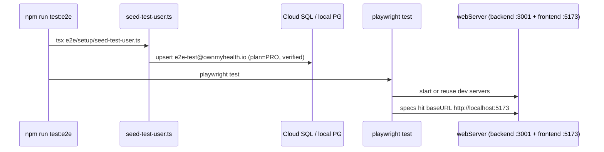

---
tags:
  - documentation
  - testing
  - engineering
  - reference
type: generated
priority: 2
updated: 2026-04-24
---

# TESTING_PATTERNS.md

The **how-to-write-a-test reference** for OwnMyHealth. A developer adding a new controller / route / service / middleware / e2e test should be able to copy the closest real pattern without re-reading the whole test tree.

> This doc obeys `prompts/_doc-quality.md`. Every non-trivial claim cites `file:path:line`; snippets are quoted verbatim.

---

## Quick answers (TL;DR)

| Question | Answer | Evidence |
|---|---|---|
| Backend runner | **Vitest 4.x** (not Jest — `CLAUDE.md:16` is out of date) | `backend/package.json:11`, `backend/vitest.config.ts:1-4` |
| Frontend runner | Vitest 4.x (jsdom) | `vitest.config.ts:5-10` |
| E2E runner | Playwright 1.59 (chromium) | `playwright.config.ts:15-19`, `package.json:36` |
| Backend test command | `npm run test` → `vitest run` | `backend/package.json:11` |
| Frontend test command | `npm run test` → `vitest run` | `package.json:12` |
| E2E command | `npm run test:e2e` (seeds user, then `playwright test`) | `package.json:16-17` |
| Backend `*.test.ts` files | **21** | Glob `backend/src/**/*.test.ts` (see [pyramid](#test-pyramid)) |
| Frontend `*.test.{ts,tsx}` files | **7** | Glob `src/**/*.test.{ts,tsx}` |
| E2E `*.spec.ts` files | **5** | Glob `e2e/*.spec.ts` |
| Shared controller helpers | `backend/src/controllers/testHelpers.ts` | (module file, not a `*.test.ts`) |
| E2E seed helper | `e2e/setup/seed-test-user.ts` | wired via `package.json:16` |
| E2E login helper | `e2e/helpers/auth.ts` (`TEST_USER`, `loginAsTestUser`, `logout`) | `e2e/helpers/auth.ts:18-64` |
| `__mocks__` directories | **None exist yet** — services are stubbed inline via `vi.mock(...)` in each test | Glob `**/__mocks__/**` → no matches |
| `fixtures/` or `factories/` dirs | **None exist yet** in source — `e2e/fixtures/` holds uploaded sample PDFs (see `e2e/helpers/testData.ts:13-14`) | Glob `**/fixtures/**` → only README under `e2e/fixtures/README.md` |

> **CLAUDE.md drift**: `CLAUDE.md:16` and `CLAUDE.md:214` claim the backend uses Jest. The repo uses Vitest (`backend/package.json:11-16`, `backend/vitest.config.ts`). See [Prompt drift log](#prompt-drift-log).

---

## Test pyramid

```
                ┌─────────────────────────────┐
                │  E2E (Playwright, chromium) │   5 spec files, 60s/test timeout
                │  e2e/*.spec.ts              │   workers: 1, retries: 1
                └─────────────────────────────┘
        ┌────────────────────────────────────────────┐
        │  Backend integration (Vitest + supertest)   │   2 route-level files
        │  backend/src/routes/*.test.ts               │   mocks auth/db, real router
        └────────────────────────────────────────────┘
 ┌─────────────────────────────────────────────────────────────┐
 │  Backend unit (Vitest)                                       │   18 files
 │  controllers / services / middleware / utils / config        │   30s/test timeout
 └─────────────────────────────────────────────────────────────┘
 ┌─────────────────────────────────────────────────────────────┐
 │  Frontend unit (Vitest + jsdom + React Testing Library)      │   7 files
 │  src/__tests__/components/**, contexts/**, hooks/**          │   10s/test timeout
 └─────────────────────────────────────────────────────────────┘
```

**Counts (verbatim from Glob)**:

| Scope | Files | Glob pattern |
|---|---|---|
| Backend `*.test.ts` | 21 | `backend/src/**/*.test.ts` |
| Frontend `*.test.{ts,tsx}` | 7 | `src/__tests__/**/*.test.{ts,tsx}` |
| E2E `*.spec.ts` | 5 | `e2e/*.spec.ts` |

**Backend breakdown by layer** (Glob over `backend/src/**/*.test.ts`):

| Layer | Files | Notable specs |
|---|---|---|
| Controllers | 6 | `biomarkerController.test.ts`, `expenseController.test.ts`, `authController.test.ts`, `healthGoalsController.test.ts`, `healthNeedsController.test.ts`, `settingsController.test.ts` |
| Services | 8 | `encryption.test.ts`, `userEncryption.test.ts`, `authService.test.ts`, `auditLog.test.ts`, `rls.test.ts`, `claudeExtraction.test.ts`, `sbcExtraction.test.ts`, `pdfTextExtraction.test.ts` |
| Middleware | 3 | `errorHandler.test.ts`, `rbac.test.ts`, `validation.test.ts` |
| Routes (integration) | 2 | `biomarkerRoutes.guidance.test.ts`, `adminRoutes.demoProtection.test.ts` |
| Utils / config | 2 | `utils/phiRedaction.test.ts`, `config/index.test.ts` |

**E2E specs** (`e2e/*.spec.ts`):

| File | Covers |
|---|---|
| `auth.spec.ts` | Login success, wrong password, session persist across reload, logout |
| `biomarker-entry.spec.ts` | Manual biomarker entry flow |
| `data-export.spec.ts` | Account data-export flow |
| `health-guide.spec.ts` | Biomarker AI guidance (streaming Claude response) |
| `settings.spec.ts` | Account settings open / edit |

**Runtimes** (per config; observed numbers TBD — run `npm run test` locally to measure):

| Scope | Per-test timeout | Hook timeout | Source |
|---|---|---|---|
| Backend | 30_000 ms | 30_000 ms | `backend/vitest.config.ts:30-31` |
| Frontend | 10_000 ms | default | `vitest.config.ts:29` |
| E2E | 60_000 ms | action 15s / nav 20s | `playwright.config.ts:23,46-47` |

---

## Runners + commands

### Backend (Vitest)

```jsonc
// Source: backend/package.json:11-16
"test": "vitest run",
"test:watch": "vitest",
"test:coverage": "vitest run --coverage",
"test:unit": "vitest run --dir src/__tests__/unit",
"test:integration": "vitest run --dir src/__tests__/integration"
```

> The `test:unit` / `test:integration` scripts point at `src/__tests__/unit` and `src/__tests__/integration`; those directories **do not exist yet** (Glob `backend/src/__tests__/**` returns no matches). Backend tests are colocated next to the file under test (e.g. `biomarkerController.test.ts` sits next to `biomarkerController.ts`). The `test:unit` / `test:integration` scripts are placeholders pending a future restructure. For now, run `npm run test` in `backend/`.

**Run a single file**: `cd backend && npx vitest run src/controllers/biomarkerController.test.ts`
**Run one test**: `cd backend && npx vitest run -t 'encrypts value and notes'`

Vitest picks up env defaults from `backend/src/testSetup.ts` before any test imports run:

```ts
// Source: backend/src/testSetup.ts:11-24
const testDefaults: Record<string, string> = {
  NODE_ENV: 'test',
  DATABASE_URL: 'postgresql://localhost/test',
  JWT_ACCESS_SECRET: 'test-access-secret-' + 'a'.repeat(32),
  JWT_REFRESH_SECRET: 'test-refresh-secret-' + 'b'.repeat(32),
  PHI_ENCRYPTION_KEY: 'a1b2c3d4e5f6a7b8c9d0e1f2a3b4c5d6e7f8a9b0c1d2e3f4a5b6c7d8e9f0a1b2',
  AUDIT_LOG_SALT: 'test-audit-salt-' + 'c'.repeat(32),
};
for (const [key, value] of Object.entries(testDefaults)) {
  if (!process.env[key]) {
    process.env[key] = value;
  }
}
```

This is wired via `setupFiles: ['./src/testSetup.ts']` in `backend/vitest.config.ts:11`.

### Frontend (Vitest + jsdom)

```jsonc
// Source: package.json:12-15
"test": "vitest run",
"test:watch": "vitest",
"test:coverage": "vitest run --coverage",
"test:ui": "vitest --ui",
```

Setup file: `src/__tests__/setup.ts` (configures `matchMedia`, `ResizeObserver`, `IntersectionObserver`, `localStorage`, `scrollTo`; `vitest.config.ts:10`).

### E2E (Playwright)

```jsonc
// Source: package.json:16-19
"test:e2e:setup": "cd backend && npx tsx ../e2e/setup/seed-test-user.ts",
"test:e2e": "npm run test:e2e:setup && playwright test",
"test:e2e:ui": "playwright test --ui",
"test:e2e:install": "playwright install chromium",
```

Run flow:



---

## Backend unit test recipe — service

**Reference**: `backend/src/services/encryption.test.ts:L1-L78`

```ts
// Source: backend/src/services/encryption.test.ts:L1-L78
import { describe, it, expect, beforeEach, afterEach, vi } from 'vitest';
import { EncryptionService, validateEncryptionKey } from './encryption.js';

vi.mock('../utils/logger.js');

// Mock PHI_ENCRYPTION_KEY for testing
const TEST_PHI_ENCRYPTION_KEY = 'a1b2c3d4e5f6a7b8c9d0e1f2a3b4c5d6e7f8a9b0c1d2e3f4a5b6c7d8e9f0a1b2';
const INSECURE_PHI_ENCRYPTION_KEY = '0123456789abcdef0123456789abcdef0123456789abcdef0123456789abcdef';
const SHORT_PHI_ENCRYPTION_KEY = 'a1b2c3d4e5f6';
const INVALID_CHAR_PHI_ENCRYPTION_KEY = 'a1b2c3d4e5f6g7h8i9j0k1l2m3n4o5p6q7r8s9t0u1v2w3x4y5z6a7b8c9d0e1f2';

describe('encryption.ts', () => {
  beforeEach(() => {
    vi.resetModules();
    process.env.PHI_ENCRYPTION_KEY = TEST_PHI_ENCRYPTION_KEY;
    process.env.NODE_ENV = 'development';
  });

  afterEach(() => {
    delete process.env.PHI_ENCRYPTION_KEY;
    delete process.env.NODE_ENV;
    vi.clearAllMocks();
  });

  describe('validateEncryptionKey', () => {
    it('should return valid for a correct key in development', () => {
      process.env.NODE_ENV = 'development';
      const result = validateEncryptionKey(TEST_PHI_ENCRYPTION_KEY);
      expect(result.valid).toBe(true);
      expect(result.error).toBeUndefined();
    });

    it('should return invalid if key is too short', () => {
      const result = validateEncryptionKey(SHORT_PHI_ENCRYPTION_KEY);
      expect(result.valid).toBe(false);
      expect(result.error).toContain('must be at least 64 hex characters');
    });

    it('should return invalid if key contains non-hex characters', () => {
      const result = validateEncryptionKey(INVALID_CHAR_PHI_ENCRYPTION_KEY);
      expect(result.valid).toBe(false);
      expect(result.error).toContain('must contain only hexadecimal characters');
    });

    it('should reject insecure placeholder key in production', () => {
      process.env.NODE_ENV = 'production';
      const result = validateEncryptionKey(INSECURE_PHI_ENCRYPTION_KEY);
      expect(result.valid).toBe(false);
      expect(result.error).toContain('placeholder/insecure');
    });
  });
});
```

**What this covers**:
- `vi.resetModules()` between tests so `getEncryptionService()` re-reads env on re-import.
- Uses the **real** `validateEncryptionKey` — no stubs of crypto.
- Covers valid / too-short / non-hex / placeholder-in-prod paths.

**When to copy this pattern**: any pure service function with env-coupled init (encryption, config, jwt options).

---

## Controller test recipe

**Reference**: `backend/src/controllers/biomarkerController.test.ts:L1-L207` (full `getBiomarkers` block shown verbatim)

```ts
// Source: backend/src/controllers/biomarkerController.test.ts:L1-L68
/**
 * biomarkerController unit tests.
 * ...
 * Follows the hoisted-mock pattern from `settingsController.test.ts` and
 * `expenseController.test.ts`: every `vi.mock(...)` call is declared BEFORE
 * the controller/router import so the mocks resolve the mocked modules.
 */

import { afterEach, beforeEach, describe, expect, it, vi } from 'vitest';
import {
  createMockRequest,
  createMockResponse,
  createMockPrismaTransaction,
  createMockAuditService,
  createMockEncryptionService,
  type MockPrismaTx,
  type MockAuditService,
} from './testHelpers.js';

// -- Hoisted handles — shared across both the controller-unit tests and
//    the route-level guidance test. vi.hoisted() runs before vi.mock()
//    factories, which run before the top-level imports.
const mocks = vi.hoisted(() => ({
  tx: null as unknown,
  auditService: null as unknown,
  encryptionService: null as unknown,
  config: { anthropic: { baaActive: true, apiKey: 'test-key' } },
  fetchMock: null as unknown,
  currentUserId: 'test-user-id',
  guidanceTxResult: null as unknown,
}));

vi.mock('../services/database.js', () => ({
  getPrismaClient: vi.fn(() => ({})),
  withRLSContext: vi.fn(async (_userId: unknown, fn: (tx: unknown) => unknown) =>
    fn((mocks.tx as Record<string, unknown>) ?? {})
  ),
  withRLSTransaction: vi.fn(async (_userId: unknown, fn: (tx: unknown) => unknown) => {
    if (mocks.guidanceTxResult !== null) {
      const result = mocks.guidanceTxResult;
      mocks.guidanceTxResult = null;
      return result;
    }
    return fn((mocks.tx as Record<string, unknown>) ?? {});
  }),
}));

vi.mock('../services/auditLog.js', () => ({
  getAuditLogService: vi.fn(() => mocks.auditService),
}));

vi.mock('../services/encryption.js', () => ({
  getEncryptionService: vi.fn(() => mocks.encryptionService),
}));
```

```ts
// Source: backend/src/controllers/biomarkerController.test.ts:L138-L207
describe('getBiomarkers', () => {
  let tx: MockPrismaTx;
  let audit: MockAuditService;

  beforeEach(() => {
    vi.clearAllMocks();
    tx = createMockPrismaTransaction();
    audit = createMockAuditService();
    mocks.tx = tx;
    mocks.auditService = audit;
    mocks.encryptionService = createMockEncryptionService();
  });

  afterEach(() => {
    vi.clearAllMocks();
  });

  it('scopes the findMany to the authenticated userId', async () => {
    tx.biomarker.count.mockResolvedValue(3);
    tx.biomarker.findMany.mockResolvedValue([
      makeBiomarkerRow({ id: 'b1', valueEncrypted: 'enc:120' }),
      makeBiomarkerRow({ id: 'b2', valueEncrypted: 'enc:130' }),
      makeBiomarkerRow({ id: 'b3', valueEncrypted: 'enc:140' }),
    ]);

    const req = createMockRequest({
      user: { id: 'user-A', email: 'a@example.com', role: 'PATIENT' },
      query: {},
    });
    const res = createMockResponse();

    await getBiomarkers(req, res);

    expect(tx.biomarker.findMany).toHaveBeenCalledTimes(1);
    const findManyArg = tx.biomarker.findMany.mock.calls[0][0];
    expect(findManyArg.where).toEqual({ userId: 'user-A' });

    // Audit log was written for the LIST access.
    expect(audit.logAccess).toHaveBeenCalledWith(
      'Biomarker',
      undefined,
      expect.any(Object),
      expect.objectContaining({ operation: 'LIST', count: 3 })
    );

    const payload = (res.json as ReturnType<typeof vi.fn>).mock.calls[0][0];
    expect(payload.success).toBe(true);
    expect(payload.data).toHaveLength(3);
  });

  it('returns decrypted values (parsed as numbers) in the response', async () => {
    tx.biomarker.count.mockResolvedValue(1);
    tx.biomarker.findMany.mockResolvedValue([
      makeBiomarkerRow({ id: 'b1', valueEncrypted: 'enc:123' }),
    ]);

    const req = createMockRequest({
      user: { id: 'user-A', email: 'a@example.com', role: 'PATIENT' },
    });
    const res = createMockResponse();

    await getBiomarkers(req, res);

    const payload = (res.json as ReturnType<typeof vi.fn>).mock.calls[0][0];
    expect(payload.data[0].value).toBe(123);
    expect(typeof payload.data[0].value).toBe('number');
  });
});
```

**What this covers**:

1. **Hoisted mock handles** via `vi.hoisted(...)` so `vi.mock(...)` factories and the eventual `beforeEach` share the same `tx` / `audit` / `encryption` references (`biomarkerController.test.ts:38-49`).
2. **`withRLSContext` is mocked** to forward `fn(tx)` where `tx` is a `createMockPrismaTransaction()` (`biomarkerController.test.ts:55-68`). This is the idiom: test against the **transaction client**, not raw Prisma.
3. **Scoping check**: asserts `findManyArg.where` equals `{ userId: 'user-A' }` — the controller-level userId filter belongs alongside RLS (defense-in-depth per `CLAUDE.md:136-169`).
4. **Audit assertion**: `expect(audit.logAccess).toHaveBeenCalledWith('Biomarker', undefined, expect.any(Object), expect.objectContaining({ operation: 'LIST', count: 3 }))` — the canonical `logAccess` signature the controller uses.
5. **Decrypt shape**: the mock encryption service uses `enc:123 → 123` prefix-strip (`testHelpers.ts:106-114`), letting the test assert the response type is `number`.

**When to copy this pattern**: any new controller function. Copy the `vi.hoisted` block, the `vi.mock('../services/database.js', ...)` stub, and the `beforeEach` fixture setup.

---

## Route (integration) test recipe

**Reference**: `backend/src/routes/biomarkerRoutes.guidance.test.ts:L1-L158` (first describe block + helpers)

This recipe uses **supertest** against a real `biomarkerRouter` mounted on a minimal Express app, with auth / rate-limit / demo middleware stubbed so the handler under test runs.

```ts
// Source: backend/src/routes/biomarkerRoutes.guidance.test.ts:L19-L117
import { afterEach, beforeEach, describe, expect, it, vi } from 'vitest';

const mocks = vi.hoisted(() => ({
  config: { anthropic: { baaActive: true, apiKey: 'test-key' } },
  withRLSTransaction: vi.fn(),
  logAccess: vi.fn(),
  currentUserId: 'user-A',
  fetchMock: vi.fn(),
}));

vi.mock('../config/index.js', () => ({
  get config() { return mocks.config; },
}));

vi.mock('../services/database.js', () => ({
  getPrismaClient: vi.fn(() => ({})),
  withRLSTransaction: (userId: string, fn: (tx: unknown) => unknown) =>
    mocks.withRLSTransaction(userId, fn),
}));

vi.mock('../services/auditLog.js', () => ({
  getAuditLogService: vi.fn(() => ({ logAccess: mocks.logAccess })),
}));

vi.mock('../services/encryption.js', () => ({
  getEncryptionService: vi.fn(() => ({
    encrypt: (v: string) => `enc(${v})`,
    decrypt: (v: string) => v.replace(/^enc\(/, '').replace(/\)$/, ''),
  })),
}));

// Stub authenticate so every request is treated as `mocks.currentUserId`.
vi.mock('../middleware/auth.js', () => ({
  authenticate: (req, _res, next) => {
    (req as { user?: { id: string; role: string; email: string } }).user = {
      id: mocks.currentUserId,
      role: 'PATIENT',
      email: 'test@example.com',
    };
    next();
  },
}));

vi.mock('../middleware/rateLimiter.js', () => ({
  aiLimiter: (_req, _res, next) => next(),
  bulkOperationLimiter: (_req, _res, next) => next(),
}));

vi.mock('../middleware/demoProtection.js', () => ({
  blockDemoAI: (_req, _res, next) => next(),
}));

vi.mock('../middleware/planGating.js', () => ({
  requirePlanLimit: () => (_req, _res, next) => next(),
  requirePlanFeature: () => (_req, _res, next) => next(),
}));

// Replace global fetch with a spy.
vi.stubGlobal('fetch', mocks.fetchMock);

// -- Imports AFTER mocks -------------------------------------------------
import express from 'express';
import request from 'supertest';
import biomarkerRouter from './biomarkerRoutes.js';
import { errorHandler } from '../middleware/errorHandler.js';

function buildApp() {
  const app = express();
  app.use(express.json());
  app.use('/api/v1/biomarkers', biomarkerRouter);
  app.use(errorHandler);
  return app;
}
```

```ts
// Source: backend/src/routes/biomarkerRoutes.guidance.test.ts:L146-L186
describe('POST /biomarkers/:id/guidance (C-7 + F-3)', () => {
  beforeEach(() => {
    mocks.config.anthropic.baaActive = true;
    mocks.currentUserId = 'user-A';
    mocks.withRLSTransaction.mockReset();
    mocks.logAccess.mockReset();
    mocks.fetchMock.mockReset();
    process.env.ANTHROPIC_API_KEY = 'test-key';
  });

  afterEach(() => { vi.clearAllMocks(); });

  describe('BAA gate', () => {
    it('returns 503 and never calls fetch when baaActive is false', async () => {
      mocks.config.anthropic.baaActive = false;

      const app = buildApp();
      const res = await request(app)
        .post(`/api/v1/biomarkers/${validUuid()}/guidance`)
        .send({});

      expect(res.status).toBe(503);
      expect(res.body).toMatchObject({
        success: false,
        error: {
          code: 'SERVICE_UNAVAILABLE',
          message: expect.stringContaining('ANTHROPIC_BAA_ACTIVE'),
        },
      });
      expect(mocks.fetchMock).not.toHaveBeenCalled();
      expect(mocks.withRLSTransaction).not.toHaveBeenCalled();
      expect(mocks.logAccess).toHaveBeenCalledWith(
        'biomarker_ai_guidance',
        validUuid(),
        expect.any(Object),
        expect.objectContaining({ operation: 'GUIDANCE_BLOCKED_NO_BAA' })
      );
    });
  });
});
```

**What this covers**:

- **Real router is mounted** (`import biomarkerRouter from './biomarkerRoutes.js'`), so middleware order and the actual route handler are exercised.
- **Auth middleware is stubbed** to set `req.user` to the hoisted `currentUserId` — flipping `mocks.currentUserId` before a request lets one spec verify the IDOR (Alice cannot read Bob's biomarker) branch.
- **`fetch` is replaced globally via `vi.stubGlobal('fetch', mocks.fetchMock)`** (`biomarkerRoutes.guidance.test.ts:110`) so the Anthropic HTTP call never leaves the process.
- **Negative assertions**: `expect(mocks.fetchMock).not.toHaveBeenCalled()` proves no data leaves when the BAA gate trips — a critical invariant for PHI.

See the twin regression spec `backend/src/routes/adminRoutes.demoProtection.test.ts:L1-L100` for a second, smaller example (demo-account lockout on admin routes).

**When to copy this pattern**: any new Express route file where the full middleware chain matters (auth + rate-limit + CSRF + demo + handler).

---

## Middleware test recipe

**Reference**: `backend/src/middleware/rbac.test.ts:L1-L120`

```ts
// Source: backend/src/middleware/rbac.test.ts:L14-L109
import { describe, it, expect, beforeEach, vi } from 'vitest';
import type { Response, NextFunction } from 'express';
import type { AuthenticatedRequest } from '../types/index.js';

const mocks = vi.hoisted(() => ({
  findUnique: vi.fn(),
  withRLSContext: vi.fn(),
}));

vi.mock('../services/database.js', () => ({
  withRLSContext: mocks.withRLSContext,
  getPrismaClient: vi.fn(),
}));

import { requireResourceAccess, requireOwnership } from './rbac.js';

function buildRelationship(overrides = {}) {
  return {
    id: '11111111-1111-1111-1111-111111111111',
    providerId: '22222222-2222-2222-2222-222222222222',
    patientId: '33333333-3333-3333-3333-333333333333',
    status: 'ACTIVE',
    canViewBiomarkers: true,
    canEditData: false,
    consentExpiresAt: null,
    ...overrides,
  };
}

describe('rbac.ts — provider-patient RLS wrapping', () => {
  beforeEach(() => {
    mocks.findUnique.mockReset();
    mocks.withRLSContext.mockReset();
    // Forward: callbacks receive a tx-shaped object with providerPatient.findUnique.
    mocks.withRLSContext.mockImplementation(async (_userId, fn, _options) => {
      const tx = { providerPatient: { findUnique: mocks.findUnique } };
      return fn(tx);
    });
  });

  it('calls withRLSContext with admin scope (not raw prisma)', async () => {
    mocks.findUnique.mockResolvedValue(buildRelationship({ canViewBiomarkers: true }));

    const req = { user: { id: PROVIDER_ID, email: 'x', role: 'PROVIDER', plan: 'FREE' },
                  params: { patientId: PATIENT_ID }, query: {}, body: {} } as unknown as AuthenticatedRequest;
    const next = vi.fn() as unknown as NextFunction;
    await requireResourceAccess('biomarker', 'read')(req, {} as Response, next);

    // The wrapper MUST be used (previous bug: raw prisma call bypassed RLS).
    expect(mocks.withRLSContext).toHaveBeenCalledTimes(1);
    expect(mocks.withRLSContext).toHaveBeenCalledWith(
      null, expect.any(Function), { isAdmin: true }
    );
    expect(next).toHaveBeenCalledWith();
  });

  it('denies a provider with no relationship to the target patient', async () => {
    mocks.findUnique.mockResolvedValue(null);
    const req = /* PROVIDER → UNRELATED patientId */ {} as AuthenticatedRequest;
    const next = vi.fn() as unknown as NextFunction;
    await requireResourceAccess('biomarker', 'read')(req, {} as Response, next);

    const err = (next as unknown as { mock: { calls: unknown[][] } }).mock.calls[0][0];
    expect((err as Error).message).toMatch(/do not have access/i);
  });
});
```

**What this covers**:

- Mocks **only** `withRLSContext` — the spy lets each test assert the middleware calls the wrapper with the correct scope (`{ isAdmin: true }` for admin-context relationship lookups).
- `mocks.withRLSContext.mockImplementation(async (_userId, fn) => fn({ providerPatient: { findUnique } }))` — forwards a tx-shaped object so production code's `tx.providerPatient.findUnique(...)` hits the test spy.
- Asserts the middleware short-circuits (calls `next(AppError)`) when: no relationship, PENDING status, expired consent, read-only permission trying to write (`rbac.test.ts:L110-L200`).

**When to copy this pattern**: any Express middleware that calls into the database or other services via `withRLSContext` — stub `withRLSContext` and forward a hand-rolled tx object, do not instantiate Prisma.

**Additional middleware example**: `backend/src/middleware/errorHandler.test.ts:L1-L100` — pure-class tests for `AppError` / `BadRequestError` / `ForbiddenError` etc. No DB, no mocks beyond `logger`. Use this shape for pure validation helpers.

---

## Service test recipe (RLS-aware, live-DB)

**Reference**: `backend/src/services/rls.test.ts:L1-L128` (full file)

This is the **only** test that hits a real Postgres and verifies RLS end-to-end. It auto-skips when `DATABASE_URL` or `PHI_ENCRYPTION_KEY` are missing so unit-only CI stays green.

```ts
// Source: backend/src/services/rls.test.ts:L19-L127
import { afterAll, beforeAll, describe, expect, it } from 'vitest';
import { randomUUID } from 'node:crypto';
import { disconnectDatabase, getPrismaClient, withRLSContext } from './database.js';

const hasLiveDb = Boolean(process.env.DATABASE_URL) && Boolean(process.env.PHI_ENCRYPTION_KEY);

describe.skipIf(!hasLiveDb)('RLS tenant isolation (withRLSContext)', () => {
  const userA = { id: randomUUID(), email: `rls-a-${Date.now()}@test.local` };
  const userB = { id: randomUUID(), email: `rls-b-${Date.now()}@test.local` };
  const markerNames = ['__RLS_TEST_A__', '__RLS_TEST_B__'];

  beforeAll(async () => {
    getPrismaClient();

    // Seed via admin context so we can insert rows for both tenants.
    await withRLSContext(null, async (tx) => {
      await tx.user.create({ data: { id: userA.id, email: userA.email, passwordHash: 'test-hash-not-used' } });
      await tx.user.create({ data: { id: userB.id, email: userB.email, passwordHash: 'test-hash-not-used' } });
      await tx.biomarker.create({
        data: {
          userId: userA.id, category: 'test', name: markerNames[0], unit: 'test',
          valueEncrypted: 'ct-a', normalRangeMin: 0, normalRangeMax: 1, measurementDate: new Date(),
        },
      });
      await tx.biomarker.create({
        data: {
          userId: userB.id, category: 'test', name: markerNames[1], unit: 'test',
          valueEncrypted: 'ct-b', normalRangeMin: 0, normalRangeMax: 1, measurementDate: new Date(),
        },
      });
    });
  });

  afterAll(async () => {
    await withRLSContext(null, async (tx) => {
      await tx.biomarker.deleteMany({ where: { name: { in: markerNames } } });
      await tx.user.deleteMany({ where: { id: { in: [userA.id, userB.id] } } });
    });
    await disconnectDatabase();
  });

  it('user A sees only their row when no where-filter is applied', async () => {
    const rows = await withRLSContext(userA.id, async (tx) => {
      return tx.biomarker.findMany({ where: { name: { in: markerNames } } });
    });
    expect(rows).toHaveLength(1);
    expect(rows[0].userId).toBe(userA.id);
  });

  it('user B sees only their row when no where-filter is applied', async () => {
    const rows = await withRLSContext(userB.id, async (tx) => {
      return tx.biomarker.findMany({ where: { name: { in: markerNames } } });
    });
    expect(rows).toHaveLength(1);
    expect(rows[0].userId).toBe(userB.id);
  });

  it('admin context sees both tenants', async () => {
    const rows = await withRLSContext(null, async (tx) => {
      return tx.biomarker.findMany({ where: { name: { in: markerNames } } });
    });
    expect(rows).toHaveLength(2);
  });

  it('queries across pooled connections do not leak context between calls', async () => {
    const aRows = await withRLSContext(userA.id, async (tx) =>
      tx.biomarker.findMany({ where: { name: { in: markerNames } } }));
    const bRows = await withRLSContext(userB.id, async (tx) =>
      tx.biomarker.findMany({ where: { name: { in: markerNames } } }));
    expect(aRows.map((r) => r.userId)).toEqual([userA.id]);
    expect(bRows.map((r) => r.userId)).toEqual([userB.id]);
  });
});
```

**Why this is the gold-standard cross-user isolation test**:

1. Seeds via **admin context** (`withRLSContext(null, ...)`, `rls.test.ts:42`).
2. Queries intentionally **omit** `where: { userId: X }` — if RLS were misconfigured, the queries would return both rows.
3. Uses `describe.skipIf(!hasLiveDb)` so the test doubles as an always-green CI check and a manual verification step (`npm run test -- rls.test.ts` with a real DATABASE_URL).
4. Caveat per `MEMORY.md` OwnMyHealth entry: the runtime DB role in dev and prod is BYPASSRLS, so RLS policies are structurally in place but don't enforce at runtime. PR #30 (2026-04-16) closes C-1/F-14/F-15 but doesn't fix the runtime-role issue. This test **requires a NOBYPASSRLS role** in the connection URL to catch real regressions. See `backend/src/services/database.ts:L220-L270` (`assertNoBypassRLS`) and [`KNOWN_ISSUES.md`](./KNOWN_ISSUES.md).

> **CLAUDE.md reminder**: inside any `withRLSContext` callback, every Prisma call MUST go through `tx`. Raw `prisma.*` inside the callback bypasses RLS silently (`backend/src/services/database.ts:L14-L31`).

### RLS-aware test helper (proposed — no shared helper exists yet)

**Status**: no `backend/src/services/__tests__/rlsHelpers.ts` or similar exists (Glob `**/testHelpers/**` returned none; the only helper is `backend/src/controllers/testHelpers.ts` for unit-level Prisma mocks). Recipe below is **proposed** and aligned with `backend/src/services/database.ts`:

```ts
// Proposed: backend/src/services/__tests__/rlsHelpers.ts
import type { Prisma } from '../../generated/prisma';
import { withRLSContext } from '../database.js';

export async function asUser<T>(
  userId: string,
  fn: (tx: Prisma.TransactionClient) => Promise<T>,
): Promise<T> {
  return withRLSContext(userId, fn);
}

export async function asAdmin<T>(
  fn: (tx: Prisma.TransactionClient) => Promise<T>,
): Promise<T> {
  return withRLSContext(null, fn, { isAdmin: true });
}
```

### Cross-user isolation pattern (proposed, matches `rls.test.ts` style)

```ts
// Proposed, matching backend/src/services/rls.test.ts
it('prevents cross-user biomarker read via RLS', async () => {
  const alice = await asAdmin((tx) => tx.user.create({ data: aliceData }));
  const bob   = await asAdmin((tx) => tx.user.create({ data: bobData }));

  const row = await asUser(alice.id, (tx) =>
    tx.biomarker.create({ data: { userId: alice.id, /* ... */ } })
  );

  const leaked = await asUser(bob.id, (tx) =>
    tx.biomarker.findUnique({ where: { id: row.id } })
  );

  expect(leaked).toBeNull();  // RLS blocks the read
});
```

---

## Frontend unit test recipe

**Reference**: `src/__tests__/components/Button.test.tsx:L1-L56` (full file)

```tsx
// Source: src/__tests__/components/Button.test.tsx:L1-L56
import { describe, it, expect, vi } from 'vitest';
import { render, screen, fireEvent } from '@testing-library/react';
import React from 'react';

const TestButton: React.FC<{
  onClick?: () => void;
  disabled?: boolean;
  children: React.ReactNode;
}> = ({ onClick, disabled, children }) => (
  <button onClick={onClick} disabled={disabled}>
    {children}
  </button>
);

describe('Button Component', () => {
  it('should render with text', () => {
    render(<TestButton>Click Me</TestButton>);
    expect(screen.getByText('Click Me')).toBeInTheDocument();
  });

  it('should call onClick when clicked', () => {
    const handleClick = vi.fn();
    render(<TestButton onClick={handleClick}>Click Me</TestButton>);
    fireEvent.click(screen.getByText('Click Me'));
    expect(handleClick).toHaveBeenCalledTimes(1);
  });

  it('should not call onClick when disabled', () => {
    const handleClick = vi.fn();
    render(<TestButton onClick={handleClick} disabled>Click Me</TestButton>);
    fireEvent.click(screen.getByText('Click Me'));
    expect(handleClick).not.toHaveBeenCalled();
  });

  it('should have disabled attribute when disabled prop is true', () => {
    render(<TestButton disabled>Click Me</TestButton>);
    expect(screen.getByText('Click Me')).toBeDisabled();
  });
});
```

**Pattern**: `@testing-library/react` + `@testing-library/jest-dom` matchers (registered in `src/__tests__/setup.ts:8`) + `vi.fn()` spies. `render` / `screen` / `fireEvent` only — no snapshot testing is used in this codebase.

**Largest component suite**: `src/__tests__/components/BiomarkerSummary.test.tsx` — factory-driven tests over the biomarker-summary panel:

```tsx
// Source: src/__tests__/components/BiomarkerSummary.test.tsx:L12-L35
const createBiomarker = (overrides: Partial<Biomarker> = {}): Biomarker => ({
  id: crypto.randomUUID(),
  name: 'Test Biomarker',
  value: 50,
  unit: 'mg/dL',
  date: '2024-01-15',
  category: 'Blood',
  normalRange: { min: 40, max: 60, source: 'Standard' },
  description: 'Test description',
  history: [],
  ...overrides,
});

describe('BiomarkerSummary', () => {
  describe('Rendering', () => {
    it('should render all summary cards', () => {
      const biomarkers = [createBiomarker()];
      render(<BiomarkerSummary biomarkers={biomarkers} category="Blood" />);
      expect(screen.getByText('Tracked')).toBeInTheDocument();
      expect(screen.getByText('In Range')).toBeInTheDocument();
      expect(screen.getByText('Attention')).toBeInTheDocument();
    });
  });
});
```

Copy this **inline factory function** approach for any component that takes list-shaped props (biomarkers, insurance plans, expense rows). There is no global `factories/` directory to reach for.

---

## E2E test recipe

**Reference**: `e2e/auth.spec.ts:L1-L57` (full file)

```ts
// Source: e2e/auth.spec.ts:L1-L57
/**
 * Auth flow — critical path. If any of these break, nobody can log in.
 *
 * Note: the app is an SPA and does NOT navigate to `/dashboard` on login.
 * Login flips a state flag and renders the Dashboard component at `/`. Specs
 * wait on dashboard content (greeting heading) instead of URL patterns.
 */

import { test, expect } from '@playwright/test';
import { TEST_USER, loginAsTestUser, logout } from './helpers/auth';

test.describe('Authentication', () => {
  test('login with valid credentials lands on dashboard', async ({ page }) => {
    await page.goto('/');

    await expect(page.getByRole('heading', { name: /welcome back/i })).toBeVisible();

    await page.getByLabel(/email/i).first().fill(TEST_USER.email);
    await page.getByLabel(/password/i).first().fill(TEST_USER.password);
    await page.getByRole('button', { name: /^sign in$/i }).click();

    await expect(
      page.getByRole('heading', { name: /welcome back,|^dashboard$/i }).first()
    ).toBeVisible({ timeout: 15_000 });
  });

  test('login with wrong password shows an error and stays on login', async ({ page }) => {
    await page.goto('/');
    await page.getByLabel(/email/i).first().fill(TEST_USER.email);
    await page.getByLabel(/password/i).first().fill('WrongPassword123!');
    await page.getByRole('button', { name: /^sign in$/i }).click();

    await expect(
      page.getByText(/invalid|incorrect|failed|wrong/i).first()
    ).toBeVisible({ timeout: 10_000 });
    await expect(page.getByRole('heading', { name: /welcome back/i })).toBeVisible();
  });

  test('session persists across reload', async ({ page }) => {
    await loginAsTestUser(page);
    await page.reload();
    await expect(
      page.getByRole('heading', { name: /welcome back,|^dashboard$/i }).first()
    ).toBeVisible({ timeout: 15_000 });
  });

  test('logout returns to login page', async ({ page }) => {
    await loginAsTestUser(page);
    await logout(page);
    await expect(page.getByRole('heading', { name: /welcome back/i })).toBeVisible();
  });
});
```

### Seed helper (used before every E2E run)

```ts
// Source: e2e/setup/seed-test-user.ts:L29-L80 (abridged to the idempotent upsert path)
const EMAIL = 'e2e-test@ownmyhealth.io';
const PASSWORD = 'E2ETestPass123!';

async function main(): Promise<void> {
  const prisma = new PrismaClient();
  try {
    const existing = await prisma.user.findUnique({ where: { email: EMAIL } });
    if (existing) {
      await prisma.user.update({
        where: { email: EMAIL },
        data: {
          plan: 'PRO', planExpiresAt: null, planUpdatedAt: new Date(),
          emailVerified: true, isActive: true, lockedUntil: null,
          failedLoginAttempts: 0, onboardingCompletedAt: new Date(),
        },
      });
      return;
    }
    const passwordHash = await bcrypt.hash(PASSWORD, 12);
    await prisma.user.create({
      data: {
        email: EMAIL, passwordHash, role: 'PATIENT',
        isActive: true, emailVerified: true, plan: 'PRO',
        planUpdatedAt: new Date(), onboardingCompletedAt: new Date(),
      },
    });
  } finally { await prisma.$disconnect(); }
}
```

**E2E helpers** (all at `e2e/helpers/`):

| Helper | Source | Purpose |
|---|---|---|
| `TEST_USER` | `e2e/helpers/auth.ts:18-21` | Shared creds (`e2e-test@ownmyhealth.io` / `E2ETestPass123!`) |
| `loginAsTestUser(page)` | `e2e/helpers/auth.ts:28-45` | Goto `/`, fill login form, wait for dashboard heading |
| `openUserMenu(page)` | `e2e/helpers/auth.ts:52-55` | Click avatar button, wait for menu |
| `logout(page)` | `e2e/helpers/auth.ts:60-64` | Open menu → sign out → wait for login form |
| `openAccountSettings(page)` | `e2e/helpers/auth.ts:69-73` | Navigate to account settings |
| `SAMPLE_LAB_REPORT`, `SAMPLE_SBC` | `e2e/helpers/testData.ts:13-14` | Resolved paths to `e2e/fixtures/sample-*.pdf` |

> **Fixture gap**: `e2e/fixtures/README.md` documents two required PDFs (`sample-lab-report.pdf`, `sample-sbc.pdf`) that must start with the `%PDF-1.4` magic bytes. They are **not checked in** — create them locally before running upload specs (`e2e/helpers/testData.ts:7-12`). See [`KNOWN_ISSUES.md`](./KNOWN_ISSUES.md).

**When to copy this pattern**: any new user-facing flow. Import `loginAsTestUser` at the top of every spec that needs an authenticated session; do **not** inline login form submissions except in `auth.spec.ts`.

---

## Mock catalog

> **No `__mocks__/` directories exist in the repo** (Glob `**/__mocks__/**` → no matches). All mocks are **inline `vi.mock(...)` factories** in the test file, typically combined with `vi.hoisted()` to share spies between the factory and the test body. The table below points to the canonical inline recipe for each external dependency.

| External dep | Used by (prod) | Canonical mock recipe | Shape |
|---|---|---|---|
| **Anthropic SDK** | `services/claudeExtraction.ts`, `services/sbcExtraction.ts`, inline `fetch` in `biomarkerRoutes.ts` guidance | `backend/src/services/claudeExtraction.test.ts:L23-L34`; route-level: stub global `fetch` via `vi.stubGlobal('fetch', mocks.fetchMock)` (`biomarkerRoutes.guidance.test.ts:L109`) | `vi.mock('@anthropic-ai/sdk', () => ({ default: class { messages = { create: mocks.messagesCreate } } }))` |
| **SendGrid (`@sendgrid/mail`)** | `services/emailService.ts` | **No existing test** — recipe: `vi.mock('@sendgrid/mail', () => ({ default: { setApiKey: vi.fn(), send: vi.fn().mockResolvedValue([{ statusCode: 202 }]) } }))`. Flag this gap — auth flows that trigger verification email (`authService.register`) currently aren't asserted against SendGrid in tests. |
| **GCS (`@google-cloud/storage`)** | `services/storageService.ts` | `backend/src/controllers/settingsController.test.ts:L52-L65` — mock at the **storageService layer**, not the underlying SDK: `vi.mock('../services/storageService.js', () => ({ deleteFiles: vi.fn(), ... }))` |
| **Google Document AI** | `services/ocrService.ts` | **No existing test.** Recipe: `vi.mock('../services/ocrService.js', () => ({ extractTextFromDocument: vi.fn().mockResolvedValue({ text: 'canned OCR text', confidence: 0.95 }) }))`. Fixture OCR text should be a redacted-PHI placeholder. |
| **Anthropic (service-internal)** | Any controller that triggers `claudeExtraction` / `sbcExtraction` indirectly | `vi.mock('./claudeExtraction.js', ...)` at the service boundary is preferred over mocking the SDK — controllers should not know about Anthropic directly (`expenseController.test.ts:L28`) |

Pattern for sharing a spy between the `vi.mock()` factory and the test body:

```ts
// Pattern (matches backend/src/services/claudeExtraction.test.ts:L23-L57)
const mocks = vi.hoisted(() => ({
  messagesCreate: vi.fn(),
  config: { anthropic: { baaActive: true, apiKey: 'test-key' } },
}));

vi.mock('@anthropic-ai/sdk', () => ({
  default: class MockAnthropic {
    messages = { create: mocks.messagesCreate };
    constructor(_opts: unknown) {}
  },
}));

vi.mock('../config/index.js', () => ({
  get config() { return mocks.config; },
}));
```

---

## Fixture + factory conventions

**Status**: no shared `factories/` directory. Each test file defines inline builder functions. Copy these patterns.

### Backend — Prisma row factory

```ts
// Source: backend/src/controllers/biomarkerController.test.ts:L586-L610
function makeBiomarkerRow(overrides: BiomarkerRowOverrides = {}) {
  return {
    id: 'b1',
    userId: 'user-A',
    name: 'Glucose',
    category: 'METABOLIC',
    unit: 'mg/dL',
    valueEncrypted: 'enc:95',
    notesEncrypted: null,
    normalRangeMin: 70,
    normalRangeMax: 100,
    normalRangeSource: null,
    measurementDate: new Date('2026-04-18'),
    sourceType: 'MANUAL',
    sourceFile: null,
    extractionConfidence: null,
    labName: null,
    isOutOfRange: false,
    isAcknowledged: false,
    history: [],
    createdAt: new Date('2026-04-18'),
    updatedAt: new Date('2026-04-18'),
    ...overrides,
  };
}
```

### Backend — mock Request / Response / Prisma tx

All controller tests share `backend/src/controllers/testHelpers.ts`. Key exports:

| Export | Source | Returns |
|---|---|---|
| `createMockRequest(overrides)` | `testHelpers.ts:L14-L27` | A shape-compatible `AuthenticatedRequest` with default `user: { id: 'test-user-id', email: 'test@example.com', role: 'PATIENT' }` |
| `createMockResponse()` | `testHelpers.ts:L30-L39` | Chainable `{ status, json, setHeader, write, end, send }` all `vi.fn()` |
| `createMockPrismaTransaction()` | `testHelpers.ts:L48-L82` | Object with every model the tests touch (`biomarker`, `healthGoal`, `expenseActual`, ...) each exposing `findMany / findFirst / findUnique / create / createMany / update / updateMany / delete / deleteMany / count` as `vi.fn()` |
| `createMockAuditService()` | `testHelpers.ts:L87-L97` | `{ logAccess, logCreate, logUpdate, logDelete, logAuth, logExport, logSystem }` all `vi.fn()` |
| `createMockEncryptionService()` | `testHelpers.ts:L106-L114` | `encrypt(v) => 'enc:' + v`, `decrypt(v) => v.replace(/^enc:/, '')`, and master-key variants |

Rule: **do not create a second helpers module** — extend `testHelpers.ts` when a new model or mock is needed.

### E2E — seed user

Single shared user via `e2e/setup/seed-test-user.ts`. If an isolation bug requires per-spec users, the seed script should be extended rather than each spec creating its own. Test user is hardcoded `PRO`-plan + `emailVerified: true` + `onboardingCompletedAt: now` so specs land on the dashboard (not the onboarding wizard) after login.

### Frontend — inline builder

See `BiomarkerSummary.test.tsx:L12-L25` above — `const createBiomarker = (overrides): Biomarker => ({...defaults, ...overrides})`. No factory library (no `@faker-js/faker`, no `factory-bot` — Glob `**/node_modules/@faker-js/**` → no matches).

---

## PHI-aware test conventions

1. **Never print decrypted PHI.** No `console.log(biomarker.valueDecrypted)` in tests. Use structured `expect(...)` assertions. The `logger` mock in every test (`vi.mock('../utils/logger.js', ...)`) also prevents accidental leakage via real logger → stdout.
2. **Treat encrypted fields as opaque strings** in unit tests. The mock encryption service deliberately uses the `enc:` prefix (`testHelpers.ts:L106-L114`) so tests assert on **presence of encryption**, not plaintext match on the wire. The plaintext is only asserted on the **decrypt path** (response body), never on the stored payload.
3. **Use the real encryption path in service tests** that exercise `encryption.ts` — never stub `encrypt` / `decrypt` to identity. See `backend/src/services/encryption.test.ts` (uses a real PHI_ENCRYPTION_KEY and real AES-256-GCM round-trips).
4. **Assert audit trail for every PHI read / write**. Every controller test that creates/reads/updates/deletes a row should include an `expect(audit.log*).toHaveBeenCalledWith(...)` assertion — see `biomarkerController.test.ts:L176-L182, L275-L281, L365-L371`.
5. **Assert `fetch` was NOT called** on BAA-gated tests (`biomarkerRoutes.guidance.test.ts:L177`). PHI must not transit to Anthropic when the gate trips. This is a mandatory negative assertion on any external-AI path.
6. **Seed data carries marker strings** (`'__RLS_TEST_A__'` in `rls.test.ts:L32`) so cleanup in `afterAll` can target rows without risking wider deletions.
7. **Do not read `process.env` directly in tests**. Backend `testSetup.ts` seeds defaults; override per-test with `vi.stubEnv(...)` or `process.env.X = 'y'` in `beforeEach` with restoration in `afterEach`.
8. **PHI encryption key length is checked**. Use `TEST_PHI_ENCRYPTION_KEY` from `encryption.test.ts:L7` when overriding; never the literal `0123...`-style placeholder that `validateEncryptionKey` rejects in production-mode tests.

---

## Bad vs good example pairs

| Category | Bad pattern | Good pattern | Source |
|---|---|---|---|
| **Controller — DB access** | `vi.mock('@prisma/client', () => ...)` then assert on `prismaMock.biomarker.findMany`. RLS never runs. | `vi.mock('../services/database.js')` with `withRLSContext` forwarding `fn(tx)` to a `createMockPrismaTransaction()` — assertions on `tx.biomarker.findMany`. | Good: `biomarkerController.test.ts:L53-L68` |
| **Controller — user scoping** | `expect(tx.biomarker.findMany).toHaveBeenCalled()` with no argument check. | `expect(findManyArg.where).toEqual({ userId: 'user-A' })` — pins the userId filter that defends in depth alongside RLS. | Good: `biomarkerController.test.ts:L171-L174` |
| **Route — auth** | Do a real POST `/api/v1/auth/login` to obtain cookies, then send CSRF+cookie to the route under test. Tests become serialized + flaky. | Stub `authenticate` middleware via `vi.mock('../middleware/auth.js', ...)` to set `req.user = { id, role, email }` and short-circuit. | Good: `biomarkerRoutes.guidance.test.ts:L68-L77` |
| **Route — AI calls** | Use `nock` or let the real Anthropic `fetch` happen with a fake API key (rate-limit risk; flakes). | `vi.stubGlobal('fetch', mocks.fetchMock)` and assert `mocks.fetchMock` was called or NOT called per branch. | Good: `biomarkerRoutes.guidance.test.ts:L109-L110, L177` |
| **Middleware — DB** | Call real `prisma` in the middleware spec; run against a live DB for a pure permission check. | Mock `withRLSContext` to forward a tx-shape `{ providerPatient: { findUnique } }` and spy on the scope argument (`{ isAdmin: true }`). | Good: `rbac.test.ts:L102-L108, L122-L128` |
| **Service — encryption** | Stub `encrypt` / `decrypt` to identity to "simplify" — hides real AES bugs. | Use the real AES-256-GCM round-trip with a real test PHI_ENCRYPTION_KEY (64 hex). | Good: `encryption.test.ts:L7, L14-L27` |
| **RLS** | `expect(result).toBeEmptyArray()` without first confirming the row exists under admin context. | Seed via `withRLSContext(null, ...)`, then read as userA and userB separately — proves the row exists but RLS filters it. | Good: `rls.test.ts:L42-L81, L92-L113` |
| **Frontend** | Find elements by `container.querySelector('.bg-blue-500')` (CSS-coupled, re-renders break). | `screen.getByRole('button', { name: /sign in/i })` / `screen.getByText('Click Me')`. | Good: `Button.test.tsx:L26-L35` |
| **E2E — creds** | Hardcode creds in each spec body. | Import `TEST_USER` + `loginAsTestUser` from `e2e/helpers/auth.ts`. | Good: `auth.spec.ts:L10-L14`; Helper: `e2e/helpers/auth.ts:L18-L45` |
| **E2E — URL waits** | `await page.waitForURL('**/dashboard')` — SPA does not navigate on login. | `await expect(page.getByRole('heading', { name: /welcome back,|^dashboard$/i }).first()).toBeVisible(...)`. | Good: `e2e/helpers/auth.ts:L42-L44` |
| **PHI** | `console.log(res.body.data[0].valueDecrypted)` while debugging. | Use `expect(res.body.data[0].value).toBe(123)` — never emit to stdout. `logger` is always mocked. | Good: `biomarkerController.test.ts:L201-L206` |
| **Mocks** | Create a new mock helper per test file. | Extend `backend/src/controllers/testHelpers.ts`; use `vi.hoisted()` to share spies inside a single test file. | Good: `testHelpers.ts`; `biomarkerController.test.ts:L38-L49` |

---

## Gaps to close (missing test categories)

Flagged per the quality bar ("if a test category has no real example in the repo, state so explicitly"):

| Gap | Impact | Proposed fix |
|---|---|---|
| No `SendGrid` test path | `authService.register` → email verify send is not asserted against SendGrid. Silent regression possible if template id / from address changes. | Add `backend/src/services/emailService.test.ts` with `vi.mock('@sendgrid/mail', ...)` and a spy asserting `setApiKey + send` calls. |
| No `Google Document AI` test | `services/ocrService.ts` has zero coverage. Upload flow relies on it. | Add `ocrService.test.ts` mocking `@google-cloud/documentai` client; fixture PDFs are not required — mock at the SDK boundary. |
| No shared `asUser` / `asAdmin` helper | Every test writes its own `withRLSContext` stub. Drift risk. | Create `backend/src/services/__tests__/rlsHelpers.ts` per the proposed recipe above. |
| `backend/src/__tests__/unit` + `/integration` dirs referenced in `package.json:14-15` but do not exist | `npm run test:unit` / `test:integration` will report 0 tests. | Either delete the unused scripts or migrate colocated tests into those dirs. |
| E2E fixtures not checked in | `e2e/biomarker-entry.spec.ts` upload scenarios can fail on fresh checkouts | Document required PDFs in `e2e/fixtures/README.md` (done) and/or commit a 1KB stub PDF. |
| Single live-DB RLS test only, and BYPASSRLS role in runtime means the check is structurally present but doesn't enforce | Tenant isolation regressions could pass CI | Rotate to a `NOBYPASSRLS` role in dev/prod (per `CLAUDE.md` → RLS section, migration `20260107_add_rls_policies`), then make `rls.test.ts` mandatory in CI. |

---

## Acceptance questions — self-answered from this doc

**Q1. What runner runs backend unit tests? Frontend? E2E?**
Backend: **Vitest 4.x** (`backend/vitest.config.ts`, `backend/package.json:11`). Frontend: **Vitest 4.x + jsdom** (`vitest.config.ts:9`). E2E: **Playwright 1.59 (chromium)** (`playwright.config.ts:15-19, 67`). See [Quick answers](#quick-answers-tldr).

**Q2. What's the exact npm script for running only backend unit tests?**
`cd backend && npm run test` → `vitest run` (`backend/package.json:11`). Single-file: `cd backend && npx vitest run src/controllers/<name>.test.ts`. Single-test: `cd backend && npx vitest run -t '<name-pattern>'`. See [Runners + commands](#runners--commands).

**Q3. How do you write a controller test that respects RLS?**
Mock `../services/database.js` so `withRLSContext(userId, fn)` forwards `fn(tx)` where `tx = createMockPrismaTransaction()` from `backend/src/controllers/testHelpers.ts`. Assert on `tx.<model>.<method>` — never on module-level `prisma`. See [Controller test recipe](#controller-test-recipe), snippet `biomarkerController.test.ts:L53-L68`.

**Q4. How do you mock the Anthropic client in a service test?**
Inline `vi.mock('@anthropic-ai/sdk', () => ({ default: class { messages = { create: mocks.messagesCreate } } }))`, with `messagesCreate` declared via `vi.hoisted(...)` so the factory and test body share the spy. See [Mock catalog](#mock-catalog), recipe from `claudeExtraction.test.ts:L23-L34`. For route-level tests that use the raw `fetch` path (`biomarkerRoutes.ts` guidance), `vi.stubGlobal('fetch', mocks.fetchMock)` instead (`biomarkerRoutes.guidance.test.ts:L109`).

**Q5. Where is the seed-test-user helper for Playwright specs?**
`e2e/setup/seed-test-user.ts` — invoked automatically before `playwright test` via `npm run test:e2e:setup` (`package.json:16-17`). It's idempotent (finds-or-creates the user `e2e-test@ownmyhealth.io`, always refreshes `plan=PRO`, `emailVerified=true`, `onboardingCompletedAt=now`).

**Q6. What does the `asUser` helper do, and how does it differ from calling Prisma directly?**
No `asUser` helper ships today. The proposed helper (see [Service test recipe](#service-test-recipe-rls-aware-live-db)) is a one-liner `withRLSContext(userId, fn)` that wraps the Prisma call in a transaction with `SET LOCAL app.current_user_id = <userId>` (per `backend/src/services/database.ts:L377-L465`). Calling Prisma directly (`getPrismaClient().biomarker.findMany(...)`) runs on a **different pooled connection** that never received the SET LOCAL, so RLS evaluates against NULL and all rows leak (per `backend/src/services/database.ts:L14-L31`).

**Q7. How many e2e spec files exist? What do they cover?**
**5** spec files: `auth.spec.ts` (login / wrong password / reload / logout), `biomarker-entry.spec.ts` (manual biomarker entry), `data-export.spec.ts` (account data export), `health-guide.spec.ts` (AI guidance streaming), `settings.spec.ts` (account settings). See [Test pyramid](#test-pyramid) → "E2E specs" table.

**Q8. What's the factory for creating a `Biomarker` in tests?**
There is no global factory module. Two inline patterns:

- **Backend**: `makeBiomarkerRow(overrides)` at `backend/src/controllers/biomarkerController.test.ts:L586-L610` — returns a full Prisma-shaped row (`valueEncrypted`, `normalRangeMin`, `measurementDate`, etc.).
- **Frontend**: `createBiomarker(overrides)` at `src/__tests__/components/BiomarkerSummary.test.tsx:L12-L25` — returns the frontend `Biomarker` type (`value: number`, `normalRange: { min, max, source }`).

Copy the inline pattern rather than creating a new `factories/` module. See [Fixture + factory conventions](#fixture--factory-conventions).

**Q9. Is there an RLS-isolation test that proves Alice cannot read Bob's data?**
Yes — `backend/src/services/rls.test.ts:L92-L113` has the "user A sees only their row" / "user B sees only their row" pair, plus "admin context sees both tenants" (`L108-L113`) and pooled-connection cross-call isolation (`L115-L126`). **Runtime caveat**: the DB role in dev/prod is BYPASSRLS, so the test requires a NOBYPASSRLS role in `DATABASE_URL` to catch real regressions — see [Service test recipe](#service-test-recipe-rls-aware-live-db) and [`KNOWN_ISSUES.md`](./KNOWN_ISSUES.md).

**Q10. What's the pattern for asserting that an `auditLog.log(...)` was emitted in a controller test?**
Use `createMockAuditService()` from `testHelpers.ts:L87-L97` (spies on `logAccess / logCreate / logUpdate / logDelete / logAuth / logExport / logSystem`). Wire it via `vi.mock('../services/auditLog.js', () => ({ getAuditLogService: vi.fn(() => mocks.auditService) }))` (`biomarkerController.test.ts:L70-L72`). Assert:

```ts
expect(audit.logAccess).toHaveBeenCalledWith(
  'Biomarker',
  undefined,
  expect.any(Object),
  expect.objectContaining({ operation: 'LIST', count: 3 }),
);
```
See `biomarkerController.test.ts:L176-L182`.

**Q11. How should a test handle encrypted PHI fields when asserting equality?**
Two layers:

1. **On write**: assert the encrypted payload is present (prefix-tagged by the mock: `valueEncrypted: 'enc:95'`) and that the **raw plaintext field is not present** on the create payload: `expect(createArg.data).not.toHaveProperty('value')` (`biomarkerController.test.ts:L268-L269`).
2. **On read/response**: assert the decrypted value + type: `expect(payload.data[0].value).toBe(123); expect(typeof payload.data[0].value).toBe('number')` (`biomarkerController.test.ts:L204-L205`).

In service tests that exercise real `encryption.ts`, round-trip with a real PHI_ENCRYPTION_KEY (`encryption.test.ts:L7, L14-L27`). Never stub encryption to identity. See [PHI-aware test conventions](#phi-aware-test-conventions).

**Q12. What frontend component(s) have the most test coverage, and what pattern do they use?**
Frontend test files (7 total): `Button.test.tsx`, `AddMeasurementModal.test.tsx`, `BiomarkerSummary.test.tsx`, `Dashboard.test.tsx`, `LoginPage.test.tsx`, `hooks/useAuth.test.ts`, `contexts/AuthContext.test.tsx`.

**Best-shaped suite**: `src/__tests__/components/BiomarkerSummary.test.tsx` — uses an inline `createBiomarker(overrides)` factory (`L12-L25`) and a two-level `describe` nesting ("Rendering" / "Percentage Calculation"). It queries by text/role via `@testing-library/react`, never by CSS selector. Pattern: inline factory + `render()` + `screen.getByText / getByRole` + jest-dom matchers (`toBeInTheDocument`, `toBeDisabled`) — matchers registered in `src/__tests__/setup.ts:8`.

---

## Related Documents

- [ARCHITECTURE.md](./ARCHITECTURE.md) — the layers (controllers, services, middleware) that these tests exercise.
- [DATA_MODEL.md](./DATA_MODEL.md) — the Prisma tables that factories (`makeBiomarkerRow`, `createBiomarker`) mirror.
- [ROUTING_TABLE.md](./ROUTING_TABLE.md) — middleware chains that route-level (`*.guidance.test.ts`, `*.demoProtection.test.ts`) tests must replicate.
- [ERROR_RECOVERY.md](./ERROR_RECOVERY.md) — the `AppError` / `BadRequestError` / `NotFoundError` shapes asserted in `errorHandler.test.ts` and controller error paths.
- [LOCAL_DEV.md](./LOCAL_DEV.md) — how to run backend / frontend / e2e suites locally, required env vars, live-DB setup for `rls.test.ts`.
- [KNOWN_ISSUES.md](./KNOWN_ISSUES.md) — missing-test gaps (SendGrid, Document AI), BYPASSRLS runtime role, missing e2e fixture PDFs.
- [PHI_TAXONOMY.md](./PHI_TAXONOMY.md) — full PHI field list that PHI-aware test conventions protect.

---

## Prompt drift log

- `CLAUDE.md:16` says "Testing: Vitest (frontend), **Jest** (backend)". Actual: both run **Vitest 4.x** (`backend/package.json:11`, `backend/vitest.config.ts:1`). `CLAUDE.md:214` also says `npm run test` runs Jest. Drift since at least 2026-04-18 (last major package.json touch).
- `CLAUDE.md:213-215` lists `npm run test` as a backend command but does not document `npm run test:watch` / `test:coverage` / `test:unit` / `test:integration`; the unit/integration scripts point at `src/__tests__/unit` / `src/__tests__/integration` which do not exist in `backend/src/` (Glob confirmed).
- Prompt `38-testing-patterns-doc.md:40` expects a `backend/src/services/rls.test.ts`; present at that exact path.
- Prompt expects `backend/src/middleware/validation.test.ts`; present. Not sampled verbatim here — same hoisted-mock shape as `errorHandler.test.ts`.
- Prompt expects `__mocks__/` dirs for Anthropic / SendGrid / GCS / Document AI; **none exist** (Glob). Catalog above points at the inline `vi.mock(...)` recipes in the test files that actually exercise each dep.
- Prompt expects `testHelpers/` or `fixtures/` or `factories/` dirs; none exist. The closest real helper is `backend/src/controllers/testHelpers.ts` (single file, not a directory).
