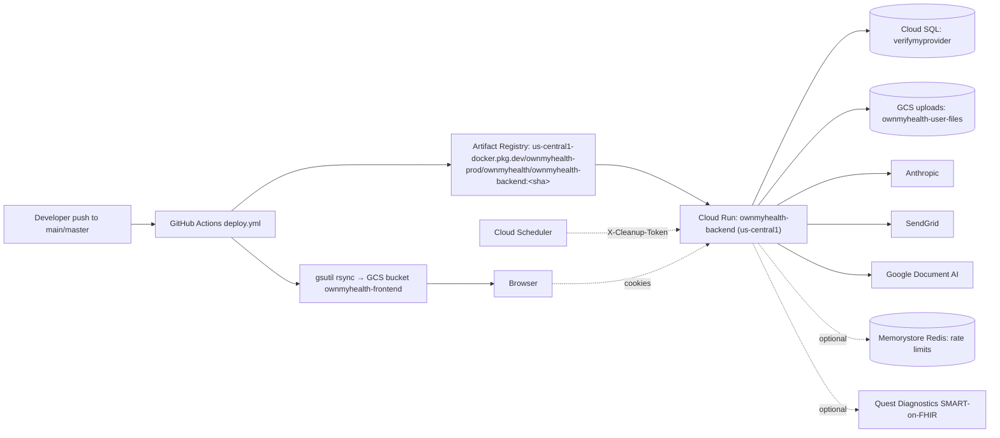

---
tags:
  - documentation
  - operations
type: prompt
priority: 2
updated: 2026-08-01
---

# Generate RUNBOOK.md

> **Posture gate (2026-08-01).** This runbook describes operating a Cloud Run + Cloud SQL + GCS
> stack that is **currently suspended** — GCP billing was disabled ~2026-07-12 and there is no
> deployment target (`OPEN_FINDINGS.md` §Posture). Write it as the **launch/restore** runbook and
> label it as such in the header stamp; do not write present-tense instructions implying a running
> production service.
>
> Two sections become load-bearing under this posture:
> 1. **Restore-from-suspension** — what must be true before GCP billing is re-enabled. Note the
>    hard gate from OF-01: the leaked `ocr-service@` key must be deleted in IAM **first**, because
>    re-enabling billing silently re-arms it.
> 2. **Sandbox operations** — the procedures that *do* apply today: local Postgres, migrations,
>    `STORAGE_BACKEND=local` file handling, resetting local state, and running the e2e suite.

## Required reading before generating

Before writing a single line, read:

1. [`_doc-quality.md`](./_doc-quality.md) — self-containedness, citation, TBD, cross-link, and format rules.
2. [`_verification-tools.md`](./_verification-tools.md) — Grep/Glob/Read cheat sheet.
3. [`_phi-inventory.md`](./_phi-inventory.md) — incident playbooks involving PHI must respect encryption + audit contracts.

This doc must pass the five tests in `_doc-quality.md` before you stop.

---

## Purpose

Produce `New Project Documents/RUNBOOK.md` — the **operator's reference**. Deploy, roll back, rotate secrets, migrate the DB, read logs, respond to incidents. Every command must run verbatim. Every step must cite the file or CLI it comes from.

---

## Files to review

| File | Why read it |
|---|---|
| `backend/Dockerfile` | Runtime (Node 22 Alpine, digest-pinned, multi-stage — M15 bump off EOL Node 20), `EXPOSE 3001`, HEALTHCHECK on `/health`. CMD is `["node", "dist/app.js"]` ONLY — migrations explicitly do NOT run at boot (Dockerfile:86-93 comment); they run as a Cloud Run job (`ownmyhealth-migrate`) in `deploy.yml`. |
| `backend/railway.toml` | Legacy Railway runtime config (`startCommand`, `healthcheckPath=/api/v1/health`). Production actually deploys to GCP Cloud Run via GitHub Actions — note the divergence. |
| `.github/workflows/ci.yml`, `deploy.yml`, `deploy-staging.yml`, `maintenance.yml` | Deploy pipeline — image tagging, no-traffic canary + smoke-test + promote, Cloud Run update, GCS frontend `gsutil rsync`. These are the source of truth for project/region/service/bucket names. **The whole deploy is now GATED on CI**: `deploy.yml` invokes `ci.yml` as a reusable workflow (`ci: uses: ./.github/workflows/ci.yml`, deploy.yml:57-60) and `build-and-stage` has `needs: ci` (:65-66); `deploy-frontend` now has `needs: [ci, promote]` (:300-301) — previously it had no `needs` and deployed unconditionally in parallel. `maintenance.yml` runs one-time data-migration / backfill jobs (dry-run default) as the `ownmyhealth-maintenance` Cloud Run job. |
| `DEPLOY.md` | Existing deploy notes — STALE (describes Railway, not the live Cloud Run pipeline). Incorporate the domain/DNS bits, but the deploy mechanics come from the workflows above. |
| `backend/src/app.ts` | Server entry point (NOT `index.ts`). Startup assertions, `startServer()` boots all three schedulers, `app.listen(config.port)`, `/health` + `/api/health/db` endpoints, graceful shutdown. |
| `backend/src/config/index.ts` | Boot-time env validation (JWT secret quality, PHI key format, AUDIT_LOG_SALT length, BAA gates, prod-only hard-fails). Env var matrix (cross-link to ENV_VARS.md). |
| `backend/src/services/database.ts` | DB connection, SSL, pool sizing, `withRLSContext`/`withRLSTransaction` wrappers. |
| `backend/src/services/auditLog.ts` | Audit retention scheduler (`startAuditCleanup`, daily, 2555-day/~7y retention) — disabled in-process when `AUDIT_CLEANUP_TOKEN` delegates to Cloud Scheduler. |
| `backend/src/services/authService.ts` | Session cleanup scheduler (`startSessionCleanup`, every 10 min — also sweeps the revoked-token blacklist). |
| `backend/src/schedulers/emailScheduler.ts` | Engagement email scheduler (`startEmailScheduler`, hourly tick: Monday 08:00 UTC weekly summary, daily goal-reminder + plan-expiry sweeps). |
| `backend/src/routes/internalRoutes.ts` | Cloud Scheduler endpoint `POST /api/v1/internal/audit-cleanup` (shared-secret `X-Cleanup-Token`, 404 when token unset). |
| `backend/prisma/migrations/` | Migration history (32 dirs; newest `20260615_provider_consent_immutable_audit_insert_check`) — on Cloud Run applied via the `ownmyhealth-migrate` Cloud Run job in `deploy.yml` (NOT the Dockerfile CMD, which is node-only). Only `railway.toml` startCommand still carries a boot-time `prisma migrate deploy` (legacy Railway target). |
| `scripts/*` | Operator scripts at repo root (NOT `backend/scripts/`): `check-rls-wrappers.sh` (the only script there — the old NPI-helper `.mjs` files were deleted). |
| `docs/INFRA_REDIS_AND_SCHEDULER.md` | Provisioning runbook for Memorystore (REDIS_URL) + Cloud Scheduler audit retention — reuse its real gcloud commands. |
| `docs/STAGING.md`, `docs/c-8-part-c-runbook.md` | Staging setup + the C-8 NOBYPASSRLS role-cutover runbook (audit-salt migration). |
| Any recent incident / postmortem notes in repo / memory | Reuse real remediation steps. |

---

## Required sections

1. **Quick reference** — prod + staging URLs, GCP project IDs, repo, image repo.
2. **Environments** — local / staging / prod — per-env: branch, deploy trigger, URL, Cloud SQL instance, GCS bucket, service account.
3. **Deployment topology** — diagram + service list.
4. **Deploy: backend** — automatic (push to main) + manual (gcloud commands). Document that the whole deploy is now **gated on CI** (`deploy.yml` invokes `ci.yml` via `workflow_call`; `build-and-stage` has `needs: ci`, deploy.yml:57-66) — nothing builds or ships unless lint+test:ci+build+gitleaks+the live-PG RLS suite pass. Document the **migrate-as-Cloud-Run-job** step: after image push and BEFORE the new revision is staged, `deploy.yml` runs `gcloud run jobs deploy ownmyhealth-migrate --command npx --args prisma,migrate,deploy --max-retries 0 --task-timeout 10m` as the service runtime SA, then `gcloud run jobs execute --wait` (a failed migration fails the DEPLOY, never the running service — deploy.yml:106-161). Spell out how to re-run the job manually and how to read its execution logs.
5. **Deploy: frontend** — automatic + manual (vite build + `gsutil -m rsync`).
6. **Rollback** — Cloud Run revision rollback, traffic-pin gotcha (cross-link to the 2026-04-17 postmortem in memory), frontend rollback.
7. **Database operations** — connect via Cloud SQL proxy, migration procedure, common queries (with PHI-aware redaction warnings). The migration procedure on Cloud Run is the `ownmyhealth-migrate` Cloud Run job (NOT boot-time; see section 4), not the Dockerfile CMD. Also cover the **one-time maintenance / backfill jobs**: `.github/workflows/maintenance.yml` runs them (dry-run default) as the `ownmyhealth-maintenance` Cloud Run job, and the operator scripts `backfill:goal-values` (M4), `backfill:userfile-names` (L24), `consolidate:biomarkers` cannot run from a laptop — they need the per-user PHI encryption key in the deployed env. Note the open ops item: the **L24 userfile-filename re-encrypt backfill has NOT yet been run in prod** (new uploads encrypt; legacy `user_files.original_filename` rows are still plaintext, reads fall back), pending a DRY-RUN then `--apply` run of `backfill:userfile-names` and a follow-up migration to drop the plaintext column.
8. **Secret management** — list, update, rotate. Cover the full set: `JWT_ACCESS_SECRET`, `JWT_REFRESH_SECRET`, `PHI_ENCRYPTION_KEY`, `AUDIT_LOG_SALT`, `ANTHROPIC_API_KEY`, `SENDGRID_API_KEY`, `REDIS_URL`, `AUDIT_CLEANUP_TOKEN`, the `QUEST_FHIR_*` credentials. PHI encryption key rotation is load-bearing — spell out the re-encryption requirement. `AUDIT_LOG_SALT` is also load-bearing: rotating it renders all existing audit-log PHI undecryptable and the app hard-fails on boot if it's unset/too short (config/index.ts) — document the `system_config.audit_encryption_salt` extraction path from `docs/STAGING.md`/`docs/c-8-part-c-runbook.md`. Document the **cross-instance "force logout all" mechanism**: rotating JWT secrets is no longer the only lever, and `DELETE FROM sessions` alone no longer kills in-flight access tokens across replicas. Forcing logout-all is done by stamping `users.tokens_valid_after` via `revokeAllUserTokens` (migration `20260606000002_add_tokens_valid_after`), checked on every request alongside the `revoked_access_tokens` table (migration `20260613_revoked_access_tokens`); both are read in a cached RLS lookup. (Mark `TBD (external: ...)` only if a procedure is genuinely undefined.)
9. **Log access + filtering** — `gcloud logging read` with common filters (auth failures, rate limits, RLS denials). Note the prod logger strips query strings (`?token=...`) — see app.ts morgan `PROD_LOG_FORMAT` and `utils/phiRedaction.ts`.
10. **Schedulers** — table: job, file:line, cadence, effect. There are THREE in-process schedulers (audit cleanup, session cleanup, email engagement) plus the optional Cloud-Scheduler-driven audit cleanup.
11. **Cloud Scheduler / internal endpoint** — when `AUDIT_CLEANUP_TOKEN` is set, the daily in-process audit cleanup is disabled and Cloud Scheduler POSTs to `/api/v1/internal/audit-cleanup` with the `X-Cleanup-Token` header. Document provisioning (cross-link `docs/INFRA_REDIS_AND_SCHEDULER.md`), how to verify it's firing, and the 404 (token unset) vs 401 (bad token) behavior.
12. **Redis rate-limit store** — `REDIS_URL` switches the eight rate limiters from per-instance MemoryStore to shared Memorystore (rateLimitStore.ts). Document the provisioning path, the fallback behavior when unset/unreachable, and the per-instance-dilution caveat (`--max-instances=3`).
13. **Incident playbooks** — one per scenario:
    - Auth outage (JWT mis-config, `JWT_ACCESS_SECRET`/`JWT_REFRESH_SECRET` rotated, sessions all invalid)
    - DB outage (Cloud SQL unavailable, connection pool exhausted)
    - Claude API outage or BAA misconfiguration (`ANTHROPIC_BAA_ACTIVE`)
    - AI spend budget exhausted (aiSpendGuard tripping on `AI_DAILY_BUDGET_USD` / `AI_USER_DAILY_BUDGET_USD`)
    - GCS outage or bucket-permission error
    - Quest FHIR / lab sync outage or OAuth token failure (labSyncService, SMART token revoked/expired)
    - Redis/Memorystore unavailable (rate limiters fall back to per-instance store)
    - PHI leak in logs (triage + remediation + audit)
    - Rate-limit abuse / DDoS
    - Runaway / failed migration (failed midway). NOTE: since migrations run as the `ownmyhealth-migrate` Cloud Run job in `deploy.yml` (`jobs execute --wait`, `--max-retries 0`), a failed migration now **aborts the deploy** (the workflow step exits nonzero) and the OLD revision keeps serving — it no longer crash-loops container boot. The playbook is "the deploy halted before staging a new revision; inspect the migrate-job execution logs, fix forward, re-run the job," NOT "the running service is down."
    - Env-var update silently held back by explicit revision pin (cross-link memory)
14. **Smoke test after deploy** — health check endpoints (`/health`, `/api/health/db`, `/api/v1/health`) + critical path (register → login → create biomarker). The deploy.yml smoke-test job already probes `/api/v1/health`.
15. **Runbook maintenance** — when + how to update this doc.
16. **Related Documents**.
17. **Prompt drift log**.

---

## Required artifacts

### Deployment topology diagram (Mermaid)



### Environments table

| Property | Local | Staging | Prod |
|---|---|---|---|
| Branch | (any) | `staging` | `main` / `master` |
| Deploy trigger | manual | push + `deploy-staging.yml` | push + `deploy.yml` (no-traffic canary → smoke → promote) |
| Frontend URL | `http://localhost:5173` | TBD (external: staging frontend host; bucket `ownmyhealth-frontend-staging`) | `https://app.ownmyhealth.io` / `https://ownmyhealth.io` (hardcoded CORS origins in `app.ts`) |
| Backend URL | `http://localhost:3001` | `https://api-staging.ownmyhealth.io` (deploy-staging.yml health probe) | `https://api.ownmyhealth.io` (deploy.yml post-promote probe) |
| GCP project | n/a | `ownmyhealth-prod` (deploy-staging.yml) | `ownmyhealth-prod` (deploy.yml) |
| Cloud Run service | n/a | `ownmyhealth-backend-staging` | `ownmyhealth-backend` (`--max-instances=3`) |
| Frontend bucket | n/a | `ownmyhealth-frontend-staging` | `ownmyhealth-frontend` |
| Cloud SQL instance | n/a | TBD (external: GCP Console project `ownmyhealth-prod`) | TBD (external: GCP Console project `ownmyhealth-prod`) |
| Database name | `ownmyhealth_dev` | TBD | `verifymyprovider` (per CLAUDE.md) |

Project/region/service/bucket names above are confirmed from the workflow `env:` blocks. Region is `us-central1` for both staging and prod. Fill any remaining TBD by reading the referenced files first. Only keep TBD with a resolution path.

### Schedulers table

| Job | File:line | Cadence | Effect |
|---|---|---|---|
| Audit log retention cleanup | `backend/src/services/auditLog.ts` `startAuditCleanup` (L669) | daily (24h `setInterval`) — DISABLED in-process when `AUDIT_CLEANUP_TOKEN` set | Delete `AuditLog` rows older than 2555 days (~7y); `RETENTION_DAYS` at L10 |
| Session cleanup | `backend/src/services/authService.ts` `startSessionCleanup` (L1792) | every 10 min (`setInterval`) | Sweep revoked-token blacklist (`sweepRevokedTokens`, L239) + `deleteMany` expired sessions |
| Email engagement scheduler | `backend/src/schedulers/emailScheduler.ts` `startEmailScheduler` (L462) | hourly tick | Mon 08:00 UTC weekly summary; once-per-UTC-day goal-reminder + plan-expiry sweeps |
| Audit cleanup via Cloud Scheduler | `backend/src/routes/internalRoutes.ts` `POST /audit-cleanup` (~L40) | external (Cloud Scheduler) when `AUDIT_CLEANUP_TOKEN` set | Same retention delete, triggered by `X-Cleanup-Token` shared secret |
| RLS wrapper sanity check | `scripts/check-rls-wrappers.sh` | manual / pre-deploy / CI (`ci.yml`) | Fails build if controller bypasses `withRLSContext` |

### Rollback commands

```bash
# List Cloud Run revisions
gcloud run revisions list --service=ownmyhealth-backend --region=us-central1 --project=ownmyhealth-prod

# Pin traffic to a specific prior revision (fully replace)
gcloud run services update-traffic ownmyhealth-backend \
  --region=us-central1 \
  --project=ownmyhealth-prod \
  --to-revisions=ownmyhealth-backend-0000N-abc=100
```

**Gotcha**: `gcloud run services update --update-env-vars=...` creates a new revision but keeps 0% traffic if the service was previously pinned with `--to-revisions=...`. Follow with `update-traffic --to-revisions=NEW=100` (or `--to-latest` to drop the pin). See project memory `cloud-run-env-update-pinning.md`.

### Log filter examples

```bash
# Auth failures in last hour
gcloud logging read '
  resource.type="cloud_run_revision"
  resource.labels.service_name="ownmyhealth-backend"
  jsonPayload.action="LOGIN_FAILED"
' --freshness=1h --limit=100

# Rate-limit hits
gcloud logging read '
  resource.type="cloud_run_revision"
  jsonPayload.code="RATE_LIMIT_EXCEEDED"
' --freshness=1d --limit=100

# RLS-denied reads (these may surface as 404 NOT_FOUND with an rls=true tag if logged)
gcloud logging read '
  resource.type="cloud_run_revision"
  jsonPayload.rls_denied=true
' --freshness=1d --limit=100
```

### Incident playbook (template — one per scenario)

```markdown
### Playbook: Auth outage

**Symptoms**: every request returns 401 across users; Cloud Run logs show `JsonWebTokenError: invalid signature`.

**Likely cause**: `JWT_ACCESS_SECRET` or `JWT_REFRESH_SECRET` was rotated but Cloud Run revision wasn't updated (or a new revision didn't receive traffic — see pinning gotcha). Note: both secrets go through `requireEnv()` in config/index.ts, so the app hard-fails to boot if either is missing — a boot crash loop is a separate signal from `invalid signature`.

**Diagnosis**:
1. `gcloud run services describe ownmyhealth-backend --region=us-central1 --project=ownmyhealth-prod --format='value(status.latestReadyRevisionName, status.latestCreatedRevisionName, spec.traffic)'`
2. If `latestReady` ≠ `latestCreated`, traffic is pinned — fix via `update-traffic`.
3. Grep logs for `invalid signature`; correlate with last secret update time.

**Remediation**:
1. Re-deploy with correct secret: `gcloud run services update ownmyhealth-backend --region=us-central1 --project=ownmyhealth-prod --update-secrets=JWT_ACCESS_SECRET=jwt-access-secret:latest,JWT_REFRESH_SECRET=jwt-refresh-secret:latest`.
2. Follow with `update-traffic --to-latest` (or `--to-revisions=NEW=100`).
3. Force logout all users. NOTE: `DELETE FROM sessions` alone only kills refresh tokens and does NOT invalidate in-flight access JWTs across Cloud Run replicas. To truly force logout-all cross-instance, stamp `users.tokens_valid_after` (the `revokeAllUserTokens` path; admin deactivate/role-change and logout-all already do this) — checked on every request alongside the `revoked_access_tokens` table.

**Cross-link**: see `ERROR_RECOVERY.md#unauthenticated`.
```

Write real playbooks for at least the 11 scenarios listed under Required sections.

---

## Acceptance questions

After writing the doc, self-answer each **using only the doc**:

1. What command rolls back to the previous Cloud Run revision?
2. Why might an env-var update not take effect even though a new revision exists? (cite the pinning gotcha)
3. What's the cadence of the audit log retention cleanup, what does it delete, and when does the in-process scheduler get disabled in favor of Cloud Scheduler?
4. How do you connect to the production Cloud SQL DB from your laptop?
5. Which script validates that every controller wraps Prisma calls in `withRLSContext`, and where does it live?
6. What's the deploy trigger for staging vs prod, and what's the prod canary→promote flow?
7. How do you rotate `PHI_ENCRYPTION_KEY` end-to-end? Why is rotating `AUDIT_LOG_SALT` dangerous?
8. Where are secrets stored in prod, and how do you update one (both JWT secrets, by their real names)?
9. What's the smoke-test you run after every deploy, and which endpoints does it hit?
10. Which log filter finds RLS-denied requests in the last hour?
11. What's the playbook for a Claude API outage, step by step? What about AI daily-budget exhaustion?
12. Where do the THREE in-process schedulers run (audit cleanup, session cleanup, email engagement) and with what cadence each?
13. How is the Cloud Scheduler audit-cleanup endpoint authenticated, and what does it return when the token is unset?
14. What does setting `REDIS_URL` change about rate limiting, and what's the fallback when it's unset?

---

## No-TBD enforcement

Before marking anything TBD:

- **URLs and instance names**: read `.github/workflows/deploy.yml` + `deploy-staging.yml` (the `env:` blocks hold project/region/service/bucket); `backend/railway.toml`; `DEPLOY.md` (domain/DNS only — its Railway deploy mechanics are stale); project memory `cloud-run-env-update-pinning.md`.
- **Scheduler cadence**: read each scheduler file; look for `setInterval(ms)`. Three exist: `auditLog.ts` (`startAuditCleanup`, 24h), `authService.ts` (`startSessionCleanup`, 10 min), `schedulers/emailScheduler.ts` (`startEmailScheduler`, hourly). All three are booted from `app.ts startServer()` and stopped in `gracefulShutdown`.
- **Database name**: cross-check `CLAUDE.md` ("verifymyprovider") with `railway.toml` / Cloud Run env vars.
- **Migration command**: confirmed `npx prisma migrate deploy`, but it NO LONGER runs in the `backend/Dockerfile` CMD (CMD is `["node", "dist/app.js"]` only — Dockerfile:93). It runs (a) in `backend/railway.toml` startCommand (legacy Railway target, still true — railway.toml:14) and (b) on Cloud Run as the dedicated `ownmyhealth-migrate` Cloud Run job invoked in `deploy.yml` via `gcloud run jobs deploy ... --command npx --args prisma,migrate,deploy` then `gcloud run jobs execute --wait`, AFTER image push and BEFORE the new revision is staged (deploy.yml:139-161). (`backend/package.json` has no `migrate:deploy` script.)
- **Rollback commands**: the `gcloud run` CLI syntax is stable; include working invocations with real service name (`ownmyhealth-backend`), region (`us-central1`), and project (`ownmyhealth-prod`).
- **Incident playbooks**: if a scenario has no recorded playbook in repo or memory, derive one from the architecture (auth = JWT → session; DB = pool + RLS; GCS = signed URL expiry; Claude = rate limiter + BAA env var) and **mark clearly** which steps are derived vs proven.

If the Cloud SQL instance name is genuinely not in the repo:

```
TBD (external: Cloud SQL instance name lives in GCP Console project ownmyhealth-prod; add to RUNBOOK once confirmed)
```

---

## Cross-links

The generated `RUNBOOK.md` must link to:

- [`ARCHITECTURE.md`](./ARCHITECTURE.md) — system topology.
- [`ENV_VARS.md`](./ENV_VARS.md) — every secret + env var.
- [`DATA_MODEL.md`](./DATA_MODEL.md) — DB schema for migration + query examples.
- [`ERROR_RECOVERY.md`](./ERROR_RECOVERY.md) — per-error recovery.
- [`TROUBLESHOOTING.md`](./TROUBLESHOOTING.md) — broader symptom catalog.
- [`LOCAL_DEV.md`](./LOCAL_DEV.md) — dev setup parallel.
- [`SECURITY_STATUS.md`](./SECURITY_STATUS.md) — open infra findings (e.g., BYPASSRLS).
- [`HIPAA_CHECKLIST.md`](./HIPAA_CHECKLIST.md) — operational HIPAA obligations.

It should also reference these in-repo operational docs (read them while writing):

- `docs/INFRA_REDIS_AND_SCHEDULER.md` — Memorystore (REDIS_URL) + Cloud Scheduler audit-cleanup provisioning.
- `docs/STAGING.md` — staging environment setup + audit-salt migration.
- `docs/c-8-part-c-runbook.md` — NOBYPASSRLS role-cutover runbook.

---

## Verification (tool usage)

| Task | Tool | How |
|---|---|---|
| Read deploy workflows | Read | `.github/workflows/deploy.yml`, `deploy-staging.yml`, `ci.yml` |
| Read Dockerfile | Read | `backend/Dockerfile` |
| Read Railway config | Read | `backend/railway.toml` |
| Find schedulers | Grep | `pattern: "startAuditCleanup|startSessionCleanup|startEmailScheduler|setInterval"` over `backend/src/**` |
| Read operator scripts | Glob | `pattern: "scripts/*"` (repo root, not `backend/scripts/`) |
| Read internal/Cloud Scheduler endpoint | Read | `backend/src/routes/internalRoutes.ts` |
| Read infra provisioning runbook | Read | `docs/INFRA_REDIS_AND_SCHEDULER.md` |
| Read migration scripts | Read | one or two sample `backend/prisma/migrations/*/migration.sql` |
| Read startup assertions | Read | `backend/src/app.ts` (the entry point) and `backend/src/config/index.ts` (boot-time env validation) |

---

## Output: file and location

Write the final document to `New Project Documents/RUNBOOK.md`.
