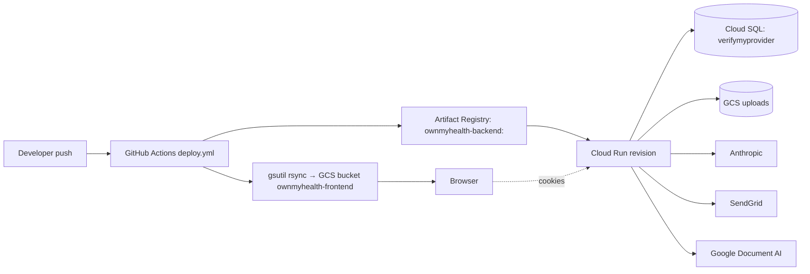

---
tags:
  - documentation
  - operations
type: prompt
priority: 2
updated: 2026-04-24
---

# Generate RUNBOOK.md

## Required reading before generating

Before writing a single line, read:

1. [`_doc-quality.md`](./_doc-quality.md) — self-containedness, citation, TBD, cross-link, and format rules.
2. [`_verification-tools.md`](./_verification-tools.md) — Grep/Glob/Read cheat sheet.
3. [`_phi-inventory.md`](./_phi-inventory.md) — incident playbooks involving PHI must respect encryption + audit contracts.

This doc must pass the five tests in `_doc-quality.md` before you stop.

---

## Purpose

Produce `New Project Documents/RUNBOOK.md` — the **operator's reference**. Deploy, roll back, rotate secrets, migrate the DB, read logs, respond to incidents. Every command must run verbatim. Every step must cite the file or CLI it comes from.

---

## Files to review

| File | Why read it |
|---|---|
| `backend/Dockerfile` | Runtime (Node 20 Alpine, multi-stage), expose port, entrypoint. |
| `backend/railway.toml` | Production/staging runtime config. |
| `.github/workflows/ci.yml`, `deploy.yml`, `deploy-staging.yml` | Deploy pipeline — image tagging, Cloud Run update, GCS frontend sync. |
| `DEPLOY.md` | Existing deploy notes — incorporate, don't ignore. |
| `backend/src/index.ts` | Startup assertions, scheduler boots, listen port. |
| `backend/src/services/database.ts` | DB connection, SSL, pool sizing, RLS wrapper. |
| `backend/src/services/auditLog.ts` | Audit retention scheduler (cadence + retention). |
| `backend/src/services/authService.ts` | Session cleanup scheduler. |
| `backend/src/config/index.ts` | Env var matrix (cross-link to ENV_VARS.md). |
| `backend/prisma/migrations/` | Migration history — how to apply in prod. |
| `backend/scripts/*` | Operator scripts (provider-stats, check-rls-wrappers, check-column-sizes, check-enums). |
| Any recent incident / postmortem notes in repo | Reuse real remediation steps. |

---

## Required sections

1. **Quick reference** — prod + staging URLs, GCP project IDs, repo, image repo.
2. **Environments** — local / staging / prod — per-env: branch, deploy trigger, URL, Cloud SQL instance, GCS bucket, service account.
3. **Deployment topology** — diagram + service list.
4. **Deploy: backend** — automatic (push to main) + manual (gcloud commands).
5. **Deploy: frontend** — automatic + manual (vite build + `gsutil -m rsync`).
6. **Rollback** — Cloud Run revision rollback, traffic-pin gotcha (cross-link to the 2026-04-17 postmortem in memory), frontend rollback.
7. **Database operations** — connect via Cloud SQL proxy, migration procedure, common queries (with PHI-aware redaction warnings).
8. **Secret management** — list, update, rotate. PHI encryption key rotation is load-bearing — spell out the re-encryption requirement (or mark `TBD (external: ...)` if not yet defined).
9. **Log access + filtering** — `gcloud logging read` with common filters (auth failures, rate limits, RLS denials).
10. **Schedulers** — table: job, file:line, cadence, effect.
11. **Incident playbooks** — one per scenario:
    - Auth outage (JWT mis-config, secret rotated, sessions all invalid)
    - DB outage (Cloud SQL unavailable, connection pool exhausted)
    - Claude API outage or BAA misconfiguration
    - GCS outage or bucket-permission error
    - PHI leak in logs (triage + remediation + audit)
    - Rate-limit abuse / DDoS
    - Runaway migration (failed midway)
    - Env-var update silently held back by explicit revision pin (cross-link memory)
12. **Smoke test after deploy** — health check endpoints + critical path (register → login → create biomarker).
13. **Runbook maintenance** — when + how to update this doc.
14. **Related Documents**.
15. **Prompt drift log**.

---

## Required artifacts

### Deployment topology diagram (Mermaid)



### Environments table

| Property | Local | Staging | Prod |
|---|---|---|---|
| Branch | (any) | `staging` | `main` |
| Deploy trigger | manual | push + `deploy-staging.yml` | push + `deploy.yml` |
| Frontend URL | `http://localhost:5173` | TBD (external: see `deploy-staging.yml`) | TBD (external: see `deploy.yml`) |
| Backend URL | `http://localhost:3001` | TBD | TBD |
| Cloud SQL instance | n/a | TBD | TBD (external: GCP Console project) |
| Database name | `ownmyhealth_dev` | TBD | `verifymyprovider` (per CLAUDE.md) |

Fill every TBD by reading the referenced workflow files first. Only keep TBD with a resolution path.

### Schedulers table

| Job | File:line | Cadence | Effect |
|---|---|---|---|
| Audit log retention cleanup | `backend/src/services/auditLog.ts:Lxx` | daily | Delete rows older than 7y |
| Session cleanup | `backend/src/services/authService.ts:Lxx` | every 10 min (verify) | Delete expired sessions |
| RLS wrapper sanity check | `backend/scripts/check-rls-wrappers.sh` | manual / pre-deploy | Fails build if controller bypasses wrapper |

### Rollback commands

```bash
# List Cloud Run revisions
gcloud run revisions list --service=ownmyhealth-backend --region=us-central1

# Pin traffic to a specific prior revision (fully replace)
gcloud run services update-traffic ownmyhealth-backend \
  --region=us-central1 \
  --to-revisions=ownmyhealth-backend-0000N-abc=100
```

**Gotcha**: `gcloud run services update --update-env-vars=...` creates a new revision but keeps 0% traffic if the service was previously pinned with `--to-revisions=...`. Follow with `update-traffic --to-revisions=NEW=100` (or `--to-latest` to drop the pin). See project memory `cloud-run-env-update-pinning.md`.

### Log filter examples

```bash
# Auth failures in last hour
gcloud logging read '
  resource.type="cloud_run_revision"
  resource.labels.service_name="ownmyhealth-backend"
  jsonPayload.action="LOGIN_FAILED"
' --freshness=1h --limit=100

# Rate-limit hits
gcloud logging read '
  resource.type="cloud_run_revision"
  jsonPayload.code="RATE_LIMIT_EXCEEDED"
' --freshness=1d --limit=100

# RLS-denied reads (these may surface as 404 NOT_FOUND with an rls=true tag if logged)
gcloud logging read '
  resource.type="cloud_run_revision"
  jsonPayload.rls_denied=true
' --freshness=1d --limit=100
```

### Incident playbook (template — one per scenario)

```markdown
### Playbook: Auth outage

**Symptoms**: every request returns 401 across users; Cloud Run logs show `JsonWebTokenError: invalid signature`.

**Likely cause**: `JWT_SECRET` or `JWT_REFRESH_SECRET` was rotated but Cloud Run revision wasn't updated (or a new revision didn't receive traffic — see pinning gotcha).

**Diagnosis**:
1. `gcloud run services describe ownmyhealth-backend --region=us-central1 --format='value(status.latestReadyRevisionName, status.latestCreatedRevisionName, spec.traffic)'`
2. If `latestReady` ≠ `latestCreated`, traffic is pinned — fix via `update-traffic`.
3. Grep logs for `invalid signature`; correlate with last secret update time.

**Remediation**:
1. Re-deploy with correct secret: `gcloud run services update ownmyhealth-backend --update-secrets=JWT_SECRET=jwt-secret:latest`.
2. Follow with `update-traffic --to-latest`.
3. Force logout all users (admin endpoint or `DELETE FROM sessions`).

**Cross-link**: see `ERROR_RECOVERY.md#unauthenticated`.
```

Write real playbooks for at least the 8 scenarios listed under Required sections.

---

## Acceptance questions

After writing the doc, self-answer each **using only the doc**:

1. What command rolls back to the previous Cloud Run revision?
2. Why might an env-var update not take effect even though a new revision exists? (cite the pinning gotcha)
3. What's the cadence of the audit log retention cleanup, and what does it delete?
4. How do you connect to the production Cloud SQL DB from your laptop?
5. Which script validates that every controller wraps Prisma calls in `withRLSContext`?
6. What's the deploy trigger for staging vs prod?
7. How do you rotate `PHI_ENCRYPTION_KEY` end-to-end?
8. Where are secrets stored in prod, and how do you update one?
9. What's the smoke-test you run after every deploy?
10. Which log filter finds RLS-denied requests in the last hour?
11. What's the playbook for a Claude API outage, step by step?
12. Where does the session-cleanup scheduler run and with what cadence?

---

## No-TBD enforcement

Before marking anything TBD:

- **URLs and instance names**: read `backend/railway.toml`, `.github/workflows/deploy.yml`, `deploy-staging.yml`, `ci.yml`, `DEPLOY.md`, project memory files (`cloud-run-env-update-pinning.md` if available).
- **Scheduler cadence**: read the scheduler file; look for `setInterval(ms)` / `cron.schedule(...)`.
- **Database name**: cross-check `CLAUDE.md` ("verifymyprovider") with `railway.toml` env vars.
- **Migration command**: read `backend/package.json` scripts; typical is `prisma migrate deploy`.
- **Rollback commands**: the `gcloud run` CLI syntax is stable; include working invocations with real service name + region.
- **Incident playbooks**: if a scenario has no recorded playbook in repo or memory, derive one from the architecture (auth = JWT → session; DB = pool + RLS; GCS = signed URL expiry; Claude = rate limiter + BAA env var) and **mark clearly** which steps are derived vs proven.

If the Cloud SQL instance name is genuinely not in the repo:

```
TBD (external: Cloud SQL instance name lives in GCP Console project ownmyhealth-prod; add to RUNBOOK once confirmed)
```

---

## Cross-links

The generated `RUNBOOK.md` must link to:

- [`ARCHITECTURE.md`](./ARCHITECTURE.md) — system topology.
- [`ENV_VARS.md`](./ENV_VARS.md) — every secret + env var.
- [`DATA_MODEL.md`](./DATA_MODEL.md) — DB schema for migration + query examples.
- [`ERROR_RECOVERY.md`](./ERROR_RECOVERY.md) — per-error recovery.
- [`TROUBLESHOOTING.md`](./TROUBLESHOOTING.md) — broader symptom catalog.
- [`LOCAL_DEV.md`](./LOCAL_DEV.md) — dev setup parallel.
- [`SECURITY_STATUS.md`](./SECURITY_STATUS.md) — open infra findings (e.g., BYPASSRLS).
- [`HIPAA_CHECKLIST.md`](./HIPAA_CHECKLIST.md) — operational HIPAA obligations.

---

## Verification (tool usage)

| Task | Tool | How |
|---|---|---|
| Read deploy workflows | Read | `.github/workflows/deploy.yml`, `deploy-staging.yml`, `ci.yml` |
| Read Dockerfile | Read | `backend/Dockerfile` |
| Read Railway config | Read | `backend/railway.toml` |
| Find schedulers | Grep | `pattern: "setInterval|cron|node-schedule"` over `backend/src/**` |
| Read operator scripts | Glob | `pattern: "backend/scripts/*"` |
| Read migration scripts | Read | one or two sample `backend/prisma/migrations/*/migration.sql` |
| Read startup assertions | Read | `backend/src/index.ts` |

---

## Output: file and location

Write the final document to `New Project Documents/RUNBOOK.md`.
