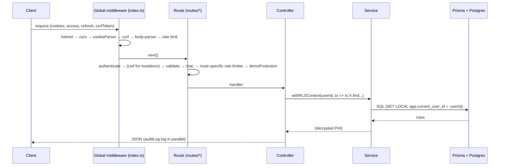
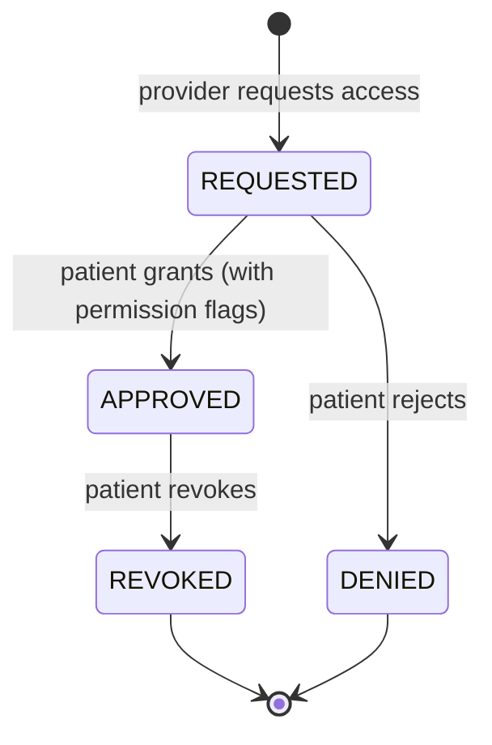

---
tags:
  - documentation
  - architecture
type: prompt
priority: 2
updated: 2026-04-24
---

# Generate ARCHITECTURE.md

## Required reading before generating

Before writing a single line, read:

1. [`_doc-quality.md`](./_doc-quality.md) — self-containedness, citation, TBD, cross-link, and format rules.
2. [`_verification-tools.md`](./_verification-tools.md) — Grep/Glob/Read cheat sheet.
3. [`_phi-inventory.md`](./_phi-inventory.md) — canonical PHI fields that the architecture must protect.

This doc must pass the five tests in `_doc-quality.md` (question-answering, path-and-line, snippet, diagram, reproducibility) before you stop.

---

## Purpose

Produce `New Project Documents/ARCHITECTURE.md` — the **system-overview reference** that orients a reader to OwnMyHealth's moving parts: tech stack, request lifecycle, middleware stack, data flows (auth, CSRF, RLS, consent, AI extraction), deployment topology, and schedulers. This doc is the root of the `New Project Documents/` cross-link graph; every other doc points back here for the big picture.

---

## Files to review

| File | Why read it |
|---|---|
| `backend/src/index.ts` | **Primary** — middleware mount order, scheduler startup, server bootstrap. |
| `backend/src/middleware/*.ts` (all 8) | `auth`, `csrf`, `rbac`, `rateLimiter`, `demoProtection`, `validation`, `errorHandler`, `planGating`. Required for middleware stack section. |
| `backend/src/services/database.ts` | Prisma client + `withRLSContext` / `withRLSTransaction`; pg pool + SSL config. |
| `backend/src/services/encryption.ts` | AES-256-GCM PHI encryption, `PHI_FIELDS`. |
| `backend/src/services/userEncryption.ts` | Per-user key derivation (PBKDF2-SHA512). |
| `backend/src/services/auditLog.ts` | HIPAA audit trail + retention scheduler. |
| `backend/src/services/authService.ts` | Auth logic + session cleanup scheduler. |
| `backend/src/services/storageService.ts` | Google Cloud Storage signed URLs. |
| `backend/src/services/claudeExtraction.ts`, `sbcExtraction.ts` | AI extraction (biomarker guidance, SBC). |
| `backend/src/services/ocrService.ts`, `pdfParser.ts` | PDF + OCR pipeline. |
| `backend/src/services/emailService.ts` | SendGrid. |
| `backend/src/config/index.ts` | Env var catalogue (cross-link to ENV_VARS.md). |
| `backend/prisma/schema.prisma` | Model set overview (detail deferred to DATA_MODEL.md). |
| `backend/prisma/migrations/20260107_add_rls_policies/migration.sql` (or latest) | RLS mechanism — quote policy snippets. |
| `src/contexts/AuthContext.tsx` | Frontend auth state, token refresh sequence. |
| `src/services/api/client.ts` | Axios interceptors, auth header, error normalization. |
| `vite.config.ts` | Build-time chunk splits (PDF, OCR, charts). |
| `backend/Dockerfile` | Runtime (Node 20 Alpine, multi-stage). |
| `backend/railway.toml` | Production runtime env. |
| `.github/workflows/deploy.yml`, `deploy-staging.yml`, `ci.yml` | Deployment topology. |
| `package.json` (root + `backend/`) | Tech-stack versions. |

---

## Required sections

1. **System overview** — one-paragraph product description + one ASCII diagram of the deployment topology (see artifacts).
2. **Technology stack** — 4 tables: frontend, backend, database, external services (with pinned versions from `package.json`).
3. **Request lifecycle** — sequence diagram from client request through the middleware stack to controller → service → Prisma → response.
4. **Middleware stack** — numbered list in mount order, each item citing `backend/src/index.ts:Lxx` and the middleware's file.
5. **Authentication architecture** — sequence diagram + snippet of token issuance and refresh.
6. **CSRF architecture** — double-submit cookie sequence diagram + snippet.
7. **Row-Level Security (RLS)** — enforcement path diagram + SQL policy snippet + wrapper snippet. Cross-link to `DATA_MODEL.md` for the full policy catalog.
8. **Encryption layer** — AES-256-GCM, per-user keys, where encryption runs (which service) and where decryption runs.
9. **Provider-patient consent** — state machine diagram + permission flags list.
10. **AI extraction architecture** — three subflows: biomarker guidance, insurance SBC extraction, cost analysis. Each as a Mermaid diagram.
11. **File upload + OCR pipeline** — sequence diagram (Multer → pdfParser/ocr → claudeExtraction → encrypt → GCS + DB).
12. **Audit logging flow** — write path + retention scheduler.
13. **Deployment topology** — diagram + environment breakdown (local, staging, prod) + service-to-service map.
14. **Scheduled jobs** — table: job, file:line, cadence, effect.
15. **Role-based access control** — PATIENT / PROVIDER / ADMIN table with capabilities, citing `rbac.ts` role hierarchy.
16. **File structure** — key directories + purpose, with counts from `00-index.md` "Verified codebase counts".
17. **Related Documents** — cross-links.
18. **Prompt drift log** — if this prompt's file list is stale.

---

## Required artifacts

All diagrams must be real ASCII or Mermaid blocks. Placeholder text (`[ASCII diagram]`) is a failing doc per `_doc-quality.md`.

### 1. Deployment topology (ASCII)

```
  ┌─────────────┐     ┌──────────────────┐     ┌───────────────────┐
  │  Browser    │────▶│  GCS bucket      │     │  Cloud SQL (PG)   │
  │  (React)    │     │  frontend/       │     │  verifymyprovider │ ← via Cloud SQL proxy
  └──────┬──────┘     └──────────────────┘     └─────────┬─────────┘
         │                                                ▲
         │ JSON + cookies                                 │
         ▼                                                │
  ┌────────────────────────┐                              │
  │  Cloud Run             │──────────────────────────────┘
  │  ownmyhealth-backend   │
  └─────┬──────────┬───────┘
        │          │
        ▼          ▼
   Anthropic   SendGrid / Google Document AI / GCS (uploads)
```

### 2. Request lifecycle (Mermaid sequence)



### 3. Authentication sequence (Mermaid)

Register → verify email → login → (access + refresh cookies) → refresh rotation. Include `JWT_ACCESS_SECRET` / `JWT_REFRESH_SECRET` touchpoints with file:line refs from `authService.ts`.

### 4. CSRF double-submit cookie (Mermaid)

Server sets `csrfToken` cookie; client reads and sends as `X-CSRF-Token`; `csrf.ts` timing-safe-compares. Quote the compare function.

### 5. RLS enforcement path (ASCII)

```
request → authenticate → req.user.id
                         │
                         ▼
        controller: withRLSContext(userId, async (tx) => ...)
                         │
                         ▼
                database.ts: SET LOCAL app.current_user_id = :userId
                         │
                         ▼
          Prisma-generated SQL (via tx) carries SET LOCAL
                         │
                         ▼
          Postgres policy: USING (user_id = current_setting(...) OR is_admin_session())
                         │
                         ▼
                     allowed rows
```

Include the warning from `CLAUDE.md` about using `prisma.X` vs `tx.X` inside the callback — quote the snippet.

### 6. Provider-patient consent state machine (Mermaid)



### 7. AI extraction flow (Mermaid, three subflows)

Biomarker guidance, SBC extraction, cost analysis — each as a separate sequence diagram. Cite `claudeExtraction.ts`, `sbcExtraction.ts`, controller entry points, and the rate limiters (`aiLimiter`).

### 8. File upload + OCR (Mermaid)

Upload → Multer → pdfParser (if PDF text) → ocrService (if image) → claudeExtraction → encrypt → GCS + DB rows.

### 9. Audit log flow (ASCII)

Controller → `auditLog.log({ userId, action, resourceType, resourceId, previousValues?, newValues? })` → encrypted snapshot in `audit_logs` → retention scheduler purges beyond 7y (with file:line).

### 10. Deployment topology (Mermaid, optional second variant)

Repository → GitHub Actions (`deploy.yml`) → Docker build + push to Artifact Registry → Cloud Run revision → Cloud SQL + GCS + Secret Manager.

### 11. ER overview

Small Mermaid ER of the top 8 models — **cross-link to `DATA_MODEL.md`** for the full ER and per-model tables. Do not duplicate the detail here.

### 12. Scheduled jobs table

| Job | File:line | Cadence | Effect |
|---|---|---|---|
| Audit log cleanup | `backend/src/services/auditLog.ts:Lxx` | daily | Delete rows > 7y |
| Session cleanup | `backend/src/services/authService.ts:Lxx` | hourly | Delete expired sessions |
| ... | ... | ... | ... |

### 13. Tech-stack tables (versions from `package.json`)

```markdown
| Component | Technology | Version | Pinned at |
|---|---|---|---|
| React | React | 18.3.x | `package.json:Lxx` |
| ... |
```

---

## Acceptance questions

After writing the doc, self-answer each **using only the doc + siblings**:

1. What middleware runs before CSRF validation, and in what order?
2. How does the backend identify the authenticated user for RLS? (cite the controller pattern)
3. What's the difference between `withRLSContext` and `withRLSTransaction`, and when must you use the latter?
4. Why is calling `prisma.X` inside a `withRLSContext` callback incorrect? What does the policy see?
5. Which service encrypts PHI before DB write? Which decrypts on read?
6. How does CSRF double-submit work in this codebase? Which compare function is used?
7. What's the state machine for provider-patient consent?
8. Which rate limiter guards Claude API endpoints?
9. Which scheduler removes expired sessions and at what cadence?
10. What runs in Cloud Run vs Cloud SQL vs GCS in production?
11. What's the request → response path for `POST /api/v1/biomarkers`?
12. How does the frontend refresh an expired access token?
13. Which env vars gate the Anthropic BAA posture? (cross-link to ENV_VARS.md)
14. What changes structurally when a user is deleted? (cross-link to DATA_MODEL.md cascades)
15. How does the SBC upload flow route data from PDF to biomarker records?
16. Which middleware blocks demo accounts from creating real PHI, and where is it applied?
17. What Node version runs in Cloud Run? (cite Dockerfile)
18. Which GitHub workflow builds + deploys the backend?
19. What error shape does the API always return? (cite `errorHandler.ts`)
20. Which services call out to third-party APIs, and what's the timeout policy?

After writing, if any answer requires opening a source file, patch the doc.

---

## No-TBD enforcement

Before marking anything TBD:

- **For middleware order**: read `backend/src/index.ts` top-to-bottom; the `app.use(...)` sequence *is* the order.
- **For version pins**: read `package.json` (both root and `backend/`).
- **For RLS policy body**: read the latest `add_rls_policies/migration.sql`; quote it.
- **For scheduler cadence**: read `auditLog.ts`, `authService.ts`; search for `setInterval(`, `cron`, `node-schedule`.
- **For Cloud Run / Cloud SQL config**: read `railway.toml`, `.github/workflows/deploy.yml` `run` steps.
- **For third-party timeouts**: read each service file; search for `timeout:`, `AbortController`.
- **For cost numbers**: cost per user is usually not in code. Only after reading `railway.toml` + `deploy.yml` + `package.json` + session summaries, mark:

```
TBD (external: per-user cost estimate lives in the billing console — see FINANCIAL_TRACKER.md)
```

Cross-link to `FINANCIAL_TRACKER.md` instead of guessing.

---

## Cross-links

The generated `ARCHITECTURE.md` must link to:

- [`API_REFERENCE.md`](./API_REFERENCE.md) — per-endpoint contracts.
- [`ROUTING_TABLE.md`](./ROUTING_TABLE.md) — per-route middleware chain detail.
- [`DATA_MODEL.md`](./DATA_MODEL.md) — full schema, RLS policies, cascades.
- [`PHI_TAXONOMY.md`](./PHI_TAXONOMY.md) — per-field encryption + audit coverage.
- [`ENV_VARS.md`](./ENV_VARS.md) — every env var wired into these flows.
- [`RUNBOOK.md`](./RUNBOOK.md) — how to operate this stack.
- [`LOCAL_DEV.md`](./LOCAL_DEV.md) — how to run it locally.
- [`SECURITY_STATUS.md`](./SECURITY_STATUS.md) — open findings against these flows.
- [`HIPAA_CHECKLIST.md`](./HIPAA_CHECKLIST.md) — which safeguard each layer satisfies.
- [`FINANCIAL_TRACKER.md`](./FINANCIAL_TRACKER.md) — cost model.

---

## Verification (tool usage)

| Task | Tool | How |
|---|---|---|
| Read middleware mount order | Read | `backend/src/index.ts` |
| List middleware files | Glob | `pattern: "backend/src/middleware/*.ts"` |
| Find schedulers | Grep | `pattern: "setInterval\\(|cron|schedule"` over `backend/src/**` |
| Read RLS wrapper | Read | `backend/src/services/database.ts` |
| Read RLS policies | Read | latest `backend/prisma/migrations/*/migration.sql` with `RLS` in name |
| Read Docker image | Read | `backend/Dockerfile` |
| Read deploy workflow | Read | `.github/workflows/deploy.yml` |
| Find third-party timeouts | Grep | `pattern: "timeout:|AbortController"` over `backend/src/services/**` |

---

## Questions to ask the user (last resort)

Only after exhausting the No-TBD search. These are legitimately external:

1. Per-user cost estimates (billing console).
2. Planned architectural pivots not yet reflected in code.
3. Strategic rationale behind feature removals (beyond what's in `CLAUDE.md`).

---

## Output: file and location

Write the final document to `New Project Documents/ARCHITECTURE.md`.
