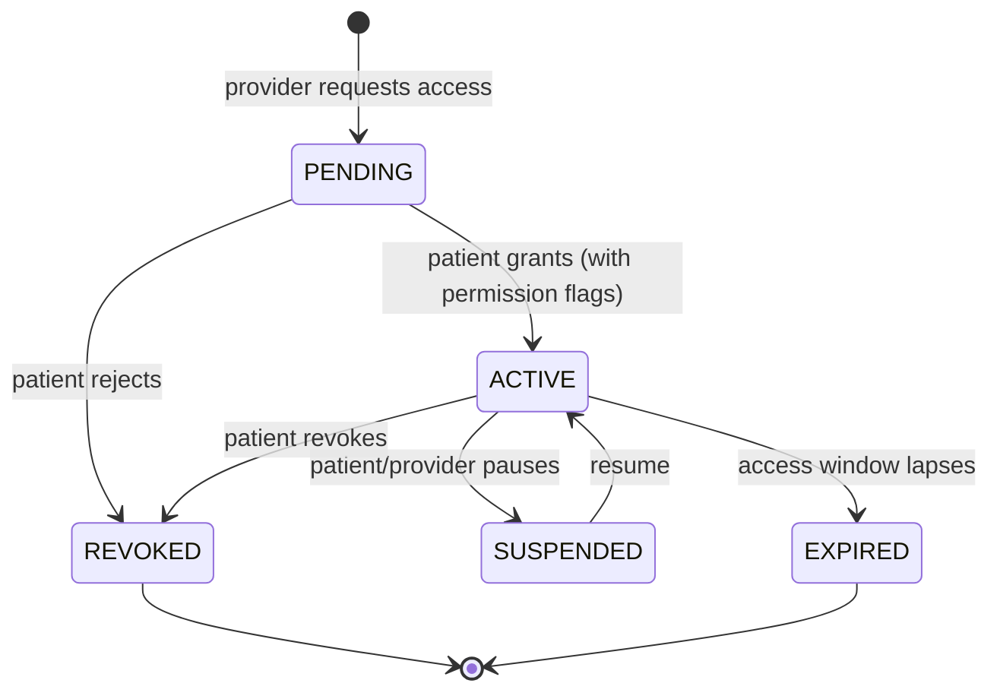

---
tags:
  - documentation
  - architecture
type: prompt
priority: 2
updated: 2026-06-16
---

# Generate ARCHITECTURE.md

## Required reading before generating

Before writing a single line, read:

1. [`_doc-quality.md`](./_doc-quality.md) — self-containedness, citation, TBD, cross-link, and format rules.
2. [`_verification-tools.md`](./_verification-tools.md) — Grep/Glob/Read cheat sheet.
3. [`_phi-inventory.md`](./_phi-inventory.md) — canonical PHI fields that the architecture must protect.

This doc must pass the five tests in `_doc-quality.md` (question-answering, path-and-line, snippet, diagram, reproducibility) before you stop.

---

## Purpose

Produce `New Project Documents/ARCHITECTURE.md` — the **system-overview reference** that orients a reader to OwnMyHealth's moving parts: tech stack, request lifecycle, middleware stack, data flows (auth, CSRF, RLS, consent, AI extraction + AI cost control, Quest SMART-on-FHIR lab sync, onboarding), deployment topology, and schedulers. This doc is the root of the `New Project Documents/` cross-link graph; every other doc points back here for the big picture.

---

## Files to review

| File | Why read it |
|---|---|
| `backend/src/app.ts` | **Primary** — middleware mount order, scheduler startup, server bootstrap, CORS/CSP config (the server entry is `app.ts`, NOT `index.ts`). |
| `backend/src/middleware/*.ts` (all 11, non-test, incl. `index.ts` barrel) | `auth`, `csrf`, `rbac`, `rateLimiter`, `rateLimitStore`, `demoProtection`, `validation`, `errorHandler`, `planGating`, `aiSpendGuard`, `index`. Required for middleware stack section. |
| `backend/src/services/database.ts` | Prisma client + `withRLSContext` (`:498`) / `withRLSTransaction` (`:519`); pg pool + SSL config; boot-time `assertRLSForced()` (`:270`, called at `:193`) — hard-fails (prod) if any RLS table lacks FORCE ROW LEVEL SECURITY. |
| `backend/src/services/encryption.ts` | AES-256-GCM PHI encryption, `PHI_FIELDS` (`:476`); `decryptOriginalFilename` helper (L24 filename encryption). |
| `backend/src/services/userEncryption.ts` | Per-user key derivation (PBKDF2-SHA512). |
| `backend/src/services/auditLog.ts` | HIPAA audit trail + retention scheduler (`startAuditCleanup:669`). |
| `backend/src/services/authService.ts` | Auth logic + session cleanup scheduler (`startSessionCleanup:1792`); cross-instance access-token revocation (jti + `tokens_valid_after` + refresh-reuse family revoke). |
| `backend/src/schedulers/emailScheduler.ts` | Engagement-email scheduler (`startEmailScheduler:462`) — weekly summary, goal reminders, plan-expiring sweep. |
| `backend/src/services/storageService.ts` | Google Cloud Storage signed URLs. |
| `backend/src/services/claudeExtraction.ts`, `sbcExtraction.ts`, `biomarkerExtractor.ts` | AI extraction (biomarker guidance, SBC, lab-report biomarker extraction). |
| `backend/src/services/biomarkerSeries.ts` | **NEW (post-06-01)** — `upsertBiomarkerReading`: the biomarker time-series merge. All create/bulk/FHIR paths APPEND to one series (anchor = newest, `BiomarkerHistory` = older readings) instead of creating disconnected rows; outcomes: created / promoted / archived / corrected. |
| `backend/src/services/biomarkerConsolidation.ts`, `data/biomarkerDefinitions.ts` | **NEW (post-06-01)** — biomarker consolidation/dedupe + canonical biomarker reference definitions backing the series merge. |
| `backend/src/services/anthropicClient.ts`, `aiCostTracker.ts`, `usageTracker.ts` | Claude API client + AI spend/usage tracking (feeds `aiSpendGuard`). |
| `backend/src/services/ocrService.ts`, `pdfParser.ts`, `pdfTextExtraction.ts` | PDF + OCR pipeline. |
| `backend/src/services/fhir/*.ts` | Quest SMART-on-FHIR lab sync: `fhirClient`, `smartAuth`, `labSyncService`, `loincMapper`, `urlSafety` (SSRF guard), `mockFhirServer` (dev only). |
| `backend/src/services/onboardingService.ts`, `notificationService.ts`, `emailService.ts`, `emailTemplates.ts` | Onboarding wizard, notification preferences, SendGrid email. |
| `backend/src/config/index.ts` | Env var catalogue (cross-link to ENV_VARS.md). `config/` also has `jwtOptions.ts` and `plans.ts` (billing tiers). |
| `backend/prisma/schema.prisma` | Model set overview — 19 models (detail deferred to DATA_MODEL.md). `RevokedAccessToken` (`:96`) was added post-06-01 for cross-instance token revocation. |
| `backend/prisma/migrations/20260107_add_rls_policies/migration.sql` (or latest RLS migration, e.g. `20260529_fix_has_provider_access`, `20260530_add_users_select_provider`) | RLS mechanism — quote policy snippets. |
| `src/contexts/AuthContext.tsx` | Frontend auth state, token refresh sequence. |
| `src/services/api/client.ts` | Axios interceptors, auth header, error normalization. |
| `vite.config.ts` | Build-time chunk splits (PDF, OCR, charts). |
| `backend/Dockerfile` | Runtime (Node 22 Alpine, digest-pinned, multi-stage; `CMD ["node", "dist/app.js"]`). **Migrations do NOT run at boot** — they run as the `ownmyhealth-migrate` Cloud Run job in the deploy pipeline (the old `migrate && node` boot CMD was the documented root cause of a 10-day prod outage, teardown #18). |
| `backend/railway.toml` | Production runtime env. |
| `.github/workflows/ci.yml`, `deploy.yml`, `deploy-staging.yml`, `maintenance.yml` | Deployment topology. `deploy.yml` is gated on `ci.yml` (`needs: ci` via `workflow_call`); `maintenance.yml` is a manual `workflow_dispatch` that runs one-time data migrations/backfills (dry-run default) as the `ownmyhealth-maintenance` Cloud Run job. |
| `package.json` (root + `backend/`) | Tech-stack versions. |

---

## Required sections

1. **System overview** — one-paragraph product description + one ASCII diagram of the deployment topology (see artifacts).
2. **Technology stack** — 4 tables: frontend, backend, database, external services (with pinned versions from `package.json`).
3. **Request lifecycle** — sequence diagram from client request through the middleware stack to controller → service → Prisma → response.
4. **Middleware stack** — numbered list in mount order, each item citing `backend/src/app.ts:Lxx` and the middleware's file. The global stack is now: `helmet` → `cors` (+ explicit `OPTIONS` handler) → `cookieParser` → `compression` (SSE-exempt) → `csrfProtection` (dev-skippable via `DISABLE_CSRF`) → `standardLimiter` → `morgan` (query-stripped prod format) → `express.json`/`urlencoded` (10MB) → `requireJsonContentType` → `/api` `Cache-Control: no-store` → routes → `notFoundHandler` → `errorHandler`. Note `internalRoutes` (Cloud Scheduler, shared-secret, CSRF-exempt) and the dev-only mounted mock FHIR server.
5. **Authentication architecture** — sequence diagram + snippet of token issuance and refresh. **Must also cover the post-06-01 cross-instance revocation rewrite**: access JWTs now carry a `jti` (uuid); single-device logout records the jti in the new `revoked_access_tokens` table (cross-instance); logout-all / password-change / reset / email-change / admin-deactivate stamp `users.tokens_valid_after`; `authenticate` / `optionalAuth` / `requireBearerAuth` check BOTH the per-user cutoff and the revoked-jti set; refresh-token reuse outside a 10s grace window revokes the entire token family. Cite migrations `20260606000002_add_tokens_valid_after`, `20260613_revoked_access_tokens`, and `schema.prisma:96` (`RevokedAccessToken`).
6. **CSRF architecture** — double-submit cookie sequence diagram + snippet.
7. **Row-Level Security (RLS)** — enforcement path diagram + SQL policy snippet + wrapper snippet. **Must capture the post-06-01 hardening**: as of migration `20260613_force_rls_and_audit_retention`, **FORCE ROW LEVEL SECURITY** is applied to all 19 RLS tables (closes the table-owner bypass), and `database.ts` now runs `assertRLSForced()` at boot (`:270`, called at `:193`) which hard-fails in prod if any RLS-enabled table is not FORCE-protected (`'Refusing to start — add FORCE ROW LEVEL SECURITY (see migration 20260613)'`). Cross-link to `DATA_MODEL.md` for the full policy catalog.
8. **Encryption layer** — AES-256-GCM, per-user keys, where encryption runs (which service) and where decryption runs. **Flag the post-06-01 PHI_FIELDS expansion**: `UserFile.originalFilenameEncrypted` (L24, with the `decryptOriginalFilename` helper and a `backfill-userfile-filenames` maintenance job), `HealthGoal.current/start/targetValueEncrypted` + `GoalProgressHistory.valueEncrypted` (M4), and `AuditLog.metadataEncrypted` (M6 — the legacy plaintext `audit_logs.metadata` column was IRREVERSIBLY DROPPED in migration `20260615_drop_legacy_audit_metadata`). PHI_FIELDS is now 14 models / 39 fields. Defer the per-field catalog to `_phi-inventory.md` / `PHI_TAXONOMY.md`.
9. **Provider-patient consent** — state machine diagram + permission flags list.
10. **AI extraction architecture** — subflows: biomarker guidance, insurance SBC extraction, cost analysis, lab-report biomarker extraction, and the conversational Health Guide chat (`aiChatController.handleAIChat:135`, SSE-streamed). Each as a Mermaid diagram. Cite `claudeExtraction.ts`, `sbcExtraction.ts`, `biomarkerExtractor.ts`, `anthropicClient.ts`.
11. **AI cost-control architecture** — how `aiSpendGuard` (`backend/src/middleware/aiSpendGuard.ts:28`) gates AI endpoints against per-day and per-user budgets (`AI_DAILY_BUDGET_USD`, `AI_USER_DAILY_BUDGET_USD`), backed by `aiCostTracker.ts` + `usageTracker.ts`, and the `ANTHROPIC_BAA_ACTIVE` runtime gate. **Capture the post-06-01 rewrite**: `aiCostTracker` is now a pluggable `SpendStore` — `InMemorySpendStore` (default) or `RedisSpendStore` (shared/atomic when `REDIS_URL` is set, `config/index.ts:186`); the old `isAISpendExceeded` was DELETED in favor of `admitAISpend(userId)` which returns `Admission{admitted, scope, settle}` with a `$0.05` reservation (`RESERVATION_USD`); `aiSpendGuard` fails **CLOSED with 503** on both budget-reached and Redis-error. Note the in-memory default means the effective ceiling under autoscale is N×budget (per instance). `aiSpendGuard` mounts at 8 points across 5 route files (aiRoutes, uploadRoutes ×3, biomarkerRoutes, expenseRoutes, insuranceRoutes ×2).
12. **Quest SMART-on-FHIR lab sync** — OAuth flow diagram: `smartAuth` authorization → encrypted token storage on `LabConnection` (`accessTokenEncrypted`/`refreshTokenEncrypted`) → `labSyncService` pull → `loincMapper` → Biomarker rows. Call out `urlSafety.ts` (SSRF guard on FHIR URLs) and the `QUEST_FHIR_*` env vars. **Post-06-01: FHIR sync is now idempotent on the stable Observation id** (`sourceFile = fhir:{provider}:{obs.id}`) and biomarker writes flow through the time-series merge (Section 13), not raw row inserts.
13. **File upload + OCR pipeline + biomarker time-series merge** — sequence diagram (Multer → pdfParser/pdfTextExtraction or ocrService → claudeExtraction/biomarkerExtractor → encrypt → GCS + DB). Upload handlers now live in `backend/src/controllers/upload/` (`labUploadController.ts`, `sbcUploadController.ts`, `shared.ts`) — the old top-level `uploadController.ts` no longer exists. The `original_filename` written to `user_files` is now AES-256-GCM encrypted (`UserFile.originalFilenameEncrypted`, L24). **Headline post-06-01 behavioral change**: biomarker writes from ALL paths (manual create, bulk, upload-extraction, FHIR) now go through `biomarkerSeries.ts` `upsertBiomarkerReading`, which APPENDS to a single per-biomarker series (anchor row = newest reading, `BiomarkerHistory` = older readings) instead of creating disconnected rows — outcomes are created / promoted / archived / corrected. Document this merge as its own sub-diagram.
14. **Onboarding flow** — first-session wizard state machine (`onboardingService.ts`, `onboardingRoutes`, frontend `onboarding/` components).
15. **Audit logging flow** — write path + retention scheduler.
16. **Deployment topology** — diagram + environment breakdown (local, staging, prod) + service-to-service map. **Capture the post-06-01 CI-gated pipeline**: `deploy.yml` invokes `ci.yml` via `workflow_call` (`needs: ci`), so nothing builds/ships unless lint + test + build + gitleaks + the live-PG RLS job pass; migrations run as the `ownmyhealth-migrate` Cloud Run job AFTER image push and BEFORE the revision is staged; the deploy uses a 0%-traffic staged revision → smoke-test → named-revision promote. Also note `maintenance.yml` (manual one-time backfills via the `ownmyhealth-maintenance` job).
17. **Scheduled jobs** — table: job, file:line, cadence, effect (audit cleanup, session cleanup, AND the engagement email scheduler).
18. **Role-based access control** — PATIENT / PROVIDER / ADMIN table with capabilities, citing `rbac.ts` role hierarchy. Note `planGating.ts` (billing-tier gating, `config/plans.ts`) is a separate authorization axis layered on top of RBAC.
19. **File structure** — key directories + purpose, with counts from `00-index.md` "Verified codebase counts". Verify before inheriting: `src/services/api` now has **18** `.ts` modules (`admin, ai, auth, biomarkers, client, expenses, fhir, files, healthGoals, healthNeeds, index, insurance, onboarding, patient, plan, provider, settings, upload` — `ai.ts`, `fhir.ts`, `onboarding.ts`, `plan.ts` are post-06-01 additions; do NOT carry a stale 13-file count). Frontend is ~73 `.tsx` across 14 component dirs.
20. **Related Documents** — cross-links.
21. **Prompt drift log** — if this prompt's file list is stale.

---

## Required artifacts

All diagrams must be real ASCII or Mermaid blocks. Placeholder text (`[ASCII diagram]`) is a failing doc per `_doc-quality.md`.

### 1. Deployment topology (ASCII)

```
  ┌─────────────┐     ┌──────────────────┐     ┌───────────────────┐
  │  Browser    │────▶│  GCS bucket      │     │  Cloud SQL (PG)   │
  │  (React)    │     │  frontend/       │     │  verifymyprovider │ ← via Cloud SQL proxy
  └──────┬──────┘     └──────────────────┘     └─────────┬─────────┘
         │                                                ▲
         │ JSON + cookies                                 │
         ▼                                                │
  ┌────────────────────────┐                              │
  │  Cloud Run             │──────────────────────────────┘
  │  ownmyhealth-backend   │
  └─────┬──────────┬───────┘
        │          │
        ▼          ▼
   Anthropic   SendGrid / Google Document AI / GCS (uploads)
```

### 2. Request lifecycle (Mermaid sequence)


### 3. Authentication sequence (Mermaid)

Register → verify email → login → (access + refresh cookies) → refresh rotation. Include `JWT_ACCESS_SECRET` / `JWT_REFRESH_SECRET` touchpoints with file:line refs from `authService.ts`.

### 4. CSRF double-submit cookie (Mermaid)

Server sets `csrfToken` cookie; client reads and sends as `X-CSRF-Token`; `csrf.ts` timing-safe-compares. Quote the compare function.

### 5. RLS enforcement path (ASCII)

```
request → authenticate → req.user.id
                         │
                         ▼
        controller: withRLSContext(userId, async (tx) => ...)
                         │
                         ▼
                database.ts: SET LOCAL app.current_user_id = :userId
                         │
                         ▼
          Prisma-generated SQL (via tx) carries SET LOCAL
                         │
                         ▼
          Postgres policy: USING (user_id = current_setting(...) OR is_admin_session())
                         │
                         ▼
                     allowed rows
```

Include the warning from `CLAUDE.md` about using `prisma.X` vs `tx.X` inside the callback — quote the snippet.

### 6. Provider-patient consent state machine (Mermaid)

Use the **actual** `ProviderPatientStatus` enum from `schema.prisma:578` — `PENDING`, `ACTIVE`, `SUSPENDED`, `REVOKED`, `EXPIRED` (the old REQUESTED/APPROVED/DENIED labels are not real). Verify the transitions in `providerController`/`patientRoutes` before drawing.



### 7. AI extraction flow (Mermaid, subflows)

Biomarker guidance, SBC extraction, cost analysis, lab-report biomarker extraction, and the Health Guide chat (`aiChatController.handleAIChat:135`) — each as a separate sequence diagram. Cite `claudeExtraction.ts`, `sbcExtraction.ts`, `biomarkerExtractor.ts`, `anthropicClient.ts`, controller entry points, the `aiLimiter` rate limiter, AND the `aiSpendGuard` middleware (`aiSpendGuard.ts:28`) that fronts every AI call against the daily/per-user budget (now `admitAISpend` reserve/settle, 503 fail-closed).

### 8. File upload + OCR (Mermaid)

Upload → Multer → pdfParser (if PDF text) → ocrService (if image) → claudeExtraction → encrypt → GCS + DB rows.

### 9. Audit log flow (ASCII)

Controller → `auditLog.log({ userId, action, resourceType, resourceId, previousValues?, newValues? })` → encrypted snapshot in `audit_logs` → retention scheduler purges beyond 7y (with file:line).

### 10. Deployment topology (Mermaid, optional second variant)

Repository → GitHub Actions `ci.yml` (lint + test + build + gitleaks + live-PG RLS job) → `deploy.yml` (`needs: ci`) → Docker build + push to Artifact Registry → `ownmyhealth-migrate` Cloud Run job (`prisma migrate deploy`) → 0%-traffic staged Cloud Run revision → smoke-test → named-revision promote → Cloud SQL + GCS + Secret Manager. (Migrations are NOT run at container boot.)

### 11. ER overview

Small Mermaid ER of the top 8 of the 19 models — **cross-link to `DATA_MODEL.md`** for the full ER and per-model tables. Do not duplicate the detail here. (DNAVariant/GeneticTrait were dropped in migration `20260423_drop_dna_genetics`; do not reintroduce them. New since the old prompt era: `InsuranceBenefit`, `SystemConfig`, `LabConnection`, and `RevokedAccessToken` — the latter added post-06-01 for cross-instance token revocation.)

### 12. Scheduled jobs table

| Job | File:line | Cadence | Effect |
|---|---|---|---|
| Audit log cleanup | `backend/src/services/auditLog.ts:669` (`startAuditCleanup`) | daily | Delete rows > 7y |
| Session cleanup | `backend/src/services/authService.ts:1792` (`startSessionCleanup`) | per interval | Delete expired sessions |
| Engagement email scheduler | `backend/src/schedulers/emailScheduler.ts:462` (`startEmailScheduler`) | weekly summary + goal reminders (Mon 8am UTC), daily plan-expiring sweep | Send SendGrid digests |
| ... | ... | ... | ... |

### 13. Tech-stack tables (versions from `package.json`)

```markdown
| Component | Technology | Version | Pinned at |
|---|---|---|---|
| React | React | 18.3.x | `package.json:Lxx` |
| ... |
```

---

## Acceptance questions

After writing the doc, self-answer each **using only the doc + siblings**:

1. What middleware runs before CSRF validation, and in what order?
2. How does the backend identify the authenticated user for RLS? (cite the controller pattern)
3. What's the difference between `withRLSContext` and `withRLSTransaction`, and when must you use the latter?
4. Why is calling `prisma.X` inside a `withRLSContext` callback incorrect? What does the policy see?
5. Which service encrypts PHI before DB write? Which decrypts on read?
6. How does CSRF double-submit work in this codebase? Which compare function is used?
7. What's the state machine for provider-patient consent?
8. Which rate limiter guards Claude API endpoints?
9. Which scheduler removes expired sessions and at what cadence?
10. What runs in Cloud Run vs Cloud SQL vs GCS in production?
11. What's the request → response path for `POST /api/v1/biomarkers`?
12. How does the frontend refresh an expired access token?
13. Which env vars gate the Anthropic BAA posture? (cross-link to ENV_VARS.md)
14. What changes structurally when a user is deleted? (cross-link to DATA_MODEL.md cascades)
15. How does the SBC upload flow route data from PDF to biomarker records?
16. Which middleware blocks demo accounts from creating real PHI, and where is it applied?
17. What Node version runs in Cloud Run, and where do migrations run? (cite Dockerfile — Node 22 Alpine digest-pinned, `CMD ["node", "dist/app.js"]`; migrations run as the `ownmyhealth-migrate` Cloud Run job in `deploy.yml`, NOT at container boot)
18. Which GitHub workflow builds + deploys the backend?
19. What error shape does the API always return? (cite `errorHandler.ts`)
20. Which services call out to third-party APIs, and what's the timeout policy?
21. How does the platform cap AI spend? (cite `aiSpendGuard`, `aiCostTracker`, and the `AI_DAILY_BUDGET_USD` / `AI_USER_DAILY_BUDGET_USD` env vars)
22. How does a user connect a Quest lab account, and where are the OAuth tokens stored? (cite `smartAuth`, `LabConnection.accessTokenEncrypted`)
23. What protects the FHIR integration from SSRF? (cite `services/fhir/urlSafety.ts`)
24. Which middleware gates features by billing plan, and where is the plan catalogue? (cite `planGating.ts`, `config/plans.ts`)
25. What are the real `ProviderPatientStatus` states? (cite `schema.prisma`)

After writing, if any answer requires opening a source file, patch the doc.

---

## No-TBD enforcement

Before marking anything TBD:

- **For middleware order**: read `backend/src/app.ts` top-to-bottom; the `app.use(...)` sequence *is* the order.
- **For version pins**: read `package.json` (both root and `backend/`).
- **For RLS policy body**: read the latest `add_rls_policies/migration.sql` (plus the later RLS fix migrations `20260529_fix_has_provider_access`, `20260530_add_users_select_provider`); quote it.
- **For scheduler cadence**: read `auditLog.ts`, `authService.ts`, and `schedulers/emailScheduler.ts`; search for `setInterval(`, `cron`, `node-schedule`.
- **For Cloud Run / Cloud SQL config**: read `railway.toml`, `.github/workflows/deploy.yml` `run` steps. Note the deploy is gated on `ci.yml` (`needs: ci`); migrations run as the `ownmyhealth-migrate` Cloud Run job (not at container boot); the revision is staged at 0% traffic → smoke-tested → promoted by name. `maintenance.yml` runs one-time backfills as the `ownmyhealth-maintenance` job.
- **For third-party timeouts**: read each service file; search for `timeout:`, `AbortController`.
- **For cost numbers**: cost per user is usually not in code. Only after reading `railway.toml` + `deploy.yml` + `package.json` + session summaries, mark:

```
TBD (external: per-user cost estimate lives in the billing console — see FINANCIAL_TRACKER.md)
```

Cross-link to `FINANCIAL_TRACKER.md` instead of guessing.

---

## Cross-links

The generated `ARCHITECTURE.md` must link to:

- [`API_REFERENCE.md`](./API_REFERENCE.md) — per-endpoint contracts.
- [`ROUTING_TABLE.md`](./ROUTING_TABLE.md) — per-route middleware chain detail.
- [`DATA_MODEL.md`](./DATA_MODEL.md) — full schema, RLS policies, cascades.
- [`PHI_TAXONOMY.md`](./PHI_TAXONOMY.md) — per-field encryption + audit coverage.
- [`ENV_VARS.md`](./ENV_VARS.md) — every env var wired into these flows.
- [`RUNBOOK.md`](./RUNBOOK.md) — how to operate this stack.
- [`LOCAL_DEV.md`](./LOCAL_DEV.md) — how to run it locally.
- [`SECURITY_STATUS.md`](./SECURITY_STATUS.md) — open findings against these flows.
- [`HIPAA_CHECKLIST.md`](./HIPAA_CHECKLIST.md) — which safeguard each layer satisfies.
- [`FINANCIAL_TRACKER.md`](./FINANCIAL_TRACKER.md) — cost model.

---

## Verification (tool usage)

| Task | Tool | How |
|---|---|---|
| Read middleware mount order | Read | `backend/src/app.ts` |
| List middleware files | Glob | `pattern: "backend/src/middleware/*.ts"` (11 modules, non-test — incl. the `index.ts` barrel) |
| List rate limiters | Grep | `pattern: "Limiter = "` over `backend/src/middleware/rateLimiter.ts` (8 limiters) |
| Find schedulers | Grep | `pattern: "setInterval\\(|cron|schedule"` over `backend/src/**` (also check `backend/src/schedulers/`) |
| Read RLS wrapper | Read | `backend/src/services/database.ts` |
| Read RLS policies | Read | latest `backend/prisma/migrations/*/migration.sql` with `rls`/`provider_access`/`select_provider` in name |
| Read AI spend gate | Read | `backend/src/middleware/aiSpendGuard.ts`, `backend/src/services/aiCostTracker.ts` |
| Read FHIR lab sync | Read | `backend/src/services/fhir/*.ts` (`smartAuth`, `labSyncService`, `urlSafety`) |
| Read Docker image | Read | `backend/Dockerfile` |
| Read deploy workflow | Read | `.github/workflows/deploy.yml` |
| Find third-party timeouts | Grep | `pattern: "timeout:|AbortController"` over `backend/src/services/**` |

---

## Questions to ask the user (last resort)

Only after exhausting the No-TBD search. These are legitimately external:

1. Per-user cost estimates (billing console).
2. Planned architectural pivots not yet reflected in code.
3. Strategic rationale behind feature removals (beyond what's in `CLAUDE.md`).

---

## Output: file and location

Write the final document to `New Project Documents/ARCHITECTURE.md`.
