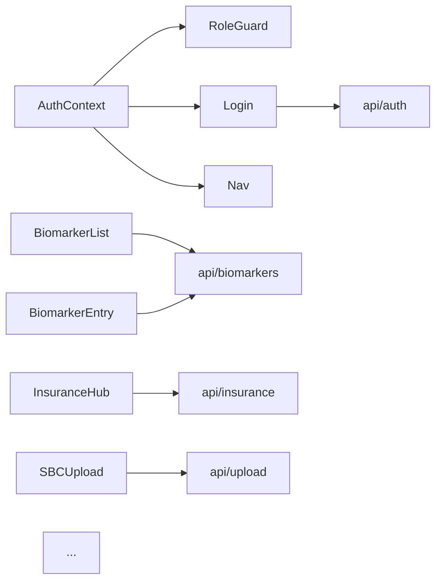

---
tags:
  - documentation
  - frontend
  - reference
type: prompt
priority: 2
updated: 2026-04-24
---

# Generate FRONTEND_MAP.md

## Required reading before generating

Before writing a single line, read:

1. [`_doc-quality.md`](./_doc-quality.md) — self-containedness, citation, TBD, cross-link, and format rules.
2. [`_verification-tools.md`](./_verification-tools.md) — Grep/Glob/Read cheat sheet.

This doc must pass the five tests in `_doc-quality.md` before you stop.

---

## Purpose

Produce `New Project Documents/FRONTEND_MAP.md` — the **component + context + API-service atlas** for the frontend. A Claude Project asked "where do I add a new biomarker input field?" or "which component renders the insurance hub?" must land on the answer via this doc alone.

---

## Files to review

| File | Why read it |
|---|---|
| `src/components/**/*.{tsx,ts}` | 79 component files across 12 dirs — enumerate and categorize. |
| `src/contexts/*.tsx` | AuthContext, ThemeContext, any others — capture the provided state shape. |
| `src/services/api/*.ts` | 17 API modules — each feeds one or more components. |
| `src/services/api/client.ts` | Axios setup, interceptors. |
| `src/App.tsx` (or `src/main.tsx`) | Root layout, routing / conditional rendering. |
| `vite.config.ts` | Chunk splits (PDF, OCR, charts) — which components cause heavy chunks. |
| `src/types/*` | Shared TS interfaces that components consume. |
| `src/data/*` | Sample data, navigation config. |
| `src/__tests__/*` | Component tests reveal usage intent. |

---

## Required sections

1. **Overview** — 79 components across 12 dirs, routing approach (React Router? conditional?), state model (Context only, no Redux).
2. **Component directory catalog** — one H3 per directory (12 total). Each: purpose, top-level components, child components, state deps (which contexts), API service modules used, visual state (list/form/modal), route/URL it maps to.
3. **Routing / URL map** — table mapping URL (or conditional view state) → top-level component → feature.
4. **Context dependency graph** — Mermaid graph showing `AuthContext`, `ThemeContext` consumers.
5. **API client overview** — `src/services/api/client.ts` axios setup, interceptor chain, how it handles 401 refresh, attaches CSRF header.
6. **API-to-component matrix** — table: API module → components that consume it.
7. **Chunk-split components** — which components trigger code-splits (per `vite.config.ts`).
8. **Notable patterns** — RoleGuard wrapper, form validation library, error display, loading states — identify and quote.
9. **Drift findings** — unused components, API modules with no consumers, duplicate functionality.
10. **Related Documents**.
11. **Prompt drift log**.

---

## Required artifacts

### Context / API / Component Mermaid graph



Keep it scannable — do not try to fit all 79 components in one diagram. Produce 3-4 sub-graphs (auth + nav, biomarkers + analytics, insurance, settings + admin) if needed.

### Per-directory template

```markdown
### `src/components/biomarkers/`

Purpose: biomarker display, entry, history, AI guidance.

Top-level components (`file → purpose`):

| Component | File:line | Renders | Consumes contexts | Calls API |
|---|---|---|---|---|
| `BiomarkerList` | `src/components/biomarkers/BiomarkerList.tsx:Lx` | Dashboard list | AuthContext | `api/biomarkers.list` |
| `BiomarkerEntry` | `...:Lx` | Manual entry form | AuthContext | `api/biomarkers.create` |
| `BiomarkerGuidanceModal` | `...:Lx` | AI guidance display | AuthContext | `api/biomarkers.guidance` |
| ... | ... | ... | ... | ... |

Form validation: (Zod? react-hook-form? manual?) — cite the import.

Route/URL: `/biomarkers` (or conditional render — cite `App.tsx:Lx`).

Related API routes: `GET /biomarkers`, `POST /biomarkers`, `POST /biomarkers/:id/guidance` — see [`API_REFERENCE.md#biomarker-endpoints`](./API_REFERENCE.md).
```

### URL / route map

| URL | Top-level component | Feature | Requires auth |
|---|---|---|---|
| `/login` | `Login` | Auth | no |
| `/register` | `Register` | Auth | no |
| `/verify-email` | `EmailVerification` | Auth | no |
| `/dashboard` | `MainDashboard` | Home | yes |
| `/biomarkers` | `BiomarkerList` | Biomarkers | yes |
| `/insurance` | `InsuranceHub` | Insurance | yes |
| `/settings` | `AccountSettingsPage` | Settings | yes |
| ... | ... | ... | ... |

If routing is conditional rendering (no react-router), describe the state pattern and cite `App.tsx:Lx`.

### API-to-component matrix

| API module | Key functions | Consumed by (component file list) |
|---|---|---|
| `api/auth.ts` | `login`, `logout`, `refresh`, `register` | `Login`, `Register`, `EmailVerification`, `AuthContext` |
| `api/biomarkers.ts` | `list`, `create`, `update`, `delete`, `guidance` | `BiomarkerList`, `BiomarkerEntry`, `BiomarkerModals`, `BiomarkerGuidanceModal` |
| ... | ... | ... |

### Chunk-split components

| Chunk (from `vite.config.ts`) | Components pulling it | Reason |
|---|---|---|
| `pdf-libs` (pdfjs-dist, jspdf, pdf-lib) | `SBCUpload`, `FileViewer` | Large lib, lazy-loaded |
| `ocr` (tesseract.js) | (check) | OCR feature |
| `charts` (recharts) | `TrendChart`, `BiomarkerChart` | Lazy-load analytics |

---

## Acceptance questions

After writing the doc, self-answer each **using only the doc**:

1. Which directory contains insurance-related components?
2. Which component renders the biomarker dashboard list, and which API function does it call?
3. What context does `Nav` consume, and for what state?
4. How does a component get the current user's role? (cite the context + file:line)
5. Which components are blocked to non-PROVIDER users?
6. Where is the AuthContext defined, and what does it expose?
7. Which API module handles SBC upload, and which component uses it?
8. Which components are in the pdf-libs chunk, and why?
9. How many total `.tsx` files exist in `src/components/`?
10. What's the routing approach (react-router, conditional, other)?
11. Which component handles account deletion and consent revocation?
12. Which component displays an AI guidance response, and how does error state look?
13. Is there a shared form library used across the codebase, or is each form hand-rolled?
14. Which components subscribe to `ThemeContext`?

---

## No-TBD enforcement

Before marking anything TBD:

- **Component enumeration**: `Glob pattern: "src/components/**/*.{tsx,ts}"`.
- **Contexts**: `Glob pattern: "src/contexts/*.{tsx,ts}"` + read each.
- **API modules**: `Glob pattern: "src/services/api/*.ts"` + read each.
- **Consumer mapping**: for each API function, `Grep pattern: "api\\.biomarkers\\.|biomarkersApi\\." etc.` over `src/**` to enumerate callers.
- **Context consumers**: `Grep pattern: "useContext\\(AuthContext\\)|useAuth\\(\\)"` over `src/**`.
- **Routing**: open `src/App.tsx` and/or `src/main.tsx`; if no router, cite the conditional-rendering block.
- **Chunk splits**: read `vite.config.ts` `manualChunks`.

If a claim requires running the app (e.g., "this component is slow to render"), that's not in scope — stay structural.

---

## Cross-links

The generated `FRONTEND_MAP.md` must link to:

- [`ARCHITECTURE.md`](./ARCHITECTURE.md) — full-stack diagram.
- [`API_REFERENCE.md`](./API_REFERENCE.md) — API endpoints each module calls.
- [`ROUTING_TABLE.md`](./ROUTING_TABLE.md) — backend-side middleware for each endpoint.
- [`LOCAL_DEV.md`](./LOCAL_DEV.md) — dev server + chunking.
- [`TESTING_PATTERNS.md`](./TESTING_PATTERNS.md) — frontend test recipes.

---

## Verification (tool usage)

| Task | Tool | How |
|---|---|---|
| Enumerate components | Glob | `pattern: "src/components/**/*.{tsx,ts}"` |
| Enumerate contexts | Glob | `pattern: "src/contexts/*.{tsx,ts}"` |
| Enumerate API modules | Glob | `pattern: "src/services/api/*.ts"` |
| Find context consumers | Grep | `pattern: "useContext|useAuth"` over `src/**` |
| Find API consumers | Grep | per module name (e.g., `pattern: "api\\.biomarkers|biomarkersApi"`) |
| Read routing | Read | `src/App.tsx`, `src/main.tsx` |

---

## Output: file and location

Write the final document to `New Project Documents/FRONTEND_MAP.md`.
