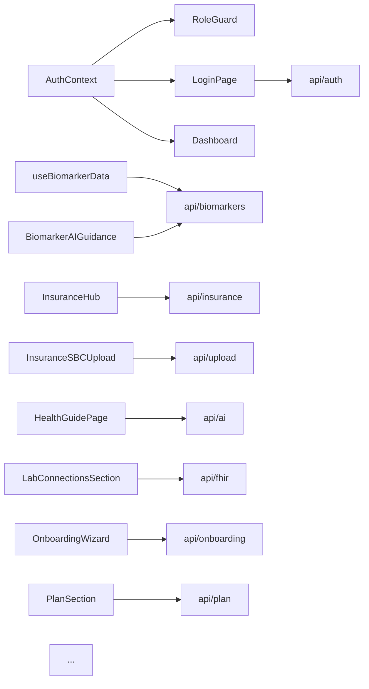

---
tags:
  - documentation
  - frontend
  - reference
type: prompt
priority: 2
updated: 2026-08-01
---

# Generate FRONTEND_MAP.md

## Required reading before generating

Before writing a single line, read:

1. [`_doc-quality.md`](./_doc-quality.md) — self-containedness, citation, TBD, cross-link, and format rules.
2. [`_verification-tools.md`](./_verification-tools.md) — Grep/Glob/Read cheat sheet.

This doc must pass the five tests in `_doc-quality.md` before you stop.

---

## Purpose

Produce `New Project Documents/FRONTEND_MAP.md` — the **component + context + API-service atlas** for the frontend. A Claude Project asked "where do I add a new biomarker input field?" or "which component renders the insurance hub?" must land on the answer via this doc alone.

---

## Files to review

| File | Why read it |
|---|---|
| `src/components/**/*.tsx` | 73 component files across 14 dirs (admin, analytics, auth, biomarkers, common, dashboard, files, health, insurance, onboarding, provider, settings, trends, upload) — enumerate and categorize. |
| `src/contexts/*.tsx` | `AuthContext.tsx`, `ThemeContext.tsx` — capture the provided state shape. |
| `src/services/api/*.ts` | 17 API modules + `index.ts` — each feeds one or more components. New modules: `ai`, `fhir`, `onboarding`, `plan`. |
| `src/services/api/client.ts` | Fetch wrapper (`apiFetch`) + token refresh / CSRF / plan-limit handling. NOTE: client uses native `fetch`, NOT axios — cite the implementation. |
| `src/App.tsx` (or `src/main.tsx`) | Root layout, routing / conditional rendering. |
| `src/components/dashboard/categoryRouting.ts` | In-app SPA path ↔ sidebar-category map (`pathToCategoryMap` / `categoryToPathMap`) for the dashboard's lightweight router. |
| `src/hooks/useRBAC.ts` (and `src/hooks/*`) | `useRBAC` powers `RoleGuard`; other hooks (`useModals`, `useBiomarkerData`, etc.) drive the dashboard. |
| `vite.config.ts` | Chunk splits (PDF, OCR, charts) — which components cause heavy chunks. |
| `src/types/*` | Shared TS interfaces that components consume. |
| `src/data/*` | Sample data, navigation config. |
| `src/__tests__/*` | Component tests reveal usage intent. |

---

## Required sections

1. **Overview** — 73 components across 14 dirs, routing approach (conditional rendering + URL special routes + dashboard `categoryRouting.ts` map — no react-router), state model (Context only, no Redux).
2. **Component directory catalog** — one H3 per directory (14 total: admin, analytics, auth, biomarkers, common, dashboard, files, health, insurance, onboarding, provider, settings, trends, upload). Each: purpose, top-level components, child components, state deps (which contexts), API service modules used, visual state (list/form/modal), route/URL it maps to.
3. **Routing / URL map** — table mapping URL (App.tsx special routes + dashboard `categoryRouting.ts` SPA paths, or conditional view state) → top-level component → feature.
4. **Context dependency graph** — Mermaid graph showing `AuthContext`, `ThemeContext` consumers.
5. **API client overview** — `src/services/api/client.ts` fetch wrapper (`apiFetch`), how it handles 401 refresh (`attemptTokenRefresh`), attaches CSRF header, and surfaces plan-limit errors (`isPlanLimitError`).
6. **API-to-component matrix** — table: API module → components that consume it. Include the new `ai`, `fhir`, `onboarding`, `plan` modules.
7. **Chunk-split components** — which components trigger code-splits (per `vite.config.ts` `manualChunks`: `pdf`, `ocr`, `charts`). Also note App.tsx / Dashboard.tsx route-level `lazy()` splits.
8. **Notable patterns** — `RoleGuard` wrapper (backed by `useRBAC`), form validation library, error display (`ErrorToast`/`SuccessToast`), loading states (`LoadingFallback`/`PageLoadSpinner`) — identify and quote.
9. **Drift findings** — unused components, API modules with no consumers, duplicate functionality (e.g., `InsuranceSBCUpload` vs `EnhancedInsuranceUpload`).
10. **Related Documents**.
11. **Prompt drift log**.

---

## Required artifacts

### Context / API / Component Mermaid graph



Keep it scannable — do not try to fit all 73 components in one diagram. Produce 3-4 sub-graphs (auth + onboarding, biomarkers + trends + AI guide, insurance + expenses, settings + provider + admin) if needed.

### Per-directory template

```markdown
### `src/components/biomarkers/`

Purpose: biomarker display, entry, history, AI guidance.

Top-level components (`file → purpose`):

| Component | File:line | Renders | Consumes contexts | Calls API |
|---|---|---|---|---|
| `BiomarkerSummary` | `src/components/biomarkers/BiomarkerSummary.tsx:Lx` | Category summary list | (props/hooks) | — (data via `useBiomarkerData`) |
| `AddMeasurementModal` | `...:Lx` | Manual entry form | (props/hooks) | — (mutations via parent/hook) |
| `BiomarkerActionPlan` | `...:Lx` | Static action-plan card for out-of-range markers | — | — (no API; computes from biomarker + insurance props) |
| ... | ... | ... | ... | ... |

Verify the real component filenames with `Glob "src/components/biomarkers/*.tsx"` — there is NO `BiomarkerList`/`BiomarkerEntry` file; the dir holds `AddMeasurementModal`, `BiomarkerActionPlan`, `BiomarkerChart`, `BiomarkerGraph`, `BiomarkerInsurancePanel`, `BiomarkerRangeBar`, `BiomarkerSummary`, `TrendModal`. Note: components in `biomarkers/` do NOT call `biomarkersApi` directly — data flows through hooks (`useBiomarkerData`, `useBiomarkerStats`, `useBiomarkerTrends`) and the dashboard. The real AI-guidance display is `BiomarkerAIGuidance` (in `trends/`), which calls `biomarkersApi.getGuidance(id)`; verify the exact call site before filling the "Calls API" column.

Form validation: (Zod? react-hook-form? manual?) — cite the import.

Route/URL: conditional render via dashboard category state — cite `categoryRouting.ts` / `Dashboard.tsx:Lx` (not a react-router path).

Related API routes: `GET /biomarkers`, `POST /biomarkers`, `POST /biomarkers/:id/guidance` — see [`API_REFERENCE.md#biomarker-endpoints`](./API_REFERENCE.md).
```

### URL / route map

There is NO react-router. Two routing layers, both verify against real code:

**(a) App.tsx special URL routes + unauthenticated view state** (cite `App.tsx`):

| Path / view state | Top-level component | Feature | Requires auth |
|---|---|---|---|
| `authView === 'login'` | `LoginPage` | Auth | no |
| `authView === 'register'` | `RegisterPage` | Auth | no |
| `authView === 'forgot-password'` | `ForgotPasswordPage` | Auth | no |
| `/verify-email?token=` | `VerifyEmailPage` | Email verification | no |
| `/reset-password?token=` | `ResetPasswordPage` | Password reset | no |
| `/confirm-email-change?token=` | `ConfirmEmailChangePage` | Email-change confirm | no |
| (authenticated) | `Dashboard` | App shell | yes |

**(b) In-app dashboard SPA paths** (cite `src/components/dashboard/categoryRouting.ts`) — all require auth, all render inside `Dashboard`:

| Path | Sidebar category | Top-level component |
|---|---|---|
| `/` | Overview / Dashboard | `DashboardContent` |
| `/insurance` | Insurance | `InsuranceHub` |
| `/knowledge-base` | Knowledge Base | `InsuranceKnowledgeBase` |
| `/files` | Files | `FilesPage` |
| `/trends` | Trends | `TrendsPage` |
| `/goals` | Goals | `GoalTrackerPanel` |
| `/needs` | Needs | `HealthNeedsPage` |
| `/health-guide` | Health Guide | `HealthGuidePage` |
| `/care-team` | Care Team | `CareTeamPage` |
| `/my-patients` | My Patients | `MyPatientsPage` |
| `/admin` | Admin | `AdminPage` |
| `/settings` | Account Settings | `AccountSettingsPage` |

Describe the conditional-rendering state pattern and cite `App.tsx` (auth views) plus `Dashboard.tsx` + `categoryRouting.ts` (in-app nav).

### API-to-component matrix

Enumerate all 17 modules (each export is `<domain>Api`, re-exported from `api/index.ts`):
`authApi`, `biomarkersApi`, `insuranceApi`, `healthNeedsApi`, `healthGoalsApi`, `uploadApi`,
`providerApi`, `patientApi`, `adminApi`, `aiApi`, `settingsApi`, `filesApi`, `onboardingApi`,
`planApi`, `fhirApi`, `expensesApi` (+ `client.ts` core helpers).

| API module | Key functions | Consumed by (component file list) |
|---|---|---|
| `api/auth.ts` (`authApi`) | `login`, `logout`, `register`, `demoLogin` | `LoginPage`, `RegisterPage`, `VerifyEmailPage`, `AuthContext` |
| `api/biomarkers.ts` (`biomarkersApi`) | `getAll`, `getHistory`, `create`, `update`, `delete`, `getGuidance` | `useBiomarkerData` (hook), `BiomarkerAIGuidance` (verify consumers with `Grep "biomarkersApi"` — biomarker display/entry components get data via hooks, not direct calls) |
| `api/ai.ts` (`aiApi`) | streaming chat | `HealthGuidePage`, `BiomarkerAIGuidance` |
| `api/fhir.ts` (`fhirApi`) | lab connections / sync | `LabConnectionsSection` |
| `api/onboarding.ts` (`onboardingApi`) | `getStatus`, step completion | `OnboardingWizard`, `Dashboard` |
| `api/plan.ts` (`planApi`) | current plan / usage | `PlanSection` |
| ... | ... | ... |

### Chunk-split components

| Chunk (from `vite.config.ts` `manualChunks`) | Components pulling it | Reason |
|---|---|---|
| `pdf` (pdfjs-dist, jspdf, pdf-lib, html2canvas-pro) | `InsuranceSBCUpload`, `EnhancedInsuranceUpload`, `PDFUploadModal`, `FileCard`, `ExportMenu` | Large lib, lazy-loaded |
| `ocr` (tesseract.js, tesseract.js-core) | upload/extraction path (check `ClinicalFileUpload`, `LabUploadModal`) | OCR feature |
| `charts` (recharts, d3-*, victory-vendor) | `BiomarkerChart`, `BiomarkerGraph`, `TrendSparkline`, `TrendDetailModal` | Lazy-load analytics |

Note: top-level pages are also route-split via `lazy()` in `App.tsx` (auth pages, `Dashboard`) and `Dashboard.tsx` (InsuranceHub, FilesPage, TrendsPage, AccountSettingsPage, GoalTrackerPanel, HealthNeedsPage, HealthGuidePage, OnboardingWizard, CareTeamPage, MyPatientsPage, AdminPage) — these are per-route chunks, separate from the `manualChunks` vendor splits above.

---

## Acceptance questions

After writing the doc, self-answer each **using only the doc**:

1. Which directory contains insurance-related components?
2. Which component renders the biomarker summary, and which API function does it call?
3. What context does `DashboardHeader`/`DashboardSidebar` consume, and for what state?
4. How does a component get the current user's role? (cite the `useRBAC` hook + `AuthContext` file:line)
5. Which components are gated to PROVIDER / ADMIN users (e.g., `CareTeamPage`, `MyPatientsPage`, `AdminPage`), and via what guard (`RoleGuard`/`useRBAC`)?
6. Where is the AuthContext defined, and what does it expose? (user{id,email,role}, isAuthenticated, isLoading, login, register, logout, error, setError, clearError)
7. Which API module handles SBC upload, and which component uses it?
8. Which components are in the `pdf` chunk, and why?
9. How many total `.tsx` files exist in `src/components/`, and across how many directories?
10. What's the routing approach (react-router, conditional, other)? (Answer should name App.tsx view state + `categoryRouting.ts`.)
11. Which component handles account deletion and consent revocation?
12. Which component displays an AI guidance response, and how does error state look?
13. Is there a shared form library used across the codebase, or is each form hand-rolled?
14. Which components subscribe to `ThemeContext`?
15. Which component drives the onboarding wizard, and which API module feeds it?
16. Which component manages Quest/FHIR lab connections, and which API module (`fhirApi`) does it call?
17. Which component shows the user's plan tier / usage, and which API module (`planApi`) backs it?
18. Which component handles the email-change flow (request + confirm), and what are the two components involved (`ChangeEmailModal`, `ConfirmEmailChangePage`)?
19. Which component manages notification preferences (`NotificationSettingsSection`)?

---

## No-TBD enforcement

Before marking anything TBD:

- **Component enumeration**: `Glob pattern: "src/components/**/*.tsx"` (expect **75 across 15 dirs** as of 2026-08-01 — the 15th is `legal/`, added 2026-06-21 with the registration-consent flow, OMH-L04). Re-derive rather than inheriting.
- **Contexts**: `Glob pattern: "src/contexts/*.tsx"` + read each (`AuthContext`, `ThemeContext`).
- **API modules**: `Glob pattern: "src/services/api/*.ts"` + read each (**18 + `index.ts`** as of 2026-08-01 — `pagination.ts` was added 2026-06-20 when the provider patient-PHI list endpoints were paginated and the client pager was deduped).
- **Hooks**: `Glob pattern: "src/hooks/*.ts"` + read each (8 + `index.ts`). `useFocusTrap.ts` (added 2026-06-20) is load-bearing for accessibility — 15 component files consume it (14 bespoke overlays + `common/Modal`). Map its consumers; see prompt [47](./47-accessibility.md).
- **Consumer mapping**: for each API export, `Grep pattern: "biomarkersApi\\.|insuranceApi\\.|aiApi\\.|fhirApi\\.|onboardingApi\\.|planApi\\." etc.` over `src/**` to enumerate callers.
- **Context consumers**: `Grep pattern: "useAuth\\(\\)|useRBAC\\(\\)|useContext\\(AuthContext\\)"` over `src/**` (role access flows through the `useRBAC` hook, not direct `useContext`).
- **Routing**: open `src/App.tsx` (auth view state + special routes) AND `src/components/dashboard/categoryRouting.ts` + `Dashboard.tsx` (in-app SPA paths); there is no react-router.
- **Chunk splits**: read `vite.config.ts` `manualChunks` (`pdf`, `ocr`, `charts`) and the `lazy()` calls in `App.tsx` / `Dashboard.tsx`.

If a claim requires running the app (e.g., "this component is slow to render"), that's not in scope — stay structural.

---

## Cross-links

The generated `FRONTEND_MAP.md` must link to:

- [`ARCHITECTURE.md`](./ARCHITECTURE.md) — full-stack diagram.
- [`API_REFERENCE.md`](./API_REFERENCE.md) — API endpoints each module calls.
- [`ROUTING_TABLE.md`](./ROUTING_TABLE.md) — backend-side middleware for each endpoint.
- [`LOCAL_DEV.md`](./LOCAL_DEV.md) — dev server + chunking.
- [`TESTING_PATTERNS.md`](./TESTING_PATTERNS.md) — frontend test recipes.

---

## Verification (tool usage)

| Task | Tool | How |
|---|---|---|
| Enumerate components | Glob | `pattern: "src/components/**/*.tsx"` |
| Enumerate contexts | Glob | `pattern: "src/contexts/*.tsx"` |
| Enumerate API modules | Glob | `pattern: "src/services/api/*.ts"` |
| Find context consumers | Grep | `pattern: "useAuth|useRBAC|useContext"` over `src/**` |
| Find API consumers | Grep | per module name (e.g., `pattern: "biomarkersApi|insuranceApi|fhirApi"`) |
| Read routing | Read | `src/App.tsx`, `src/components/dashboard/categoryRouting.ts`, `src/components/dashboard/Dashboard.tsx` |

---

## Output: file and location

Write the final document to `New Project Documents/FRONTEND_MAP.md`.
